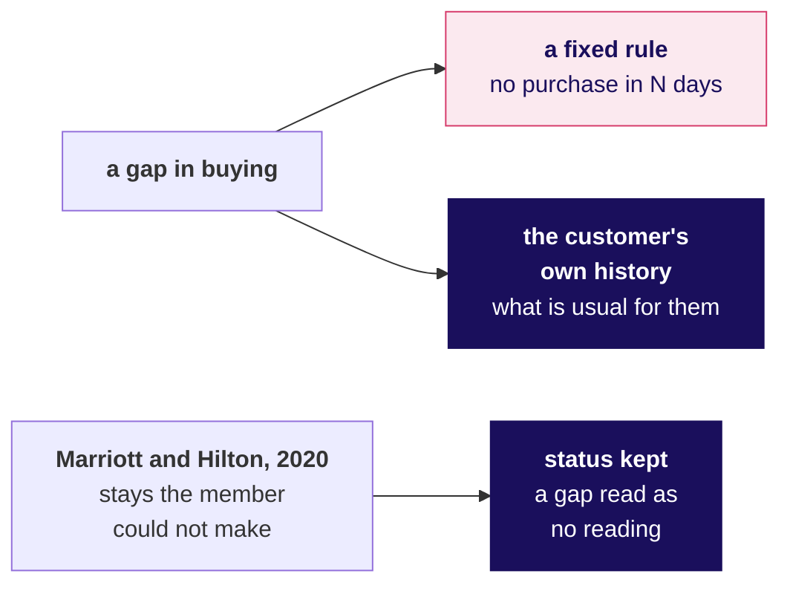
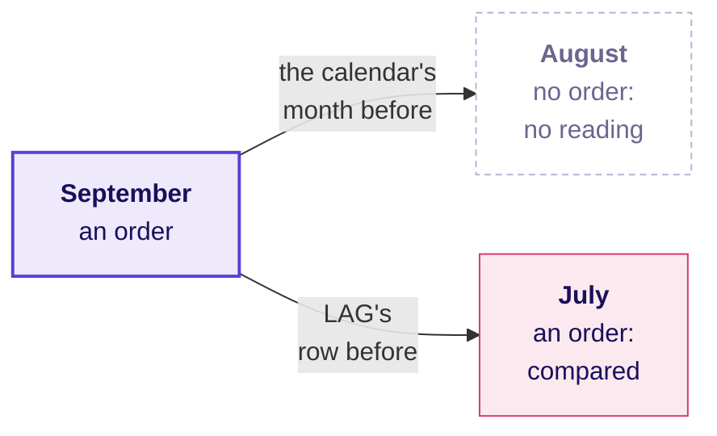
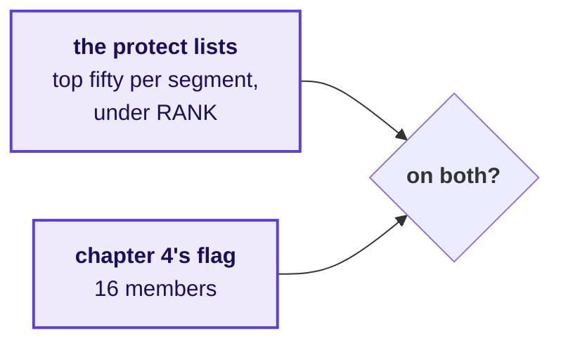
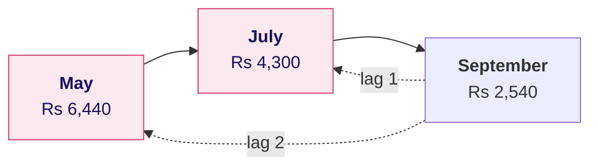
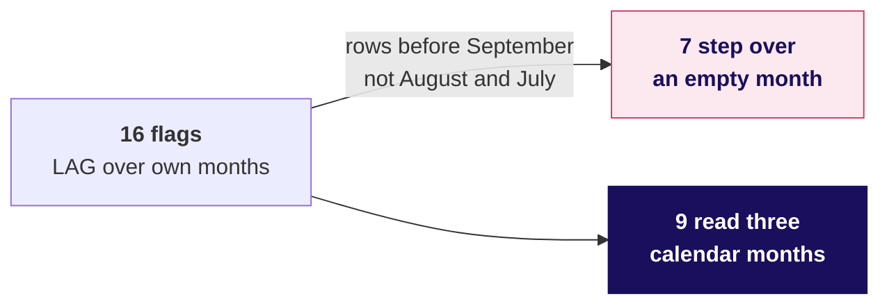
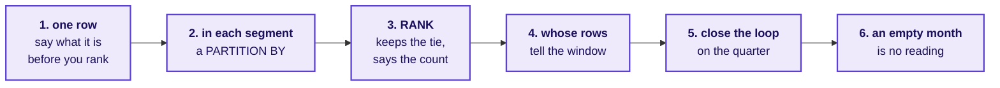
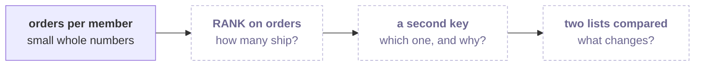
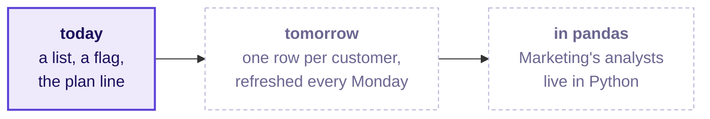

# Who does Marketing call first?

Week 2, Day 3. Afternoon.

Kicker: WEEK 2  ·  WEDNESDAY  ·  AFTERNOON
Quote: Before we ring anyone: one of your flagged members, C-0216, rang our help line to say they were travelling in August and have not stopped buying. Is your flag wrong about them, and how many others?
Who: The head of Retail-Plus, Kalpa Retail, to the data and AI team at Kalpa's Global Capability Centre

```notes
LIVE, one minute. Read the head of Retail-Plus's words aloud. The morning built the protect lists,
the falling flag and the plan line; the afternoon decides who Marketing rings first and hands the
room a case to run alone. The trainer's part of the afternoon is 60 minutes: chapter 6 (30), the
escalated case's first two parts (20) and the Kahoot (10). The tentative IITGN block follows. Then
what the morning established.
```

---

## S1. The morning answered five questions with numbers
*What did the morning's five chapters establish, with their numbers?*

| Chapter | What it answered |
|---|---|
| 1. Who are the top fifty? | One list across the book: 35 Business, 11 Retail-Plus, 4 Retail-Core, no Student |
| 2. Top fifty per segment? | PARTITION BY segment: fifty, or every buyer, in each segment |
| 3. Who makes it at a tie? | RANK, with the count and its reason; DENSE_RANK can run past the line |
| 4. Whose spend is falling? | 16 members, with each member's months kept apart; 20 without |
| 5. On track against plan? | Q2 closed Rs 10 ahead; Rs 1.58 crore ahead at mid-quarter, from one July week |

```notes
LIVE, 2 minutes. Read the five answers as one story. Q2 is July to September 2026; revenue is
booked revenue, every order at its amount whatever its status, Rs 9,84,00,000 for the quarter.
Then chapter 6.
```

---

## SECTION 6: Who does Marketing call?
*Which listed members does Marketing call first, and does each flag hold up when a member says they were on holiday?*

```notes
LIVE. Thirty minutes: the need and the company (4), the options and the call (5), the list and
the member on holiday (6), the trap, its check and its fix (8, never cut), the second route (3),
the calls (2) and the close (2). Notebook 6 and sql/C2_W02_D03_06_call_first_STUDENT.sql run
beside it.
```

---

## S2. Answered in six questions, before the first call
*Who needs this answer, and which questions lead to it?*

**Who needs the answer.** The member team rings the flagged members on the protect lists this week, and the head of Retail-Plus answers to the tier's members for every call. A call that tells a loyal member their spend is falling when they were away costs their goodwill and maybe their renewal.

```timeline
label: 1 | title: Which reading of last month? | body: Four ways, sized
label: 2 | title: How many flagged are listed? | body: The list meets the flag
label: 3 | title: What did LAG compare? | body: The member on holiday
label: 4 | title: How many flags skip a month? | body: The check on all sixteen
label: 5 | title: Does a calendar join agree? | body: No window at all
label: 6 | title: Who goes first? | body: The calls Marketing makes | tone: dark
```

```notes
LIVE, 1 minute. Read the six questions. Then the need.
```

---

## S3. The member team rings flagged members this week
*Who asks, what is measured, and what does a wrong call cost?*

```cards
icon: crown | eyebrow: Who asks | title: The head of Retail-Plus | body: Answers to the tier's members for every call the member team makes.
icon: calendar | eyebrow: The metric | title: The falling flag | body: September below August, and August below July: three calendar months, each lower.
icon: triangle-alert | eyebrow: A wrong call costs | title: A loyal member accused | body: Their goodwill, maybe their renewal, and a week of calls spent on false alarms. | tone: dark
```

**The client asks.** "Is your flag wrong about them, and how many others?"

```notes
LIVE, 2 minutes. The member is C-0216 of Retail-Plus. Monthly spend is a member's booked revenue in
one calendar month; a month with no order has no row in the monthly table. Then a data team that
warned about gaps, and hotels that read one.
```

---

## S4. Shopify warned against a fixed gap rule
*Has a real company had to decide what a gap in a customer's buying means?*



**What breaks.** Shopify's data team wrote that "far too often businesses define churn as no purchases after N days"; a gap has to be read against the customer's own history.

```notes
LIVE, 2 minutes. Cam Davidson-Pilon, "How Shopify Merchants can Measure Retention", Shopify
Engineering, 14 November 2017, checked 1 October 2026. Marriott extended elite status earned in
2019 until February 2022 (release of 14 April 2020), and Hilton extended status to 31 March 2022
for members set to downgrade in 2020 or 2021 (release of 27 October 2020). Then four readings of
"last month".
```

---

## S5. LAG with a calendar check: 752 rows, no zeros
*Which ways could the flag read "last month", and what would each cost?*

| Option | "Last month" is | Rows | A month with no order |
|---|---|---|---|
| A. LAG over own months | the member's last buying month | 752 | stepped over |
| B. LAG with a calendar check | the calendar month before | 752 | breaks the run |
| C. Calendar, zero-filled | the calendar month before | 1,806 | a fall to zero |
| D. Calendar, left empty | the calendar month before | 1,806 | no reading |

**The call.** B: the rows that exist, plus two columns. What would switch it: Marketing also wanting "went quiet" as its own signal, which D's calendar makes into rows a query can count.

```notes
LIVE, 4 minutes. Members buy in 2.5 of the six months on average, 752 member-months for 301
members, so a month with no order is the usual state. A zero-filled calendar flags 26 members, 17
of whom simply placed no September order. 1,806 is 301 members times six months. Then the picture.
```

---

## S6. The two readings agree only with no empty month
*What does "the month before" mean for a member who skipped a month?*



```notes
LIVE, 1 minute. "The month before" has two readings: the calendar's, and the row LAG reads. They
agree only when no month is empty. Then the list meets the flag.
```

---

## S7. Question: how many flagged members are listed?
*How many of the flagged members are on the protect list?*



**Question.** How many of chapter 4's 16 flagged members are on a protect list, as a letter? a) all 16; b) about half; c) none, since the list is about spend and the flag about falls; d) it cannot be known without the tie rule.

```notes
LIVE, 2 minutes. Letters in chat. Then the answer.
```

---

## S8. Answer: all 16, so the call sheet reads 16 names
*How many of the flagged members are on the protect list?*

```stats
value: 16 | label: members flagged | note: chapter 4's partitioned LAG
value: 16 | label: on a protect list | note: each segment's top fifty under RANK
```

**The check.** A member whose spend can fall twice from a high month is a member who spent a lot, so the flag sits inside the lists.

```notes
LIVE, 1 minute. The answer is a. Then the member on holiday.
```

---

## S9. Question: which month did LAG call last month?
*What did LAG compare for the member who says they were on holiday?*

| Month | Apr | May | Jun | Jul | Aug | Sep |
|---|---|---|---|---|---|---|
| C-0216, Rs | none | 6,440 | none | 4,300 | none | 2,540 |

**Question.** C-0216 of Retail-Plus stands at place 23 on the Retail-Plus list. Which month did LAG treat as "last month" for C-0216's September, as a letter? a) August; b) July; c) June; d) none, since their August is empty.

```notes
LIVE, 2 minutes. Read C-0216's row aloud: three months with orders and three without. Letters in chat.
Then the answer.
```

---

## S10. Answer: July, four months from May to September
*What did LAG compare for the member who says they were on holiday?*



**The check.** There is no August row, so LAG compared September with July and July with May. Chapter 4's flag called that two months of falls; C-0216's rows say August is simply empty.

```notes
LIVE, 2 minutes. The answer is b. Then the hurried reply to the head of Retail-Plus.
```

---

## S11. The plausible wrong answer: sixteen calls
*What does Marketing get if chapter 4's flag ships as it stands?*

```stats
value: 16 | label: calls | note: each told their spend fell two months running
value: 1 | label: of them | note: the member on holiday, among others
```

**What breaks.** The hurried reply to the head of Retail-Plus is that C-0216 did spend less with each order, and every one of the sixteen gets the same call.

```notes
LIVE, 2 minutes, notebook 06, section 3. Ask the room whether they would defend the flag as it
stands. Then why it is wrong.
```

---

## S12. Why it is wrong: 7 of 16 flags skip a month
*How many of the sixteen flags step over a month with no order?*



**The check.** Carry lag(month) beside lag(spend) and count the flags whose two rows before September are not August and July: seven, C-0216 among them.

```notes
LIVE, 3 minutes. Marketing asked about calendar months, and LAG counts rows. Wherever a member
skipped a month, LAG steps over the gap, so a holiday reads as a fall. Then the fix.
```

---

## S13. The fix: nine members, three months each lower
*What changes when the flag checks the calendar?*

```sql
AND month_1_back = DATE '2026-08-01'
AND month_2_back = DATE '2026-07-01'
```

```stats
value: 9 | label: members flagged | note: three consecutive months, each lower
value: 7 | label: calls not made | note: the member on holiday among them
```

**What changed.** Every call that goes out now describes three consecutive months that each fell, months the member can check on their own statement.

```notes
LIVE, 2 minutes. Then a second route that shares no window.
```

---

## S14. A second route: a calendar join keeps the same 9
*Does a join on calendar months find the same members?*

```sql
SELECT sep.customer_id
FROM   monthly sep
JOIN   monthly aug ON aug.customer_id = sep.customer_id AND aug.month = DATE '2026-08-01'
JOIN   monthly jul ON jul.customer_id = sep.customer_id AND jul.month = DATE '2026-07-01'
WHERE  sep.month = DATE '2026-09-01' AND sep.spend < aug.spend AND aug.spend < jul.spend;
```

```stats
value: 9 = 9 | label: members | note: the same ones as the checked LAG
```

```notes
LIVE, 3 minutes. A missing month has no row to join to, so a gap breaks the run here by
construction. The two routes share no window and agree because both read calendar months. Then the
calls.
```

---

## S15. Marketing rings the nine; C-0010 shows why
*Who does Marketing call first?*

| C-0010, Retail-Core, place 1 | July | August | September |
|---|---|---|---|
| Monthly spend | Rs 7,840 | Rs 4,080 | Rs 1,990 |

**The client asks.** "Who do we ring first?" All nine flagged members are on a protect list. Run block c6_call_list in your own notebook and read the nine before you write the line to Marketing.

```notes
LIVE, 2 minutes. C-0010 is a fall that holds up: three consecutive months, each lower. The nine are
the room's to read in notebook 06's last your-turn cell: their segments, their places and how far
each fell. Do not read the list aloud. Then the chapter's answers.
```

---

## S16. Nine calls, and a month with no order is no reading
*So which listed members does Marketing call first, and does each flag hold up?*

| The question on the way | The answer |
|---|---|
| 1. Which reading of last month? | LAG with a calendar check: 752 rows, no zeros |
| 2. How many flagged are listed? | All 16 of chapter 4's flag |
| 3. What did LAG compare? | September with July and July with May |
| 4. How many flags skip a month? | 7 of 16; the check keeps 9 |
| 5. Does a calendar join agree? | Yes, the same nine |
| 6. Who goes first? | The nine; the member on holiday is not one |

**Kavya's review.** "A month with no order is no reading. Write that into the flag's definition, and read the rows behind a flag before a call goes out."

**In the interview.** [D] A member says they were on holiday and should not be flagged: how does your definition treat a month with no orders, and why not fill it with zero?

```notes
LIVE, 2 minutes. One breath: a month with no order breaks the run, checked by reading the months LAG
read; zeros would read a quiet month as a fall, and Kalpa's members buy in 2.5 of six months, so
zeros flag 26 here, 17 of them for a quiet September. Then the case the room runs alone.
```

---

## SECTION 7: Can you do it alone?
*What does Marketing get on Monday: each segment's list with its count, the members to ring first, the share of revenue the lists carry, and Q2 against plan?*

```notes
LIVE. Twenty minutes, alone: parts 1 and 2 of the escalated case. Parts 3 to 5 run in the TA-led
practice lab. The notebook is notebooks/C2_W02_D03_ex1_escalated_case_STUDENT.ipynb and the brief
exercises/unguided/C2_W02_D03_escalated_case_STUDENT.md.
```

---

## S17. Answer it in five parts: two now, three in the lab
*Which parts does the case ask for, and which runs where?*

**The client asks.** "We start calling on Monday. Send me each segment's protect list under the head of Retail-Plus's rule, with its count; the members we ring first; how much of each segment's Q2 revenue the lists cover; and one line Meera can take into the leadership meeting on whether Q2 is on track."

```timeline
label: Part 1, now | title: Each segment's list | body: The head's rule and each count
label: Part 2, now | title: The members to ring | body: Three calendar months, each lower
label: Part 3, lab | title: The share each list carries | body: Of its own segment's revenue
label: Part 4, lab | title: Q2 against plan | body: By the total and week by week
label: Part 5, lab | title: The lines to send | body: To Marketing and to Meera | tone: dark
```

```notes
LIVE, 3 minutes. Read the marketing lead's message. Each part holds two lettered markers; each
marker is a choice the learner writes into the code, and the check cell after it says whether the
part behaves. Seventeen minutes alone; the support TA answers environment problems only.
```

---

## S18. Every choice is yours, and the checks read it
*Which rules does the case have to keep, whatever the numbers turn out to be?*

```cards
icon: list-ordered | eyebrow: Part 1 | title: The head's rule | body: Members who spent the same share a place, and each list's count is said with its reason.
icon: calendar | eyebrow: Part 2 | title: Calendar months | body: A flag reads July, August and September, each lower; a month with no order breaks the run.
icon: circle-check | eyebrow: Every part | title: Close every loop | body: Counts against buyers, flags against their own months, the running total against the quarter. | tone: dark
```

```notes
LIVE, 2 minutes. The cards repeat the morning's rules and give away none of the case's answers.
Then go: seventeen minutes, parts 1 and 2. After the case, the close.
```

---

## SECTION 8: What do we tell Marketing?
*What did the day answer, and what does the growth team ask next?*

```notes
LIVE. Ten minutes: the day's answer (2), the six lines (1), the Kahoot (6) and tomorrow (1).
```

---

## S19. Answer: RANK lists, nine calls, Q2 on plan
*Which members should Marketing protect before they drift, and is Q2 on track against the plan line?*

**The client asks.** "Who do we protect, who do we ring first, and are we on track?"

> "Each segment's list is its top fifty by Q2 revenue under RANK, so members who spent the same share a place, with every list's count and its reason. Ring the nine members whose spend fell in August and again in September first. Q2 closed on plan, Rs 10 ahead, and the Rs 1.58 crore lead at mid-quarter came from one July week, so the weekly run rate has sat below plan since 10 August."
> The day's answer, to Marketing and the head of Retail-Plus

```notes
LIVE, 2 minutes. Ask two learners to read their own line first, including the Retail-Plus count
their run gave and its reason; then read this one. Then the six lines worth keeping.
```

---

## S20. Six lines worth keeping, one per chapter
*Which line does each chapter leave Marketing's list with?*



1. Say what one row of the list is before you rank it: fifty orders named only 28 members.
2. "In each segment" is a PARTITION BY: fifty, or every buyer, in each segment.
3. RANK keeps a tie at the line and says the count; DENSE_RANK can run past the line with no tie at it.
4. Tell the window whose rows belong together, or LAG reads another member's month.
5. A running total is done when its last value equals the quarter's total.
6. A month with no order is no reading: check that LAG read the calendar months before.

```notes
LIVE, 1 minute. Read them together. The cheat sheet prints these six lines word for word. Then the
Kahoot.
```

---

## S21. The Kahoot: eight items, none of them graded
*Which of the day's decisions can the room make in twenty seconds each?*

| Item | What it asks |
|---|---|
| 1 | ROW_NUMBER, RANK and DENSE_RANK on a two-way tie |
| 2 | What PARTITION BY restarts |
| 3 | What LAG returns on a member's first month |
| 4 | Which ORDER BY makes a running total repeatable |
| 5 | What ROW_NUMBER does to a tie at the line |
| 6 | The function for "ties ranked the same" |
| 7 | A month with no order, read by LAG |
| 8 | Tuesday, one level up: a LEFT join grew the rows |

```notes
LIVE, 6 minutes, kahoot/C2_W02_D03_quiz_STUDENT.md. Twenty seconds an item; after each, one learner
says why the right answer holds. Item 8 is Tuesday's return question. Then tomorrow's ask, left open.
```

---

## D22. The interview drill, for the lab: ten questions
*Which staple and frequent interview questions does today equip you to answer?*

| Tag | Question |
|---|---|
| [S] | RANK, DENSE_RANK and ROW_NUMBER on a tie. |
| [S] | Top-3 per group: GROUP BY or a window, and why? |
| [S] | What is the difference between GROUP BY and a window function? |
| [F] | How would you find customers whose spend fell two months in a row? |
| [F] | Why can a window function not sit inside WHERE, and what do you do instead? |
| [F] | A top-fifty list has fifty rows but twenty-eight names: what happened? |
| [F] | Your top-ten list came back with eleven rows: is it a bug? |
| [F] | LAG returned a value for a customer's very first month: what went wrong? |
| [F] | What makes a running total deterministic, and how would you notice one that was not? |
| [F] | Revenue to date is nine times the plan by week seven: what is the likely mistake? |

```notes
SELF-STUDY, and the practice lab's drill. [S] is a staple asked everywhere and [F] frequent at global
capability centres and product companies; D23 carries the three differentiators. Each question is
answered in full in its chapter's notebook and in the study notes; in the lab, pairs ask each other
aloud.
```

---

## D23. The interview drill, for the lab: three to finish
*Which differentiator questions close the drill?*

| Tag | Question |
|---|---|
| [D] | The business says ties rank the same: which function, and how many rows might the top-N report ship? |
| [D] | A member was on holiday: how does your flag treat a month with no orders, and why not zero? |
| [D] | Your running total closes below the quarter's total: what do you check first? |

Each one asks for a judgment the day's numbers support: the count a tie rule ships, the month with no
order, and the running total that has to close on the quarter's own total.

```notes
SELF-STUDY, and the practice lab's drill, asked last. [D] marks a differentiator. The answers are in
chapter 3's, chapter 6's and chapter 5's notebooks and in the study notes.
```

---

## D24. The second case, for the take-home: Retail-Core
*Should Retail-Core's protect list rank members by how often they ordered in Q2, instead of by how much they spent?*

**The client asks.** "Frequency is what fell in Retail-Plus. Before it spreads, I want Retail-Core's top fifty ranked by how often members ordered in Q2. Same rule as the head of Retail-Plus: ties ranked the same, and tell me how many made it."



```notes
SELF-STUDY, in pairs or alone, about forty minutes. The notebook is
notebooks/C2_W02_D03_ex2_second_case_STUDENT.ipynb and the brief
exercises/unguided/C2_W02_D03_second_case_STUDENT.md.
```

---

## D25. The day's wrong numbers, each with its check
*Which plausible wrong numbers did the day stage, and what caught each?*

| Chapter | The wrong number | The check that caught it |
|---|---|---|
| 1 | 50 rows naming 28 members | Count members beside rows |
| 2 | Retail-Plus 11, Student none | Fifty, or every buyer, per segment |
| 3 | Retail-Core's "top fifty" of 52 | Read the functions side by side at the line |
| 4 | 20 flagged, 4 borrowed | Carry the id LAG read |
| 5 | Q2 Rs 15,39,810 short of plan | The last to-date against Monday's total |
| 6 | 16 calls, 7 over an empty month | Carry the month LAG read |

```notes
SELF-STUDY, and the lab's debrief of the room's wrong answers. Each line is a trap the day staged on
purpose, and the room met each wrong number before anyone named the mistake.
```

---

## S26. Tomorrow: one table per customer, left open
*The growth team asks the next question: what does Marketing's own table look like?*

**The client asks.** "We want one table with one row per customer, refreshed every Monday: how recently they bought, how often, how much, their segment, whether the monsoon sale reached them, and last week's flags."



```notes
LIVE, 1 minute. Read it and leave it open: today's flag becomes a column of tomorrow's table. The
pre-read for Thursday ships tonight. Then the tentative IITGN block.
```
