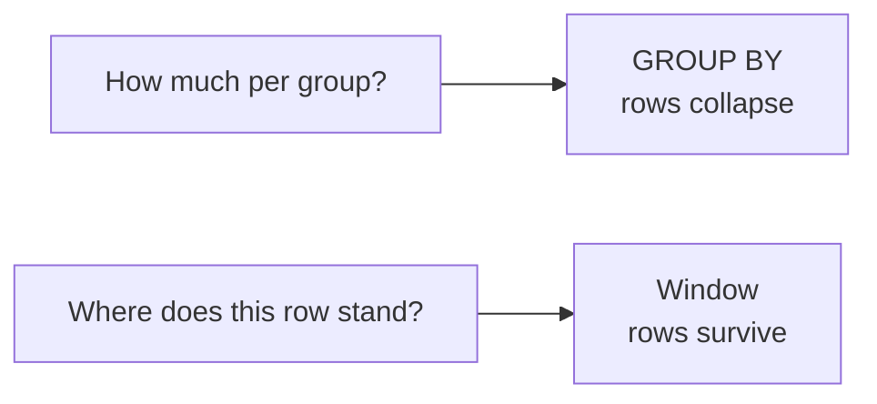
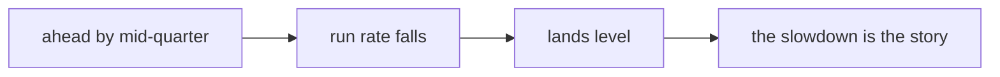

# Study notes: Wednesday, the tie decides the day

## The situation you were in

Marketing is working with you now rather than around you, and the ask follows from your own
finding:

> "Retail-Plus frequency is the problem, so we want to protect our best members before they drift.
> Give us the top fifty customers by Q2 revenue in each segment, and flag anyone whose monthly
> spend has fallen for two months running."

Meera wanted a third thing: revenue accumulating week by week against the plan line, so the
quarter can be read at halfway rather than at the end.

And the head of Retail-Plus added a condition that turned out to decide the whole day:

> "Ties matter. If two members spent the same, I want them ranked the same, and I want to know how
> many made the top fifty, not forty-nine because of a tie."

## Why GROUP BY could not do it

`GROUP BY` answers how much per group, and the rows collapse. Marketing's questions keep the rows
and ask about each row's neighbours: its rank within its segment, its own previous month, the
total so far.



`LIMIT 50` does not help, because it takes fifty rows from the whole result rather than fifty from
each segment. There is no clause in Monday's vocabulary that says "the best fifty within a group".

## What a window is

```sql
rank() OVER (PARTITION BY segment ORDER BY revenue DESC)
```

`OVER` is the whole idea and it has two dials. `PARTITION BY` says which rows count as neighbours.
The window's own `ORDER BY` says in what order they are considered.

Those are not decoration on a function name. They are the definition of the question, and changing
either changes the answer.

## Three functions, one tie

| Function | On a tie | After the tie | Repeatable |
|---|---|---|---|
| `ROW_NUMBER` | Breaks it arbitrarily | 1 2 3 | No |
| `RANK` | Gives both the same | Skips: 1 1 3 | Yes |
| `DENSE_RANK` | Gives both the same | Does not skip: 1 1 2 | Yes |

A way to hold the difference that survives an interview: `RANK` answers how many rows are ahead of
me, `DENSE_RANK` answers how many distinct levels are ahead of me.

## The tie sat exactly where it hurt

Two Retail-Plus members have identical Q2 revenue, and they occupy positions fifty and fifty-one.
Nobody engineered that for a slide. It is what happens when fifty is a round number somebody picked
and revenue is measured in rupees.

| Filter | Names shipped |
|---|---|
| `ROW_NUMBER <= 50` | 50 |
| `RANK <= 50` | 51 |
| `DENSE_RANK <= 50` | 52 |

Three defensible answers to one question. The head of Retail-Plus had already ruled out two of
them in a single sentence: ranked the same kills `ROW_NUMBER`, not forty-nine kills cutting the
tie off. `RANK` ships fifty-one names and the extra name is the point rather than a rounding
error.

That sentence belongs in the query as a comment, because the next person will not have heard him
say it.

## The second argument against ROW_NUMBER, which is the better one

Run the `ROW_NUMBER` version twice against unchanged data and the two tied members can swap.
Nothing in the data separates them, so nothing in the plan has to keep them in order: a parallel
scan, an added index or a vacuum can change which one comes first.

The list is not reproducible. Two analysts running the same query hand Marketing different names.
That argument has nothing to do with fairness and it is the one that convinces engineers.

## The error that sent you back to Monday

```
ERROR:  window functions are not allowed in WHERE
```

`WHERE` runs before the window is computed, which is the same execution order that refused an
aggregate in `WHERE` on Monday. Compute the window in an inner query or a CTE and filter outside
it.

## LAG, and what NULL is telling you

```sql
lag(spend, 1) OVER (PARTITION BY customer_id ORDER BY month)
```

For each row, the value from the row before it, inside the same customer, in month order. "Fallen
for two months running" is two LAGs and a comparison: keep the row where July is above August and
August is above September.

Three Retail-Plus members qualify, and all three fall in both steps rather than falling once and
flattening.

The first month of every customer returns NULL, because there is no previous row. That is correct,
and it will quietly drop customers from the flag if the comparison is written without thinking.
A member with one month of data is not falling and is not steady. You cannot tell, and the honest
flag says so rather than guessing.

## What you say to the member who was on holiday

Marketing will act on the list, and somebody on it will object that they were away in August.

They are right, and the flag is still correct. A flag is a shortlist for a conversation rather
than a verdict, and the sentence that makes it usable is that three months of falling spend is
worth a call and not worth an assumption.

## The running total, and what it showed

```sql
sum(revenue) OVER (ORDER BY week_start)
```

Every week keeps its own row and gains the total so far. A running total is only deterministic
when its order cannot tie: if two rows share a `week_start`, their relative order is undefined and
the cumulative column can differ between runs. A number that changes between runs is worse than a
number that is wrong, because nobody can reproduce the argument about it.

The shape mattered more than the endpoint. Revenue ran ahead of plan from the third week, then the
weekly run rate fell away, so the quarter landed level rather than ahead.



A report showing the final number alone says Kalpa hit plan. The running total says it hit plan
while slowing down, which is a different conversation.

## Check yourself without writing anything

1. Rs 9,000, Rs 7,500, Rs 7,500, Rs 6,200. Give all three ranking sequences.
2. Why is `ROW_NUMBER` not reproducible on a tie, and what would make it so?
3. `PARTITION BY` resets what, exactly?
4. `lag(spend)` on a customer's first month. What comes back and why is that right?
5. Your top-fifty query is refused in `WHERE`. What is the fix and which stage explains it?
6. The business says ties rank the same and the list must not lose a name. Which function, and how
   many rows might the report ship?

Two and six are the ones worth saying out loud to somebody else.

## Reading

- PostgreSQL Exercises, window functions category with worked answers:
  <https://pgexercises.com/> (verified 13 Sep 2026)
- postgresqltutorial.com, the window functions section:
  <https://www.postgresqltutorial.com/> (verified 13 Sep 2026)
- DataCamp, "Advanced SQL Full Course: Joins, Window Functions, Subqueries, CTEs":
  <https://www.youtube.com/watch?v=D2xUEYR-GIY> (verified 13 Sep 2026)

## What tomorrow does to today

The growth team wants one table, one row per customer, refreshed every Monday, in pandas because
Marketing's analysts live in Python. Today's ranks reappear as groupby transforms, and a senior
analyst asks the question the week has been building to: same question, three tools, how do you
choose.
