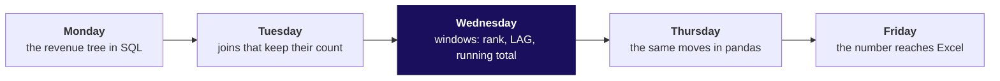
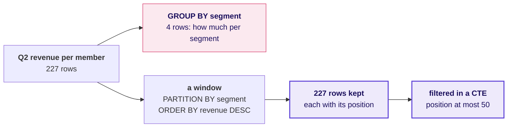
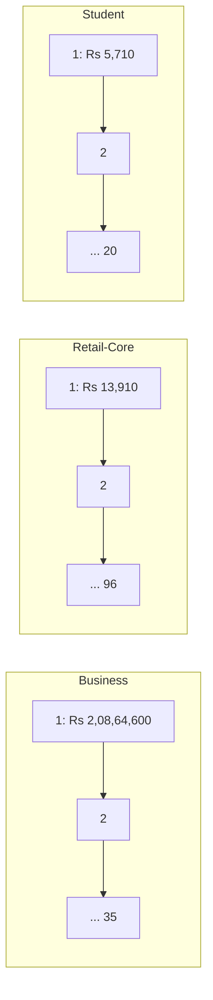
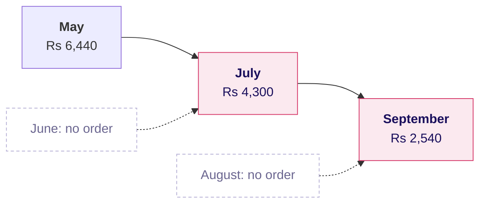
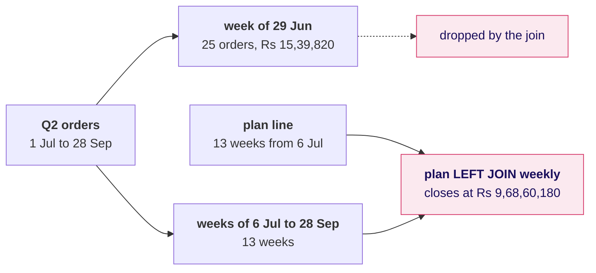

# The rows GROUP BY throws away

**Week 2, Wednesday. Study notes, read after the session.** These notes take Marketing's protect
list through three rounds of window functions and the afternoon's escalated case, with each round's
trap and the check that caught it. Reading time: about 25 minutes.

---

## What you can now do

1. You can say whether GROUP BY or a window answers a question Marketing asks, and why, in one
   sentence.
2. You can keep the top fifty of each segment by computing a position in a CTE and filtering it
   outside, which is also the fix for a window refused inside WHERE.
3. You can predict what ROW_NUMBER, RANK and DENSE_RANK print on a tie, count the rows each ships at
   a cut-off, and defend your rule to the person who acts on the list.
4. You can compare a member's month with the same member's previous month using LAG, and prove the
   previous row is the previous calendar month.
5. You can build a running total that repeats exactly on every run, and check it closes on the
   quarter's total.

---

## Where this sits

**What the session covered.** Worked in full, on Kalpa's Q2 orders: a position within each
segment filtered in a CTE, the three ranking functions on a tie and the count each ships, LAG with a
partition and a calendar check, a running total with a tiebreaker, and revenue to date against the
plan line in the escalated case. Mentioned only: LEAD, which reads the next row.


```mermaid
flowchart LR
    M["<b>Monday</b><br/>the revenue tree in SQL"] --> T["<b>Tuesday</b><br/>joins that keep their count"]
    T --> W["<b>Wednesday</b><br/>windows: rank, LAG, running total"]
    W --> H["<b>Thursday</b><br/>the same moves in pandas"]
    H --> F["<b>Friday</b><br/>the number reaches Excel"]
    classDef today fill:#1A0F5C,stroke:#1A0F5C,color:#FFFFFF
    class W today
```

This map of the week is this programme's own construction, drawn from the Week 2 rows.

**The outcome tie.** The protect list Marketing acts on next Monday is today's output, and Friday's
Excel sheet carries the same list with a lookup so Meera's chief of staff can find any member by id.

**What was left out.** Percentiles such as NTILE and percent_rank, named windows and frame clauses
such as ROWS BETWEEN wait for later, and today's running totals used the default frame. The
afternoon's second half was the IITGN faculty session W2-3 (tentative) on errors, power and sample size, which this note does not cover.

---

## The picture to remember: the kept rows


```mermaid
flowchart LR
    R["<b>Q2 revenue per member</b><br/>227 rows"] --> G["<b>GROUP BY segment</b><br/>4 rows: how much per segment"]
    R --> W["<b>a window</b><br/>PARTITION BY segment<br/>ORDER BY revenue DESC"]
    W --> K["<b>227 rows kept</b><br/>each with its position"]
    K --> F["<b>filtered in a CTE</b><br/>position at most 50"]
    classDef known fill:#EEEAFB,stroke:#5B3FD6,color:#1A0F5C,stroke-width:2px
    classDef bad fill:#FBE9EF,stroke:#D63A6A,color:#1A0F5C
    class G bad
    class K,F known
```

Read it from the left: the same 227 rows, one per member with a Q2 order, either collapse into four
segment totals or stay 227 rows with a position each, and the position is filtered in a second named
step. Every section below does something to Marketing's protect list, and the list changes shape in
each one.

Throughout, **Q2 revenue per member** means the booked amount of the member's Q2 orders, all
statuses, which is the definition Monday's suite used for the quarter total of Rs 9,84,00,000.

---

## The four lines to keep

1. GROUP BY answers how much per group; a window keeps every row and says where each row stands.
2. The tie rule is a business decision written as a function name: RANK keeps everyone at the line, and the report says how many.
3. LAG reads the previous row, so partition by the member and check the previous row is last month.
4. A running total is only as true as its order and its start; check it closes on the quarter's total.

---

## Marketing's ask, and the question GROUP BY cannot answer

Marketing wrote: "Retail-Plus frequency is the problem, so we want to protect our best members
before they drift. Give us the top fifty customers by Q2 revenue in each segment, and flag anyone
whose monthly spend has fallen for two months running. And Meera wants to see revenue accumulate
week by week against the plan line, so we know by mid-quarter whether we are on track."

Three questions sit in that message, and none of them is "how much per group". The top fifty asks
where each member stands inside a segment. The flag asks how each member's month compares with
the same member's previous month. The plan line asks how much had been booked by each week. Each
one keeps the rows and asks about a row's neighbours, and that is the whole reason a window exists:
GROUP BY answers one number per group and throws away the rows that would say who.

**The first protect list, and its trap.** The hurried answer sorts all 227 members by Q2 revenue and
takes the first fifty with LIMIT. The query runs, returns exactly fifty rows and looks finished.
Count it by segment and it hands Marketing 35 Business members, 11 Retail-Plus, 4 Retail-Core and
no Student member at all. In business terms, the Retail-Plus team asked for fifty members to protect
and received eleven, and the Student team received nobody, because one Business order outweighs a
year of a retail member's baskets: the biggest Business member booked Rs 2,08,64,600 in the quarter,
while the biggest Retail-Core member booked Rs 13,910.

The check costs one line: GROUP BY segment over the fifty and read the counts. That is the habit
from Tuesday, a row count explained before the result is read, applied to a list instead of a join.

**CALLBACK.** Week 2, Tuesday: the join from 1,000 orders to 1,450 rows was done only when its row
count was explained, and today every list was counted by segment before anyone read a name.

**WATCH OUT.** A result that returns exactly the number of rows you asked for feels correct, and
LIMIT guarantees that it will. The tell is a segment with far fewer rows than the ask, or none.

---

## PARTITION BY, and the step that filters a position

The fix is one clause. `row_number() OVER (PARTITION BY segment ORDER BY q2_revenue DESC,
customer_id)` numbers the members from 1 inside each segment, and the numbering starts again at 1
when the segment changes. PARTITION BY sets the group the calculation restarts in, and the ORDER BY
inside the window sets who comes first within it; the ORDER BY at the end of the query only
decides how the result prints.


```mermaid
flowchart LR
    subgraph B["Business"]
      B1["1: Rs 2,08,64,600"] --> B2["2"] --> B3["... 35"]
    end
    subgraph C["Retail-Core"]
      C1["1: Rs 13,910"] --> C2["2"] --> C3["... 96"]
    end
    subgraph S["Student"]
      S1["1: Rs 5,710"] --> S2["2"] --> S3["... 20"]
    end
```

Keeping the first fifty is where the room met the day's one runtime error. Writing
`WHERE row_number() OVER (...) <= 50` stops with `ERROR:  window functions are not allowed in
WHERE`. WHERE runs before the window is computed, so the position does not exist yet when WHERE
wants to test it. The fix is a named step: compute the position in a CTE, then filter the CTE from
outside.

```sql
WITH q2 AS (
    SELECT c.segment, o.customer_id, sum(o.amount) AS q2_revenue
    FROM   orders o JOIN customers c USING (customer_id)
    WHERE  o.quarter = 'Q2'
    GROUP  BY c.segment, o.customer_id
),
ranked AS (
    SELECT segment, customer_id, q2_revenue,
           row_number() OVER (PARTITION BY segment
                              ORDER BY q2_revenue DESC, customer_id) AS position
    FROM   q2
)
SELECT * FROM ranked WHERE position <= 50;
```

The list now carries 35 Business, 50 Retail-Core, 50 Retail-Plus and 20 Student members, 155 rows,
and Retail-Plus goes from 11 members to 50. Business and Student have fewer than fifty Q2 buyers, so
their "top fifty" is every member who bought in the quarter, and the list should say so in words
rather than let Marketing assume a cut was made. On the list sit 76.1 percent of Retail-Core's Q2
revenue and 85.5 percent of Retail-Plus's; the Retail-Core boundary falls between C-0005 at
Rs 2,980 in fiftieth place and C-0092 at Rs 2,950 in fifty-first.

**IN THE FIELD.** The PostgreSQL 16 documentation's own tutorial on window functions says they are
permitted only in the SELECT list and the ORDER BY clause "because they logically execute after the
processing of those clauses", and its worked answer to a top-two-per-department question computes
`rank()` in a sub-select and filters it outside (PostgreSQL 16 documentation, Tutorial 3.5, checked
29 Sep 2026). A CTE is the same move with a name.

---

## The tie rule, written as a function name

The head of Retail-Plus added a sentence that decided the day: "Ties matter. If two members spent
the same, I want them ranked the same, and I want to know how many made the top fifty, not
forty-nine because of a tie." Three functions number rows, and they differ only when two rows tie.

| Member (invented) | Spend | ROW_NUMBER | RANK | DENSE_RANK |
|---|---|---|---|---|
| A | 7,500 | 1 | 1 | 1 |
| B | 7,500 | 2 | 1 | 1 |
| C | 6,000 | 3 | 3 | 2 |
| D | 5,200 | 4 | 4 | 3 |
| E | 5,200 | 5 | 4 | 3 |
| F | 4,100 | 6 | 6 | 4 |

ROW_NUMBER gives every row its own number and orders a tied pair however the database happens to.
RANK gives tied rows the same number and then skips, so after two members at 1 the next is 3.
DENSE_RANK shares the number without skipping, so the next is 2. RANK's 1, 1, 3 surprises people who
expected 1, 1, 2, and the skip is the point: position 3 means "two members spent more than this one".

**What each rule ships at a cut-off.** The trap in this round is a top fifty that ships 49 or 51
rows. On a second invented list, a top four where the fourth and fifth members both spent 7,400,
ROW_NUMBER ships 4, RANK ships 5, DENSE_RANK ships 5 and a rule of "whole ties only" ships 3. On
Kalpa's Retail-Core the four rules ship 50, 50, 52 and 50. DENSE_RANK's 52 is the quiet one: it
sounds like "ties rank the same", and because earlier ties compress its numbers it lets in members
who sit at positions 51 and 52 by any honest count.

When the room ran the same count for Retail-Plus, the four rules shipped 50, 51, 52 and 49, because
two Retail-Plus members tie at fiftieth. In business terms each wrong rule has a cost.
Forty-nine drops a member who spent exactly what the fiftieth did, which is the one thing the head of
Retail-Plus forbade. ROW_NUMBER's fiftieth is chosen by the database, so a member can be on Monday's
list and off Tuesday's with the same spend, and nobody can explain why. DENSE_RANK ships 52 while
sounding faithful to the request.

The check is to count the rows each rule ships and to read positions 44 to 54 with all three
functions side by side. The fix is RANK within each segment, and a report that says the count and
the reason in one breath: "51 Retail-Plus members, because two tie at fiftieth."

**WATCH OUT.** A tiebreaker such as customer_id makes ROW_NUMBER repeatable, and repeatable is a
different thing from fair: with customer_id as the tiebreaker it always keeps the same member of a
tied pair and always drops the other, by the accident of an id.

**ORIGIN.** PostgreSQL added window functions in version 8.4, released on 1 July 2009, where the
release notes list "Windowing Functions" among the major areas of enhancement (PostgreSQL
8.4 release notes, checked 29 Sep 2026); the exact behaviour of each function used today is
section 9.22 of the PostgreSQL 16 documentation.

---

## LAG, and the previous row that was someone else's month

The flag Marketing asked for is two comparisons on each member's monthly spend: August below July,
and September below August. LAG reads a value from the previous row, and `lag(spend, 2)` reads the
row two back, so the flag is two LAGs and two comparisons on a table with one row per member per
month in which the member bought.

**First trap: no partition.** Written as `lag(spend) OVER (ORDER BY customer_id, month)`, the
query flags 20 members. Four of those compared a month with another member's month, because the
row before a member's first month is the last month of whoever sorts before them. In business terms
the flag accuses a member of a fall that happened in someone else's account. The check is to carry
`lag(customer_id, 2)` beside the spend and count the rows where it differs from the member's own id,
which returns 4. A faster tell in a result of any size is that a member's first month has a
"previous" value at all, since it should be NULL. The fix is `PARTITION BY customer_id`, and the
count drops to 16.

**Second trap: the holiday.** Sixteen is still wrong, and the room found out why from a member who
says he was on holiday. The monthly table has no row for a month with no order, so LAG's previous
row is simply the last month the member bought. C-0216 bought Rs 6,440 in May, nothing in June,
Rs 4,300 in July, nothing in August and Rs 2,540 in September.


```mermaid
flowchart LR
    M["<b>May</b><br/>Rs 6,440"] --> J["<b>July</b><br/>Rs 4,300"]
    J --> S["<b>September</b><br/>Rs 2,540"]
    G1["June: no order"] -.-> J
    G2["August: no order"] -.-> S
    classDef bad fill:#FBE9EF,stroke:#D63A6A,color:#1A0F5C
    classDef unknown fill:#FFFFFF,stroke:#B8B2D6,color:#6B6690,stroke-dasharray:4 3
    class J,S bad
    class G1,G2 unknown
```

LAG called July "last month" for September, so two gaps became a fall. Seven of the sixteen
flagged members were compared across a gap like this. The check is to carry `lag(month)` beside
`lag(spend)` and count the rows where the previous row is not the previous calendar month, which
returns 7. The fix requires the two previous rows to be August and July exactly; with that
condition 9 members are flagged, and the room found three in each of Business, Retail-Core and
Retail-Plus, every one of them already on the protect list.

A genuine fall looks like C-0010, Retail-Core's biggest Q2 member: Rs 7,840 in July, Rs 4,080 in
August, Rs 1,990 in September, which is three readings a month apart with each lower than the one
before.

**Why a gap is not filled with zero.** A reasonable-sounding repair is to insert a zero for every
month without an order and run LAG over a complete calendar. That turns every holiday month into a
fall to zero: a member who spent less in August than July and then went away for September would be
flagged as falling two months running. A month with no order is no reading, and a missing reading
breaks the run instead of counting as the lowest possible one.

**CALLBACK.** Week 1, Wednesday: the reconciliation habit, where a number is trusted only after the
check that could have caught it has run, is exactly what the `lag(month)` column does here.

---

## A running total, its order and its start

Meera wants revenue to accumulate week by week against the plan line. A running total is
`sum(amount) OVER (ORDER BY ...)`: with an ORDER BY in the window, the sum runs from the start of
the partition to the current row.

**The peers trap.** Written as `sum(amount) OVER (ORDER BY order_date)`, the running total gives
the twelve orders of 22 July the same figure, Rs 3,76,90,290, which is the day's closing total.
Rows that tie on the window's ORDER BY are peers, and by default the frame takes in the current row
and all its peers, so every order of the day shows the whole day. Adding `order_id` as a tiebreaker
gives each row its own step, from Rs 3,45,16,000 for the first order of the day to Rs 3,76,90,290
for the last, and the same steps on every run. That is what "deterministic" means for a running
total: an order in which no two rows share a place.

**IN THE FIELD.** The PostgreSQL 16 tutorial states the rule behind this: when ORDER BY is
supplied, the frame is "all rows from the start of the partition up through the current row, plus
any following rows that are equal to the current row according to the ORDER BY clause" (PostgreSQL
16 documentation, Tutorial 3.5, checked 29 Sep 2026).

**The plan trap.** A running actual set beside one week's plan reads as a triumph that did not
happen. At the end of the seventh plan week Q2 had booked Rs 6,87,36,590, and beside a weekly plan
of Rs 75,69,230 that looks like nine times the plan. The plan to that date was Rs 5,29,84,610, so
Q2 was ahead by Rs 1,57,51,980. Both sides accumulate or neither does.

---

## The escalated case, and the answer that lost Rs 15 lakh

The afternoon's case asked for one file Marketing acts on next Monday: the protect list with the
tie rule the head of Retail-Plus asked for, the falling-spend column, and the running total against
the plan, with a check and three sentences for Marketing and Meera.

The plan line has thirteen weeks, from Monday 6 July to Monday 28 September, at Rs 75,69,230 each,
Rs 9,83,99,990 in all. The tempting build starts from the plan and joins weekly revenue onto it with
`date_trunc('week', order_date)`. It returns thirteen tidy rows and closes at Rs 9,68,60,180, which
reports Q2 Rs 15,39,810 short of plan. In business terms Meera would be told the quarter missed
plan when it landed on it.

The check is the one in the fourth crux line: the last booked-to-date must equal Monday's Q2 total
of Rs 9,84,00,000, and this one is Rs 15,39,820 short. Those rupees are the 25 orders of 1 to 5
July, which fall in the week that starts on 29 June. The plan line has no row for that week, so a
join that starts from the plan drops them without a sound.


```mermaid
flowchart LR
    O["<b>Q2 orders</b><br/>1 Jul to 28 Sep"] --> W0["<b>week of 29 Jun</b><br/>25 orders, Rs 15,39,820"]
    O --> W1["<b>weeks of 6 Jul to 28 Sep</b><br/>13 weeks"]
    P["<b>plan line</b><br/>13 weeks from 6 Jul"] --> J["<b>plan LEFT JOIN weekly</b><br/>closes at Rs 9,68,60,180"]
    W1 --> J
    W0 -.-> X["dropped by the join"]
    classDef bad fill:#FBE9EF,stroke:#D63A6A,color:#1A0F5C
    class J,X bad
```

The fix accumulates both sides separately and reads the actual at each plan week's last day,
`week_start + 6`, so orders before the first plan week are already inside the first reading.
Q2 then closes at Rs 9,84,00,000 against Rs 9,83,99,990, Rs 10 ahead and on plan. The Rs 10 is the
rounding in the plan itself, which split Rs 9,84,00,000 thirteen ways and rounded down.

**The other likely wrong answers.** A top fifty built with DENSE_RANK ships 52 in a segment with
earlier ties, a falling flag without the calendar check carries members who were simply away, and a
running total ordered by date alone repeats one figure down a whole day and looks like a stalled
chart.

**What the numbers say to Meera.** At mid-quarter, the end of the seventh plan week, Q2 was ahead by
Rs 1,57,51,980, and almost all of that lead came from the week of 13 July, which booked Rs 2.66
crore on its own. From the week of 10 August six of the seven full weeks booked below the weekly
plan, and the lead shrank from a peak of Rs 2,16,69,660 to Rs 10 at the close. The quarter is on
track by its total and off track by its run rate, and a running total is the chart that shows both.

The sentence the case closed on:

> We ranked with RANK inside each segment, so tied members share a place and nobody at the line is
> dropped by a coin toss: the list carries 35 Business and 20 Student members, which is every Q2
> buyer there, 50 Retail-Core and 51 Retail-Plus, because two Retail-Plus members tie at fiftieth.
> Nine listed members spent less in August than July and less again in September; a member with no
> August order is not flagged, because a month without an order is no reading. Q2 closed on plan,
> Rs 9,84,00,000 against Rs 9,83,99,990, and the Rs 1.58 crore lead at mid-quarter came from one
> week in July, so the weekly run rate has been below plan since 10 August.

---

## Where this shows up in the work

**A retention list that a campaign acts on.** A CRM team sends offers to whoever is on the list, so
the list's edge is money. The first deliverable is the rule at the edge, written down with the count
it ships, because the member who spent exactly what the fiftieth did will ask why a neighbour got
the offer.

**A decline flag in a product dashboard.** Any "fell for N periods" metric depends on what a missing
period means. Before the flag ships, its builder states whether a gap breaks the run, counts as zero
or carries the last value forward, and shows the count under each choice.

---

## Try this yourself

No writing: pick a letter for each, then check the key.

1. Spends of 900, 800, 800 and 700 are ranked with RANK, highest first. The 700 gets: a) 3; b) 4;
   c) 2; d) NULL.
2. The same four with DENSE_RANK. The 700 gets: a) 3; b) 4; c) 2; d) 1.
3. A top-two list over those four with RANK <= 2 ships: a) 2 rows; b) just 1 row; c) 4 rows;
   d) 3 rows.
4. LAG(spend) over a partition by member returns, on a member's first month: a) zero; b) the
   previous member's last month; c) NULL; d) the same month's spend.
5. A member bought in June and August only. The partitioned LAG on August reads: a) July, as NULL;
   b) June; c) nothing, the row is dropped; d) September.
6. A running total ordered by order_date alone shows one figure on every order of a busy day. The
   repair is: a) sort the final result by order_date descending; b) add order_id to the window's
   ORDER BY; c) add a WHERE clause on the date; d) switch the sum to DENSE_RANK over the same order.
7. From Tuesday: a LEFT join from 1,000 orders to payments returned 1,450 rows. The likely cause is:
   a) orders with no payment; b) a WHERE clause placed on the payments table; c) orders with more
   than one payment; d) a NULL key.

Key: 1b 2a 3d 4c 5b 6b 7c. If you missed 1 to 3, reread the tie rule section; 4 or 5, the LAG
section; 6, the running total section; and 7, Tuesday's notes on fan-out.

---

## Where this gets tested

Tags: [S] a staple asked everywhere; [F] frequent in GCC and product screens; [D] a differentiator.

**1. [S] RANK, DENSE_RANK and ROW_NUMBER on a tie.** Tested: exact behaviour, with an example. "On
7,500, 7,500 and 6,000, ROW_NUMBER gives 1, 2, 3 and splits the tie arbitrarily, RANK gives 1, 1, 3,
and DENSE_RANK gives 1, 1, 2. It matters at a cut-off: on our Retail-Core top fifty, DENSE_RANK
shipped 52 rows." Weak: definitions with no example.

**2. [S] Top-3 per group: GROUP BY or a window, and why?** Tested: knowing what GROUP BY discards.
"A window, because GROUP BY collapses each group to one row and can never return the three rows
behind it. I compute a position with PARTITION BY in a CTE and filter it outside; without the
partition, our top fifty gave Retail-Plus only 11 members." Weak: GROUP BY with LIMIT 3, which
returns three rows in total.

**3. [F] How would you find customers whose spend fell two months in a row?** Tested: LAG with its
partition and its calendar. "I build one row per customer per month, LAG spend by one and by two
within each customer, and flag each month below the one before. I also LAG the month, so a fall
counts only across consecutive calendar months, which took our flag from 16 members to 9." Weak: no
partition, or no word on missing months.

**4. [F] Why can a window function not sit inside WHERE, and what do you do instead?** Tested: the
order a query runs in. "WHERE runs before any window is computed, so the position does not exist yet
when WHERE wants it. I compute it in a CTE and filter from outside." Weak: "it is a syntax rule".

**5. [D] The business says 'ties rank the same'; which function, and how many rows might the top-N
report ship?** Tested: turning a sentence into a rule and owning its count. "RANK, because tied rows
share a position and nobody at the line is dropped. It ships more than N when a tie crosses the
line, so the report says why: fifty-one Retail-Plus members, because two tie at fiftieth. DENSE_RANK
sounds like the same rule and can ship more still." Weak: a function with no row count.

**6. [F] Your top-fifty list came back with 51 rows. What do you tell the stakeholder, and is it a
bug?** Tested: owning a correct surprise. "It is the rule working: you asked for ties to rank the
same, and two members tie at fiftieth, so both are on. If you need exactly fifty, which one comes off
is your call, and I will show you the two side by side." Weak: silently cutting it to fifty.

**7. [F] LAG returned a value for a customer's very first month. What went wrong, and how do you
check for it in a result of ten thousand rows?** Tested: diagnosing a missing partition. "The window
has no PARTITION BY customer, so the previous row belongs to whoever sorts before. I lag the customer
id too and count the rows where it differs; ours was 4 before the fix, and it should be zero."
Weak: eyeballing the first rows.

**8. [D] A member says he was on holiday in August and should not be flagged. How does your
definition treat a month with no orders, and why not fill it with zero?** Tested: defending a
definition to the person it affects. "He is right: a month without an order is no reading, and a fall
needs readings in consecutive calendar months. That rule cleared seven members like him on our data,
and zero-filling would turn every holiday into a fall to zero." Weak: "the data says he fell".

**9. [F] What makes a running total deterministic, and how would you notice one that was not?**
Tested: peers and tiebreakers. "The window's ORDER BY has to give every row its own place, such as
date then order id. Without the tiebreaker, rows on one date are peers and share the day's closing
figure, which is the tell: our twelve orders of 22 July all showed Rs 3,76,90,290." Weak: "add ORDER
BY" with no tiebreaker.

**10. [D] Your running total closes below the quarter's total. What do you check first?** Tested:
reconciliation before interpretation. "I find where the missing rupees sit by date. Ours was
Rs 15,39,820 short because a join that started from the plan dropped the week before the plan's
first week, so I accumulate both sides separately." Weak: discussing the trend first.

**11. [S] What is the difference between GROUP BY and PARTITION BY?** Tested: the one-sentence
model. "GROUP BY collapses each group into one row and answers how much per group; PARTITION BY keeps
every row and only sets where a window calculation restarts. On our Q2 table that is 4 rows against
227." Weak: "they both group".

**12. [F] A dashboard says revenue to date is nine times the plan by week seven. What is the likely
mistake?** Tested: comparing like with like. "Someone set a cumulative actual beside one week's plan.
Both sides have to accumulate, and when ours did, week seven read about Rs 1.58 crore ahead of plan,
a real lead and nothing like nine times." Weak: celebrating the number.

---

## Glossary

| Term | What it means here | Where it appeared | Example |
|---|---|---|---|
| Window function | It computes across related rows and keeps every row. | Round 1, notebook 01 | `row_number() OVER (...)` beside each member |
| PARTITION BY | It sets the group a window's calculation restarts in. | Round 1, notebook 01 | Positions restart at 1 in each segment. |
| ROW_NUMBER | It numbers rows 1, 2, 3 and breaks a tie arbitrarily. | Round 2, notebook 02 | Invented A and B at 7,500 get 1 and 2. |
| RANK | Tied rows share a position and the next position is skipped. | Round 2, notebook 02 | 7,500, 7,500 and 6,000 give 1, 1, 3. |
| DENSE_RANK | Tied rows share a position and no position is skipped. | Round 2, notebook 02 | 7,500, 7,500 and 6,000 give 1, 1, 2. |
| LAG | It reads a value from the previous row of the partition. | Round 3, notebook 03 | `lag(spend, 2)` reads July for September. |
| Running total | It sums from the partition's start to the current row. | Round 3, notebook 03 | Booked to date at each plan week's end |
| Peers | They are rows that tie on the window's ORDER BY. | Round 3, notebook 03 | Twelve orders of 22 July share one total. |
| Tiebreaker | It is a column added so every row has one place. | Rounds 1 and 3 | `ORDER BY order_date, order_id` |
| CTE | It is a named step in a WITH clause that a later step reads. | Round 1, notebook 01 | `ranked` filtered on `position <= 50` |
| Top-N per group | It keeps the first N rows of each partition. | Round 1, the case | Fifty per segment, 155 rows with ROW_NUMBER |
| LEAD | It reads the next row, the mirror of LAG, named today only. | Round 3, named | Next month's spend beside this month's |

---

## Go deeper

| Order | What | Time | Why this one |
|---|---|---|---|
| 1 | PostgreSQL 16 documentation, Tutorial 3.5, Window Functions, https://www.postgresql.org/docs/16/tutorial-window.html (verified 29 Sep 2026) | 15 minutes | The source for peers, the frame and why WHERE cannot see a window |
| 2 | PostgreSQL Exercises, the Aggregation category, the first three window questions: https://pgexercises.com/questions/aggregates/countmembers.html, https://pgexercises.com/questions/aggregates/nummembers.html and https://pgexercises.com/questions/aggregates/fachours4.html (verified 29 Sep 2026) | 30 minutes | A total on every row, then numbered members, then every tied result kept, which is today's tie rule on new data |
| 3 | techTFQ, "SQL Window Function, How to write SQL Query using RANK, DENSE RANK, LEAD/LAG", https://www.youtube.com/watch?v=Ww71knvhQ-s (checked 29 Sep 2026; running time not checked) | One sitting | The three ranks and LAG and LEAD on a second dataset |
| 4 | PostgreSQL 16 documentation, 9.22 Window Functions, https://www.postgresql.org/docs/16/functions-window.html (verified 29 Sep 2026) | 10 minutes | The exact definition of every function used today, and LEAD |
| 5 | postgresqltutorial.com, PostgreSQL Window Functions, https://www.postgresqltutorial.com/postgresql-window-function/ (verified 29 Sep 2026) | 20 minutes | A second explanation with its own examples, for anyone who wants one |
