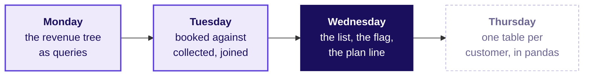
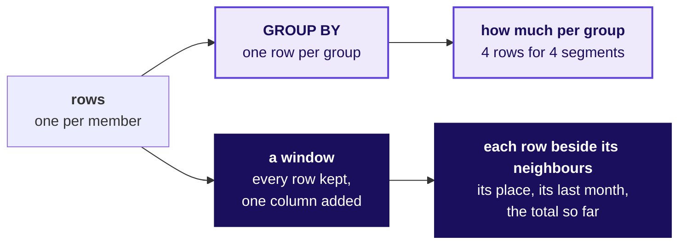
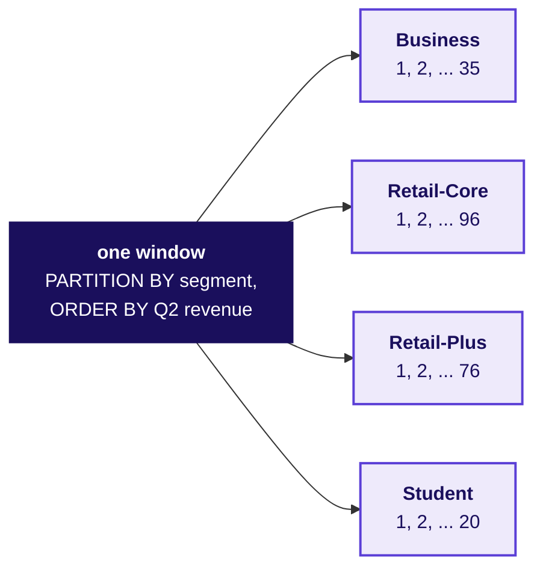
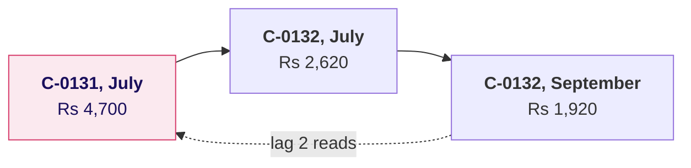
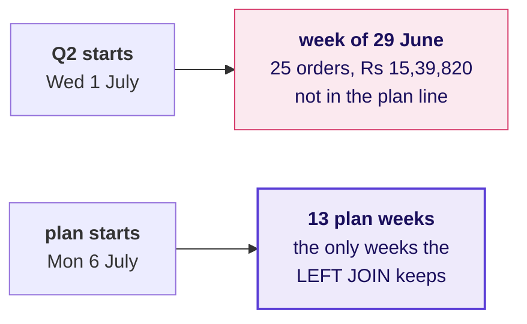

# Which members should Marketing protect before they drift, and is Q2 on track against the plan line?

**Week 2, Wednesday. Study notes, read after the session.** Reading time: about 25 minutes.

The marketing lead wrote to the data and AI team at Kalpa's Global Capability Centre in Bengaluru,
where you are trainee engineers:

> "Retail-Plus frequency is the problem, so we want to protect our best members before they drift.
> Give us the top fifty customers by Q2 revenue in each segment, and flag anyone whose monthly
> spend has fallen for two months running. And Meera wants to see revenue accumulate week by week
> against the plan line, so we know by mid-quarter whether we are on track."
>
> The marketing lead, Kalpa Retail

The head of Retail-Plus, who owns the paid membership tier, added: "Ties matter. If two members
spent the same, I want them ranked the same, and I want to know how many made the top fifty, not
forty-nine because of a tie." Meera Raghavan is the CEO, and Kavya Nair, the senior analyst, checks
every number before it leaves the team.

---

## What can you do now that you could not this morning?

1. You can tell a GROUP BY question from a window question, and write a window as a function, a
   partition and an order.
2. You can build each segment's top fifty in a named step and say what one row of it is.
3. You can predict the three ranking functions on a tie and state the rule, the count and the
   members at the line.
4. You can set a member's month beside their own earlier months with LAG and check what it read.
5. You can build a running total that closes on the quarter's total and repeats on every run.
6. You can size the ways to answer each question and name what would switch your choice.

---

## Where does today sit in the week, and what do Marketing's three asks measure?

**What the session covered.** Six chapters on one case, each with its options, its trap and a
second route; LEAD was named and not used. The escalated case, Marketing's Monday package of lists,
calls, revenue shares and a line for Meera, ran parts 1 and 2 in the afternoon, and parts 3 to 5 run
in the TA-led practice lab. The second case, Retail-Core ranked by how often members ordered, is the
take-home.

**What the asks measure.** Q2 is July to September 2026, and Q2 revenue per member is booked revenue,
every Q2 order at its amount whatever its status: Rs 9,84,00,000 on 462 orders. Of Kalpa's 340
members, 227 ordered in Q2, in four segments: Business (corporate buyers), Retail-Core (everyday
shoppers), Retail-Plus (the paid tier) and Student. Monthly spend is a member's booked revenue in a
calendar month, and the plan line holds 13 weeks from Monday 6 July at Rs 75,69,230 each.

```mermaid
flowchart LR
    M["<b>Monday</b><br/>the revenue tree<br/>as queries"] --> T["<b>Tuesday</b><br/>booked against<br/>collected, joined"]
    T --> W["<b>Wednesday</b><br/>the list, the flag,<br/>the plan line"]
    W --> H["<b>Thursday</b><br/>one table per<br/>customer, in pandas"]
    classDef known fill:#EEEAFB,stroke:#5B3FD6,color:#1A0F5C,stroke-width:2px
    classDef bet fill:#1A0F5C,stroke:#1A0F5C,color:#FFFFFF
    classDef unknown fill:#FFFFFF,stroke:#B8B2D6,color:#6B6690,stroke-dasharray:4 3
    class M,T known
    class W bet
    class H unknown
```

This week map is the programme's own construction. Section 4 of the
[retail dossier](../../../W01/D1/study-notes/C2_W01_D01_domain_retail_STUDENT.md) says what Marketing
and the head of Retail-Plus ask the data team, and section 5 works through the numbers that run
Kalpa Retail, among them how often a customer orders.

**The outcome tie.** Marketing acts on the lists and the nine calls next week, today's flag becomes a
column of Thursday's customer table, and the Week 2 Saturday paper tests LAG, PARTITION BY and the
tie rules.

**What was left out.** The day stopped before frame clauses such as ROWS BETWEEN, named windows and
percentiles.
The tentative IITGN faculty session W2-3 in the afternoon runs on a topic of its own, which these notes do not cover.

---

## What does a window keep that GROUP BY throws away, in one picture?

```mermaid
flowchart LR
    R["<b>rows</b><br/>one per member"] --> G["<b>GROUP BY</b><br/>one row per group"]
    R --> W["<b>a window</b><br/>every row kept,<br/>one column added"]
    G --> A["<b>how much per group</b><br/>4 rows for 4 segments"]
    W --> B["<b>each row beside its neighbours</b><br/>its place, its last month,<br/>the total so far"]
    classDef bet fill:#1A0F5C,stroke:#1A0F5C,color:#FFFFFF
    classDef known fill:#EEEAFB,stroke:#5B3FD6,color:#1A0F5C,stroke-width:2px
    class W,B bet
    class G,A known
```

Call it the fork. GROUP BY answers how much per group and keeps nothing below the group. A window
function computes over related rows and keeps every row, adding one column: a place, a previous
month, or a total so far. It is written `function() OVER (PARTITION BY ... ORDER BY ...)`: the
partition says whose rows belong together, and the order says which row comes before which. All
three of Marketing's asks take the window branch.

**CALLBACK.** Week 2 Monday's run order explains the day's one refusal: a window lives in SELECT,
after WHERE, so WHERE cannot test a place that does not exist yet.

---

## Chapter 1. Which fifty members spent the most in Q2?

**Who needs the answer.** The marketing lead spends the protect budget, a call and a renewal offer,
on the members this list names, and a list built on the wrong unit misses best members and rings
others twice.

**The questions on the way.**

1. Which ways could the team build a ranked list, and what would each cost?
2. What did each member book in Q2?
3. Which fifty members spent the most?
4. What does the quickest list, the fifty biggest orders, give Marketing?
5. Which segments does the list of fifty members reach?
6. Does a sort in Python pick the same fifty members?

**IN THE FIELD.** Starbucks Rewards members made 59 percent of the money tendered at Starbucks'
company-operated US stores in the quarter to 28 June 2026 (Starbucks' card, loyalty and mobile
dashboard, Q3 fiscal 2026, checked 1 October 2026).

### Which ways could the team build a ranked list, and what would each cost?

| Option | One row of the answer is | Leaves the warehouse | The per-segment list needs |
|---|---|---|---|
| A. Sort the Q2 order rows and keep fifty | an order | 50 order rows | nothing it can do, since an order is no member |
| B. Group by member, sort, keep fifty with LIMIT | a member | 50 rows | four queries glued together |
| C. Group by member in a named step, number the members in a window, keep places 1 to 50 | a member and its place | 50 rows | one more phrase in the same query |
| D. Export the orders to a spreadsheet and sort by hand | whatever the sort gives | all 462 Q2 order rows | four sorts by hand |

The call is C, because the ask is per segment and the place has to be a column a later step can
filter. One overall list read by eye would switch it to B, and D breaks the data platform lead's
rule, "query it, do not export it".

### What did each member book in Q2?

One row per member who ordered gives 227 rows, carrying all 462 orders and Rs 9,84,00,000.

| Segment | Members who bought | Orders | Q2 revenue | Per member who bought |
|---|---|---|---|---|
| Business | 35 | 91 | Rs 9,75,84,600 | about Rs 27.9 lakh |
| Retail-Plus | 76 | 140 | Rs 4,13,380 | about Rs 5,400 |
| Retail-Core | 96 | 193 | Rs 3,66,250 | about Rs 3,800 |
| Student | 20 | 38 | Rs 35,770 | about Rs 1,800 |

### Which fifty members spent the most?

A named step adds up each member's Q2, `row_number() OVER (ORDER BY q2_revenue DESC, customer_id)`
numbers the members with the id settling equal spend, and the query outside keeps places 1 to 50:
every Business buyer, 35, then 11 Retail-Plus and 4 Retail-Core.

| Place | Member | Segment | Q2 revenue |
|---|---|---|---|
| 34 | C-0292 | Business | Rs 3,52,000 |
| 35 | C-0302 | Business | Rs 2,25,000 |
| 36 | C-0170 | Retail-Plus | Rs 21,740 |
| 37 | C-0167 | Retail-Plus | Rs 14,600 |
| 38 | C-0010 | Retail-Core | Rs 13,910 |

### What does the quickest list, the fifty biggest orders, give Marketing?

Sorting the Q2 orders and keeping fifty returns fifty rows naming 28 members, all Business, two of
them five times. One row of the orders table is an order, so a member with five large orders takes
five places, and sent as the top fifty members the list reaches nobody in the tier Marketing worries
about. The check is `count(DISTINCT customer_id)` beside `count(*)`, 28 for 50, and ranking members
on their summed orders fixes it, reaching 22 more. Week 2 Monday met this as order rows counted as
customers.

### Which segments does the list of fifty members reach?

Three: all 35 Business buyers, Retail-Plus 11 of 76, Retail-Core 4 of 96 and Student none of 20.

### Does a sort in Python pick the same fifty members?

Yes, member for member, from the 462 order rows summed and sorted in Python, sharing no code with
the window.

> **Kavya's review.** "Say what one row of your list is before you say who is on it. A top fifty
> of orders and a top fifty of members look alike on screen and send Marketing to different
> people."

The top fifty carry Rs 9,77,70,580, 99.4 percent of Q2, so one list across the book is a Business
list.

---

## Chapter 2. Which fifty members lead each of the four segments?

**Who needs the answer.** The marketing lead spends each segment's budget on its own members, so a
list that gives Retail-Plus eleven places leaves the tier Marketing worries about mostly unprotected.

**The questions on the way.**

1. Which ways could the team build one list per segment, and what would each cost?
2. Can GROUP BY return each segment's top fifty?
3. What does numbering the whole book once give each segment?
4. What does PARTITION BY restart, and how many members does each list hold?
5. Does one sorted query per segment pick the same members?

**IN THE FIELD.** Amazon says an item's overall Best Sellers Rank "doesn't always indicate how well
an item is selling in relation to similar items", so it keeps best-seller lists by category
(Amazon's help page, checked 1 October 2026). JEE Advanced ranks within each category as well: its
2026 OBC-NCL rank 1 stood third on the common list (results of 1 June 2026, checked 1 October 2026).

### Which ways could the team build one list per segment, and what would each cost?

| Option | How each segment gets its fifty | Queries | Works through |
|---|---|---|---|
| A. One sorted query per segment, glued with UNION ALL | its own LIMIT 50 | 4 | 1,848 order rows, the 462 read four times |
| B. A count of who spent more | 1 plus the members of its segment who booked more | 1 | 16,617 member pairs, 35, 96, 76 and 20 squared |
| C. A window with PARTITION BY segment | the numbering restarts in each segment | 1 | 462 order rows, read once |
| D. GROUP BY segment with LIMIT 50 | none, since one row is a segment | 1 | it cannot list members |

The call is C: one query, one pass, and a new segment needs no change. A database with no window
functions, such as MySQL before its 8.0 line (generally available from 19 April 2018), would switch
it to A.

### Can GROUP BY return each segment's top fifty?

No. GROUP BY segment returns 4 rows of totals, and grouping by member with LIMIT 50 returns chapter
1's list again, since LIMIT counts across the whole result.

### What does numbering the whole book once give each segment?

Splitting chapter 1's numbering by segment gives Business 35, Retail-Core 4, Retail-Plus 11 and
Student 0, sent as "the top fifty in each segment". The check sets each list beside the smaller of
50 and its segment's buyers, and Retail-Plus, with 76 buyers, gets 11.

### What does PARTITION BY restart, and how many members does each list hold?

```mermaid
flowchart LR
    W["<b>one window</b><br/>PARTITION BY segment,<br/>ORDER BY Q2 revenue"] --> B["<b>Business</b><br/>1, 2, ... 35"]
    W --> C["<b>Retail-Core</b><br/>1, 2, ... 96"]
    W --> P["<b>Retail-Plus</b><br/>1, 2, ... 76"]
    W --> S["<b>Student</b><br/>1, 2, ... 20"]
    classDef bet fill:#1A0F5C,stroke:#1A0F5C,color:#FFFFFF
    classDef known fill:#EEEAFB,stroke:#5B3FD6,color:#1A0F5C,stroke-width:2px
    class W bet
    class B,C,P,S known
```

`row_number() OVER (PARTITION BY segment ORDER BY q2_revenue DESC, customer_id)` restarts the
numbering in every segment: 155 members, Business 35 and Student 20, every buyer in both, and
Retail-Core and Retail-Plus 50 each, led by C-0010 on Rs 13,910 and C-0170 on Rs 21,740.

**WATCH OUT.** The place written into WHERE stops with `ERROR:  window functions are not allowed in
WHERE`, since windows "logically execute after the processing of those clauses" (PostgreSQL 16
documentation, section 3.5, checked 1 October 2026). Compute it in a named step, filter it outside,
and give the error two minutes.

### Does one sorted query per segment pick the same members?

Yes. Four bracketed queries with their own LIMIT 50, glued with UNION ALL, return the same 155 and
become four places to edit when the segments change.

> **Kavya's review.** "Read the ask's last words again before you rank. 'In each segment' is a
> PARTITION BY, and each segment's list holds fifty members or every buyer, whichever is fewer:
> count it before it leaves the team."

Each segment leads with its own fifty, or every buyer: 155 members, who carry 76.1 percent of
Retail-Core's Q2 revenue and 85.5 percent of Retail-Plus's. The lists were cut by row_number, the
rule chapter 3 questions.

---

## Chapter 3. When two members spent the same at the line, how many does a list ship, and which rule did the head of Retail-Plus ask for?

**Who needs the answer.** The head of Retail-Plus defends the list to his members: a member dropped
by a coin toss has a fair complaint, a "top fifty" of fifty-two spends calls nobody planned, and
forty-nine is the list he refused.

**The questions on the way.**

1. Which rules could cut a list at fifty, and what does each do at a tie?
2. What do ROW_NUMBER, RANK and DENSE_RANK give on one tie?
3. How many rows does each rule ship when two members tie at the line?
4. How many Retail-Core members does each rule ship?
5. How many members does the head's own list ship, counted in your own run?
6. Does a count with no window agree with RANK?

**IN THE FIELD.** American Airlines writes its upgrade tiebreaker down in advance: "If the upgrade
type and 12-month Loyalty Point value are the same, we'll look at the booking code then date / time
of the request to determine priority" (aa.com, checked 1 October 2026). The Tokyo 2020 men's high
jump gave two golds and a bronze for third, with no silver (World Athletics, checked 1 October
2026): RANK's 1, 1, 3.

### Which rules could cut a list at fifty, and what does each do at a tie?

Two members tie when their Q2 revenue matches to the rupee; the line is the last place a list keeps.
The invented top four: A Rs 9,100, B 8,800, C 8,200, D and E 7,400, F 6,900.

| Rule | At a tie on the line | Invented top four ships | Meets the head's ask? |
|---|---|---|---|
| A. ROW_NUMBER with a stated tiebreaker | one in, one out | 4 | No: equal spend, different places |
| B. RANK | both in, and the next place is skipped: 1, 1, 3 | 5 | Yes, with the count said |
| C. DENSE_RANK | both in, and nothing is skipped: 1, 1, 2 | 5 | It can run past the line with no tie there |
| D. Whole ties only | the tie is left out whole | 3 | It runs short: the forty-nine |

Whole ties only keeps a tie when `rank + tied_with - 1` is inside the line, with `tied_with` from
`count(*) OVER (PARTITION BY q2_revenue)`. The call is RANK, with the count and its reason in the
report. A hard cap, such as fifty seats at a members' dinner, would switch it to ROW_NUMBER with a
tiebreaker stated in advance, such as more Q2 orders first.

### What do ROW_NUMBER, RANK and DENSE_RANK give on one tie?

| Member (invented) | A | B | C | D | E | F |
|---|---|---|---|---|---|---|
| Spend, Rs | 7,500 | 7,500 | 6,000 | 5,200 | 5,200 | 4,100 |
| ROW_NUMBER | 1 | 2 | 3 | 4 | 5 | 6 |
| RANK | 1 | 1 | 3 | 4 | 4 | 6 |
| DENSE_RANK | 1 | 1 | 2 | 3 | 3 | 4 |

RANK skips the place a tie used up, so place 3 says two members spent more. DENSE_RANK never skips,
since "this function effectively counts peer groups" (PostgreSQL 16 documentation, section 9.22,
checked 1 October 2026).

### How many rows does each rule ship when two members tie at the line?

On the invented top four the rules ship 4, 5, 5 and 3, and every rule ships exactly the line when
nobody ties at it.

### How many Retail-Core members does each rule ship?

Retail-Core has 96 Q2 buyers. A hurried analyst picks DENSE_RANK because it never skips and sends 52
members as "Retail-Core's top fifty", where the other rules ship 50. Two ties higher up, C-0044 and
C-0132 on Rs 4,540 and C-0060 and C-0121 on Rs 4,120, leave its numbers two behind, so its 50 lands
on the 52nd member. The check reads the line with the functions side by side.

| Place | Member | Q2 revenue | RANK | DENSE_RANK |
|---|---|---|---|---|
| 50 | C-0005 | Rs 2,980 | 50 | 48 |
| 51 | C-0092 | Rs 2,950 | 51 | 49 |
| 52 | C-0094 | Rs 2,910 | 52 | 50 |

RANK fixes it with the same fifty as ROW_NUMBER, since nobody ties at Retail-Core's line, and C-0092
and C-0094 come off.

### How many members does the head's own list ship, counted in your own run?

Each learner runs block `c3_your_segment` in notebook 03's empty cell and writes the head's
sentence: the count under RANK and, if it is not fifty, the members at the line and their figure.

### Does a count with no window agree with RANK?

Yes, in every segment. Counting members at or above the fiftieth member's figure, found with OFFSET
49, gives Retail-Core 50 at Rs 2,980, and every buyer in Business and Student, 35 and 20.

> **Kavya's review.** "A tie rule is a business decision written as a function name. State the
> rule, the count it ships and the members at the line in the same sentence, before anybody asks
> why the list holds more or fewer than fifty."

The head's rule is RANK, with its count and reason: 50 for Retail-Core, and Retail-Plus's count from
your own run.

---

## Chapter 4. Whose monthly spend fell two months running?

**Who needs the answer.** The member team rings each flagged member with an offer. A wrong flag
tells a loyal customer they are slipping, and a missed fall is a member nobody rang.

**The questions on the way.**

1. Which ways could the team set each month beside the month before, and what would each cost?
2. What did each member spend in each month?
3. What does LAG put beside one member's months?
4. What does LAG read when the window has no PARTITION BY?
5. How many members fell two months running once each member's months are kept apart?
6. Does a walk through each member's months in Python find the same members?

**IN THE FIELD.** Square's ready-made "Lapsed" group holds "customers who were regulars, but
haven't visited in the last six weeks", judging each customer against their own past (Square
Support Center, checked 1 October 2026).

### Which ways could the team set each month beside the month before, and what would each cost?

The flag reads September: September below August, and August below July.

| Option | How it reaches the month before | Works through |
|---|---|---|
| A. LAG in a window | reads the row before, in the window's order | 752 member-months, once |
| B. A self-join of the monthly table, twice | joins each month to the member's months before | 1,504 matches |
| C. A correlated subquery per month | looks up the month before, twice per row | 1,504 lookups |
| D. Months as spreadsheet columns, read by eye | a person reads across each row | 1,806 cells, 301 members times six months |

The call is LAG: one pass, with `lag(spend, 2)` in the same line as `lag(spend, 1)`. No window
functions, as in MySQL before 8.0, would switch it to the self-join.

### What did each member spend in each month?

Grouping by member and `date_trunc('month', order_date)` gives 752 member-months for 301 members;
118 to 141 members order in a month, so a member buys in about 2.5 of the six.

### What does LAG put beside one member's months?

`lag(spend, 1) OVER (PARTITION BY customer_id ORDER BY month)` reads the previous row of the
member's own months, here for C-0040 of Retail-Core, who bought in all six.

| Month | Apr | May | Jun | Jul | Aug | Sep |
|---|---|---|---|---|---|---|
| Spend, Rs | 7,980 | 3,170 | 1,320 | 4,260 | 4,770 | 4,520 |
| lag 1, Rs | NULL | 7,980 | 3,170 | 1,320 | 4,260 | 4,770 |
| lag 2, Rs | NULL | NULL | 7,980 | 3,170 | 1,320 | 4,260 |

April has no row before it, so LAG returns NULL, its documented default (PostgreSQL 16
documentation, section 9.22, checked 1 October 2026). A flag read at June would fire; at September
it does not, because August rose above July.

### What does LAG read when the window has no PARTITION BY?

`lag(spend) OVER (ORDER BY customer_id, month)` flags 20 members, since LAG runs from one member's
last row into the next member's first.

```mermaid
flowchart LR
    A["<b>C-0131, July</b><br/>Rs 4,700"] --> B["<b>C-0132, July</b><br/>Rs 2,620"]
    B --> C["<b>C-0132, September</b><br/>Rs 1,920"]
    C -.->|"lag 2 reads"| A
    classDef bad fill:#FBE9EF,stroke:#D63A6A,color:#1A0F5C
    class A bad
```

C-0132 bought in July and September, and his second step back read C-0131's July. The check carries
`lag(customer_id)` beside `lag(spend)`: four flags read another member's month, and the count must
be zero.

### How many members fell two months running once each member's months are kept apart?

Sixteen of the 118 who ordered in September, once PARTITION BY customer_id restarts the window for
each member: 20 less the 4 borrowed.

### Does a walk through each member's months in Python find the same members?

Yes, the same 16, from the 752 rows grouped and sorted in Python with no window. Both routes read
"the month before" as the previous row, a reading chapter 6 tests.

> **Kavya's review.** "A window that is not told whose rows belong together will compare anyone
> with anyone. Carry the id LAG read beside the value it read, and read the rows behind a flag
> before a call goes out."

Sixteen members fell two months running with their months kept apart, against twenty with none.

---

## Chapter 5. Has Q2 revenue kept pace with the plan line week by week, and where did it stand at mid-quarter?

**Who needs the answer.** Meera Raghavan decides at mid-quarter whether to hold the plan, push a
campaign or move budget; a false gap sends Marketing after it with discounts.

**The questions on the way.**

1. Which ways could the team accumulate the quarter against plan, and what would each cost?
2. How much had Q2 booked by the end of each plan week?
3. Does the running total close on Monday's Q2 total?
4. Where did Q2 stand at mid-quarter, and how has each week run since?
5. Can a running total by order say which order took Q2 past Rs 3.5 crore?
6. Does a plain sum up to each week's end agree?

**IN THE FIELD.** Five weeks into its 2022 second quarter, on 7 June, Target cut its operating margin
guide from a range centred on 5.3 percent to "a range around 2%" after markdowns, and the quarter
closed at 1.2 percent (Target's releases of 18 May, 7 June and 17 August 2022, checked 1 October
2026).

### Which ways could the team accumulate the quarter against plan, and what would each cost?

To date means every week up to and including the row's; mid-quarter is the week of 17 August, the
seventh of thirteen.

| Option | How it accumulates | Works through |
|---|---|---|
| A. A running SUM in a window | weekly totals, then `sum() OVER (ORDER BY week)` | 462 orders, once |
| B. A plain SUM up to each week's end | every order dated up to each week's last day | 6,006 order reads, 13 times 462 |
| C. A self-join of weeks | each week with itself and every week before | 91 week pairs |
| D. A spreadsheet with a cumulative column | an export and a formula copied down | 462 rows exported |

The call is the running SUM, booked and plan side by side; one reading on a date Meera names, such
as 19 August, would switch it to a plain SUM.

### How much had Q2 booked by the end of each plan week?

The quickest build starts from `plan_line`, LEFT JOINs each week's booked revenue by
`date_trunc('week', order_date)` and accumulates both sides. It closes at Rs 9,68,60,180 against a
plan of Rs 9,83,99,990, and the line to Meera says Q2 closed Rs 15,39,810 short of plan.

### Does the running total close on Monday's Q2 total?

No: it is Rs 15,39,820 short of Monday's Rs 9,84,00,000, the plan itself sitting Rs 10 below that
total. Q2 began on Wednesday 1 July and the plan on Monday 6 July.

```mermaid
flowchart LR
    Q["<b>Q2 starts</b><br/>Wed 1 July"] --> J["<b>week of 29 June</b><br/>25 orders, Rs 15,39,820<br/>not in the plan line"]
    P["<b>plan starts</b><br/>Mon 6 July"] --> K["<b>13 plan weeks</b><br/>the only weeks the<br/>LEFT JOIN keeps"]
    classDef bad fill:#FBE9EF,stroke:#D63A6A,color:#1A0F5C
    classDef known fill:#EEEAFB,stroke:#5B3FD6,color:#1A0F5C,stroke-width:2px
    class J bad
    class K known
```

The 25 orders of 1 to 5 July fall under Monday 29 June, a week the plan lacks, and a LEFT JOIN from
the plan keeps only plan weeks. `greatest(date_trunc('week', order_date), the first plan Monday)`
moves them onto 6 July, and Q2 closes on Rs 9,84,00,000, Rs 10 ahead and on plan.

**CALLBACK.** Week 2 Tuesday's rule holds: a join is done only when its rows are explained.

### Where did Q2 stand at mid-quarter, and how has each week run since?

| Week of | Booked in the week | Booked to date | Plan to date | Booked to date less plan |
|---|---|---|---|---|
| 6 Jul | Rs 51,00,180 | Rs 51,00,180 | Rs 75,69,230 | Rs 24,69,050 behind |
| 13 Jul | Rs 2,66,28,920 | Rs 3,17,29,100 | Rs 1,51,38,460 | Rs 1,65,90,640 ahead |
| 20 Jul | Rs 1,05,15,380 | Rs 4,22,44,480 | Rs 2,27,07,690 | Rs 1,95,36,790 ahead |
| 27 Jul | Rs 65,36,570 | Rs 4,87,81,050 | Rs 3,02,76,920 | Rs 1,85,04,130 ahead |
| 3 Aug | Rs 1,07,34,760 | Rs 5,95,15,810 | Rs 3,78,46,150 | Rs 2,16,69,660 ahead |
| 10 Aug | Rs 37,68,970 | Rs 6,32,84,780 | Rs 4,54,15,380 | Rs 1,78,69,400 ahead |
| 17 Aug | Rs 54,51,810 | Rs 6,87,36,590 | Rs 5,29,84,610 | Rs 1,57,51,980 ahead |
| 24 Aug | Rs 32,22,980 | Rs 7,19,59,570 | Rs 6,05,53,840 | Rs 1,14,05,730 ahead |
| 31 Aug | Rs 34,37,170 | Rs 7,53,96,740 | Rs 6,81,23,070 | Rs 72,73,670 ahead |
| 7 Sep | Rs 65,33,270 | Rs 8,19,30,010 | Rs 7,56,92,300 | Rs 62,37,710 ahead |
| 14 Sep | Rs 93,01,650 | Rs 9,12,31,660 | Rs 8,32,61,530 | Rs 79,70,130 ahead |
| 21 Sep | Rs 66,78,320 | Rs 9,79,09,980 | Rs 9,08,30,760 | Rs 70,79,220 ahead |
| 28 Sep, one day | Rs 4,90,020 | Rs 9,84,00,000 | Rs 9,83,99,990 | Rs 10 ahead |

At mid-quarter Q2 stood Rs 1,57,51,980 ahead, built by the week of 13 July at three and a half times
its plan, while six of the seven full weeks from 10 August booked below plan.

**WATCH OUT.** Rs 6,87,36,590 to date beside one week's Rs 75,69,230 reads as nine times plan. To
date goes beside to date.

### Can a running total by order say which order took Q2 past Rs 3.5 crore?

Only with an ORDER BY no two orders share. The twelve orders of 22 July share a date, so they are
peers, which the default frame adds at once (PostgreSQL 16 documentation, section 3.5, checked 1
October 2026), and all twelve show the day's close, Rs 3,76,90,290. With the order id added,
KR-00580's Rs 8,55,000 is the step from Rs 3,45,16,000 to Rs 3,53,71,000; the warehouse holds no
time of day, so the report names the id as its tiebreak.

### Does a plain sum up to each week's end agree?

Yes, in all 13 weeks, from plain SUMs that share no code with the window and read 6,006 order rows.

> **Kavya's review.** "A running total is finished when its last value equals the total you can
> count without it. Close the loop on Monday's Rs 9,84,00,000 before you say ahead or behind."

Q2 closed Rs 10 ahead, on plan, after a mid-quarter lead of Rs 1,57,51,980 built in one July week.

---

## Chapter 6. Which listed members does Marketing call first, and does each flag hold up when a member says he was on holiday?

**Who needs the answer.** The member team rings the flagged members this week, and the head of
Retail-Plus answers for every call; accusing a member who was away costs his goodwill.

> "Before we ring anyone: one of your flagged members, C-0216, rang our help line to say he was
> travelling in August and has not stopped buying. Is your flag wrong about him, and how many
> others?"
>
> The head of Retail-Plus, Kalpa Retail

**The questions on the way.**

1. Which ways could the flag read "last month", and what would each cost?
2. How many of the flagged members are on the protect list?
3. What did LAG compare for the member who says he was on holiday?
4. How many of the sixteen flags step over a month with no order?
5. Does a join on calendar months find the same members?
6. Who does Marketing call first?

**IN THE FIELD.** Shopify's data team warned that "far too often businesses define churn as no
purchases after N days" (Cam Davidson-Pilon, Shopify Engineering, 14 November 2017, checked 1
October 2026). Marriott extended 2019 elite status to February 2022 and Hilton extended status to 31
March 2022 (releases of 14 April and 27 October 2020, checked 1 October 2026), treating a gap members
did not choose as no reading.

### Which ways could the flag read "last month", and what would each cost?

| Option | "Last month" is | Rows | A month with no order |
|---|---|---|---|
| A. LAG over the member's own months, chapter 4's flag | the last month the member bought | 752 | is stepped over |
| B. LAG with a check that the two rows before September are August and July | the calendar month before | 752 | breaks the run |
| C. A calendar of every member and month, zero-filled | the calendar month before | 1,806 | reads as a fall to zero |
| D. The same calendar, left empty | the calendar month before | 1,806 | stays empty, so no reading |

Members buy in 2.5 of six months, so an empty month is normal, and zero-filling flags 26, 17 of them
only for a quiet September. The call is B, and a separate "went quiet" flag would switch it to D.

### How many of the flagged members are on the protect list?

All 16, since a spend that can fall twice from a high month belongs to a member who spent a lot.

### What did LAG compare for the member who says he was on holiday?

| Month | Apr | May | Jun | Jul | Aug | Sep |
|---|---|---|---|---|---|---|
| C-0216, Rs | none | 6,440 | none | 4,300 | none | 2,540 |

With no August row, LAG compared his September with July and his July with May. C-0216 stands at
place 23 on Retail-Plus's list.

### How many of the sixteen flags step over a month with no order?

Shipped as it stands, chapter 4's flag makes sixteen calls, and the hurried reply says C-0216 did
spend less each time. The check carries `lag(month)` beside `lag(spend)`: 7 of 16 flags did not read
August and July, and requiring `month_1_back = DATE '2026-08-01' AND month_2_back = DATE
'2026-07-01'` keeps 9.

### Does a join on calendar months find the same members?

Yes, the same 9. Joining each member's September row to their own August and July rows uses no
window, and a missing month has no row to join.

### Who does Marketing call first?

The nine, all on a protect list, and not the member on holiday. C-0010, first in Retail-Core, shows
a fall that holds up: Rs 7,840 in July, Rs 4,080 in August and Rs 1,990 in September. Read the nine
with block `c6_call_list` in notebook 06's empty cell.

> **Kavya's review.** "A month with no order is no reading. Write that into the flag's definition,
> and read the rows behind a flag before a call goes out."

Marketing calls nine members, and seven of chapter 4's sixteen calls, C-0216's among them, are never
made.

---

## What will an interviewer ask, and what does a strong answer sound like?

Tags, this programme's own calibration for 0 to 3 year Indian-market candidates: [S] a staple asked
everywhere, [F] frequent in GCC and product screens, [D] a differentiator.

**[S] RANK, DENSE_RANK and ROW_NUMBER on a tie.** "On 7,500, 7,500 and 6,000, ROW_NUMBER gives 1, 2,
3, breaking the tie by the next ORDER BY column; RANK gives 1, 1, 3; DENSE_RANK gives 1, 1, 2. Our
Retail-Core top fifty shipped 52 under DENSE_RANK." A weak answer gives no example.

**[S] Top-3 per group: GROUP BY or a window, and why?** "A window, since GROUP BY collapses each
group to one row and LIMIT counts across the whole result. I number rows with PARTITION BY the group
and keep places 1 to 3 outside." A weak answer writes GROUP BY with LIMIT 3.

**[S] What is the difference between GROUP BY and a window function?** "GROUP BY collapses each
group to one row; a window keeps every row and adds a column, such as a place or a total so far."
A weak answer says both group.

**[F] How would you find customers whose spend fell two months in a row?** "One row per customer per
month, lag(spend, 1) and lag(spend, 2) partitioned by customer and ordered by month, and a check
that LAG read the two calendar months before: our flag went from 16 to 9." A weak answer drops the
partition.

**[F] Why can a window function not sit inside WHERE, and what do you do instead?** "WHERE decides
which rows exist before any window is computed, so the place does not exist yet. I compute it in a
CTE and filter outside." A weak answer calls it a syntax rule.

**[F] A top-fifty list has fifty rows but twenty-eight names: what happened?** "It ranked order rows,
so a big customer took several places. count(DISTINCT customer_id) beside count(*) catches it, and
ranking customers on their summed orders fixes it." A weak answer sends the 28 names.

**[F] Your top-ten list came back with eleven rows: is it a bug?** "The tie rule is working: two
customers share tenth place. I state the count and the reason, and offer a hard cap with its
tiebreaker." A weak answer quietly cuts it to ten.

**[F] LAG returned a value for a customer's very first month: what went wrong?** "The window has no
PARTITION BY customer, so LAG crossed customers. I count rows where lag(customer_id) differs from
the row's own; it must be zero, and ours was four." A weak answer eyeballs the first rows.

**[F] What makes a running total deterministic, and how would you notice one that was not?** "An
ORDER BY no two rows share, such as the date and then the order id. Peers share one figure, which
is the tell: our twelve orders of 22 July all showed Rs 3,76,90,290." A weak answer adds no
tiebreaker.

**[F] Revenue to date is nine times the plan by week seven: what is the likely mistake?** "A
cumulative actual beside one week's plan. To date against to date, our mid-quarter stood
Rs 1,57,51,980 ahead." A weak answer celebrates the number.

**[D] The business says ties rank the same: which function, and how many rows might the top-N report
ship?** "RANK, which ships more than N when a tie straddles the line, so the report states the count;
DENSE_RANK can ship more with no tie there, as our 52 showed." A weak answer gives no row count.

**[D] A member was on holiday: how does your flag treat a month with no orders, and why not zero?**
"A month with no order is no reading, so it breaks the run. Our members buy in 2.5 of six months, so
zeros flagged 26, 17 only for a quiet September." A weak answer says the data shows he fell.

---

## Which six lines from today's chapters are worth keeping?

1. Say what one row of the list is before you rank it: fifty orders named only 28 members.
2. "In each segment" is a PARTITION BY: fifty, or every buyer, in each segment.
3. RANK keeps a tie at the line and says the count; DENSE_RANK can run past the line with no tie at it.
4. Tell the window whose rows belong together, or LAG reads another member's month.
5. A running total is done when its last value equals the quarter's total.
6. A month with no order is no reading: check that LAG read the calendar months before.

---

## Which words did today use, and what does each mean?

| Term | What it means here | Where it first appears | Example |
|---|---|---|---|
| Window function | Computes over related rows and keeps every row, adding one column | The picture | `row_number() OVER (...)` |
| PARTITION BY | Says whose rows belong together; the window restarts in each partition | Chapter 2 | Places restart at 1 per segment |
| ROW_NUMBER | Numbers rows 1, 2, 3 with no repeats; a tiebreaker column decides ties | Chapter 1 | 1 to 6 on six invented members |
| RANK | Tied rows share a place, and the places they use up are skipped | Chapter 3 | 1, 1, 3 |
| DENSE_RANK | Tied rows share a place and nothing is skipped; it numbers distinct values | Chapter 3 | 52 for Retail-Core's top fifty |
| LAG | Reads a value from an earlier row in the window's order; NULL if none | Chapter 4 | `lag(spend, 2)` |
| Running total | A sum over every row up to and including this one, in the window's order | Chapter 5 | Booked to date |
| Peers | Rows with the same ORDER BY value; a running sum adds them all at once | Chapter 5 | The twelve orders of 22 July |
| OVER | The clause that makes a function a window function | The picture | `rank() OVER (ORDER BY q2_revenue DESC)` |
| ORDER BY in a window | Which row comes before which inside a partition | Chapter 1 | `ORDER BY q2_revenue DESC, customer_id` |
| Booked revenue | Every order at its amount, whatever its status | Chapter 1 | Rs 9,84,00,000 in Q2 |
| Q2 revenue per member | The booked amount of a member's Q2 orders | Chapter 1 | Rs 13,910 for C-0010 |
| Member | One customer on the customers table | Chapter 1 | 227 of 340 bought in Q2 |
| Named step (CTE) | A step written `WITH name AS (...)` that later steps read | Chapter 1 | `q2_spend`, then the outer filter |
| Tiebreaker | A column added to an ORDER BY to decide between equal rows | Chapter 1 | `customer_id`, `order_id` |
| Protect list | A segment's top fifty by Q2 revenue, the members Marketing protects | Chapter 2 | 155 under ROW_NUMBER |
| Top N per group | The first N rows of each partition, kept in the query outside | Chapter 2 | Fifty per segment |
| Tie | Two members whose Q2 revenue is the same to the rupee | Chapter 3 | Two on Rs 4,540 |
| The line | The last place a list keeps | Chapter 3 | Retail-Core's fiftieth, Rs 2,980 |
| Whole ties only | Keeps a tie only when every tied member fits inside the line | Chapter 3 | 3 for the invented top four |
| Hard cap | A limit that cannot stretch, such as fifty seats at a dinner | Chapter 3 | ROW_NUMBER with a stated tiebreaker |
| Member-month | One row per member per calendar month with an order | Chapter 4 | 752 on the book |
| Monthly spend | A member's booked revenue in one calendar month | Chapter 4 | C-0040, Rs 7,980 in April |
| The falling flag | September below August, and August below July | Chapter 4 | 16 flagged, then 9 |
| date_trunc | Cuts a date to the first day of its week or month | Chapter 4 | `date_trunc('month', order_date)` |
| LEAD | Reads the next row, the mirror of LAG; named today and not used | Chapter 4 | Next month's spend |
| Plan line | Kalpa's Q2 plan: 13 weeks from 6 July at Rs 75,69,230 each | Chapter 5 | Rs 9,83,99,990 in all |
| To date | Every week up to and including the one on the row | Chapter 5 | Rs 6,87,36,590 at mid-quarter |
| Mid-quarter | The end of the seventh plan week, the week of 17 August | Chapter 5 | Rs 1,57,51,980 ahead |
| Run rate | Each week's booked revenue against that week's plan | Chapter 5 | 6 of 7 weeks below |
| greatest() | The larger of its arguments | Chapter 5 | Moves 1 to 5 July onto 6 July |
| Deterministic | Giving the same figure on every run | Chapter 5 | `ORDER BY order_date, order_id` |
| Calendar check | Testing that LAG's two rows before September are August and July | Chapter 6 | 16 flags to 9 |
| Zero-filled calendar | Every member in every month, with Rs 0 where no order was placed | Chapter 6 | 26 flags, 17 with no September order |

---

## What should you read next, and in what order?

| Order | What | Time | Why |
|---|---|---|---|
| 1 | PostgreSQL 16 documentation, 3.5 Window Functions, https://www.postgresql.org/docs/16/tutorial-window.html (checked 1 October 2026) | 15 minutes | Why WHERE cannot see a window, and peers in the default frame |
| 2 | techTFQ, "SQL Window Function \| How to write SQL Query using RANK, DENSE RANK, LEAD/LAG \| SQL Queries Tutorial", https://www.youtube.com/watch?v=Ww71knvhQ-s (checked 1 October 2026 through YouTube's oEmbed record; running time not checked) | One video | The three ranks, LAG and LEAD on another dataset |
| 3 | PostgreSQL Exercises, Aggregation, https://pgexercises.com/questions/aggregates/ (checked 1 October 2026) | 5 minutes | The site keeps its window questions in this category |
| 4 | PostgreSQL Exercises, a total on every row, https://pgexercises.com/questions/aggregates/countmembers.html (checked 1 October 2026) | 10 minutes | `count(*) OVER ()`: the fork's window branch on new data |
| 5 | PostgreSQL Exercises, a numbered list of members, https://pgexercises.com/questions/aggregates/nummembers.html (checked 1 October 2026) | 10 minutes | ROW_NUMBER in a window's order |
| 6 | PostgreSQL Exercises, every tied facility output, https://pgexercises.com/questions/aggregates/fachours4.html (checked 1 October 2026) | 15 minutes | The head of Retail-Plus's rule on new data |
| 7 | PostgreSQL 16 documentation, 9.22 Window Functions, https://www.postgresql.org/docs/16/functions-window.html (checked 1 October 2026) | 10 minutes | The exact definition of every function used today, and LEAD |
| 8 | The PostgreSQL Tutorial, PostgreSQL Window Functions, https://neon.com/postgresql/postgresql-window-function (checked 1 October 2026; the old postgresqltutorial.com address redirects here) | 20 minutes | A second explanation with its own examples |
| 9 | pgtutorial.com, PostgreSQL Window Functions, https://www.pgtutorial.com/postgresql-window-functions/ (checked 1 October 2026) | 15 minutes | Each function on its own page, for syntax cross-checks |
| 10 | SQLBolt, https://sqlbolt.com/ (checked 1 October 2026) | As needed | Joins and aggregates again, for anyone still shaky on Tuesday |

---

## So, which members should Marketing protect before they drift, and is Q2 on track against the plan line?

The day's answer, to Marketing and the head of Retail-Plus:

> "Each segment's protect list is its top fifty by Q2 revenue under RANK, so members who spent the
> same share a place: Business and Student list every Q2 buyer, 35 and 20, Retail-Core lists 50, and
> Retail-Plus lists the count your own run gave, with the reason in the same line if it is not fifty.
> Call the nine members whose spend fell in August and again in September first; a month with no
> order is no reading, so the member on holiday is not one of them. Q2 closed on plan,
> Rs 9,84,00,000 against Rs 9,83,99,990, and the Rs 1.58 crore lead at mid-quarter came from one week
> in July, so the weekly run rate has sat below plan since 10 August."

Thursday's ask, one table per customer refreshed every Monday in pandas, stays open until then.
