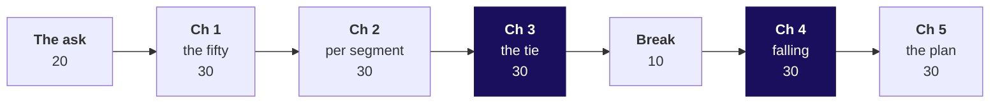
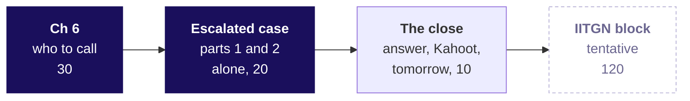

# Day sheet, Week 2 Wednesday: which members should Marketing protect before they drift, and is Q2 on track against the plan line?

**TRAINER ONLY.** Nothing on this page reaches a learner.

Posts to <!-- sync:module:W02/D3 -->Module 1: Foundations of AI and Data<!-- /sync:module:W02/D3 -->, on <!-- sync:day-date:W02/D3 -->Wed 14 Oct 2026<!-- /sync:day-date:W02/D3 -->.

<!-- sync:faculty-day:W02/D3 -->
**IITGN faculty block W2-3 (tentative), 120 minutes, after this row's applied core.** Faculty: to be confirmed by IIT Gandhinagar.

TOPIC: Errors, power and sample size: Type I and Type II errors, power, the sample size a comparison needs, multiple comparisons, and statistical against practical significance.
PICKS UP WHERE THE ROW STOPS: Week 1 Thursday gave a rule of thumb of thirty observations and stopped before power.
CONNECTS TO KALPA: how many Student orders Meera would need before she could trust 40 percent; marketing testing ten segments and finding one that looks significant.
BY THE END: a learner can size a comparison roughly, and can explain why testing many segments manufactures findings. The block closes the statistics that ME1 draws on.
DOES NOT REPEAT: correlation against causation, which the campaigns table already taught.
<!-- /sync:faculty-day:W02/D3 -->

Your row stops where the faculty block starts: chapter 6, the escalated case's first two parts and
the Kahoot are the last things you run. The block shares no SQL with the day. Do not preview its
content; when you mention it to the room, say it is tentative. If a learner asks whether a member's
fall is real or noise, say that the next session in the room is built for that kind of question and
leave it there.

Built from the approved Weeks 1 and 2 spine (`docs/detailing/W01_W02_spine.md`, Wednesday, and its
faculty-day paragraph), raised to the chapter standard and the question ladder of 30 September 2026,
and the Wednesday row of `docs/curriculum/W2_Data_manipulation.md`. Data: the client-zero v4
warehouse, generated by `data/generate_client_zero.py` and loaded by
`bash .devcontainer/load_warehouse.sh`. Kalpa Retail's business, its segments and its metrics are in
the retail domain dossier (`content/W01/D1/study-notes/C2_W01_D01_domain_retail_STUDENT.md`); today
links to it and never retells it.

## Which questions does the day ask, in the order the trainer asks them?

The day's question, in Marketing's terms: **which members should Marketing protect before they
drift, and is Q2 on track against the plan line?** Ask each question below before its answer is
shown; each chapter's map slide lists its smaller questions, and its last slide answers them.

| Part | Its question | The smaller questions, in order |
|---|---|---|
| The ask | What does Marketing want, and what can GROUP BY not give it? | Who is asking, and what does each want by Monday? What does each need, and what does a wrong answer cost? Can one GROUP BY answer all three? What does each ask need a window to add to every row? |
| Chapter 1 | Which fifty members spent the most in Q2? | Which way, at what cost? What did each member book in Q2? Which fifty members spent the most? What does the quickest list, the fifty biggest orders, give Marketing? Which segments does the list of fifty reach? Does a sort in Python pick the same fifty? |
| Chapter 2 | Which fifty members lead each of the four segments? | Which way, at what cost? Can GROUP BY return each segment's top fifty? What does numbering the whole book once give each segment? What does PARTITION BY restart, and how many members does each list hold? Does one sorted query per segment pick the same members? |
| Chapter 3 | When two members spent the same at the line, how many does a list ship, and which rule did the head of Retail-Plus ask for? | Which rule, at what cost? What do the three functions give on one tie? How many rows does each rule ship at a tie on the line? How many Retail-Core members does each rule ship? How many does your own segment's list ship? Does a count with no window agree with RANK? |
| Chapter 4 | Whose monthly spend fell two months running? | Which way, at what cost? What did each member spend each month? What does LAG put beside one member's months? What does LAG read with no PARTITION BY? How many fell twice, months kept apart? Does a Python walk agree? |
| Chapter 5 | Has Q2 revenue kept pace with the plan line week by week, and where did it stand at mid-quarter? | Which way, at what cost? How much had Q2 booked by each plan week's end? Does the running total close on Monday's Q2 total? Where was Q2 at mid-quarter, and how has each week run since? Can a running total by order say which order crossed Rs 3.5 crore? Does a plain sum agree? |
| Chapter 6 | Which listed members does Marketing call first, and does each flag hold up when a member says he was on holiday? | Which reading of "last month", at what cost? How many flagged members are on the list? What did LAG compare for the member on holiday? How many of the sixteen flags step over a month with no order? Does a calendar join agree? Who does Marketing call first? |
| The escalated case | What does Marketing get on Monday: each segment's list with its count, the members to ring first, the share of revenue the lists carry, and Q2 against plan? | Which members make each list, and how many? Which listed members are rung first? How much of each segment's revenue does its list carry? Is Q2 on track by the total and by the run rate? What goes to Marketing and Meera? |
| The second case, take-home | Should Retail-Core's protect list rank members by how often they ordered in Q2, instead of by how much they spent? | How many orders did each member place, and where do the ties fall? How many does each rule ship on orders alone? Why does RANK ship 51? Which second key breaks the crowd? How many members do the two lists share? What do you tell the marketing lead? |
| The close | Which members should Marketing protect before they drift, and is Q2 on track against the plan line? | Which line does each chapter leave the list with? What does the growth team ask next? |

**The day's answer, said at the close (afternoon S19).** "Each segment's list is its top fifty by Q2
revenue under RANK, so members who spent the same share a place: Business and Student list every Q2
buyer, 35 and 20, Retail-Core lists 50, and Retail-Plus lists 51, because two members tie at fiftieth
on Rs 3,350. Ring the nine members whose spend fell in August and again in September first; a month
with no order is no reading, so the member on holiday is not one of them. Q2 closed on plan, Rs 10
ahead, and the Rs 1.58 crore lead at mid-quarter came from one July week, so the weekly run rate has
sat below plan since 10 August." On the slide the Retail-Plus count is left to each learner's own
run; have two learners read theirs first.

---

## What does the day start from, and where does it stop?

| | |
|---|---|
| **Start from** | Monday's suite and its booked Q2 of Rs 9,84,00,000 on 462 orders, and Tuesday's rule that a join is only done when its row count is explained. Open on Marketing's ask and let somebody try GROUP BY and LIMIT 50, so the window arrives as the missing piece. |
| **Go as far as** | Every learner ranks members inside each segment under the head of Retail-Plus's rule and says the count it ships, flags members whose spend fell in calendar months with LAG partitioned by member and a month check, and builds the running total against plan that closes on Rs 9,84,00,000, each with its options, its best-fit call and a second route. |
| **Stop before** | Frame clauses (ROWS BETWEEN), named windows, percentiles and performance. LEAD is named once on S53 and never taught. The row stops before any question of whether a fall is real or noise, which the tentative IITGN block takes up. |
| **Comes later** | Thursday builds Marketing's one table per customer in pandas, with today's flag as one of its columns; Friday puts the protect list in the leadership workbook; Week 4's cohorts read retention month by month. Say the arc once and preview no later day's trap. |
| **Cut first** | Chapter 5's order-level running total (S73 and S74) to one sentence; then each chapter's second-route slide to its stats line (S19, S33, S47, S60, S75); then the company slides to their quote. Never cut the tie demonstration (S39 to S46), any trap with its check and fix, or the start of the escalated case. |

---

## How does the morning's 180 minutes run?



| Part | Slides (morning deck) | Beside it | What must land | If short of time |
|---|---|---|---|---|
| The ask, 20 | Cover, S1 to S6 | The board's first drawing, the day's picture, which stays up all day | The day's question and its six chapter questions (S1); the three asks and their costs (S2, S3); answer c on S4, so GROUP BY's limit is the room's own finding (S5); the three windows (S6) | S3 to its first two rows |
| Chapter 1, 30 | SECTION 1, S7 to S20 | Notebook 01, `sql/C2_W02_D03_01_top_fifty_STUDENT.sql` | 227 member rows (S13); three segments on the one list, Business ending at place 35 (S15); fifty orders naming 28 members, the check and the fix (S16 to S18) | S19 to its stats line |
| Chapter 2, 30 | SECTION 2, S21 to S34 | Notebook 02 | GROUP BY's 4 rows (S27); Retail-Plus 11 and Student none from one numbering (S28), the fifty-or-every-buyer check (S29); 155 under PARTITION BY (S31); the WHERE refusal in two minutes (S32) | S33 to its stats line |
| Chapter 3, 30 | SECTION 3, S35 to S48 | Notebook 03, the guided build `exercises/guided/C2_W02_D03_tie_STUDENT.md`, the companion page | The three functions on paper first (S39, S40); 4, 5, 5 and 3 rows (S42); DENSE_RANK's 52 for Retail-Core with its check (S43, S44); every learner runs the Retail-Plus count alone and writes the sentence before any number is shared (S46) | S37 to its quote; never S39 to S46 |
| Break, 10 | After S48 | | The room leaves with its own Retail-Plus count and sentence written | |
| Chapter 4, 30 | SECTION 4, S49 to S61 | Notebook 04 | NULL on a first month (S55); 20 flags with no partition, 4 borrowed (S57), the check (S58), 16 with PARTITION BY (S59) | S60 to its stats line |
| Chapter 5, 30 | SECTION 5, S62 to S76 | Notebook 05 | The plan-first close Rs 15,39,810 short (S68); the check against Monday's total and the five missing days (S69); Rs 10 ahead after the fix (S70); Rs 1.58 crore ahead at mid-quarter from one July week, six of seven weeks below since 10 August (S72) | S73 and S74 to one sentence |

Each chapter's set (`exercises/unguided/C2_W02_D03_ch{n}_*_STUDENT.md`) runs its first items live in
the chapter's last minutes if the chapter ran to time; the rest are the practice lab's or tonight's.

**The one runtime error, two minutes, never a trap slot.** Somebody writes the place filter in
WHERE. Postgres 16 prints, with two spaces after the colon:

```text
ERROR:  window functions are not allowed in WHERE
```

Point at Monday's drawing of the order a query runs in (WHERE runs before the window is computed),
move the place into a named step and filter outside it, then move on. S32 carries it.

## Which checkpoint question follows each chapter?

One learner each, under thirty seconds. After chapter 1: what is one row of your list, and how do you
prove it? After chapter 2: what does PARTITION BY segment restart, and how many members did the four
lists hold? After chapter 3: which function did the head of Retail-Plus ask for, and how many members
did your Retail-Plus list ship? After chapter 4: what did LAG read for a member's first row with no
PARTITION BY? After chapter 5: what must the last booked-to-date equal before you say ahead or behind?
After chapter 6: what does the flag do with a month in which the member placed no order?

---

## How do the afternoon's 60 minutes run, and where does the rest go?



| Part | Slides (afternoon deck) | Beside it | What must land | If short of time |
|---|---|---|---|---|
| Chapter 6, 30 | Cover, S1, SECTION 6, S2 to S16 | Notebook 06 | Four readings of "last month" sized (S5); all 16 flagged are on a list (S8); C-0216's July read as last month (S10); 16 calls (S11), 7 over an empty month (S12), 9 after the check (S13); the calendar join's same nine (S14) | S4 to its quote; S14 to its stats line |
| Escalated case, parts 1 and 2, 20 | SECTION 7, S17 and S18 | `notebooks/C2_W02_D03_ex1_escalated_case_STUDENT.ipynb`, `exercises/unguided/C2_W02_D03_escalated_case_STUDENT.md` | Three minutes on the brief, seventeen alone: every learner ships part 1, each segment's list with its count, and starts part 2, the members to ring | Nothing; start on time |
| The close, 10 | SECTION 8, S19 to S21 and S25 | `kahoot/C2_W02_D03_quiz_STUDENT.md` | The day's answer after two learners read theirs (S19); the six lines read together (S20); eight Kahoot items with a reason aloud after each (S21); the growth team's ask left open (S25) | S20 read by you alone |

D22 to D24 stay self-study: the interview drill, the second case and the day's wrong numbers.
**What moves out of the afternoon.** The escalated case's parts 3 to 5, the debrief of the room's
wrong answers and the interview drill run in the TA-led practice lab; the second case runs in the
take-home, in pairs or alone. The TA's note is `trainer/C2_W02_D03_lab_note_TRAINER.md`.

**Checkpoint after the case, one learner, under thirty seconds.** How many members does your
Retail-Plus list ship, and what is the reason in your sentence?

---

## Which options, call and second route does each chapter take?

| Chapter | Options, sized on this warehouse | Best-fit call, and what would change it | Second route |
|---|---|---|---|
| 1. The top fifty | Sort the orders (an order per row), GROUP BY with LIMIT (50 rows, place on screen only, 4 queries per segment), number members in a window (50 rows, place as a column, 1 query per segment), export and sort (462 rows leave) | The window; one overall list read by eye makes GROUP BY with LIMIT shorter | Python sums the 462 Q2 order rows per member and sorts: the same fifty in the same order |
| 2. Per segment | One query per segment with UNION ALL (4 queries, 1,848 order rows), count who spent more (16,617 member pairs), PARTITION BY segment (1 query, 462 rows), GROUP BY segment with LIMIT (cannot list members) | PARTITION BY; a database with no window functions, such as MySQL before 8.0, leaves UNION ALL | Four sorted queries with LIMIT 50 glued by UNION ALL: the same 155 members |
| 3. The tie | ROW_NUMBER with a stated tiebreaker (4 on the invented top four), RANK (5), DENSE_RANK (5), whole ties only (3) | RANK with its count and reason; a hard cap, such as fifty seats, makes ROW_NUMBER with a stated tiebreaker honest | Members at or above the fiftieth member's figure, by sort and OFFSET: RANK's count in every segment, 50 for Retail-Core |
| 4. Falling spend | LAG (752 member-months once), self-join twice (1,504), a lookup per row (1,504), spreadsheet columns (1,806 cells) | LAG; no window functions leaves the self-join | A Python walk over the 752 member-months: the same 16 |
| 5. The plan | Running SUM in a window (462 orders once), a plain SUM per week (6,006 reads), a self-join of weeks (91 pairs), a spreadsheet column (462 exported) | The running SUM; one reading on a date Meera names makes a plain SUM with that date in WHERE shorter | Thirteen plain SUMs to each week's last day: equal in all thirteen weeks |
| 6. The calls | LAG over own months (752 rows, steps over a gap), LAG with a calendar check (752, breaks the run), a zero-filled calendar (1,806, a quiet month reads as a fall: 26 flagged, 17 with no September order), a calendar left empty (1,806, 9) | The calendar check on LAG; Marketing wanting "went quiet" as its own signal makes the empty calendar worth its rows | A self-join on calendar months: the same 9 |

---

## Which trap prints which wrong number, and what catches it?

| Ch | What the hurried analyst runs | The wrong number, exactly | What it would mislead | The check | The fix and what changed |
|---|---|---|---|---|---|
| 1 | The fifty biggest Q2 orders, sent as the top fifty members | 50 rows naming 28 members, all Business; C-0273 and C-0275 hold five places each | Marketing rings 28 companies, two of them five times, and no retail member | count(DISTINCT customer_id) beside count(*) on the list | Add up each member's orders, then rank: 50 members in three segments, 22 more reached |
| 2 | The whole book numbered once, split by segment | Business 35, Retail-Core 4, Retail-Plus 11, Student 0 | 11 Retail-Plus members protected; Student told it has nobody | Each list holds fifty or every buyer, whichever is fewer | PARTITION BY segment: 35, 50, 50, 20, 155 in all |
| 3 | DENSE_RANK for "ties ranked the same" on Retail-Core | 52 members sent as the top fifty | Two members, C-0092 on Rs 2,950 and C-0094 on Rs 2,910, who tie with nobody, are called as top fifty | Read places 46 to 54 with all three functions; ties at places 31 and 32 (Rs 4,540) and 37 and 38 (Rs 4,120) | RANK: 50, the same fifty as ROW_NUMBER |
| 3, invented | A top four cut at a tie at fourth | 4, 5, 5 or 3 rows by rule | The forty-nine or fifty-one the head refused, at four | Count the rows each rule ships | RANK, with the count said |
| 4 | LAG OVER (ORDER BY customer_id, month), no partition | 20 flagged, 4 comparing another member's month (C-0070, C-0117, C-0132, C-0335) | Four members rung about a fall in someone else's account | Carry lag(customer_id), count where it differs | PARTITION BY customer_id: 16 |
| 5 | plan_line LEFT JOIN weekly booked on date_trunc('week'), running sums | Closes Rs 9,68,60,180 against Rs 9,83,99,990, "Rs 15,39,810 short of plan" | Meera told Q2 missed plan; a recovery campaign for a gap that is not there | Last booked-to-date against Monday's Rs 9,84,00,000: Rs 15,39,820 short; Q2's orders fall under 14 Mondays, the plan has 13 | The first plan week carries 1 to 5 July (25 orders, Rs 15,39,820): closes Rs 10 ahead |
| 6 | Chapter 4's flag shipped as it stands | 16 calls, 7 of them stepping over a month with no order, C-0216 among them | A loyal member told his spend fell when he was away | Carry lag(month), count flags whose rows before September are not August and July | The calendar check: 9 |

Two more wrong readings sit in the Kahoot, the exercises and the debrief. A cumulative actual set
beside one week's plan reads Rs 6,87,36,590 against Rs 75,69,230 at mid-quarter, about nine times plan;
to date beside to date it is Rs 1,57,51,980 ahead. A running total by order ordered by date alone
gives all twelve orders of 22 July the day's closing Rs 3,76,90,290; with the order id added each row
steps from Rs 3,45,16,000 to Rs 3,76,90,290, and KR-00580's step crosses Rs 3.5 crore.

---

## What is planted in v4, and what should the room find?

The discovery is the lesson, and naming a plant spends it. Nothing in any learner file names these;
the slides and notebooks show the mechanisms on invented members, on Retail-Core and on C-0216 and
C-0010, and leave the planted records to empty your-turn cells.

| Planted | Where it is | What the room should do | If nobody finds it |
|---|---|---|---|
| An exact Q2 tie at fiftieth place in Retail-Plus | C-0185 and C-0242, both on Rs 3,350, at places 50 and 51 under ROW_NUMBER with the customer id; 52nd is C-0259 on Rs 3,200. ROW_NUMBER 50, RANK 51, DENSE_RANK 52, whole ties only 49 | Run block c3_your_segment in notebook 03's section 5 (S46) and in the case's part 1, see four different counts, read places 44 to 56 to find why, and write the head of Retail-Plus his sentence: 51, because two tie at fiftieth | Ask: "Do your four numbers agree? Read the members at the line before you write the sentence." |
| The natural tie at 48th in Retail-Plus, which nobody planted and which makes DENSE_RANK ship 52 | C-0189 and C-0206, both on Rs 3,480 | Predict 51 for DENSE_RANK, get 52, and find the second tie higher up in the dense_rank column | Ask: "Read the dense_rank column from 44 to 54. Where does it fail to climb?" |
| Three Retail-Plus members whose spend fell in each Q2 month | C-0161 (July Rs 4,200, August Rs 3,100, September Rs 1,900; place 12), C-0175 (Rs 4,400, Rs 2,900, Rs 1,600; place 13) and C-0171 (Rs 3,800, Rs 2,600, Rs 1,400; place 16) | Find them among the nine in notebook 06's last your-turn cell and in the case's part 2, and see that all three are on Retail-Plus's list | Ask: "List the nine with their segment and place. Which segment carries three of them?" |
| The plan line as a small table | plan_line, 13 weeks from Monday 6 July, Rs 75,69,230 a week, Rs 9,83,99,990 in all | The plan line is the scenario and may be named; its missing first five days are chapter 5's trap, shown on S68 to S70 | |
| The bulk order, carried from Week 1 | KR-00667, Rs 1,98,57,600, Q2, 13 July, C-0286 (Q2 total Rs 2,08,64,600, place 1 on the whole-book list) | Meet it only if a learner sorts by amount; it is most of the week of 13 July's Rs 2,66,28,920 | Leave it; Week 1 taught the typical order. No learner file prints its id or amount |

C-0185, one half of the pair at fiftieth, is also one of the seven flags that step over an empty month
(June Rs 2,690, July Rs 1,900, no August, September Rs 1,450), so a member on Retail-Plus's line is on
holiday too. Keep it for the debrief if somebody notices. If a learner asks whether the data is
rigged, answer with the question back: "What would you check?"

---

## Which numbers should you have to hand?

Every revenue figure uses one definition: booked revenue, every order at its amount whatever its
status, which is how Monday's suite reached Rs 9,84,00,000 for Q2 on 462 orders from 227 members who
bought (Q1: Rs 10,00,00,000 on 538 orders).

| Segment | Members on the book | Q2 buyers | Q2 revenue | Place 1 | ROW_NUMBER, RANK, DENSE_RANK, whole ties | Share of the segment on the RANK list |
|---|---|---|---|---|---|---|
| Business | 40 | 35 | Rs 9,75,84,600 | C-0286, Rs 2,08,64,600 | 35, 35, 35, 35 | 100.0 percent |
| Retail-Plus | 120 | 76 | Rs 4,13,380 | C-0170, Rs 21,740 | 50, 51, 52, 49 | 86.3 percent (85.5 under ROW_NUMBER) |
| Retail-Core | 150 | 96 | Rs 3,66,250 | C-0010, Rs 13,910 | 50, 50, 52, 50 | 76.1 percent |
| Student | 30 | 20 | Rs 35,770 | C-0319, Rs 5,710 | 20, 20, 20, 20 | 100.0 percent |

The RANK lists hold 156 members in all (155 under ROW_NUMBER). Retail-Core's fiftieth is C-0005 on
Rs 2,980 and its 51st C-0092 on Rs 2,950; places 51 to 75 carry Rs 60,300, 16.5 percent of the
segment. The overall top fifty carries Rs 9,77,70,580, 99.4 percent of Q2.

The falling flag ending September: 20 with no partition (4 borrowed), 16 with PARTITION BY
customer_id (7 across an empty month: C-0054 and C-0060 of Retail-Core, C-0185 and C-0216 of
Retail-Plus, C-0271, C-0281 and C-0282 of Business), 9 with the calendar check, from 118 members with
a September order. The nine: C-0293, C-0276 and C-0288 of Business (places 4, 6 and 14), C-0010,
C-0049 and C-0030 of Retail-Core (places 1, 12 and 16), and C-0161, C-0175 and C-0171 of Retail-Plus
(places 12, 13 and 16). A zero-filled calendar flags 26, 17 of them with no September order.

**The running total, read at each plan week's end.**

| Week starting | Plan to date | Booked to date | Ahead of plan | Booked in the week |
|---|---|---|---|---|
| 6 Jul | Rs 75,69,230 | Rs 51,00,180 | Rs 24,69,050 behind | Rs 51,00,180, with 1 to 5 July |
| 13 Jul | Rs 1,51,38,460 | Rs 3,17,29,100 | Rs 1,65,90,640 | Rs 2,66,28,920 |
| 20 Jul | Rs 2,27,07,690 | Rs 4,22,44,480 | Rs 1,95,36,790 | Rs 1,05,15,380 |
| 27 Jul | Rs 3,02,76,920 | Rs 4,87,81,050 | Rs 1,85,04,130 | Rs 65,36,570 |
| 3 Aug | Rs 3,78,46,150 | Rs 5,95,15,810 | Rs 2,16,69,660, the peak | Rs 1,07,34,760 |
| 10 Aug | Rs 4,54,15,380 | Rs 6,32,84,780 | Rs 1,78,69,400 | Rs 37,68,970 |
| 17 Aug, mid-quarter | Rs 5,29,84,610 | Rs 6,87,36,590 | Rs 1,57,51,980 | Rs 54,51,810 |
| 24 Aug | Rs 6,05,53,840 | Rs 7,19,59,570 | Rs 1,14,05,730 | Rs 32,22,980 |
| 31 Aug | Rs 6,81,23,070 | Rs 7,53,96,740 | Rs 72,73,670 | Rs 34,37,170 |
| 7 Sep | Rs 7,56,92,300 | Rs 8,19,30,010 | Rs 62,37,710 | Rs 65,33,270 |
| 14 Sep | Rs 8,32,61,530 | Rs 9,12,31,660 | Rs 79,70,130 | Rs 93,01,650 |
| 21 Sep | Rs 9,08,30,760 | Rs 9,79,09,980 | Rs 70,79,220 | Rs 66,78,320 |
| 28 Sep, the close | Rs 9,83,99,990 | Rs 9,84,00,000 | Rs 10 | Rs 4,90,020, 28 September only |

---

## Which real companies does the day name, and how do you say each?

Every fact was checked on 1 October 2026; the URLs are in the provenance.

| Ch | Company or case | Say it this way |
|---|---|---|
| 1 | Starbucks | Rewards members made 59 percent of the money tendered at company-operated US stores in the quarter that ended 28 June 2026, with 35.8 million US members active in the 90 days to that date. Say "tender", the dashboard's word. |
| 2 | Amazon; JEE Advanced | Amazon says the overall rank "doesn't always indicate how well an item is selling in relation to similar items", so it ranks inside each category. JEE Advanced 2026: the OBC-NCL rank 1 stood third on the common list and the GEN-EWS rank 1 sixth. Name no candidate. |
| 3 | American Airlines; Tokyo 2020 | AA's upgrade list breaks a tie on equal status, upgrade type and 12-month Loyalty Points by booking code, then date and time of request. Tokyo 2020 men's high jump, 1 August 2021: Barshim and Tamberi shared gold at 2.37 m, Nedasekau took bronze, no silver. |
| 4 | Square | Its "Lapsed" group is customers who were regulars, three visits in six months, and have not visited in six weeks. |
| 5 | Target | Q2 2022 began 1 May; on 7 June Target cut its Q2 operating margin guide to around 2 percent from a range centred on 5.3; Q2 closed at 1.2 percent. |
| 6 | Shopify; Marriott and Hilton | Shopify's data team: "far too often businesses define churn as no purchases after N days" (14 November 2017). Marriott kept 2019 status until February 2022; Hilton extended status to 31 March 2022 for members due to downgrade in 2020 or 2021. |

---

## How would you answer each interview question in one breath?

| Tag | Question | The answer in one breath |
|---|---|---|
| [S] | RANK, DENSE_RANK and ROW_NUMBER on a tie. | ROW_NUMBER gives every row its own number and breaks a tie by whatever else its ORDER BY names; RANK gives tied rows the same number and skips the places they use, 1, 1, 3; DENSE_RANK gives them the same number with no gap, 1, 1, 2. |
| [S] | Top-3 per group: GROUP BY or a window, and why? | A window: GROUP BY collapses each group to one row and LIMIT counts across the whole result, so you number rows inside PARTITION BY the group in a CTE and keep places up to three outside it. |
| [S] | What is the difference between GROUP BY and a window function? | GROUP BY returns one row per group; a window keeps every row and adds a column computed over related rows, such as a place, a previous month or a total so far. |
| [F] | How would you find customers whose spend fell two months in a row? | One row per customer per month, lag 1 and lag 2 over a window partitioned by the customer and ordered by month, a check that the lagged months are the calendar months before, and keep the rows that fall twice. |
| [F] | Why can a window function not sit inside WHERE, and what do you do instead? | WHERE filters rows before the window is computed, so the value does not exist yet; compute it in a CTE or subquery and filter outside. |
| [F] | A top-fifty list has fifty rows but twenty-eight names: what happened? | It ranked order rows, so a customer with several big orders took several places; check distinct customers against rows, and rank customers after adding up their orders. |
| [F] | Your top-ten list came back with eleven rows: is it a bug? | No, the tie rule is working: two customers share tenth place and RANK keeps both; say the count and the reason in the same line and offer the hard-cap alternative with its tiebreaker. |
| [F] | LAG returned a value for a customer's very first month: what went wrong? | The window has no PARTITION BY, so LAG crossed from the previous customer; carry lag(customer_id) beside the value and count where it differs, which must be zero. |
| [F] | What makes a running total deterministic, and how would you notice one that was not? | An ORDER BY that is unique in the window, such as the date plus the order id; peers sharing a value show the same cumulative figure, which is the tell. |
| [D] | Your running total closes below the quarter's total: what do you check first? | Whether every row made it in: the last cumulative value against the independent total, then rows outside the join's calendar, here 25 orders of 1 to 5 July, Rs 15,39,820. |
| [F] | Revenue to date is nine times the plan by week seven: what is the likely mistake? | A cumulative actual beside one week's plan; accumulate the plan too and compare to date with to date. |
| [D] | The business says ties rank the same: which function, and how many rows might the top-N report ship? | RANK, which can ship more than N when a tie straddles the line, so the report says the count; DENSE_RANK can ship more even with no tie at the line; ROW_NUMBER always ships N and hides the tie. |
| [D] | A member was on holiday: how does your flag treat a month with no orders, and why not zero? | A month with no order is no reading, so it breaks the run; zero would read a quiet month as a fall, and Kalpa's members buy in 2.5 of six months, so zeros flag 26 members here, 17 for a quiet September alone. |

The full answers are in each chapter's notebook and in the study notes.

---

## Which letters are keys?

Every letter line posts as one string in item order, no spaces. The day holds 70 lettered items, and
26 of them (37 percent) are design items.

| Set | Letters, in item order | Design items |
|---|---|---|
| Guided build, chapter 3 (`exercises/guided/`) | dbacb | None, since the trainer chooses every step |
| Chapter 1 set | cadbc | 1, 4 and 5 |
| Chapter 2 set | bdcab | 1, 4 and 5 |
| Chapter 3 set | badcb | 4 and 5 |
| Chapter 4 set | cbdab | 1, 4 and 5 |
| Chapter 5 set | acbdb | 1 and 5 |
| Chapter 6 set | dacbd | 1, 4 and 5 |
| Escalated case | cbbaacbbcbdadcd, that is 1c 2b 3b 4a 5a 6c 7b 8b 9c 10b 11d 12a 13d 14c 15d | 11 to 15 |
| Practice lab | cbdabcadbc | 5 and 10 |
| Second case | ababaabdcd | 8 to 10 |
| Kahoot | b, d, a, c, b, a, d, c | None; it is ungraded |

Beside the escalated case's letters each learner posts two numbers: 9, the members Marketing rings
first, and Rs 1,57,51,980, Q2's lead over plan to date at mid-quarter. Item 11's key names the rest of
the calls as the learner's Retail-Plus count less 45; with Retail-Plus's 51, six calls carry to next
week.

---

## How does the practice lab run on a faculty day?

The TA runs the lab from `exercises/practice/C2_W02_D03_lab_STUDENT.md`, and the note on where
learners stall and the one hint for each problem is `trainer/C2_W02_D03_lab_note_TRAINER.md`. On this
faculty day the lab also carries the escalated case's parts 3 to 5, the debrief of the room's wrong
answers (the plan-first close, DENSE_RANK's 52 and the sixteen calls first, then each learner's
Retail-Plus count read from their own file), and the interview drill aloud from afternoon D22.

---

## What does the take-home's second sample hold, for Thursday's walk-through?

The sample is schema `takehome`, loaded from `data/C2_W02_D03_takehome_STUDENT.sql` and built by
`internal/C2_W02_D03_takehome_data_INTERNAL.py` under seed 20261014. It has the warehouse's shape and
none of its headline numbers: 992 orders, Q2 at Rs 9,23,60,000 on 454 orders, 98 Retail-Core buyers,
and a plan line of Rs 72,40,000 a week, Rs 9,41,20,000 in all, so Q2 closes Rs 17,60,000 behind plan;
26 orders worth Rs 57,30,440 fall before the plan's first week. The brief asks for the top twenty
Retail-Core members.

| Its plant | Where it is | What a learner should reach |
|---|---|---|
| A three-way Q2 tie across Retail-Core places 19 to 21 | C-0017, C-0033 and C-0144, all on Rs 5,170 | A top twenty ships 20 under ROW_NUMBER, 21 under RANK, 22 under DENSE_RANK and 18 under whole ties only |
| The generator's falling ladder | C-0154, C-0165 and C-0170, all Retail-Plus | The whole-book flag counts 21 with no partition (8 borrowed), 13 partitioned (7 across an empty month) and 6 with the calendar check |
| The generator's own tie at fiftieth in Retail-Plus, which the brief does not ask about | C-0175 and C-0247 on Rs 3,680 | A learner who tries Retail-Plus meets 50, 51, 57 and 49 rows |

On the Retail-Core list under RANK (21 members), the calendar-checked flag catches one member, C-0019
at place 9 (July Rs 3,380, August Rs 1,950, September Rs 990). The mid-quarter reading is Rs 5,07,89,120
booked against Rs 5,06,80,000, Rs 1,09,120 ahead; the close is Rs 17,60,000 behind; a plan-first join
closes at Rs 8,66,29,560. Seven of the twelve full weeks from 6 July booked below the weekly plan.

---

## Which file serves which moment?

| Moment | File |
|---|---|
| Teaching the morning | `slides/C2_W02_D03_half1_STUDENT.pptx`, with speaker notes on every slide |
| Teaching the afternoon | `slides/C2_W02_D03_half2_STUDENT.pptx`: chapter 6, the case's start and the close |
| The board | `whiteboards/C2_W02_D03_board_work_STUDENT.md`, the drawings in the order they go up |
| Live coding, in order | `notebooks/C2_W02_D03_01_top_fifty_STUDENT.ipynb` to `_06_call_first_`, with the six `.sql` files in `sql/` for anyone who prefers VS Code |
| The projector's moving picture | `demos/C2_W02_D03_tie_STUDENT.html`, in chapter 3 |
| Chapter sets | `exercises/unguided/C2_W02_D03_ch1_top_fifty_STUDENT.md` to `ch6_call_first`, with `exercises/guided/C2_W02_D03_tie_STUDENT.md` beside chapter 3 |
| The escalated case | `notebooks/C2_W02_D03_ex1_escalated_case_STUDENT.ipynb` and its brief, with the solutions released after the lab |
| The close | `kahoot/C2_W02_D03_quiz_STUDENT.md` |
| The practice lab | `exercises/practice/C2_W02_D03_lab_STUDENT.md` and `trainer/C2_W02_D03_lab_note_TRAINER.md` |
| Tonight | `takehome/`, the second case, the study notes and cheat sheet, `extras/C2_W02_D03_tiered_STUDENT.md`, and `preread/` for Thursday |

**If the warehouse is empty** in a learner's Codespace, run `bash .devcontainer/load_warehouse.sh`
from the repository root; it drops the database and reloads the v4 file. Pair the learner for the
first chapter while it runs.
