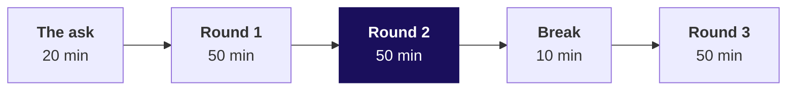
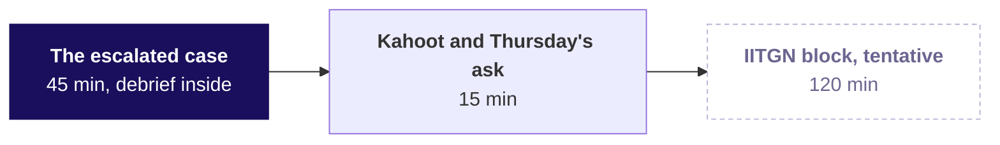

# Day sheet: Week 2, Wednesday. Protect the best members before they drift

**TRAINER ONLY.** Nothing on this page reaches a learner.

Posts to <!-- sync:module:W02/D3 -->Module 1: Foundations of AI and Data<!-- /sync:module:W02/D3 -->, on <!-- sync:day-date:W02/D3 -->Wed 14 Oct 2026<!-- /sync:day-date:W02/D3 -->.

| | |
|---|---|
| **Start from** | Monday's definition of Q2 revenue and Tuesday's habit of reading the row count first. Open on Marketing's ask and let somebody try it with GROUP BY and LIMIT 50, so the window arrives as the missing piece. |
| **Go as far as** | Every learner ships the protect list with RANK inside each segment and says how many it ships, the falling-spend flag that needs August and July on the rows before September, and the running total against plan that closes on Rs 9,84,00,000. |
| **Stop before** | Frame clauses (ROWS BETWEEN), named windows, percentiles and performance. LEAD is named once and never taught. The trainer's row also stops before any question about whether a fall is real or noise, because the IITGN block picks that up. |
| **Comes later** | Thursday re-expresses the ranks and the monthly spend in pandas with groupby. Week 4's cohorts use LAG's cousin, the retention curve. Say the arc once. |
| **Cut first** | LEAD goes first, then the harder running-total variant in Round 3 (the case still carries the running total). Never cut the tie demonstration, and never let the case run into the faculty block. |

---

## The faculty block, and where the trainer's row stops

<!-- sync:faculty-day:W02/D3 -->
**IITGN faculty block W2-3 (tentative), 120 minutes, after this row's applied core.** Faculty: to be confirmed by IIT Gandhinagar.

TOPIC: Errors, power and sample size: Type I and Type II errors, power, the sample size a comparison needs, multiple comparisons, and statistical against practical significance.
PICKS UP WHERE THE ROW STOPS: Week 1 Thursday gave a rule of thumb of thirty observations and stopped before power.
CONNECTS TO KALPA: how many Student orders Meera would need before she could trust 40 percent; marketing testing ten segments and finding one that looks significant.
BY THE END: a learner can size a comparison roughly, and can explain why testing many segments manufactures findings. The block closes the statistics that ME1 draws on.
DOES NOT REPEAT: correlation against causation, which the campaigns table already taught.
<!-- /sync:faculty-day:W02/D3 -->

The trainer's row stops where the faculty block starts, which is after the Kahoot and Thursday's
ask. The block takes the last 120 minutes of the afternoon and picks up Week 1 Thursday's rule of
thumb of thirty observations: errors, power, sample size and the trap of testing many segments.
Do not preview any of it. If a learner asks whether a member's fall is real or noise, say that the
next session in the room is built for that question and leave it there.

---

## Morning, 180 minutes



Each round runs the same fifty minutes: the question and its picture (5), the demonstration on
Kalpa data (15), the trap and its wrong number (10), the room running a harder variant (15), and
Kavya's review (5).

| Part | Slides | Beside it | What must land | If short of time |
|---|---|---|---|---|
| The ask | Morning deck, SECTION 1: The ask | The board: Marketing's quote, the head of Retail-Plus's quote and the day's picture, GROUP BY against a window, drawn before any tool opens | The room splits Marketing's ask into three questions (the list, the flag, the plan line), and somebody's GROUP BY attempt returns one row per segment or a LIMIT 50 over the whole book. | Read the second quote aloud and skip the discussion of the third question, because Round 3 opens it again. |
| Round 1: who goes on the protect list? | Morning deck, SECTION 2: Round 1, who goes on the list | `notebooks/C2_W02_D03_01_windows_STUDENT.ipynb` and `sql/C2_W02_D03_01_windows_walk_STUDENT.sql`, blocks 1 to 6, then `exercises/unguided/C2_W02_D03_which_tool_STUDENT.md` | The whole-table top fifty counted by segment (35, 11, 4, 0), then PARTITION BY segment giving 155 rows, and the two-minute WHERE error fixed with a CTE. | The share-of-segment block 6 becomes one sentence read from the slide. |
| Round 2: how many make the list when two members tie? | Morning deck, SECTION 3: Round 2, the fiftieth place | `notebooks/C2_W02_D03_02_ties_STUDENT.ipynb`, `sql/C2_W02_D03_02_protect_list_STUDENT.sql`, `demos/C2_W02_D03_tie_STUDENT.html`, `exercises/guided/C2_W02_D03_tie_STUDENT.md` and `exercises/unguided/C2_W02_D03_rankings_STUDENT.md` | The three functions predicted on paper for the six invented members, then Retail-Core's counts (50, 50, 52, 50), then the room runs the Retail-Plus variant itself and reads the head of Retail-Plus's sentence only after it has three answers. | The companion's walk becomes one pass on the projector, and the guided file stays for the evening. Never cut the tie itself. |
| Break | None | None | The room leaves with its Retail-Plus count on screen. | Nothing is cut from the break. |
| Round 3: whose spend is falling, and is the quarter on plan? | Morning deck, SECTION 4: Round 3, falling spend and the plan | `notebooks/C2_W02_D03_03_falling_STUDENT.ipynb`, `sql/C2_W02_D03_03_falling_spend_STUDENT.sql`, blocks 1 to 7, and `exercises/unguided/C2_W02_D03_falling_spend_STUDENT.md` | The unpartitioned LAG (20 flagged), the partitioned LAG (16), C-0216's three rows read aloud, and the calendar check (9), then the running total by day with its twelve orders of 22 July. | LEAD is named on one slide and never run, and block 7 moves to the case, where the running total is Part 3. |

**The one runtime error, two minutes, never a trap slot.** Somebody writes the position filter in
WHERE. Postgres 16.13 prints, with two spaces after the colon:

```text
ERROR:  window functions are not allowed in WHERE
```

Point at Monday's execution-order drawing (WHERE runs before the window is computed), move the
position into a CTE and filter outside it. Then move on.

**Checkpoints, one learner each, under thirty seconds.**

- After Round 1: what does PARTITION BY segment restart, and how many rows did the per-segment list ship?
- After Round 2: which function did the head of Retail-Plus ask for, and how many members does it ship when two tie at the line?
- After Round 3: what did LAG call "last month" for a member with no August order, and what check stops it?

---

## Afternoon, the trainer's 60 minutes, then the faculty block



There is no second case and no interview drill aloud today, because the faculty block takes the
last 120 minutes. The interview questions still live in the notebooks, the study notes and on this
sheet.

| Part | Slides | Beside it | What must land | If short of time |
|---|---|---|---|---|
| The escalated case | Afternoon deck, SECTION 1: The escalated case | `notebooks/C2_W02_D03_hands_on_STUDENT.ipynb` or `sql/C2_W02_D03_04_marketing_case_STUDENT.sql`, with the brief in `exercises/unguided/C2_W02_D03_marketing_case_STUDENT.md` | A four-minute brief, then thirty-one minutes alone on five parts: the protect list with its tie rule, the flag on the listed members, the running total against plan, the check that it closes on Rs 9,84,00,000, and the sentence to Marketing. The support TA answers environment problems only. | Part 5 becomes one sentence written in the notebook, and the debrief reads the model sentence instead. |
| The debrief, folded into the case | Afternoon deck, SECTION 2: The debrief | `exercises/solutions/C2_W02_D03_hands_on_solution_STUDENT.ipynb` and `exercises/solutions/C2_W02_D03_protect_list_solution_STUDENT.sql` | Ten minutes on the room's own wrong answers, first the plan-first join that closed Rs 15,39,810 short of plan, then the sentence to Marketing read aloud and checked for its three counts. | Show only the plan-first join and the close; the solution notebook carries the rest. |
| The close | Afternoon deck, SECTION 3: The close | `kahoot/C2_W02_D03_quiz_STUDENT.md`, then Thursday's ask read and left open | Eight items with Tuesday's return question, the four crux lines, and Thursday's stakeholder message read once. | Drop to six Kahoot items; keep the return question and Q7 on the holiday month. |
| The faculty block | Not in the trainer's decks | The faculty block above | The trainer hands over on time. | Nothing is cut from the block. |

**Checkpoint after the case, one learner, under thirty seconds.** Where did Q2 stand against plan at
mid-quarter, and how do you know the running total is complete?

---

## The traps, each a plausible wrong number

| Round | The wrong number the room will produce | What it would have misled | The check that catches it | The fix |
|---|---|---|---|---|
| Round 1 | A top fifty over the whole table: 35 Business, 11 Retail-Plus, 4 Retail-Core and 0 Student. | Marketing would protect 11 Retail-Plus members and no Student at all, because one Business order outweighs a year of a retail member. | Count the fifty by segment with a GROUP BY over the list. | PARTITION BY segment gives 35 Business (every Q2 buyer), 50 Retail-Core, 50 Retail-Plus and 20 Student (every Q2 buyer), which is 155 rows under ROW_NUMBER. |
| Round 2 | A Retail-Plus top fifty of 49 or 51 or 52 rows: RANK ships 51 because C-0242 and C-0185 tie at fiftieth on Rs 3,350, whole ties only ships 49, DENSE_RANK ships 52 because C-0189 and C-0206 tie at 48th on Rs 3,480 and compress the dense numbers, and ROW_NUMBER ships 50 and drops one of the pair by a coin toss. | Forty-nine drops a member who spent exactly what the fiftieth did, ROW_NUMBER lets a member be on Monday's list and off Tuesday's with the same spend, and DENSE_RANK sounds like "ties rank the same" while it quietly ships 52. | Count the rows each rule ships, then read positions 44 to 54 with all three functions side by side. | RANK within each segment, with the count and its reason in the report: 51 Retail-Plus members, because two tie at fiftieth. With customer_id as the tiebreaker, ROW_NUMBER keeps C-0185 and drops C-0242. |
| Round 3a | LAG without PARTITION BY flags 20 members, and 4 of those were compared with another member's month. | The flag accuses members of a fall that happened in somebody else's account. | Count flagged rows where the row two back belongs to another customer (4); a first month that has a "previous" value is the tell. | PARTITION BY customer_id, which gives 16. |
| Round 3b | The partitioned LAG flags 16, and 7 of them read a skipped month as last month, for example C-0216: May Rs 6,440, no June, July Rs 4,300, no August, September Rs 2,540. | The member who says he was on holiday is right, because LAG called July "last month" for September and a gap became a fall. | Carry lag(month) beside lag(spend) and count rows where the previous row is the wrong calendar month (7). | Require the previous two rows to be August and July, which gives 9. A month with no order is no reading, and zero-filling it would turn every holiday into a fall to zero. |
| The case | A running total built plan-first (plan_line LEFT JOIN weekly revenue on date_trunc('week')) closes at Rs 9,68,60,180 against a plan to date of Rs 9,83,99,990 and reports Q2 Rs 15,39,810 short. | Meera would be told the quarter missed plan when it landed on it, because the 25 orders of 1 to 5 July (Rs 15,39,820) fall in the week of 29 June, which the plan line does not have. | The last booked-to-date must equal Monday's Q2 total of Rs 9,84,00,000, and it is Rs 15,39,820 short. | Accumulate both sides and read the actual at each plan week's last day (week_start + 6): Q2 closes at Rs 9,84,00,000 against Rs 9,83,99,990, which is Rs 10 ahead and on plan. |

Two further wrong outputs sit in the Kahoot, the exercises and the debrief. A running actual set
beside one week's plan reads, at the end of week seven, Rs 6,87,36,590 against Rs 75,69,230, which
looks like nine times the plan; the plan to date is Rs 5,29,84,610 and Q2 is ahead by
Rs 1,57,51,980. A running total ordered by order_date alone gives all twelve orders of 22 July the
day's closing figure of Rs 3,76,90,290, because rows of one date are peers; adding order_id gives
each row its own step, from Rs 3,45,16,000 for the first order of the day to Rs 3,76,90,290 for the
last.

---

## What is planted in v4, and what the room should find

The discovery is the lesson, and naming a plant spends it. Nothing in any learner file names these.

| Planted | Where it is | What the room should do | If nobody finds it |
|---|---|---|---|
| An exact Q2 revenue tie at the fiftieth Retail-Plus position | C-0242 and C-0185, both on Rs 3,350, at positions 50 and 51 under ROW_NUMBER; 52nd is C-0259 on Rs 3,200 | Run section 3 of the protect-list file for Retail-Plus, see RANK ship 51 against ROW_NUMBER's 50, and read positions 44 to 54 to find why. | Ask the room: "Change the segment to Retail-Plus and count what each rule ships. Do the four numbers agree?" |
| The natural tie at 48th that makes DENSE_RANK ship 52 | C-0189 and C-0206, both on Rs 3,480 | Predict 51 for DENSE_RANK, get 52, and find the second tie higher up by reading the dense_rank column. | Ask: "Read the dense_rank column from 44 to 54. Where does it fail to climb?" |
| Three Retail-Plus members whose spend fell in each Q2 month | C-0161 (July Rs 4,200, August Rs 3,100, September Rs 1,900), C-0171 (Rs 3,800, Rs 2,600, Rs 1,400) and C-0175 (Rs 4,400, Rs 2,900, Rs 1,600) | Find them among the nine flagged by the calendar-checked LAG, and see that all three are on the protect list (Retail-Plus positions 12, 13 and 16). | Ask: "List the nine with their segment. Which segment carries three of them, and are they on Marketing's list?" |
| The plan line as a small table | plan_line: 13 weeks from Monday 6 July to Monday 28 September, Rs 75,69,230 a week, Rs 9,83,99,990 in all | Accumulate both sides, see that the first plan week starts five days after Q2 does, and close on Rs 9,84,00,000. | Ask: "What is the first date in plan_line, and what is the first Q2 order date?" |

The plan line itself is part of the scenario and may be named; only its missing first five days are
the room's to find. C-0185, one half of the pair at fiftieth, is also a gap-spanner (June Rs 2,690,
July Rs 1,900, no August, September Rs 1,450), so the member on holiday is on the list's boundary.
Keep that for the debrief if somebody notices it. If a learner asks whether the data is rigged,
answer with the question back: "What would you check?"

---

## The numbers, so you are never caught out

Every revenue figure uses one definition: Q2 revenue per member is the booked amount of the
member's Q2 orders in every status, which is how Monday's suite reached Rs 9,84,00,000.

| Segment | Customers | Q2 buyers | Q2 revenue | Top member | Smallest | On the RANK list | Share of segment revenue on the list |
|---|---|---|---|---|---|---|---|
| Business | 40 | 35 | Rs 9,75,84,600 | Rs 2,08,64,600 (C-0286) | Rs 2,25,000 | 35, which is every Q2 buyer | 100.0 percent |
| Retail-Plus | 120 | 76 | Rs 4,13,380 | Rs 21,740 | Rs 1,220 | 51, because two tie at fiftieth | 85.5 percent of revenue under ROW_NUMBER |
| Retail-Core | 150 | 96 | Rs 3,66,250 | Rs 13,910 (C-0010) | Rs 930 | 50 | 76.1 percent |
| Student | 30 | 20 | Rs 35,770 | Rs 5,710 | Rs 680 | 20, which is every Q2 buyer | 100.0 percent |

Q2 is Rs 9,84,00,000 on 462 orders from 227 buyers, and Q1 was Rs 10,00,00,000. The Retail-Core
boundary is C-0005 at fiftieth on Rs 2,980 and C-0092 at 51st on Rs 2,950. Retail-Plus revenue on
the list is Rs 3,53,430 under ROW_NUMBER and Rs 3,56,780 under RANK.

| Count | Retail-Core top fifty | Retail-Plus top fifty | Invented top four (tie at fourth) |
|---|---|---|---|
| ROW_NUMBER | 50 rows ship. | 50 rows ship. | 4 rows ship. |
| RANK | 50 rows ship. | 51 rows ship. | 5 rows ship. |
| DENSE_RANK | 52 rows ship. | 52 rows ship. | 5 rows ship. |
| Whole ties only | 50 rows ship. | 49 rows ship. | 3 rows ship. |

The six invented members of Round 2 (Rs 7,500, 7,500, 6,000, 5,200, 5,200 and 4,100) give
ROW_NUMBER 1 to 6, RANK 1, 1, 3, 4, 4, 6 and DENSE_RANK 1, 1, 2, 3, 3, 4.

The falling flag ending September counts 20 without a partition (4 compared with another member),
16 with PARTITION BY customer_id (7 across a gap) and 9 with the calendar check, from 118 members
with a September order. The seven gap-spanners are C-0271, C-0281 and C-0282 (Business), C-0054
and C-0060 (Retail-Core), and C-0185 and C-0216 (Retail-Plus). The nine flagged are C-0276, C-0288
and C-0293 (Business, list positions 4, 6 and 14), C-0010, C-0030 and C-0049 (Retail-Core,
positions 1, 12 and 16) and C-0161, C-0171 and C-0175 (Retail-Plus, positions 12, 13 and 16), so
all nine are on the protect list. The showable genuine fall is C-0010: July Rs 7,840, August
Rs 4,080 and September Rs 1,990.

**The running total, read at each plan week's last day.**

| Week starting | Plan to date | Booked to date | Ahead of plan |
|---|---|---|---|
| 6 Jul | Rs 75,69,230 | Rs 51,00,180 | Rs 24,69,050 behind |
| 13 Jul | Rs 1,51,38,460 | Rs 3,17,29,100 | Rs 1,65,90,640 |
| 20 Jul | Rs 2,27,07,690 | Rs 4,22,44,480 | Rs 1,95,36,790 |
| 27 Jul | Rs 3,02,76,920 | Rs 4,87,81,050 | Rs 1,85,04,130 |
| 3 Aug | Rs 3,78,46,150 | Rs 5,95,15,810 | Rs 2,16,69,660, the peak |
| 10 Aug | Rs 4,54,15,380 | Rs 6,32,84,780 | Rs 1,78,69,400 |
| 17 Aug, mid-quarter | Rs 5,29,84,610 | Rs 6,87,36,590 | Rs 1,57,51,980 |
| 24 Aug | Rs 6,05,53,840 | Rs 7,19,59,570 | Rs 1,14,05,730 |
| 31 Aug | Rs 6,81,23,070 | Rs 7,53,96,740 | Rs 72,73,670 |
| 7 Sep | Rs 7,56,92,300 | Rs 8,19,30,010 | Rs 62,37,710 |
| 14 Sep | Rs 8,32,61,530 | Rs 9,12,31,660 | Rs 79,70,130 |
| 21 Sep | Rs 9,08,30,760 | Rs 9,79,09,980 | Rs 70,79,220 |
| 28 Sep, the close | Rs 9,83,99,990 | Rs 9,84,00,000 | Rs 10 |

The week of 13 July booked Rs 2,66,28,920 on its own, which is almost all of the lead. From the week
of 10 August, six of the seven full weeks booked below the weekly plan of Rs 75,69,230, so the
quarter is on track by the total and off track by the run rate.

**The sentence to Marketing and Meera**, which closes the case and the afternoon deck:

> "We ranked with RANK inside each segment, so tied members share a place and nobody at the line is
> dropped by a coin toss: the list carries 35 Business and 20 Student members, which is every Q2
> buyer there, 50 Retail-Core and 51 Retail-Plus, because two Retail-Plus members tie at fiftieth.
> Nine listed members spent less in August than July and less again in September; a member with no
> August order is not flagged, because a month without an order is no reading. Q2 closed on plan,
> Rs 9,84,00,000 against Rs 9,83,99,990, and the Rs 1.58 crore lead at mid-quarter came from one week
> in July, so the weekly run rate has been below plan since 10 August."

---

## The twelve interview questions, answered in one breath

| Tag | Question | The answer in one breath |
|---|---|---|
| [S] | RANK, DENSE_RANK and ROW_NUMBER on a tie. | ROW_NUMBER gives every row its own number and breaks the tie arbitrarily, RANK gives tied rows the same number and skips the next ones (1, 1, 3), and DENSE_RANK gives them the same number without a gap (1, 1, 2). |
| [S] | Top-3 per group: GROUP BY or a window, and why? | A window, because GROUP BY collapses each group to one row and cannot say which rows are first; you rank inside PARTITION BY the group in a CTE and keep positions up to three outside it. |
| [F] | How would you find customers whose spend fell two months in a row? | Build one row per customer per month, take LAG 1 and LAG 2 of spend partitioned by customer and ordered by month, check the lagged months really are the previous two calendar months, and flag where each month is below the one before. |
| [F] | Why can a window function not sit inside WHERE, and what do you do instead? | WHERE filters rows before the window is computed, so the position does not exist yet; you compute it in a CTE or subquery and filter on it outside. |
| [D] | The business says 'ties rank the same'; which function, and how many rows might the top-N report ship? | RANK, and the report can ship more than N rows when a tie straddles the line, so it states the count and why; DENSE_RANK can ship even more, and ROW_NUMBER hides the tie. |
| [F] | Your top-fifty list came back with 51 rows. What do you tell the stakeholder, and is it a bug? | It is the tie rule working, because two members tie at fiftieth and the rule the stakeholder chose keeps both, so I say the count and the reason in the same line and offer the alternative with its cost. |
| [F] | LAG returned a value for a customer's very first month. What went wrong, and how do you check for it in a result of ten thousand rows? | The window has no PARTITION BY customer, so LAG crossed into the previous customer; carry lag(customer_id) beside the value and count rows where it differs from the current customer, which should be zero. |
| [D] | A member says he was on holiday in August and should not be flagged. How does your definition treat a month with no orders, and why not fill it with zero? | A month with no order is no reading, so it breaks the run and he is not flagged; filling it with zero would turn every holiday into a fall to zero and flag people for resting. |
| [F] | What makes a running total deterministic, and how would you notice one that was not? | An ORDER BY that is unique within the window, such as the date plus the order id; you notice the ambiguous one because rows sharing a date all show the same cumulative figure or the steps change between runs. |
| [D] | Your running total closes below the quarter's total. What do you check first? | Whether every row made it in, by comparing the last cumulative value with the independent total and looking for rows outside the join's calendar, such as days before the first plan week. |
| [S] | What is the difference between GROUP BY and PARTITION BY? | GROUP BY returns one row per group, while PARTITION BY keeps every row and restarts a window calculation for each group, so a row can carry its group's figure beside its own. |
| [F] | A dashboard says revenue to date is nine times the plan by week seven. What is the likely mistake? | A cumulative actual has been set beside one week's plan, so the fix is to accumulate the plan too and compare to-date with to-date. |

The full answers are written in the three round notebooks and the study notes.

---

## The practice lab

The TA runs the lab from `exercises/practice/C2_W02_D03_lab_STUDENT.md`, and the TA note on where
learners stall and the one hint for each problem is `trainer/C2_W02_D03_lab_note_TRAINER.md`. The
set asks learners to predict three rankings on a tie and to choose GROUP BY or a window for six of
Marketing's asks, climbing to a problem that combines the day's rounds.

---

## The take-home's second sample, for Thursday's walk-through

The sample is schema `takehome`, loaded from `data/C2_W02_D03_takehome_STUDENT.sql` and built by
`internal/C2_W02_D03_takehome_data_INTERNAL.py` under seed 20261014. It has the warehouse's shape
(340 customers, 1,000 orders, 13 plan weeks) and new numbers: Q2 is again Rs 9,84,00,000 on 462
orders, with 34 Business, 84 Retail-Plus, 95 Retail-Core and 20 Student buyers. The brief asks for
the top twenty Retail-Core members, and the self-check quotes counts without names.

| Its plant | Where it is | What a learner should reach |
|---|---|---|
| A three-way Q2 tie across Retail-Core positions 19 to 21 | C-0014, C-0021 and C-0023, all on Rs 5,480; 22nd is C-0100 on Rs 5,200 | A top twenty ships 20 under ROW_NUMBER, 21 under RANK, 22 under DENSE_RANK and 18 under whole ties only. ROW_NUMBER with customer_id as the tiebreaker drops C-0023. |
| The generator's falling ladder | C-0154 (July Rs 4,200, August Rs 3,100, September Rs 1,900), C-0165 (Rs 3,800, Rs 2,600, Rs 1,400) and C-0170 (Rs 4,400, Rs 2,900, Rs 1,600), all Retail-Plus | Across the whole book the flag counts 23 without a partition (5 compared with another member), 18 with PARTITION BY customer_id (11 across a gap) and 7 with the calendar check, and the ladder's three are among the seven. |
| The generator's own tie at fiftieth in Retail-Plus, which the builder did not add and does not name | C-0203 and C-0247, both on Rs 3,780 | The brief does not ask for it; a learner who picks Retail-Plus for Part 2 will meet 50, 51, 56 and 49 rows. |

On the Retail-Core list under RANK (21 members), the partitioned flag without the calendar check
catches 4 and the calendar-checked flag catches 2: C-0144 at position 8 (July Rs 4,050, August
Rs 1,880, September Rs 1,320) and C-0041 at position 15 (Rs 2,870, Rs 1,650, Rs 1,220). The other
two are gap-spanners, and one of them is C-0023, a member of the tie (June Rs 6,720, July Rs 3,170,
no August, September Rs 2,310), which mirrors C-0185 in the day's data. The seven flagged across the book
with the calendar check are C-0271 and C-0280 (Business), C-0041 and C-0144 (Retail-Core), and
C-0154, C-0165 and C-0170 (Retail-Plus).

The running total, read at each plan week's last day, runs Rs 1,38,75,300 ahead after the first
plan week (the week of 29 June already holds Rs 57,24,280 on 22 orders), peaks at Rs 1,47,49,890
ahead at the end of the week of 20 July, stands at Rs 6,10,48,650 booked against Rs 5,29,84,610
planned at mid-quarter (Rs 80,64,040 ahead), and closes at Rs 9,84,00,000 against Rs 9,83,99,990,
Rs 10 ahead. A plan-first join closes at Rs 9,26,75,720 and reports Q2 Rs 57,24,270 short of plan.
Six of the twelve full weeks from 6 July booked below the weekly plan.

This query, run on the sample, gives the four counts for the walk-through:

```sql
WITH q2 AS (
    SELECT c.segment, o.customer_id, sum(o.amount) AS q2_revenue
    FROM   takehome.orders o
    JOIN   takehome.customers c USING (customer_id)
    WHERE  o.quarter = 'Q2'
    GROUP  BY c.segment, o.customer_id
),
r AS (
    SELECT segment, customer_id, q2_revenue,
           row_number() OVER (PARTITION BY segment ORDER BY q2_revenue DESC, customer_id) AS rn,
           rank()       OVER (PARTITION BY segment ORDER BY q2_revenue DESC)              AS rk,
           dense_rank() OVER (PARTITION BY segment ORDER BY q2_revenue DESC)              AS dr,
           count(*)     OVER (PARTITION BY segment, q2_revenue)                           AS tied_with
    FROM   q2
)
SELECT count(*) FILTER (WHERE rn <= 20)                  AS row_number_ships,
       count(*) FILTER (WHERE rk <= 20)                  AS rank_ships,
       count(*) FILTER (WHERE dr <= 20)                  AS dense_rank_ships,
       count(*) FILTER (WHERE rk + tied_with - 1 <= 20)  AS whole_ties_only_ships
FROM   r
WHERE  segment = 'Retail-Core';
```

It returns 20, 21, 22 and 18.

---

## Which file for which moment

| Moment | File |
|---|---|
| Teaching the morning | `slides/C2_W02_D03_half1_STUDENT.pptx`, with speaker notes on every slide |
| Teaching the afternoon | `slides/C2_W02_D03_half2_STUDENT.pptx`: the case, the debrief and the close |
| The board | `whiteboards/C2_W02_D03_tie_STUDENT.md`, the drawings in the order they go up |
| Live coding, in order | `notebooks/C2_W02_D03_01_windows_STUDENT.ipynb`, `_02_ties_`, `_03_falling_`, with the four SQL files in `sql/` for anyone who prefers psql |
| The projector's moving picture | `demos/C2_W02_D03_tie_STUDENT.html`, in Round 2 |
| Round sets | `exercises/unguided/`: which_tool after Round 1, rankings after Round 2, falling_spend after Round 3, with `exercises/guided/C2_W02_D03_tie_STUDENT.md` beside Round 2 |
| The escalated case | `notebooks/C2_W02_D03_hands_on_STUDENT.ipynb` and `exercises/unguided/C2_W02_D03_marketing_case_STUDENT.md`, with the solutions opened at the debrief |
| Close | `kahoot/C2_W02_D03_quiz_STUDENT.md` |
| The practice lab | `exercises/practice/C2_W02_D03_lab_STUDENT.md` and `trainer/C2_W02_D03_lab_note_TRAINER.md` |
| Tonight | `takehome/`, the study notes and cheat sheet, `extras/C2_W02_D03_tiered_STUDENT.md` for anyone who wants more, and `preread/` for Thursday |

**If the warehouse is empty** in a learner's Codespace, run `bash .devcontainer/load_warehouse.sh`
from the repository root; it drops the database and reloads the v4 file. Pair the learner for
the first round while it runs.
