# Which drawings go up on the board, in order, while the room decides whom Marketing protects and whether Q2 is on track?

These are the board drawings for Week 2, Wednesday, in the order they go up. Kalpa Retail's
marketing lead wants the top fifty customers by Q2 revenue in each segment and a flag on anyone
whose monthly spend has fallen two months running, and Meera Raghavan, the CEO, wants revenue to
accumulate week by week against the plan line. The head of Retail-Plus, who owns the paid
membership tier, wants members who spent the same ranked the same, with the count that made the
list. Q2 is July to September 2026, and revenue is booked revenue, every order at its amount
whatever its status: Rs 9,84,00,000 on 462 orders from 227 of Kalpa's 340 members. The segments are
Business, Retail-Core, Retail-Plus and Student. The decks and the notebooks use these same drawings.

---

## What does a window keep that GROUP BY throws away?

Marketing's three asks go up first, in words across the top of the board: a top fifty in each
segment, a flag for spend that fell two months running, and revenue to date against the plan line.
The room tries one GROUP BY for all three and finds that it returns one row per group, so the fork
goes up under the asks, GROUP BY on one branch and a window on the other, and stays up all day.

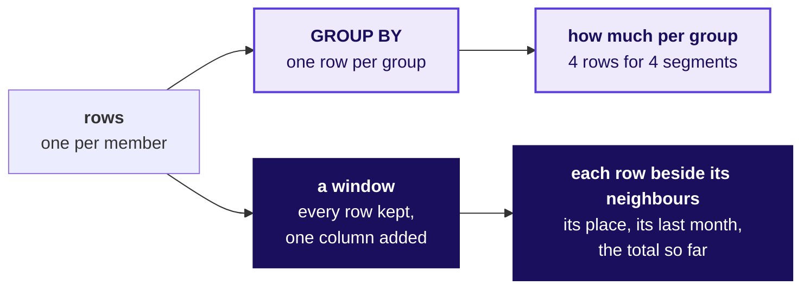

Beside it goes the shape every window takes, `function() OVER (PARTITION BY ... ORDER BY ...)`: the
partition says whose rows belong together, and the order says which row comes before which.

---

## What does each of Marketing's three asks need the window to add to every row?

Each ask is matched to the column its window adds, which is the day's plan in one drawing.

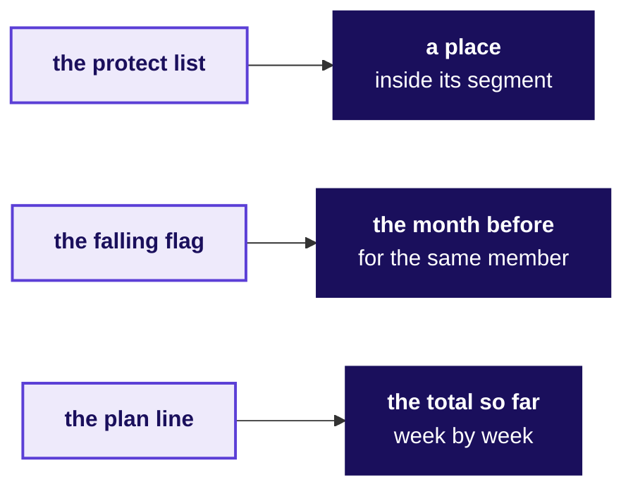

---

## How do a named step and a window turn 462 Q2 orders into a ranked list of members?

Chapter 1 draws the build the room chose from four ways to rank. The named step adds up each member's
Q2, 227 rows that carry all 462 orders, and the window numbers them with the customer id settling
equal spend. Under it the room writes the result: 35 Business members, every Business buyer, then 11
Retail-Plus and 4 Retail-Core, and no Student.

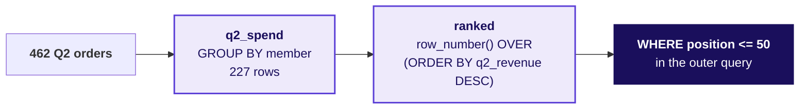

---

## Why did a list of fifty rows name only twenty-eight members, and what does the fix reach?

The quickest list sorted the Q2 orders and kept fifty: 50 rows naming 28 members, all Business. The
check goes up beside it as one line, `count(DISTINCT customer_id)` beside `count(*)`, and then the
fix, which adds up each member's orders before ranking.

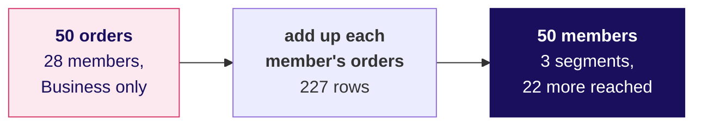

---

## What does PARTITION BY restart, and how many members does each segment's list hold?

Chapter 2 starts from the plausible wrong answer, chapter 1's numbering split by segment: Business
35, Retail-Core 4, Retail-Plus 11 and Student 0. The check goes up as a rule, each list holds the
smaller of 50 and its segment's buyers, and then the drawing of the fix.

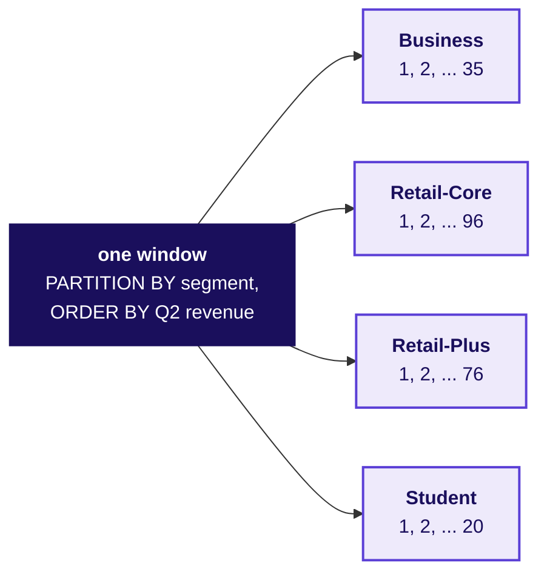

Beside it go the counts, 155 members in all: Business 35 and Student 20, every buyer in both, and
Retail-Core and Retail-Plus 50 each.

---

## Why does the place filter wait for the query outside?

This one goes up when someone writes the place into WHERE and Postgres prints "window functions are
not allowed in WHERE". It takes two minutes, and the drawing points back at Monday's run order.

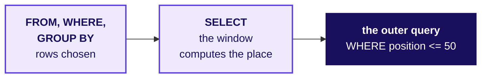

---

## What do ROW_NUMBER, RANK and DENSE_RANK give on one tie?

Chapter 3 works on six invented members, so the mechanism shows on numbers nobody has to trust.
Pairs fill in the three columns on paper before the table is completed on the board.

| Member (invented) | A | B | C | D | E | F |
|---|---|---|---|---|---|---|
| Spend, Rs | 7,500 | 7,500 | 6,000 | 5,200 | 5,200 | 4,100 |
| ROW_NUMBER | 1 | 2 | 3 | 4 | 5 | 6 |
| RANK | 1 | 1 | 3 | 4 | 4 | 6 |
| DENSE_RANK | 1 | 1 | 2 | 3 | 3 | 4 |

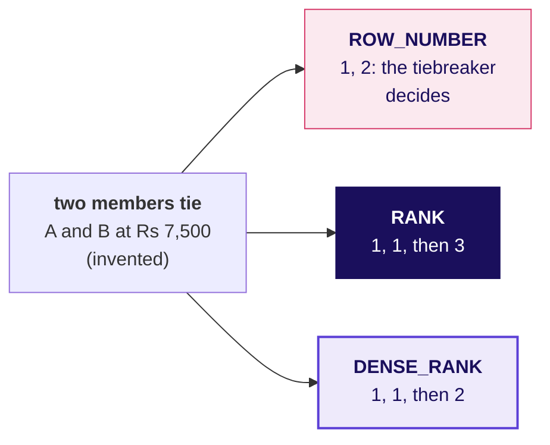

---

## How many rows does each rule ship when two members tie at the line?

A second invented list goes up as a chain, a top four with D and E tied at fourth, which is the line,
the last place a top four keeps. Under it the room writes what each rule ships: ROW_NUMBER 4, RANK 5,
DENSE_RANK 5 and whole ties only 3. With nobody tied at the line, ROW_NUMBER, RANK and whole ties
only would each ship exactly four, and DENSE_RANK could still ship more if a tie sat higher up.

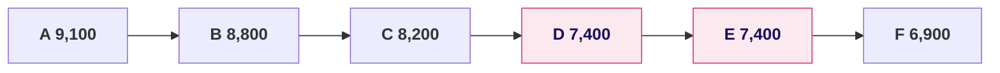

---

## Why does DENSE_RANK's fiftieth number land on Retail-Core's 52nd member?

On Kalpa's Retail-Core, 96 Q2 buyers, a hurried analyst picks DENSE_RANK and ships 52 members as the
top fifty, where the other three rules ship 50. Two ties inside the list cost DENSE_RANK one number
each, and RANK, the rule the head of Retail-Plus asked for, ships the same fifty as ROW_NUMBER here,
since nobody ties at Retail-Core's line. The head's own tier is counted by every learner in their
own notebook.

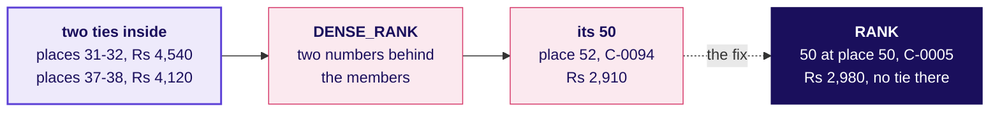

---

## What does LAG put beside each month?

Chapter 4 draws the flag on three calendar months. Beside it goes C-0040 of Retail-Core, who bought
in all six months: April Rs 7,980, May Rs 3,170, June Rs 1,320, July Rs 4,260, August Rs 4,770 and
September Rs 4,520. LAG shows NULL on April, a flag read at June would fire, and the flag read at
September does not, because August rose above July.

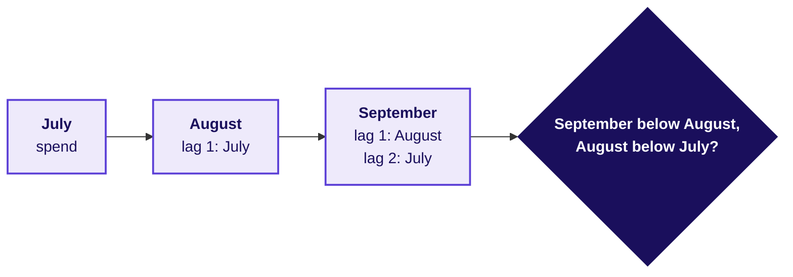

---

## Why did LAG flag C-0132 for a fall from a month they never had?

The quick flag sorted the whole table by member and month with no PARTITION BY and flagged 20
members. C-0132 bought only in July and September, so LAG's second step back ran into C-0131's July.
The check goes up beside it, `lag(customer_id)` carried beside `lag(spend)`: four flags read another
member's month. With PARTITION BY customer_id, 16 members are flagged, out of the 118 who ordered in
September.

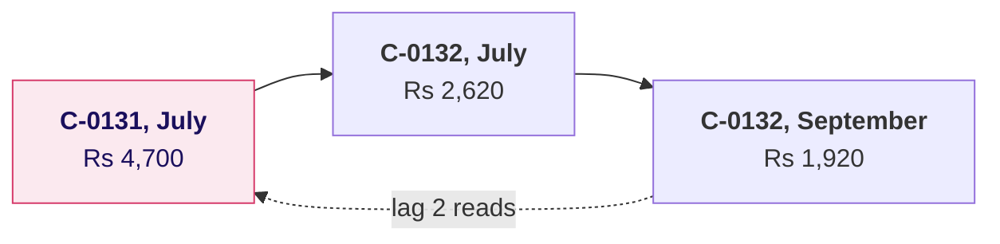

---

## What does a running total add to each week's row?

Chapter 5 draws the running total before any query runs: each week keeps its row and carries the
sum of every week up to and including it, so the last row is the quarter.

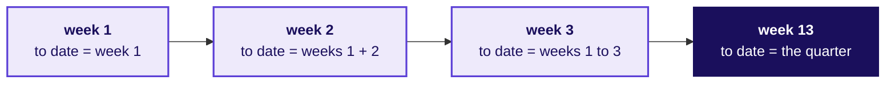

---

## Why did a build that starts from the plan's weeks close Rs 15,39,810 short of plan?

The build that started from the plan's 13 weeks closed at Rs 9,68,60,180 against a plan of
Rs 9,83,99,990. The check sets the close beside Monday's Q2 total, Rs 9,84,00,000, and finds it
Rs 15,39,820 short: the 25 orders of 1 to 5 July fall in a week the plan line does not have.

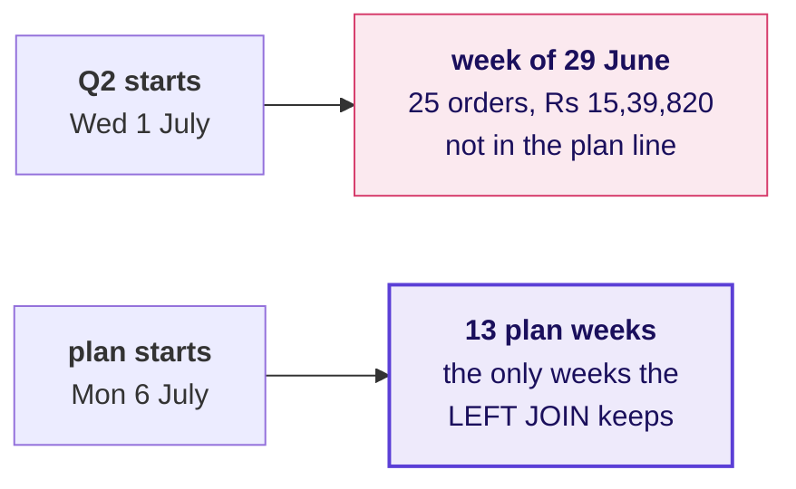

The fix goes under it: `greatest()` moves 1 to 5 July onto the first plan Monday, and Q2 closes on
Rs 9,84,00,000 against Rs 9,83,99,990, Rs 10 ahead.

---

## Where did Q2 stand at mid-quarter, and where did the lead come from?

The quarter's lead goes up as a line of five readings, booked to date less plan to date at the end
of each marked week. Beside it the room writes the run rate: six of the seven full weeks from 10
August booked below the weekly plan of Rs 75,69,230.

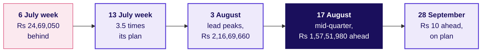

---

## What does "the month before" mean for a member who skipped a month?

Chapter 6 opens on the head of Retail-Plus's message: a flagged member, C-0216, says they were
travelling in August and have not stopped buying. Two readings of "the month before" go up side by
side.

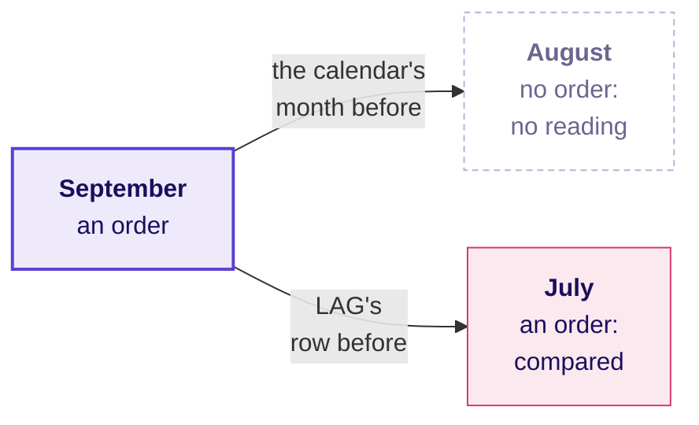

---

## What did LAG compare for C-0216, the member on holiday?

C-0216 of Retail-Plus, place 23 on that segment's list, bought in May, July and September, with no
order in June or August. With no August row, LAG compared September with July and July with May.

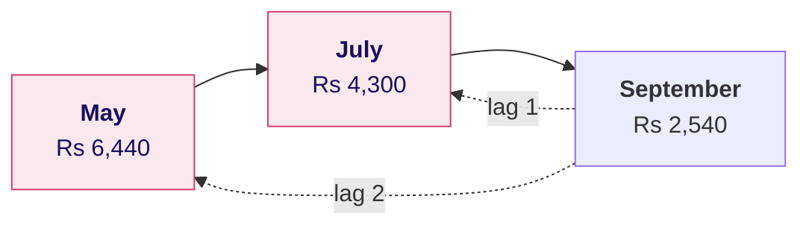

---

## How many of the sixteen flags survive the calendar check?

All 16 flagged members are on a protect list, so the call sheet would read 16 names. The check
carries `lag(month)` beside `lag(spend)`, and 7 of the 16 flags step over an empty month. Under the
drawing goes a fall that holds up: C-0010 of Retail-Core, first on that segment's list, spent
Rs 7,840 in July, Rs 4,080 in August and Rs 1,990 in September.

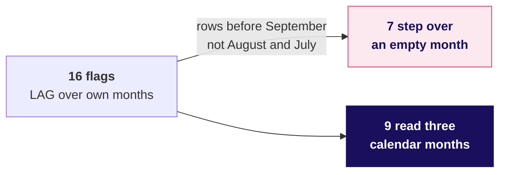

---

## What does Marketing hear when the day ends?

The day's answer goes up as one chain, in the order Marketing reads it.

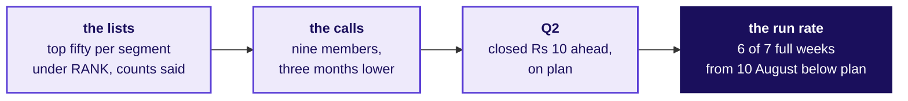

---

## What is on the board when the day ends?

The fork is still up at the top, with the three asks above it and each ask matched to its column.
Under it run the chapters in order: the named step and the window with 35, 11 and 4 written
beside them; the fifty orders that named 28 members, with the count check; PARTITION BY restarting
in four segments, 155 members; the place filter waiting for the outer query; the invented six with
their three columns and the invented top four with 4, 5, 5 and 3; Retail-Core's DENSE_RANK running
two behind to 52; LAG reading the month before, and C-0132 reading C-0131's July; the running total,
the missing week of 29 June, and the lead's five readings; and C-0216's empty August beside the 16
flags that became 9. The chain to Marketing runs across the bottom, and beside it the six lines the
cheat sheet prints:

1. Say what one row of the list is before you rank it: fifty orders named only 28 members.
2. "In each segment" is a PARTITION BY: fifty, or every buyer, in each segment.
3. RANK keeps a tie at the line and says the count; DENSE_RANK can run past the line with no tie at it.
4. Tell the window whose rows belong together, or LAG reads another member's month.
5. A running total is done when its last value equals the quarter's total.
6. A month with no order is no reading: check that LAG read the calendar months before.

Tomorrow's question goes in the corner, left open: the growth team wants one table with one row per
customer, refreshed every Monday, built in pandas.
