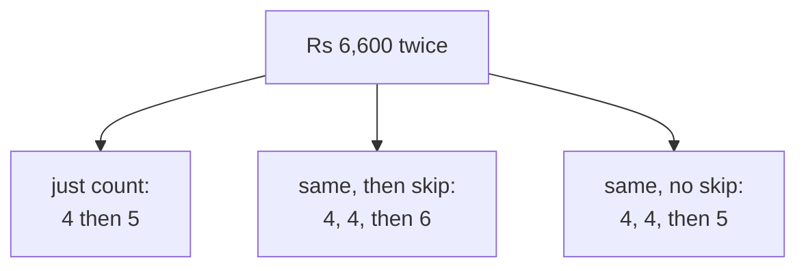

# The board work: eight members, three columns, one argument

## Why eight and not fifty

The tie is invisible in a list of seventy-three and obvious in a list of eight. Write eight
members on the board, put three ranking columns beside them, and let the room fill the columns in
before any function name is used.

## The table to write up

| member | Q2 revenue |
|---|---|
| C-0102 | Rs 9,400 |
| C-0118 | Rs 8,100 |
| C-0140 | Rs 7,250 |
| C-0165 | Rs 6,600 |
| C-0172 | Rs 6,600 |
| C-0181 | Rs 5,900 |
| C-0193 | Rs 5,300 |
| C-0204 | Rs 4,800 |

Three empty columns: "just count", "same for a tie, then skip", "same for a tie, no skip".

Fill them in with the room before writing `ROW_NUMBER`, `RANK` or `DENSE_RANK` anywhere. The
names arrive after the behaviour, which is the whole method.

## The drawing



## Then draw the cut

Draw a horizontal line after position five in each column and count what sits above it.

Five names, six names, six names. Three defensible answers to one question, and the room has
produced all three by hand before anybody ran a query.

## The sentence that decides it

Read it out at this moment and not before:

> "If two members spent the same, I want them ranked the same, and I want to know how many made
> the top five, not four because of a tie."

Ask which clause kills which function. The first clause kills the counting one. The second kills
cutting the tie off. What survives is the middle column.

## The second argument, which is better than the first

Ask what happens if the counting version is run again tomorrow against the same data.

The two tied members can swap, because nothing in the data separates them and nothing in the plan
has to keep them in order. The list is not reproducible, so two analysts hand Marketing different
names from the same query.

That argument has nothing to do with fairness and it is the one that convinces engineers.

## The scale-up, done live

The real Retail-Plus list has a tie at position fifty. Have the room predict the three counts
before running query four of the guided walk.

The answers are fifty, fifty-one and fifty-two. Somebody usually predicts fifty-one and
fifty-one, which is worth unpicking: there is a second tie higher up the list, at positions
forty-eight and forty-nine, and `DENSE_RANK` picks up both.

## What stays on the board

```
RANK, because ties share a position and the list keeps both.
Fifty-one names, and the extra name is the point.
```
