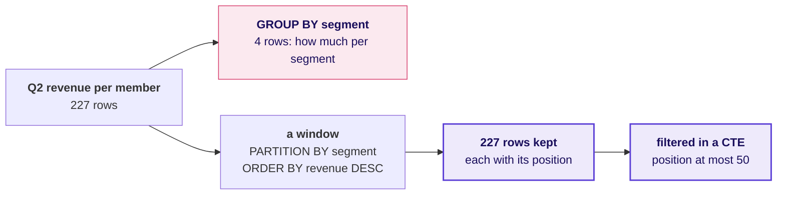
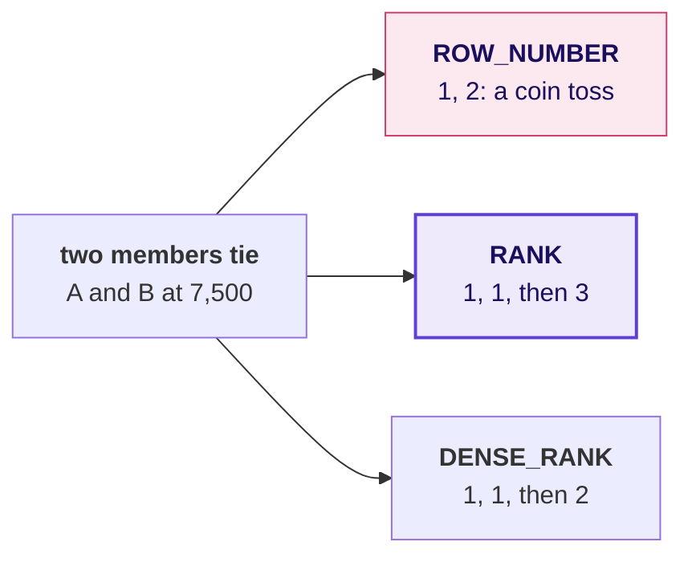
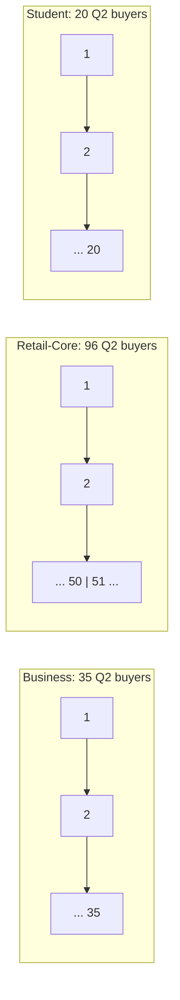
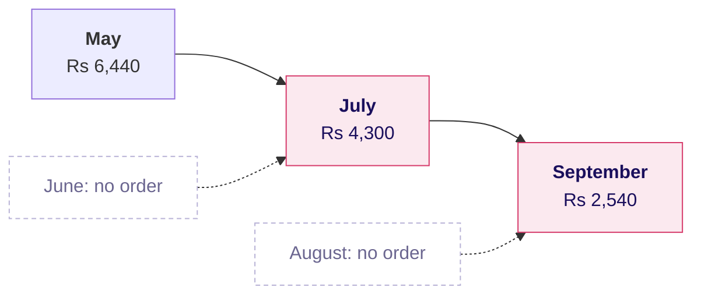
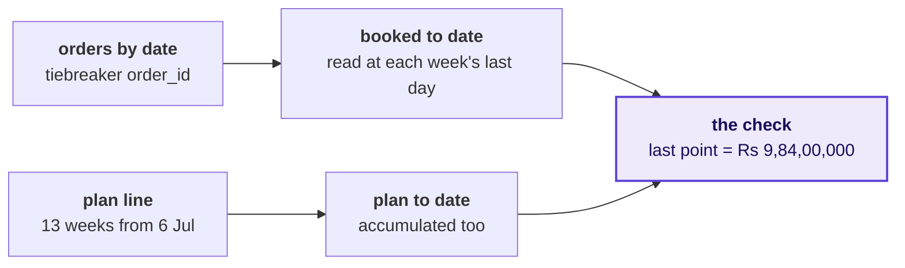

# The kept rows, as they go up on the board

The board work for Week 2, Wednesday, in the order it is drawn. The deck, the notebooks, the
companion page and the cheat sheet carry the same first drawing, so the picture a learner copies
here is the one they meet everywhere else today. Q2 revenue per member means the booked amount of
the member's Q2 orders, the definition behind Monday's quarter total of Rs 9,84,00,000.

---

## First drawing: the kept rows

Marketing's message goes up in three lines at the top of the board: a top fifty in each segment, a
flag for spend that fell two months running, and revenue to date against the plan line. Under it
goes the question every one of the three shares, which is where a row stands among its neighbours,
and then the drawing that answers it.

```mermaid
flowchart LR
    R["<b>Q2 revenue per member</b><br/>227 rows"] --> G["<b>GROUP BY segment</b><br/>4 rows: how much per segment"]
    R --> W["<b>a window</b><br/>PARTITION BY segment<br/>ORDER BY revenue DESC"]
    W --> K["<b>227 rows kept</b><br/>each with its position"]
    K --> F["<b>filtered in a CTE</b><br/>position at most 50"]
    classDef known fill:#EEEAFB,stroke:#5B3FD6,color:#1A0F5C,stroke-width:2px
    classDef bad fill:#FBE9EF,stroke:#D63A6A,color:#1A0F5C
    class G bad
    class K,F known
```

The GROUP BY box is circled in the second colour, because four rows cannot say who is fiftieth.
The last box is drawn when the room meets `ERROR:  window functions are not allowed in WHERE`, and
the note beside it says that WHERE runs before the window exists.

---

## Second drawing: three functions on one tie

Drawn on six invented members, so the mechanism is visible on numbers nobody has to trust. The
room predicts each column before it is filled in.

| Member (invented) | Spend | ROW_NUMBER | RANK | DENSE_RANK |
|---|---|---|---|---|
| A | 7,500 | 1 | 1 | 1 |
| B | 7,500 | 2 | 1 | 1 |
| C | 6,000 | 3 | 3 | 2 |
| D | 5,200 | 4 | 4 | 3 |
| E | 5,200 | 5 | 4 | 3 |
| F | 4,100 | 6 | 6 | 4 |

```mermaid
flowchart LR
    T["<b>two members tie</b><br/>A and B at 7,500"] --> RN["<b>ROW_NUMBER</b><br/>1, 2: a coin toss"]
    T --> RK["<b>RANK</b><br/>1, 1, then 3"]
    T --> DR["<b>DENSE_RANK</b><br/>1, 1, then 2"]
    classDef known fill:#EEEAFB,stroke:#5B3FD6,color:#1A0F5C,stroke-width:2px
    classDef bad fill:#FBE9EF,stroke:#D63A6A,color:#1A0F5C
    class RK known
    class RN bad
```

Beside it goes the count each rule ships for a top four with a tie at fourth (invented: 9,100,
8,800, 8,200, 7,400, 7,400, 6,900): ROW_NUMBER ships 4, RANK ships 5, DENSE_RANK ships 5, and whole
ties only ships 3. The head of Retail-Plus's sentence is written under it, and the room names the
function his sentence asks for.

---

## Third drawing: the partition, as boxes that restart

Each segment is its own box, and the count starts again at 1 inside every box. The ORDER BY inside
the window decides who is first within a box; the ORDER BY at the end of the query only decides how
the result prints.

```mermaid
flowchart LR
    subgraph B["Business: 35 Q2 buyers"]
      B1["1"] --> B2["2"] --> B3["... 35"]
    end
    subgraph C["Retail-Core: 96 Q2 buyers"]
      C1["1"] --> C2["2"] --> C3["... 50 | 51 ..."]
    end
    subgraph S["Student: 20 Q2 buyers"]
      S1["1"] --> S2["2"] --> S3["... 20"]
    end
```

The line at fifty is drawn through the Retail-Core box, between C-0005 on Rs 2,980 and C-0092 on
Rs 2,950. Business and Student get a note that says their top fifty is every member who bought,
because neither has fifty Q2 buyers.

---

## Fourth drawing: LAG lining up the months, with the gap

One member's months go up as boxes in the order LAG reads them. C-0216 bought in May, July and
September and in no other month from April to September.

```mermaid
flowchart LR
    M["<b>May</b><br/>Rs 6,440"] --> J["<b>July</b><br/>Rs 4,300"]
    J --> S["<b>September</b><br/>Rs 2,540"]
    G1["June: no order"] -.-> J
    G2["August: no order"] -.-> S
    classDef bad fill:#FBE9EF,stroke:#D63A6A,color:#1A0F5C
    classDef unknown fill:#FFFFFF,stroke:#B8B2D6,color:#6B6690,stroke-dasharray:4 3
    class J,S bad
    class G1,G2 unknown
```

LAG calls July "last month" for September, so the arrows read as a fall across two gaps. Beside it
goes the rule the room writes down: a fall counts only when the previous row is the previous
calendar month, and a month with no order is no reading. A genuine fall is drawn under it for
contrast: C-0010, Rs 7,840 in July, Rs 4,080 in August and Rs 1,990 in September.

The three counts go up as the room finds them: 20 flagged without a partition, 16 with one, and 9
once the previous two rows must be August and July.

---

## Fifth drawing: the running total against plan

Two lines are drawn rising across thirteen plan weeks: booked to date, and plan to date. The
mid-quarter reading is marked at the end of the seventh plan week, where Q2 had booked
Rs 6,87,36,590 against a plan to date of Rs 5,29,84,610.

```mermaid
flowchart LR
    O["<b>orders by date</b><br/>tiebreaker order_id"] --> A["<b>booked to date</b><br/>read at each week's last day"]
    P["<b>plan line</b><br/>13 weeks from 6 Jul"] --> PT["<b>plan to date</b><br/>accumulated too"]
    A --> C["<b>the check</b><br/>last point = Rs 9,84,00,000"]
    PT --> C
    classDef known fill:#EEEAFB,stroke:#5B3FD6,color:#1A0F5C,stroke-width:2px
    class C known
```

Two wrong readings are written beside it in the second colour. A running actual set beside one
week's plan of Rs 75,69,230 looks like nine times the plan. A plan-first join closes at
Rs 9,68,60,180 because the orders of 1 to 5 July sit in a week the plan line does not have.

---

## What is on the board when the day ends

1. The kept rows, with the GROUP BY box circled and the CTE box drawn after the WHERE error.
2. The six invented members with all three columns filled in, and RANK marked as the function the
   head of Retail-Plus asked for.
3. The segment boxes with the line at fifty through Retail-Core and the note on Business and
   Student.
4. C-0216's three months with the two gaps, beside C-0010's genuine fall, and the counts 20, 16
   and 9.
5. The two rising lines with the mid-quarter mark, the check that the last point equals
   Rs 9,84,00,000, and the four lines of the day written across the bottom:
   - GROUP BY answers how much per group; a window keeps every row and says where each row stands.
   - The tie rule is a business decision written as a function name: RANK keeps everyone at the line, and the report says how many.
   - LAG reads the previous row, so partition by the member and check the previous row is last month.
   - A running total is only as true as its order and its start; check it closes on the quarter's total.
