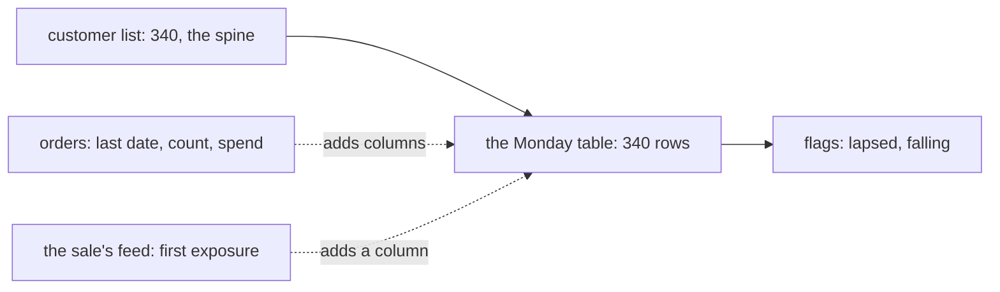

# Week 2 Thursday: Can the growth team act on Monday's table without checking it?

Kalpa Retail's growth team wants one row per customer, rebuilt every Monday in pandas from the
warehouse: recency, frequency, spend, segment, the monsoon sale's reach and the flags it acts on.

## Panel 1: Which source decides the table's rows, and what does each source add?



The customer list decides the rows; the orders and the campaign feed only add columns. Every Monday the
table agrees with three numbers before it leaves: 340 rows, Rs 19,84,00,000 of spend, and the as-of
date, 28 September 2026, the last date the data covers.

**Crux:** Start a customer table from the customer list, because a table built from orders leaves out everyone who never ordered: 39 of Kalpa's 340.

## Panel 2: Which way builds one row per customer, and when does it move to the warehouse?

| Option | Rows moved | Lines | Best when |
|---|---|---|---|
| Week 1's loop | 1,000 | 6 | Explaining one case line by line |
| SQL `GROUP BY` | 301 | 7 | The orders run to crores |
| pandas `groupby` | 1,000 | 3 | The next steps need the orders in memory |

```python
rfm = orders.groupby("customer_id").agg(
    last_order=("order_date", "max"),
    frequency=("order_id", "count"),
    spend=("amount", "sum")).reset_index()
```

Merge it onto the customer list, then fill a missing count with 0 on purpose: a missing value is never
equal to 0.

## Panel 3: How does a merge keep the table at one row per customer?

`merge` with no `how` is an inner join. `validate="one_to_one"` promises each key at most once on each
side and raises `MergeError` before a wrong table exists. A customer sent twice is a business question:
the growth team keeps the first exposure.

```python
first = (feed.sort_values("exposed_date")
             .drop_duplicates("customer_id", keep="first"))
table = table.merge(first, on="customer_id",
                    how="left", validate="one_to_one")
```

**Crux:** Write `how=` and `validate=` on every merge, because one repeated key adds a customer's whole spend again and `validate` stops the merge before the table exists.

## Panel 4: What does `pivot_table` put in each cell, and which shape answers which question?

| Shape | One row is | Answers |
|---|---|---|
| Long, `groupby` on two keys | A member and a month | A trend, month by month |
| Wide, `pivot_table` | A member, a column per month | A comparison along the row |
| Wide back to long, `melt` | A member and a month, zeros kept | A chart of every month |

**Crux:** Write `aggfunc=` on every pivot and check its grand total against the source, because `pivot_table` averages by default and turned a 29 percent fall into 18.

## Panel 5: Why did three tools disagree about who bought, and how did they come to agree?

| Tool | A customer with no segment |
|---|---|
| Plain Python dictionary | Filed under `None` |
| SQL `GROUP BY` | One `NULL` group |
| pandas `groupby` | Dropped, unless `dropna=False` |

The 23 reached customers who never ordered had no segment in their orders, so pandas said 100 percent.
With the segment from the customer list, all three say 107 of 130, 82 percent. The groups must add
back to the rows.

## Panel 6: Which tool owns which recurring number?

| The ask | Owner | Why |
|---|---|---|
| Finance's revenue | SQL | Finance reruns it where the data lives; it moves 8 rows |
| The customer table | pandas, reading the warehouse | Analysts add columns weekly |
| The months view | pandas | It pivots data in memory |
| An auditor's one-off | Plain Python | Each step is a readable line |

A pandas notebook is refused for Finance. Size by rows moved: SQL 8, pandas 1,340.

**Crux:** Two tools agree only when they share one definition, so give each recurring number one owner, chosen by who reruns it and sized by the rows each route moves.

## Panel 7: What makes a Monday refresh safe to leave alone?

Recency counts to `orders["order_date"].max()`, carried as `as_of`. Counted to 19 October, the
win-back list read 166 where the data holds 111; the 21 days between are the data's age.

| Guard | Catches |
|---|---|
| One row per customer | A repeated key |
| Rows equal the customer list | A customer missing or doubled |
| Spend equals the warehouse | A customer's spend counted twice |
| Smallest recency is 0 | Recency counted to the wrong day |

**Crux:** Count recency to the data's own last date and let the refresh refuse a table that fails a guard, because the wall clock put 166 customers on a list that holds 111.
