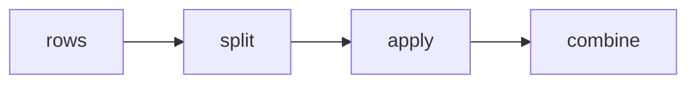

# pandas, against SQL, against plain Python

## Panel 1: Split, apply, combine

**Crux:** `groupby` is the Week 1 accumulator with the splitting and the combining done for you,
leaving only the part that was ever about your question.



```python
orders.groupby("customer_id").agg(
    frequency=("order_id", "count"),
    monetary=("amount", "sum"),
    last_order=("order_date", "max"),
)
```

## Panel 2: Name every aggregation

**Crux:** The short form sums every numeric column, including ones nobody meant to add up, and
names them after the inputs.

| Form | What it costs |
|---|---|
| `.sum()` | Shorter to type, and six months later nobody can tell whether a column was chosen or inherited |
| `.agg(name=(col, fn))` | Longer to type, and every column says where it came from |

State a reference date for recency. Counting from today makes the table change meaning every time
it is rebuilt.

## Panel 3: merge is join, with the same danger

**Crux:** A merge fans out exactly like a join, and pandas will refuse if you tell it what you
believe.

```python
table.merge(feed, on="customer_id",
            how="left", validate="one_to_one")
```

```
pandas.errors.MergeError: Merge keys are not
unique in right dataset; not a one-to-one merge
```

## Panel 4: The four validate values

**Crux:** Each value is a claim about the data, so choosing one forces you to say what you believe
before the data disagrees.

| Value | Promises |
|---|---|
| `one_to_one` | Keys unique on both sides |
| `one_to_many` | Keys unique on the left |
| `many_to_one` | Keys unique on the right |
| `many_to_many` | Nothing, and says so out loud |

Fixing a failure is a decision, not a keyword: drop duplicates and you pick a row arbitrarily,
aggregate first and you keep both facts, ask the feed's owner and you fix it upstream.

## Panel 5: Reshape changes the question

**Crux:** `pivot_table` widens and `melt` lengthens, and nothing is added or removed by either.

```python
wide = long.pivot_table(index="customer_id",
        columns="month", values="spend", aggfunc="sum")
back = wide.reset_index().melt(id_vars="customer_id")
```

| Shape | One row is | Easy question |
|---|---|---|
| Long | A customer-month | How did this move |
| Wide | A customer | How do these compare |

Read the row labels aloud before reading any value. "Each row is one order" is how a wrong index
gives itself away.

## Panel 6: Which tool owns which number

**Crux:** Three questions pick the tool nearly every time, and none of them is about syntax.

Who owns this number, for how long, and who has to be able to read it.

| Tool | Owns | Never |
|---|---|---|
| Warehouse | Numbers Finance acts on | Exploration |
| pandas | The analyst's iteration | The source of truth |
| Plain Python | What you explain line by line | Anything at scale |

A notebook has no audit trail a controller can read, and a cell edited at 4 pm looks identical to
one nobody touched.
