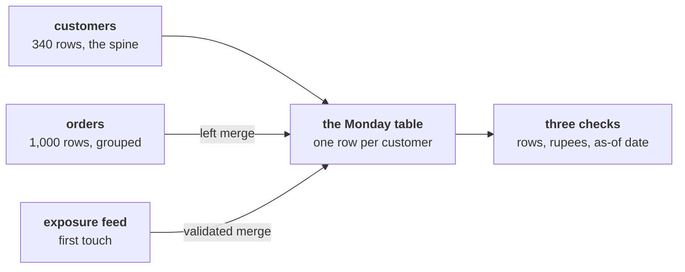

# The Monday customer table in pandas

Kalpa Retail, Week 2 Thursday. One row per customer, built from the warehouse every Monday, with
every default written down and three checks before it leaves the team.

## Panel 1: A spine, three attachments, three checks


```mermaid
flowchart LR
    C["<b>customers</b><br/>340 rows, the spine"] --> T["<b>the Monday table</b><br/>one row per customer"]
    O["<b>orders</b><br/>1,000 rows, grouped"] -->|"left merge"| T
    E["<b>exposure feed</b><br/>first touch"] -->|"validated merge"| T
    T --> K["<b>three checks</b><br/>rows, rupees, as-of date"]
```

Rows against the customer list (340), spend against Monday's book (Rs 19,84,00,000), and recency
from the data's last date (28 September 2026), where the smallest recency is 0.

**Crux:** groupby is the accumulator automated: split, apply, combine.

## Panel 2: One row per customer

```python
rfm = (orders.groupby("customer_id")
             .agg(last_order=("order_date", "max"),
                  frequency=("order_id", "count"),
                  monetary=("amount", "sum"))
             .reset_index())
table = customers.merge(rfm, on="customer_id",
                        how="left", validate="one_to_one")
table["frequency"] = table["frequency"].fillna(0).astype("int64")
AS_OF = orders["order_date"].max()
table["recency_days"] = (AS_OF - table["last_order"]).dt.days
```

**Crux:** Start from the customer list; groupby only knows the keys it sees.

## Panel 3: Three tools, one move

| The move | SQL | pandas |
|---|---|---|
| per customer | `GROUP BY` | `groupby().agg()` |
| attach a source | `LEFT JOIN` | `merge(how="left")` |
| window total | `sum() OVER` | `groupby().transform("sum")` |
| previous month | `LAG() OVER` | `groupby().shift(1)` |

## Panel 4: Four defaults that decide a number

| Default | What it did | The check |
|---|---|---|
| recency from today | win-back 166, truly 111 | smallest recency is 0 |
| `merge(validate=None)` | a repeat copies spend | rows in equal rows out |
| `groupby(dropna=True)` | reach 107 at 100 percent | groups add back to rows |
| `pivot_table(aggfunc="mean")` | a fall of 18, truly 29 percent | grand total equals source |

**Crux:** Measure recency from the data's last date, never from today.

## Panel 5: The merge, made loud

```python
first = (exposure.sort_values("exposed_date")
                 .drop_duplicates("customer_id", keep="first"))
table.merge(first, on="customer_id", how="left",
            validate="one_to_one")
# a repeat raises pandas.errors.MergeError
```

**Crux:** A merge is a join, and validate= turns the fan-out into a MergeError.

## Panel 6: Reshape with the aggregation said

| Call | Shape | Answers |
|---|---|---|
| `pivot_table(index=member, columns=month, aggfunc="sum")` | wide | compare along a row |
| `.melt(id_vars=member)` | long | follow a trend |
| `pivot(...)` | wide, or ValueError on a repeat | one value per cell |

**Crux:** pivot_table averages unless you write aggfunc.

## Panel 7: Which tool owns which job

SQL owns what Finance audits and reruns; pandas is the analyst's bench for files, merges and five
cuts in an afternoon; plain Python shows every step to a reviewer. A hand-edited sheet never
computes the source of truth.

**Crux:** SQL for what Finance audits, pandas for the analyst's bench, plain Python to explain.
