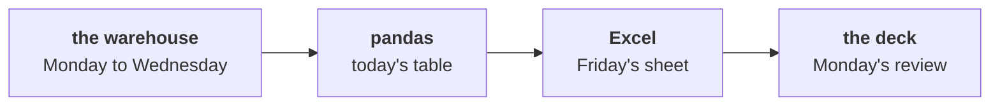

# What will Friday's Excel day ask of the table you built today, and how do you get ready tonight?

This takes ten minutes tonight and ends on one check to run.

---

## What does Meera's office ask for on Friday?

Meera Raghavan, Kalpa Retail's CEO, runs her office on Excel. Her chief of staff has written to the
team about Monday's growth review:

> "Monday's growth review deck needs three things I can open on my laptop without a login: the
> revenue tree by segment for both quarters, the top-fifty protect list with a lookup so I can find
> any member by id, and one number on the front page with its trend. Nothing that needs Python. If a
> director changes an assumption in the room, the sheet must recalculate in front of them."
>
> Meera's chief of staff, Kalpa Retail

Friday builds those three things in Excel, starting from the customer table you built today. A
director at the review will change an assumption in front of everyone, and the sheet has to hold.

---

## Which words does Friday use, and what from this week is each like?

Fill in the last column tonight, one line each, from memory. Friday explains each word once, and a
word you can already place takes half the time.

| Word | What it is in Excel | What from this week it is like, in your words |
|---|---|---|
| PivotTable | A grouped summary a director can rearrange by dragging fields | |
| Slicer | A button that filters a PivotTable on one field | |
| XLOOKUP | A formula that finds a value by its key in another range | |
| Front-page number | The one figure a deck opens on | |

---

## Which of this week's steps would you never let happen inside a sheet a director can edit?

This week you merged a campaign feed with a stated promise, counted recency to the data's last date,
chose a tie rule for a ranked list and put one number in front of a stakeholder. Pick the one step you
would least want a director able to change in the room, and have one reason ready. Friday asks.

---

## Does your table come out of today's notebook ready for Excel?

Open the CSV your escalated case wrote to `output/`, `C2_W02_D04_customer_table_STUDENT.csv`, and
confirm three things: 340 rows, a spend column that adds up to Rs 19,84,00,000, and an `as_of`
column that reads 28 September 2026 on every row. Bring it to Friday; the day is built on it. If the
notebook did not reach its last cell, rerun it from a fresh kernel tonight, before the session opens.

---

## Which line do you carry into Friday?

A number belongs where the person who reruns it can run it, and every copy of it is checked against
that one place.
