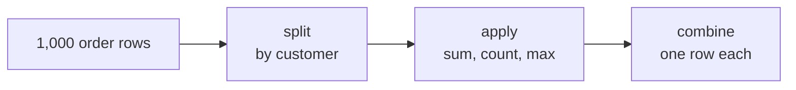
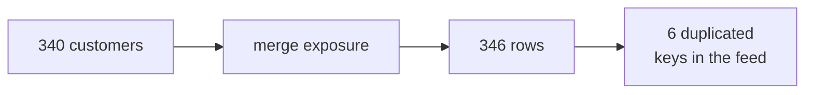
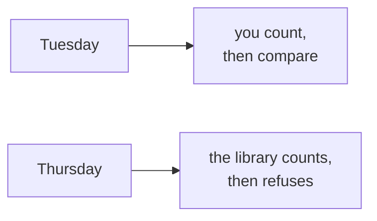
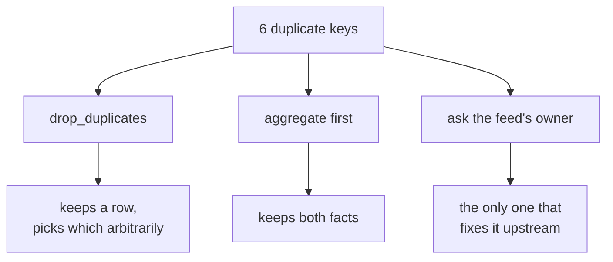
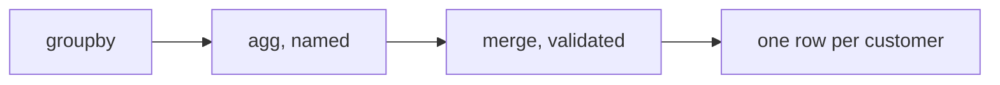

# Half one: one row per customer, built three ways

Week 2, Day 4. Slide source. One idea per slide.

Position bar, repeated at every section boundary:
`[the growth team's ask] > [groupby is the accumulator] > [the merge that raises] > [the customer table]`

---

## SECTION A. One table, every Monday

---

## S1. The growth team wants one thing
> "One table, one row per customer, refreshed on Monday. How recently they bought, how often, how
> much, their segment, whether the monsoon sale reached them, and last week's flags."

Not a report. A table other people build on.

---

## S2. And the platform lead is blunt about where
> "The warehouse queries are fine for Finance, but Marketing's analysts live in Python. Build them
> the table in pandas, from the warehouse, and make it refreshable in one run."

Two tools, one source of truth, and a reason for each.

---

## S3. A senior analyst raises the real question
> "You did the tree in plain Python in Week 1, in SQL on Monday. Do it a third way now, and tell
> me honestly which tool you would pick for which job."

You answer that in writing today. It is the day's actual deliverable.

---

## S4. What the table has to carry
| Column | Where it comes from |
|---|---|
| Recency | The customer's latest order date |
| Frequency | Their order count |
| Monetary | Their total spend |
| Segment | The customers table |
| Exposed | The campaign exposure feed |
| Flags | Wednesday's ranking and falling-spend work |

---

## SECTION B. groupby is the accumulator, automated

---

## S5. Week 1 built this by hand
```python
totals = {}
for o in orders:
    cid = o["customer_id"]
    totals[cid] = totals.get(cid, 0) + o["amount"]
```
Split the rows by customer, apply a sum, combine into one row each. You wrote the splitting and
the combining yourself.

---

## S6. The same three moves, named

Split, apply, combine. `groupby` does the splitting and the combining and leaves you the applying.

---

## S7. One line, three measures
```python
customers = orders.groupby("customer_id").agg(
    frequency=("order_id", "count"),
    monetary=("amount", "sum"),
    last_order=("order_date", "max"),
)
```
Named aggregations say what each output column is and where it came from, on one line each.

---

## D1. Why the named form rather than the short one
`orders.groupby("customer_id").sum()` also runs. It sums every numeric column, including ones you
never meant to add up, and names them after the inputs.

Six months later nobody can tell whether a column was chosen or inherited. The named form is
longer to type and shorter to audit.

---

## S8. Recency needs a reference date
```python
AS_OF = pd.Timestamp("2026-09-30")
customers["recency_days"] = (AS_OF - customers["last_order"]).dt.days
```
Days since last order, counted from a date you state. Counting from today makes the table change
meaning every time it is rebuilt.

---

## SECTION C. The merge that raises

---

## S9. A merge is a join, with a different name
```python
table = customers.merge(exposure, on="customer_id", how="left")
```
Same idea as Tuesday. Same danger.

---

## S10. Run it and count

340 customers go in. 346 rows come out.

Six extra rows, from a feed where the same customer appears twice. Tuesday's fan-out, in Python.

---

## S11. pandas will refuse if you ask it to
```python
table = customers.merge(exposure, on="customer_id",
                        how="left", validate="one_to_one")
```
```
pandas.errors.MergeError: Merge keys are not unique in right dataset;
not a one-to-one merge
```

---

## D2. This is the loud version of Tuesday's count check

Tuesday you took the row count yourself and compared it. `validate=` makes the library take it
for you and refuse to continue.

The check has not changed. What changed is that forgetting it is now impossible rather than
merely unwise.

---

## S12. The four values, and what each one promises
| `validate=` | Promise |
|---|---|
| `one_to_one` | Keys unique on both sides |
| `one_to_many` | Keys unique on the left |
| `many_to_one` | Keys unique on the right |
| `many_to_many` | Nothing, and it says so out loud |

Choosing one forces you to say what you believe about the data before it disagrees with you.

---

## S13. Fixing it is a decision, not a keyword


---

## S14. Where half one leaves you

You can build a one-row-per-customer table from the warehouse, name every aggregation, set a
reference date, and make a merge fail loudly rather than quietly.

Half two reshapes it and answers the senior analyst.
