# The customer table Marketing refreshes every Monday

Week 2, Day 4. Half one.

Kicker: WEEK 2  ·  THURSDAY  ·  HALF ONE
Quote: The warehouse queries are fine for Finance, but Marketing's analysts live in Python. Build them the table in pandas, from the warehouse, and make it refreshable in one run.
Who: The data platform lead, Kalpa Retail, to the data and AI team at Kalpa's Global Capability Centre

```notes
LIVE, one minute. Read the platform lead's line aloud and leave it up while the room settles.
Say the week's arc once: Monday the tree in SQL, Tuesday the join that doubled money, Wednesday
ranks and falling spend, today the same moves in pandas, Friday the number reaches the deck in
Excel. Every pandas move today is something the room has already done by hand; say that, and
say it again at each round.
```

---

## SECTION 1: The ask
*The growth team wants one row per customer every Monday, and the thinking comes before pandas.*

```notes
LIVE. Twenty minutes, no code. The job of this chapter is the picture of the table: its grain,
its columns, where each column comes from, and the three checks it must pass.
```

---

## S1. Monday morning, the growth team's ask
*One table, one row per customer, refreshed every week without anyone rebuilding it.*

**The client asks.** "Every Monday, one table: how recently each customer bought, how often, how much, their segment, whether the monsoon sale reached them, and last week's flags. Marketing's analysts will work from it all week."

```cards
icon: users | eyebrow: The grain | title: One row per customer | body: 340 customers in the warehouse, including those who never ordered.
icon: database | eyebrow: The sources | title: Warehouse plus a feed | body: Orders and customers in Postgres; the sale's exposure arrives as a file.
icon: refresh-cw | eyebrow: The promise | title: One run, every Monday | body: The same data gives the same table, and a bad feed stops the run. | tone: dark
```

```notes
LIVE, 3 minutes. Read the ask aloud. Ask what "one row per customer" rules out: a row per order,
a row per month, a row per campaign touch. The grain is the first decision and every trap today
is a table that quietly changed its grain.
```

---

## S2. Question: where does each column come from?
*Seven columns, and each one is a move you have already made this week.*

| Column | Where it lives |
|---|---|
| segment | ? |
| recency, frequency, spend | ? |
| reached by the sale | ? |
| lapsed, falling | ? |

**Question.** Which source and which move produces the recency, frequency and spend columns? a) the customers table, read as it is; b) the orders table, grouped by customer; c) the exposure feed, merged on customer_id; d) Wednesday's window query, pasted in.

```notes
LIVE, 3 minutes. Pairs for one minute, then letters. Most rooms say b quickly; push on why a is
wrong: the customers table knows who exists, not what they did. Hold the full mapping for the
next slide.
```

---

## S3. Answer: the orders, grouped, attached to the list
*The customer list is the spine; everything else is attached to it by customer_id.*

| Column | Source | The move | You did it on |
|---|---|---|---|
| segment | customers | the spine itself | Monday's JOIN |
| recency, frequency, spend | orders | groupby and agg | Week 1's accumulator, Monday's GROUP BY |
| reached by the sale | exposure feed | merge, validated | Tuesday's LEFT JOIN |
| lapsed | recency | a condition | Week 1's filter |
| falling | orders by month | groupby and shift | Wednesday's LAG |

```notes
LIVE, 2 minutes. The answer is b. Walk the last column: nothing on this table is new except the
syntax. That is the sentence to repeat all day.
```

---

## S4. The table, drawn before any code
*A spine of 340 customers, three things attached, and three checks at the end.*

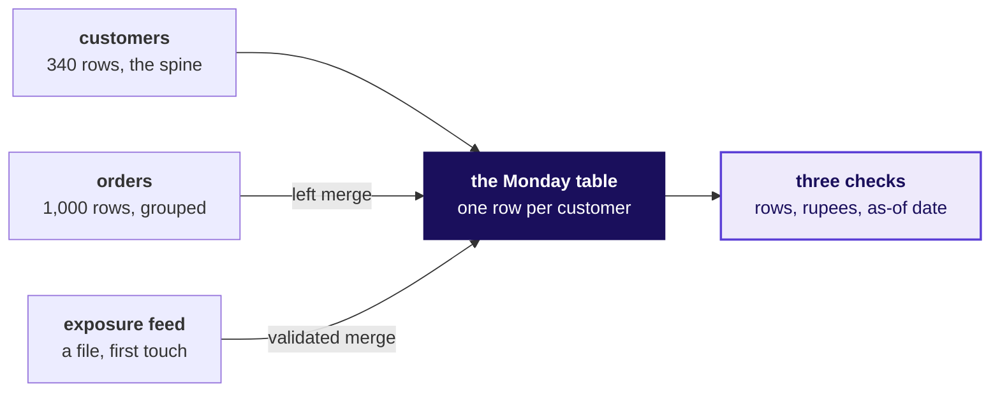
```mermaid
flowchart LR
    C["<b>customers</b><br/>340 rows, the spine"] --> T["<b>the Monday table</b><br/>one row per customer"]
    O["<b>orders</b><br/>1,000 rows, grouped"] -->|"left merge"| T
    E["<b>exposure feed</b><br/>a file, first touch"] -->|"validated merge"| T
    T --> K["<b>three checks</b><br/>rows, rupees, as-of date"]
    classDef bet fill:#1A0F5C,stroke:#1A0F5C,color:#FFFFFF
    classDef known fill:#EEEAFB,stroke:#5B3FD6,color:#1A0F5C,stroke-width:2px
    class T bet
    class K known
```

```notes
LIVE, 4 minutes. Draw this on the board with the room before any laptop opens, and leave it up
all day; every round adds to it. The three checks on the right are Kavya's, next slide.
```

---

## S5. Three moves you have made, in three tools
*groupby is the accumulator, merge is the join, shift is LAG.*

| The move | Plain Python, Week 1 | SQL, this week | pandas, today |
|---|---|---|---|
| total per customer | a dict, start, update, finish | `GROUP BY customer_id` | `groupby("customer_id").agg(...)` |
| attach a second source | a lookup inside the loop | `LEFT JOIN ... ON` | `merge(how="left", validate=...)` |
| the previous month | a variable carried across the loop | `LAG() OVER (PARTITION BY ...)` | `groupby(...).shift(1)` |

**The rule.** Every pandas move today lands on something you did by hand, and saying which one is half the explanation in an interview.

```notes
LIVE, 3 minutes. Point at each row and ask who wrote that SQL this week. The afternoon's second
case runs one question through all three columns of this table.
```

---

## S6. The three checks the table must pass
*Kavya's review before the table leaves the team, written down before it is built.*

```stats
value: 340 | label: rows | note: one per customer on the list
value: Rs 19.84 cr | label: spend | note: Monday's two-quarter book
value: 28 Sep | label: as-of date | note: the data's last order
```

**Kavya's review.** "Row count against the customer list, spend against Monday's revenue, and the date every recency was measured from. If any of the three moves, the table is wrong until you can say why."

```notes
LIVE, 3 minutes. Write the three numbers on the board beside the drawing. Every trap this
morning moves one of them, and the room should be able to say which one each time.
Transition: round 1 builds the spine.
```

---

## SECTION 2: One row per customer
*groupby turns 1,000 order rows into one row per customer, and recency needs a date to stand on.*

```notes
LIVE. Round 1, 50 minutes: the question and its picture (5), the demonstration (15), the trap
(10), the room's harder variant (15), Kavya's review (5). Notebook 1 beside it.
```

---

## S7. The question: every customer, one row each
*Split the orders by customer, apply three calculations, combine into one row.*

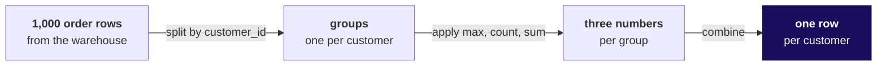
```mermaid
flowchart LR
    R["<b>1,000 order rows</b><br/>from the warehouse"] -->|"split by customer_id"| G["<b>groups</b><br/>one per customer"]
    G -->|"apply max, count, sum"| A["<b>three numbers</b><br/>per group"]
    A -->|"combine"| T["<b>one row</b><br/>per customer"]
    classDef bet fill:#1A0F5C,stroke:#1A0F5C,color:#FFFFFF
    class T bet
```

**The client asks.** "How recently, how often and how much, for every customer, in one table."

```notes
LIVE, 3 minutes. Say split, apply, combine aloud and have the room say it back. This is the
interview's staple sentence, and it is the Week 1 accumulator with a name.
```

---

## S8. The warehouse arrives as a DataFrame
*read_sql runs the query in Postgres and hands back a frame whose count must match Monday.*

```python
ENG = kit.engine()
orders = pd.read_sql("SELECT order_id, customer_id, order_date, quarter, "
                     "channel, amount, status FROM orders", ENG,
                     parse_dates=["order_date"])
```

```stats
value: 1,000 | label: rows | note: Monday's count(*), matched
value: float64 | label: amount | note: numeric(12,2) read as a number
value: str | label: customer_id | note: pandas 3's text dtype
```

```notes
LIVE, 4 minutes. Run notebook 1, section 1. Point out that pandas 3 shows text as str where
older tutorials say object, so a check written as dtype == object misses every text column.
parse_dates is what makes the date subtractable later; without it recency fails in section 4.
```

---

## S9. Question: how many rows does groupby return?
*orders.groupby("customer_id")["amount"].sum() on the 1,000 orders.*

```python
per_customer = orders.groupby("customer_id")["amount"].sum()
len(per_customer)
```

**Question.** What does `len(per_customer)` print? a) 1,000, one per order; b) 340, one per customer in the warehouse; c) 301; d) 4, one per segment.

```notes
LIVE, 2 minutes. Predictions first, in writing. The split will be between a and b; a few will
say c without knowing why.
```

---

## S10. Answer: 301, because 39 customers never ordered
*groupby only makes a group for a key it sees, so the customer list has to be the spine.*

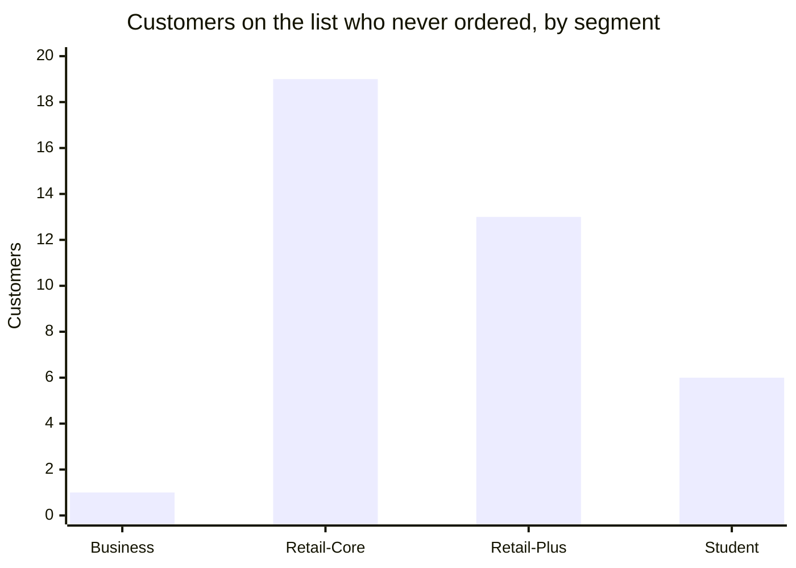
```mermaid
xychart-beta
    title "Customers on the list who never ordered, by segment"
    x-axis ["Business", "Retail-Core", "Retail-Plus", "Student"]
    y-axis "Customers" 0 --> 20
    bar [1, 19, 13, 6]
```

340 customers on the list, 301 who ordered, and 39 that groupby never saw. The loop in Week 1 had the same blind spot.

```notes
LIVE, 3 minutes. The answer is c. The fix is the customer list as the spine and the aggregates
attached with a left merge, which is Monday's customers LEFT JOIN orders. The loop and groupby
agree for all 301; the notebook checks that.
```

---

## S11. Named aggregations say the SQL in pandas
*Three measures per customer in one call, each named as it would be in a SELECT.*

```python
rfm = (orders.groupby("customer_id")
             .agg(last_order=("order_date", "max"),
                  frequency=("order_id", "count"),
                  monetary=("amount", "sum"))
             .reset_index())
table = customers.merge(rfm, on="customer_id", how="left",
                        validate="one_to_one")
```

| SQL | pandas |
|---|---|
| `max(order_date) AS last_order` | `last_order=("order_date", "max")` |
| `count(*) AS frequency` | `frequency=("order_id", "count")` |
| `customers LEFT JOIN` | `customers.merge(..., how="left")` |

```notes
LIVE, 4 minutes. Type it live. The tuple is (column, function) and the keyword is the output
name. Say that apply with a custom function exists and is not today's tool; named aggregations
cover what the table needs.
```

---

## S12. The merge changed a dtype without a word
*Customers with no orders get NaN, and a column holding NaN cannot stay int64.*

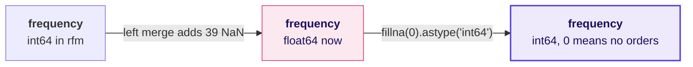
```mermaid
flowchart LR
    A["<b>frequency</b><br/>int64 in rfm"] -->|"left merge adds 39 NaN"| B["<b>frequency</b><br/>float64 now"]
    B -->|"fillna(0).astype('int64')"| C["<b>frequency</b><br/>int64, 0 means no orders"]
    classDef bad fill:#FBE9EF,stroke:#D63A6A,color:#1A0F5C
    classDef known fill:#EEEAFB,stroke:#5B3FD6,color:#1A0F5C,stroke-width:2px
    class B bad
    class C known
```

**The rule.** After every merge, read `dtypes`; a count that became a float is a merge that met missing keys.

```notes
LIVE, 3 minutes. This is the row's "chained transformation that silently changed a dtype".
Nothing errors. The fix says what missing means in the business: no orders is 0 orders.
```

---

## S13. The plausible wrong answer: 166 to win back
*Recency from today: on the first Monday refresh, the win-back list reads 166 customers.*

```python
RUN_DAY = pd.Timestamp("2026-10-19")   # pd.Timestamp.today() on the first refresh
wrong = (RUN_DAY - table["last_order"]).dt.days
(wrong > 60).sum()                     # 166
```

```stats
value: 166 | label: on the win-back list | note: no order in 60 days, from the run day
value: 21 | label: smallest recency, days | note: the most recent buyer, as the table says
```

```notes
LIVE, 4 minutes. The growth team sends a discount code to every lapsed customer, lapsed meaning
no order in 60 days. Ask the room what could be wrong before revealing. The notebook pins the
run day so the number is exact: pd.Timestamp.today() on Monday 19 October returns that date.
```

---

## S14. Why it is wrong: the data stopped on 28 September
*Measured from the run day, every customer looks 21 days staler than the data says.*

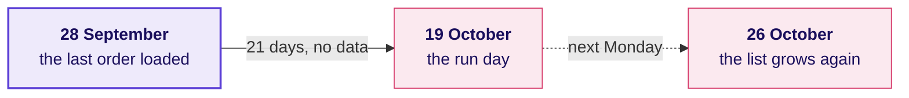
```mermaid
flowchart LR
    A["<b>28 September</b><br/>the last order loaded"] -->|"21 days, no data"| B["<b>19 October</b><br/>the run day"]
    B -.->|"next Monday"| C["<b>26 October</b><br/>the list grows again"]
    classDef known fill:#EEEAFB,stroke:#5B3FD6,color:#1A0F5C,stroke-width:2px
    classDef bad fill:#FBE9EF,stroke:#D63A6A,color:#1A0F5C
    class A known
    class B,C bad
```

**The check that catches it.** Somebody bought on the data's last day, so the smallest honest recency is 0. This table's smallest is 21.

```notes
LIVE, 3 minutes. The business consequence: customers who bought a fortnight before the extract
closed get a win-back discount, and the table changes every Monday with no new data, which
makes it a function of the calendar. The check is one line: table["recency_days"].min() == 0.
```

---

## S15. The fix: 111, measured from the data's last date
*AS_OF is the data's own last order, and the table carries it so Marketing can read it.*

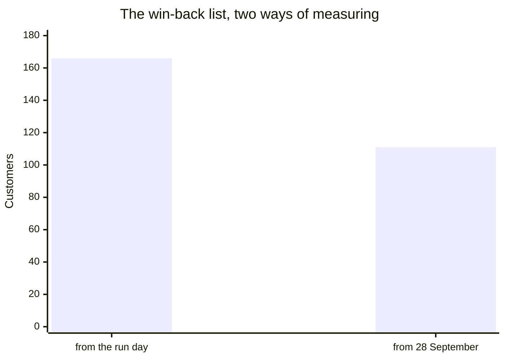
```mermaid
xychart-beta
    title "The win-back list, two ways of measuring"
    x-axis ["from the run day", "from 28 September"]
    y-axis "Customers" 0 --> 180
    bar [166, 111]
```

`AS_OF = orders["order_date"].max()` is 28 September 2026, and the table carries it as a column so Marketing reads what "as of" means.

```notes
LIVE, 3 minutes. 55 active customers were about to get a discount. Say it as the sentence to
the growth team: "111 customers have not ordered in the 60 days to 28 September, the data's
last date; the table carries that date."
```

---

## S16. Question: the 90-day list, both ways?
*The growth team asks for a second, stricter list; run it both ways before you answer.*

```python
(wrong > 90).sum(), (table["recency_days"] > 90).sum()
```

**Question.** How many customers sit on the 90-day list measured from the data's last date, and how many from the run day? a) 101 and 74; b) 74 and 101; c) 74 and 74, since 90 days is long enough not to matter; d) 111 and 166.

```notes
SELF-STUDY for fast pairs, LIVE for the rest, 12 minutes with the per-segment split. The room
runs this in notebook 1's cells, then splits both lists by segment. Watch for pairs who expect a
stricter threshold to make the gap disappear.
```

---

## S17. Answer: 74 honestly, 101 from the run day
*A stricter threshold shrinks the list and keeps the error: 27 customers still wrongly listed.*

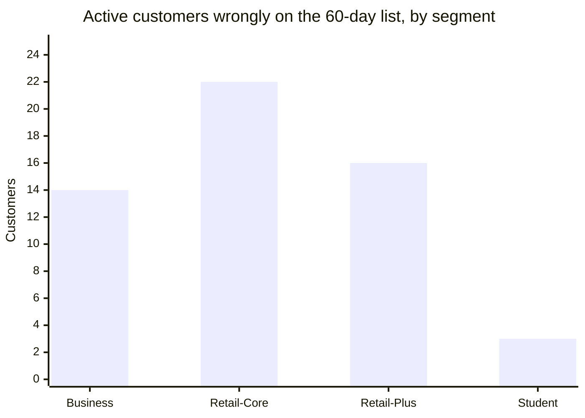
```mermaid
xychart-beta
    title "Active customers wrongly on the 60-day list, by segment"
    x-axis ["Business", "Retail-Core", "Retail-Plus", "Student"]
    y-axis "Customers" 0 --> 25
    bar [14, 22, 16, 3]
```

The answer is b. The shift is the same 21 days whatever the threshold, so the error never goes away; it only moves.

```notes
LIVE, 3 minutes. The chart is the 60-day list's error per segment: 55 in all. Business moves
most in proportion, 19 listed against 5 honestly, because corporate buyers order in bursts.
```

---

## S18. Kavya's review of round 1
*Three checks passed: 340 rows, Rs 19,84,00,000, and a smallest recency of 0.*

**Kavya's review.** "The table carries its as-of date and the smallest recency is 0, which is the check I will run every Monday. Tell Marketing the list is 111 and why it is not 166, in one sentence, before they ask."

**In the interview.** [S] groupby in the split-apply-combine sentence.

```stats
value: 340 | label: rows | note: the customer list, held
value: Rs 19.84 cr | label: spend | note: Monday's book, held
value: 0 days | label: smallest recency | note: from 28 September
```

```notes
LIVE, 5 minutes. Take one learner's split-apply-combine sentence aloud and improve it with the
room: split the orders by customer_id, apply max, count and sum, combine one row per customer;
SQL's GROUP BY and Week 1's accumulator, written once. The full answer is in the notebook and
the study notes.
```

---

## D19. transform: the pandas window function
*agg shrinks each group to one row; transform returns one value per original row.*

```python
share = table["monetary"] / table.groupby("segment")["monetary"].transform("sum")
```

| pandas | SQL | Rows out |
|---|---|---|
| `groupby().agg("sum")` | `GROUP BY ... sum()` | one per group |
| `groupby().transform("sum")` | `sum() OVER (PARTITION BY ...)` | one per input row |
| `groupby().shift(1)` | `LAG() OVER (PARTITION BY ... ORDER BY ...)` | one per input row |

```notes
SELF-STUDY, 5 minutes. For the fast half of the room. Wednesday's window functions mirrored in
pandas; the escalated case uses shift for the falling flag.
```

---

## SECTION 3: The exposure merge
*A merge is a join, validate= makes the fan-out loud, and groupby drops what has no key.*

```notes
LIVE. Round 2, 50 minutes: question (5), demonstration (15), the two traps (15), the room on
Kalpa's own feed (10), review (5). Notebook 2 beside it. The fan-out is shown on invented records;
the room meets the real feed in the your-turn cell. The numbers they should reach are in the day
sheet; do not put them on the board before the room says them.
```

---

## S20. The question: who did the monsoon sale reach
*The marketing lead wants reach and conversion per segment before asking for November's budget.*

> "Put the monsoon sale on the customer table. I want to see, per segment, who it reached and how many of them bought." The marketing lead, Kalpa Retail

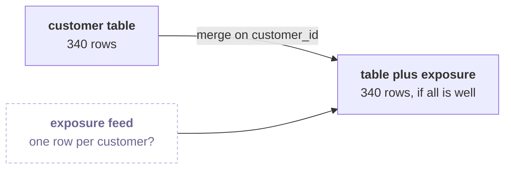
```mermaid
flowchart LR
    T["<b>customer table</b><br/>340 rows"] -->|"merge on customer_id"| M["<b>table plus exposure</b><br/>340 rows, if all is well"]
    F["<b>exposure feed</b><br/>one row per customer?"] --> M
    classDef unknown fill:#FFFFFF,stroke:#B8B2D6,color:#6B6690,stroke-dasharray:4 3
    class F unknown
```

```notes
LIVE, 3 minutes. The dashed box is the question nobody has asked yet: is the feed one row per
customer? Leave it dashed on the board until the room checks it.
```

---

## S21. A merge is a join, with the same four shapes
*Tuesday's joins in pandas, and the default is the one that drops the most.*

| SQL, Tuesday | pandas, today | Keeps |
|---|---|---|
| `INNER JOIN` | `merge()`, the default | keys on both sides only |
| `LEFT JOIN` | `merge(how="left")` | every row of the left table |
| `RIGHT JOIN` | `merge(how="right")` | every row of the right table |
| `FULL OUTER JOIN` | `merge(how="outer")` | every key from either side |

```notes
LIVE, 3 minutes. Read down the table. Ask which row the Monday table needs: left, with the
customer table on the left.
```

---

## S22. Question: what does merge keep by default?
*table.merge(exposure, on="customer_id") with no how= argument.*

```cards
icon: filter | eyebrow: a) | title: Every customer | body: 340 rows, the whole table kept.
icon: git-merge | eyebrow: b) | title: Feed customers only | body: The default is inner.
icon: file-plus | eyebrow: c) | title: Every feed row | body: Unknown customers included.
icon: circle-slash | eyebrow: d) | title: None | body: how is a required argument.
```

**Question.** Which customers survive a merge with no `how`? a) every customer on the table; b) only customers the feed names, since the default is inner; c) every feed row, including unknown customers; d) none, because how is required.

```notes
LIVE, 2 minutes. Letters, then the next slide.
```

---

## S23. Answer: inner, which drops the unreached
*The default silently removes the comparison group Marketing needs.*

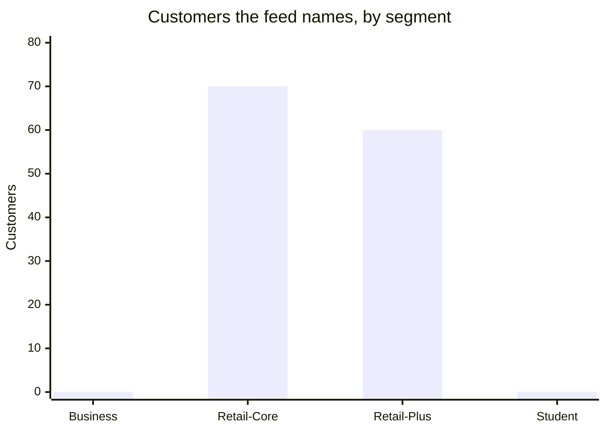
```mermaid
xychart-beta
    title "Customers the feed names, by segment"
    x-axis ["Business", "Retail-Core", "Retail-Plus", "Student"]
    y-axis "Customers" 0 --> 80
    bar [0, 70, 60, 0]
```

The answer is b: 130 of 340 customers survive. Write `how=` every time, so the reader knows which rows survive.

```notes
LIVE, 2 minutes. The feed only names Retail-Core and Retail-Plus, which is the campaign's
design, not a defect. The unreached 210 are the comparison group.
```

---

## S24. The plausible wrong answer: Rs 34,700
*Invented records: a re-sent feed row makes the reached customers' spend a third too big.*

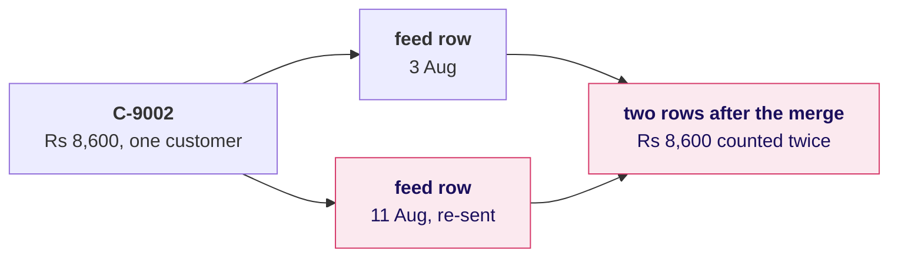
```mermaid
flowchart LR
    A["<b>C-9002</b><br/>Rs 8,600, one customer"] --> B["<b>feed row</b><br/>3 Aug"]
    A --> C["<b>feed row</b><br/>11 Aug, re-sent"]
    B --> D["<b>two rows after the merge</b><br/>Rs 8,600 counted twice"]
    C --> D
    classDef bad fill:#FBE9EF,stroke:#D63A6A,color:#1A0F5C
    class C,D bad
```

```stats
value: Rs 34,700 | label: what the slide said | note: reached customers' spend
value: Rs 26,100 | label: what they spent | note: each customer once
```

```notes
LIVE, 4 minutes. These four customers are invented for the mechanism and labelled so in the
notebook. Walk the diagram: one customer, two feed rows, two merged rows, one spend counted
twice. The business consequence: the case for November's budget is made with money nobody paid.
```

---

## S25. Why it is wrong: 4 rows went in, 5 came out
*The count check catches it quietly; validate= catches it loudly, before the table exists.*

```python
small.merge(small_feed, on="customer_id", how="left",
            validate="one_to_one")
```

```text
MergeError: Merge keys are not unique in right dataset; not a one-to-one merge
```

**The rule.** `validate=` is Tuesday's row-count check made loud: it raises `pandas.errors.MergeError` instead of reporting after the fact.

```notes
LIVE, 4 minutes. This MergeError is the check that catches the trap, so it gets the time, unlike the two-minute
runtime errors. Read the last line aloud: which side, which promise.
pandas 3 also lists the duplicated keys under it.
```

---

## S26. The fix: one exposure per customer, then validate
*A duplicate is a business question first: a customer reached twice was still reached once.*

```python
first_touch = (exposure.sort_values("exposed_date")
                       .drop_duplicates("customer_id", keep="first"))
merged = table.merge(first_touch[["customer_id", "exposed_date"]],
                     on="customer_id", how="left", validate="one_to_one")
```

```stats
value: 340 | label: rows out | note: 340 in, so the grain held
value: Rs 19.84 cr | label: spend | note: unchanged by the merge
value: 130 | label: reached | note: first exposure per customer
```

```notes
LIVE, 4 minutes. The rule is stated before the code. Keep validate on after the dedupe: its
job is to stop next Monday's feed if it breaks the rule in a new way.
```

---

## S27. Your turn: Kalpa's own feed, three lines
*Run them in order and say each answer aloud before the next line.*

```python
exposure["customer_id"].duplicated().sum()
len(table), len(table.merge(exposure, on="customer_id", how="left"))
table.merge(exposure, on="customer_id", how="left", validate="one_to_one")
```

**The client asks.** "In one sentence: what would the naive merge have done to the spend of the customers the sale reached?"

```notes
LIVE, 10 minutes. The room runs these in notebook 2's empty cell. Do not say what they will
find. Take three sentences to the marketing lead aloud and pick the one with a number, a cause
and a consequence. The numbers are in the day sheet.
```

---

## S28. The second wrong answer: 100 percent bought
*Starting from the feed, the table says every customer the sale reached went on to buy.*

```python
buyers = orders.merge(customers, on="customer_id").groupby("customer_id").agg(
    segment=("segment", "first"), frequency=("order_id", "count")).reset_index()
reach = buyers.merge(first_touch, on="customer_id", how="right")
reach.groupby("segment").agg(reached=("customer_id", "count"),
                             bought=("frequency", "count"))
```

```stats
value: 100% | label: of reached customers bought | note: the wrong table's headline
value: 107 | label: reached | note: by the wrong table's count
```

**The decision it misleads.** A sale that seems to turn every customer it reached into a buyer goes into next quarter's plan as the lever that always works, and nobody asks whom it reached and lost.

```notes
LIVE, 4 minutes. Ask whether 100 percent conversion is plausible for any campaign. The room
usually smells it; the point is to name the mechanism, next slide.
```

---

## S29. Why it is wrong: groupby drops a missing key
*Reached customers who never ordered have no order rows, so no segment, so no group.*

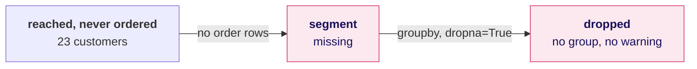
```mermaid
flowchart LR
    A["<b>reached, never ordered</b><br/>23 customers"] -->|"no order rows"| B["<b>segment</b><br/>missing"]
    B -->|"groupby, dropna=True"| C["<b>dropped</b><br/>no group, no warning"]
    classDef bad fill:#FBE9EF,stroke:#D63A6A,color:#1A0F5C
    class B,C bad
```

**The check that catches it.** The groups must add back to the rows: 107 in the groups against 130 rows. `groupby(..., dropna=False)` shows the missing group.

```notes
LIVE, 3 minutes. The customers that vanished are exactly the ones who were reached and did
not buy. The default was checked on pandas 3; it drops a missing key unless told otherwise.
```

---

## S30. The fix: 130 reached, 107 bought, 82 percent
*Take the segment from the customer list, which has one for every customer.*

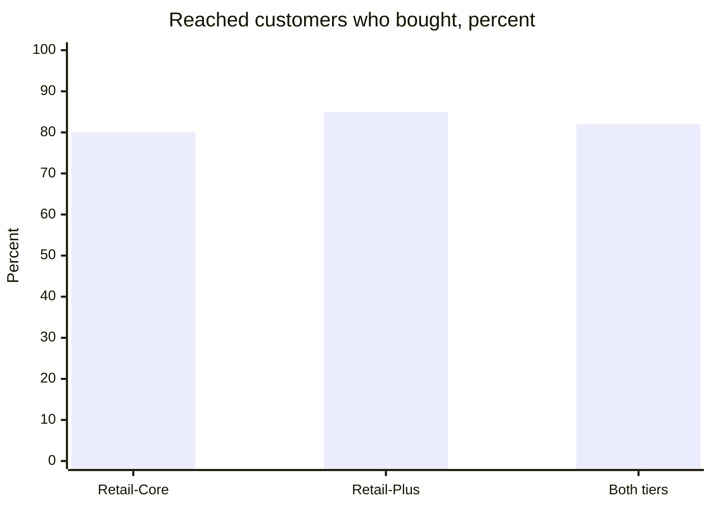
```mermaid
xychart-beta
    title "Reached customers who bought, percent"
    x-axis ["Retail-Core", "Retail-Plus", "Both tiers"]
    y-axis "Percent" 0 --> 100
    bar [80, 85, 82]
```

Retail-Core: 56 of 70 bought. Retail-Plus: 51 of 60. Together 107 of 130, which is 82 percent.

```notes
LIVE, 3 minutes. Remind the room that bought is not caused by: Week 1 Thursday showed the
platform targets customers who were buying anyway. The table records exposure; it proves
nothing about the sale's effect.
```

---

## S31. Kavya's review of round 2
*Two numbers moved without an error: spend a re-sent row inflated, reach a missing key shrank.*

**Kavya's review.** "The row count before and after, and groups that add back to their rows, caught both. Put both checks in the refresh, and keep validate on after you fix the feed."

**In the interview.** [F] Which merge argument raises on duplicate keys, and which error?

```stats
value: 340 | label: rows in, rows out | note: the grain held
value: 107 of 130 | label: reached and bought | note: 82 percent
```

```notes
LIVE, 5 minutes. Answer aloud with the room: validate, with one_to_one, one_to_many or
many_to_one, raising pandas.errors.MergeError naming the side whose keys are not unique. Then
the [S] question: merge against join, same and different. Both in full in the study notes.
Break: 10 minutes after this slide.
```

---

## SECTION 4: The months view
*A reshape changes the question a table answers, and pivot_table averages unless told to add.*

```notes
LIVE. Round 3, 50 minutes: question (5), demonstration (15), the trap (10), the room's
Retail-Core variant (15), review (5). Notebook 3 beside it.
```

---

## S32. The question: is Retail-Plus the tier slipping
*One row per member, one column per month, and the tier's fall in one number.*

> "Give me one row per member and one column per month. I want to read along a row and see who is drifting, and the tier's fall from Q1 to Q2 in one number." The head of Retail-Plus, Kalpa Retail

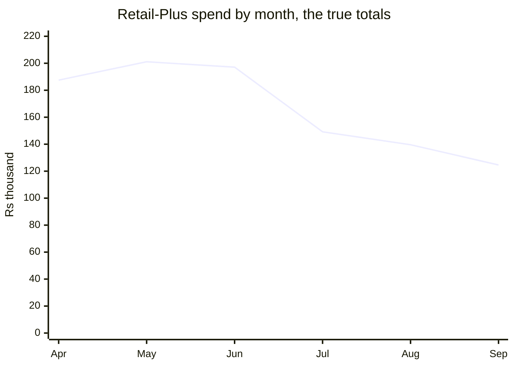
```mermaid
xychart-beta
    title "Retail-Plus spend by month, the true totals"
    x-axis ["Apr", "May", "Jun", "Jul", "Aug", "Sep"]
    y-axis "Rs thousand" 0 --> 220
    line [187.5, 201.1, 197.1, 149.2, 139.6, 124.6]
```

```notes
LIVE, 4 minutes. This is the long table summed by month: Rs 5,85,770 in Q1 and Rs 4,13,380 in
Q2. Hold these two numbers; the trap is a pivot that reports something else.
```

---

## S33. Long, wide, and long again
*pivot widens a table for comparison; melt lengthens it for a trend.*

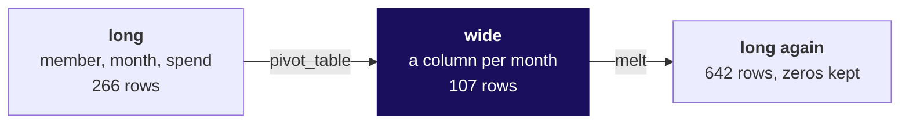
```mermaid
flowchart LR
    L["<b>long</b><br/>member, month, spend<br/>266 rows"] -->|"pivot_table"| W["<b>wide</b><br/>a column per month<br/>107 rows"]
    W -->|"melt"| B["<b>long again</b><br/>642 rows, zeros kept"]
    classDef bet fill:#1A0F5C,stroke:#1A0F5C,color:#FFFFFF
    class W bet
```

**The rule.** Wide answers "compare across a row"; long answers "follow a line over time" and groups cleanly.

```notes
LIVE, 3 minutes. 266 member-months have orders; 107 members times 6 months is 642 once the
empty months are written as zero. Ask why melt returns more rows than the long table started
with.
```

---

## S34. Question: what fall does the pivot report?
*One line, months as columns, then each column summed for the tier.*

```python
wide = plus.pivot_table(index="customer_id", columns="month", values="amount")
q1, q2 = wide[APR_TO_JUN].sum().sum(), wide[JUL_TO_SEP].sum().sum()
q2 / q1 - 1
```

**Question.** What fall from Q1 to Q2 does this pivot report? a) 29 percent; b) 18 percent; c) 0 percent; d) it raises an error.

```notes
LIVE, 2 minutes. Predictions first. Almost nobody predicts b, which is the point.
```

---

## S35. Answer: 18 percent, the plausible wrong answer
*pivot_table's default aggfunc is the mean, so the columns add up averages.*

```stats
value: 18% | label: the fall it reports | note: Rs 4,12,019 to Rs 3,37,267
value: 29% | label: the true fall | note: Rs 5,85,770 to Rs 4,13,380
value: Rs 2.5 lakh | label: missing from the grand total | note: Rs 7,49,286 against Rs 9,99,150
```

The answer is b. The head of Retail-Plus would defend a fall about two-thirds of its real size.

```notes
LIVE, 3 minutes. Checked on pandas 3: pivot_table averages by default. The grand total against
the orders is the check, next slide.
```

---

## S36. Why it is wrong: the mean hides how often
*A member who ordered four times in June shows the average of the four orders.*

| C-0152 | Orders | The pivot shows | The member spent |
|---|---|---|---|
| June | 4 | Rs 2,557 | Rs 10,230 |
| July | 2 | Rs 2,780 | Rs 5,560 |
| September | 2 | Rs 3,440 | Rs 6,880 |

**The check that catches it.** A pivot of spend must add back to the orders it came from. This one is short by a quarter.

```notes
LIVE, 4 minutes. Frequency is the lever Week 1 found moving in Retail-Plus, and the averaged
pivot hides exactly that lever: it reports the typical order, not the month's spend.
```

---

## S37. The fix: say what the cell means
*aggfunc="sum" adds a member's orders, and fill_value=0 writes an empty month as zero.*

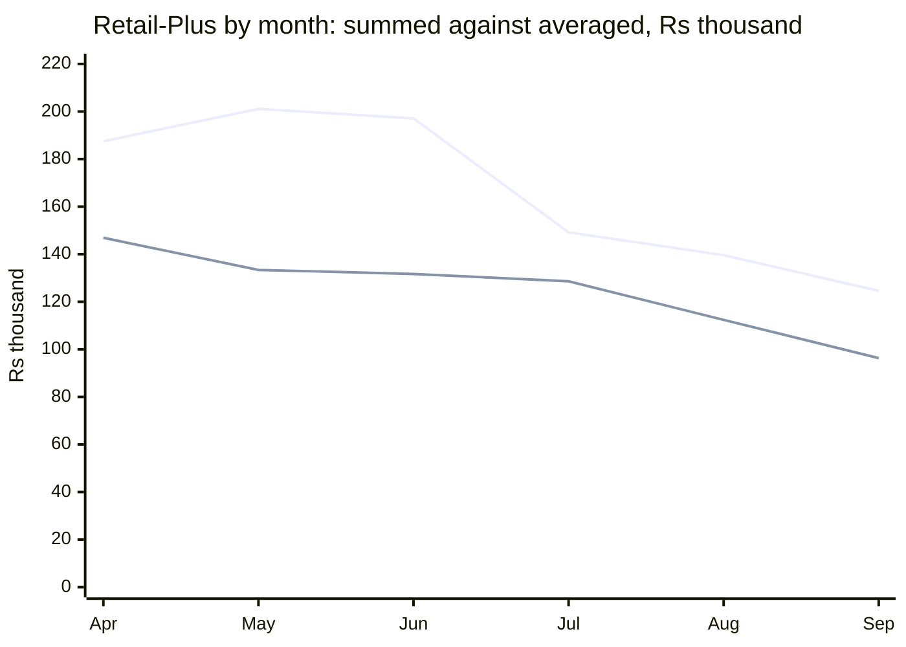
```mermaid
xychart-beta
    title "Retail-Plus by month: summed against averaged, Rs thousand"
    x-axis ["Apr", "May", "Jun", "Jul", "Aug", "Sep"]
    y-axis "Rs thousand" 0 --> 220
    line [187.5, 201.1, 197.1, 149.2, 139.6, 124.6]
    line [146.9, 133.4, 131.7, 128.6, 112.4, 96.3]
```

`pivot_table(..., aggfunc="sum", fill_value=0)` gives the upper line; the lower is the default mean, a quarter of the spend short.

```notes
LIVE, 3 minutes. The upper line is summed, the lower is the default. The gap is widest in the
months where members ordered most often. Write aggfunc every time, the way how= goes on every
merge.
```

---

## S38. The wrong index answers a question nobody asked
*Index by order_id and every order becomes a row that looks like a months view.*

| Index | Shape | First row label | One row is |
|---|---|---|---|
| `customer_id` | 107 by 6 | C-0151 | a member |
| `order_id` | 355 by 6 | KR-00125 | an order |

**The check that catches it.** Read the row labels aloud before reading any number.

```notes
LIVE, 3 minutes. The totals of the order-indexed pivot are right, which is why it survives a
glance. Its rows are orders, so "who is drifting" cannot be read from it. The 13 members who
never ordered are absent from both views; say so when the view goes out.
```

---

## S39. Question: the Retail-Core view, both ways?
*The head of Retail-Core asks for the same view of her members.*

```python
core.pivot_table(index="customer_id", columns="month", values="amount")
core.pivot_table(index="customer_id", columns="month", values="amount",
                 aggfunc="sum", fill_value=0)
```

**Question.** Q1 to Q2, what do the two pivots report for Retail-Core? a) both a fall of 1.8 percent; b) the averaged pivot a rise of 1.5 percent, the summed pivot a fall of 1.8 percent; c) the averaged pivot a fall of 18 percent; d) both a rise of 1.5 percent.

```notes
LIVE, 12 minutes. The room builds both in notebook 3's empty cell and checks the grand total
before reading a month. Circulate for pairs who read the averaged total first.
```

---

## S40. Answer: the default flips the sign
*Averaged, Retail-Core grew 1.5 percent; summed, it fell 1.8 percent.*

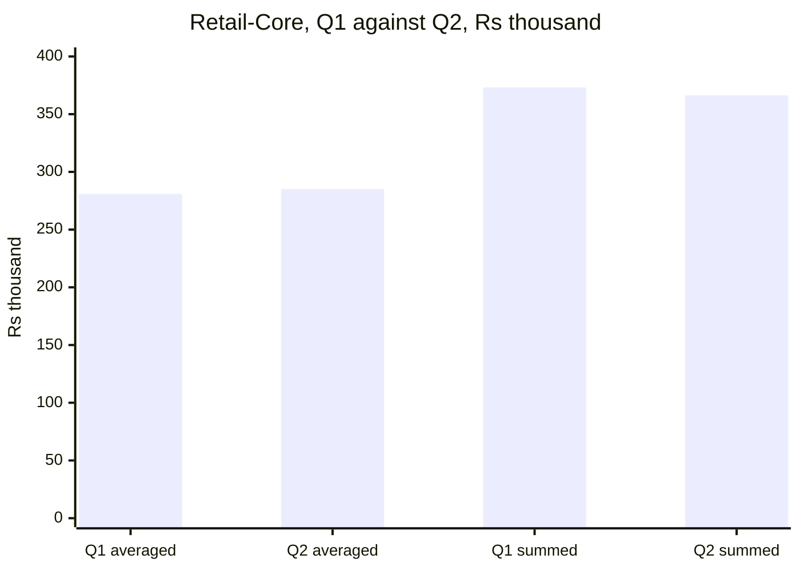
```mermaid
xychart-beta
    title "Retail-Core, Q1 against Q2, Rs thousand"
    x-axis ["Q1 averaged", "Q2 averaged", "Q1 summed", "Q2 summed"]
    y-axis "Rs thousand" 0 --> 400
    bar [280.9, 285.1, 373.1, 366.3]
```

The answer is b. The averaged view reports a rise because Retail-Core's orders got slightly bigger while members ordered less often.

```notes
LIVE, 3 minutes. The harder form of the trap: the default did not just shrink the number, it
reversed the direction of the story a stakeholder would tell.
```

---

## S41. Kavya's review of round 3
*A pivot whose grand total equals its source, and a fall of 29 percent said with its months.*

**Kavya's review.** "Q1 Rs 5,85,770, Q2 Rs 4,13,380, a fall of 29 percent, from a pivot that adds back to the orders. The averaged version would have said 18. Write aggfunc every time."

**In the interview.** [F] pivot against melt: which widens and which lengthens?

```stats
value: Rs 9,99,150 | label: pivot grand total | note: equals the orders
value: 29% | label: Q1 to Q2 | note: the tier's true fall
```

```notes
LIVE, 5 minutes. pivot and pivot_table widen, melt lengthens. Add the follow-up: pivot against
pivot_table, where pivot raises "Index contains duplicate entries, cannot reshape" on a repeated
pair and pivot_table silently averages it.
```

---

## D42. pivot is the loud version of pivot_table
*When one value per cell is expected, pivot refuses a repeat instead of averaging it.*

```python
plus.pivot(index="customer_id", columns="month", values="amount")
```

```text
ValueError: Index contains duplicate entries, cannot reshape
```

| Call | A repeated member-month | Use it when |
|---|---|---|
| `pivot` | raises ValueError | one value per cell is a promise |
| `pivot_table` | aggregates, the mean by default | cells should aggregate, with aggfunc stated |

```notes
SELF-STUDY, 3 minutes. The same pattern as validate on merge: an argument or a function that
makes the wrong shape loud.
```

---

## S43. What the morning built
*One row per customer, the sale attached, and a months view that adds back to its source.*

| Round | The number | The trap it replaced |
|---|---|---|
| One row per customer | 111 on the win-back list | 166, recency from the run day |
| The exposure merge | 107 of 130 reached bought, 82 percent | Rs 34,700 on invented records; 100 percent |
| The months view | Retail-Plus fell 29 percent | 18 percent, the default mean |

**The rule.** Write `how=`, `validate=`, `dropna=` and `aggfunc=` every time; each default decided a number this morning.

```notes
LIVE, 3 minutes. Point at the board drawing from S4, now complete. The afternoon builds the
whole table unguided and then runs one question in three tools.
```
