# Can Marketing act on Monday's table without checking it?

Week 2, Day 4. Half one.

Kicker: WEEK 2  ·  THURSDAY  ·  HALF ONE
Quote: One table, one row per customer, refreshed every Monday: how recently each customer bought, how often, how much, their segment, whether the monsoon sale reached them, and the flags we act on.
Who: The growth team, Kalpa Retail. The data platform lead adds: build it in pandas, from the warehouse, refreshable in one run.

```notes
LIVE, one minute. Read the growth team's ask aloud and leave it up. The day is one question climbed in
six chapters: can the growth team act on this table every Monday without an analyst checking it first?
Five chapters this morning, the sixth after lunch, then the full table alone and the three-tool case in
pairs. Every chapter has its own notebook, numbered the same.
```

---

## S1. Six questions stand between the ask and Monday
*Can the growth team act on one row per customer, every Monday, without checking it first?*

```timeline
label: Chapter 1 | title: One row per customer? | body: How recently, how often and how much has each of the 340 customers bought?
label: Chapter 2 | title: Who did the sale reach? | body: Which customers did the monsoon sale reach, and what did they spend?
label: Chapter 3 | title: Is Retail-Plus slipping? | body: How far did Retail-Plus members' spend fall from Q1 to Q2, month by month?
label: Chapter 4 | title: Do three tools agree? | body: Of the 130 reached, how many bought, in plain Python, SQL and pandas?
label: Chapter 5 | title: Which tool for which job? | body: Which tool owns which recurring number, and which would you refuse for Finance?
label: Chapter 6 | title: Will Monday rebuild it? | body: Can the table rebuild itself and refuse to ship when something breaks? | tone: dark
```

```notes
LIVE, 3 minutes. Read the six questions in order and say that each one is the question the previous
answer raises. Chapters 1 to 5 run this morning, chapter 6 opens the afternoon. Ask the room which
question they expect to be hardest; expect most to say the tool choice, and expect the first slip to
come earlier, at chapter 1's missing customers. Keep this slide's order on the board all day.
```

---

## S2. Four people act on this table, each in their own way
*Who reads the Monday table, and what do they do with a wrong row?*

```cards
icon: megaphone | eyebrow: The growth team | title: Sends the offers | body: A win-back code to customers who have gone quiet, a first-order nudge to those who signed up and never bought. A missing row gets no offer.
icon: badge-percent | eyebrow: The marketing lead | title: Asks for November's budget | body: Wants the monsoon sale on the table: whom it reached and what they spent. An inflated number funds the wrong campaign.
icon: crown | eyebrow: The head of Retail-Plus | title: Takes one number to the review | body: The paid tier's fall from Q1 to Q2, month by month. Too small a number argues the problem away.
icon: landmark | eyebrow: Finance | title: Reruns every number | body: Anand Iyer's analyst ties the team's numbers to the warehouse line by line. | tone: dark
```

**The client asks.** "One table, one row per customer, refreshed every Monday, and one run to rebuild it."

```notes
LIVE, 3 minutes. The growth team is Kalpa Retail's team that runs offers and campaigns; the marketing
lead owns acquisition and campaigns; the head of Retail-Plus owns the paid membership tier; Anand Iyer
is the finance controller. Kavya Nair, the senior analyst, will challenge the room after chapter 3: do
it a third way and choose. Ask: who is hurt most by a customer missing from the table? The growth team,
because a missing row is an offer never sent.
```

---

## S3. Question: what is one row of the table?
*Before any tool opens, what does one row stand for, and where does each column come from?*

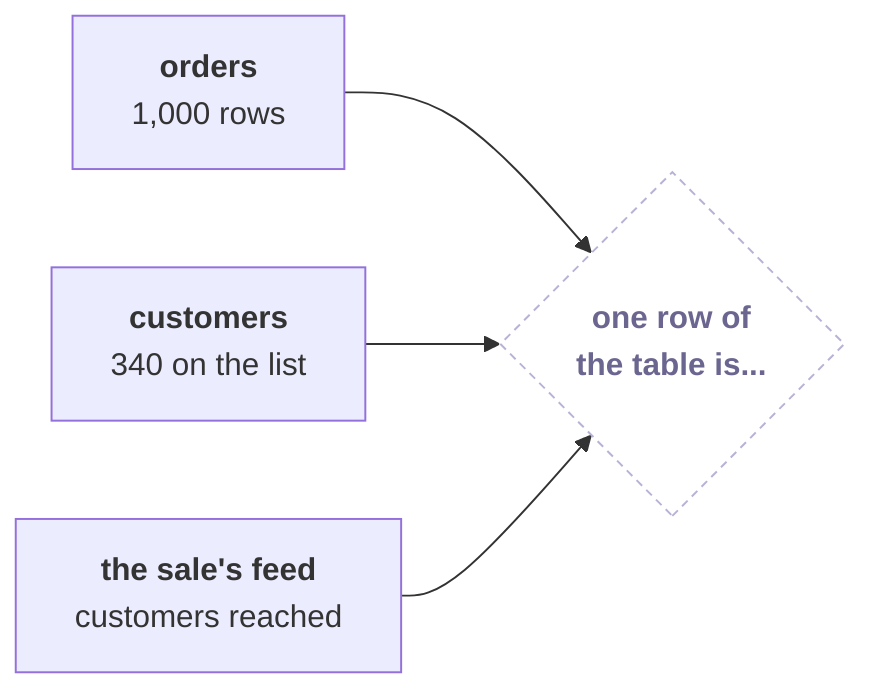
```mermaid
flowchart LR
    O["<b>orders</b><br/>1,000 rows"] --> T{"<b>one row of<br/>the table is...</b>"}
    C["<b>customers</b><br/>340 on the list"] --> T
    F["<b>the sale's feed</b><br/>customers reached"] --> T
    classDef unknown fill:#FFFFFF,stroke:#B8B2D6,color:#6B6690,stroke-dasharray:4 3
    class T unknown
```

**Question.** Which is one row, as a letter? a) one order; b) one customer on the list; c) one customer who ordered; d) one customer the sale reached.

```notes
LIVE, 4 minutes. Pairs, two minutes: name the grain and say which table decides how many rows there
are. Most pick c, because the numbers come from orders. Take the letters in chat before the answer.
```

---

## S4. Answer: one customer on the list, 340 rows
*Which source decides the rows, and which ones only add columns?*

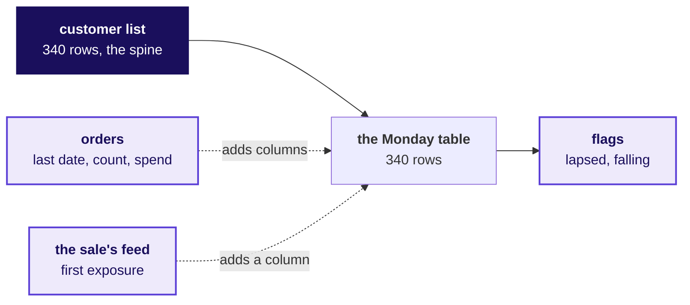
```mermaid
flowchart LR
    C["<b>customer list</b><br/>340 rows, the spine"] --> T["<b>the Monday table</b><br/>340 rows"]
    O["<b>orders</b><br/>last date, count, spend"] -.->|adds columns| T
    F["<b>the sale's feed</b><br/>first exposure"] -.->|adds a column| T
    T --> G["<b>flags</b><br/>lapsed, falling"]
    classDef bet fill:#1A0F5C,stroke:#1A0F5C,color:#FFFFFF
    classDef known fill:#EEEAFB,stroke:#5B3FD6,color:#1A0F5C,stroke-width:2px
    class C bet
    class O,F,G known
```

**The call.** The answer is b. The customer list decides how many rows there are; the orders and the feed only add columns to it, and the flags are computed from those columns.

```notes
LIVE, 3 minutes. Draw this on the board and leave it up all day: it is the table's picture, and every
chapter lights one arrow. c is the trap chapter 1 stages: a table built from the orders only knows
customers who ordered.
```

---

## S5. Three checks every Monday, before anyone acts
*What does the table have to agree with before it leaves the team?*

```stats
value: 340 | label: rows | note: one per customer on the list
value: Rs 19,84,00,000 | label: spend | note: the warehouse's two quarters
value: 28 Sep 2026 | label: as of | note: the data's last order date
```

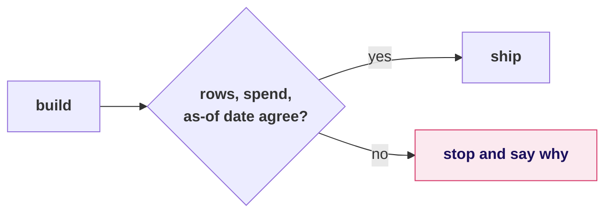
```mermaid
flowchart LR
    B["<b>build</b>"] --> K{"<b>rows, spend,<br/>as-of date agree?</b>"}
    K -->|yes| S["<b>ship</b>"]
    K -->|no| X["<b>stop and say why</b>"]
    classDef bad fill:#FBE9EF,stroke:#D63A6A,color:#1A0F5C
    class X bad
```

```notes
LIVE, 4 minutes. Write the three numbers on the board. Spend is the value of every order at the
prices charged, whatever became of it, which the retail dossier calls GMV: Monday's warehouse queries
totalled it for April to September. The as-of date is the last date the data covers. Each chapter
adds a way the table can fail one of these checks; chapter 6 makes the refresh refuse to ship when
one fails. Then chapter 1.
```

---

## SECTION 1: One row per customer?
*How recently, how often and how much has each of Kalpa's 340 customers bought, before any offer goes out?*

```notes
LIVE. Thirty minutes. Notebook C2_W02_D04_01_customer_table is the demonstration.
```

---

## S6. Five smaller questions build the growth team's table
*What must the growth team's table settle before a single offer goes out?*

**Who needs the answer.** The growth team, which sends a win-back code or a first-order nudge from this table every Monday; a customer missing from it gets no offer at all.

```timeline
label: 1 | title: Which way builds it? | body: A loop, SQL or pandas, each sized on 1,000 orders
label: 2 | title: Did every order arrive? | body: The frame against the warehouse's count and types
label: 3 | title: Does groupby match the loop? | body: Week 1's accumulator in one line
label: 4 | title: Who never ordered? | body: The count the nudge list rests on
label: 5 | title: Does SQL agree? | body: The same three numbers by a route that shares no code | tone: dark
```

```notes
LIVE, 1 minute. Read the five questions; each is a notebook heading.
```

---

## S7. Three numbers per customer decide the offer
*What does the growth team decide with the table, and what does a wrong row cost?*

```stats
value: 340 | label: customers on the list | note: four segments
value: 1,000 | label: orders | note: April to September 2026
value: Rs 19,84,00,000 | label: spend | note: every order at the price charged
```

| The number | Plainly | What it decides |
|---|---|---|
| Recency | The date of the last order | Who gets a win-back code |
| Frequency | The count of orders | Who is a regular, who ordered once |
| Spend | The orders' value, at the prices charged | Who is worth protecting |

**The client asks.** "Who has gone quiet, who never started, and who is worth the most?"

```notes
LIVE, 2 minutes. Retailers call the three numbers RFM, for recency, frequency and monetary value. A
wrong row costs an offer: a customer left out gets nothing, a customer counted wrongly gets the wrong
code. Business is 40 accounts and 99.1 percent of spend, so spend must be read by segment.
```

---

## S8. Shopify scores every customer, buyers or not
*Who else builds one row per customer, and what happens to customers with no orders?*

```stats
value: 1 to 5 | label: per number | note: recency, frequency, monetary
value: 11 | label: RFM groups | note: from Champions to Prospects
value: Prospects | label: no orders yet | note: one of the 11, never left off
```

**What breaks.** A table that drops customers with no orders cannot put anyone in Shopify's Prospects group, and the offer written for them has nobody to go to.

```notes
LIVE, 2 minutes. Source: Shopify Help Center, Customers reports, checked 1 Oct 2026: "RFM analysis
applies a 3-digit score to each customer ... the days from a customer's most recent purchase
(recency), the total number of orders (frequency), and the total amount spent (monetary value)", and
Prospects, "Customers with no orders yet", are one of its 11 groups. Say it aloud: a platform that
serves millions of shops keeps the non-buyers on the table.
```

---

## S9. pandas, because the next chapters need the orders
*Which of three ways should build one row per customer, and what does each cost on 1,000 orders?*

| Option | Rows moved out of the warehouse | Lines of logic | The next five chapters |
|---|---|---|---|
| a) Week 1's loop | 1,000 | 6 | by hand, one dictionary at a time |
| b) SQL `GROUP BY` | 301 | 7 | a new query for every new view |
| c) pandas `groupby` | 1,000 | 3 | in memory: merge, pivot, recount |

**The call.** c. The growth team's analysts work in Python, and the next chapters merge, pivot and recount the same orders. What would switch it: an orders table in the crores, too big to move each Monday; then the warehouse groups (b) and pandas reads 301 rows.

```notes
LIVE, 4 minutes. Rows moved is what separates a and c from b; lines of logic is what separates a from
c. Ask: at 5 crore orders, which option's rows grow with the customers instead of the orders? b, one
row per customer who ordered, 301 today. Hold that thought for chapter 5, where rows moved decides
where Finance's number lives.
```

---

## S10. groupby splits, applies and combines
*What does one line of groupby do to 1,000 order rows?*

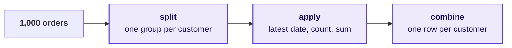
```mermaid
flowchart LR
    O["<b>1,000 orders</b>"] --> S["<b>split</b><br/>one group per customer"]
    S --> A["<b>apply</b><br/>latest date, count, sum"]
    A --> C["<b>combine</b><br/>one row per customer"]
    classDef known fill:#EEEAFB,stroke:#5B3FD6,color:#1A0F5C,stroke-width:2px
    class S,A,C known
```

```python
rfm = (orders.groupby("customer_id")
             .agg(last_order=("order_date", "max"), frequency=("order_id", "count"),
                  spend=("amount", "sum"))
             .reset_index())
```

```notes
LIVE, 3 minutes. This is Week 1's accumulator, written once: split the rows by a key, apply a
calculation to each group, combine the results. Each name in agg becomes a column; each pair says
which column to read and what to do with it. SQL says the same with GROUP BY customer_id and max,
count, sum.
```

---

## S11. pandas 3 reads text as str, amounts as float64
*Did all 1,000 orders arrive from the warehouse, as types pandas can use?*

```stats
value: 1,000 = 1,000 | label: orders | note: pandas and Postgres
value: str | label: customer_id | note: pandas 3's text type
value: float64 | label: amount | note: a number pandas can sum
```

**What breaks.** A tutorial that finds text columns with `dtype == object` finds none on pandas 3, because text reads as `str`. `parse_dates` makes `order_date` a real date, which chapter 6 subtracts.

```notes
LIVE, 3 minutes. pd.read_sql runs a query in the warehouse and returns its answer as a DataFrame,
pandas' table in memory; the notebook's section 2 reads the orders with parse_dates=["order_date"]. Ask the room, before the stats: which type will customer_id arrive as? Most
who learned pandas 2 say object. pandas 2 said object for text; pandas 3 says str, checked on 3.0.6
on 1 Oct 2026. The count check is Monday's habit: the frame holds 538 Q1 and 462 Q2 orders.
```

---

## S12. How many rows does spend per customer have?
*Does one line of groupby give the same totals as Week 1's loop?*

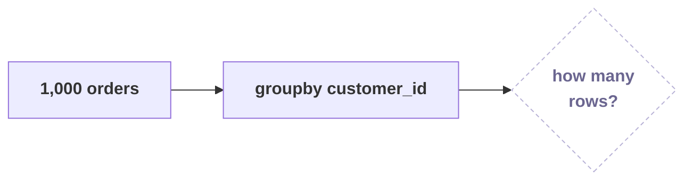
```mermaid
flowchart LR
    O["<b>1,000 orders</b>"] --> G["<b>groupby customer_id</b>"] --> N{"<b>how many<br/>rows?</b>"}
    classDef unknown fill:#FFFFFF,stroke:#B8B2D6,color:#6B6690,stroke-dasharray:4 3
    class N unknown
```

**Question.** As a letter? a) 1,000, one per order; b) 340, one per customer on the list; c) 301; d) 4, one per segment.

```notes
LIVE, 2 minutes. Most say b. Ask why before running it.
```

---

## S13. Answer: 301, the customers who ordered
*Do the loop and groupby agree, and on how many customers?*

```stats
value: 301 | label: rows | note: one per customer who ordered
value: 301 of 301 | label: agree to the rupee | note: the loop and groupby
value: Rs 2,23,10,600 | label: largest spender | note: C-0286, a Business account
```

**What breaks.** `groupby` can only make a group for a customer it meets in the rows it was given, and the rows are orders. The loop has the same blind spot.

```notes
LIVE, 3 minutes. The answer is c. The six largest spenders are all Business accounts, which buy in
lakhs; that is why spend is read by segment. The 39 missing from 340 are chapter 1's trap, next.
```

---

## S14. How many does the hurried nudge filter find?
*How many customers on the list have never ordered?*

```python
never = rfm[rfm["frequency"] == 0]     # the first-order nudge list
len(never)
```

**Question.** What does the hurried filter return, as a letter? a) 0; b) 39; c) 301; d) 340.

```notes
LIVE, 2 minutes. The growth team's first use of the table is the first-order nudge: a welcome offer to
everyone who signed up and never bought. Letters first.
```

---

## S15. Answer: 0, the plausible wrong answer
*What would the growth team have sent on Monday?*

```stats
value: 0 | label: customers who never ordered | note: the hurried filter's count
value: 301 | label: rows in the table | note: one per customer, or so it seems
```

**What breaks.** The welcome offer goes to nobody, and the 39 customers who signed up and never ordered stay unwelcomed.

```notes
LIVE, 2 minutes. The answer is a. No error was raised and every row in the table is correct, yet the
count is wrong, because the rows that would make it right are not there. The decision it misleads: a
campaign with no audience, reported as "nobody to nudge".
```

---

## S16. Why it is wrong: 301 rows against 340
*Why does the filter find nobody, and which check catches it?*

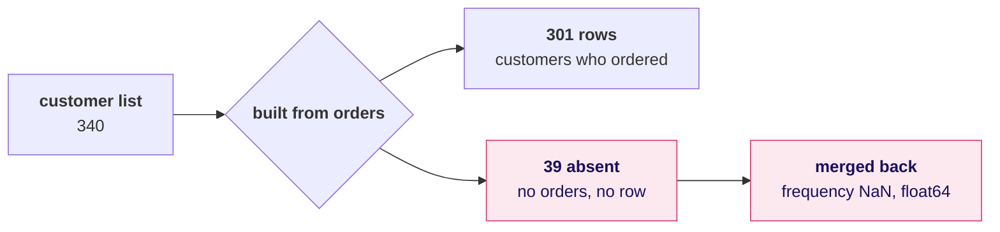
```mermaid
flowchart LR
    C["<b>customer list</b><br/>340"] --> H{"<b>built from orders</b>"}
    H --> K["<b>301 rows</b><br/>customers who ordered"]
    H --> M["<b>39 absent</b><br/>no orders, no row"]
    M --> N["<b>merged back</b><br/>frequency NaN, float64"]
    classDef bad fill:#FBE9EF,stroke:#D63A6A,color:#1A0F5C
    class M,N bad
```

**The check.** Rows against the customer list before any filter: 301 against 340. The half-fix fails too: merged onto the list, the 39 arrive with a missing frequency, and a missing value never equals 0.

```notes
LIVE, 3 minutes. Two layers. The table built from orders has no row for a customer with no orders. A
left merge brings them back, but their count is NaN and the column turns float64, because NumPy's
int64, the type a count arrives in, cannot hold a missing value; pandas' nullable Int64 could, but the
merge does not choose it. So == 0 still finds nobody.
```

---

## S17. The fix: the list is the spine, and 39 appear
*What changes when the table starts from the customer list?*

```python
table = customers.merge(rfm, on="customer_id", how="left", validate="one_to_one")
table = table.assign(frequency=table["frequency"].fillna(0).astype("int64"),
                     spend=table["spend"].fillna(0))
```

```stats
value: 340 | label: rows | note: every customer on the list
value: 39 | label: never ordered | note: Core 19, Plus 13, Student 6, Business 1
value: Rs 19,84,00,000 | label: spend | note: unchanged
```

```notes
LIVE, 3 minutes. Say what a missing number means in this business: no orders means a frequency of 0
and a spend of 0, and the last order date stays empty. validate stops the merge if either side ever
holds a customer twice; chapter 2 explains it. Spend did not move, which is why a spend check alone
would never have caught the gap.
```

---

## S18. A second route: SQL agrees on all 340
*Does SQL, run on its own, give all 340 customers the same three numbers?*

```sql
SELECT c.customer_id, max(o.order_date) AS last_order,
       count(o.order_id) AS frequency, coalesce(sum(o.amount), 0) AS spend
FROM customers c LEFT JOIN orders o ON o.customer_id = c.customer_id
GROUP BY c.customer_id;
```

```stats
value: 340 = 340 | label: customers | note: SQL and pandas
value: 3 of 3 | label: numbers agree | note: last order, frequency, spend
value: 39 | label: frequency 0 | note: count(o.order_id) counts only matches
```

```notes
LIVE, 2 minutes. The route shares no code with the notebook, so a slip in the merge or a fill cannot
move it. count(o.order_id) gives 0 for a customer with no orders where count(*) would give 1. When to
switch: pandas to build on, SQL to hand an auditor.
```

---

## S19. Chapter 1: 340 rows, 39 never ordered
*What did each smaller question find?*

| Question | The answer |
|---|---|
| Which way builds it? | pandas, moving 1,000 orders; SQL grouping when they run to crores |
| Did every order arrive? | 1,000 of 1,000, text as `str`, amounts as `float64` |
| Does groupby match the loop? | Yes, on all 301 customers who ordered |
| Who never ordered? | 39 of 340; the order-built table said 0 |
| Does SQL agree? | Yes, on every customer's three numbers |

**Kavya's review.** The table's spine is the customer list, never the orders; check rows against the list, spend against the warehouse, and the never-ordered count every Monday.

**In the interview.** [S] Describe groupby in the split-apply-combine sentence.

```notes
LIVE, 2 minutes. One breath for the interview: split the orders by customer, apply the latest date,
a count and a sum, combine one row per customer; it is GROUP BY, and Week 1's accumulator written
once. Then chapter 2: the marketing lead wants the monsoon sale on these 340 rows.
```

---

## SECTION 2: Who did the sale reach?
*Which customers did the monsoon sale reach, and what did they spend, before the November budget is asked for?*

```notes
LIVE. Thirty minutes. Notebook C2_W02_D04_02_exposure_merge is the demonstration.
```

---

## S20. Six checks stand between the feed and the budget
*What must the marketing lead's reach number survive on the way to November?*

**Who needs the answer.** The marketing lead, who asks for the monsoon sale's budget again in November; an overstated spend makes that case with money nobody paid.

```timeline
label: 1 | title: Which way attaches it? | body: A flag, a merge, a counted merge or a rule
label: 2 | title: What does how= keep? | body: The merge's default, and who it drops
label: 3 | title: What does a re-sent row do? | body: Invented records, one customer twice
label: 4 | title: What stops it? | body: The argument that refuses the wrong table
label: 5 | title: Which exposure stays? | body: The rule, and 340 rows out
label: 6 | title: Does a count agree? | body: Reach and spend with no merge at all | tone: dark
```

```notes
LIVE, 1 minute. Read the six questions. Chapter 1 left 340 rows and Rs 19,84,00,000; this chapter
must leave both unchanged.
```

---

## S21. The sale's feed decides November's budget
*What does the marketing lead decide, and what does an inflated number cost?*

```stats
value: August 2026 | label: the monsoon sale | note: 15 percent off
value: 270 | label: customers it could reach | note: Retail-Core and Retail-Plus
value: one row each? | label: the feed's promise | note: from the campaign platform
```

**The client asks.** "Per segment, whom did it reach and what did they spend? I am asking for the same budget in November."

```notes
LIVE, 2 minutes. The campaign platform sends a feed of the customers the sale reached, with the date
it reached them. The feed is another team's system, so its promise of one row per customer is a
promise to check, which is Tuesday's lesson in a new place.
```

---

## S22. Meta dedupes the same purchase sent twice
*Who else meets one event arriving twice, and what do they do about it?*

```stats
value: 2 | label: routes for one purchase | note: the browser's Pixel and the server's API
value: ID + name | label: how Meta matches them | note: event_id and event_name
value: 48 hours | label: the window | note: after the first event arrives
```

**What breaks.** Two copies of one purchase count as two purchases unless the advertiser dedupes, and a campaign that looks twice as good gets twice the budget.

```notes
LIVE, 2 minutes. Source: Meta for Developers, Handling Duplicate Pixel and Conversions API Events,
checked 1 Oct 2026: an advertiser sending events both ways "must set up a deduplication method".
Under the recommended method, when the same event ID and event name reach the same Pixel within 48
hours, Meta keeps the first and discards the rest: a first-touch rule, like today's.
```

---

## S23. A rule, then a merge that refuses repeats
*Which of four ways should attach the sale to the table, and what does each risk?*

| Option | Rows out | Spend overstated per re-sent row | The problem shows |
|---|---|---|---|
| a) `isin` flag | 340, always | Rs 0 | never; the date is lost |
| b) plain merge | 340 plus one per re-sent row | Rs 5,100 to Rs 26,020 | never |
| c) merge, counted | 340 plus one per re-sent row | Rs 5,100 to Rs 26,020 | after the table exists |
| d) rule and guarded merge | 340, or the run stops | Rs 0 | before the table exists |

**The call.** d: the marketing lead needs the date, and a bad feed should stop Monday's run. What would switch it: a table that only needs yes or no; then a, which cannot multiply a row.

```notes
LIVE, 4 minutes. The sizing column is the error each option risks: under b or c a re-sent row adds
that customer's whole spend again, Rs 5,100 for a typical Retail-Core or Retail-Plus customer and up
to Rs 26,020 for the largest. Ask what the date is for: whether a customer bought after the sale.
```

---

## S24. A merge is a join with the same four shapes
*What does a pandas merge keep, shape by shape?*

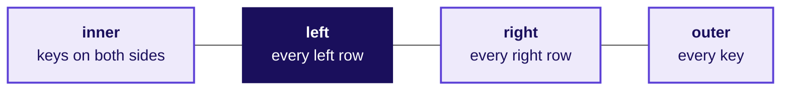
```mermaid
flowchart LR
    I["<b>inner</b><br/>keys on both sides"] --- L["<b>left</b><br/>every left row"]
    L --- R["<b>right</b><br/>every right row"]
    R --- U["<b>outer</b><br/>every key"]
    classDef bet fill:#1A0F5C,stroke:#1A0F5C,color:#FFFFFF
    classDef known fill:#EEEAFB,stroke:#5B3FD6,color:#1A0F5C,stroke-width:2px
    class L bet
    class I,R,U known
```

**The rule.** The customer table is the spine, so the growth team's merge is `how="left"`: every customer stays, and the feed adds a date where it has one.

```notes
LIVE, 2 minutes. Tuesday drew these four in SQL: INNER JOIN, LEFT JOIN, RIGHT JOIN, FULL OUTER JOIN.
pandas spells them how="inner", "left", "right", "outer". Next: what happens when how is left out.
```

---

## S25. Which customers does a merge keep by default?
*Which customers does a merge keep when how is left out?*

```python
inner = table.merge(exposure, on="customer_id")      # how= left out
```

**Question.** As a letter? a) every customer on the table; b) only the customers the feed names; c) every feed row, even customers the table does not know; d) none, since `how` is required.

```notes
LIVE, 2 minutes. Letters in chat.
```

---

## S26. Answer: only the 130 the feed names
*Who disappears with the default, and why does it matter?*

```stats
value: 130 of 340 | label: customers kept | note: the default inner merge
value: 210 | label: dropped | note: every customer the sale missed
```

**What breaks.** The unreached are exactly the comparison the marketing lead's case needs. Write `how=` on every merge, so a reader knows which rows survive.

```notes
LIVE, 2 minutes. The answer is b. The default is inner, which is not what the table needs.
```

---

## S27. The plausible wrong answer: Rs 34,700
*What does one re-sent row do to the reached customers' spend, on invented records?*

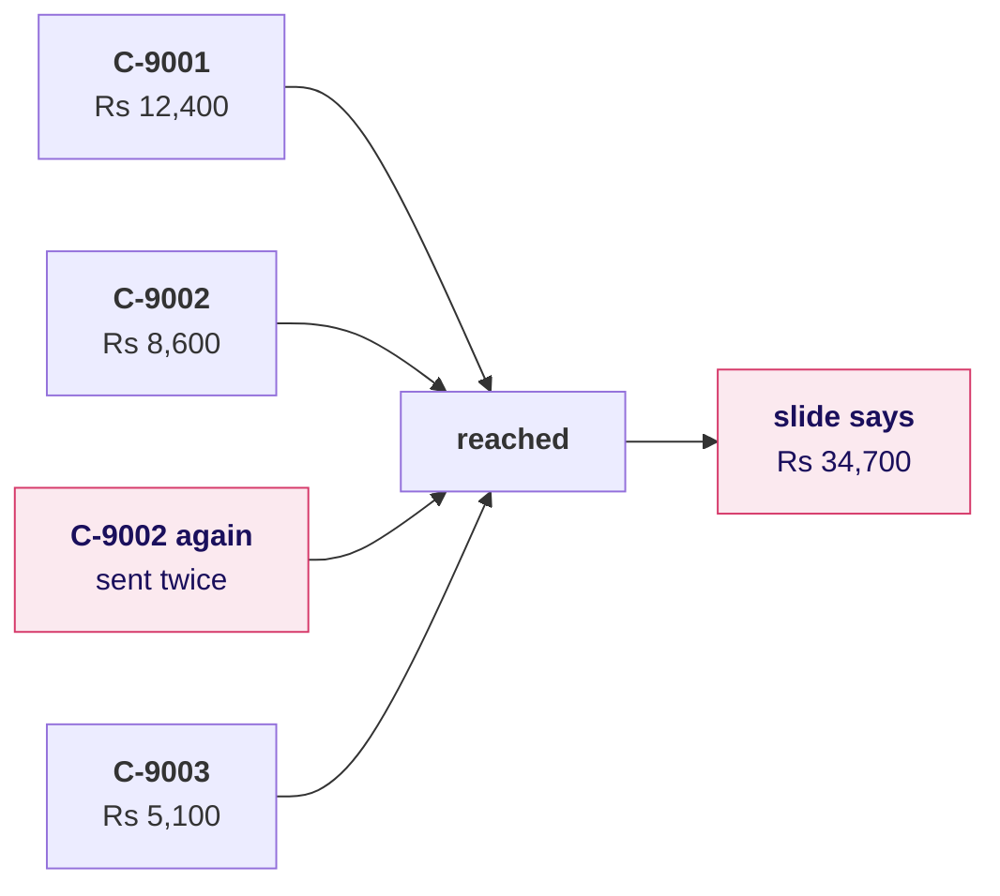
```mermaid
flowchart LR
    A["<b>C-9001</b><br/>Rs 12,400"] --> R["<b>reached</b>"]
    B["<b>C-9002</b><br/>Rs 8,600"] --> R
    B2["<b>C-9002 again</b><br/>sent twice"] --> R
    C["<b>C-9003</b><br/>Rs 5,100"] --> R
    R --> S["<b>slide says</b><br/>Rs 34,700"]
    classDef bad fill:#FBE9EF,stroke:#D63A6A,color:#1A0F5C
    class B2,S bad
```

**Invented records.** Four invented customers, not Kalpa's, and a feed that names C-9002 twice. The merged slide says Rs 34,700; the reached customers spent Rs 26,100.

```notes
LIVE, 3 minutes. Notebook 02 section 3 builds this. Four customers in, five rows out. The decision it
misleads: a November budget asked for on Rs 8,600 nobody paid, a third of the figure.
```

---

## S28. Why it is wrong, and validate stops it
*Which argument stops the merge before a wrong table exists?*

```python
small.merge(small_feed, on="customer_id", how="left", validate="one_to_one")
# MergeError: Merge keys are not unique in right dataset; not a one-to-one merge
```

```stats
value: 4 in, 5 out | label: the count check | note: Tuesday's habit, after the fact
value: MergeError | label: validate= | note: before the table exists
```

**What breaks.** Every row looks right on its own; only the count, or a promise the merge checks, sees the copy.

```notes
LIVE, 3 minutes. validate="one_to_one" promises each key once on both sides; many_to_one allows
repeats on the left only; one_to_many the reverse. pandas 3.0.6 lists the repeated keys under the
error. Then the your-turn cell: the room runs the same merge on Kalpa's feed, reads the counts aloud
and says what a plain merge would have done. Give it five minutes and do not read out the ids.
```

---

## S29. Which exposure should each customer keep?
*Which exposure should a customer keep, and does the table stay at 340 rows?*

```python
first_touch = (exposure.sort_values("exposed_date")
                       .drop_duplicates("customer_id", keep=?)[["customer_id", "exposed_date"]])
```

**Question.** Which `keep=` keeps each customer's first exposure, as a letter? a) `"last"`; b) `False`; c) `"first"`; d) none, since the merge ignores repeats.

```notes
LIVE, 2 minutes. A repeated customer is a business question first: reached twice is still reached.
The rule: one row per customer, the date the sale first reached them.
```

---

## S30. Answer: keep="first", and 340 rows stay
*Did the rule and the guarded merge leave the table whole?*

```stats
value: 340 = 340 | label: rows in and out | note: validate passes
value: Rs 19,84,00,000 | label: spend | note: before and after
value: 130 | label: reached | note: Core 70, Plus 60, Rs 8,78,980
```

**What breaks.** `keep=False` drops every copy of a repeated customer, so a customer sent twice reads as never reached; `keep="last"` keeps a later date.

```notes
LIVE, 3 minutes. The answer is c. The reached customers spent Rs 8,78,980 over the two quarters.
Reached Retail-Plus members averaged Rs 8,993 against Rs 7,660 for the unreached. Week 1 Thursday met
the same shape: blended, the reached spent 6.1 percent more, while inside each segment they spent 3.0
percent less, because half the reached group was Retail-Plus. So the gap says who was chosen before
it says what the sale did.
```

---

## S31. A second route: a flag and SQL agree
*Does a count with no merge at all give the same reach and spend?*

```stats
value: 130, Rs 8,78,980 | label: the rule and the merge | note: chapter 2's route
value: 130, Rs 8,78,980 | label: the isin flag | note: a flag cannot add a row
value: 130, Rs 8,78,980 | label: SQL, IN and DISTINCT | note: in the warehouse
```

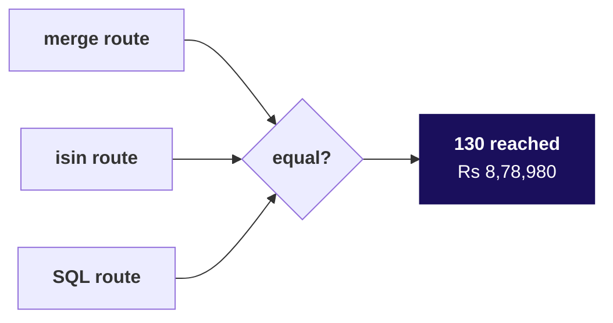
```mermaid
flowchart LR
    M["<b>merge route</b>"] --> E{"<b>equal?</b>"}
    F["<b>isin route</b>"] --> E
    Q["<b>SQL route</b>"] --> E
    E --> Y["<b>130 reached</b><br/>Rs 8,78,980"]
    classDef bet fill:#1A0F5C,stroke:#1A0F5C,color:#FFFFFF
    class Y bet
```

```notes
LIVE, 2 minutes. IN asks only whether a customer is in the feed, however often, so it cannot fan out.
When to switch: the merge for the table, since the date rides along; isin for yes or no; SQL for
Finance checking the marketing lead's slide.
```

---

## S32. Chapter 2: 130 reached, 340 rows kept
*What did each smaller question find?*

| Question | The answer |
|---|---|
| Which way attaches it? | The first-exposure rule and a merge with `validate="one_to_one"` |
| What does how= keep? | Left out, only 130 of 340; the 210 unreached vanish |
| What does a re-sent row do? | Invented: Rs 34,700 on the slide, Rs 26,100 truly |
| What stops it? | `validate`, with a `MergeError` before the table exists |
| Which exposure stays? | The first; 340 rows, Rs 19,84,00,000, 130 reached |
| Does a count agree? | Flag, merge and SQL: 130 and Rs 8,78,980 |

**Kavya's review.** A merge is a join: 340 rows in and 340 out, Rs 19,84,00,000 before and after, and the rule in writing beside the table.

**In the interview.** [F] Which merge argument raises on duplicate keys, and which error does it raise?

```notes
LIVE, 2 minutes. One breath: validate with one_to_one, one_to_many or many_to_one; it raises
pandas.errors.MergeError naming the side whose keys repeat; a row count finds the same fault after
the table exists, and validate stops it before. Then chapter 3: the head of Retail-Plus wants the
months.
```

---

## SECTION 3: Is Retail-Plus slipping?
*How far did Retail-Plus members' spend fall from Q1 to Q2, month by month, in the number the growth review hears?*

```notes
LIVE. Thirty minutes. Notebook C2_W02_D04_03_months_pivot is the demonstration.
```

---

## S33. Six steps turn orders into the tier's months
*What does the head of Retail-Plus need settled before the growth review?*

**Who needs the answer.** The head of Retail-Plus, the paid tier, who takes one number to the growth review and uses the rows to decide which members to protect.

```timeline
label: 1 | title: Which shape answers? | body: Long, wide, or a query per month
label: 2 | title: How many member-months? | body: The long table and its true totals
label: 3 | title: What does a one-line pivot say? | body: The fall, read from the default
label: 4 | title: What is one row? | body: The index decides
label: 5 | title: Compare or follow? | body: Wide against long, and melt
label: 6 | title: Does SQL agree? | body: The fall with no pivot at all | tone: dark
```

```notes
LIVE, 1 minute. Chapter 2 left 340 rows and 130 reached. Week 1 found Retail-Plus members ordering
less often; this chapter measures the tier's fall month by month.
```

---

## S34. One number goes to the growth review
*What does the head of Retail-Plus decide, and what does a small number cost?*

```stats
value: 120 | label: members on the list | note: 107 of them ordered
value: 355 | label: Retail-Plus orders | note: April to September
value: ? | label: the fall, Q1 to Q2 | note: the number for the review
```

**The client asks.** "One row per member, one column per month, so I can read along a row and see who is drifting, and the tier's fall in one number."

```notes
LIVE, 2 minutes. A number too small argues the tier's problem down; rows that stand for the wrong
thing protect the wrong members. Leave the question mark on the slide: the room computes it.
```

---

## S35. Costco reports visits and trip size apart
*Who else splits how often members buy from what each trip is worth?*

```stats
value: +3.3% | label: traffic or shopping frequency | note: worldwide, Q4 fiscal 2026
value: +5.9% | label: average transaction or ticket | note: worldwide, Q4 fiscal 2026
value: 92.3% | label: renewal rate | note: US and Canada
```

**What breaks.** A single average of the trip hides how often members come, and how often is the lever Week 1 found moving in Retail-Plus.

```notes
LIVE, 2 minutes. Sources, checked 1 Oct 2026: Costco's fourth-quarter fiscal 2026 supplemental
information, filed with the SEC on 24 Sep 2026, and the earnings call that day, where the chief
financial officer reported "traffic or shopping frequency increased 3.3% worldwide" and "our average
transaction or ticket was up 5.9% worldwide". A paid membership business reports the two numbers
separately for a reason.
```

---

## S36. Long to hold, wide to read, in pandas
*Which of three shapes should answer the head of Retail-Plus, and what does each cost?*

| Option | Shape | Cells | Empty cells | Adding October |
|---|---|---|---|---|
| a) long, `groupby` on member and month | 266 by 3 | 798 | 0 | nothing |
| b) wide, `pivot_table` | 107 by 7, id and months | 749 | 376 | nothing |
| c) SQL, a column per month by hand | 107 by 7 | 749 | 376 | a new line, typed |

**The call.** a and b together: long keeps every rupee and plots, wide is what the head reads. What would switch it: the view moving into the warehouse every Monday; then c, with a calendar table of months.

```notes
LIVE, 3 minutes. The 376 empty cells are member-months with no order. c fixes six months in its
text, so every new month is an edit and a place for a typo. pivot_table turns the values of one
column into columns; the next slides show what it does with repeats.
```

---

## S37. How many member-months did Retail-Plus buy in?
*In how many member-months did Retail-Plus buy?*

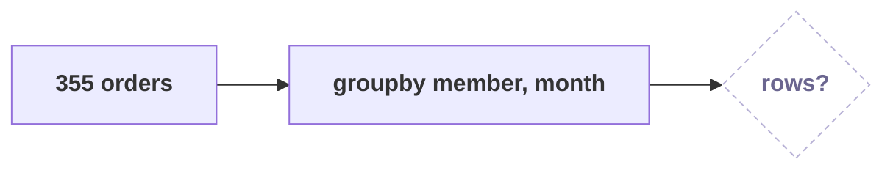
```mermaid
flowchart LR
    O["<b>355 orders</b>"] --> G["<b>groupby member, month</b>"] --> N{"<b>rows?</b>"}
    classDef unknown fill:#FFFFFF,stroke:#B8B2D6,color:#6B6690,stroke-dasharray:4 3
    class N unknown
```

**Question.** As a letter? a) 355, one per order; b) 642, 107 members times 6 months; c) 266; d) 107.

```notes
LIVE, 2 minutes. Letters in chat.
```

---

## S38. Answer: 266, and a fall of 29.4 percent
*What did the tier take in each quarter, every order added up?*

```stats
value: 266 | label: member-months | note: a month with no order has no row
value: Rs 5,85,770 | label: Q1 | note: April to June
value: Rs 4,13,380 | label: Q2 | note: July to September, a fall of 29.4%
```

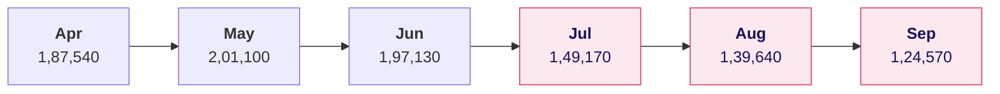
```mermaid
flowchart LR
    A["<b>Apr</b><br/>1,87,540"] --> M["<b>May</b><br/>2,01,100"] --> J["<b>Jun</b><br/>1,97,130"] --> L["<b>Jul</b><br/>1,49,170"] --> U["<b>Aug</b><br/>1,39,640"] --> S["<b>Sep</b><br/>1,24,570"]
    classDef bad fill:#FBE9EF,stroke:#D63A6A,color:#1A0F5C
    class L,U,S bad
```

```notes
LIVE, 2 minutes. The answer is c. The 13 Retail-Plus members who never ordered are in no row. Hold
the two quarters: Rs 5,85,770 and Rs 4,13,380.
```

---

## S39. How far did the tier fall, per the one-liner?
*How far did the tier fall, read from a one-line pivot?*

```python
wide = plus.pivot_table(index="customer_id", columns="month", values="amount")
wide.sum()          # each month's column added up, Q1 against Q2
```

**Question.** The fall it reports, as a letter? a) 29 percent; b) 18 percent; c) 0 percent; d) it raises an error.

```notes
LIVE, 2 minutes. The hurried analyst writes the pivot in one line and adds up the columns.
```

---

## S40. Answer: 18 percent, the plausible wrong answer
*What would the growth review have heard?*

```stats
value: Rs 4,12,019 | label: Q1, from the pivot | note: April to June
value: Rs 3,37,267 | label: Q2, from the pivot | note: July to September
value: -18% | label: the fall it reports | note: against a true 29.4%
```

**What breaks.** The head of Retail-Plus defends a fall of Rs 74,752 when the tier lost Rs 1,72,390.

```notes
LIVE, 2 minutes. The answer is b. Ask what could make a sum of columns come in low before showing why.
```

---

## S41. Why it is wrong: pivot_table averages
*Why is the pivot short, and which check catches it?*

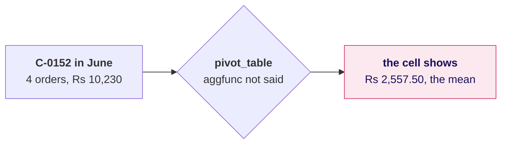
```mermaid
flowchart LR
    O["<b>C-0152 in June</b><br/>4 orders, Rs 10,230"] --> P{"<b>pivot_table</b><br/>aggfunc not said"}
    P --> C["<b>the cell shows</b><br/>Rs 2,557.50, the mean"]
    classDef bad fill:#FBE9EF,stroke:#D63A6A,color:#1A0F5C
    class C bad
```

**The check.** A pivot of spend holds the same total as its orders. This one holds Rs 7,49,286 against Rs 9,99,150, a quarter short.

```notes
LIVE, 3 minutes. pivot_table's default aggfunc is "mean", checked on pandas 3.0.6. A member who
ordered four times in June shows the average of the four, and the column sums add averages, which hide
how often members bought: the very lever Retail-Plus moved on.
```

---

## S42. The fix: aggfunc="sum" and fill_value=0
*What does the pivot say once a cell means a total?*

```python
wide = plus.pivot_table(index="customer_id", columns="month", values="amount",
                        aggfunc="sum", fill_value=0)
```

```stats
value: Rs 9,99,150 | label: grand total | note: equals the orders
value: -29.4% | label: Q1 to Q2 | note: Rs 1,72,390 in rupees
value: Rs 97,638 | label: the fall the average hid | note: lost when each cell averaged
```

```notes
LIVE, 3 minutes. fill_value=0 writes a month with no order as 0 spend instead of a gap. Then the
your-turn: the same view for Retail-Core; the room checks the grand total first and says whether the
averaged pivot even gets the direction right. The day sheet carries the two numbers to confirm.
```

---

## S43. Indexed by order, the pivot has 355 rows
*What does one row of the pivot stand for?*

| Index | Shape | First row label | One row is |
|---|---|---|---|
| `customer_id` | 107 by 6 | a member's id | a member |
| `order_id` | 355 by 6 | KR-00125 | an order |

**What breaks.** The order-indexed pivot's totals are right, so it survives a glance, but "who is drifting" cannot be read from rows that are orders. Read the row labels aloud before reading a number.

```notes
LIVE, 2 minutes, notebook section 4. Point at each pivot's first row label and say what one row
stands for: a member's id, then an order's id. The 13 members who never ordered are in neither view,
a decision to state when the view goes out.
```

---

## S44. Wide compares, long follows the trend
*Which shape compares a member's quarters, and which follows the tier's trend?*

```stats
value: 67 of 107 | label: members spent less in Q2 | note: the wide view
value: 642 | label: rows after melt | note: 107 members times 6 months
value: 56 to 37 | label: members ordering | note: April to September, the long view
```

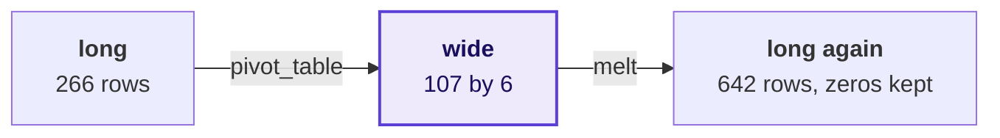
```mermaid
flowchart LR
    L["<b>long</b><br/>266 rows"] -->|pivot_table| W["<b>wide</b><br/>107 by 6"]
    W -->|melt| B["<b>long again</b><br/>642 rows, zeros kept"]
    classDef known fill:#EEEAFB,stroke:#5B3FD6,color:#1A0F5C,stroke-width:2px
    class W known
```

```notes
LIVE, 2 minutes. pivot widens, melt lengthens. The trend in members ordering each month, 56, 47, 48,
40, 38, 37, is the frequency Week 1 found moving, and it needs the long shape to plot.
```

---

## S45. A second route: SQL gives the same 29.4%
*Does a query that never pivots give the same fall?*

```sql
SELECT o.quarter, sum(o.amount) AS spend
FROM orders o JOIN customers c ON c.customer_id = o.customer_id
WHERE c.segment = 'Retail-Plus'
GROUP BY o.quarter;
```

```stats
value: Rs 5,85,770 | label: Q1 | note: SQL and the summed pivot
value: Rs 4,13,380 | label: Q2 | note: SQL and the summed pivot
value: -29.4% | label: the fall | note: no aggfunc to forget
```

```notes
LIVE, 2 minutes. When to switch: the pivot for the head's rows, the quarter query for the one number,
and the query to trust when a pivot's arguments are in doubt.
```

---

## S46. Chapter 3: a fall of 29.4 percent, Rs 1,72,390
*What did each smaller question find?*

| Question | The answer |
|---|---|
| Which shape answers? | Long and wide together, in pandas |
| How many member-months? | 266; Rs 5,85,770 in Q1, Rs 4,13,380 in Q2 |
| What does a one-line pivot say? | 18 percent, because it averages |
| What is one row? | A member, 107; indexed by order, 355 |
| Compare or follow? | Wide: 67 members fell; long: 56 to 37 ordering |
| Does SQL agree? | Yes: 29.4 percent |

**Kavya's review.** Write `aggfunc=` on every pivot, the way you write `how=` on every merge, and check the grand total against the orders.

**In the interview.** [F] Pivot against melt: which widens and which lengthens?

```notes
LIVE, 2 minutes. One breath: pivot and pivot_table widen, the values of one column become columns;
melt lengthens, folding columns back into rows. Then the break, ten minutes, before chapter 4.
```

---

## SECTION 4: Do three tools agree?
*Of the 130 customers the sale reached, how many bought, and do plain Python, SQL and pandas agree on it?*

```notes
LIVE. Ten-minute break first, then thirty minutes. Notebook C2_W02_D04_04_three_tools is the
demonstration.
```

---

## S47. Three tools must agree before Marketing hears it
*What must Kavya see before the share who bought reaches Marketing?*

**Who needs the answer.** The marketing lead, through Kavya: the share of reached customers who bought is the second line of the November case, and Kavya signs nothing two tools disagree on.

```timeline
label: 1 | title: Which tool answers? | body: Plain Python, SQL or pandas, sized
label: 2 | title: What does Python count? | body: Sets and a dictionary of segments
label: 3 | title: What does SQL say? | body: GROUP BY segment
label: 4 | title: Why does pandas say 100%? | body: The default that drops a group
label: 5 | title: Where should the segment come from? | body: So that all three agree
label: 6 | title: Do sets agree? | body: No grouping at all | tone: dark
```

```notes
LIVE, 1 minute. Kavya's challenge for this chapter: answer the question in plain Python, in SQL and in
pandas, then say why the three agree, or why they do not.
```

---

## S48. The share who bought is the budget's second line
*What is the marketing lead's question, and what does a perfect number cost?*

```stats
value: 130 | label: reached | note: chapter 2's rule, one row each
value: ? | label: of them bought | note: at least one order in two quarters
value: ?% | label: the share | note: the November case's second line
```

**The client asks.** "Of the customers the sale reached, how many went on to buy?"

```notes
LIVE, 2 minutes. Bought means at least one order in the two quarters; whether the sale caused it is
Week 1 Thursday's question. A share that leaves out the reached who never bought makes the sale look
perfect.
```

---

## S49. Uber's completed trips lived in two tools
*Who else found one question giving two answers in two tools?*

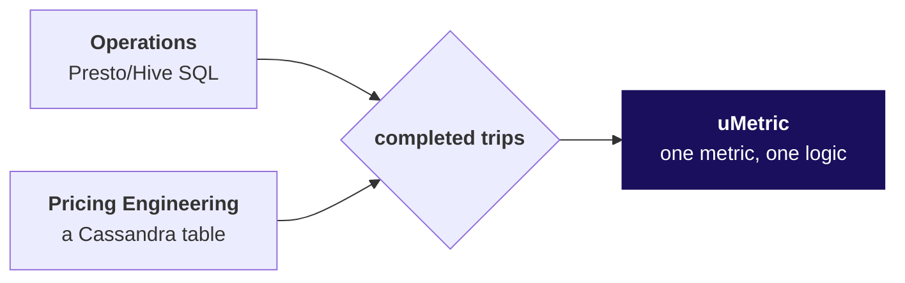
```mermaid
flowchart LR
    O["<b>Operations</b><br/>Presto/Hive SQL"] --> T{"<b>completed trips</b>"}
    P["<b>Pricing Engineering</b><br/>a Cassandra table"] --> T
    T --> U["<b>uMetric</b><br/>one metric, one logic"]
    classDef bet fill:#1A0F5C,stroke:#1A0F5C,color:#FFFFFF
    class U bet
```

**What breaks.** Two teams computing one metric their own way drift into two numbers, and a decision built on either inherits the gap.

```notes
LIVE, 2 minutes. Source: Uber Blog, "The Journey Towards Metric Standardization", 12 January 2021,
checked 1 Oct 2026: Operations computed completed trips as a Presto/Hive SQL for daily dashboards
while Pricing Engineering built its own from a Cassandra table; the goal became "a strictly ONE to
ONE mapping" between a metric and its business logic.
```

---

## S50. pandas answers, SQL checks it
*Which tool should answer the marketing lead's question, and what does each cost on this data?*

| Option | Rows moved for this question | Lines of logic | Where it runs |
|---|---|---|---|
| a) plain Python | 1,340 | 6 | the analyst's machine |
| b) SQL | 2 | 10 | the warehouse |
| c) pandas | 0 more | 3 | the analyst's machine, table in memory |

**The call.** c, checked by b: the table is in memory, and SQL shares no code with it. What would switch it: the number going to Finance or an auditor; then SQL owns it, chapter 5's question.

```notes
LIVE, 3 minutes. Plain Python fetches the 1,000 orders and the 340-row customer list, and it is the
route for explaining a count line by line. SQL sends its answer, two rows.
```

---

## S51. Every reached customer bought or never ordered
*Before any tool runs, what must the three counts add up to?*

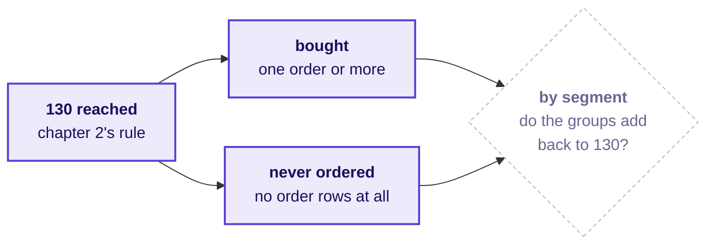
```mermaid
flowchart LR
    R["<b>130 reached</b><br/>chapter 2's rule"] --> B["<b>bought</b><br/>one order or more"]
    R --> N["<b>never ordered</b><br/>no order rows at all"]
    B --> S{"<b>by segment</b><br/>do the groups add<br/>back to 130?"}
    N --> S
    classDef known fill:#EEEAFB,stroke:#5B3FD6,color:#1A0F5C,stroke-width:2px
    classDef unknown fill:#FFFFFF,stroke:#B8B2D6,color:#6B6690,stroke-dasharray:4 3
    class R,B,N known
    class S unknown
```

**The call.** Whatever the tool, the reached split into those who bought and those who never ordered, and the groups by segment must add back to 130.

```notes
LIVE, 2 minutes. Draw it before any code. A customer who never ordered has no order rows, so any
attribute read from the orders is missing for them. Ask where each tool would file such a customer;
the next three slides show what each one does.
```

---

## S52. How many keys does Python's dictionary end with?
*What does plain Python count, with a set of reached customers and a dictionary of segments?*

```python
seg_of_buyer = {r["customer_id"]: r["segment"] for r in rows}    # read from the orders
for cid in reached_ids:
    c = counts.setdefault(seg_of_buyer.get(cid), {"reached": 0, "bought": 0})
```

**Question.** As a letter? a) 2; b) 3; c) 4; d) 130.

```notes
LIVE, 2 minutes. .get returns None for a customer the dictionary does not hold.
```

---

## S53. Answer: three keys, and None holds 23
*What do plain Python and SQL say, group by group?*

| Group | Reached | Bought |
|---|---|---|
| Retail-Core | 56 | 56 |
| Retail-Plus | 51 | 51 |
| None, or NULL in SQL | 23 | 0 |
| All | 130 | 107 |

**What it shows.** Plain Python files the 23 under `None`, and SQL's `GROUP BY` puts them in a `NULL` group of their own. Both still count 130.

```notes
LIVE, 3 minutes. The answer is b. Run the SQL version too, notebook section 3: three rows, one NULL.
The 23 are reached customers with no orders, so no segment could be read from their orders.
```

---

## S54. What share does the hurried pandas route report?
*What does pandas say about the reached customers who bought?*

```python
reach = buyers.merge(first_touch, on="customer_id", how="right", validate="one_to_one")
reach.groupby("segment").agg(reached=("customer_id", "count"), bought=("frequency", "count"))
```

**Question.** The share of reached customers who bought, as a letter? a) 82 percent; b) 100 percent; c) 50 percent; d) it cannot be computed.

```notes
LIVE, 2 minutes. Letters in chat, then run the notebook's section 4. buyers carries each customer's
segment as read from their orders.
```

---

## S55. Answer: 100 percent, the plausible wrong answer
*Why does pandas report that every reached customer bought?*

```stats
value: 100% | label: of reached bought | note: the pandas headline
value: 107 | label: reached | note: where SQL and Python count 130
value: 56 of 56, 51 of 51 | label: Retail-Core, Retail-Plus | note: every group full
```

```notes
LIVE, 2 minutes. The answer is b. The hurried pandas route reports 100 percent on 107 customers. The
decision it misleads: a marketing lead asking for the same budget on perfect results.
```

---

## S56. Why it is wrong: groupby drops a missing key
*Which default dropped the 23, and which check catches it?*

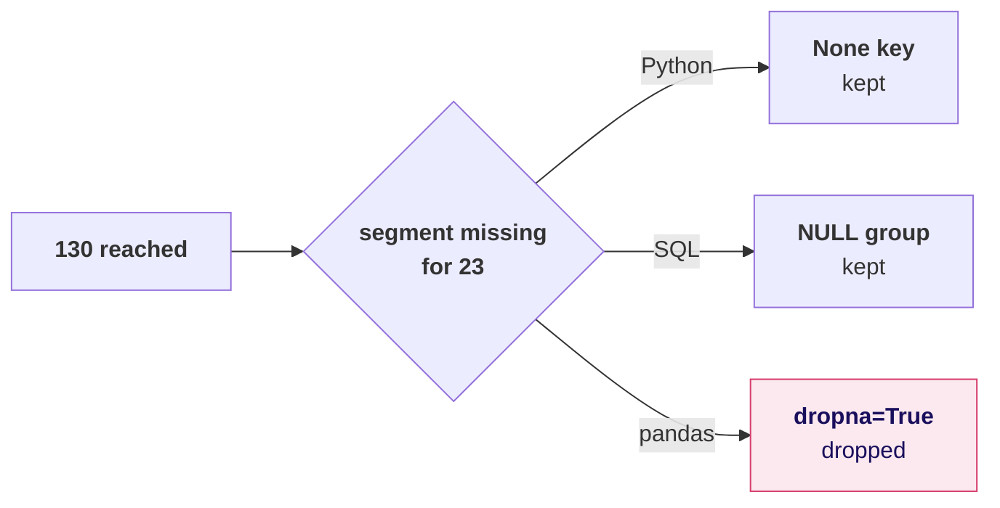
```mermaid
flowchart LR
    R["<b>130 reached</b>"] --> K{"<b>segment missing<br/>for 23</b>"}
    K -->|Python| N["<b>None key</b><br/>kept"]
    K -->|SQL| Q["<b>NULL group</b><br/>kept"]
    K -->|pandas| D["<b>dropna=True</b><br/>dropped"]
    classDef bad fill:#FBE9EF,stroke:#D63A6A,color:#1A0F5C
    class D bad
```

**The check.** The groups add back to the rows: 107 against the 130 reached. `groupby(..., dropna=False)` shows the missing group of 23.

```notes
LIVE, 3 minutes. groupby's dropna defaults to True, checked on pandas 3.0.6; the API page says NA
keys "will be dropped". The reached who never bought are exactly the ones that vanished.
```

---

## S57. The fix: the segment comes from the list
*Where should the segment come from, so that all three tools agree?*

```stats
value: 56 of 70 | label: Retail-Core | note: 80 percent bought
value: 51 of 60 | label: Retail-Plus | note: 85 percent bought
value: 107 of 130 | label: all reached | note: 82 percent, in all three tools
```

**What changed.** Every customer on the list has a segment, bought or not. Read it from the list, in all three tools, and the reach moves from 107 to 130 and the share from 100 percent to 82.

```notes
LIVE, 3 minutes. Retail-Plus's share is 85 percent, 51 of its 60 reached members. The tools
disagreed because the hurried versions read the segment from the orders.
```

---

## S58. A second route: sets find the same 23
*Does counting sets, with no grouping at all, find the same customers who never bought?*

```python
never = reached_ids - set(orders["customer_id"])     # 23
bought = len(reached_ids) - len(never)                # 107
```

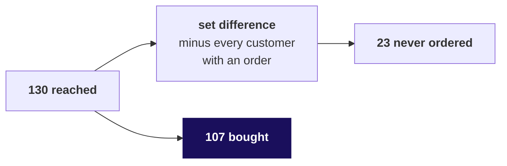
```mermaid
flowchart LR
    R["<b>130 reached</b>"] --> D["<b>set difference</b><br/>minus every customer<br/>with an order"]
    D --> N["<b>23 never ordered</b>"]
    R --> B["<b>107 bought</b>"]
    classDef bet fill:#1A0F5C,stroke:#1A0F5C,color:#FFFFFF
    class B bet
```

```notes
LIVE, 2 minutes. Sets never ask for a segment, so they cannot drop one. When to switch: the grouped
pandas count for the slide, the set difference when a group count looks too good.
```

---

## S59. Chapter 4: 107 of 130 bought, 82 percent
*What did each smaller question find?*

| Question | The answer |
|---|---|
| Which tool answers? | pandas, in memory, checked by SQL's 2 rows |
| What does Python count? | Three keys; None holds 23 |
| What does SQL say? | Three groups; NULL holds 23 |
| Why does pandas say 100%? | `dropna=True` drops the missing segment |
| Where should the segment come from? | The customer list: 107 of 130, 82 percent |
| Do sets agree? | Yes: 23 never ordered, 107 bought |

**Kavya's review.** When two tools disagree, look for the rows one of them dropped before you look at the code, and take a customer's attributes from the customer list.

**In the interview.** [F] What does SQL's GROUP BY do with a NULL key, and pandas' groupby with a missing one?

```notes
LIVE, 2 minutes. One breath: SQL puts NULLs in one group of their own; pandas drops them by default;
check the groups add back to the rows. Then chapter 5: if three tools can agree, which should own
which number?
```

---

## SECTION 5: Which tool for which job?
*Which tool should own each of Marketing's and Finance's recurring numbers, and which would you refuse for Finance's?*

```notes
LIVE. Thirty minutes. Notebook C2_W02_D04_05_tool_choice is the demonstration.
```

---

## S60. Five questions decide who owns Finance's number
*What does Anand Iyer's analyst need settled before Monday's rerun?*

**Who needs the answer.** Kavya, and behind Kavya, Anand Iyer, whose analyst reruns every number; a number that lives in two tools drifts into two numbers, which is how Week 1 Wednesday lost a month.

```timeline
label: 1 | title: Which tool for Finance? | body: SQL, pandas or plain Python, sized
label: 2 | title: Does speed decide? | body: Three routes timed on 1,000 orders
label: 3 | title: How many rows move? | body: The size that separates them
label: 4 | title: Who owns which ask? | body: The note, and the refusal
label: 5 | title: Does the table reconcile? | body: The table against Finance's query | tone: dark
```

```notes
LIVE, 1 minute. Week 1 Wednesday: the dashboard's Rs 2.1 crore against the books' Rs 1.9 crore, two
copies of one number, a month lost to the argument.
```

---

## S61. Finance reruns eight numbers every Monday
*Which number does the note test, and who reruns it?*

```stats
value: 8 | label: numbers | note: four segments by two quarters
value: Rs 19,84,00,000 | label: they add up to | note: the warehouse's two quarters
value: every Monday | label: rerun by | note: Anand's analyst, line by line
```

**The client asks.** "Tell me honestly which tool you would pick for which job, and which you would refuse for Finance's numbers."

```notes
LIVE, 2 minutes. Kavya's words. The four recurring asks are Finance's revenue, the growth team's
table, the head of Retail-Plus's months view and an auditor's one-off; the note assigns each an owner.
```

---

## S62. LinkedIn gave every metric one source
*Who else learned what one metric in many places costs?*

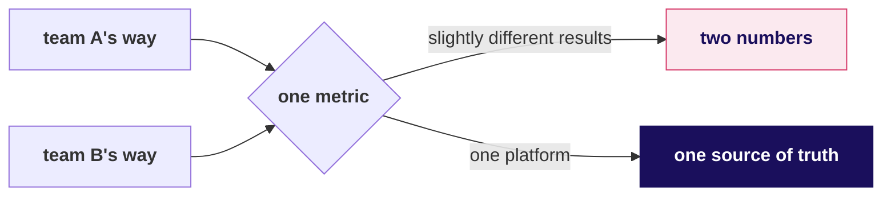
```mermaid
flowchart LR
    A["<b>team A's way</b>"] --> M{"<b>one metric</b>"}
    B["<b>team B's way</b>"] --> M
    M -->|slightly different results| X["<b>two numbers</b>"]
    M -->|one platform| U["<b>one source of truth</b>"]
    classDef bad fill:#FBE9EF,stroke:#D63A6A,color:#1A0F5C
    classDef bet fill:#1A0F5C,stroke:#1A0F5C,color:#FFFFFF
    class X bad
    class U bet
```

```notes
LIVE, 2 minutes. Source: LinkedIn Engineering, Unified Metrics Platform, checked 1 Oct 2026:
"Multiple stakeholders come up with different ways to calculate the same metric arriving at slightly
different results"; the platform "serves as the single source of truth for all business metrics at
Linkedin".
```

---

## S63. SQL, because Finance reruns it where data lives
*Which of three tools should compute Finance's Monday revenue, and what does each cost?*

| Option | Lines of logic | Where Anand's analyst reruns it | Depends on, besides the data |
|---|---|---|---|
| a) SQL | 5 | anywhere with read access | the warehouse only |
| b) pandas | 4 | the analyst's machine | the notebook's state |
| c) plain Python | 6 | the analyst's machine | the script's environment |

**The call.** a. What would switch it: a Finance question that needs iteration, five cuts in an afternoon; then pandas reads SQL's answer, and the definition still lives in one place.

```notes
LIVE, 3 minutes. Speed and rows moved are the two sizes still missing; the next slides measure both.
```

---

## S64. Does speed separate the three tools here?
*Does speed separate the three tools on 1,000 orders?*

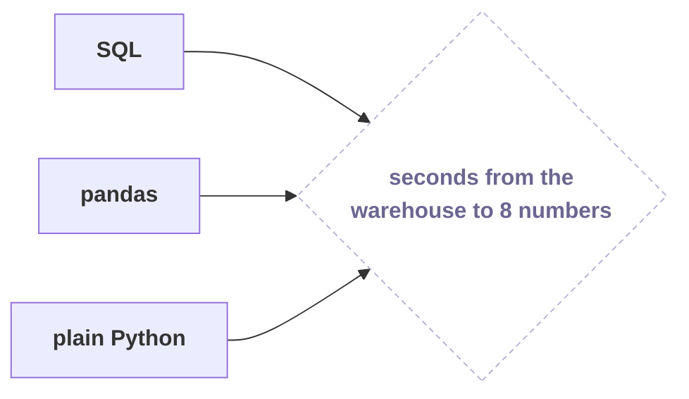
```mermaid
flowchart LR
    S["<b>SQL</b>"] --> E{"<b>seconds from the<br/>warehouse to 8 numbers</b>"}
    P["<b>pandas</b>"] --> E
    Y["<b>plain Python</b>"] --> E
    classDef unknown fill:#FFFFFF,stroke:#B8B2D6,color:#6B6690,stroke-dasharray:4 3
    class E unknown
```

**Question.** As a letter? a) SQL is ten times faster than the rest; b) pandas is ten times faster; c) all three finish well inside a second; d) plain Python takes over a minute.

```notes
LIVE, 2 minutes. Letters, then run notebook section 2, which times each route end to end.
```

---

## S65. Answer: all three finish in hundredths of a second
*Does speed give a reason to choose on 1,000 orders?*

```stats
value: 0.004 s | label: SQL | note: first on every one of 30 runs
value: 0.010 s | label: pandas | note: the median of 30 runs
value: 0.017 s | label: plain Python | note: the median of 30 runs
```

**What it means.** Speed ranks SQL first, by about a hundredth of a second, and a hundredth of a second on a number Finance reads once a week decides nothing. The size that grows with the business is the rows each route moves.

```notes
LIVE, 2 minutes. The answer is c. The stats are medians of 30 timed runs on the machine that built
the notebook; the notebook prints this run's timings, which land in the same order. Then the size
that does grow: the rows each route moves.
```

---

## S66. How many rows did pandas move for its eight?
*Sized by the answer, the three tools tie: is that the cost of each?*

| Option | Rows in the answer | The hurried note says |
|---|---|---|
| a) SQL | 8 | the same cost |
| b) pandas | 8 | the same cost, and the shortest chain |
| c) plain Python | 8 | the same cost |

**Question.** Sized by the answer, the three tie at 8 rows. How many rows did the pandas route move out of the warehouse to produce its eight, as a letter? a) 8; b) 340; c) 1,000; d) 1,340.

```notes
LIVE, 2 minutes. The hurried note sizes by the answer and picks pandas for Finance, because its chain
is short. Letters in chat, then run the notebook's section 3.
```

---

## S67. Answer: pandas moved 1,340 rows, SQL moved 8
*Which size separates the tools, and which check catches the tie?*

```stats
value: 8 | label: SQL moved | note: its answer, nothing else
value: 1,340 | label: pandas moved | note: 1,000 orders and 340 customers
value: 1,000 | label: plain Python moved | note: every order
```

**The check.** Count the rows each route fetched before comparing anything: about 168 times as many for pandas today, and at a hundred times the orders pandas moves a hundred times the rows while SQL still sends 8.

```notes
LIVE, 3 minutes. The answer is d, 1,340. The fix: size a route by the rows it moves and by who must
rerun it. The note's line for Finance does not change; its reason is now a number.
```

---

## S68. The note: every ask has one owner
*Which tool should own each of the day's recurring asks, and which would you refuse for Finance?*

| The ask | The owner | The reason |
|---|---|---|
| Finance's revenue by segment and quarter | SQL | reruns where the data lives; moves 8 rows |
| The growth team's customer table | pandas, reading the warehouse | columns added weekly; merge and validate |
| The head of Retail-Plus's months view | pandas | a pivot and a melt in memory |
| One customer's spend, for an auditor | plain Python | every step a readable line |

**The refusal.** Never a pandas notebook for Finance's number: it moves every order to one machine, runs on a copy, and Anand's analyst cannot rerun it without the growth team's notebook.

```notes
LIVE, 4 minutes. Start from the last row: plain Python owns the auditor's one-off, asked once and
read line by line. The refusal is the sentence Kavya will ask for in the interview drill.
```

---

## S69. A second route: the table ties to Finance
*Does the growth team's table reconcile with Finance's query to the rupee?*

| Segment | The growth team's table | Finance's query, both quarters |
|---|---|---|
| Business | Rs 19,65,99,040 | Rs 19,65,99,040 |
| Retail-Plus | Rs 9,99,150 | Rs 9,99,150 |
| Retail-Core | Rs 7,39,320 | Rs 7,39,320 |
| Student | Rs 62,490 | Rs 62,490 |

**The check.** Run this reconciliation every Monday; when it fails, the warehouse is right and the table is wrong until someone can say why. Chapter 6 puts it inside the refresh.

```notes
LIVE, 2 minutes. The two routes share no code: chapter 1's groupby and merge against SQL. Both add up
to Rs 19,84,00,000. The depth section shows a temporary view that pandas reads, so the definition is
never retyped.
```

---

## S70. Chapter 5: SQL owns Finance's number
*What did each smaller question find?*

| Question | The answer |
|---|---|
| Which tool for Finance? | SQL, rerun where the data lives |
| Does speed decide? | No: hundredths of a second apart |
| How many rows move? | SQL 8, pandas 1,340, plain Python 1,000 |
| Who owns which ask? | SQL Finance, pandas the table and months, Python the auditor |
| Does the table reconcile? | Every segment, Rs 19,84,00,000 |

**Kavya's review.** Choose by who has to trust the number and rerun it, and size a route by the rows it moves.

**In the interview.** [D] Same question, three tools: how do you choose, and defend one choice?

```notes
LIVE, 2 minutes. One breath: they agree, so I choose by who reruns the number: SQL for Finance,
pandas for the analyst's bench reading SQL's answers, plain Python for a one-off explained line by
line; on 1,000 rows the tools finish hundredths of a second apart, so I size by rows moved. The morning closes here;
after lunch, chapter 6 makes the table rebuild itself.
```
