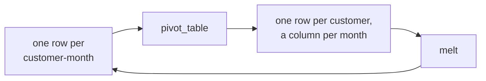
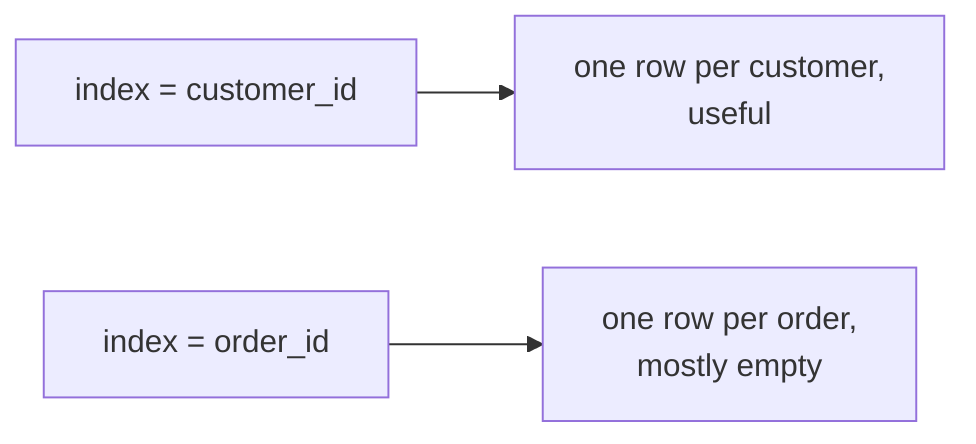
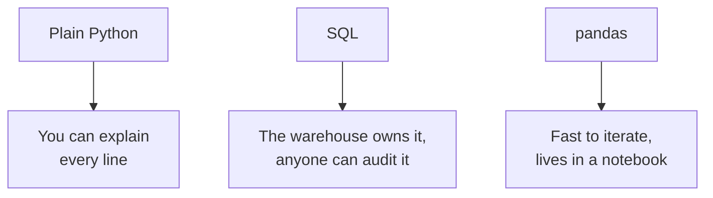
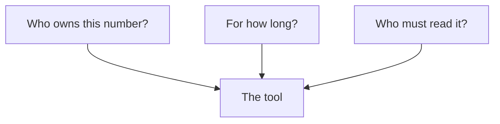
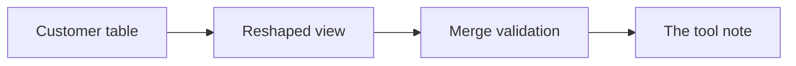
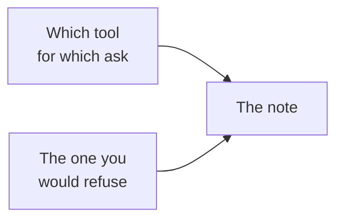

# Half two: reshape, and the answer to the senior analyst

Week 2, Day 4. Slide source. One idea per slide.

Position bar, repeated at every section boundary:
`[reshape] > [the same question three ways] > [the tool note] > [what ships]`

---

## SECTION D. A reshape changes the question

---

## S1. The same numbers, two shapes
Months down the page answers "how did this move". Months across the page answers "how do these
compare".

Nothing is added or removed. The shape decides which question is easy to ask.

---

## S2. Long, and wide


---

## S3. The call that widens
```python
wide = monthly.pivot_table(index="customer_id", columns="month",
                           values="spend", aggfunc="sum")
```
`index` is what stays a row, `columns` is what becomes a column, `values` is what fills the grid.

---

## S4. And the one that lengthens
```python
long = wide.reset_index().melt(id_vars="customer_id",
                               var_name="month", value_name="spend")
```
`melt` puts the columns back into rows. Every widening is reversible, which is worth knowing
before you widen something.

---

## S5. The wrong index answers a question nobody asked

Index by `order_id` instead of `customer_id` and you get one row per order with a column per
month, almost all of them empty.

It runs. It produces a table. The table is meaningless.

---

## D1. How to catch it without staring at the numbers
Read the row labels aloud before reading any value. "Each row is one order" is the moment the
mistake becomes obvious, and no amount of checking the totals would have found it.

The habit generalises: a table's index is a claim about what one row means, and it is the first
thing to check rather than the last.

---

## SECTION E. The same question, three ways

---

## S6. Revenue per segment, in three tools
```python
# Week 1, plain Python
totals = {}
for o in orders:
    totals[o["segment"]] = totals.get(o["segment"], 0) + o["amount"]
```
```sql
-- Monday, SQL
SELECT segment, sum(amount) FROM orders
JOIN customers USING (customer_id) GROUP BY segment;
```
```python
# Today, pandas
orders.groupby("segment")["amount"].sum()
```

---

## S7. All three are correct and not interchangeable


---

## S8. The question is not which is best

It is which one should own this number, for how long, and who has to be able to read it.

Those three constraints pick the tool almost every time, and none of them is about syntax.

---

## D2. The one to refuse, and why
Finance's Monday number does not belong in a notebook.

The objection is not to pandas. A notebook has no audit trail a controller can read, no
guarantee it was run against current data, and a cell somebody edited at 4 pm looks identical to
one nobody touched.

Say that out loud when asked. It is the answer that separates an analyst from somebody who knows
three libraries.

---

## S9. The operating rule, in three lines
| Tool | Owns | Never |
|---|---|---|
| The warehouse | Numbers Finance acts on, refreshed on a schedule | Exploration, because iteration is slow |
| pandas | The analyst's own iteration, feature building, the weekly table | The source of truth |
| Plain Python | Anything you have to explain line by line to a room | Anything at scale |

---

## SECTION F. What ships

---

## S10. Four things

| Piece | What it is |
|---|---|
| The customer table | One row per customer, six columns, refreshable in one run |
| The reshaped view | Monthly spend, wide, for comparison |
| The merge validation | `validate=` on every merge, with the failure recorded |
| The tool note | The answer to the senior analyst, in writing |

---

## S11. The note is the deliverable

Four or five sentences. Which tool answers which of Marketing's and Finance's asks, and why.

Include the one you would refuse, and the reason. A note without a refusal has not made a choice.

---

## S12. What today equipped you to answer
> [S] groupby in the split-apply-combine sentence.
> [S] merge against join: what is the same and what differs?
> [F] Which merge argument raises on duplicate keys, and which error?
> [F] pivot against melt: which widens and which lengthens?
> [D] Same question, three tools: how do you choose, and defend one choice?

---

## S13. Tomorrow
Meera's office runs on Excel, and her chief of staff wants three things that open on a laptop with
no login and recalculate when a director changes an assumption in the room.
