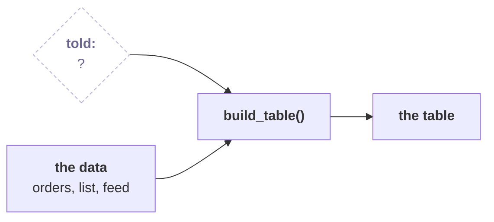
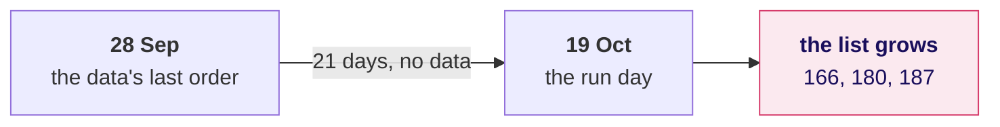
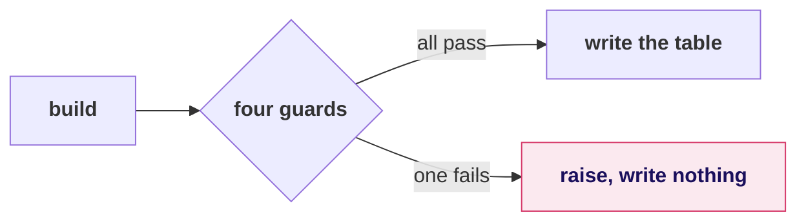
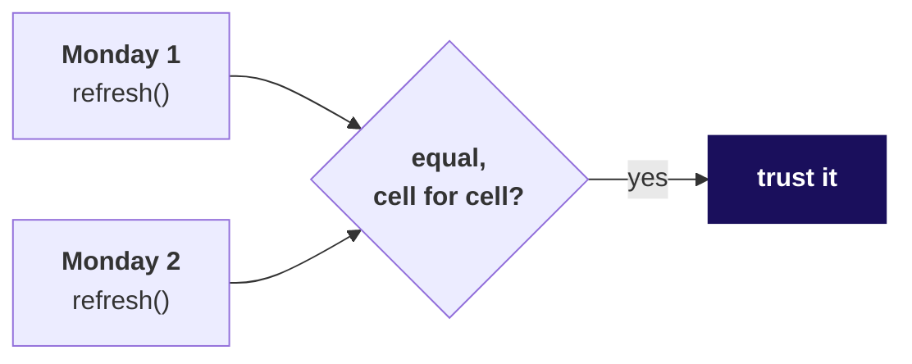
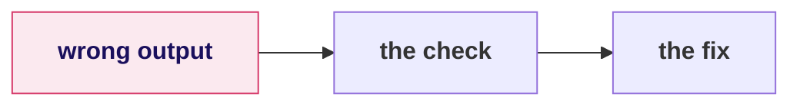
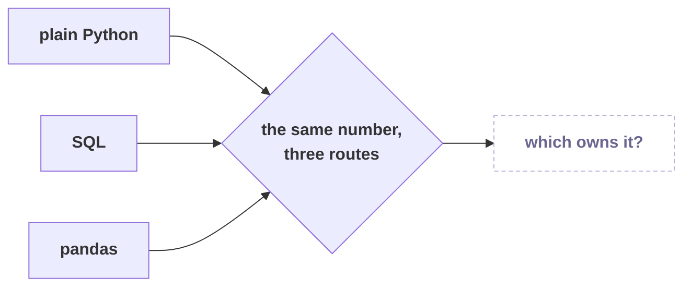
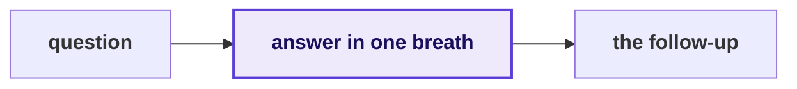
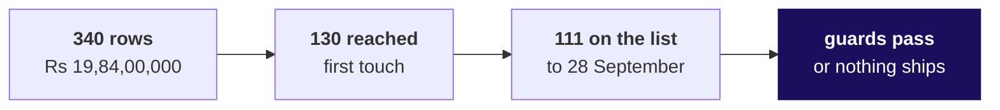
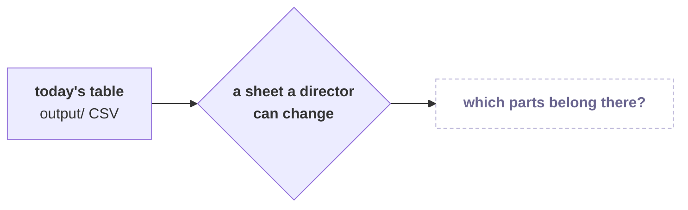

# Will the Monday table rebuild itself and hold?

Week 2, Day 4. Half two.

Kicker: WEEK 2  ·  THURSDAY  ·  HALF TWO
Quote: The warehouse queries are fine for Finance, but Marketing's analysts live in Python. Build them the table in pandas, from the warehouse, and make it refreshable in one run.
Who: The data platform lead, Kalpa Retail

```notes
LIVE, one minute. The morning built the table a chapter at a time: 340 customers, the sale's 130
reached, Retail-Plus down 29.4 percent, three tools agreeing on 107 of 130, and Finance's number
given to SQL. The afternoon makes the table rebuild itself (chapter 6), then the room builds it alone
(the escalated case), then pairs answer Kavya in three tools, then the interview drill and the close.
```

---

## SECTION 6: Will Monday rebuild it?
*Can the table rebuild itself every Monday and refuse to ship when something breaks, before the growth team sends a single code?*

```notes
LIVE. Thirty minutes. Notebook C2_W02_D04_06_monday_refresh is the demonstration.
```

---

## S1. Answering it takes six smaller questions
*Who needs the answer, and what has to be settled on the way?*

**Who needs the answer.** The growth team, who act on Monday's table with no analyst watching the run; a refresh that counts from the wrong day sends win-back codes to customers who bought a few weeks ago.

```timeline
label: 1 | title: Which way runs it? | body: By hand, a report, guards or a view
label: 2 | title: What is it told? | body: Two inputs; the rest read from the data
label: 3 | title: Who is on the 19 October list? | body: Recency, and the date it counts to
label: 4 | title: Which guards fire? | body: Each one made to fire on a broken copy
label: 5 | title: Do two runs agree? | body: The same data on two Mondays
label: 6 | title: Does the warehouse agree? | body: The list counted in SQL | tone: dark
```

```notes
LIVE, 1 minute. The morning's table had last order dates; the refresh turns them into days and
flags, and makes the whole build one call that stops when a check fails.
```

---

## S2. The win-back list goes out with nobody watching
*What does the growth team send from the refresh, and what does a bad Monday cost?*

```stats
value: 60 days | label: the win-back line | note: no order in the 60 days to the as-of date
value: every Monday | label: the refresh | note: one run, no analyst at the desk
value: 1 code each | label: the offer | note: sent to every customer flagged lapsed
```

**The client asks.** "Make it refreshable in one run." The growth team adds: "and we send Monday's codes from whatever it produces."

```notes
LIVE, 2 minutes. Recency is the days since a customer's last order; lapsed means more than 60 days
before the table's as-of date, the last date the data covers. A customer who never ordered is not
lapsed; they are on chapter 1's first-order list. A bad Monday sends a code to someone who bought last
month, or ships a broken table before anyone looks.
```

---

## S3. England's lab refresh dropped 15,841 cases
*Who else ran a daily refresh that dropped rows without an error?*

```stats
value: 15,841 | label: cases left out | note: 25 September to 2 October 2020
value: 65,536 | label: rows per .XLS sheet | note: the old format's limit
value: CSV files | label: fetched automatically | note: from commercial laboratories
```

**What breaks.** A refresh that never counts rows in against rows out loses them without a sound, and a week of decisions rests on the short number.

```notes
LIVE, 2 minutes. Sources, checked 1 Oct 2026: Public Health England's statement of 4 October 2020,
"15,841 cases between 25 September and 2 October were not included in the reported daily COVID-19
cases"; and The Register, 5 October 2020, on the cause: results "automatically fetched in CSV format"
from commercial labs were stored in the older .XLS format "that limited the number of rows to 65,536
per spreadsheet". A row count on every run would have stopped it on day one.
```

---

## S4. One function whose guards stop a bad run
*Which of four ways should run the Monday refresh, and what does each catch?*

| Option | How it runs | When a check fails |
|---|---|---|
| a) Rerun the notebooks by hand | An analyst runs chapters 1 to 5 and reads the numbers | Ships if the analyst misses it |
| b) A function that reports | Prints PASS or FAIL for each check | Ships, with a FAIL beside it |
| c) A function with guards | Every failed check raises an error | Not written; the error says why |
| d) The table as a SQL view | The warehouse builds it when read | Nothing runs to fail |

**The call.** c: of the four failures the day has met, a customer missing, a customer sent twice, spend off the warehouse and a repeated key, only c stops all four before the table ships. What would switch it: readers querying the table from the warehouse, such as a dashboard; then d, with the checks as the warehouse's own tests.

```notes
LIVE, 4 minutes. Ask which option most teams run today: a. Which option costs no analyst time and
still ships a broken table: b and d. The sizing is the count of failures each stops: 0, 0, 4, 0.
```

---

## S5. What must the refresh function be told?
*What does the refresh need to be told, and what can it read from the data itself?*


```mermaid
flowchart LR
    I{"<b>told:</b><br/>?"} --> F["<b>build_table()</b>"]
    D["<b>the data</b><br/>orders, list, feed"] --> F
    F --> T["<b>the table</b>"]
    classDef unknown fill:#FFFFFF,stroke:#B8B2D6,color:#6B6690,stroke-dasharray:4 3
    class I unknown
```

**Question.** As a letter? a) the day to count recency from; b) the warehouse connection and the feed's path; c) the number of customers; d) the total spend.

```notes
LIVE, 2 minutes. Every input is a chance to be told something wrong; the fewer, the better.
```

---

## S6. Answer: the connection and the feed's path
*What does the function read for itself?*

```python
def build_table(engine, feed_path):
    """Chapters 1 and 2 in one call: the list as spine, three numbers, first touch."""
    ...
table, orders_read = build_table(ENG, FEED_PATH)
```

```stats
value: 340 | label: rows | note: read from the customer list
value: Rs 19,84,00,000 | label: spend | note: read from the orders
value: 130 | label: reached | note: read from the feed, first touch
```

```notes
LIVE, 2 minutes. The answer is b. The customers, their numbers and the sale all come from the data,
so the function cannot be told a stale count. Recency is the one column still missing, and it needs a
date to count to.
```

---

## S7. How many does the 19 October refresh list?
*How many customers land on the win-back list when the refresh runs on Monday 19 October?*

```python
RUN_DAY = pd.Timestamp.today()       # on the first Monday refresh: 19 October 2026
recency = (RUN_DAY - table["last_order"]).dt.days
(recency > 60).sum()
```

**Question.** As a letter? a) 111; b) 166; c) 301; d) 55.

```notes
LIVE, 2 minutes. The hurried analyst counts to today so the refresh "stays current". The notebook
pins today to 19 October, the first Monday after this session, so the number is exactly what that
refresh would send.
```

---

## S8. Answer: 166, counted to the wall clock
*What would Monday's send have looked like?*

```stats
value: 166 | label: on the win-back list | note: counted to 19 October
value: 21 days | label: smallest recency | note: the most recent buyer, as the table says
```

**What breaks.** 166 codes go out, and 55 of them reach customers who ordered within 60 days of the data's last date.

```notes
LIVE, 2 minutes. The answer is b. On the class day, 15 October, the same code counts 154; every day
the notebook is run, the list is different.
```

---

## S9. Why it is wrong: 21 days the data never saw
*Why is the list too long, and which check catches it?*


```mermaid
flowchart LR
    L["<b>28 Sep</b><br/>the data's last order"] -->|21 days, no data| R["<b>19 Oct</b><br/>the run day"]
    R --> G["<b>the list grows</b><br/>166, 180, 187"]
    classDef bad fill:#FBE9EF,stroke:#D63A6A,color:#1A0F5C
    class G bad
```

**The check.** Somebody always bought on the data's last day, so the smallest recency in an honest table is 0. Here it is 21, and the list reads 166, 180 and 187 on three Mondays with no new data.

```notes
LIVE, 3 minutes. The warehouse's last order is dated 28 September; nothing after it is loaded.
Counted to the run day, every customer looks 21 days staler, and the table becomes a function of the
calendar.
```

---

## S10. The fix: count to 28 September, 111 remain
*What changes when recency counts to the data's own last date?*

```python
AS_OF = orders_read["order_date"].max()          # 28 September 2026, carried in the table
table = table.assign(as_of=AS_OF, recency_days=(AS_OF - table["last_order"]).dt.days)
table = table.assign(lapsed=table["recency_days"] > 60)
```

```stats
value: 111 | label: on the win-back list | note: Business 5, Core 49, Plus 47, Student 10
value: 55 | label: came off | note: ordered within 60 days of 28 September
value: 0 | label: smallest recency | note: the check passes
```

```notes
LIVE, 3 minutes. Writing as_of into the table lets the growth team see what 60 days was counted
from. At 45 days the honest list is 144, at 90 days 74: the take-home asks which line to sign.
```

---

## S11. Four guards, each against the warehouse
*Which guards stop a bad Monday?*

| Guard | Compared with | Stops |
|---|---|---|
| One row per customer | `customer_id` is unique | a repeated customer |
| Rows equal the list | 340 from `customers` | a customer missing |
| Spend equals the warehouse | Rs 19,84,00,000 from `orders` | spend added or lost |
| Smallest recency is 0 | the as-of date | a count from the wrong day |


```mermaid
flowchart LR
    B["<b>build</b>"] --> G{"<b>four guards</b>"}
    G -->|all pass| W["<b>write the table</b>"]
    G -->|one fails| S["<b>raise, write nothing</b>"]
    classDef bad fill:#FBE9EF,stroke:#D63A6A,color:#1A0F5C
    class S bad
```

```notes
LIVE, 3 minutes. Each guard is compared with a number the warehouse gives on its own, never a number
the notebook computed, which is what makes it a guard.
```

---

## S12. A repeated row: which guards fire?
*Which guards stop a bad Monday, and does each one fire when it should?*

```python
repeated = pd.concat([table, table[table["customer_id"] == "C-0152"]])   # one customer twice
guard_failures(repeated)
```

**Question.** As a letter? a) only the unique-key guard; b) the unique-key and row-count guards; c) the unique-key, row-count and spend guards; d) all four.

```notes
LIVE, 2 minutes. A guard is proved the only way a guard can be: by making it fire.
```

---

## S13. Answer: three fire, and the recency guard holds
*Does every broken copy trip at least one guard, and the honest table none?*

| The table | Guards that fire |
|---|---|
| The honest table | none |
| One customer's row repeated | one row per customer, rows equal the list, spend equals the warehouse |
| Recency counted to the run day | smallest recency is 0 |
| Customers with no orders dropped | rows equal the list |

**What breaks.** Nothing, which is the point: every broken copy trips a guard, and the honest one trips none.

```notes
LIVE, 3 minutes. The answer is c. The repeated customer's recency is the same, so the recency guard
holds. Dropping customers with no orders leaves spend unchanged, since they spend 0, so only the row
count catches it, chapter 1's lesson inside the refresh.
```

---

## S14. Two honest runs give one table
*Do two runs on the same data give the same table?*

```stats
value: 0 | label: cells that differ | note: two honest runs, a week apart
value: 166 then 180 | label: the hurried list | note: counted to each run day
value: 111 and 111 | label: the honest list | note: counted to 28 September
```


```mermaid
flowchart LR
    M1["<b>Monday 1</b><br/>refresh()"] --> E{"<b>equal,<br/>cell for cell?</b>"}
    M2["<b>Monday 2</b><br/>refresh()"] --> E
    E -->|yes| T["<b>trust it</b>"]
    classDef bet fill:#1A0F5C,stroke:#1A0F5C,color:#FFFFFF
    class T bet
```

```notes
LIVE, 2 minutes. Ask the room to predict first: 55, 14, 0 or 111 customers different. Nothing in the
honest refresh reads the calendar, so the answer is 0.
```

---

## S15. A second route: the warehouse counts 111
*Does the warehouse, counting on its own, find the same win-back list?*

```sql
WITH last  AS (SELECT customer_id, max(order_date) AS last_order FROM orders GROUP BY customer_id),
     as_of AS (SELECT max(order_date) AS d FROM orders)
SELECT count(*) AS win_back FROM last, as_of WHERE as_of.d - last.last_order > 60;
```

```stats
value: 111 = 111 | label: the win-back list | note: SQL and the refresh
```

```notes
LIVE, 2 minutes. Subtracting two dates in Postgres gives whole days. The query shares no code with
the refresh. When to switch: the refresh for the table, the query to confirm the list's size before
a send.
```

---

## S16. Chapter 6: 111 on the list, and a run that stops
*What did each smaller question find?*

| Question | The answer |
|---|---|
| Which way runs it? | One function with guards; it alone stops all four failures |
| What is it told? | The connection and the feed's path |
| Who is on the 19 October list? | 166 counted to the run day; 111 counted to 28 September |
| Which guards fire? | Each broken copy trips one or more; the honest table none |
| Do two runs agree? | Cell for cell; the hurried list went 166 then 180 |
| Does the warehouse agree? | Yes: 111 |

**Kavya's review.** The table carries its as-of date, the smallest recency is 0, and a run that fails a guard writes nothing.

**In the interview.** [F] How do you compute recency in a job that runs every week?

```notes
LIVE, 2 minutes. One breath: from the data's last loaded date, carried in the table, never the wall
clock; the check is that the smallest recency is 0. The depth section of notebook 06 mirrors
Wednesday's falling flag in pandas with groupby and shift and checks it against the warehouse. Then
the escalated case.
```

---

## SECTION 7: Can you build it alone?
*Can you build the growth team's whole Monday table alone, with both flags, one view and a guarded run, and post four numbers that hold?*

```notes
LIVE. Fifty minutes, unguided. The brief is exercises/unguided/C2_W02_D04_escalated_case_STUDENT.md
and the notebook notebooks/C2_W02_D04_ex1_escalated_case_STUDENT.ipynb.
```

---

## S17. Answering it alone: five parts, thirteen letters
*What does the escalated case ask, part by part?*

```timeline
label: Part 1 | title: Every customer, three numbers | body: The spine and the aggregates
label: Part 2 | title: The sale, one row each | body: The feed attached, and counted a second way
label: Part 3 | title: The two flags | body: Lapsed, and Wednesday's falling rule in pandas
label: Part 4 | title: One view for a slide | body: Spend by month and segment
label: Part 5 | title: One guarded run | body: Two runs, one table, a CSV for Friday | tone: dark
```

```notes
LIVE, 2 minutes. The notebook stops at __TODO1__ with a NameError by design: replace each
placeholder with the option chosen and run the step's checks. Post thirteen letters and the four
numbers the last cell prints.
```

---

## S18. Two definitions, and the checks to reach
*Which flags does the table carry, and which numbers prove it before it ships?*

| Flag | Its rule |
|---|---|
| Lapsed | No order in the 60 days to the as-of date; a customer who never ordered is not lapsed |
| Falling | Spend lower in August than July and lower again in September, each reading the calendar month after the last, so a month with no order breaks the run |

```stats
value: 340 | label: customers | note: one row each
value: Rs 19,84,00,000 | label: spend | note: ties to the warehouse
value: 130 | label: reached | note: first exposure per customer
```

```notes
SELF-STUDY for anyone who missed the morning. The falling rule is Wednesday's, mirrored in pandas: the
previous reading of the same customer, never another customer's, and a skipped month is no reading.
The win-back count is the fourth number to post, and the notebook's check compares it with the
warehouse.
```

---

## SECTION 8: Where did the room go wrong?
*Which wrong numbers did the room produce in the case, and which check would have caught each one?*

```notes
LIVE. Fifteen minutes. Collect the wrong numbers during the case and put them on the board.
```

---

## S19. Answering it: six wrong outputs, six checks
*Which wrong output came from which step, and which check would have caught it?*

| The wrong output | Where it came from | The check |
|---|---|---|
| 301 rows | the spine taken from the orders | rows against the customer list |
| 0 customers who never ordered | a missing count never equals 0 | fill 0 on purpose, then count |
| More than 340 rows after the merge | the feed's promise taken on trust | `validate="one_to_one"` |
| 154 on the win-back list | recency counted to the class day | the smallest recency is 0 |
| Falling flags on customers who never fell | the previous row read without the customer | `groupby` before `shift` |
| A view short of the warehouse | the pivot's default mean | the grand total against the orders |


```mermaid
flowchart LR
    W["<b>wrong output</b>"] --> C["<b>the check</b>"] --> F["<b>the fix</b>"]
    classDef bad fill:#FBE9EF,stroke:#D63A6A,color:#1A0F5C
    class W bad
```

```notes
LIVE, 8 minutes. For each wrong number on the board, ask the room which check catches it before
naming the fix. 154 is what pd.Timestamp.today() gives on 15 October; next Monday it would be 166.
Do not read any customer ids aloud.
```

---

## S20. The miss most rooms make: the class-day date
*Why is the wall-clock count the one that survives review?*

```stats
value: 154 | label: counted to 15 October | note: the class day
value: 166 | label: counted to 19 October | note: the first Monday refresh
value: 111 | label: counted to 28 September | note: the data's last date
```

**What breaks.** Every run gives a plausible count, so nobody questions it; only the smallest-recency check or a second run on the same data exposes it.

```notes
LIVE, 5 minutes. Three counts for one dataset, depending on the calendar. Ask for the one sentence
to the growth team: the list is 111, counted to 28 September, and it will not grow unless new orders
arrive. Then the break, ten minutes.
```

---

## SECTION 9: Which tool would you sign?
*Did Retail-Plus members order less often in Q2, in plain Python, SQL and pandas, and which tool would you sign for each job?*

```notes
LIVE. Ten-minute break first, then forty minutes in pairs. The brief is
exercises/unguided/C2_W02_D04_second_case_STUDENT.md and the notebook
notebooks/C2_W02_D04_ex2_second_case_STUDENT.ipynb.
```

---

## S21. Answering it in pairs: three tools, one note
*What does Kavya ask the pair for?*

**The client asks.** "You did the tree in plain Python in Week 1, in SQL on Monday. Do it a third way now, and tell me honestly which tool you would pick for which job."

```timeline
label: 1 | title: Plain Python | body: A set per quarter, one row at a time
label: 2 | title: SQL | body: In the warehouse, without Monday's integer division
label: 3 | title: pandas | body: The analyst's bench, members counted once
label: 4 | title: The note | body: One line per tool, the rows each moved, one refusal | tone: dark
```

```notes
LIVE, 2 minutes. The question is Week 1's branch that moved: Retail-Plus orders per member, Q1
against Q2, where a member counts in a quarter if they ordered in it. The room writes the SQL first;
then the trainer runs it through plain Python and pandas and closes the loop.
```

---

## S22. Which tool would you sign for Finance's number?
*The three agree; which one should own a number Finance reruns every Monday?*


```mermaid
flowchart LR
    P["<b>plain Python</b>"] --> N{"<b>the same number,<br/>three routes</b>"}
    S["<b>SQL</b>"] --> N
    D["<b>pandas</b>"] --> N
    N --> O["<b>which owns it?</b>"]
    classDef unknown fill:#FFFFFF,stroke:#B8B2D6,color:#6B6690,stroke-dasharray:4 3
    class O unknown
```

**Question.** As a letter? a) a pandas notebook on the analyst's machine; b) a plain Python loop; c) a SQL query in the warehouse; d) a CSV export refreshed every Monday.

```notes
LIVE, 3 minutes, after the pairs have run all three routes. Letters in chat.
```

---

## S23. Answer: SQL, and pandas reads its answer
*What did the three routes give, and what did each move?*

```stats
value: 2.363 to 1.842 | label: orders per member | note: Q1 215 over 91, Q2 140 over 76
value: 3 of 3 | label: tools agree | note: to three decimal places
value: 355 / 2 / 1,000 | label: rows moved | note: Python, SQL, pandas
```

**What changed.** Retail-Plus members ordered 22 percent less often in Q2, the branch Week 1 found. The note gives Finance's number to SQL, which moves only its answer, and refuses a pandas notebook for it.

```notes
LIVE, 5 minutes. The answer is c. Read two pairs' notes aloud and check each has the rows moved and
a reason for the refusal. A notebook runs on a copy on one machine; an export is a copy that ages
from the moment it is written.
```

---

## SECTION 10: How would you say it aloud?
*How does each of today's interview questions sound when answered aloud, the design question among them?*

```notes
LIVE. Twenty minutes. Two learners per question: one answers, one asks the follow-up.
```

---

## S24. Answering aloud: the row's five
*Which questions does every screen ask about today's work?*

| Tag | The question |
|---|---|
| [S] | Describe groupby in the split-apply-combine sentence. |
| [S] | Merge against join: what is the same and what differs? |
| [F] | Which merge argument raises on duplicate keys, and which error? |
| [F] | Pivot against melt: which widens and which lengthens? |
| [D] | Same question, three tools: how do you choose, and defend one choice? |


```mermaid
flowchart LR
    Q["<b>question</b>"] --> A["<b>answer in one breath</b>"] --> F["<b>the follow-up</b>"]
    classDef known fill:#EEEAFB,stroke:#5B3FD6,color:#1A0F5C,stroke-width:2px
    class A known
```

```notes
LIVE, 10 minutes. Tags: [S] staple asked everywhere, [F] frequent in GCC and product screens, [D]
differentiator. Answers in one breath are in the day sheet; push for a number in every answer.
```

---

## S25. Seven follow-ups, three of them design
*Which case-style follow-ups does an interviewer add?*

| Tag | The follow-up |
|---|---|
| [F] | Your customer table has fewer rows than the customer list. Why, and what do you do? |
| [F] | Your Monday refresh stopped with a MergeError. What do you do? |
| [F] | Your pivot's totals look low. Where do you look first? |
| [F] | What does SQL's GROUP BY do with a NULL key, and pandas' groupby with a missing one? |
| [D] | A dashboard says 100 percent of the customers a campaign reached went on to buy. What do you check first? |
| [D] | Which tool would you refuse for Finance's numbers, and why? |
| [D] | The orders table grows to 5 crore rows. Where do you build the customer table? |

```notes
LIVE, 10 minutes. The design follow-ups want a sizing in the answer: rows moved, who reruns it, and
the fact that would switch the choice.
```

---

## SECTION 11: What goes to the growth team?
*What does the growth team hear, which lines are worth keeping, and what does Friday ask?*

```notes
LIVE. Fifteen minutes: the Kahoot first, eight items including Wednesday's return question, then this
chapter.
```

---

## S26. Answer: the table is ready, and it holds
*What does the growth team hear, and with which caveat?*

> "The Monday table is ready: 340 customers, one row each, with spend that ties to the warehouse at Rs 19,84,00,000, the 130 customers the monsoon sale reached, and a win-back list of 111 counted to 28 September. It rebuilds itself every Monday and will not ship if a guard fails, and Finance's revenue stays in the warehouse as a query the table reconciles with every week." The GCC data and AI team

**The caveat.** The table records whom the sale reached; whether the sale changed what they spent is a separate test, and Week 1 Thursday found the reached were buying anyway.


```mermaid
flowchart LR
    R["<b>340 rows</b><br/>Rs 19,84,00,000"] --> E["<b>130 reached</b><br/>first touch"] --> W["<b>111 on the list</b><br/>to 28 September"] --> G["<b>guards pass</b><br/>or nothing ships"]
    classDef bet fill:#1A0F5C,stroke:#1A0F5C,color:#FFFFFF
    class G bet
```

```notes
LIVE, 2 minutes. Read it aloud once. Every number in it was checked twice today.
```

---

## S27. Five lines worth keeping
*Which rules does the cheat sheet print word for word?*

| | The line |
|---|---|
| 1 | Start a customer table from the customer list, because a table built from orders leaves out everyone who never ordered: 39 of Kalpa's 340. |
| 2 | Write `how=` and `validate=` on every merge, because one repeated key adds a customer's whole spend again and `validate` stops the merge before the table exists. |
| 3 | Write `aggfunc=` on every pivot and check its grand total against the source, because `pivot_table` averages by default and turned a 29 percent fall into 18. |
| 4 | Two tools agree only when they share one definition, so give each recurring number one owner, chosen by who reruns it and sized by the rows each route moves. |
| 5 | Count recency to the data's own last date and let the refresh refuse a table that fails a guard, because the wall clock put 166 customers on a list that holds 111. |

```notes
LIVE, 3 minutes. Ask a learner to read each line and give the number behind it.
```

---

## S28. Tomorrow's question, left open
*Which parts of this week belong in a sheet a director can change, and which must never be there?*

> "Monday's growth review deck needs three things I can open on my laptop without a login: the revenue tree by segment for both quarters, the top-fifty protect list with a lookup so I can find any member by id, and one number on the front page with its trend. Nothing that needs Python. If a director changes an assumption in the room, the sheet must recalculate in front of them." Meera's chief of staff


```mermaid
flowchart LR
    T["<b>today's table</b><br/>output/ CSV"] --> X{"<b>a sheet a director<br/>can change</b>"}
    X --> Q["<b>which parts belong there?</b>"]
    classDef unknown fill:#FFFFFF,stroke:#B8B2D6,color:#6B6690,stroke-dasharray:4 3
    class Q unknown
```

```notes
LIVE, 2 minutes. Read it and leave it open; do not answer. Tonight: bring the CSV the refresh wrote
to output/, with 340 rows and Rs 19,84,00,000 of spend, and read the pre-read.
```
