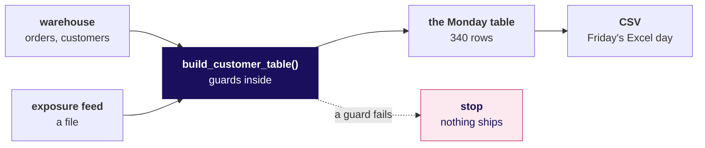
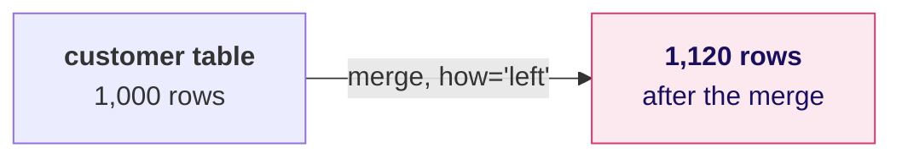
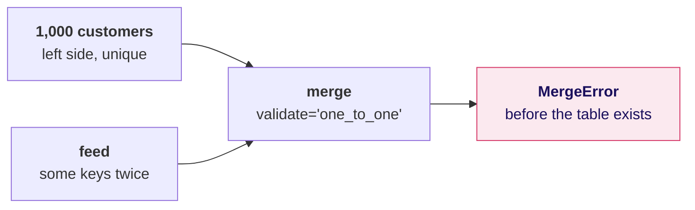
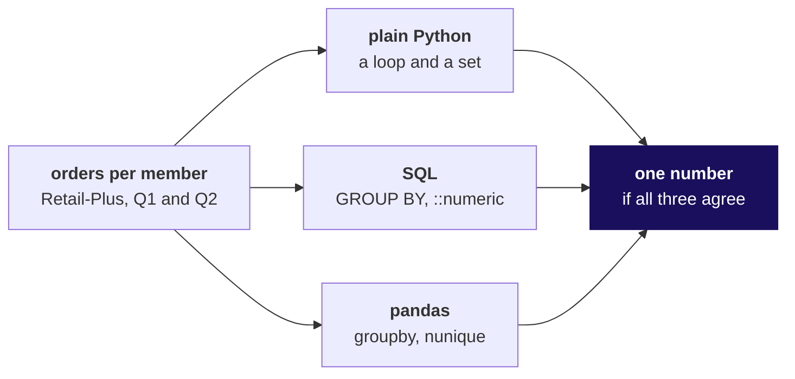
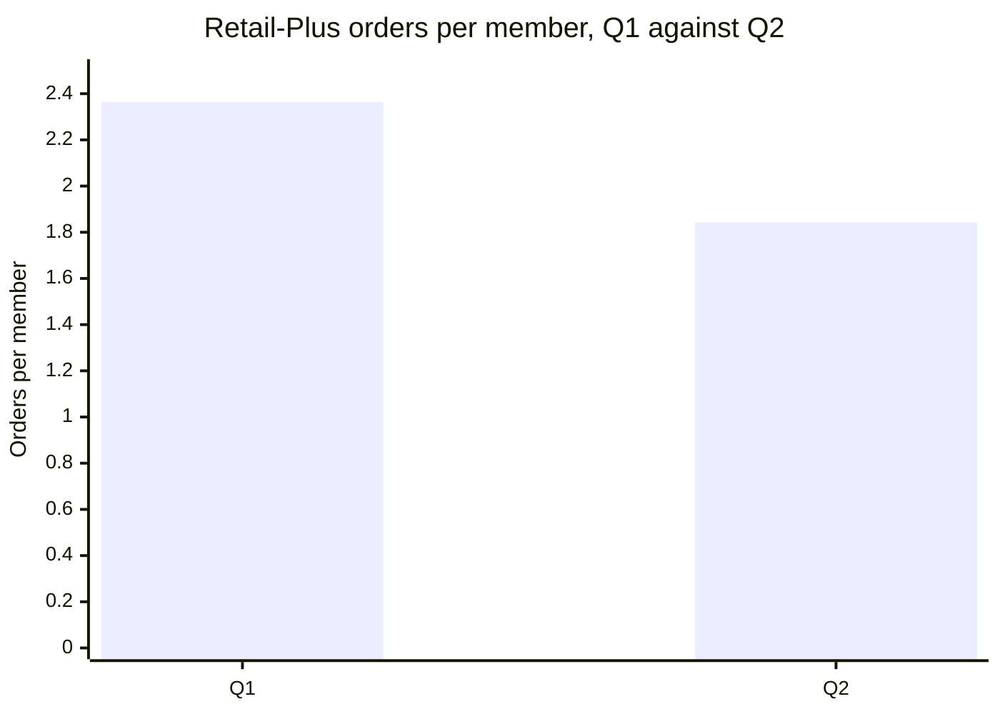
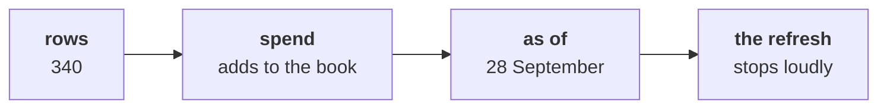

# The Monday table, and the honest tool choice

Week 2, Day 4. Half two.

Kicker: WEEK 2  ·  THURSDAY  ·  HALF TWO
Quote: You did the tree in plain Python in Week 1, in SQL on Monday. Do it a third way now, and tell me honestly which tool you would pick for which job.
Who: Kavya Nair, senior analyst, Kalpa Retail data team

```notes
LIVE, one minute. Kavya's challenge frames the whole afternoon: the escalated case builds the
table the growth team asked for, and the second case answers her in writing.
```

---

## SECTION 1: The escalated case
*The whole Monday table, unguided, with every check from the morning built in.*

```notes
LIVE, 60 minutes, unguided. Brief: exercises/unguided/C2_W02_D04_escalated_STUDENT.md;
notebook: notebooks/C2_W02_D04_hands_on_STUDENT.ipynb. Hold the solution until the debrief.
```

---

## S1. The growth team's table, end to end
*Five parts, each one a morning round made harder, and one run that rebuilds it all.*

**The client asks.** "One table, one row per customer, refreshed every Monday: how recently, how often, how much, the segment, whether the monsoon sale reached them, and the flags. And one view of it by month we can put on a slide."

```timeline
label: Part 1 | title: The spine | body: 340 customers, recency from the data's last date.
label: Part 2 | title: The exposure | body: First touch per customer, merged with validate.
label: Part 3 | title: The flags | body: Lapsed at 60 days; falling twice in Q2, beside Wednesday's LAG.
label: Part 4 | title: The view | body: Spend by month and segment, aggfunc stated.
label: Part 5 | title: The refresh | body: One function, two runs, the same table. | tone: dark
```

```notes
LIVE, 3 minutes. Walk the five parts, then start the clock. The letters and four numbers are
what learners post at the end.
```

---

## S2. The refresh, drawn as one call
*Everything the morning did, inside one function with its guards.*


```mermaid
flowchart LR
    W["<b>warehouse</b><br/>orders, customers"] --> F["<b>build_customer_table()</b><br/>guards inside"]
    X["<b>exposure feed</b><br/>a file"] --> F
    F --> T["<b>the Monday table</b><br/>340 rows"]
    F -.->|"a guard fails"| S["<b>stop</b><br/>nothing ships"]
    T --> C["<b>CSV</b><br/>Friday's Excel day"]
    classDef bet fill:#1A0F5C,stroke:#1A0F5C,color:#FFFFFF
    classDef bad fill:#FBE9EF,stroke:#D63A6A,color:#1A0F5C
    class F bet
    class S bad
```

**The rule.** A refresh that cannot fail loudly will one day ship a wrong table quietly.

```notes
LIVE, 2 minutes. The guards are the morning's checks: one row per customer, spend equal to the
book. The CSV is what learners bring to Friday.
```

---

## S3. The four numbers the table has to show
*The self-check every learner reaches before posting the letters.*

```stats
value: 340 | label: customers | note: one row each
value: Rs 19.84 cr | label: spend | note: adds to the book
value: 130 | label: reached | note: first exposure per customer
value: 111 | label: win-back list | note: as of 28 September
```

```notes
LIVE, 1 minute on screen at the start, then leave it up. A learner whose numbers differ has one
of the morning's traps in their table, and the debrief names which.
```

---

## SECTION 2: The debrief
*The room's wrong answers, each traced to the default that produced it.*

```notes
LIVE, 15 minutes. Collect wrong numbers during the case and replay them here, anonymously.
Every wrong number the room produced maps to one row of the next slide.
```

---

## S4. Four defaults, four wrong numbers
*Each trap this week was a default nobody wrote down.*

| The wrong number | The default behind it | The check that catches it |
|---|---|---|
| 166 on the win-back list | recency from the wall clock | smallest recency is 0 |
| reach 107, conversion 100 percent | `groupby(dropna=True)` | groups add back to rows |
| spend too big after the merge | `merge(validate=None)` | rows in equal rows out |
| Retail-Plus down 18 percent | `pivot_table(aggfunc="mean")` | grand total equals the source |

```notes
LIVE, 6 minutes. For each row ask a learner who produced it to say which check would have
caught it. Keep it about the default, never the person.
```

---

## S5. Question: 1,000 customers in, 1,120 rows out?
*A different team's customer table, a campaign feed merged onto it on Monday.*


```mermaid
flowchart LR
    A["<b>customer table</b><br/>1,000 rows"] -->|"merge, how='left'"| B["<b>1,120 rows</b><br/>after the merge"]
    classDef bad fill:#FBE9EF,stroke:#D63A6A,color:#1A0F5C
    class B bad
```

**Question.** What happened, and which argument would have caught it? a) 120 new customers arrived, and nothing needs catching; b) the feed repeats some customer keys, and validate="one_to_one" raises; c) the left merge adds the feed's unmatched rows, and how="inner" fixes it; d) pandas duplicated rows at random, and drop_duplicates() fixes it.

```notes
LIVE, 3 minutes. This is Friday's Kahoot return question, asked a day early. Letters first.
```

---

## S6. Answer: repeated keys, and validate catches them
*A left merge never adds customers; it multiplies the rows of customers whose key repeats.*


```mermaid
flowchart LR
    A["<b>1,000 customers</b><br/>left side, unique"] --> M["<b>merge</b><br/>validate='one_to_one'"]
    F["<b>feed</b><br/>some keys twice"] --> M
    M --> E["<b>MergeError</b><br/>before the table exists"]
    classDef bad fill:#FBE9EF,stroke:#D63A6A,color:#1A0F5C
    class E bad
```

The answer is b. Option c confuses left with outer: a left merge keeps the left table's keys and never adds unmatched right rows.

```notes
LIVE, 3 minutes. Up to 120 extra rows, one per repeated feed row. The fix is a business rule
first, then validate stays on.
```

---

## SECTION 3: The second case
*One question in three tools, and a written answer to Kavya about which tool does which job.*

```notes
LIVE, 45 minutes in pairs. Brief: exercises/guided/C2_W02_D04_three_tools_STUDENT.md;
notebook: notebooks/C2_W02_D04_three_tools_STUDENT.ipynb; the five asks:
exercises/unguided/C2_W02_D04_pick_tool_STUDENT.md. The room tries the SQL version first; the
trainer then runs it through Python and closes the loop.
```

---

## S7. The node that moved, asked a third time
*Retail-Plus orders per member, Q1 against Q2: Week 1 in Python, Monday in SQL, now pandas.*


```mermaid
flowchart LR
    Q["<b>orders per member</b><br/>Retail-Plus, Q1 and Q2"] --> P["<b>plain Python</b><br/>a loop and a set"]
    Q --> S["<b>SQL</b><br/>GROUP BY, ::numeric"]
    Q --> D["<b>pandas</b><br/>groupby, nunique"]
    P --> A["<b>one number</b><br/>if all three agree"]
    S --> A
    D --> A
    classDef bet fill:#1A0F5C,stroke:#1A0F5C,color:#FFFFFF
    class A bet
```

```notes
LIVE, 3 minutes. The question is fixed so the comparison is about the tools. If the three
disagree, one of them has a trap in it, and finding which is the exercise.
```

---

## S8. Plain Python: every step visible
*The accumulator from Week 1, with a set for the members so each counts once.*

```python
orders_n, seen = {"Q1": 0, "Q2": 0}, {"Q1": set(), "Q2": set()}
for r in rows:
    orders_n[r["quarter"]] += 1
    seen[r["quarter"]].add(r["customer_id"])
{q: orders_n[q] / len(seen[q]) for q in ("Q1", "Q2")}
```

**The rule.** Plain Python is the tool you choose when a reader must follow every step, and the one that grows slowest when the question changes.

```notes
LIVE, 4 minutes. A list instead of a set counts a member once per order and gives 1.000. Let
the room find that if a pair tries it.
```

---

## S9. SQL: where the data lives
*The same number as a statement the warehouse runs and Finance can rerun.*

```sql
SELECT o.quarter, count(*) AS orders,
       count(DISTINCT o.customer_id) AS members,
       round(count(*)::numeric / count(DISTINCT o.customer_id), 3) AS per_member
FROM orders o JOIN customers c ON c.customer_id = o.customer_id
WHERE c.segment = 'Retail-Plus'
GROUP BY o.quarter ORDER BY o.quarter;
```

```notes
LIVE, 8 minutes. The room writes this first, before the trainer shows it. Watch for Monday's
integer-division trap: without ::numeric Postgres returns 2 and 1.
```

---

## S10. pandas: the analyst's bench
*One chain, and the same aggregation named as it would be in SQL.*

```python
(df[df["segment"] == "Retail-Plus"]
   .groupby("quarter")
   .agg(orders=("order_id", "count"), members=("customer_id", "nunique")))
```

**The rule.** `count` counts rows and `nunique` counts distinct values; members are distinct, orders are rows.

```notes
LIVE, 4 minutes. members=("customer_id", "count") gives the order count again, and the rate
reads 1.000. The same mistake as the list in plain Python, in a new tool.
```

---

## S11. Three tools, one number: 2.363 to 1.842
*Retail-Plus members ordered 22 percent less often in Q2, and every tool says so.*


```mermaid
xychart-beta
    title "Retail-Plus orders per member, Q1 against Q2"
    x-axis ["Q1", "Q2"]
    y-axis "Orders per member" 0 --> 2.5
    bar [2.363, 1.842]
```

Q1 is 215 orders over 91 members; Q2 is 140 orders over 76 members.

```notes
LIVE, 3 minutes. The number is Week 1's frequency lever, now read from the full warehouse. The
agreement is the point: the choice between tools is never about the answer.
```

---

## S12. Question: which tool would you refuse?
*Finance's Monday revenue number, the one Anand's analyst audits.*

```cards
icon: book-open | eyebrow: a) | title: Plain Python | body: A script with a loop on a laptop.
icon: database | eyebrow: b) | title: A SQL view | body: Defined in the warehouse, rerun by anyone.
icon: table | eyebrow: c) | title: A pandas notebook | body: The analyst's bench, run by hand.
icon: sheet | eyebrow: d) | title: A spreadsheet | body: Exported every Monday and edited.
```

**Question.** Where should Finance's Monday number be computed, and which of the others would you refuse outright? a) plain Python, refusing SQL; b) a SQL view, refusing the spreadsheet; c) pandas, refusing SQL; d) the spreadsheet, refusing plain Python.

```notes
LIVE, 3 minutes. Pairs argue for two minutes, then letters.
```

---

## S13. Answer: a SQL view, and never a hand-edited copy
*The number Finance audits lives where Finance can rerun it.*

| Tool | For Finance's number | Why |
|---|---|---|
| SQL view | yes | runs where the data lives, anyone can rerun and audit it |
| pandas notebook | no, it iterates | a copy on one laptop, rerun by hand |
| plain Python | no, it explains | a copy, and slow to change |
| hand-edited sheet | refuse | a typed-over cell has no audit trail |

The answer is b. Friday takes the refusal further: the sheet presents the number; it never computes the source of truth.

```notes
LIVE, 3 minutes. Push on c: pandas is not wrong for Finance's analysis, it is wrong as the
place the official number is born.
```

---

## S14. The tool-choice note, one sentence per tool
*The written answer to Kavya, in the format the second case brief asks for.*

```cards
icon: book-open | eyebrow: Plain Python | title: To explain | body: A one-off a reader must follow line by line, or a teaching example.
icon: database | eyebrow: SQL | title: To own | body: Anything the warehouse should own and Finance should audit, refreshed on a schedule. | tone: dark
icon: flask-conical | eyebrow: pandas | title: To iterate | body: The analyst's work in between: reshaping, merging a file, trying five cuts in an hour.
```

**Kavya's review.** "A choice with a reason per tool, and one refusal you can defend. That is the note."

```notes
LIVE, 5 minutes. Each pair reads one sentence aloud. Accept any tool for any job when the reason
names who must trust, rerun or audit the number.
```

---

## SECTION 4: The interview drill
*Twelve questions answered aloud, the row's five and the follow-ups a screen adds.*

```notes
LIVE, 30 minutes. Random call-outs, about two minutes per question with the follow-up. The
answers in one breath are in the day sheet; the full answers are in the study notes.
```

---

## S15. The row's five questions
*The questions this day equips you to answer, tagged as the programme tags them.*

| Tag | Question |
|---|---|
| [S] | groupby in the split-apply-combine sentence |
| [S] | merge against join: what is the same and what differs? |
| [F] | Which merge argument raises on duplicate keys, and which error? |
| [F] | pivot against melt: which widens and which lengthens? |
| [D] | Same question, three tools: how do you choose, and defend one choice? |

```notes
LIVE, 12 minutes. Two learners per question: one answers, one adds the follow-up the
interviewer would ask next.
```

---

## S16. The follow-ups a screen adds
*Case-style questions built on today's traps.*

| Tag | Question |
|---|---|
| [F] | Your customer table has fewer rows than the customer list. Why, and what do you do? |
| [F] | Your Monday refresh raised MergeError. What do you do next? |
| [F] | In a weekly job, recency is measured from what date? |
| [F] | Your pivot's totals look low. Where do you look first? |
| [D] | A campaign's reached customers converted at 100 percent. What do you check? |
| [S] | agg against transform: what comes back from each? |
| [D] | Which tool would you refuse for Finance's numbers, and why? |

```notes
LIVE, 15 minutes. These are the morning's traps asked as an interviewer asks them. A strong
answer names the default, the check and the fix, in that order.
```

---

## S17. A differentiator answer, built in three moves
*Same question, three tools: the structure that makes it land.*

```timeline
label: Move 1 | title: The answer agrees | body: Three tools gave 2.363 and 1.842, so the choice is not about correctness.
label: Move 2 | title: Who must trust it | body: Finance audits, Marketing iterates, a reviewer follows line by line.
label: Move 3 | title: One choice defended | body: SQL for Finance's number, because it runs where the data lives and anyone can rerun it. | tone: dark
```

**In the interview.** [D] Same question, three tools: how do you choose, and defend one choice?

```notes
LIVE, 3 minutes. Model it once aloud in under a minute. The interviewer is listening for the
reason naming a person and a risk, not a feature list.
```

---

## SECTION 5: Close
*The sentence to the growth team, the lines worth keeping, and Friday's question left open.*

```notes
LIVE, 20 minutes: the sentence and crux (5), the Kahoot (12), tomorrow's ask (3).
```

---

## S18. The sentence to the growth team
*What goes in the message when the table ships on Monday.*

> "The customer table has 340 rows, one per customer, as of 28 September, the data's last date. Spend adds to Monday's book of Rs 19,84,00,000. The monsoon sale reached 130 customers, first exposure counted once, and 107 of them bought. 111 customers are on the 60-day win-back list. The refresh stops if the feed repeats a customer."


```mermaid
flowchart LR
    A["<b>rows</b><br/>340"] --> B["<b>spend</b><br/>adds to the book"] --> C["<b>as of</b><br/>28 September"] --> D["<b>the refresh</b><br/>stops loudly"]
```

```notes
LIVE, 2 minutes. Read it aloud. Every number carries its definition; that is the Week 1 habit
still at work.
```

---

## S19. The lines worth keeping
*The same lines close the cheat sheet and the study notes.*

| The line |
|---|
| groupby is the accumulator automated: split, apply, combine. |
| Start from the customer list; groupby only knows the keys it sees. |
| Measure recency from the data's last date, never from today. |
| A merge is a join, and validate= turns the fan-out into a MergeError. |
| pivot_table averages unless you write aggfunc. |
| SQL for what Finance audits, pandas for the analyst's bench, plain Python to explain. |

```notes
LIVE, 3 minutes. Have the room read them aloud once. The cheat sheet prints them word for word.
```

---

## S20. Tomorrow: the number reaches the leadership deck
*Meera's office runs on Excel, and a director will change an assumption in the room.*

**The client asks.** "Monday's growth review deck needs three things I can open on my laptop without a login: the revenue tree by segment for both quarters, the top-fifty protect list with a lookup, and one number on the front page with its trend. Nothing that needs Python." Meera Raghavan's chief of staff

```cards
icon: file-spreadsheet | eyebrow: Bring | title: Today's CSV | body: The customer table from the escalated case's output folder.
icon: circle-help | eyebrow: Think about | title: Where Excel ends | body: Which of this week's steps must never happen in a sheet?
```

```notes
LIVE, 3 minutes after the Kahoot. Leave the question open; Friday answers it.
```
