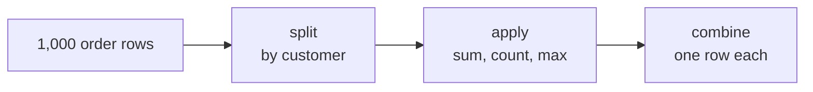
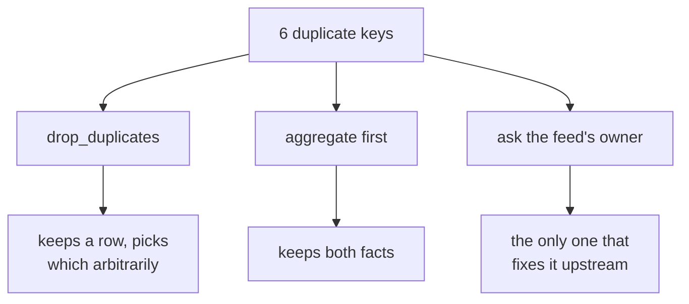

# Study notes: Thursday, one table and an honest answer about tools

## The situation you were in

The growth team wanted one thing, weekly:

> "One table, one row per customer, refreshed on Monday. How recently they bought, how often, how
> much, their segment, whether the monsoon sale reached them, and last week's flags."

Not a report. A table other people build on, which is a different kind of deliverable and carries
a different kind of obligation.

The platform lead said where: pandas, from the warehouse, refreshable in one run, because
Marketing's analysts live in Python and Finance's numbers stay in SQL.

And a senior analyst asked the question the week had been building to: same tree, three tools now,
tell me honestly which you would pick for which job. That answer, in writing, was the day's real
deliverable.

## groupby is the Week 1 accumulator, automated

```python
# Week 1
totals = {}
for o in orders:
    totals[o["customer_id"]] = totals.get(o["customer_id"], 0) + o["amount"]
```



Week 1 wrote the splitting and the combining by hand. `groupby` does both and leaves you the
applying, which was the only part that was ever about your question.

## Name every aggregation

```python
table = orders.groupby("customer_id").agg(
    frequency=("order_id", "count"),
    monetary=("amount", "sum"),
    last_order=("order_date", "max"),
).reset_index()
```

`orders.groupby("customer_id").sum()` also runs. It sums every numeric column, including ones
nobody meant to add up, and names them after the inputs. Six months later nobody can tell whether
a column was chosen or inherited.

The named form is longer to type and shorter to audit, and that trade is worth making every time.

## State the reference date

```python
AS_OF = pd.Timestamp("2026-09-30")
table["recency_days"] = (AS_OF - pd.to_datetime(table["last_order"])).dt.days
```

Counting from `Timestamp.now()` makes the table change meaning every time it is rebuilt, so two
people running the same code on two days get different recency and neither is wrong. State the
date and the table means the same thing whenever it runs.

## The merge that refuses

340 customers went in. 346 rows came out. Six extra rows, from a feed where the same customer
appears twice. Tuesday's fan-out, in Python, with a different spelling.

```python
table.merge(exposure, on="customer_id", how="left", validate="one_to_one")
```

```
pandas.errors.MergeError: Merge keys are not unique in right dataset;
not a one-to-one merge
Duplicates in right:
 customer_id
     C-0001
     C-0002 ...
```

Tuesday you took the row count yourself and compared it. `validate=` makes the library take it for
you and refuse to continue. The check has not changed. What changed is that forgetting it is now
impossible rather than merely unwise.

| `validate=` | Promises |
|---|---|
| `one_to_one` | Keys unique on both sides |
| `one_to_many` | Keys unique on the left |
| `many_to_one` | Keys unique on the right |
| `many_to_many` | Nothing, and says so out loud |

Each value is a claim about the data, so choosing one forces you to say what you believe before
the data disagrees with you.

## Fixing a failure is a decision, not a keyword



Aggregating first is what the day used, because it keeps both exposure events rather than
discarding one at random. Asking the feed's owner is the only option that stops it happening
again, and it is the one nobody has time for.

## A reshape changes the question a table answers

```python
wide = monthly.pivot_table(index="customer_id", columns="month",
                           values="spend", aggfunc="sum")
long = wide.reset_index().melt(id_vars="customer_id")
```

| Shape | One row is | The easy question |
|---|---|---|
| Long | A customer-month | How did this move |
| Wide | A customer | How do these compare |

Nothing is added or removed. The shape decides which question is easy to ask.

Two things worth carrying out of this. The NaNs in a widened frame are information: a gap means no
order that month, which is different from a zero you put there, and `fillna(0)` erases the
distinction. And the round trip is not the identity: melting a pivot gives more rows than you
started with, because every empty cell became a row.

## The wrong index runs perfectly and means nothing

Index by `order_id` instead of `customer_id` and you get one row per order with a column per
month, almost all of them empty. It runs, it produces a table, the table is meaningless.

Read the row labels aloud before reading any value. "Each row is one order" is the moment it
becomes obvious, and no amount of checking the totals would have found it.

The habit generalises: a table's index is a claim about what one row means, and it is the first
thing to check rather than the last.

## The same question, three tools

```python
# Week 1
totals = {}
for o in orders:
    totals[o["segment"]] = totals.get(o["segment"], 0) + o["amount"]
```
```sql
-- Monday
SELECT segment, sum(amount) FROM orders JOIN customers USING (customer_id) GROUP BY segment;
```
```python
# Today
orders.groupby("segment")["amount"].sum()
```

All three are correct and they are not interchangeable. Which is shortest is obvious and mostly
irrelevant.

Three questions pick the tool nearly every time, and none of them is about syntax:

```
Who owns this number?
For how long?
Who has to be able to read it?
```

| Tool | Owns | Never |
|---|---|---|
| The warehouse | Numbers Finance acts on, on a schedule | Exploration, since iteration is slow |
| pandas | The analyst's own iteration, feature building, the weekly table | The source of truth |
| Plain Python | Anything you must explain line by line to a room | Anything at scale |

## The one to refuse

Finance's Monday number does not belong in a notebook.

The objection is not to pandas. A notebook has no audit trail a controller can read, no
guarantee it was run against current data, and a cell somebody edited at 4 pm looks identical to
one nobody touched.

Notice that the same tool was correct for the afternoon prototype and refused for the quarter-end
number, on the same three questions. The tool is not good or bad; the answers changed.

## Check yourself without writing anything

1. Split, apply, combine. Which two does `groupby` do for you, and which one is left?
2. Why the named `agg` form rather than `.sum()`, in one sentence about six months from now?
3. Your merge returned 346 rows from 340. What argument would have stopped it, and what error?
4. `validate="many_to_one"` fails on your data. What have you just learned about which table?
5. Pivot then melt. Why is the result longer than the frame you started with?
6. Finance asks for a quarter-end number from your notebook. Write the refusal in one sentence
   that does not mention pandas.

Five and six are the ones worth saying aloud to somebody else.

## Reading

- pandas, "10 minutes to pandas", run cell by cell:
  <https://pandas.pydata.org/docs/user_guide/10min.html> (verified 13 Sep 2026)
- pandas user guide, the Group by and Merging sections:
  <https://pandas.pydata.org/docs/user_guide/index.html> (verified 13 Sep 2026)
- Corey Schafer, "Python Pandas Tutorial Part 8, Grouping and Aggregating":
  <https://www.youtube.com/watch?v=txMdrV1Ut64> (verified 13 Sep 2026)

The Codespace runs pandas 3.0.5, which the current docs cover. Older tutorials show idioms that
have been removed, so prefer the official guide when they disagree.

## What tomorrow does to today

Meera's office runs on Excel, and the chief of staff wants three things that open on a laptop with
no login and recalculate when a director changes an assumption in the room.

Today's customer table is tomorrow's input, and tomorrow's first lesson is what happens when a
pivot is built on the wrong export.
