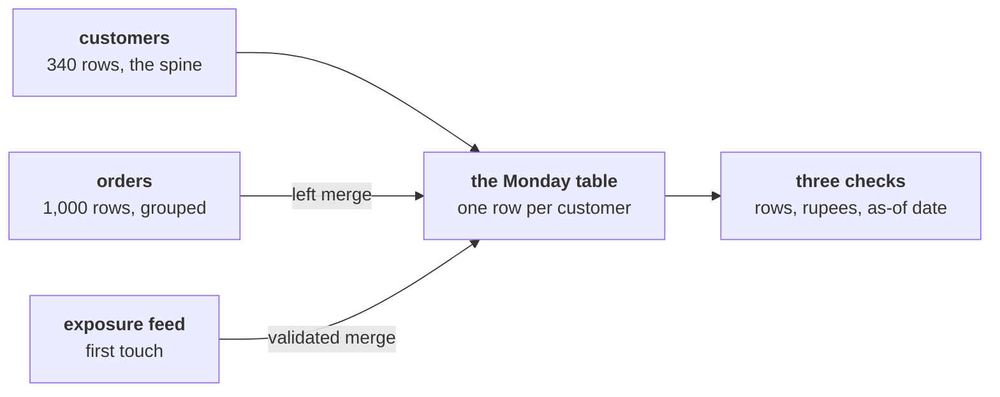

# The customer table Marketing refreshes every Monday

Week 2, Thursday. Study notes, to read after the session.

> "The warehouse queries are fine for Finance, but Marketing's analysts live in Python. Build them
> the table in pandas, from the warehouse, and make it refreshable in one run." The data platform
> lead, Kalpa Retail

## What you can now do

- Read a warehouse table into pandas with `read_sql` and prove the count matches the source.
- Build one row per customer with `groupby` and named aggregations, starting from the customer list
  so nobody goes missing.
- Measure recency from the data's last date and write that date into the table.
- Merge a second source with `validate=`, so a repeated key stops the refresh instead of inflating
  spend.
- Catch `groupby` dropping a missing key, and decide where the key should come from.
- Reshape with `pivot_table` and `melt`, stating `aggfunc`, and check a pivot's grand total.
- Answer the same question in plain Python, SQL and pandas, and defend which tool owns which job.

## Where this sits

Week 1 built the revenue tree by hand: an accumulator in a loop, a dictionary per customer, a rate
with its denominator. Monday rebuilt the tree as SQL the warehouse runs. Tuesday met the join that
doubled collected revenue, and Wednesday ranked members and flagged falling spend with window
functions. Today every one of those moves came back in pandas, the tool Marketing's analysts use
all week. Friday takes the table you built into Excel, where the leadership deck lives, and asks
where Excel must stop. Week 4's cohorts and baskets run on this table, and Week 5's first model
trains on a version of it.

| The move | Week 1, plain Python | This week, SQL | Today, pandas |
|---|---|---|---|
| total per customer | a dictionary, start, update, finish | `GROUP BY customer_id` | `groupby("customer_id").agg(...)` |
| attach a second source | a lookup inside the loop | `LEFT JOIN ... ON` | `merge(how="left", validate=...)` |
| the previous month | a variable carried across the loop | `LAG() OVER (PARTITION BY ...)` | `groupby(...).shift(1)` |
| a window total | a second pass over the list | `sum() OVER (PARTITION BY ...)` | `groupby(...).transform("sum")` |

## The picture to remember: a spine and three attachments


```mermaid
flowchart LR
    C["<b>customers</b><br/>340 rows, the spine"] --> T["<b>the Monday table</b><br/>one row per customer"]
    O["<b>orders</b><br/>1,000 rows, grouped"] -->|"left merge"| T
    E["<b>exposure feed</b><br/>first touch"] -->|"validated merge"| T
    T --> K["<b>three checks</b><br/>rows, rupees, as-of date"]
```

The customer list is the spine because it is the only source that holds every customer. Everything
else is attached to it by `customer_id`, and three checks run before the table leaves the team: the
row count against the customer list (340), the spend against Monday's book (Rs 19,84,00,000), and
the date every recency was measured from (28 September 2026, the last order loaded).

## Round 1, worked: one row per customer

**The question.** How recently, how often and how much, for every customer, in one table?

**The move.** `pd.read_sql` runs a query in Postgres and returns a DataFrame. The first thing to do
with it is the count Monday's first query gave: 1,000 orders. pandas 3 reads text columns as its
own `str` dtype, where older versions and older tutorials say `object`, and reads `numeric(12,2)` as
`float64`. `parse_dates=["order_date"]` makes the date a real date, so it can be subtracted later.

Then the Week 1 accumulator, automated:

```python
rfm = (orders.groupby("customer_id")
             .agg(last_order=("order_date", "max"),
                  frequency=("order_id", "count"),
                  monetary=("amount", "sum"))
             .reset_index())
```

Each keyword is the output column's name, each tuple is (source column, function). It is the SQL
`SELECT customer_id, max(order_date) AS last_order, count(*) AS frequency, sum(amount) AS monetary
... GROUP BY customer_id`, written as a chain.

**The first surprise.** The result has 301 rows, where the warehouse holds 340 customers. `groupby`
can only make a group for a key it sees in the rows it is given, and 39 customers never placed an
order, so the order rows never mention them. The loop in Week 1 had the same blind spot. The fix is
to start from the customer list and attach the aggregates:

```python
table = customers.merge(rfm, on="customer_id", how="left", validate="one_to_one")
```

**The quiet one.** After that merge, `frequency` reads `float64`. The 39 customers got `NaN`, and a
column holding `NaN` cannot stay an integer, so pandas changed the dtype without a word. The fix
states what missing means in this business: no orders is a frequency of 0 and spend of 0, so
`fillna(0)` and then `astype("int64")`. Recency stays missing for those 39, because there is no last
order to measure from.

**The trap: recency measured from today.** The growth team's first use of the table is a win-back
list: every customer with no order in 60 days gets a discount code. The obvious line measures
recency from `pd.Timestamp.today()`. On the first Monday refresh, 19 October 2026, that gives a
win-back list of **166 customers**, and the smallest recency in the table is 21 days.

*Why it is wrong.* The warehouse's last order is dated 28 September. Nothing after it has been
loaded, so every customer looks 21 days staler than the data says. Customers who bought a fortnight
before the extract closed would be sent a discount, and the next Monday the list would grow again
with no new data at all, which makes the table a function of the calendar.

*The check.* Somebody bought on the data's last day, so the smallest honest recency is 0. A table
whose smallest recency is 21 was measured from the wrong date.

*The fix and what changed.* `AS_OF = orders["order_date"].max()`, recency measured from it, and
the date written into the table as a column. The win-back list is **111 customers**, so 55 active
customers stop receiving a discount they did not need. At a 90-day threshold the honest list is 74
and the run-day list 101: a stricter threshold shrinks the list and keeps the error, because the
shift is the same 21 days whatever the threshold.

> **Kavya's review.** "The table now carries its as-of date, and the smallest recency is 0, which is
> the check I will run every Monday. Tell Marketing the list is 111 and why it is not 166, in one
> sentence, before they ask."

## Round 2, worked: the exposure merge

**The question.** Which customers did August's monsoon sale reach, and how many of them bought? The
marketing lead wants it per segment before asking for the same budget in November.

**A merge is a join.** pandas' `merge` comes in the four shapes Tuesday's joins did, with one trap
in the defaults: `merge` with no `how` is an inner join, which silently drops every customer the
sale did not reach, and the unreached are exactly the comparison group Marketing needs. Write `how=`
every time.

| SQL | pandas | Keeps |
|---|---|---|
| `INNER JOIN` | `merge()`, the default | keys on both sides only |
| `LEFT JOIN` | `merge(how="left")` | every row of the left table |
| `RIGHT JOIN` | `merge(how="right")` | every row of the right table |
| `FULL OUTER JOIN` | `merge(how="outer")` | every key from either side |

**The trap: a merge that doubles a customer's spend.** The mechanism, on four invented customers so
it can be seen whole. Customers C-9001 to C-9004 have spent Rs 12,400, Rs 8,600, Rs 5,100 and Rs
1,900. The campaign platform's feed names C-9001, C-9002 and C-9003, and a re-sent batch names
C-9002 a second time. The analyst merges, keeps the reached customers and sums their spend for the
marketing lead's slide: **Rs 34,700**.

*Why it is wrong.* C-9002 appears twice in the feed, so the merge gives C-9002 two rows, and the sum
counts Rs 8,600 twice. The reached customers spent Rs 26,100. Every row of the merged table looks
right on its own, which is why nobody spots it by reading, and the slide makes the case for
November's budget with money nobody paid.

*The check.* Tuesday's habit: the row count before and after. Four customers went in and five rows
came out. `validate=` makes the same check loud:

```python
table.merge(feed, on="customer_id", how="left", validate="one_to_one")
# pandas.errors.MergeError: Merge keys are not unique in right dataset; not a one-to-one merge
```

The error is not a runtime slip to fix in two minutes. It is the check catching the trap, before a
wrong table exists. `validate` takes `"one_to_one"`, `"one_to_many"`, `"many_to_one"` or
`"many_to_many"`; the pandas reference says `"one_to_one"` checks that the merge keys are unique in
both the left and right datasets.

*The fix and what changed.* A duplicate is a business question before it is a pandas one: a
customer the sale reached twice was still reached once. The rule for this table is one exposure per
customer, the first date. Sort by date, `drop_duplicates("customer_id", keep="first")`, then merge
with `validate="one_to_one"` still on, so next Monday's feed stops the refresh if it breaks the
rule in a new way. On Kalpa's table the rows stay at 340, spend stays at Rs 19,84,00,000, and the
sale reached 130 customers, 70 in Retail-Core and 60 in Retail-Plus.

**The second trap: groupby drops the customers with no segment.** The marketing lead's second
question is conversion. A hurried analyst starts from the feed, since those are the customers the
question is about, and attaches order totals that carry each customer's segment from the order
rows. The table reports **107 customers reached, 107 bought: 100 percent**.

*Why it is wrong.* Reached customers who never ordered have no order rows, so they have no segment
in that table, and `groupby` drops a missing key by default (`dropna=True`). The 23 customers who
vanished are exactly the ones who were reached and did not buy, so the table reports perfect
conversion to a marketing lead who is about to ask for the budget again.

*The check.* The groups must add back to the rows. 107 in the groups against 130 rows is the gap,
and `groupby("segment", dropna=False)` shows it as a missing group of 23.

*The fix and what changed.* Take the segment from the customer list, which has one for every
customer: 130 reached and 107 bought, **82 percent**. Retail-Core converted 56 of 70, Retail-Plus 51
of 60. And the usual caveat from Week 1 Thursday: the platform targets customers who were buying
anyway, so the table records exposure; it does not prove the sale caused anything.

> **Kavya's review.** "Two numbers moved in this round and neither raised an error on its own: spend
> that a re-sent row inflated, and reach that a missing key shrank. The row count before and after,
> and groups that add back to their rows, caught both. Put both checks in the refresh."

## Round 3, worked: the months view

**The question.** The head of Retail-Plus wants one row per member and one column per month, to
read along a row and see who is drifting, and the tier's fall from Q1 to Q2 in one number.

**Long, wide, long.** Before any pivot, the grain is member and month: a `groupby` on two keys gives
266 rows, one per member-month that has orders. The tier took Rs 5,85,770 in Q1 and Rs 4,13,380 in
Q2. `pivot_table` widens that into a column per month; `melt` lengthens it back.

**The trap: pivot_table averages unless you tell it to add.** The one-line pivot,
`plus.pivot_table(index="customer_id", columns="month", values="amount")`, with its columns summed
for the tier, reports Q1 at Rs 4,12,019 and Q2 at Rs 3,37,266: **a fall of 18 percent**.

*Why it is wrong.* `pivot_table`'s default `aggfunc` is `"mean"`. A member who ordered four times in
June shows the average of the four orders: member C-0152's June cell reads Rs 2,557 where the
member spent Rs 10,230. The averaged pivot reports the typical order and hides how often members
bought, and frequency is the lever Week 1 found moving in Retail-Plus. The true fall is **29
percent**, so the head of Retail-Plus would defend a problem about two-thirds of its real size.

*The check.* A pivot of spend must add back to the orders it came from. The averaged pivot's grand
total is Rs 7,49,286 against Rs 9,99,150 of orders: a quarter short.

*The fix and what changed.* `aggfunc="sum"` and `fill_value=0`, and the grand total equals the
orders. On Retail-Core the default does worse than shrink the number: the averaged pivot reports a
rise of 1.5 percent while the segment's spend fell 1.8 percent, because Retail-Core's orders got a
little bigger while members ordered less often.

**The wrong index.** Index the pivot by `order_id` and it has 355 rows, one per Retail-Plus order,
with five empty cells in each. Its totals are right, which is why it survives a glance; its rows are
orders, so drift cannot be read from it at all. Read the row labels aloud before any number.

**Two shapes, two questions.** Wide compares across a row: 67 of the 107 members spent less in Q2
than in Q1. Long follows a trend and groups cleanly: `wide.reset_index().melt(...)` gives 642 rows,
107 members times 6 months with the empty months as zeros. `pivot`, without `_table`, is the loud
version: it raises `ValueError: Index contains duplicate entries, cannot reshape` when a member has
two orders in a month, where `pivot_table` averages them silently.

> **Kavya's review.** "Q1 Rs 5,85,770, Q2 Rs 4,13,380, a fall of 29 percent, from a pivot whose grand
> total equals the orders. The averaged version would have told the review 18. Write `aggfunc=`
> every time, the way you write `how=` on a merge."

## The afternoon: the whole table, and three tools

The escalated case put the three rounds together in one function the growth team can run every
Monday: the spine, the aggregates, the first-touch exposure with `validate`, two flags, one reshaped
view, and guards that stop the run if the table stops being one row per customer or spend stops
adding to the book. The two flags are **lapsed**, no order in the 60 days to 28 September, and
**falling**, Q2 monthly spend that fell twice running, computed with `groupby("customer_id").shift(1)`
and checked against Wednesday's LAG query. Without the `groupby`, `shift(1)` reads the row above,
which belongs to another customer: Wednesday's LAG-without-PARTITION trap in pandas. The table
ships as a CSV for Friday.

The second case asked Kavya's question: the tree node that moved in Week 1, Retail-Plus orders per
member, in three tools. Plain Python with a loop and a set, SQL with `count(*)::numeric /
count(DISTINCT customer_id)`, and pandas with `("customer_id", "nunique")` all give **2.363 in Q1
and 1.842 in Q2**, a fall of 22 percent. Each tool has its careless version: a list instead of a set
counts a member once per order and reads 1.000; integer division in Postgres returns 2 and 1;
`("customer_id", "count")` counts orders and reads 1.000 again.

Since all three agree, the choice between them is never about the answer. It is about who has to
trust, rerun or audit the number. SQL owns what the warehouse should own and Finance should audit,
because it runs where the data lives and anyone can rerun it. pandas is the analyst's bench, for
merging a file, reshaping, and trying five cuts in an afternoon. Plain Python explains, when a
reader has to follow every step by hand. The refusal the note must defend: a hand-edited
spreadsheet never computes Finance's number, because a typed-over cell has no trail back to the
warehouse.

## The lines worth keeping

- groupby is the accumulator automated: split, apply, combine.
- Start from the customer list; groupby only knows the keys it sees.
- Measure recency from the data's last date, never from today.
- A merge is a join, and validate= turns the fan-out into a MergeError.
- pivot_table averages unless you write aggfunc.
- SQL for what Finance audits, pandas for the analyst's bench, plain Python to explain.

## Where this shows up in the work

A weekly customer table is one of the first things a GCC analytics team is asked to own, and every
default today is a real incident pattern: a CRM refresh built on the wall clock that moves customers
into "lapsed" every week; a campaign feed that retries and doubles reach; a pivot shared on a
leadership slide whose cells were averages; a segment report whose groups do not add back to the
customer count. The fix in each case is the same habit: write the argument down and check the total.

## Try this yourself

1. Build the table again from a fresh kernel without looking at the notebook, and hit the three
   checks: 340 rows, Rs 19,84,00,000, smallest recency 0.
2. Add one more grouped measure the growth team would use, such as the number of distinct months a
   customer ordered in, and say what decision it would change.
3. Pivot Student spend by month both ways and explain why the averaged pivot reports a rise of 27
   percent where spend rose 34.
4. Run `table.groupby("city", dropna=False).size()` and say whether any city group is missing, and
   how you know without reading the rows.

## Where this gets tested: the interview

**[S] groupby in the split-apply-combine sentence.** "groupby splits the rows into one group per
key, applies a calculation to each group, and combines the results into one row per key. For a
customer table: split the orders by customer_id, apply max of the date, a count and a sum, and
combine into one row per customer. It is SQL's GROUP BY, and it is the accumulator dictionary from
a Python loop, written once." The interviewer is listening for all three words and a concrete key.

**[S] merge against join: what is the same and what differs?** "The same: both match rows on a key,
both come in inner, left, right and outer, and both multiply rows when a key repeats on the side
you did not expect. The differences: pandas defaults to inner, so I always write `how=`; pandas
runs in memory on data I already pulled, where the warehouse joins where the data lives; and pandas
can refuse the wrong shape with `validate=`, which SQL has no single argument for."

**[F] Which merge argument raises on duplicate keys, and which error?** "`validate`, set to
`one_to_one`, `one_to_many` or `many_to_one`. When the keys break that promise, pandas raises
`pandas.errors.MergeError` and says which side's keys are not unique. It is the row-count check made
loud: it stops the table being built instead of reporting after the fact."

**[F] pivot against melt: which widens and which lengthens?** "`pivot` and `pivot_table` widen: the
values of one column become new columns, so member and month in long form become one row per member
with a column per month. `melt` lengthens: it folds columns back into rows. I pivot to compare along
a row and melt to plot or group a trend."

**[D] Same question, three tools: how do you choose, and defend one choice?** "First I check they
agree, because the choice is never about the answer; on Retail-Plus orders per member all three
gave 2.363 and 1.842. Then I ask who has to trust the number. Finance's Monday number goes in SQL,
as a view in the warehouse, because it runs where the data lives and Finance's analyst can rerun it
and get the same answer. pandas is where I iterate before a question is settled, and plain Python
is how I show a reviewer every step. The one I refuse for Finance is a hand-edited spreadsheet,
because a typed-over cell has no audit trail."

**[F] Your customer table has fewer rows than the customer list. Why, and what do you do?** "The
table was built from a groupby on the order rows, which only knows customers who ordered. I rebuild
it from the customer list, left-merge the aggregates with validate set, and fill the counts of
customers with no orders as 0 on purpose, leaving their recency missing."

**[F] Your Monday refresh raised MergeError. What do you do next?** "I do not drop duplicates to make
it pass. I look at the repeated keys, find out why the source sent them, apply a business rule, such
as first exposure per customer, and keep `validate` on so the next surprise also stops the run."

**[F] In a weekly job, recency is measured from what date?** "From the data's last loaded date,
stored in the table as its as-of date, never from the wall clock, or two runs on the same data
disagree and the lapsed list grows every week with nobody buying less. The check is that the
smallest recency is 0."

**[F] Your pivot's totals look low. Where do you look first?** "At `aggfunc`. `pivot_table` averages
by default, so if the cells should be totals I pass `aggfunc='sum'` and check the pivot's grand total
against the source."

**[D] A campaign's reached customers converted at 100 percent. What do you check?** "Whether the
groups add back to the reached count. A 100 percent rate usually means the non-converters fell out
of the table, for example because they had no segment and groupby dropped the missing key. I rerun
with `dropna=False`, then take the segment from the customer list."

**[S] agg against transform: what comes back from each?** "`agg` returns one row per group, like
GROUP BY. `transform` returns one value per original row, aligned to it, like a window function:
`groupby('segment')['monetary'].transform('sum')` puts the segment total on every customer's row, so
a share is one division."

**[D] Which tool would you refuse for Finance's numbers, and why?** "A spreadsheet that someone edits
by hand, because a typed-over cell leaves no trail back to the warehouse and nobody can rerun it.
Excel can present Finance's number, and the number itself is born in the warehouse."

## Glossary

| Term | What it means here | Where it appeared | Example |
|---|---|---|---|
| Grain | What one row of a table is | Half one, S1 | One row per customer |
| Spine | The table every other source is attached to | Half one, S4 | The 340-row customer list |
| Split, apply, combine | What groupby does | Half one, S7; notebook 1 | Orders split by customer, summed, one row each |
| Named aggregation | An agg where each output column is named, with its source and function | Half one, S11 | `frequency=("order_id", "count")` |
| As-of date | The data's last loaded date, carried in the table | Half one, S15 | 28 September 2026 |
| Fan-out | A merge that multiplies rows because a key repeats | Half one, S24; notebook 2 | Four customers in, five rows out |
| validate= | The merge argument that raises MergeError when keys break a promise | Half one, S25 | `validate="one_to_one"` |
| First touch | One exposure per customer, the earliest | Half one, S26 | 3 August kept, 11 August dropped |
| dropna | Whether groupby keeps a missing key as a group | Half one, S29 | 23 reached customers with no segment |
| aggfunc | What pivot_table does with several values in one cell | Half one, S35; notebook 3 | `"mean"` by default; write `"sum"` |
| Wide and long | A column per month to compare, or a row per month to follow | Half one, S33 | 107 by 6, or 642 rows |
| transform | A grouped calculation returned on every original row | Half one, D19 | A segment total on each customer's row |

## Go deeper

- pandas, Group by: split-apply-combine, the current user guide on pandas 3.0.6: https://pandas.pydata.org/docs/user_guide/groupby.html (verified 29 September 2026)
- pandas, Merge, join, concatenate and compare: https://pandas.pydata.org/docs/user_guide/merging.html (verified 29 September 2026)
- pandas, Reshaping and pivot tables: https://pandas.pydata.org/docs/user_guide/reshaping.html (verified 29 September 2026)
- pandas, the `DataFrame.merge` reference, for the four `validate` values: https://pandas.pydata.org/docs/reference/api/pandas.DataFrame.merge.html (verified 29 September 2026)
- pandas, What's new in 3.0.0, for the `str` dtype and copy-on-write that older tutorials predate: https://pandas.pydata.org/docs/whatsnew/v3.0.0.html (verified 29 September 2026)
- Corey Schafer, Python Pandas Tutorial (Part 8): Grouping and Aggregating, a video that predates pandas 3, so read `str` where it shows `object`: https://www.youtube.com/watch?v=txMdrV1Ut64 (title and channel verified 29 September 2026)
