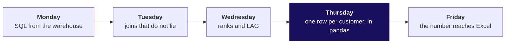
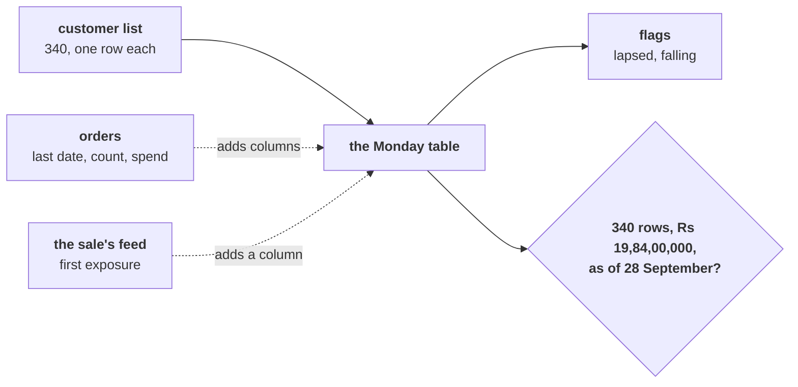

# Can the growth team act on one table, one row per customer, rebuilt every Monday, without checking it first?

**Week 2, Thursday. Study notes, read after the session.** Reading time: about 35 minutes.

Kalpa Retail's growth team asked the data and AI team for one thing it would use every week:

> "One table, one row per customer, refreshed every Monday: how recently each customer bought, how
> often, how much, their segment, whether the monsoon sale reached them, and the flags we act on.
> Marketing's analysts live in Python, so build it in pandas, from the warehouse, and make it refresh
> in one run."
>
> The growth team, with the data platform lead, Kalpa Retail

Kavya Nair, the team's senior analyst, added a challenge of her own: "You did the tree in plain Python
in Week 1, in SQL on Monday. Do it a third way now, and tell me honestly which tool you would pick for
which job." She reviews each chapter's answer before it leaves the team.

---

## What can you do now that you could not this morning?

1. You can build a table with one row per customer from order rows, starting from the customer list,
   and say what a missing number means on purpose.
2. You can attach another team's feed with a merge that states its promise, and resolve a repeated
   customer with a business rule.
3. You can reshape orders into months, wide to compare and long to follow a trend, with every cell a
   total you chose.
4. You can ask one question in plain Python, SQL and pandas, and find why two of them disagree.
5. You can give each recurring number one owner, sized by the rows each route moves and by who reruns
   it.
6. You can make the table rebuild itself every Monday, counted to the data's own last date, and refuse
   to ship when a guard fails.

---

## Where does today sit in the week, and what does the table measure?

**What the session covered.** Six chapters on one Kalpa case, each worked in full: the three numbers
per customer with `groupby`, the campaign feed attached with a validated merge, Retail-Plus's months
reshaped with `pivot_table`, one question asked in three tools, the tool-choice note, and the Monday
refresh with its guards. Three ideas were only named: `transform`, which gives every row its group's
value the way a window function does; `indicator=True`, pandas' version of Tuesday's anti-join; and
`pivot`, which refuses to reshape where `pivot_table` quietly averages.

Monday queried the v4 warehouse, Kalpa Retail's Postgres database: 1,000 orders over Q1 (April to
June 2026) and Q2 (July to September), worth Rs 19,84,00,000 at the prices charged, from a customer
list of 340 in four segments, Retail-Core and Retail-Plus (the two consumer tiers, Retail-Plus the
paid membership), Student and Business. Tuesday joined payments and learned to count rows on both
sides of a join; Wednesday ranked members and read the month before with `LAG`. Today's table is the
grain all three of those were heading for: one customer, one row.

```mermaid
flowchart LR
    M["<b>Monday</b><br/>SQL from the warehouse"] --> T["<b>Tuesday</b><br/>joins that do not lie"]
    T --> W["<b>Wednesday</b><br/>ranks and LAG"]
    W --> H["<b>Thursday</b><br/>one row per customer, in pandas"]
    H --> F["<b>Friday</b><br/>the number reaches Excel"]
    classDef today fill:#1A0F5C,stroke:#1A0F5C,color:#FFFFFF
    class H today
```

**The outcome tie.** Friday's sheets for the leadership deck start from the CSV today's refresh wrote,
and Week 4's cohorts and Week 5's model train on this table, so a wrong row today is a wrong feature
in Week 5.

**What was left out.** Recency, frequency and spend are inputs here; turning them into scores or
segments is Week 4's work. MultiIndex tables, time-series indexing and tuning pandas for speed stay out
of the programme until a question needs them.

---

## Which one drawing holds the whole table?

```mermaid
flowchart LR
    C["<b>customer list</b><br/>340, one row each"] --> T["<b>the Monday table</b>"]
    O["<b>orders</b><br/>last date, count, spend"] -.->|adds columns| T
    F["<b>the sale's feed</b><br/>first exposure"] -.->|adds a column| T
    T --> G["<b>flags</b><br/>lapsed, falling"]
    T --> K{"<b>340 rows, Rs 19,84,00,000,<br/>as of 28 September?</b>"}
```

The customer list decides how many rows there are. The orders and the campaign platform's feed only
add columns, and the flags are computed from those columns. Every chapter today lights one arrow, and
every trap is the table quietly changing what one row stands for. The three numbers on the right are
checked every Monday before the table leaves: 340 rows, Rs 19,84,00,000 of spend, and the as-of date,
28 September 2026, the last date the data covers.

**CALLBACK.** Week 1 Monday counted rows as customers and read 30 orders as 30 customers; today's
first chapter meets the same mistake from the other side.

---

## Chapter 1. How recently, how often and how much has each of Kalpa's 340 customers bought?

**Who needs the answer.** The growth team, which decides every Monday who gets an offer: a win-back
code for customers who have gone quiet, a first-order nudge for customers who signed up and never
bought. A customer missing from the table gets no offer at all. The metric is three numbers per
customer, recency, frequency and spend, which retailers call RFM; spend is the retail dossier's GMV,
the value of the orders at the prices charged, at the grain of one customer.

**The questions on the way.**

1. Which of three ways should build one row per customer, and what does each cost on 1,000 orders?
2. Does the frame pandas reads hold every order the warehouse holds?
3. Does one line of `groupby` give the same totals as Week 1's loop?
4. How many customers on the list have never ordered?
5. Does SQL, run on its own, give all 340 customers the same three numbers?

**IN THE FIELD.** Shopify's customer reports score every customer from 1 to 5 on recency, frequency and
monetary value, and one of their 11 groups is Prospects, "Customers with no orders yet" (Shopify Help
Center, Customers reports, checked 1 Oct 2026).

### Which of three ways should build one row per customer, and what does each cost on 1,000 orders?

| Option | Rows moved out of the warehouse | Lines of logic | The next five chapters |
|---|---|---|---|
| a) Week 1's loop | 1,000 | 6 | By hand, one dictionary at a time |
| b) SQL `GROUP BY` | 301 | 7 | A new query for every new view |
| c) pandas `groupby` | 1,000 | 3 | In memory: merge, pivot, recount |

pandas is the call, because the growth team's analysts work in Python and the next five chapters need
the orders in memory. Rows moved separates b from the others, and lines of logic separate a from c. The
fact that would switch it is an orders table in the crores: then the warehouse groups the orders and
sends one row per customer who ordered, whatever the orders' size, and pandas reads those rows.

### Does the frame pandas reads hold every order the warehouse holds?

Yes: 1,000 against 1,000, 538 in Q1 and 462 in Q2. `pd.read_sql` builds a DataFrame from the query's
rows, and pandas 3 reads text as its own `str` type, where pandas 2 said `object`, so a tutorial that
finds text columns with `dtype == object` finds none today. The amount arrives as `float64`, a number
pandas can sum, and `parse_dates` makes `order_date` a real date that chapter 6 subtracts.

### Does one line of `groupby` give the same totals as Week 1's loop?

It does, on all 301 customers who ordered. `groupby` splits the orders into one group per customer,
applies a calculation to each group and combines one row per customer: Week 1's accumulator written
once, and SQL's `GROUP BY`. One `agg` call computes all three numbers, each name on the left becoming a
column. The largest spender, a Business account, bought Rs 2,23,10,600, which is why spend is always
read by segment: Business holds 99.1 percent of it.

### How many customers on the list have never ordered?

Thirty-nine, which is the first-order nudge list. **The plausible wrong answer** is 0: the hurried
filter `rfm[rfm["frequency"] == 0]` finds nobody, and the welcome offer goes to nobody. **Why it is
wrong:** the table was built from orders, so a customer with no orders has no row, and a filter cannot
find a row that is not there. The check is the row count against the list, 301 against 340, before any
filter runs. A half-fix makes it worse: merged back onto the list, the 39 arrive with a missing
frequency, the column turns `float64`, and a missing value is never equal to 0. **The fix** starts from
the customer list, merges with `how="left"` and `validate="one_to_one"`, fills the count and the spend
with 0 on purpose and turns the count back into whole numbers. The 39 split 19 Retail-Core, 13
Retail-Plus, 6 Student and 1 Business, and spend does not move, which is why a spend check alone would
never have caught it.

### Does SQL, run on its own, give all 340 customers the same three numbers?

It does, on every customer. A `LEFT JOIN` from the customer list to the orders, grouped by customer,
shares no code with the notebook; `count(o.order_id)` counts only rows that found an order, so it gives
0 where `count(*)` would give 1, and `coalesce` turns a missing sum into 0. The pandas route is the one
to build on; the SQL route is the one to hand an auditor.

> **Kavya's review.** "The table's spine is the customer list, never the orders. Every Monday I want
> three numbers before it leaves: rows against the list, spend against the warehouse, and the count of
> customers who never ordered, which should never fall to zero by accident."

The chapter's answer: 340 rows with three numbers each, 39 of them customers who never ordered.

---

## Chapter 2. Which customers did the monsoon sale reach, and what did the reached customers spend?

**Who needs the answer.** The marketing lead, who owns acquisition and campaigns and is about to ask
for the monsoon sale's budget again for November. The sale ran in August 2026 at 15 percent off. A
spend inflated by the way the feed was joined makes the case with money nobody paid, and the gap
surfaces the day Finance ties the table back to the warehouse. The metric is reach, the customers the
sale reached, and their spend over the two quarters.

**The questions on the way.**

1. Which of four ways should attach the sale to the table, and what does each risk?
2. Which customers does a merge keep when `how` is left out?
3. What does one re-sent row do to the reached customers' spend?
4. Which argument stops the merge before a wrong table exists?
5. Which exposure should a customer keep, and does the table stay at 340 rows?
6. Does a count with no merge at all give the same reach and spend?

**IN THE FIELD.** Meta's advertisers can send one purchase twice, from the Pixel in the browser and from
their own server, and Meta's documentation says they "must set up a deduplication method"; under the
method Meta recommends, when the same event ID and event name reach the same Pixel within 48 hours,
Meta keeps the first copy and discards the rest (Meta for Developers, checked 1 Oct 2026).

### Which of four ways should attach the sale to the table, and what does each risk?

| Option | Rows out | Spend overstated per re-sent row | The problem shows | Keeps the date |
|---|---|---|---|---|
| a) A yes-or-no flag with `isin` | 340, always | Rs 0 | Never | No |
| b) A plain merge | 340 plus one per re-sent row | Rs 5,100 to Rs 26,020 | Never | Yes |
| c) A merge, counted before and after | 340 plus one per re-sent row | Rs 5,100 to Rs 26,020 | After the table exists | Yes |
| d) A rule, then a guarded merge | 340, or the run stops | Rs 0 | Before the table exists | Yes |

A re-sent row costs a whole customer's spend: Rs 5,100 for a typical Retail-Core or Retail-Plus
customer, up to Rs 26,020 for the largest. The call is d, because the next question is whether the
reached customers bought after the sale, which needs the date, and a feed that breaks its promise
should stop Monday's run. The fact that would switch it: a table that only ever needs yes or no, where
the flag cannot multiply a row and needs no rule.

### Which customers does a merge keep when `how` is left out?

Only the 130 the feed names. A merge is a join with SQL's four shapes, and pandas' default is inner, so
it drops the 210 customers the sale missed, who are exactly the comparison the marketing lead needs.
Write `how=` on every merge.

### What does one re-sent row do to the reached customers' spend?

On four invented customers, labelled so in class, it turns Rs 26,100 into Rs 34,700. **The plausible
wrong answer** is the slide's Rs 34,700: the feed names C-9002 twice, the merge gives C-9002 two rows,
and the sum counts its Rs 8,600 twice. **Why it is wrong:** every row looks right on its own, the slide
overstates the reached customers' spend by a third, and November's case rests on money nobody paid.
The check is Tuesday's: four customers in, five rows out.

### Which argument stops the merge before a wrong table exists?

`validate="one_to_one"`. It states that each key appears at most once on each side and raises
`pandas.errors.MergeError` the moment the data breaks the promise; the first line of the message reads
"Merge keys are not unique in right dataset; not a one-to-one merge". It is the row count made loud,
since nothing wrong is built. When the room ran the same merge on Kalpa's own feed, it read the guard's
answer for itself, and the rule it drew holds for any feed: a promise is checked, never assumed.

### Which exposure should a customer keep, and does the table stay at 340 rows?

The first one, and yes. A customer the sale reached twice was still reached, so the growth team's rule
is one row per customer, the date the sale first reached them: sort the feed by date, keep each
customer's first row with `keep="first"`, then merge with `validate="one_to_one"`. `keep="last"` would
keep a later date and `keep=False` would drop every copy, reading a reached customer as never reached.
The table stays at 340 rows and Rs 19,84,00,000, and 130 customers carry the date, 70 in Retail-Core
and 60 in Retail-Plus.

### Does a count with no merge at all give the same reach and spend?

It does: 130 customers and Rs 8,78,980, three ways. `isin` marks any customer whose id appears in the
feed and cannot multiply a row, and the warehouse's own copy of the feed answers in SQL, where `IN` only
asks whether a customer is there. The table records whom the sale reached; whether it changed what they
spent is Week 1 Thursday's separate test, which found the reached customers skewed towards those buying
anyway.

> **Kavya's review.** "A merge is a join, so I want Tuesday's two numbers before this goes to
> Marketing: 340 rows in and 340 out, and Rs 19,84,00,000 before and after. The rule you chose goes in
> writing beside the table."

The chapter's answer: 130 customers reached, who spent Rs 8,78,980, with the table still 340 rows.

---

## Chapter 3. How far did Retail-Plus members' spend fall from Q1 to Q2, month by month?

**Who needs the answer.** The head of Retail-Plus, Kalpa's paid membership tier, who takes one number to
the growth review and uses each member's months to decide whom to protect. A number that is too small
argues the tier's problem down, and rows that stand for the wrong thing protect the wrong members. The
metric is Retail-Plus spend by month and its change from Q1 to Q2.

**The questions on the way.**

1. Which of three shapes should answer the head of Retail-Plus, and what does each cost?
2. In how many member-months did Retail-Plus actually buy?
3. How far did the tier fall, read from a one-line pivot?
4. What does one row of the pivot stand for?
5. Which shape compares a member's quarters, and which follows the tier's trend?
6. Does a query that never pivots give the same fall?

**IN THE FIELD.** Costco reports how often members shop apart from what each trip is worth: on its call
for the fourth quarter of fiscal 2026, its chief financial officer reported "traffic or shopping
frequency increased 3.3% worldwide" and "our average transaction or ticket was up 5.9% worldwide"
(Costco's earnings call and SEC filing, 24 Sep 2026, checked 1 Oct 2026).

### Which of three shapes should answer the head of Retail-Plus, and what does each cost?

| Option | Shape on the 355 Retail-Plus orders | Empty cells | Adding October costs |
|---|---|---|---|
| a) The long table, `groupby` on member and month | 266 rows | 0 | Nothing |
| b) The wide table, `pivot_table` | 107 members by 6 months, 642 cells | 376 | Nothing |
| c) A query per month in SQL | 107 by 7, months typed as columns | 376 | A new line, typed by hand |

The call is a and b together: the long table keeps every rupee and is easy to group and plot, and the
wide table is what the head of Retail-Plus reads along a member's row. The fact that would switch it:
the view running every Monday for Finance, which moves it into the warehouse with a table of months in
place of hand-typed columns.

### In how many member-months did Retail-Plus actually buy?

In 266, far fewer than 107 members times 6 months, because a month with no order has no row. The tier
took Rs 5,85,770 in Q1 and Rs 4,13,380 in Q2.

### How far did the tier fall, read from a one-line pivot?

**The plausible wrong answer** is 18 percent: `pivot_table(index="customer_id", columns="month",
values="amount")` with nothing else, its columns added up, reports Q1 Rs 4,12,019 and Q2 Rs 3,37,267, a
fall of Rs 74,752. **Why it is wrong:** `pivot_table` must put one number in each cell, and its default
is the mean, so a member who ordered four times in June shows the average of the four; member C-0152's
June cell reads Rs 2,557.50 for four orders worth Rs 10,230. The column sums add up averages, which
hides how often members bought, the lever Week 1 found moving in Retail-Plus. The check: a pivot of
spend holds its source's total, and this one holds Rs 7,49,286 against Rs 9,99,150 of orders. **The
fix** says what a cell means, `aggfunc="sum"`, with `fill_value=0` for a month with no orders: the fall
is 29.4 percent, Rs 1,72,390. On Retail-Core, which the room built in its own cell, the averaged pivot
gets even the direction wrong, a rise of 1.5 percent where the tier fell 1.8.

### What does one row of the pivot stand for?

A member, 107 of them, when the index is `customer_id`. Indexed by `order_id`, the same call returns
355 rows, one per order, whose totals are right and whose rows answer no question about members. Read
the row labels aloud before reading any number. The 13 Retail-Plus members who never ordered are in
neither view, a decision to state when the view goes out.

### Which shape compares a member's quarters, and which follows the tier's trend?

The wide table compares: 67 of the 107 members spent less in Q2 than in Q1, and 40 spent more. The long
table follows: `melt` folds the wide table back into 642 rows, zeros kept, and the members ordering each
month fall from 56 in April to 37 in September, through 47, 48, 40 and 38. How often, again.

### Does a query that never pivots give the same fall?

It does: a join to the customer list, a filter on Retail-Plus and a sum per quarter give Rs 5,85,770 and
Rs 4,13,380. The query has no `aggfunc` to forget, which makes it the route to trust when a pivot's
arguments are in doubt.

> **Kavya's review.** "A fall of 29 percent, from a pivot whose grand total equals the orders. The
> averaged pivot would have told the review 18. Write `aggfunc=` on every pivot, the way you write
> `how=` on every merge."

The chapter's answer: Retail-Plus spend fell 29.4 percent, Rs 1,72,390, and 67 of 107 members spent less.

---

## Chapter 4. Of the 130 customers the sale reached, how many bought, and do plain Python, SQL and pandas agree?

**Who needs the answer.** The marketing lead, through Kavya. The share of reached customers who bought
is the November case's second line, after the reach. A share that leaves out the reached customers who
never bought makes the sale look perfect, and Kavya will not let a number reach Marketing until two
tools that share no code agree on it. The metric is reached customers with at least one order, over
the customers reached, by segment.

**The questions on the way.**

1. Which tool should answer the marketing lead's question, and what does each cost on this data?
2. What does plain Python count, with a set of reached customers and a dictionary of segments?
3. What does SQL say when it groups the same customers by segment?
4. Why does pandas report that every reached customer bought?
5. Where should the segment come from, so that all three tools agree?
6. Does counting sets, with no grouping at all, find the same customers who never bought?

**IN THE FIELD.** Uber's Operations team computed completed trips in Presto/Hive SQL for daily
dashboards while its Pricing Engineering team built its own completed-trips metric from a Cassandra
table; Uber's goal became a metric and its logic in "a strictly ONE to ONE mapping" (Uber Blog, 12
January 2021, checked 1 Oct 2026).

### Which tool should answer the marketing lead's question, and what does each cost on this data?

| Option | Rows moved for this question | Lines of logic | Where it runs |
|---|---|---|---|
| a) Plain Python | 1,000 | 6 | The analyst's machine |
| b) SQL | 2 | 10 | The warehouse |
| c) pandas | 0, the table is in memory | 3 | The analyst's machine |

The call is c, checked by b: pandas answers on chapter 2's table, and SQL moves only its answer and
shares no code. The fact that would switch it: the number going to Finance or an auditor, which makes
SQL the owner, chapter 5's question.

### What does plain Python count, with a set of reached customers and a dictionary of segments?

Three keys: Retail-Core, Retail-Plus and `None`. The hurried version reads each customer's segment from
their orders, so the 23 reached customers who never ordered have no segment, and `.get` files them under
`None`. The totals stay whole: 130 reached, 107 bought.

### What does SQL say when it groups the same customers by segment?

Three groups, one of them `NULL`, holding the same 23. `GROUP BY` puts every `NULL` key into one group of
its own, so SQL and plain Python agree.

### Why does pandas report that every reached customer bought?

**The plausible wrong answer** is 100 percent, on 107 reached customers: the same logic in pandas, with
the segment read from the orders and grouped, reports Retail-Core 56 of 56 and Retail-Plus 51 of 51.
**Why it is wrong:** `groupby` drops rows whose key is missing unless told `dropna=False`, and the
customers who vanished are exactly the reached customers who never bought. The slide reports a perfect
campaign to a lead about to ask for the same budget again. The check: the groups must add back to the
rows, and 107 against the 130 reached shows the gap without reading a row.

### Where should the segment come from, so that all three tools agree?

From the customer list, where every customer has one, whether or not they ever ordered. Then plain
Python, SQL and pandas all say 107 of 130 bought, 82 percent: 56 of 70 in Retail-Core, 80 percent, and
51 of 60 in Retail-Plus, 85 percent. The tools never disagreed about arithmetic; they disagreed about
rows.

### Does counting sets, with no grouping at all, find the same customers who never bought?

It does. The reached customers minus the customers with at least one order are 23, whatever their
segment, and 130 less 23 is 107. A set difference cannot drop a missing segment, because it never asks
for one.

> **Kavya's review.** "When two tools disagree, look for the rows one of them dropped before you look at
> the code. Check that the groups add back to the rows, and take every attribute of a customer from the
> customer list, never from their orders."

The chapter's answer: 107 of 130 bought, 82 percent, and the three tools agree once they share one
definition of a customer's segment.

---

## Chapter 5. Which tool should own each of Marketing's and Finance's recurring numbers, and which would you refuse for Finance?

**Who needs the answer.** Kavya, and behind her Anand Iyer, the finance controller, whose analyst reruns
every number the team sends. A number that lives in two tools drifts into two numbers, and two numbers
for one metric is how Week 1 Wednesday began, with the dashboard's Rs 2.1 crore against the books' Rs
1.9 crore. The metric the chapter tests is Finance's Monday revenue by segment and quarter: eight
numbers, adding up to Rs 19,84,00,000.

**The questions on the way.**

1. Which of three tools should compute Finance's Monday revenue, and what does each cost?
2. Does speed separate the three tools on 1,000 orders?
3. How many rows does each tool move to answer an eight-row question?
4. Which tool should own each of the day's recurring asks, and which would you refuse for Finance?
5. Does the growth team's table reconcile with Finance's query to the rupee?

**IN THE FIELD.** LinkedIn's Unified Metrics Platform page says that "multiple stakeholders come up with
different ways to calculate the same metric arriving at slightly different results", and that the
platform now "serves as the single source of truth for all business metrics at Linkedin" (LinkedIn
Engineering, checked 1 Oct 2026).

### Which of three tools should compute Finance's Monday revenue, and what does each cost?

| Option | Lines of logic | Where Finance can rerun it | What it depends on besides the data |
|---|---|---|---|
| a) SQL | 5 | Anywhere with read access | The warehouse only |
| b) pandas | 4 | On the analyst's machine | The notebook's state and environment |
| c) Plain Python | 6 | On the analyst's machine | The script's environment |

The call is SQL, because Anand's analyst reruns the number every Monday without the growth team's
machine. The fact that would switch one of Finance's asks to pandas: a question tried five ways in an
afternoon and then dropped, where pandas reads the query's answer and the definition stays in one place.

### Does speed separate the three tools on 1,000 orders?

No. All three finish well inside a second, and the ranking changes from run to run. A sizing column
where every option scores the same separates nothing.

### How many rows does each tool move to answer an eight-row question?

**The plausible wrong answer** sizes each route by its answer, 8, 8 and 8 rows, calls the cost equal and
gives Finance's number to pandas, because its chain is short. **Why it is wrong:** the rows an answer
holds say nothing about the work of producing it. The check counts the rows each route fetched: SQL 8,
plain Python 1,000 and pandas 1,340, every order and every customer. At a hundred times Kalpa's orders
the pandas route moves a hundred times the rows while SQL still sends 8. **The fix** sizes by rows moved
and by who reruns the number, and the note's line for Finance stays the same with a number for its
reason.

### Which tool should own each of the day's recurring asks, and which would you refuse for Finance?

| The ask | The owner | The reason |
|---|---|---|
| Finance's revenue by segment and quarter | SQL | Anand's analyst reruns it where the data lives; it moves 8 rows |
| The growth team's customer table | pandas, reading the warehouse | The analysts add columns every week; merge and validate are one line each |
| The head of Retail-Plus's months view | pandas | A pivot and a melt on data already in memory |
| One customer's spend, for an auditor | Plain Python | Every step is a line the auditor can read |

The refusal: never a pandas notebook for Finance's number. It moves every order to one machine, depends
on the order its cells were run in, and Anand's analyst cannot rerun it.

### Does the growth team's table reconcile with Finance's query to the rupee?

It does, in every segment: Business Rs 19,65,99,040, Retail-Core Rs 7,39,320, Retail-Plus Rs 9,99,150
and Student Rs 62,490. The two share no code, so this reconciliation is the check that lets two tools
share one number; when it fails, the warehouse is right and the table is wrong until someone can say
why.

> **Kavya's review.** "Choose by who has to trust the number and rerun it, and size by the rows a route
> moves. Finance's number lives in the warehouse, the growth team's table reads from it, and plain Python
> is for the question you must explain line by line."

The chapter's answer: SQL owns Finance's number, pandas the analyst's bench, plain Python the line-by-line
explanation, and a pandas notebook is refused for Finance.

---

## Chapter 6. Can the table rebuild itself every Monday and refuse to ship when something breaks?

**Who needs the answer.** The growth team, who act on Monday's table with no analyst watching the run:
the win-back code goes to every customer the table marks as lapsed, no order in the 60 days before the
table's as-of date. A refresh that counts from the wrong date sends codes to customers who bought weeks
ago, and a broken table that ships sends Monday's offers to the wrong people before anyone looks. The
metric is the win-back list; a customer who never ordered is not on it and gets the first-order nudge.

**The questions on the way.**

1. Which of four ways should run the Monday refresh, and what does each catch?
2. What does the refresh need to be told, and what can it read from the data itself?
3. How many customers land on the win-back list when the refresh runs on Monday 19 October?
4. Which guards stop a bad Monday, and does each one fire when it should?
5. Do two runs on the same data give the same table?
6. Does the warehouse, counting on its own, find the same win-back list?

**IN THE FIELD.** Public Health England's statement of 4 October 2020 said "15,841 cases between 25
September and 2 October were not included in the reported daily COVID-19 cases"; The Register traced it
to lab results stored in the older .XLS format, "that limited the number of rows to 65,536 per
spreadsheet" (both checked 1 Oct 2026). A count of rows in against rows out on every run would have
stopped it on the first day.

### Which of four ways should run the Monday refresh, and what does each catch?

| Option | When a check fails | Stops the day's four failures before the table ships |
|---|---|---|
| a) Rerun the notebooks by hand | The table ships if the analyst misses it | Only if someone notices |
| b) One function that reports | The table ships, with FAIL printed beside it | None |
| c) One function with guards | The table is not written, and the error says why | All four |
| d) The table as a SQL view | A view returns whatever its query gives | None, without tests of its own |

The four failures are a customer missing, a customer the feed sends twice, spend off the warehouse and
a repeated key. The call is c, the only option that stops all four before the growth team acts. The fact
that would switch it: the table's readers querying the warehouse directly, such as a dashboard, which
makes d the home, with the same checks moved into the warehouse's own tests.

### What does the refresh need to be told, and what can it read from the data itself?

Two things: the warehouse connection and the feed's path. Everything else it reads, so it cannot be
told a stale count: the 340 customers, their numbers, the sale's first exposure. Recency is the one
column still missing, and it needs a date to count to.

### How many customers land on the win-back list when the refresh runs on Monday 19 October?

**The plausible wrong answer** is 166: the hurried refresh counts recency to `pd.Timestamp.today()`,
which on the first Monday after this session is 19 October. **Why it is wrong:** the warehouse's last
order is dated 28 September 2026 and nothing after it has been loaded, so every customer looks 21 days
staler than the data says, and 55 customers who ordered within 60 days of the data's end get a win-back
code. Run a week later with no new data and the list grows to 180, then 187: the table has become a
function of the calendar. On the class day itself, 15 October, it reads 154. The check: somebody always
bought on the data's last day, so the smallest recency in an honest table is 0, and here it is 21.
**The fix** counts to the data's own last date, `orders["order_date"].max()`, and writes it into the
table as `as_of`: 111 customers, 5 Business, 49 Retail-Core, 47 Retail-Plus and 10 Student. At a 45-day
line it would hold 144, and at 90 days 74; the line is the growth team's.

### Which guards stop a bad Monday, and does each one fire when it should?

Four guards, each against a number the warehouse gives on its own: one row per customer, as many rows as
the customer list, spend equal to the warehouse's, and a smallest recency of 0. Each is proved by
breaking a copy of the table: a repeated row trips the first three, recency counted to the run day trips
only the last, and dropping the customers with no orders trips only the row count, since their spend is
0 and they have no recency. The honest table trips none.

### Do two runs on the same data give the same table?

They do, cell for cell, because nothing in the refresh reads the calendar. The hurried version sent 166
codes on the first Monday and 180 a week later, with no new data at all.

### Does the warehouse, counting on its own, find the same win-back list?

It does: 111. Each customer's last order, the data's own last date, and the customers more than 60 days
apart, in one SQL query that shares no code with the refresh.

> **Kavya's review.** "The table carries its as-of date, the smallest recency is 0, and a run that fails
> a guard writes nothing. That is a refresh I will let Marketing act on without me."

The chapter's answer: yes, with 111 on the win-back list as of 28 September 2026, and a run that refuses
to write a broken table.

---

## Where do today's moves decide something at work?

**A customer table someone else will act on.** Any growth, retention or risk team acts person by person.
The first question in the review is how many people are on the table against how many are on the list,
and the analyst who starts from the list never has to explain the gap.

**A feed from another team's system.** Campaign platforms, payment gateways and partner files send rows
twice for reasons that have nothing to do with the business. A merge that states its promise turns the
day the feed changes into a stopped run with a message, instead of a slide that overstates a campaign
by a third.

**A number two teams both compute.** When Marketing's dashboard and Finance's report disagree, the
fight is about definitions and rows long before it is about tools. Giving each number one owner and
reconciling every copy against it every week is the habit that stops the fight from starting.

---

## Can you answer four questions on today's traps without writing anything?

1. A colleague's customer table has 301 rows and Kalpa's list has 340. What do you say before anyone
   filters it? *Answer: the table was built from orders, so 39 customers who never ordered have no row;
   start from the list and fill their counts with 0 on purpose.*
2. A pivot's columns add up to Rs 7,49,286 and its orders to Rs 9,99,150. Which argument do you check
   first? *Answer: `aggfunc`, since the default is the mean; with `"sum"` the totals match.*
3. pandas says 100 percent of reached customers bought and SQL says 82. Which rows do you look for?
   *Answer: the reached customers whose segment came from their orders, which they never placed; the
   default `groupby` dropped them.*
4. The refresh ran on 19 October and its smallest recency is 21. What happened, and what is the fix?
   *Answer: recency was counted to the wall clock; count to the data's last date, carried as `as_of`.*

---

## What will an interviewer ask, and what does a strong answer sound like?

**[S] Describe `groupby` in the split-apply-combine sentence.** "`groupby` splits the rows into one group
per key, applies a calculation to each group, and combines the results into one row per key. For a
customer table: split the orders by customer, apply the latest date, a count and a sum, combine one row
per customer. It is SQL's `GROUP BY`, and the accumulator dictionary from a plain loop written once."

**[S] Merge against join: what is the same and what differs?** "The same: both match rows on a key, both
come in inner, left, right and outer, and both multiply rows when a key repeats on the side you did not
expect. The differences: pandas defaults to inner, so I always write `how=`; pandas works in memory on
data already pulled, where the warehouse joins where the data lives; and pandas can refuse the wrong
shape with `validate=`, which SQL has no single argument for."

**[F] Which merge argument raises on duplicate keys, and which error?** "`validate`, set to
`one_to_one`, `one_to_many` or `many_to_one`. When the keys break the promise it raises
`pandas.errors.MergeError`, naming the side whose keys are not unique. It is the row-count check made
loud."

**[F] Pivot against melt: which widens and which lengthens?** "`pivot` and `pivot_table` widen: one
column's values become columns, so member and month become one row per member with a column per month.
`melt` lengthens, folding the columns back into rows. I pivot to compare along a row and melt to plot or
group a trend."

**[D] Same question, three tools: how do you choose, and defend one choice?** "When they agree, I choose
by who has to trust and rerun the number. Finance's number goes in SQL: it runs where the data lives,
moves only its answer and Finance can rerun it. The analyst's iterative work goes in pandas, reading
SQL's answers, and a one-off I must explain line by line goes in plain Python. On 1,000 rows speed
separates nothing, so I size by rows moved: SQL 8, pandas 1,340."

**[F] Your customer table has fewer rows than the customer list. Why, and what do you do?** "I built it
from orders, so customers who never ordered never formed a group. I start from the list, left-merge with
`validate`, and fill count and spend with 0 on purpose, because a missing count is never equal to 0."

**[F] Your Monday refresh stopped with a `MergeError`. What do you do?** "I do not delete the repeats to
make it pass. I read the repeated keys, find out why the source sent them, apply a business rule such as
the first exposure per customer, keep `validate` on, and tell the feed's owner."

**[F] Your pivot's totals look low. Where do you look first?** "At `aggfunc`: `pivot_table` averages by
default. I pass `aggfunc='sum'` and check the grand total against the source before reading a cell."

**[F] What does SQL's `GROUP BY` do with a `NULL` key, and pandas' `groupby` with a missing one?** "SQL
keeps one `NULL` group; pandas drops missing keys unless told `dropna=False`. I check that the groups add
back to the rows."

**[D] A dashboard says 100 percent of the customers a campaign reached went on to buy. What do you check
first?** "Whether the non-buyers fell out of the denominator. I count the reached from the campaign's
feed, compare with the dashboard's total, and take every customer attribute from the customer list."

**[D] Which tool would you refuse for Finance's numbers, and why?** "A pandas notebook run by hand: it
moves every order to one machine, depends on the order its cells ran in, and Finance cannot rerun it. I
give Finance the query and let my notebook read its answer."

**[D] The orders table grows to 5 crore rows. Where do you build the customer table?** "In the
warehouse: `GROUP BY` sends one row per customer however many orders there are. pandas reads that and
merges the feed. I would switch back only for a question that needs the order rows themselves, and pull
only the columns and months it needs."

**[F] How do you compute recency in a job that runs every week?** "From the data's last loaded date,
carried in the table as its as-of date, never from the wall clock; otherwise two runs on the same data
disagree. The check is that the smallest recency is 0."

---

## Which words did today use, and what does each mean?

| Term | Plain meaning | Where it appeared | Example |
|---|---|---|---|
| RFM | Recency, frequency and monetary value: how recently, how often and how much a customer bought | Chapter 1 | 340 customers, three numbers each |
| Spine | The table whose rows decide the result's rows | Chapter 1 | The customer list, 340 rows |
| `groupby` | Split rows by a key, apply a calculation, combine one row per key | Chapter 1 | 1,000 orders to 301 customers |
| Merge | pandas' join, in four shapes set by `how` | Chapter 2 | The feed attached to 340 rows |
| `validate` | The promise a merge states about its keys, raising `MergeError` when broken | Chapter 2 | `"one_to_one"` |
| First touch | The growth team's rule: a customer reached twice counts once, on the first date | Chapter 2 | 130 reached |
| `pivot_table` | Turns one column's values into columns, one number per cell | Chapter 3 | 107 members by 6 months |
| `aggfunc` | What a pivot puts in a cell; the mean unless told | Chapter 3 | `"sum"`, a fall of 29.4 percent |
| `melt` | Folds columns back into rows, wide to long | Chapter 3 | 642 member-months |
| `dropna` | Whether `groupby` drops rows with a missing key; true by default | Chapter 4 | 23 reached customers lost |
| Rows moved | The rows a route fetches from the warehouse to produce its answer | Chapter 5 | SQL 8, pandas 1,340 |
| As-of date | The last date the data covers, carried in the table | Chapter 6 | 28 September 2026 |
| Guard | A check that raises an error, so a failing table is never written | Chapter 6 | The smallest recency is 0 |

---

## What should you read next, and in what order?

| Order | What | Why | Time |
|---|---|---|---|
| 1 | pandas user guide, "Group by: split-apply-combine": https://pandas.pydata.org/docs/user_guide/groupby.html (verified 1 Oct 2026) | Today's chapter 1 in the library's own words | 15 minutes |
| 2 | pandas user guide, "Merge, join, concatenate and compare", the sections on merge types and merge key uniqueness: https://pandas.pydata.org/docs/user_guide/merging.html (verified 1 Oct 2026) | `how` and `validate`, chapter 2 | 15 minutes |
| 3 | pandas user guide, "Reshaping and pivot tables": https://pandas.pydata.org/docs/user_guide/reshaping.html (verified 1 Oct 2026) | `pivot_table`, `pivot` and `melt`, chapter 3 | 15 minutes |
| 4 | pandas, "Comparison with SQL": https://pandas.pydata.org/docs/getting_started/comparison/comparison_with_sql.html (verified 1 Oct 2026) | Every SQL move this week beside its pandas twin, and the warning on missing join keys | 10 minutes |
| 5 | pandas, "What's new in 3.0.0": https://pandas.pydata.org/docs/whatsnew/v3.0.0.html (verified 1 Oct 2026) | Why text reads as `str` and older tutorials differ | 10 minutes |

---

## Which five lines from today's chapters are worth keeping?

1. Start a customer table from the customer list, because a table built from orders leaves out everyone who never ordered: 39 of Kalpa's 340.
2. Write `how=` and `validate=` on every merge, because one repeated key adds a customer's whole spend again and `validate` stops the merge before the table exists.
3. Write `aggfunc=` on every pivot and check its grand total against the source, because `pivot_table` averages by default and turned a 29 percent fall into 18.
4. Two tools agree only when they share one definition, so give each recurring number one owner, chosen by who reruns it and sized by the rows each route moves.
5. Count recency to the data's own last date and let the refresh refuse a table that fails a guard, because the wall clock put 166 customers on a list that holds 111.

---

## So, can the growth team act on one table, one row per customer, rebuilt every Monday, without checking it first?

Yes, because the table checks itself. It holds all 340 customers with three numbers each, 39 of them on
the first-order nudge list; the 130 customers the monsoon sale reached, once each; a win-back list of 111
counted to 28 September 2026; and it rebuilds in one run that writes nothing when a guard fails.
Finance's revenue stays in the warehouse as a query the table reconciles with every week. The caveat
goes with it: the table records whom the sale reached, and whether the sale changed what they spent
needs a fair comparison of its own. Friday's question is which parts of this week belong in a sheet a
director can change in the room, and which must never be there.
