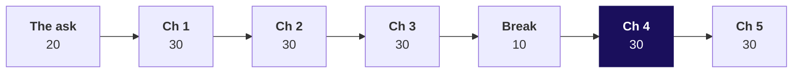
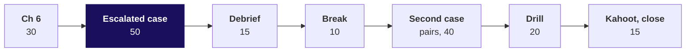

# Day sheet: can the growth team act on Monday's table without checking it?

**TRAINER ONLY.** Nothing on this page reaches a learner.

Posts to <!-- sync:module:W02/D4 -->Module 1: Foundations of AI and Data<!-- /sync:module:W02/D4 -->, on <!-- sync:day-date:W02/D4 -->Thu 15 Oct 2026<!-- /sync:day-date:W02/D4 -->.

## Is there an IITGN faculty block today?

<!-- sync:faculty-day:W02/D4 -->
No IITGN faculty block on this day.
<!-- /sync:faculty-day:W02/D4 -->

The day runs the full grid: two blocks of 180 minutes and the TA-led practice lab after them.

## Which questions does the room climb, in order?

Ask each question aloud before its answer is shown; the room's answer goes on the board before the
slide that answers it.

**The day.** Can we get one table, one row per customer, rebuilt every Monday, that we can act on
without checking it?

| Chapter | The question | Its smaller questions |
|---|---|---|
| 1. One row per customer? | How recently, how often and how much has each of Kalpa's 340 customers bought? | Which of three ways builds the table, and at what cost? Does the frame hold every order? Does groupby match Week 1's loop? How many customers never ordered? Does SQL, on its own, agree? |
| 2. Who did the sale reach? | Which customers did the monsoon sale reach, and what did the reached customers spend? | Which of four ways attaches the sale? What does a merge keep when how is left out? What does one re-sent row do? Which argument stops the merge? Which exposure does a customer keep? Does a count with no merge agree? |
| 3. Is Retail-Plus slipping? | How far did Retail-Plus members' spend fall from Q1 to Q2, month by month? | Which of three shapes answers? How many member-months? What does a one-line pivot say? What is one row? Which shape compares and which follows? Does a query with no pivot agree? |
| 4. Do three tools agree? | Of the 130 customers the sale reached, how many bought, and do plain Python, SQL and pandas agree? | Which tool answers, at what cost? What does plain Python count? What does SQL say? Why does pandas say 100 percent? Where should the segment come from? Do sets agree? |
| 5. Which tool for which job? | Which tool should own each of Marketing's and Finance's recurring numbers, and which would you refuse for Finance? | Which of three tools computes Finance's revenue? Does speed separate them? How many rows does each move? Who owns which ask? Does the table reconcile with Finance? |
| 6. Will Monday rebuild it? | Can the table rebuild itself every Monday and refuse to ship when something breaks? | Which of four ways runs the refresh? What must it be told? Who is on the 19 October list? Which guards fire? Do two runs agree? Does the warehouse agree? |

## Where does the day start, and where does it stop?

| | |
|---|---|
| **Start from** | Three days of SQL (Monday's warehouse tree, Tuesday's fan-out and row-count habit, Wednesday's partitioned LAG with the calendar check) and Week 1's accumulators. Every pandas move lands on something the room did by hand or in SQL; say which one, every time. |
| **Go as far as** | Every learner ships the customer table from a guarded refresh (340 rows, Rs 19,84,00,000, 130 reached, 111 lapsed), one reshaped view with `aggfunc="sum"`, and a tool-choice note with rows moved and one refusal, and has run one question through all three tools. |
| **Stop before** | MultiIndex depth, time-series indexing, `apply` with custom functions, performance tuning beyond the rows-moved sizing. Name each as later if asked; do not open it. |
| **Comes later** | Friday takes this table into Excel for the leadership deck, and its four traps stay untaught today. Week 4's cohorts and baskets run on this table, and Week 5's model trains on it: say that aloud once. |
| **Cut first** | Notebook 03 section 5 (`melt`) to a sentence, then the depth sections of notebooks 01 to 06, then S44 (the wrong index) to one line. Never cut `validate=`, chapter 4's three-tool disagreement or the chapter 6 guards. |

**The day's arc in one sentence.** The growth team's table is built a chapter at a time, and each
chapter meets a plausible wrong number a default or a shortcut would have shipped: 0 customers who never
ordered, a slide inflated by a re-sent row, an 18 percent fall that is 29.4, 100 percent of the reached
buying, a tool choice made on 8 rows each, and a win-back list of 166 that is 111.

**Idea count.** Six decision sentences across the day, within the cap of twelve: the customer list is
the spine; `validate=` makes a merge's promise loud and a duplicate needs a business rule; a pivot says
its `aggfunc` and matches its source's total; `groupby` drops a missing key where SQL keeps a group;
a number's owner is chosen by who reruns it and sized by rows moved; a refresh counts to the data's last
date and refuses a table that fails a guard.

---

## How does the morning run, minute by minute?

| Part | Slides, half one | Beside it | What must land | If short of time |
|---|---|---|---|---|
| The ask and the thinking, 20 | S1 to S5 | The board's first drawing (S4), the three checks written up | The six chapter questions; one row is a customer on the list; the three checks as numbers: 340, Rs 19,84,00,000, 28 September | S2 read, not discussed |
| Chapter 1, 30 | S6 to S20 | Notebook 01; guided set `guided/C2_W02_D04_first_moves_STUDENT.md` during S10 to S14; then `unguided/C2_W02_D04_ch1_customer_table_STUDENT.md` | 301 against 340; the filter that finds 0; NaN never equals 0; the fix gives 39; SQL agrees on all 340 | S8 to one sentence; the depth section self-study |
| Chapter 2, 30 | S21 to S33 | Notebook 02 and its your-turn cell; `unguided/C2_W02_D04_ch2_exposure_STUDENT.md` | how= defaults to inner; the invented Rs 34,700 against Rs 26,100; `MergeError` read aloud; the room finding Kalpa's own feed in the empty cell; first touch keeps 340 rows | S25 read quickly; never cut S28 to S31 or the your-turn cell |
| Chapter 3, 30 | S34 to S47 | Notebook 03 and its your-turn cell; `unguided/C2_W02_D04_ch3_months_STUDENT.md` | 266 member-months; 18 against 29.4 percent; the grand-total check; C-0152's June read aloud; Retail-Core's sign flips in the your-turn | S44 to a sentence; S45 self-study |
| Break, 10 | | | | |
| Chapter 4, 30 | S48 to S58 | Notebook 04; `unguided/C2_W02_D04_ch4_three_tools_STUDENT.md` | Python and SQL keep a group of 23, pandas drops it and says 100 percent; the groups add back to the rows; 107 of 130, 82 percent, in all three tools | S50 to a sentence; the depth section (NULL keys in a merge) self-study |
| Chapter 5, 30 | S59 to S69 | Notebook 05; `unguided/C2_W02_D04_ch5_tool_choice_STUDENT.md` | Speed separates nothing on 1,000 orders; 8 rows each is the wrong size, 8 against 1,340 is the right one; the note and the refusal; the table ties to Finance in every segment | S63 to S64 to two minutes |

Each chapter runs: the question and its map (2), the need and the real company (4), the options and
the call (4), the build with each step predicted (10), the trap and its wrong number (5), the second
route and Kavya's review (5).

---

## How does the afternoon run, minute by minute?

| Part | Slides, half two | Beside it | What must land | If short of time |
|---|---|---|---|---|
| Chapter 6, 30 | S1 to S16 | Notebook 06; `unguided/C2_W02_D04_ch6_refresh_STUDENT.md` | Two inputs; 166 counted to 19 October against 111 counted to 28 September; the smallest recency is 0; each guard made to fire; two runs equal; SQL counts 111 | S3 to a sentence; the depth section (the falling flag) self-study |
| Escalated case, 50 | S17 to S18 | `unguided/C2_W02_D04_escalated_case_STUDENT.md`, `notebooks/C2_W02_D04_ex1_escalated_case_STUDENT.ipynb` | Thirteen letters and the four numbers: 340, Rs 19,84,00,000, 130, 111 | Part 5 (the guarded run) to the take-home |
| Debrief, 15 | S19 to S20 | The room's wrong numbers, collected on the board during the case | Each wrong output traced to its check; the three counts for one dataset, 154, 166 and 111 | S20 to a sentence |
| Break, 10 | | | | |
| Second case, 40 | S21 to S23 | `unguided/C2_W02_D04_second_case_STUDENT.md`, `notebooks/C2_W02_D04_ex2_second_case_STUDENT.ipynb` | The room writes the SQL first; 2.363 to 1.842 in all three tools; rows moved 355, 2 and 1,000; the note with one refusal | The brief's extra items to the lab |
| Interview drill, 20 | S24 to S25 | The answers in one breath, below | Two learners per question, answer and follow-up; a number in every answer | S25 to four follow-ups |
| Kahoot and close, 15 | S26 to S28 | `kahoot/C2_W02_D04_quiz_STUDENT.md` | The sentence to the growth team; the five lines; Friday's question left open | Kahoot to six items; keep the Wednesday return question |

---

## Which traps does the day stage, with their exact wrong numbers?

| Chapter | The plausible wrong answer | The decision it would have misled | The check that catches it | The fix and what changed |
|---|---|---|---|---|
| 1 | `rfm[rfm["frequency"] == 0]` finds **0** customers who never ordered; the table has **301** rows | The first-order nudge sent to nobody; 39 sign-ups never welcomed | Rows against the customer list: 301 against 340. The half-fix still finds 0: after a left merge the 39 have a NaN frequency, float64, and NaN never equals 0 | The customer list as spine, `how="left"`, `validate="one_to_one"`, fill 0, back to int64: **39** (Retail-Core 19, Retail-Plus 13, Student 6, Business 1); spend unchanged |
| 2 | Invented: the slide says reached customers spent **Rs 34,700** (4 customers in, 5 rows out) | The November budget asked for on Rs 8,600 nobody paid | Rows in against rows out; `validate="one_to_one"` raises `MergeError: Merge keys are not unique in right dataset; not a one-to-one merge` | First exposure per customer, then the guarded merge: Rs 26,100 on the invented records; on Kalpa, 340 rows, 130 reached, Rs 8,78,980 |
| 3 | `pivot_table` with its default mean: a fall of **18 percent** (Q1 Rs 4,12,019 to Q2 Rs 3,37,267, Rs 74,752) | The head of Retail-Plus defends a fall well under half its size in rupees | The grand total against the orders: Rs 7,49,286 against Rs 9,99,150; C-0152's June cell shows Rs 2,557.50 for four orders of Rs 10,230 | `aggfunc="sum"`, `fill_value=0`: Rs 5,85,770 to Rs 4,13,380, **29.4 percent**, Rs 1,72,390; Retail-Core's sign flips from +1.5 to -1.8 percent |
| 3 | A pivot indexed by `order_id`: **355 rows** that look like a months view | "Who is drifting" cannot be read at all | Read the row labels aloud: KR-00125 is an order | Index by `customer_id`: 107 members |
| 4 | pandas with the segment read from the orders: **100 percent** of **107** reached bought | A marketing lead asking for the same budget on perfect results | The groups add back to the rows: 107 against 130; `dropna=False` shows a missing group of 23; plain Python (None key) and SQL (NULL group) both keep it | The segment from the customer list, in all three tools: 107 of **130**, **82 percent** (Retail-Core 56 of 70, Retail-Plus 51 of 60) |
| 5 | The hurried note sizes each tool by the answer's rows, **8, 8 and 8**, and gives Finance's number to pandas | Finance's number on one analyst's machine, moving every order every Monday | Count the rows each route fetched | Rows moved: SQL **8**, pandas **1,340**, plain Python **1,000**; SQL owns Finance's number, and a pandas notebook is refused for it |
| 6 | Recency counted to `pd.Timestamp.today()` on Monday 19 October: a win-back list of **166**, smallest recency **21** days; it grows to 180 and 187 on the next two Mondays with no new data (154 on the class day) | 55 active customers sent a win-back code; the list a function of the calendar | The smallest recency must be 0 | Count to the data's last date, 28 September 2026, carried as `as_of`: **111** (Business 5, Retail-Core 49, Retail-Plus 47, Student 10) |

The runtime errors met on the way get two minutes and their last line: the `NameError` that starts
each TODO twin, `ValueError: Index contains duplicate entries, cannot reshape` from `pivot` in notebook
03's depth section, and anything a learner's typo raises.

---

## What is planted, and what if nobody finds it?

Client zero v4 (`docs/07_Client_Zero.md`, section 7, locked v2.2), read from the warehouse loaded from
`content/W02/D1/data/C2_W02_D01_warehouse_v4_STUDENT.sql`, plus today's feed
`content/W02/D4/data/C2_W02_D04_exposure_STUDENT.csv`.

| Plant | What the room is meant to find | Where | If nobody finds it |
|---|---|---|---|
| 6 duplicated customer keys in the exposure feed: C-0001, C-0002, C-0003, C-0006, C-0007 and C-0009, each re-sent on 11 August; 136 rows for 130 customers | `validate="one_to_one"` raises where the count check only reported: a plain left merge turns 340 rows into 346, spend into Rs 19,84,45,800 (Rs 45,800 too much) and the reached customers' spend from Rs 8,78,980 into Rs 9,24,780 | Notebook 02's your-turn cell, after S29 | After five minutes, ask a pair to read `len(exposure)` and `exposure["customer_id"].nunique()` aloud and compare them; never name the ids |
| A customer whose months pivot wrongly if indexed by order (the row's plant): the generator plants none by name, so the order-indexed pivot is taught on Retail-Plus as a whole | Reading the row labels aloud | S44, notebook 03 section 4 | Ask what one row of the table is; have a learner read the first three labels |
| Wednesday's three falling Retail-Plus members (C-0161, C-0171 and C-0175) | Not today's discovery. The escalated case's falling flag, across all segments, flags 9 customers (3 each in Business, Retail-Core and Retail-Plus), and the notebooks check it against the warehouse as a set without listing anyone | Escalated case part 3, notebook 06's depth section | Nothing to find; do not name them or give a per-segment count |

Structural facts that are not plants and can be said: 39 customers never ordered; the feed names only
Retail-Core and Retail-Plus customers; 23 reached customers never ordered; 130 reached.

---

## Which numbers does the day rest on?

| Number | Value |
|---|---|
| Orders, customers | 1,000 orders (Q1 538, Q2 462); 340 customers (Retail-Core 150, Retail-Plus 120, Business 40, Student 30); 301 ordered; 39 never ordered |
| Spend, two quarters | Rs 19,84,00,000 (Q1 Rs 10,00,00,000, Q2 Rs 9,84,00,000); Business Rs 19,65,99,040, 99.1 percent; Retail-Plus Rs 9,99,150; Retail-Core Rs 7,39,320; Student Rs 62,490 |
| Chapter 1 sizing | Loop 1,000 rows, 6 lines; SQL 301 rows, 7 lines; pandas 1,000 rows, 3 lines |
| Exposure | 130 reached (Retail-Core 70, Retail-Plus 60); reached spend Rs 8,78,980; a re-sent row overstates spend by Rs 5,100 for a typical consumer customer, up to Rs 26,020 |
| Retail-Plus months | 355 orders, 107 members, 266 member-months; Q1 Rs 5,85,770, Q2 Rs 4,13,380, a fall of 29.4 percent; averaged 18 percent; 67 members down, 40 up; members ordering 56, 47, 48, 40, 38, 37 |
| Three tools | 107 of 130 bought, 82 percent; hurried pandas 107 of 107; Python None and SQL NULL group 23 |
| Tool choice | Finance's 8 numbers; rows moved SQL 8, pandas 1,340, plain Python 1,000; lines SQL 5, pandas 4, plain Python 6 |
| Refresh | As of 28 September 2026; win-back 111 honest, 166 on 19 October, 180 on 26 October, 187 on 2 November, 154 on 15 October; at 45 days 144, at 90 days 74 |
| Second case | Retail-Plus orders per member Q1 215 over 91, 2.363; Q2 140 over 76, 1.842; a fall of 22 percent; rows moved Python 355, SQL 2, pandas 1,000 |
| Falling flag | 9 customers across the book, matching the warehouse's calendar-checked LAG query |

---

## Which checkpoint question does each chapter end on?

One learner each, under thirty seconds. After chapter 1: why did `groupby` return 301 rows? After
chapter 2: which argument would have stopped the merge, and what error does it raise? After chapter 3:
what does `pivot_table` put in a cell when you do not say? After chapter 4: why did pandas lose 23
customers that SQL kept? After chapter 5: which size separates the three tools, and what are its
numbers? After chapter 6: what is the smallest recency in an honest table, and why?

---

## How does each interview question sound, in one breath?

| Tag | Question | The answer in one breath |
|---|---|---|
| [S] | groupby in the split-apply-combine sentence | Split the orders by customer, apply the latest date, a count and a sum to each group, combine one row per customer: SQL's GROUP BY, and Week 1's accumulator written once. |
| [S] | Merge against join: what is the same and what differs? | Same keys, same four shapes, same fan-out on a repeated key; pandas defaults to inner, works in memory on a copy, and can refuse the wrong shape with validate. |
| [F] | Which merge argument raises on duplicate keys, and which error? | `validate="one_to_one"` (or one_to_many, many_to_one), raising `pandas.errors.MergeError` naming the side whose keys are not unique. |
| [F] | Pivot against melt: which widens and which lengthens? | pivot and pivot_table widen a column's values into columns; melt folds columns back into rows. |
| [D] | Same question, three tools: how do you choose, and defend one choice? | They agree once the definition is shared, so choose by who reruns the number: SQL for Finance (8 rows moved against pandas' 1,340), pandas for the analyst's bench, plain Python to explain one case line by line. |
| [F] | Fewer rows than the customer list? | The table was built from orders; start from the customer list, left-merge with validate, fill counts with 0 on purpose. |
| [F] | The Monday refresh raised MergeError; what now? | Read the repeated keys, find why the feed sent them, apply a business rule such as first exposure, keep validate on, tell the feed's owner. |
| [F] | Pivot totals look low? | Check aggfunc: the default is the mean; sum, fill 0, and compare the grand total with the source. |
| [F] | SQL's GROUP BY on a NULL key against pandas' groupby? | SQL keeps one NULL group; pandas drops missing keys by default; check groups add back to rows, dropna=False when the missing group matters. |
| [D] | 100 percent of reached customers bought? | The non-buyers fell out: count the reached from the feed, compare with the dashboard's total, take attributes from the customer list. |
| [D] | Which tool would you refuse for Finance's numbers? | A pandas notebook run by hand: it moves every order to one machine, runs on a copy and cannot be rerun by Finance. |
| [D] | The orders table grows to 5 crore rows; where do you build the table? | In the warehouse: GROUP BY sends one row per customer however many orders there are; pandas reads that and merges the feed. |
| [F] | Recency in a weekly job? | Count to the data's last loaded date, carried in the table as its as-of date; the smallest recency is 0. |

---

## What does the TA need for the practice lab?

The lab set is `exercises/practice/C2_W02_D04_lab_STUDENT.md`, its solutions
`exercises/solutions/C2_W02_D04_lab_solution_STUDENT.md`, and the TA note, with where learners stall
and the one hint per problem, is `trainer/C2_W02_D04_lab_note_TRAINER.md`.

---

## Which file serves which moment?

| Moment | File |
|---|---|
| Live teaching, in order | `slides/C2_W02_D04_half1_STUDENT.pptx` (the ask, chapters 1 to 5) and `slides/C2_W02_D04_half2_STUDENT.pptx` (chapter 6, the cases, the drill, the close); the markdown beside each is the source |
| The demonstrations | `notebooks/C2_W02_D04_01_customer_table_STUDENT.ipynb` to `_06_monday_refresh_`, one per chapter, with the same queries in `sql/` for anyone in psql |
| The chapter sets | `exercises/unguided/C2_W02_D04_ch1_customer_table_STUDENT.md` to `_ch6_refresh_`, after each chapter; solutions in `exercises/solutions/` at the close of each block |
| The guided set | `exercises/guided/C2_W02_D04_first_moves_STUDENT.md`, built with the room in chapter 1 |
| The escalated case | `exercises/unguided/C2_W02_D04_escalated_case_STUDENT.md` with `notebooks/C2_W02_D04_ex1_escalated_case_STUDENT.ipynb`; the solution twin in `exercises/solutions/` |
| The second case | `exercises/unguided/C2_W02_D04_second_case_STUDENT.md` with `notebooks/C2_W02_D04_ex2_second_case_STUDENT.ipynb` |
| The companion | `demos/C2_W02_D04_monday_table_STUDENT.html`, for any learner who wants to flip the day's defaults and watch the numbers move |
| The Kahoot | `kahoot/C2_W02_D04_quiz_STUDENT.md` |
| After class | `study-notes/C2_W02_D04_notes_STUDENT.md`, `cheatsheets/C2_W02_D04_monday_table_STUDENT.pdf`, `whiteboards/C2_W02_D04_board_work_STUDENT.md`, `takehome/C2_W02_D04_brief_STUDENT.md` with its self-check, `extras/C2_W02_D04_tiered_STUDENT.md`, and Friday's `preread/C2_W02_D04_preread_STUDENT.md` |
| The take-home's plants | The staging snapshot (`data/C2_W02_D04_takehome_*_STUDENT.csv`, seed 20261015) carries its own repeated feed rows; the self-check gives the numbers to reach without naming them |
