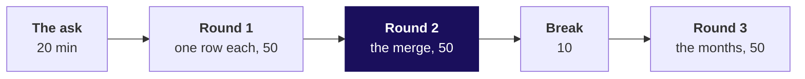
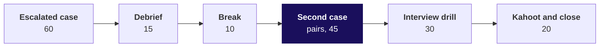

# Day sheet: Week 2, Thursday. The customer table Marketing refreshes every Monday

**TRAINER ONLY.** Nothing on this page reaches a learner.

Posts to <!-- sync:module:W02/D4 -->Module 1: Foundations of AI and Data<!-- /sync:module:W02/D4 -->, on <!-- sync:day-date:W02/D4 -->Thu 15 Oct 2026<!-- /sync:day-date:W02/D4 -->.

## The IITGN faculty block (tentative)

<!-- sync:faculty-day:W02/D4 -->
No IITGN faculty block on this day.
<!-- /sync:faculty-day:W02/D4 -->

| | |
|---|---|
| **Start from** | Three days of SQL and the Week 1 accumulators. Every pandas move lands on something the room did by hand; say which one, every time. |
| **Go as far as** | Every learner ships the customer table with a validated merge and one reshaped view, has run one question through all three tools, and writes the tool-choice note. |
| **Stop before** | MultiIndex depth, time-series indexing, `apply` with custom functions, performance tuning. Name each as later if asked; do not open it. |
| **Comes later** | Friday takes the table into Excel for the leadership deck. Week 4's cohorts and baskets run on this table; Week 5's model trains on it. Say that aloud once. |
| **Cut first** | `melt` to a sentence (S33 stays, notebook 3 section 4 goes self-study), then the D19 and D42 depth slides, then the Retail-Core variant S39 to S40. Never cut `validate=` or the three-tool re-expression. |

**The day's arc in one sentence.** The growth team's one-row-per-customer table is built three times
over, a round at a time, and each round meets a pandas default that would have shipped a wrong
number: recency from the wall clock, a merge with no validate, groupby dropping a missing key, and
pivot_table's mean.

**Idea count.** Six new decision sentences in the morning's 180 minutes, at the cap: groupby as the
automated accumulator, recency from the data's last date, validate= as the loud count check,
groupby's dropped missing key, pivot_table's default mean, and wide against long. The spine as a
LEFT JOIN from the customer list is Monday's idea returning. The afternoon adds one, the tool
choice as a defended judgment.

---

## Morning, 180 minutes

| Part | Slides, half one | Beside it | What must land | If short of time |
|---|---|---|---|---|
| The ask, 20 | S1 to S6 | The board's first two drawings | The grain named; the spine drawn with the room; the three checks written as numbers | S5's table read, not discussed |
| Round 1, 50 | S7 to D19 | Notebook 1; guided set Q1 to Q2; round 1 set | 301 against 340 and why; the dtype change; the recency trap with 166 and 111; the check, smallest recency 0 | S16 to S17 to 5 minutes; D19 self-study |
| Round 2, 50 | S20 to S31 | Notebook 2 and its your-turn cell; guided Q3 to Q4; round 2 set | Inner by default; the fan-out on invented records; the MergeError read aloud; the room finding Kalpa's own feed in the empty cell; first touch; the 100 percent reach | S21 read quickly; never cut S25 to S27 |
| Break, 10 | | | | |
| Round 3, 50 | S32 to S43 | Notebook 3 and its your-turn cell; round 3 set | 18 against 29 percent; the grand-total check; the order index read aloud; wide compares and long follows | S39 to S40 to a sentence; D42 self-study |

Each round runs: the question and its picture (5), the demonstration on Kalpa data (15), the trap
and its wrong number (10), the room's harder variant (15), Kavya's review (5).

---

## Afternoon, 180 minutes

| Part | Slides, half two | Beside it | What must land | If short of time |
|---|---|---|---|---|
| Escalated case, 60 | S1 to S3 | `unguided/C2_W02_D04_escalated_STUDENT.md`, `notebooks/C2_W02_D04_hands_on_STUDENT.ipynb` | Everyone reaches the four numbers: 340, Rs 19,84,00,000, 130, 111 | Part 5, the function, to the stretch |
| Debrief, 15 | S4 to S6 | The room's wrong numbers, collected during the case | Each wrong number traced to its default and its check | S5 to S6 are Friday's Kahoot return question; skip if needed |
| Break, 10 | | | | |
| Second case, 45 | S7 to S14 | `guided/C2_W02_D04_three_tools_STUDENT.md`, `notebooks/C2_W02_D04_three_tools_STUDENT.ipynb`, `unguided/C2_W02_D04_pick_tool_STUDENT.md` | The room writes the SQL first; the trainer runs it through plain Python and pandas and closes the loop; 2.363 to 1.842 in all three; the note with one refusal | pick_tool to three asks |
| Interview drill, 30 | S15 to S17 | The answers in one breath, below | Two learners per question, answer and follow-up | The follow-ups on S16 to four |
| Kahoot and close, 20 | S18 to S20 | `kahoot/C2_W02_D04_quiz_STUDENT.md` | The sentence to the growth team read aloud; the crux lines; Friday's question left open | None |

---

## The traps, with their exact wrong numbers

| Round | The plausible wrong answer | The decision it would have misled | The check that catches it | The fix and what changed |
|---|---|---|---|---|
| 1 | Win-back list of **166** customers, recency measured from `pd.Timestamp.today()` on Monday 19 October; smallest recency 21 days | 55 active customers sent a win-back discount; the list grows every Monday with no new data | Smallest recency must be 0 | `AS_OF = orders["order_date"].max()` (28 September); list is **111**; at 90 days, 74 honestly and 101 from the run day |
| 2 | Invented records on the slides and in the notebook: reached spend **Rs 34,700** where it is Rs 26,100. On Kalpa's own feed, the room's your-turn cell: a left merge of the 340-row table gives **346 rows**, spend **Rs 19,84,45,800** against the book's Rs 19,84,00,000 (Rs 45,800 too much), and reached customers' spend **Rs 9,24,780** against the true Rs 8,78,980 | The case for November's budget made with money nobody paid | Rows in against rows out; `validate="one_to_one"` raises `MergeError: Merge keys are not unique in right dataset; not a one-to-one merge` | First touch per customer by date, validate kept on: 340 rows, spend on the book, 130 reached |
| 2 | Reach **107**, conversion **100 percent**, starting from the feed with segment from the order rows | A marketing lead asking for the same budget on perfect conversion | Groups add back to rows: 107 against 130; `dropna=False` shows a missing group of 23 | Segment from the customer list: 130 reached, 107 bought, **82 percent** (Retail-Core 56 of 70, Retail-Plus 51 of 60) |
| 3 | Retail-Plus fall of **18 percent** (Q1 Rs 4,12,019 to Q2 Rs 3,37,266) from `pivot_table` with its default mean | The head of Retail-Plus defends a problem two-thirds of its real size | Grand total against the orders: Rs 7,49,286 against Rs 9,99,150 | `aggfunc="sum"`, `fill_value=0`: Rs 5,85,770 to Rs 4,13,380, a fall of **29 percent**; Retail-Core's sign flips from +1.5 to -1.8 percent |
| 3 | A pivot indexed by `order_id`: **355 rows** that look like a months view | "Who is drifting" cannot be read at all | Read the row labels aloud: KR-00125, an order | Index by `customer_id`: 107 members |

The runtime errors met on the way get two minutes and their last line: `ValueError: Index contains
duplicate entries, cannot reshape` from `pivot` (D42), and, in the lab, `ValueError: Encountered all
NA values` from `idxmax` on a row the merge left empty.

---

## The plants, and what to do if nobody finds them

Client zero v4 (`docs/07_Client_Zero.md`, section 7, locked v2.2), read from
`content/W02/D1/data/C2_W02_D01_warehouse_v4_STUDENT.sql`, plus today's feed
`content/W02/D4/data/C2_W02_D04_exposure_STUDENT.csv`.

| Plant | What the room is meant to find | Where | If nobody finds it |
|---|---|---|---|
| 6 duplicated customer keys in the exposure feed (C-0001, C-0002, C-0003, C-0006, C-0007 and C-0009, each re-sent on 11 August; 136 rows for 130 customers) | `validate="one_to_one"` raises where the count check only reported: 340 rows become 346 | Notebook 2's your-turn cell, S27 | After 5 minutes, ask a pair to read `len(table)` and `len(merged)` aloud and compare them; never name the ids |
| A customer whose months pivot wrongly if indexed by order (the row's plant): the generator plants none by name, so the order-indexed pivot is taught on Retail-Plus as a whole | Reading the row labels aloud | S38, notebook 3 section 3 | Ask what one row of the table is; have a learner read the first three labels |
| Wednesday's three falling Retail-Plus members (C-0161, C-0171, C-0175) | Not today's discovery. The escalated case's falling flag across all segments flags 9 customers, and no learner file names who | Escalated case part 3 | Nothing to find; do not name them |

Structural facts that are not plants, and can be said: 39 customers never ordered; the feed names
only Retail-Core and Retail-Plus customers; 23 reached customers never ordered.

---

## The day's numbers

| Number | Value |
|---|---|
| Orders, customers | 1,000 orders; 340 customers; 301 ordered; 39 never ordered |
| Book, two quarters | Rs 19,84,00,000 (Q1 Rs 10,00,00,000; Q2 Rs 9,84,00,000); Business Rs 19,65,99,040, 99.1 percent |
| As-of date | 28 September 2026 |
| Win-back at 60 days | 111 honest; 166 from 19 October; 55 wrongly listed (Business 5 against 19, Retail-Core 49 against 71, Retail-Plus 47 against 63, Student 10 against 13) |
| Win-back at 90 days | 74 honest; 101 from 19 October |
| Exposure | 130 customers reached (Retail-Core 70, Retail-Plus 60); 107 bought; 23 reached and never ordered |
| Retail-Plus months | 266 member-months; Q1 Rs 5,85,770, Q2 Rs 4,13,380, a fall of 29.4 percent; averaged 18 percent |
| Retail-Core | Summed a fall of 1.8 percent; averaged a rise of 1.5 percent |
| Student | Summed a rise of 33.9 percent; averaged 26.8 percent |
| Three tools | Retail-Plus orders per member: Q1 215 over 91, 2.363; Q2 140 over 76, 1.842; a fall of 22 percent |
| Falling flag, all segments | 9 customers; matches Wednesday's LAG query |

---

## Checkpoints, one learner each, under thirty seconds

After round 1: why did groupby return 301 rows? After round 2: which argument would have stopped the
merge, and what error does it raise? After round 3: what does `pivot_table` put in a cell when you do
not say? After the second case: which tool would you refuse for Finance's number?

---

## The interview answers in one breath

| Tag | Question | The answer in one breath |
|---|---|---|
| [S] | groupby in the split-apply-combine sentence | Split the orders by customer, apply max, count and sum to each group, combine one row per customer: GROUP BY, and Week 1's accumulator, written once. |
| [S] | merge against join | Same keys, same four shapes, same fan-out; pandas defaults to inner, runs in memory on a copy, and can refuse the wrong shape with validate. |
| [F] | Which argument raises on duplicate keys, which error | `validate="one_to_one"` (or one_to_many, many_to_one), raising `pandas.errors.MergeError` naming the side whose keys repeat. |
| [F] | pivot against melt | pivot widens a column's values into columns; melt folds columns back into rows. |
| [D] | Three tools, how do you choose | They agree, so choose by who must trust it: SQL for what Finance reruns and audits, pandas to iterate, plain Python to show every step; refuse a hand-edited sheet for Finance. |
| [F] | Fewer rows than the customer list | Built from order rows; start from the customer list, left-merge with validate, fill counts with 0. |
| [F] | Monday refresh raised MergeError | Read the repeated keys, find the cause, apply a business rule such as first touch, keep validate on. |
| [F] | Recency in a weekly job | From the data's last loaded date, carried in the table; the smallest recency is 0. |
| [F] | Pivot totals look low | Check aggfunc: the default is the mean; sum it and compare the grand total with the source. |
| [D] | 100 percent conversion | The non-converters fell out: check groups add back to rows, rerun with dropna=False, take segment from the customer list. |
| [S] | agg against transform | agg returns a row per group; transform returns a value per original row, like a window function. |
| [D] | The tool you would refuse for Finance | A hand-edited spreadsheet, because a typed-over cell has no trail back to the warehouse. |

---

## The practice lab, in one paragraph

The TA runs `exercises/practice/C2_W02_D04_lab_STUDENT.md` after the second block; the full note is
`trainer/C2_W02_D04_lab_note_TRAINER.md`. Problems 1 and 2 are letters (keys `cadbacbda`), problem 3
stages `idxmax` settling 98 ties by column order, and problem 4 is the Q2-only table with its three
checks (340 rows, Rs 9,84,00,000, smallest recency 0; 109 on a 30-day list, 180 from 19 October).

---

## The take-home and its plants

The staging snapshot (`data/C2_W02_D04_takehome_*_STUDENT.csv`) is `build_v4()` with seed 20261015.
Its plants: the exposure feed repeats six customers (C-0002, C-0003, C-0006, C-0007, C-0008 and
C-0009; 159 rows for 153 customers), so a naive merge gives 346 rows and adds Rs 51,690 of spend, and
reached spend reads Rs 10,47,780 against Rs 9,96,090; 31 customers never ordered, so a table built
from the orders has 309 rows; 11 reached customers never ordered, so reach from the order rows reads
142 at 100 percent against 153 and 142, 93 percent. Retail-Plus falls 36.4 percent summed and 31.3
averaged; Retail-Core 8.1 summed and 11.4 averaged. Friday opens by walking one learner's Part 3.

---

## Which file serves which moment

| Moment | File |
|---|---|
| The morning on screen | `slides/C2_W02_D04_half1_STUDENT.pptx` (source `.md`) |
| The afternoon on screen | `slides/C2_W02_D04_half2_STUDENT.pptx` (source `.md`) |
| Rounds 1 to 3 demonstrated | `notebooks/C2_W02_D04_01_customer_table_STUDENT.ipynb`, `_02_exposure_merge_`, `_03_months_pivot_` |
| The defaults, flipped live | `demos/C2_W02_D04_merge_STUDENT.html` |
| The board | `whiteboards/C2_W02_D04_three_tools_STUDENT.md` |
| Items during and after rounds | `exercises/guided/C2_W02_D04_firstmoves_STUDENT.md`; `unguided/..._groupby_`, `_merge_`, `_shapes_` |
| The escalated case and its solution | `exercises/unguided/C2_W02_D04_escalated_STUDENT.md`, `notebooks/C2_W02_D04_hands_on_STUDENT.ipynb`, `exercises/solutions/C2_W02_D04_hands_on_solution_STUDENT.ipynb` |
| The second case and its solution | `exercises/guided/C2_W02_D04_three_tools_STUDENT.md`, `notebooks/C2_W02_D04_three_tools_STUDENT.ipynb`, `unguided/..._pick_tool_`, and the solutions |
| The Kahoot | `kahoot/C2_W02_D04_quiz_STUDENT.md` |
| After class | `study-notes/`, `cheatsheets/` (PDF), `takehome/`, `extras/`, `preread/` |
