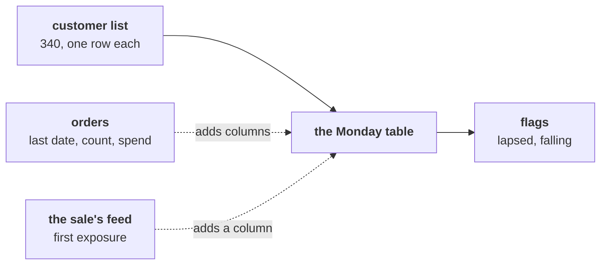
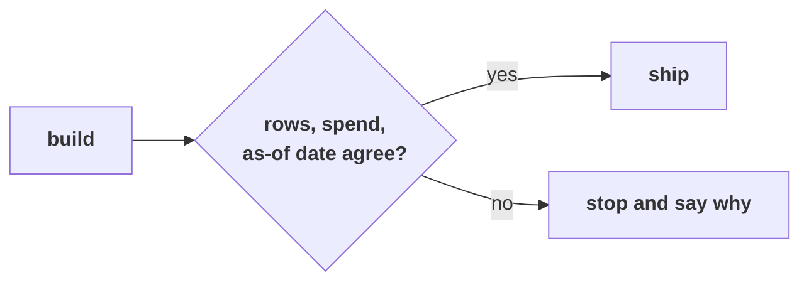
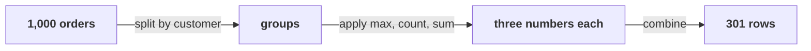
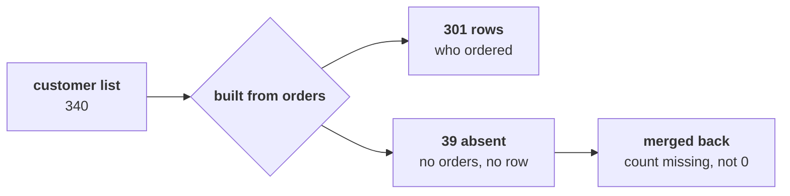
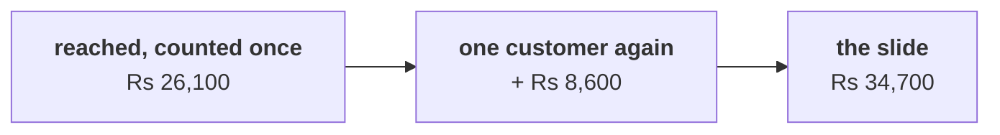
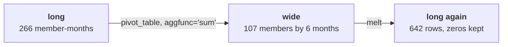
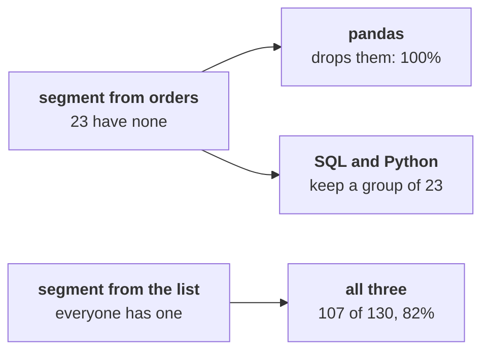
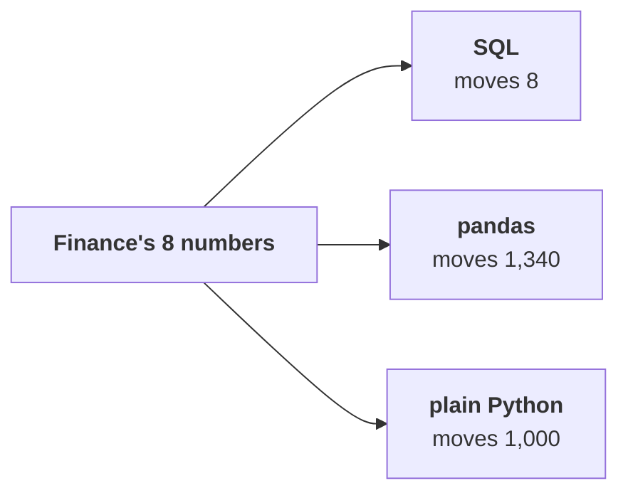
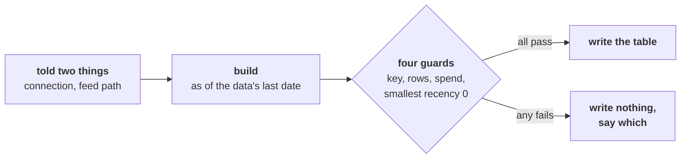

# Which drawings go up on the board, in order, to build the growth team's Monday table?

The growth team at Kalpa Retail wants one table, one row per customer, refreshed every Monday: how
recently each customer bought, how often, how much, their segment, whether the monsoon sale reached
them, and the flags it acts on, built in pandas from the warehouse. The warehouse holds 1,000 orders
from April to September 2026 and a customer list of 340 customers. The drawings below go up in the
order the day draws them, and each one answers the question above it.

---

## What does one row of the Monday table stand for, and where does each column come from?

The first drawing goes up before any tool opens and stays all day. The customer list decides how many
rows there are; the orders and the campaign platform's feed only add columns; the flags are computed
from those columns. Each chapter lights one arrow.

---

## Which three numbers must the table agree with before it leaves the team?

Three numbers go up on the right of the first drawing and stay: 340 rows, Rs 19,84,00,000 of spend,
and the as-of date, 28 September 2026, the last date the data covers. Every chapter adds a way the
table can fail one of them, and chapter 6 makes the refresh refuse to ship when one fails.

---

## What does one line of `groupby` do to 1,000 order rows?

Week 1's loop, written once: split the orders into one group per customer, apply the latest date, a
count and a sum to each group, combine one row per customer. Beside it goes the arithmetic that sends
the room back to the first drawing: 340 on the list, 301 who ordered, 39 that `groupby` never saw.

---

## Why does the first-order nudge filter find nobody?

The hurried filter for a frequency of 0 finds 0 customers. The table was built from orders, so a
customer who never ordered has no row; merged back onto the list, their count arrives missing, and a
missing value is never equal to 0. The fix goes up beside it: the list as the spine, `how="left"`,
`validate="one_to_one"`, the count filled with 0 on purpose, 39 on the nudge list.

---

## Which customers does each merge keep, and what does `validate` promise?

Tuesday's four joins go up again in pandas' words, with the default ringed: `merge` with no `how` is
an inner join. Under it, `validate="one_to_one"`: each key at most once on each side, or the merge
stops with a `MergeError` before any table exists.

| SQL, Tuesday | pandas, today | What survives |
|---|---|---|
| `INNER JOIN` | `merge(how="inner")`, the default | Only keys on both sides |
| `LEFT JOIN` | `merge(how="left")` | Every row of the left table |
| `RIGHT JOIN` | `merge(how="right")` | Every row of the right table |
| `FULL OUTER JOIN` | `merge(how="outer")` | Every key from either side |

---

## What does one re-sent row do to a slide of reached spend?

Four invented customers and a feed that names one of them twice: four customers go in and five rows
come out, and the slide says the reached customers spent Rs 34,700 where they spent Rs 26,100. The
difference is that one customer's whole Rs 8,600, counted again. The growth team's rule goes up
beside it: one row per customer, the first date the sale reached them, then the guarded merge.

---

## Long or wide, and what does `pivot_table` put in each cell?

The long table, one row per member and month with orders, 266 rows for Retail-Plus, goes up on the
left; the wide table, one row per member and one column per month, 107 by 6, on the right. Between
them, `pivot_table` with its `aggfunc` written out. Under them, the two falls: 18 percent with the
default mean, 29.4 percent with `aggfunc="sum"`, Rs 5,85,770 to Rs 4,13,380. The check in a box: the
grand total equals the orders.

---

## Why did three tools disagree about who bought, and what made them agree?

The marketing lead's share: reached customers who bought. Plain Python filed 23 reached customers
under `None`, SQL put them in a `NULL` group, and pandas dropped them and said 100 percent. Taking the
segment from the customer list made all three say 107 of 130, 82 percent.

---

## Which size separates the three tools for Finance's eight numbers?

Two columns go up side by side. Rows returned: 8, 8 and 8, a tie. Rows moved out of the warehouse:
SQL 8, pandas 1,340, plain Python 1,000. Under them, the note's owners: SQL for Finance's revenue,
pandas for the growth team's table and the months view, plain Python for the auditor's one-off, and
one refusal, a pandas notebook for Finance's numbers.

---

## What does the refresh do every Monday, and when does it refuse to ship?

A line from 28 September to 19 October goes up first, with "21 days, no new data" on it: counted to
the run day, the win-back list holds 166; counted to the data's last date, 111. Then the refresh as one
function, with its four guards each against a number the warehouse gives on its own.

---

## What is on the board when the day ends?

The first drawing stays, with each arrow ringed as its chapter lit it and the three numbers beside it:
340 rows, Rs 19,84,00,000 and 28 September 2026. Beside them sit the day's answers: 39 who never
ordered, 130 reached, a Retail-Plus fall of 29.4 percent, 107 of 130 who bought, SQL for Finance's
number, and 111 on the win-back list. Photograph it before the room clears, because Friday starts from
the table it describes.
