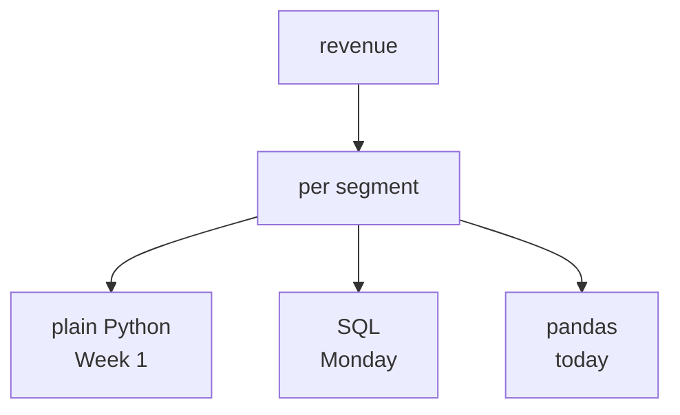
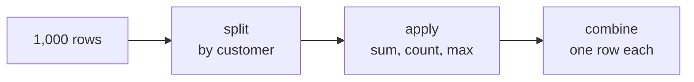
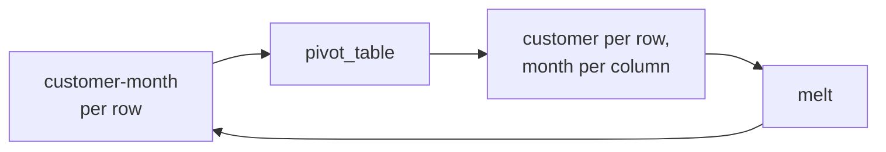

# The board work: the same node, three times, side by side

## The drawing that holds the day

Draw the Week 1 revenue tree once more, small, in the corner. Circle one node: revenue per
segment. Everything below is that one node, written three ways.



## The three versions, written up together

Write all three on the board at the same time, not in sequence. The comparison is the content.

```python
# Week 1
totals = {}
for o in orders:
    totals[o["segment"]] = totals.get(o["segment"], 0) + o["amount"]
```

```sql
-- Monday
SELECT segment, sum(amount) FROM orders
JOIN customers USING (customer_id) GROUP BY segment;
```

```python
# Today
orders.groupby("segment")["amount"].sum()
```

Ask which is shortest, then ask whether that matters. It usually does not, and hearing the room
work that out is better than saying it.

## The three questions that actually pick a tool

Write these three under the code and leave them up all afternoon.

```
Who owns this number?
For how long?
Who has to be able to read it?
```

None of them is about syntax, and between them they pick the tool nearly every time. Run a few
of Marketing's and Finance's asks through them out loud.

## The split-apply-combine drawing



Point at Week 1's dictionary while drawing it. The room wrote the splitting and the combining by
hand; `groupby` does those two and leaves the applying, which was the only part that was ever
about the question.

## The long and wide drawing

Two grids side by side, same numbers.



Then write one question under each: "how did this move" under the long one, "how do these
compare" under the wide one. Nothing was added or removed between them; the shape decided which
question is easy.

## What to leave on the board

```
Warehouse: numbers Finance acts on.
pandas:    the analyst's own iteration.
Python:    anything you must explain line by line.
Refuse:    Finance's Monday number in a notebook.
```

The last line is the one the senior analyst is actually testing for.
