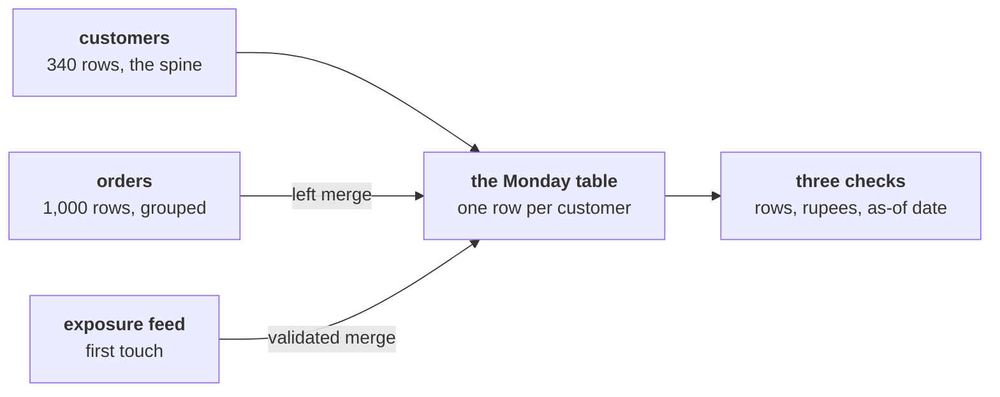
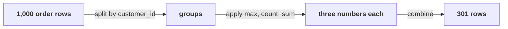
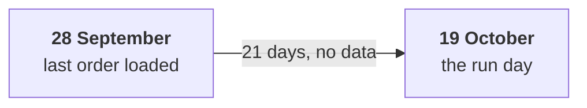
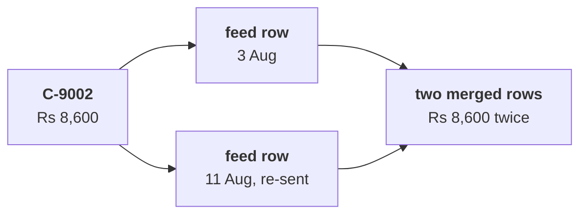
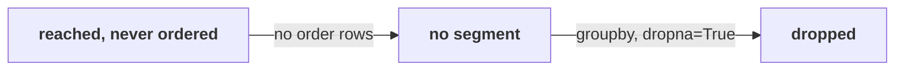
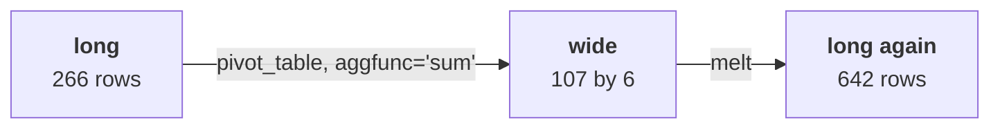
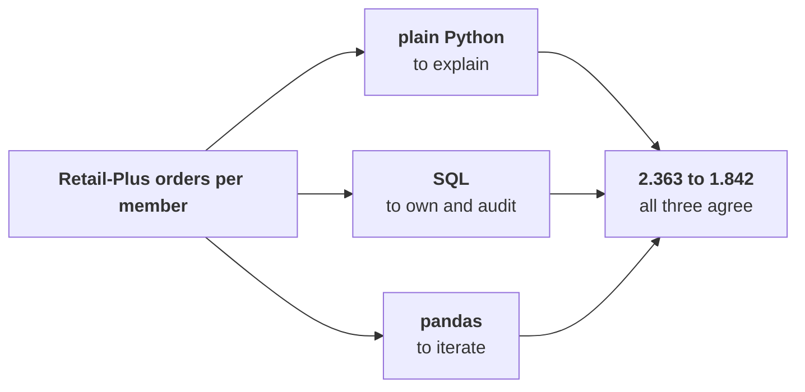

# The Monday table, as it goes up on the board

The board work for Week 2, Thursday, in the order it is drawn. The deck, the notebooks, the
companion page and the cheat sheet carry the same picture, so what a learner copies here is what
they meet everywhere else today.

---

## First drawing: the grain, before any column

`ONE ROW PER CUSTOMER` goes across the top of the board. Under it, the three things a row must not
be: a row per order, a row per month, a row per campaign touch. Every trap today is a table that
quietly changed its grain.

---

## Second drawing: the spine and what hangs on it

```mermaid
flowchart LR
    C["<b>customers</b><br/>340 rows, the spine"] --> T["<b>the Monday table</b><br/>one row per customer"]
    O["<b>orders</b><br/>1,000 rows, grouped"] -->|"left merge"| T
    E["<b>exposure feed</b><br/>first touch"] -->|"validated merge"| T
    T --> K["<b>three checks</b><br/>rows, rupees, as-of date"]
```

The exposure feed box is drawn dashed until the room has checked whether it holds one row per
customer. The three checks go up as numbers on the right: 340, Rs 19,84,00,000, 28 September.

---

## Third drawing: split, apply, combine

```mermaid
flowchart LR
    R["<b>1,000 order rows</b>"] -->|"split by customer_id"| G["<b>groups</b>"]
    G -->|"apply max, count, sum"| A["<b>three numbers each</b>"]
    A -->|"combine"| T["<b>301 rows</b>"]
```

Beside it, the arithmetic that sends the room back to the spine: 340 on the list, 301 who ordered,
39 that groupby never saw.

---

## Fourth drawing: the calendar and the data

```mermaid
flowchart LR
    A["<b>28 September</b><br/>last order loaded"] -->|"21 days, no data"| B["<b>19 October</b><br/>the run day"]
```

Under it: win-back at 60 days, 166 from the run day, 111 from 28 September. The check, written in a
box: the smallest recency is 0.

---

## Fifth drawing: one customer, two feed rows

```mermaid
flowchart LR
    A["<b>C-9002</b><br/>Rs 8,600"] --> B["<b>feed row</b><br/>3 Aug"]
    A --> C["<b>feed row</b><br/>11 Aug, re-sent"]
    B --> D["<b>two merged rows</b><br/>Rs 8,600 twice"]
    C --> D
```

The records are invented and labelled so on the board. Under it: 4 rows in, 5 rows out, and
`validate="one_to_one"` written as the check made loud.

---

## Sixth drawing: the missing key

```mermaid
flowchart LR
    A["<b>reached, never ordered</b>"] -->|"no order rows"| B["<b>no segment</b>"]
    B -->|"groupby, dropna=True"| C["<b>dropped</b>"]
```

Under it: 107 reached at 100 percent from the order rows; 130 reached, 107 bought, 82 percent from
the customer list.

---

## Seventh drawing: long, wide, long

```mermaid
flowchart LR
    L["<b>long</b><br/>266 rows"] -->|"pivot_table, aggfunc='sum'"| W["<b>wide</b><br/>107 by 6"]
    W -->|"melt"| B["<b>long again</b><br/>642 rows"]
```

Beside it, two numbers for Retail-Plus Q1 to Q2: 18 percent with the default mean, 29 percent summed.

---

## Last drawing: one question, three tools

```mermaid
flowchart LR
    Q["<b>Retail-Plus orders per member</b>"] --> P["<b>plain Python</b><br/>to explain"]
    Q --> S["<b>SQL</b><br/>to own and audit"]
    Q --> D["<b>pandas</b><br/>to iterate"]
    P --> A["<b>2.363 to 1.842</b><br/>all three agree"]
    S --> A
    D --> A
```

## What is on the board when the day ends

The spine drawing with its three checks filled in, the four defaults each with its wrong number and
its check (166 against 111, a copied spend, 100 against 82 percent, 18 against 29 percent), and the
three-tool drawing with one reason under each tool. Photograph it before the Kahoot.
