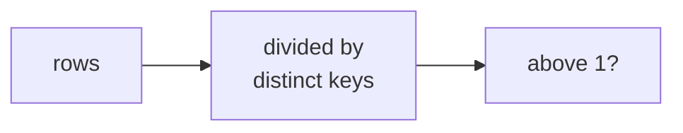

# The last mile: Excel, and what never goes in it

## Panel 1: Grain, before anything else

**Crux:** What one row means decides whether a pivot over the file is honest, and a file browser
cannot show you that.



| The file says | One row is | A pivot over it |
|---|---|---|
| customer table | One customer | Correct |
| raw export | One order-payment pair | Roughly double |

Write the grain into the filename or the first sheet. It costs one line.

## Panel 2: A pivot is only as honest as its table

**Crux:** The pivot sums the column it is given across the rows it is given, so every check you
would run on the pivot passes while the total is twice the truth.

The fan-out from Tuesday did not go away. It moved into a file that makes it invisible, and
filtering the pivot to one segment makes the wrong number look smaller and more plausible.

## Panel 3: A lookup must fail visibly

**Crux:** The fourth argument decides whether a missing id returns an error, your words, or a
neighbouring member's real data.

```
=XLOOKUP(id, keys, values, "not in the table")
=IFERROR(INDEX(values,MATCH(id,keys,0)),
         "not in the table")
```

| Written as | On a missing id |
|---|---|
| No fourth argument | `#N/A` |
| A not-found string | Your words |
| Approximate match | The next larger member |

`#N/A` is ugly and truthful. A neighbour's row is tidy, wrong and complete-looking, and nobody
questions a row that looks complete.

## Panel 4: Portability, which bites once

**Crux:** XLOOKUP needs Excel 2021 or LibreOffice 24.8 and later; INDEX with MATCH computes
everywhere.

Send the sheet where you know what will open it. "Nothing that needs Python" does not mean
"opens identically everywhere", and a `#NAME?` in front of a director is a bad way to find out.

## Panel 5: One number, read correctly

**Crux:** A figure with no denominator, period and comparison gets those three supplied by
whoever reads it.

> Rs 9.84 crore collected in Q2 across 462 orders, against Rs 10.00 crore in Q1, a fall of
> 1.6 percent driven by Retail-Plus frequency.

The sentence beside a chart names the branch. A director reading a falling line with no sentence
will attach their own reason, and it travels with the chart.

## Panel 6: The operating rule

**Crux:** Three homes and one condition, and the condition is the part people forget.

| Lives in | Owns | Never |
|---|---|---|
| Warehouse | Numbers Finance acts on | Exploration |
| pandas | The analyst's iteration | The source of truth |
| Excel | Presentation and poking | Cleaning, joining, the truth |

**Whatever is in Excel must be rebuildable from the warehouse in one run.** The first hand-typed
correction breaks it: either the fix is lost on rebuild, or it is kept and the sheet has become a
source of truth nobody chose.
