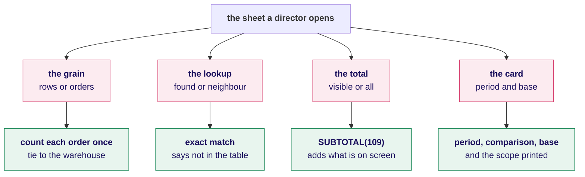

# The last mile

Kalpa Retail, Week 2 Friday. A sheet lies silently at its grain, its lookup, its total and its card,
so each deliverable ships with the check that catches its lie, and the warehouse keeps the number.

## Panel 1: The sheet a director opens, and its four silent lies


```mermaid
flowchart TB
    S["<b>the sheet a director opens</b>"]
    S --> G["<b>the grain</b><br/>rows or orders"]
    S --> L["<b>the lookup</b><br/>found or neighbour"]
    S --> V["<b>the total</b><br/>visible or all"]
    S --> C["<b>the card</b><br/>period and base"]
    G --> G2["<b>count each order once</b><br/>tie to the warehouse"]
    L --> L2["<b>exact match</b><br/>says not in the table"]
    V --> V2["<b>SUBTOTAL(109)</b><br/>adds what is on screen"]
    C --> C2["<b>period, comparison, base</b><br/>and the scope printed"]
    classDef bad fill:#FCEBF0,stroke:#D63A6A,color:#1A0F5C
    classDef good fill:#E8F5EE,stroke:#1F8A5B,color:#1A0F5C
    class G,L,V,C bad
    class G2,L2,V2,C2 good
```

Each red box prints a plausible number and no error, and the green box under it is the fix. On
Friday's exports a Sum over 1,450 payment rows read Rs 39.41 crore against the warehouse's Rs 19.84
crore, C-0195 came back as a neighbour's Rs 16,740, Mumbai's foot read Rs 7,14,890 for Rs 1,56,790
on screen, and a bare Rs 19.84 crore read as a doubled quarter.

**Crux:** Every lie is silent, so every deliverable ships with its check, and one that fails its
check is held with its reason.

## Panel 2: The grain check, and the fix formula

| Check | What Friday's raw export showed |
|---|---|
| Rows against ids | 1,450 rows hold 1,000 orders. |
| Total against the warehouse | Rs 39,40,95,490 stands against Rs 19,84,00,000. |
| Remove Duplicates | It leaves 1,400 rows at Rs 39,40,57,740. |

```
flag: =IF(COUNTIF($A$2:A2,A2)=1,1,0)
tree: =SUMIFS(order_amount, segment, "Retail-Plus",
              quarter, "Q2", flag, 1)
```

Counted once per order, the tree ties to the rupee: Rs 10.00 crore in Q1, Rs 9.84 crore in Q2.

**Crux:** A pivot is only as honest as the rows under it: say the grain, count rows against ids, tie
the total to the warehouse.

## Panel 3: A lookup has two exits

```
=XLOOKUP(id, ids, revenue, "not in the table")
=IFERROR(INDEX(revenue, MATCH(id, ids, 0)),
         "not in the table")
=VLOOKUP("C-0195", table, 5)   4th argument left out
```

XLOOKUP matches exactly by default and shows if_not_found for a missing id. VLOOKUP with
range_lookup left out matches approximately, so C-0195 returned C-0194's Rs 16,740 at rank 15. Test
every lookup with an id you know is missing.

**Crux:** A lookup that cannot find an id says so; an approximate match answers with a neighbour.

## Panel 4: The foot of a filtered list

| At the foot | Rows a filter hid | Rows hidden by hand |
|---|---|---|
| `SUM` | Added | Added |
| `SUBTOTAL(9, r)` | Left out | Added |
| `SUBTOTAL(109, r)` | Left out | Left out |

Mumbai's 11 members spent Rs 1,56,790 while a SUM foot read Rs 7,14,890. `=SUBTOTAL(102, r)` counts
the visible numbers the foot should be adding.

**Crux:** The foot of a filtered list adds only what the director can see: SUBTOTAL(109), never
SUM.

## Panel 5: The card and its parts

> Q2, July to September 2026: Rs 9.84 crore, down 1.6 percent on Q1, April to June 2026 (Rs 10.00
> crore).

A change is Q2 minus Q1 over Q1: Retail-Plus is down 29.4 percent, and 41.7 if divided by Q2. A bare
Rs 19.84 crore reads as a doubled quarter.

| Scope, a yellow input | The card says |
|---|---|
| All segments | Rs 9.84 crore, down 1.6%; 100.0% of revenue |
| All except Business | Rs 8.15 lakh, down 17.3%; 0.8% of revenue |
| Retail-Plus | Rs 4.13 lakh, down 29.4%; 0.4% of revenue |

**Crux:** One number reaches the front page with its period, its comparison and its base.

## Panel 6: The operating rule

| Tool | What it owns |
|---|---|
| The warehouse | It owns the number, and every join, dedupe and cleaning step. |
| pandas | It owns the analyst's iteration. |
| Excel | It owns the last mile, and takes what-ifs as labelled inputs. |

The drift check ties the sheet's Q2 total to the warehouse's at every refresh.

**Crux:** The warehouse owns the number, pandas owns the iteration, Excel owns the last mile, and
nobody types over the source.

## Panel 7: The director's what-if

Typed over Q2, five lakh reads down 14.6 percent against Finance's 29.4 until Monday's refresh wipes
it, so the what-if goes into a yellow input beside the actual:

| Line | Retail-Plus, Q2 on Q1 | Where it comes from |
|---|---|---|
| Actual | -29.4% | The export |
| Scenario | -14.6% | A yellow input of Rs 5,00,000 |

**Crux:** Say yes to the question and no to the edit: the what-if sits beside the actual, never over
it.
