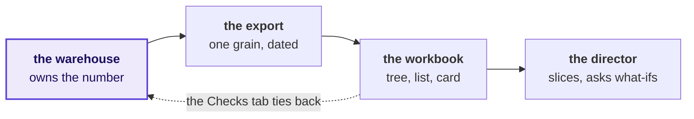

# Week 2 Friday: What can a director open, change and still trust?

Meera's chief of staff wants three things for Monday's growth review that open without a login, the
revenue tree by segment for both quarters, the top-fifty protect list with a lookup, and one
front-page number with its trend, on a sheet that recalculates when a director changes an
assumption.

## Panel 1: Where can a number go wrong between the warehouse and a director?


```mermaid
flowchart LR
    W["<b>the warehouse</b><br/>owns the number"] --> E["<b>the export</b><br/>one grain, dated"]
    E --> X["<b>the workbook</b><br/>tree, list, card"]
    X --> D["<b>the director</b><br/>slices, asks what-ifs"]
    X -.->|"the Checks tab ties back"| W
    classDef known fill:#EEEAFB,stroke:#5B3FD6,color:#1A0F5C,stroke-width:2px
    class W known
```

The warehouse, Kalpa's Postgres database of one row per order, owns Q1's Rs 10,00,00,000 and Q2's
Rs 9,84,00,000. Each box can print a wrong number with no error: the export can repeat rows, the
workbook can answer a lookup with the wrong row or add rows nobody sees, and the director can read a
number against the wrong period. Every number ties back to the warehouse before a director reads it.

## Panel 2: Which segment carries the revenue, and which leaf separates the tiers?

Revenue is customers times orders per customer times revenue per order.

| Segment | Share | Orders per customer | Revenue per order |
|---|---|---|---|
| Business | 99.1% | 4.82 | Rs 10,45,740 |
| Retail-Plus | 0.5% | 3.29 | Rs 2,801 |
| Retail-Core | 0.4% | 2.99 | Rs 1,886 |

Averaged per customer, Business reads Rs 11,66,786 an order, and the tree multiplies back Rs 2.28
crore over.

**Crux:** Every leaf of the tree is a ratio of the pivot's sums, and the tree multiplies back to its revenue before it goes on a page.

## Panel 3: How does the tree for both quarters tie to the warehouse?

| Check | What the raw export showed |
|---|---|
| Rows against ids | 1,450 payment rows hold 1,000 orders. |
| Total against the warehouse | Rs 39.41 crore stands against Rs 19.84 crore. |
| Remove Duplicates | 1,400 rows still total Rs 39.41 crore. |

Flag each order's first row with `=IF(COUNTIF($A$2:A2,A2)=1,1,0)` and add only flagged rows: Q1
reads Rs 10.00 crore and Q2 Rs 9.84 crore, down 1.6 percent, and Retail-Plus falls 29.4 percent as
orders per customer drop from 2.36 to 1.84.

**Crux:** Say the grain before you pivot: count rows against keys, count each order once, and tie the total to the warehouse.

## Panel 4: Does the lookup answer for the member typed in?

```
=XLOOKUP(id, A:A, E:E, "not in the table")
=IFERROR(INDEX(E:E, MATCH(id, A:A, 0)),
         "not in the table")
=VLOOKUP("C-0195", A2:F301, 5)   4th argument left out
```

Left out, VLOOKUP's fourth argument means approximate match, so C-0195, a member with no row,
returned C-0194's Rs 16,740 at rank 15. XLOOKUP needs Excel 2021, 2024 or Microsoft 365. The fifty
run from Rs 25,840 to a cut-off of Rs 8,580, and the list ships once its source ties.

**Crux:** A lookup that cannot find an id says so: an exact match with a not-found path, tested with an id you know is missing.

## Panel 5: What must sit beside the front-page number?

> All segments, Q2, July to September 2026: Rs 9.84 crore, down 1.6 percent on Q1, April to June
> 2026 (Rs 10.00 crore); 100.0 percent of company revenue in Q2.

A bare Rs 19.84 crore is two quarters and reads as up 98.4 percent. Retail-Plus's 29.4 percent is
Rs 1.72 lakh on Rs 5.86 lakh, 0.4 percent of revenue, and divided by Q2 it would read 41.7. Without
Business the card reads down 17.3 percent, so each card prints its scope.

**Crux:** One number reaches the front page with its period, its comparison and its base, and every percentage carries its rupees.

## Panel 6: Which tool owns which step, and how do the two stay in step?

| Tool | What it owns |
|---|---|
| The warehouse | The number, and every join, dedupe and rank Finance relies on |
| pandas | The analyst's iteration, until Finance relies on it |
| The workbook | Presenting, slicing, looking up and labelled what-ifs |

A lookup doing Tuesday's join read Rs 11,83,81,974 collected; every payment added once gives
Rs 19,66,45,070, Rs 17,54,930 short, exactly the unpaid orders. The Checks tab compares totals,
live, with the control totals sent on a tab beside each export.

**Crux:** The warehouse owns the number and every join, dedupe and rank Finance relies on; pandas owns the iteration; the workbook owns the last mile, and nobody types over the source.

## Panel 7: What can a director change without breaking the sheet?

| The foot | Rows a filter hides | Rows hidden by hand |
|---|---|---|
| `SUM` | Added | Added |
| `SUBTOTAL(9, r)` | Left out | Added |
| `SUBTOTAL(109, r)` | Left out | Left out |

Filtered to Mumbai, SUM read Rs 7,14,890 while the eleven on screen spent Rs 1,56,790. A what-if
goes in a yellow cell, and `=B1*SUBTOTAL(103, A2:A51)` prices a Rs 500 voucher at Rs 5,500 for
Mumbai.

**Crux:** A director gets yellow inputs, formulas everywhere else, SUBTOTAL at every foot, and a Checks tab whose release holds whatever does not tie.
