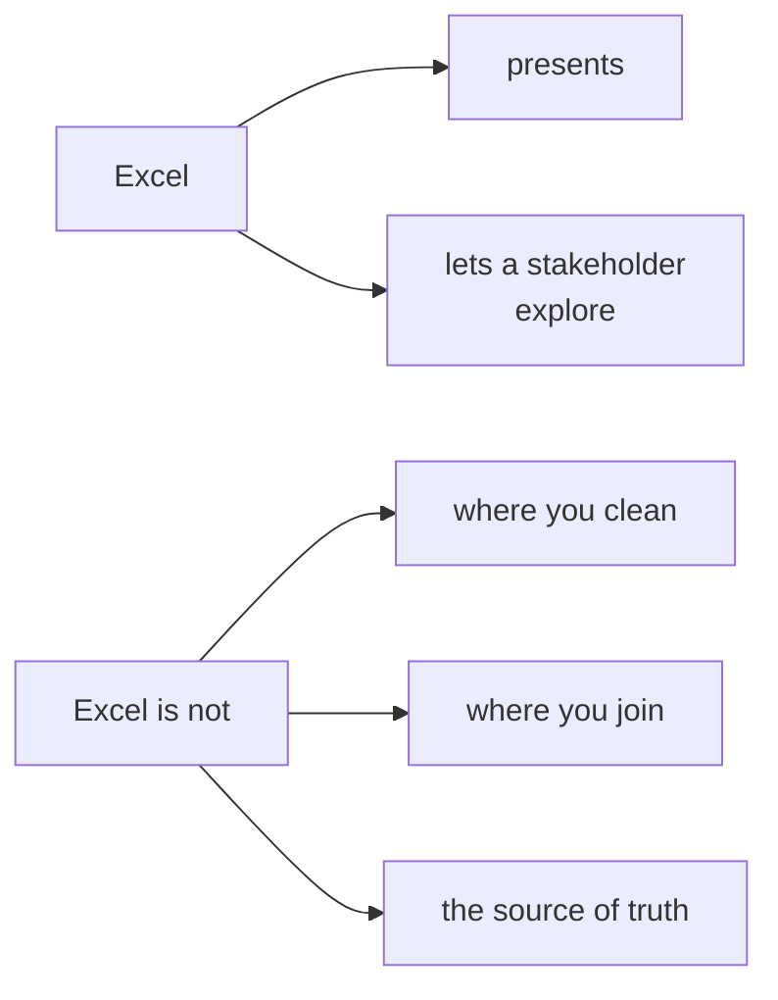
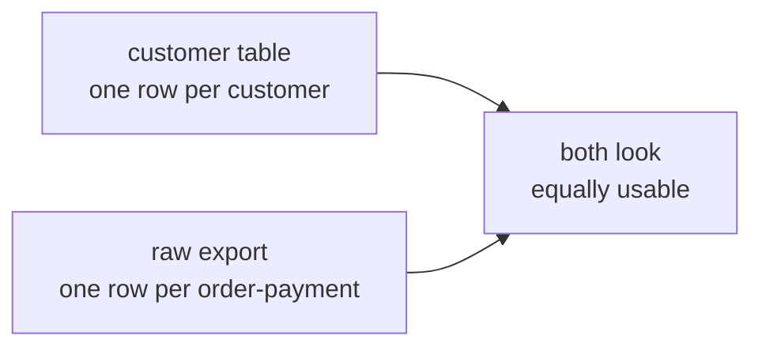
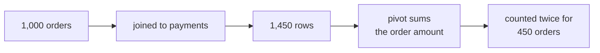
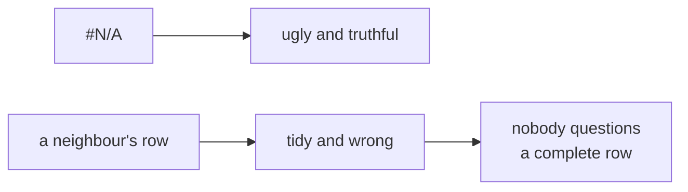
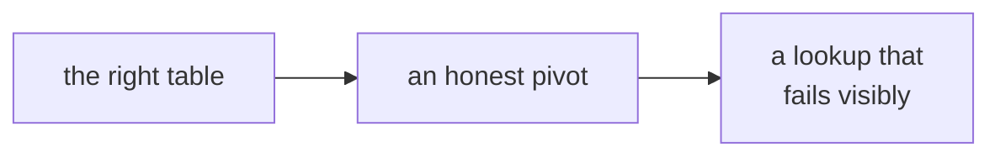

# Half one: the last mile, and the pivot that lied

Week 2, Day 5. Slide source. One idea per slide.

Position bar, repeated at every section boundary:
`[the chief of staff's three asks] > [the table underneath] > [the pivot] > [the lookup]`

---

## SECTION A. Three things, no login

---

## S1. Meera's office runs on Excel
> "Monday's growth review deck needs three things I can open on my laptop without a login: the
> revenue tree by segment for both quarters, the top-fifty protect list with a lookup so I can
> find any member by id, and one number on the front page with its trend. Nothing that needs
> Python."

Her chief of staff. This is not a downgrade. It is the last mile.

---

## S2. And one sentence that raises the stakes
> "If a director changes an assumption in the room, the sheet must recalculate in front of them."

Live, in front of people, with somebody's hand on the keyboard.

---

## S3. The senior analyst repeats yesterday's challenge
> "Everything you built this week has to survive a room that only has Excel. Which parts belong in
> Excel, which parts must never be in Excel, and how do you keep the two from drifting apart?"

Yesterday's tool note becomes a team operating rule today.

---

## S4. What Excel is for, and what it is not


---

## D1. The reason is one sentence long
A sheet with a typed-over cell has no audit trail.

Somebody can change a number in a cell and the formula that used to sit there is gone, with no
record that it ever existed. Every other objection to spreadsheets is a consequence of that one.

---

## SECTION B. The table underneath

---

## S5. Two exports arrived

Yesterday's customer table, clean. And a raw export of orders joined to payments, straight from
the warehouse.

They look equally usable. One of them is not.

---

## S6. Build the pivot on the raw export first
Segment down the side, quarter across the top, revenue in the middle. Thirty seconds of clicking.

The total is higher than the warehouse says.

---

## S7. Which is Tuesday, in a spreadsheet

The fan-out did not go away. It moved into a file that makes it invisible.

---

## S8. A pivot is only as honest as the table under it
The pivot did nothing wrong. It summed the column it was given, across the rows it was given.

Every check you would run on the pivot passes. The problem was upstream and arrived in the file.

---

## D2. Which is why the export is part of the deliverable
When you hand somebody a CSV, you are handing them every decision you made about grain.

"One row per order" and "one row per order-payment" look identical in a file browser and produce
totals that differ by a factor of two. Write the grain into the filename or into the first sheet.

---

## S9. Rebuilt on the clean table
Same clicks, same layout, and now the total matches the warehouse.

Nothing about Excel changed. The table under it did.

---

## SECTION C. The lookup that fails quietly

---

## S10. The chief of staff wants to find a member by id
```
=XLOOKUP(H2, A:A, C:C)
```
Find `H2` in column A, return the matching value from column C.

---

## S11. One member id is not in the table
A member who has not ordered in the two quarters is absent from the customer table, which is
correct: the table is built from orders.

Type their id into the lookup and see what happens.

---

## S12. It depends entirely on the fifth argument
| Written as | On a missing id |
|---|---|
| `=XLOOKUP(H2, A:A, C:C)` | Returns `#N/A` |
| `=XLOOKUP(H2, A:A, C:C, "not found")` | Returns your words |
| `=XLOOKUP(H2, A:A, C:C, , 1)` | Returns the **next larger** match |

The third one is the dangerous one, and it is the one people copy from a tutorial.

---

## D3. Why the neighbour is worse than the error

`#N/A` is ugly and truthful. A neighbouring member's data is tidy and wrong, and it carries a real
name, a real spend and a real segment.

Nobody questions a row that looks complete. That is the whole failure, and it is why the fourth
argument gets filled in rather than left empty.

---

## S13. Where half one leaves you

You can build a pivot on the right table, say why the wrong one doubled, and write a lookup that
fails visibly rather than plausibly.

Half two puts one number on a front page and writes the rule that keeps all of it from drifting.
