# What can a director open, change and still trust?

Week 2, Day 5. Half one.

Kicker: WEEK 2  ·  FRIDAY  ·  HALF ONE
Quote: Monday's growth review deck needs three things I can open on my laptop without a login. If a director changes an assumption in the room, the sheet must recalculate in front of them.
Who: Meera's chief of staff, Kalpa Retail, to the data and AI team at Kalpa's Global Capability Centre

```notes
LIVE, one minute. Read the chief of staff's message aloud and leave it on screen. The day is one
question climbed in six chapters: what can a director open on Monday without a login, change in the
room, and still trust. Five chapters this morning, the sixth after lunch, then the escalated case
alone and the director's edit in pairs. Excel is the tool the room holds today; the notebooks are the
second route to every number.
```

---

## S1. Six questions answer the chief of staff
*What can a director open on Monday without a login, change in the room, and still trust?*

```timeline
label: Chapter 1 | title: Which segment carries it? | body: The tree by segment, from the customer table.
label: Chapter 2 | title: Where did Q2 fall? | body: Both quarters, from the raw export.
label: Chapter 3 | title: Find any member by id? | body: The protect list and a lookup.
label: Chapter 4 | title: Read right in two minutes? | body: The front-page number.
label: Chapter 5 | title: What must Excel never do? | body: The rule behind all three.
label: Chapter 6 | title: Can a director break it? | body: The checks that stop them. | tone: dark
```

```notes
LIVE, 3 minutes. Read the day's question, then the six chapter questions in order. Each chapter's
answer raises the next question: the customer table cannot split the quarters, so chapter 2 opens
the raw export; the fall sits partly in a paid tier, so chapter 3 protects its best members; and so
on. Tell the room every chapter ends on a number and a sentence they could send.
Transition: first, what exactly was asked.
```

---

## S2. Three deliverables and one hard condition
*What exactly did the chief of staff ask for?*

**The client asks.** "Monday's growth review deck needs three things I can open on my laptop without a login: the revenue tree by segment for both quarters, the top-fifty protect list with a lookup so I can find any member by id, and one number on the front page with its trend. Nothing that needs Python. If a director changes an assumption in the room, the sheet must recalculate in front of them."

| What was asked | What it becomes | Chapters |
|---|---|---|
| The revenue tree by segment, both quarters | A pivot that ties to the warehouse | 1 and 2 |
| The protect list and a lookup by id | A ranked list and a lookup that says when an id is missing | 3 |
| One number with its trend | A card with its period, comparison and base | 4 |
| Recalculates when a director changes an assumption | Yellow inputs, formulas everywhere else, and checks | 5 and 6 |

```notes
LIVE, 5 minutes. Read the message aloud, then the last row: it is the hardest line in the brief and it
applies to everything. Kavya's challenge sits under it: which parts belong in Excel, which must never
be there, and how do the two stay in step. That is chapter 5.
Transition: before any tool opens, where could a sheet like this go wrong?
```

---

## S3. What could make a sheet lie without an error?
*Before Excel opens: where can each number go wrong on its way to a director?*

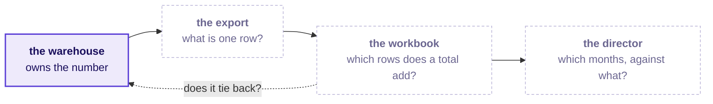
```mermaid
flowchart LR
    W["<b>the warehouse</b><br/>owns the number"] --> E["<b>the export</b><br/>what is one row?"]
    E --> X["<b>the workbook</b><br/>which rows does a total add?"]
    X --> D["<b>the director</b><br/>which months, against what?"]
    X -.->|"does it tie back?"| W
    classDef unknown fill:#FFFFFF,stroke:#B8B2D6,color:#6B6690,stroke-dasharray:4 3
    classDef known fill:#EEEAFB,stroke:#5B3FD6,color:#1A0F5C,stroke-width:2px
    class E,X,D unknown
    class W known
```

**Question.** Where would you check first, as a letter? a) the export: what one row stands for; b) the workbook: which rows a total adds; c) the director: what a number is read against; d) the warehouse itself.

```notes
LIVE, 7 minutes. Draw this on the board with the room and leave it up all day: it is the day's
picture. Pairs, two minutes: one way each box could produce a wrong number that raises no error.
Expect: rows that are payments, a lookup that answers wrong, a total under a filter, a card with no
period. The point is the list; the letter comes next.
```

---

## S4. Answer: the export first; every number sits on it
*Where does the day start, and what does the finished picture look like?*

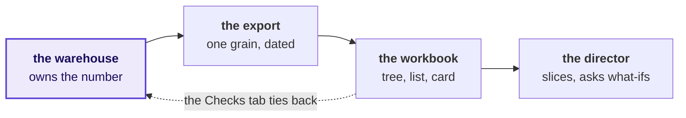
```mermaid
flowchart LR
    W["<b>the warehouse</b><br/>owns the number"] --> E["<b>the export</b><br/>one grain, dated"]
    E --> X["<b>the workbook</b><br/>tree, list, card"]
    X --> D["<b>the director</b><br/>slices, asks what-ifs"]
    X -.->|"the Checks tab ties back"| W
    classDef known fill:#EEEAFB,stroke:#5B3FD6,color:#1A0F5C,stroke-width:2px
    class W known
```

The answer is a, for cost more than likelihood: saying what one row stands for takes a minute and rules a whole family of wrong numbers in or out. The dashed arrow is the day's discipline: every number in the workbook ties back to the warehouse before a director reads it.

```notes
LIVE, 5 minutes. This is the finished picture; the cheat sheet's first panel and the board carry the
same drawing. The warehouse owns the number, the export carries one grain, the workbook presents it,
the director slices and asks what-ifs, and the Checks tab ties the workbook back.
Transition: chapter 1, the first deliverable, from the table Marketing already has.
```

---

## SECTION 1: Which segment carries it?
*Which segment carries Kalpa's revenue, and which leaf of the tree separates the segments? Page two of Monday's deck rides on it.*

```notes
LIVE. Thirty minutes. Notebook C2_W02_D05_01_segment_tree runs beside it as the second route.
Excel live on data/C2_W02_D05_customer_table_STUDENT.csv.
```

---

## S5. Answer it in six steps, from one row to the tree
*Who needs the answer, and what must we find out on the way?*

**Who needs the answer.** The chief of staff, whose tree by segment is page two of Monday's deck; a leaf computed the wrong way puts a tree on the page that does not multiply back to its own revenue.

```timeline
label: 1 | title: One row? | body: What one row of the table stands for.
label: 2 | title: Which way? | body: Pivot, formula grid, pasted values or a dashboard.
label: 3 | title: Which segment? | body: Who carries the revenue.
label: 4 | title: Which leaf? | body: What separates Retail-Plus from Retail-Core.
label: 5 | title: Averaged leaf? | body: What averaging per customer does.
label: 6 | title: Quarters? | body: Whether the table can split Q1 from Q2. | tone: dark
```

```notes
LIVE, 1 minute. Read the six smaller questions; they are the notebook's headings and the chapter's
objectives. Ask the room to hold one number in mind for question 4: how much more a Retail-Plus
member spends than a Retail-Core shopper.
```

---

## S6. The tree by segment is page two of Monday's deck
*What is at stake, who asks, and what does a wrong leaf cost?*

```stats
value: Revenue | label: the metric | note: booked order value, April to September
value: Chief of staff | label: who asks | note: page two of Monday's deck
value: Trust | label: what a wrong leaf costs | note: a tree that does not multiply back
```

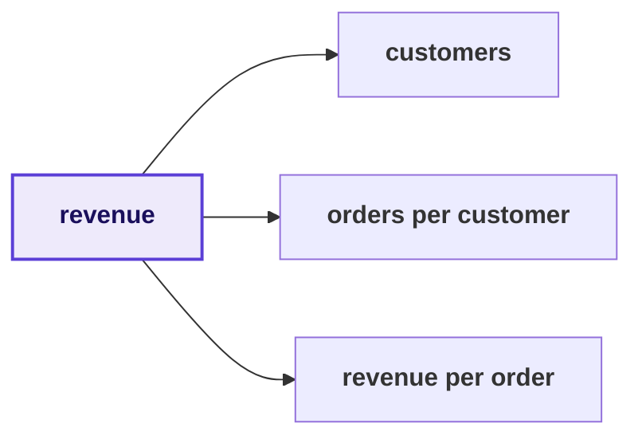
```mermaid
flowchart LR
    R["<b>revenue</b>"] --> C["<b>customers</b>"]
    R --> F["<b>orders per customer</b>"]
    R --> O["<b>revenue per order</b>"]
    classDef known fill:#EEEAFB,stroke:#5B3FD6,color:#1A0F5C,stroke-width:2px
    class R known
```

```notes
LIVE, 2 minutes. Revenue here is booked order value: every order at its price, whatever became of it.
The tree is Week 1 Monday's: customers times orders per customer times revenue per order. The
segments: Retail-Core, everyday shoppers; Retail-Plus, the paid membership tier; Business, corporate
buyers invoiced in large amounts; Student. The first director who multiplies a leaf back and gets a
different revenue stops trusting page three.
```

---

## S7. Costco reports its sales by member tier
*Which real company answers the same question?*

```stats
value: 81.0 m | label: paid members | note: Costco, year to 31 August 2025
value: 38.7 m | label: Executive members | note: the paid upgrade tier
value: ~73.6% | label: of net sales | note: from the Executive tier
```

> "The sales penetration of Executive members represented approximately 73.6% of worldwide net sales in 2025." Costco Form 10-K, fiscal 2025

```notes
LIVE, 1 minute. Source: Costco's 10-K for the year to 31 August 2025, on sec.gov, checked 30 September
2026. Say "approximately" as the filing does. The question is the one Kalpa asks of Retail-Plus: how
much revenue does the paid tier carry, and through which leaf.
```

---

## S8. A PivotTable, with each leaf beside it
*Which way should the director get the tree, and what does each way cost on this table?*

| Option | What it takes here | What a director can slice | Recalculates |
|---|---|---|---|
| a) PivotTable | 1 pivot and 8 leaf formulas | any of 6 columns, in seconds | on Refresh |
| b) SUMIFS grid | 12 formulas reading 3,600 cells | only what was built; a city split adds 72 | at once |
| c) Pasted values | 0 formulas | nothing | never |
| d) Live dashboard | a query per view | anything | needs a login |

**The call.** a, because a director re-slices in the room and only the pivot answers a question nobody built. What would switch it: a director who changes an assumption, since a pivot waits for Refresh and a formula does not; chapter 6.

```notes
LIVE, 4 minutes. The sizing is on this table: 300 rows, 6 columns; 4 segments times 3 measures is 12
formulas, each reading 300 rows. Option d fails the brief on the login. Ask which option a director
would break first; hold the answer for chapter 6.
```

---

## S9. What does one row of the customer table stand for?
*Before any pivot, what is the grain of this table?*

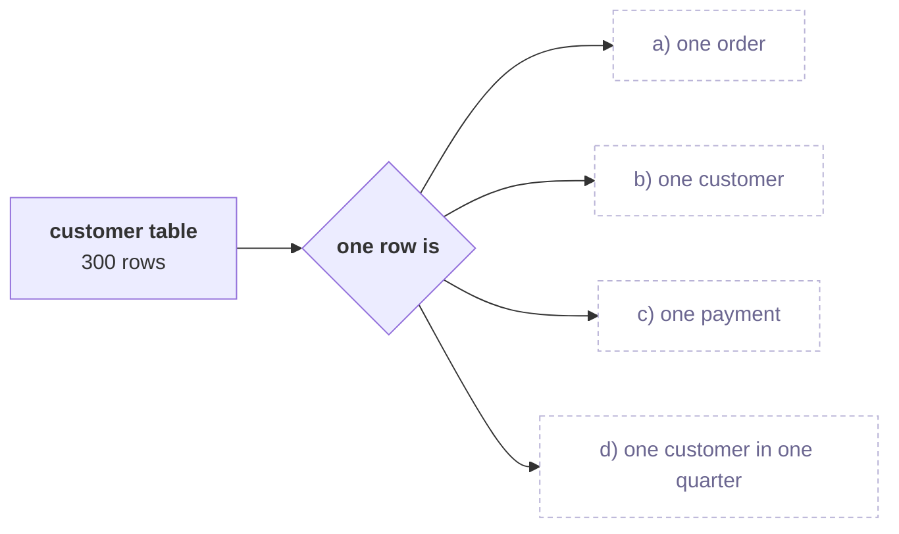
```mermaid
flowchart LR
    T["<b>customer table</b><br/>300 rows"] --> Q{"<b>one row is</b>"}
    Q --> A["a) one order"]
    Q --> B["b) one customer"]
    Q --> C["c) one payment"]
    Q --> D["d) one customer in one quarter"]
    classDef unknown fill:#FFFFFF,stroke:#B8B2D6,color:#6B6690,stroke-dasharray:4 3
    class A,B,C,D unknown
```

**Question.** One row of this table is which, as a letter?

```notes
LIVE, 1 minute. Letters in the chat. Open the CSV in Excel and scroll it while they answer.
```

---

## S10. Answer: one customer, so a Sum adds each once
*What does the count say?*

```stats
value: 300 | label: rows | note: in the CSV
value: 300 | label: distinct ids | note: one per row
value: 6 | label: columns | note: id, segment, city, orders, revenue, last order date
```

The answer is b. Each row is one customer who ordered between April and September 2026, with that customer's orders and revenue summed. **The check:** rows equal distinct ids, 300 and 300.

```notes
LIVE, 2 minutes. In Excel: =COUNTA(A2:A301) and a distinct count beside it. The habit is what
matters: the grain is said aloud before any pivot, because chapter 2's export will not be so kind.
```

---

## S11. Which segment carries the revenue?
*With segment in Rows and revenue in Values, whose bar is longest?*

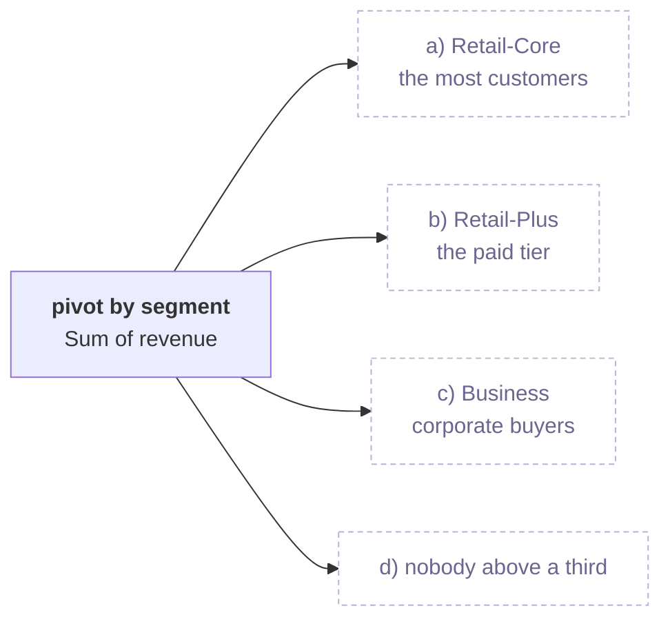
```mermaid
flowchart LR
    P["<b>pivot by segment</b><br/>Sum of revenue"] --> A["a) Retail-Core<br/>the most customers"]
    P --> B["b) Retail-Plus<br/>the paid tier"]
    P --> C["c) Business<br/>corporate buyers"]
    P --> D["d) nobody above a third"]
    classDef unknown fill:#FFFFFF,stroke:#B8B2D6,color:#6B6690,stroke-dasharray:4 3
    class A,B,C,D unknown
```

**Question.** Which segment carries most of the revenue, as a letter?

```notes
LIVE, 1 minute. Build it live: select the table, Insert, PivotTable, segment to Rows, customer_id to
Values (Excel counts text), orders and revenue to Values (Excel sums numbers by default, Microsoft
Support, checked 30 September 2026). Take letters before you drag revenue in.
```

---

## S12. Answer: Business carries 99.1 percent
*What does the pivot show, segment by segment?*

| Segment | Customers | Orders | Revenue | Share |
|---|---|---|---|---|
| Business | 39 | 188 | Rs 19,65,99,040 | 99.1% |
| Retail-Core | 131 | 392 | Rs 7,39,320 | 0.4% |
| Retail-Plus | 106 | 349 | Rs 9,77,410 | 0.5% |
| Student | 24 | 65 | Rs 62,490 | 0.0% |

The answer is c. Thirty-nine corporate buyers carry the half-year, so any company-wide number on the page is a Business number, and a consumer segment can fall by a third without moving it.

```notes
LIVE, 2 minutes. Point at the share column: Student rounds to 0.0 percent. Ask what a company-wide
revenue number can say about members. Almost nothing, and chapter 4 has to live with that.
```

---

## S13. Which leaf separates Retail-Plus from Retail-Core?
*A Retail-Plus member spends more across the half-year; which leaf of the tree says why?*

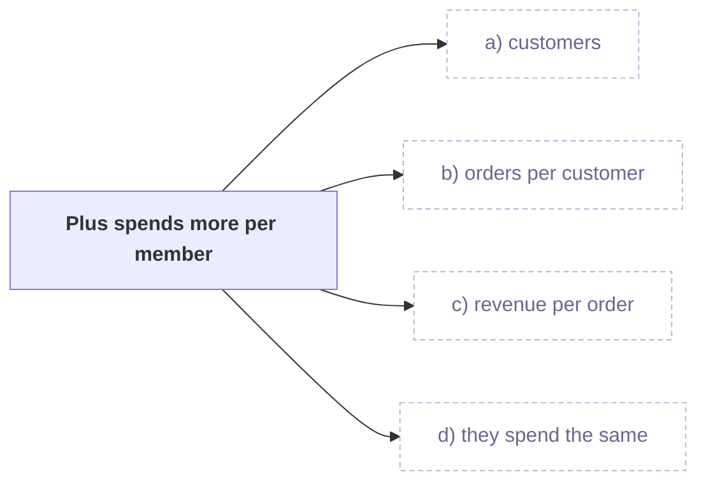
```mermaid
flowchart LR
    G["<b>Plus spends more per member</b>"] --> A["a) customers"]
    G --> B["b) orders per customer"]
    G --> C["c) revenue per order"]
    G --> D["d) they spend the same"]
    classDef unknown fill:#FFFFFF,stroke:#B8B2D6,color:#6B6690,stroke-dasharray:4 3
    class A,B,C,D unknown
```

**Question.** Which leaf explains most of the gap in revenue per member, as a letter?

```notes
LIVE, 1 minute. In Excel, two formulas beside the pivot: orders divided by customers, revenue divided
by orders, each reading the pivot's own sums. Letters first.
```

---

## S14. Answer: the basket, 48.5 percent bigger
*What do the leaves say, with Retail-Core at 100?*

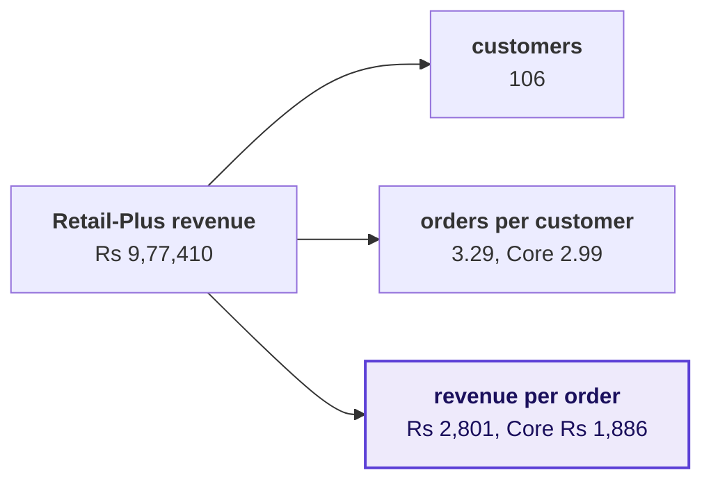
```mermaid
flowchart LR
    R["<b>Retail-Plus revenue</b><br/>Rs 9,77,410"] --> C["<b>customers</b><br/>106"]
    R --> F["<b>orders per customer</b><br/>3.29, Core 2.99"]
    R --> O["<b>revenue per order</b><br/>Rs 2,801, Core Rs 1,886"]
    classDef known fill:#EEEAFB,stroke:#5B3FD6,color:#1A0F5C,stroke-width:2px
    class O known
```

The answer is c. A Retail-Plus member spends Rs 9,221 across the half-year against Retail-Core's Rs 5,644, 63 percent more: orders per customer are 10 percent higher, revenue per order 48.5 percent higher. **The check:** each tree multiplies back to its revenue, 106 times 3.29 times Rs 2,801 is Rs 9.77 lakh.

```notes
LIVE, 2 minutes. Multiply back aloud. The paid tier's members fill bigger baskets; hold that thought
for chapter 2, where the question is which leaf moved between the quarters.
Transition: now the way a hurried analyst builds the same leaf.
```

---

## S15. What does a leaf averaged per customer say?
*What happens when a per-customer ratio column is dragged into the pivot?*

| The move | What the pivot shows for Business |
|---|---|
| Drag the per-customer column into Values | Sum of it: Rs 4,55,04,669, plainly nonsense |
| Switch the field to Average | ? |
| Revenue divided by orders, the tree's leaf | Rs 10,45,740 |

**Question.** The Average reads about: a) exactly Rs 10,45,740; b) a little below it; c) about 12 percent above it; d) about twice it.

```notes
LIVE, 1 minute. Build it live: add =E2/D2 as a column, drag it in, watch Excel sum it, switch to
Average. Take letters before the value shows.
```

---

## S16. Answer: Rs 11,66,786, and the tree fails
*Why is the averaged leaf the plausible wrong answer, and what catches it?*

```stats
value: Rs 11,66,786 | label: averaged per customer | note: what the pivot shows
value: Rs 10,45,740 | label: revenue over orders | note: the tree's leaf
value: +Rs 2.28 cr | label: the multiply-back error | note: 188 orders times the averaged leaf
```

The answer is c, 11.6 percent high. **What breaks:** 39 times 4.82 times Rs 11.67 lakh rebuilds Business at Rs 21.94 crore against the Rs 19.66 crore it sold, and the director who checks stops trusting the page. **Why:** the average gives each customer one vote, and Business baskets range twentyfold, Rs 3.34 lakh to Rs 66.98 lakh.

```notes
LIVE, 4 minutes. The check that catches it is the multiply-back from S14. The consumer segments barely
move (Core Rs 1,884 against Rs 1,886) because their baskets are alike; the averaged leaf is wrong
everywhere and badly wrong where customers differ most in size.
```

---

## S17. The fix: a ratio of the pivot's own sums
*What changes when the leaf is revenue divided by orders?*

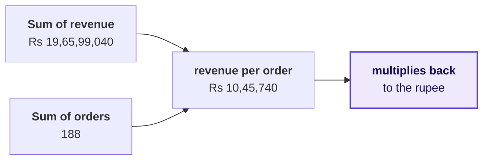
```mermaid
flowchart LR
    S["<b>Sum of revenue</b><br/>Rs 19,65,99,040"] --> L["<b>revenue per order</b><br/>Rs 10,45,740"]
    O["<b>Sum of orders</b><br/>188"] --> L
    L --> M["<b>multiplies back</b><br/>to the rupee"]
    classDef known fill:#EEEAFB,stroke:#5B3FD6,color:#1A0F5C,stroke-width:2px
    class M known
```

A formula beside the pivot, or a calculated field `=revenue/orders`: "Formulas for calculated fields operate on the sum of the underlying data" (Microsoft Support, checked 30 September 2026). **What changed:** Business falls from Rs 11,66,786 to Rs 10,45,740 an order and the tree multiplies back exactly.

```notes
LIVE, 2 minutes. Show both ways in Excel. A JPMorgan Chase task force found a risk spreadsheet that
"divided by their sum instead of their average, as the modeler had intended" (report of 16 January
2013, page 128, checked 30 September 2026): a ratio on the wrong total at a bank's scale.
```

---

## S18. Can this table split Q1 from Q2?
*With only a last order date, can the half-year be split into quarters?*

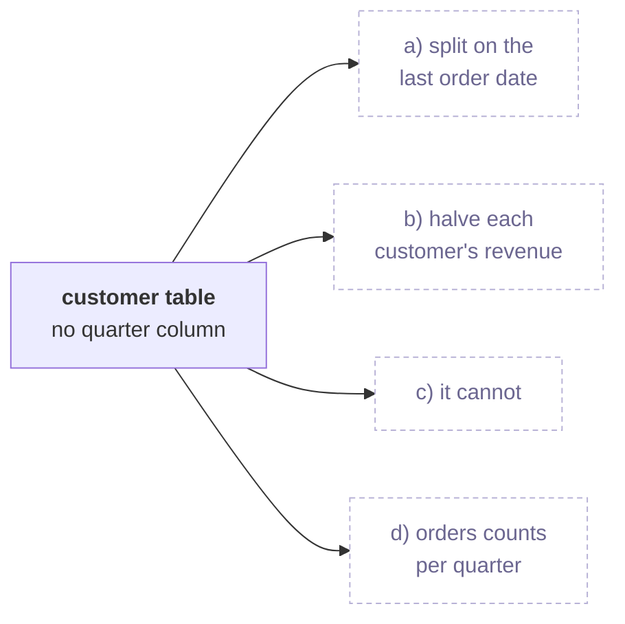
```mermaid
flowchart LR
    T["<b>customer table</b><br/>no quarter column"] --> A["a) split on the<br/>last order date"]
    T --> B["b) halve each<br/>customer's revenue"]
    T --> C["c) it cannot"]
    T --> D["d) orders counts<br/>per quarter"]
    classDef unknown fill:#FFFFFF,stroke:#B8B2D6,color:#6B6690,stroke-dasharray:4 3
    class A,B,C,D unknown
```

**Question.** How does this table give Q1 against Q2, as a letter?

```notes
LIVE, 1 minute. Option a is the tempting one. Ask what happens to a customer who bought every month
and once more in September.
```

---

## S19. Answer: it cannot; the last order date is a recency
*What would the split on the last order date put in Q2?*

```stats
value: Rs 17.88 cr | label: Q2, split on last order | note: against Monday's Rs 9.84 crore
value: Rs 1.96 cr | label: Q1, split on last order | note: against Monday's Rs 10.00 crore
value: 0 | label: quarter columns | note: in the table
```

The answer is c. A customer who bought in both quarters moves the whole half-year into Q2 by buying once in September. The quarter split needs one row per order, which only the raw export carries: chapter 2.

```notes
LIVE, 1 minute. This is the question chapter 1's answer raises: the chief of staff asked for both
quarters, and the only export with order dates is the raw one.
```

---

## S20. A second route: a plain count of the CSV
*Does a method that never touches the pivot reach the same twelve cells?*

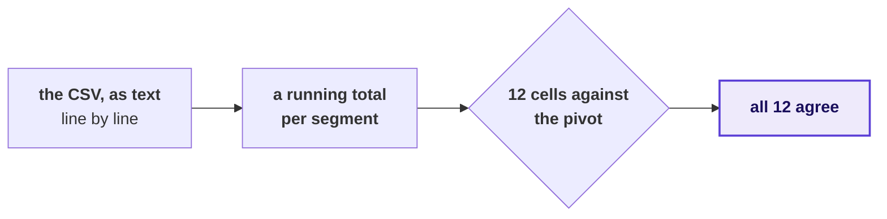
```mermaid
flowchart LR
    C["<b>the CSV, as text</b><br/>line by line"] --> T["<b>a running total<br/>per segment</b>"]
    T --> K{"<b>12 cells against<br/>the pivot</b>"}
    K --> P["<b>all 12 agree</b>"]
    classDef known fill:#EEEAFB,stroke:#5B3FD6,color:#1A0F5C,stroke-width:2px
    class P known
```

In Excel the same second route is a COUNTIF and two SUMIFS per segment beside the pivot; in the notebook, Week 1 Monday's accumulator over the CSV's text. Customers, orders and revenue agree in all four segments.

```notes
LIVE, 1 minute. A second route has to be able to fail when the first is wrong, so it cannot reuse the
pivot. This one would have caught the averaged leaf and a filter left on the pivot. It cannot tell you
whether the table itself is complete; that is a different check, in chapter 3.
```

---

## S21. Business carries it; the basket separates the tiers
*What did chapter 1 answer, question by question?*

| Question | Answer |
|---|---|
| One row? | One customer: 300 rows, 300 ids |
| Which way? | The PivotTable, each leaf beside it from its sums |
| Which segment? | Business, 99.1 percent of the half-year |
| Which leaf? | Revenue per order: Rs 2,801 against Rs 1,886 |
| Averaged leaf? | Rs 11,66,786, 11.6 percent high; the tree fails |
| Quarters? | No; the split needs one row per order |

**Kavya's review.** "Say what one row is before you pivot, make every leaf a ratio of the pivot's sums, and multiply the tree back before it goes on a page."

**In the interview.** [D] A leaf of your tree does not multiply back to the revenue; what happened, and what do you fix?

```notes
LIVE, 3 minutes. One learner answers the interview question aloud in under a minute: averaged over
rows instead of divided over totals; Rs 11,66,786 against Rs 10,45,740; recompute as a ratio of sums
and keep the multiply-back as the check.
Transition: the chief of staff asked for both quarters, so the raw export.
```

---

## SECTION 2: Where did Q2 fall?
*How much did revenue fall from Q1 to Q2, and in which segment and which leaf? The growth plan funds the branch this answer names.*

```notes
LIVE. Thirty minutes. Notebook C2_W02_D05_02_both_quarters beside it; Excel live on
data/C2_W02_D05_raw_export_STUDENT.csv.
```

---

## S22. Answer it in six steps, from the quarter to the tie
*Who needs the answer, and what must we find out on the way?*

**Who needs the answer.** The chief of staff, for the tree for both quarters, and Meera, who decides which branch the growth plan funds; a pivot that counts orders twice puts nearly twice Finance's revenue in front of the directors.

```timeline
label: 1 | title: Which quarter? | body: Kalpa's quarter on every row.
label: 2 | title: The pivot says? | body: Q1 and Q2 as a pivot adds them.
label: 3 | title: Why double? | body: And whether Remove Duplicates helps.
label: 4 | title: Counted once? | body: Each order once.
label: 5 | title: Which leaf fell? | body: Segment and leaf.
label: 6 | title: Warehouse agrees? | body: The second route. | tone: dark
```

```notes
LIVE, 1 minute. Read the six questions. Say the chapter 1 finding in one line: Business carries 99.1
percent, and the basket separates the tiers; the customer table cannot split the quarters.
```

---

## S23. The quarters have to tie to Monday's warehouse
*What is at stake, who asks, and what does a wrong number cost?*

```stats
value: Rs 10.00 cr | label: Q1, the warehouse | note: April to June 2026
value: Rs 9.84 cr | label: Q2, the warehouse | note: July to September 2026
value: The plan | label: what a wrong number costs | note: a growth plan aimed at the wrong segment
```

**The client asks.** "The revenue tree by segment for both quarters."

```notes
LIVE, 1 minute. Monday's warehouse queries gave Rs 10,00,00,000 for Q1 and Rs 9,84,00,000 for Q2.
Kalpa's financial year starts in April, so Q1 is April to June. Every number on the deck ties to
these, or it does not go on the deck.
```

---

## S24. Razorpay orders carry several payments
*Which real company holds orders and payments at different grains?*

> "Combines multiple payment attempts for a single order." Razorpay documentation, Orders

> "Each partial payment would have a unique payment_id, but will be tied to the same order_id." Razorpay documentation, Payment Links partial payments

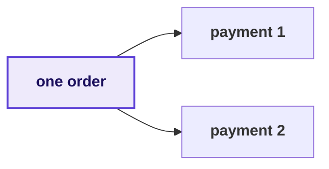
```mermaid
flowchart LR
    O["<b>one order</b>"] --> P1["<b>payment 1</b>"]
    O --> P2["<b>payment 2</b>"]
    classDef known fill:#EEEAFB,stroke:#5B3FD6,color:#1A0F5C,stroke-width:2px
    class O known
```

```notes
LIVE, 1 minute. Both pages checked 30 September 2026. Every merchant's finance team meets this: an
export of payments repeats its orders. Do not say what Kalpa's export holds yet; the room finds it.
```

---

## S25. A quarter column, then the pivot
*Which way should the team split revenue by quarter, and what does each way cost?*

| Option | What it reads | What it risks here |
|---|---|---|
| a) Customer table, last order date | 300 rows | 170 customers bought in both quarters; Rs 8.04 crore of Q1 lands in Q2 |
| b) SUMIFS grid on the raw export | 8 formulas, 34,800 tests | recalculates at once; slices only 8 cells |
| c) Kalpa's quarter as a column, then a pivot | 1,450 rows | slices anything; recalculates on Refresh |
| d) Ask the data platform lead | the warehouse | exact, and a day's wait per question |

**The call.** c, because it labels quarters the way Finance does and lets a director re-slice. What would switch it: a deadline far enough away for the warehouse team to answer.

```notes
LIVE, 3 minutes. Size each option on this export. Option a's cost comes from chapter 1: a last order
date is a recency. Option d is exact and too slow for a meeting; chapter 5 comes back to who owns
which number.
```

---

## S26. Which quarter does each row belong to?
*Filled down beside order_date, how many rows land in Q1?*

```text
=IF(MONTH(E2)<=6,"Q1","Q2")
```

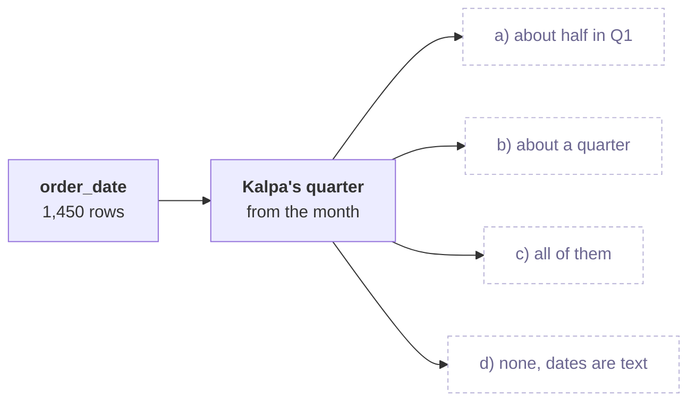
```mermaid
flowchart LR
    D["<b>order_date</b><br/>1,450 rows"] --> F["<b>Kalpa's quarter</b><br/>from the month"]
    F --> A["a) about half in Q1"]
    F --> B["b) about a quarter"]
    F --> C["c) all of them"]
    F --> N["d) none, dates are text"]
    classDef unknown fill:#FFFFFF,stroke:#B8B2D6,color:#6B6690,stroke-dasharray:4 3
    class A,B,C,N unknown
```

**Question.** Of the 1,450 rows, how many fall in Q1, as a letter?

```notes
LIVE, 1 minute. Type the formula live in a new column beside order_date and fill it down.
```

---

## S27. Answer: 772 rows in Q1, 678 in Q2
*What does the new column say?*

```stats
value: 772 | label: rows in Q1 | note: April to June 2026
value: 678 | label: rows in Q2 | note: July to September 2026
value: 1,450 | label: rows in all | note: every row has a quarter
```

The answer is a. The dates read cleanly and the labels now match Finance's. The pivot is one drag away.

```notes
LIVE, 1 minute. Keep it moving; the next slide is where the chapter's trap waits.
```

---

## S28. What does the pivot say for Q1 and Q2?
*With segment in Rows, quarter in Columns and order_amount summed, what is Q2?*

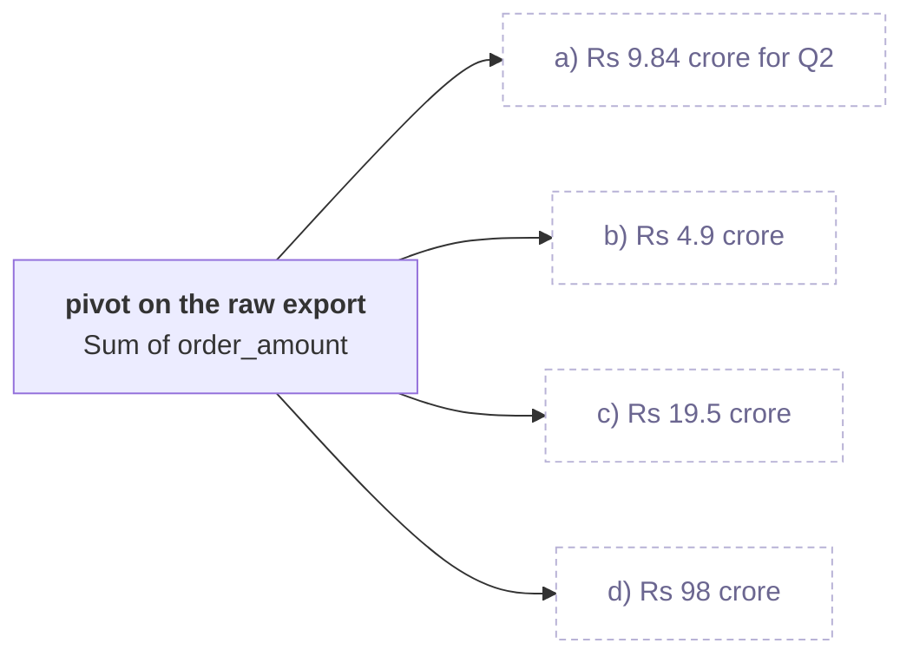
```mermaid
flowchart LR
    P["<b>pivot on the raw export</b><br/>Sum of order_amount"] --> A["a) Rs 9.84 crore for Q2"]
    P --> B["b) Rs 4.9 crore"]
    P --> C["c) Rs 19.5 crore"]
    P --> D["d) Rs 98 crore"]
    classDef unknown fill:#FFFFFF,stroke:#B8B2D6,color:#6B6690,stroke-dasharray:4 3
    class A,B,C,D unknown
```

**Question.** The pivot's Q2 total reads about which, as a letter?

```notes
LIVE, 1 minute. Every learner builds it on their own screen before you show yours. Do not warn them.
```

---

## S29. Answer: Rs 19.47 crore, and Core looks healthy
*What is the plausible wrong answer, exactly?*

| Segment | Q1, as the pivot shows | Q2, as the pivot shows | Change |
|---|---|---|---|
| Business | Rs 19,80,28,880 | Rs 19,34,72,200 | -2.3% |
| Retail-Core | Rs 4,33,760 | Rs 4,38,160 | +1.0% |
| Retail-Plus | Rs 9,38,160 | Rs 7,00,910 | -25.3% |
| Student | Rs 35,350 | Rs 48,070 | +36.0% |
| All segments | Rs 19,94,36,150 | Rs 19,46,59,340 | -2.4% |

**What breaks.** The deck carries Rs 19.47 crore for Q2, nearly twice the warehouse's Rs 9.84 crore, and calls Retail-Core the healthy segment the plan can leave alone.

```notes
LIVE, 4 minutes. The answer is c. Let it stand. Somebody usually says the totals look big but the
percentages look reasonable: the percentages are wrong too. Ask whether anyone would send it.
```

---

## S30. Why it is wrong: 1,450 rows, 1,000 orders
*What does one row of the raw export stand for, and which check catches it?*

```stats
value: 1,450 | label: rows | note: one per payment
value: 1,000 | label: order ids | note: what the warehouse holds
value: 450 | label: orders on two rows | note: 550 on one
```

**The check.** Count rows against distinct order ids, then tie the grand total to the warehouse; either catches it in a minute. The export repeats each order's amount on every payment row, and a Sum adds every repeat.

```notes
LIVE, 2 minutes. In Excel: COUNTA on order_id, a distinct count beside it. Then the grand total against
Rs 19,84,00,000. Name the grain now: one row is one payment.
```

---

## S31. Does Remove Duplicates fix it?
*With every column ticked, what does Remove Duplicates leave?*

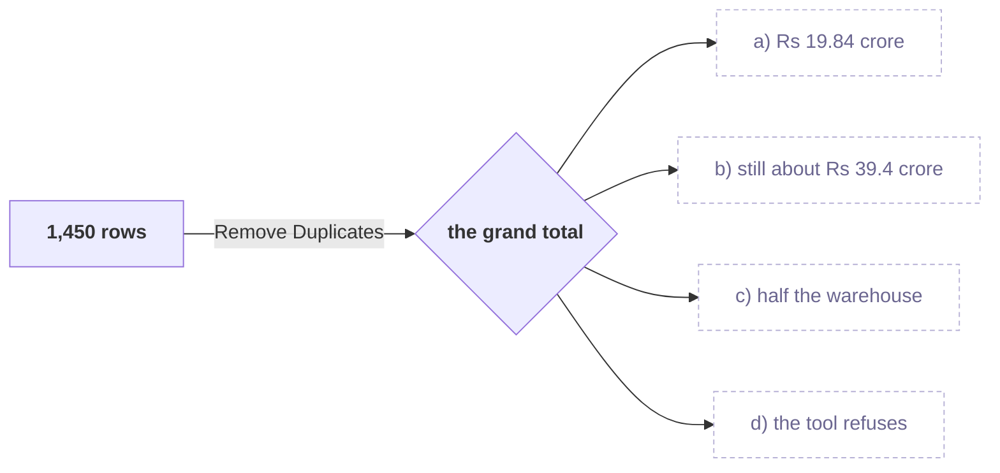
```mermaid
flowchart LR
    X["<b>1,450 rows</b>"] -->|"Remove Duplicates"| Q{"<b>the grand total</b>"}
    Q --> A["a) Rs 19.84 crore"]
    Q --> B["b) still about Rs 39.4 crore"]
    Q --> C["c) half the warehouse"]
    Q --> D["d) the tool refuses"]
    classDef unknown fill:#FFFFFF,stroke:#B8B2D6,color:#6B6690,stroke-dasharray:4 3
    class A,B,C,D unknown
```

**Question.** After Remove Duplicates, the grand total reads which, as a letter?

```notes
LIVE, 1 minute. Letters first, then run it live. Most rooms say a.
```

---

## S32. Answer: 50 rows go, and the total barely moves
*Why does removing identical rows leave the double count?*

| Version of the export | Rows | Grand total |
|---|---|---|
| As exported | 1,450 | Rs 39,40,95,490 |
| After Remove Duplicates | 1,400 | Rs 39,40,57,740 |
| The warehouse | 1,000 orders | Rs 19,84,00,000 |

The answer is b. Only the 50 orders the gateway posted twice have identical rows; the 400 orders paid in two instalments differ in `paid_amount`, so both rows stay. Now the analyst believes the file is clean.

```notes
LIVE, 2 minutes. Remove Duplicates is a cleaning step with no record, and here it did not even clean.
The fix has to name the grain.
```

---

## S33. The fix: flag each order's first row
*What does the tree say when each order counts once?*

```text
=IF(COUNTIF($A$2:A2,A2)=1,1,0)
```

| Segment | Q1 | Q2 | Change |
|---|---|---|---|
| Business | Rs 9,90,14,440 | Rs 9,75,84,600 | -1.4% |
| Retail-Core | Rs 3,73,070 | Rs 3,66,250 | -1.8% |
| Retail-Plus | Rs 5,85,770 | Rs 4,13,380 | -29.4% |
| All segments | Rs 10,00,00,000 | Rs 9,84,00,000 | -1.6% |

**What changed:** the total falls by Rs 19,56,95,490 to the warehouse's, and Retail-Core turns from a 1.0 percent rise into a 1.8 percent fall.

```notes
LIVE, 4 minutes. Type the flag in column A's neighbour and fill it down; pivot with the flag as a
filter, or SUMIFS on flag equals 1. Student moves from Rs 26,720 to Rs 35,770, up 33.9 percent, on few
orders. The running COUNTIF compares each row with every row above it: 1,051,975 comparisons here,
about 10.5 billion at 145,000 rows, which is the interview's design question.
```

---

## S34. In rupees Business fell most; Plus fell steepest
*Which segment and which leaf fell?*

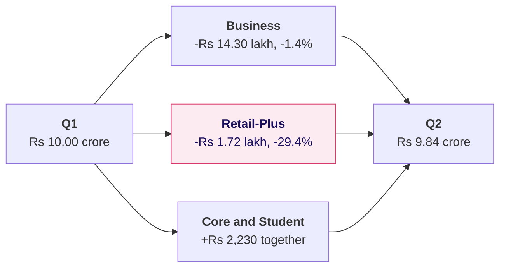
```mermaid
flowchart LR
    Q1["<b>Q1</b><br/>Rs 10.00 crore"] --> B["<b>Business</b><br/>-Rs 14.30 lakh, -1.4%"]
    Q1 --> P["<b>Retail-Plus</b><br/>-Rs 1.72 lakh, -29.4%"]
    Q1 --> O["<b>Core and Student</b><br/>+Rs 2,230 together"]
    B --> Q2["<b>Q2</b><br/>Rs 9.84 crore"]
    P --> Q2
    O --> Q2
    classDef bad fill:#FCEBF0,stroke:#D63A6A,color:#1A0F5C
    class P bad
```

| Retail-Plus | Q1 | Q2 | Change |
|---|---|---|---|
| Customers | 91 | 76 | -16.5% |
| Orders per customer | 2.36 | 1.84 | -22.0% |
| Revenue per order | Rs 2,725 | Rs 2,953 | +8.4% |

```notes
LIVE, 3 minutes. Two readings, both true. In rupees Business carries Rs 14,29,840 of the Rs 16,00,000
fall, the size of a few invoices landing in one quarter or the next. The steepest fall is Retail-Plus:
members kept buying big baskets and bought less often, the frequency branch Week 1 found. Multiply Q2
back: 76 times 1.84 times Rs 2,953 is Rs 4.13 lakh. Chapter 4 decides how each goes on the page.
```

---

## S35. A second route: the warehouse's own quarters
*Does the warehouse reach the same two numbers by a query that never saw the export?*

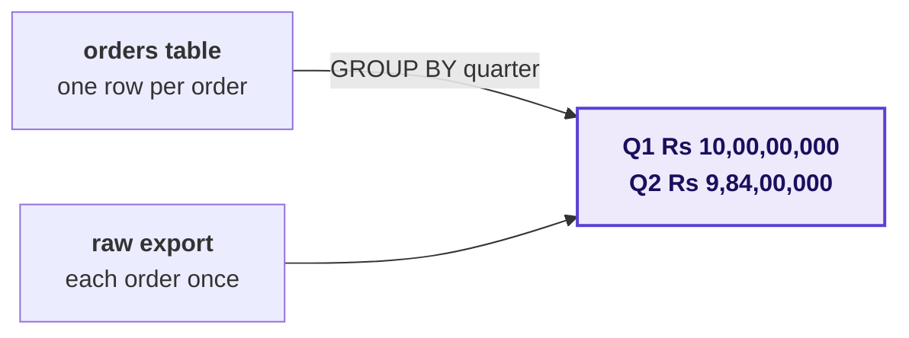
```mermaid
flowchart LR
    W["<b>orders table</b><br/>one row per order"] -->|"GROUP BY quarter"| S["<b>Q1 Rs 10,00,00,000<br/>Q2 Rs 9,84,00,000</b>"]
    E["<b>raw export</b><br/>each order once"] --> S
    classDef known fill:#EEEAFB,stroke:#5B3FD6,color:#1A0F5C,stroke-width:2px
    class S known
```

`SELECT quarter, count(*), sum(amount) FROM orders GROUP BY quarter` returns 538 orders and Rs 10,00,00,000 for Q1, 462 and Rs 9,84,00,000 for Q2: equal to the export counted once, to the rupee and to the order.

```notes
LIVE, 3 minutes. The notebook runs Monday's query against the warehouse. The export was written from
the warehouse; the second route asks the warehouse itself, which never saw the export, so it can
disagree. Here it does not.
```

---

## S36. Down 1.6 percent; Plus fell on frequency
*What did chapter 2 answer, question by question?*

| Question | Answer |
|---|---|
| Which quarter? | 772 rows in Q1, 678 in Q2 |
| The pivot says? | Rs 19,94,36,150 and Rs 19,46,59,340; Core up 1.0% |
| Why double? | One row per payment; Remove Duplicates leaves Rs 39,40,57,740 |
| Counted once? | Rs 10.00 crore to Rs 9.84 crore, down 1.6% |
| Which leaf fell? | Business most in rupees; Retail-Plus 29.4% on frequency |
| Warehouse agrees? | To the rupee, both quarters |

**Kavya's review.** "Two exports, two grains. Say the grain, count rows against ids, tie the total to the warehouse; a pivot that has not been tied has not been built."

**In the interview.** [F] Your pivot shows a different total from the warehouse; where do you look first?

```notes
LIVE, 2 minutes. One learner answers: the grain first, rows against keys; here 1,450 rows held 1,000
orders and Rs 39.41 crore against Rs 19.84 crore; then the period and filters; then keys missing on
either side.
Transition: Retail-Plus members are ordering less often, so which of them does the head of
Retail-Plus protect first?
```

---

## SECTION 3: Find any member by id?
*Which fifty Retail-Plus members go on the protect list, and when the chief of staff types an id, does the sheet answer for that member? Retention offers ride on it.*

```notes
LIVE. Thirty minutes. Notebook C2_W02_D05_03_member_lookup beside it; Excel live on the customer
table.
```

---

## S37. Answer it in six steps, from the list to the lookup
*Who needs the answer, and what must we find out on the way?*

**Who needs the answer.** The head of Retail-Plus, who sends the fifty a retention offer, and the chief of staff, who reads a member's line aloud when a director names one; a wrong row tells a director that a lapsed member is one of the best.

```timeline
label: 1 | title: Who is on it? | body: The fifty, and where the list stops.
label: 2 | title: Does it tie? | body: The list's source against the warehouse.
label: 3 | title: Which lookup? | body: Four ways, sized.
label: 4 | title: A missing id? | body: What the fourth argument does.
label: 5 | title: Found or not? | body: The exact match, and a re-sorted list.
label: 6 | title: A count agrees? | body: The second route. | tone: dark
```

```notes
LIVE, 1 minute. Chapter 2's finding in one line: Retail-Plus fell 29.4 percent because members
ordered less often, 2.36 orders each in Q1 and 1.84 in Q2. The head of Retail-Plus wants to protect
the best members before more of them drift.
```

---

## S38. The list sizes a retention budget
*What is at stake, who asks, and what does a wrong row cost?*

```stats
value: 50 | label: members protected | note: Retail-Plus, by two-quarter revenue
value: Head of Retail-Plus | label: who asks | note: sends the retention offer
value: One offer | label: what a wrong row costs | note: spent on someone who stopped buying
```

**The client asks.** "The top-fifty protect list with a lookup so I can find any member by id."

```notes
LIVE, 1 minute. The protect list comes from the customer table, one row per customer, because that is
the table the chief of staff refreshes every Monday. Wednesday built a per-segment list in SQL on Q2;
this one ranks the two quarters together from the export.
```

---

## S39. TransAlta's ranked sheet returned the wrong rows
*Which real company lost money to a sorted list whose rows answered for the wrong item?*

```stats
value: US$24 m | label: the cost | note: TransAlta, 2003
value: 10% | label: of the year's profit | note: The Globe and Mail
```

> "It was literally a cut-and-paste error in an Excel spreadsheet that we did not detect when we did our final sorting and ranking of bids prior to submission." Steve Snyder, TransAlta's president

```notes
LIVE, 1 minute. The Globe and Mail, 4 June 2003, checked 30 September 2026: bids for New York
transmission congestion contracts, "misaligned the rows of information in the spreadsheet". A row
answering for the wrong item is expensive at any scale.
```

---

## S40. An exact match that says when an id is missing
*Which lookup should answer "find this member", and what does each one return?*

| Option | A present id, C-0152 | An absent id, C-0195 | Re-sorted list | Excel 2016 |
|---|---|---|---|---|
| a) `VLOOKUP(id, A:F, 5)` | Rs 25,840 | another member's row | unreliable | yes |
| b) `VLOOKUP(id, A:F, 5, FALSE)` | Rs 25,840 | #N/A | right | yes |
| c) `IFERROR(INDEX(MATCH))`, exact | Rs 25,840 | not in the table | right | yes |
| d) `XLOOKUP(id, A:A, E:E, "not in the table")` | Rs 25,840 | not in the table | right | no |

**The call.** d on the room's Microsoft 365, c wherever the file must open. What would switch it: the Excel version on the chief of staff's laptop.

```notes
LIVE, 4 minutes. Microsoft's page says XLOOKUP "is not available in Excel 2016 and Excel 2019", and
LibreOffice 24.2 shows #NAME? for it (both checked 30 September 2026). Option b is honest and ugly:
a director reads #N/A as a broken sheet. C-0195 is a Retail-Plus member with no orders in the two
quarters, so the table has no row for it.
```

---

## S41. Who makes the list, and where does it stop?
*Filter to Retail-Plus, sort by revenue, keep fifty: what is the cut-off?*

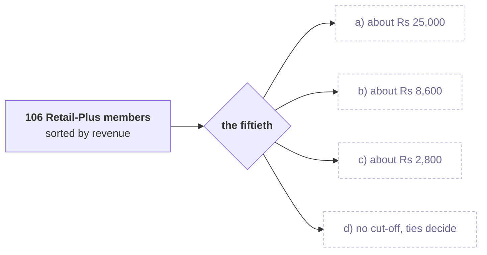
```mermaid
flowchart LR
    T["<b>106 Retail-Plus members</b><br/>sorted by revenue"] --> Q{"<b>the fiftieth</b>"}
    Q --> A["a) about Rs 25,000"]
    Q --> B["b) about Rs 8,600"]
    Q --> C["c) about Rs 2,800"]
    Q --> D["d) no cut-off, ties decide"]
    classDef unknown fill:#FFFFFF,stroke:#B8B2D6,color:#6B6690,stroke-dasharray:4 3
    class A,B,C,D unknown
```

**Question.** The fiftieth member's revenue, the list's cut-off, is about which, as a letter?

```notes
LIVE, 1 minute. Build it live: copy the Retail-Plus rows to their own sheet, sort Largest to
Smallest, add =RANK.EQ(E2, E$2:E$107).
```

---

## S42. Answer: Rs 8,580, and no tie at the boundary
*What does the list hold?*

```stats
value: Rs 25,840 | label: rank 1 | note: C-0152
value: Rs 8,580 | label: rank 50, the cut-off | note: the 51st spent Rs 8,520
value: Rs 7,14,890 | label: the fifty together | note: April to September
```

The answer is b. Fifty of the 106 Retail-Plus members make the list, and since the fifty-first spent less than the fiftieth, the list ships exactly fifty rows; Wednesday's tie rule has nothing to decide.

```notes
LIVE, 2 minutes. Mention Wednesday once: with a tie at fifty, the rule decides whether a list ships 49
or 51 rows. Not today.
```

---

## S43. Your turn: tie the list's source yourself
*The raw export tied to the warehouse in chapter 2; does the customer table tie on its own?*

```timeline
label: Step 1 | title: Sum it | body: The customer table's orders and revenue.
label: Step 2 | title: Tie it | body: Against the raw export counted once, 1,000 orders and Rs 19,84,00,000.
label: Step 3 | title: Find it | body: Any id in the export and not in the table.
label: Step 4 | title: Say it | body: What your answer means for the list and the lookup. | tone: dark
```

**The rule.** A list built on a table that has not been tied has not been built. In Excel: SUM the table's orders and revenue, set them beside the raw export counted once, and COUNTIF each export id in the table.

```notes
LIVE, 5 minutes; the notebook's empty cell holds the same lines for self-study. TRAINER: the day sheet has what they
should find. Let them find it; take two sentences aloud and do not confirm or name anything. Whoever
finds it has just made the lookup trap catchable.
```

---

## S44. What does VLOOKUP return for C-0195?
*The table has no row for C-0195; what comes back when the fourth argument is left out?*

```text
=VLOOKUP("C-0195", A2:F301, 5)
```

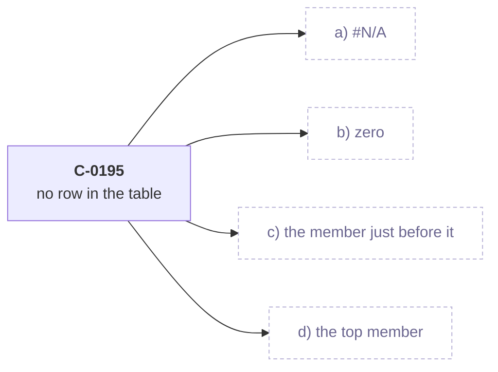
```mermaid
flowchart LR
    I["<b>C-0195</b><br/>no row in the table"] --> A["a) #N/A"]
    I --> B["b) zero"]
    I --> C["c) the member just before it"]
    I --> D["d) the top member"]
    classDef unknown fill:#FFFFFF,stroke:#B8B2D6,color:#6B6690,stroke-dasharray:4 3
    class A,B,C,D unknown
```

**Question.** What comes back, as a letter?

```notes
LIVE, 1 minute. Letters first. Most rooms say a.
```

---

## S45. Answer: C-0194's row, rank 15, and nothing is red
*What is the plausible wrong answer, and why does the sheet give it?*

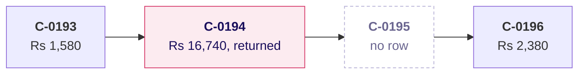
```mermaid
flowchart LR
    A["<b>C-0193</b><br/>Rs 1,580"] --> B["<b>C-0194</b><br/>Rs 16,740, returned"]
    B --> C["<b>C-0195</b><br/>no row"]
    C --> D["<b>C-0196</b><br/>Rs 2,380"]
    classDef bad fill:#FCEBF0,stroke:#D63A6A,color:#1A0F5C
    classDef unknown fill:#FFFFFF,stroke:#B8B2D6,color:#6B6690,stroke-dasharray:4 3
    class B bad
    class C unknown
```

The answer is c. Left out, the fourth argument "will always be TRUE or approximate match" (Microsoft Support, VLOOKUP, checked 30 September 2026), which returns the largest id not above the one asked for. **What breaks:** a director hears that C-0195 spent Rs 16,740 and sits at rank 15, and a retention offer goes to someone who placed no order between April and September.

```notes
LIVE, 4 minutes. Run it live. Nothing on screen is red: that is the whole trap. The check that catches
it: test every lookup with an id you know is missing, and print the id returned beside the id asked
for.
```

---

## S46. The fix: an exact match with a not-found path
*What do C-0195, C-0152 and C-0194 return once the match is exact?*

| Asked for | Exact, with a not-found path | Approximate |
|---|---|---|
| C-0195 | not in the table | C-0194: Rs 16,740 |
| C-0152 | Rs 25,840 | C-0152: Rs 25,840 |
| C-0194 | Rs 16,740 | C-0194: Rs 16,740 |

**What changed:** C-0195's line moves from "rank 15, Rs 16,740" to "not in the table", the answer that makes somebody check the export. For members in the table the two agree, which is why a lookup tested only on present ids looks fine.

```notes
LIVE, 3 minutes. Type both forms: =XLOOKUP(id, A:A, E:E, "not in the table") and
=IFERROR(INDEX(E:E, MATCH(id, A:A, 0)), "not in the table"). Now the room reads out an id; see the day
sheet for the moment.
```

---

## S47. The room sorts the list by revenue
*What happens to each lookup once the ids are no longer in order?*

```stats
value: 24 of 49 | label: steps down the list | note: to a smaller id
value: 50 of 50 | label: exact lookups | note: still right, shuffled
```

An approximate match assumes the first column is sorted: "If the first column isn't sorted, the return value might be something you don't expect" (Microsoft Support, VLOOKUP, checked 30 September 2026). An exact match does not care about order, so it survives the view a director actually looks at.

```notes
LIVE, 2 minutes. The room sees the list sorted by revenue, never by id. Walking down it, 24 of 49
steps go to a smaller id, so an approximate match has nothing sorted to search.
```

---

## S48. A second route: a count instead of a match
*Does an independent count agree with the lookup?*

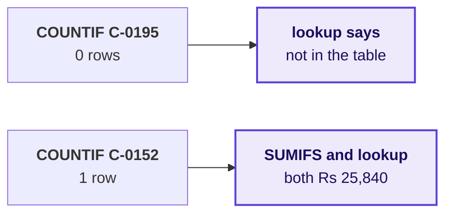
```mermaid
flowchart LR
    C1["<b>COUNTIF C-0195</b><br/>0 rows"] --> L1["<b>lookup says</b><br/>not in the table"]
    C2["<b>COUNTIF C-0152</b><br/>1 row"] --> L2["<b>SUMIFS and lookup</b><br/>both Rs 25,840"]
    classDef known fill:#EEEAFB,stroke:#5B3FD6,color:#1A0F5C,stroke-width:2px
    class L1,L2 known
```

`=COUNTIF(A:A, "C-0195")` counts zero rows, which has to meet a not-found answer; `=SUMIFS(E:E, A:A, "C-0152")` adds Rs 25,840, which has to meet the lookup. Counting and matching are different methods, so each can catch the other.

```notes
LIVE, 2 minutes. The count is the check a director can see: put it beside the lookup on the sheet.
```

---

## S49. Fifty members, and a lookup that says so
*What did chapter 3 answer, question by question?*

| Question | Answer |
|---|---|
| Who is on it? | Fifty, Rs 25,840 down to Rs 8,580 |
| Does it tie? | The room's own answer, from the your-turn step |
| Which lookup? | XLOOKUP on 365; IFERROR with INDEX and MATCH anywhere |
| A missing id? | Approximate returns C-0194, Rs 16,740, rank 15 |
| Found or not? | "Not in the table"; the same on a re-sorted list |
| A count agrees? | COUNTIF 0 and 1, both matching the lookup |

**Kavya's review.** "A lookup that answers with somebody else's row is worse than no lookup, because nobody in the room can tell. Test with an id you know is missing."

**In the interview.** [F] Your lookup returned a member for an id that does not exist; which argument was wrong?

```notes
LIVE, 3 minutes. One learner answers: the match type; VLOOKUP's fourth argument left out is
approximate; exact with a not-found path, tested with a missing id. BREAK, 10 minutes, after this
slide.
```

---

## SECTION 4: Read right in two minutes?
*What must sit beside the front-page number so a director reads it right in two minutes? The meeting's first decision is made from it.*

```notes
LIVE. Thirty minutes. Notebook C2_W02_D05_04_front_page beside it.
```

---

## S50. Answer it in six steps, from total to scope
*Who needs the answer, and what must we find out on the way?*

**Who needs the answer.** Meera and her directors, who read the front page first and may read nothing else, and the chief of staff, who answers for it; a card without its period reads two quarters as one.

```timeline
label: 1 | title: A bare total? | body: What a director reads in it.
label: 2 | title: Which form? | body: Four cards, sized.
label: 3 | title: The card? | body: Period, comparison, base.
label: 4 | title: A bare percentage? | body: What it leaves out.
label: 5 | title: Trend and scope? | body: Six months, and a director's input.
label: 6 | title: Warehouse agrees? | body: The second route. | tone: dark
```

```notes
LIVE, 1 minute. The number itself is given: revenue, Q2 against Q1. Which metric belongs on a growth
review's front page at all is a later week's question; today is about reading this one right.
```

---

## S51. The front page is read in two minutes
*What is at stake, who reads it, and what does a misread cost?*

```stats
value: Rs 9.84 cr | label: Q2 revenue | note: July to September 2026
value: -1.6% | label: on Q1 | note: Rs 10.00 crore
value: 2 minutes | label: the reading time | note: a director's, for the front page
```

**The client asks.** "One number on the front page with its trend."

```notes
LIVE, 1 minute. Chapter 2's numbers: Q1 Rs 10.00 crore, Q2 Rs 9.84 crore; in rupees Business carries
Rs 14.30 lakh of the Rs 16.00 lakh fall, and the steepest fall is Retail-Plus, 29.4 percent.
```

---

## S52. DMart's headline carries all four parts
*Which real company writes this card every quarter?*

> "Standalone Total Revenue up by 16.2% at Rs.15,932 Crore." Avenue Supermarts (DMart), press release, quarter ended 30 June 2025

```mermaid
flowchart LR
    N["<b>Rs 15,932 crore</b><br/>the number"] --> P["<b>quarter to 30 June 2025</b><br/>the period"]
    P --> C["<b>up 16.2%</b><br/>the comparison"]
    C --> B["<b>Rs 13,712 crore</b><br/>the base"]
    classDef known fill:#EEEAFB,stroke:#5B3FD6,color:#1A0F5C,stroke-width:2px
    class N known
```

```notes
LIVE, 2 minutes. Press release of 11 July 2025, checked 30 September 2026: revenue "stood at
Rs.15,932 crore, as compared to Rs.13,712 crore in the same period last year." The number, the
period, the comparison and the base are all in the first two lines.
```

---

## S53. The quarter against the last, with its sentence
*Which form should the card take, and what does each ask the director to remember?*

| Option | The card | Words | The director must bring |
|---|---|---|---|
| a) The total | "Revenue Rs 19.84 crore" | 4 | the period and the last figure |
| b) The quarter | "Q2 revenue Rs 9.84 crore" | 5 | Q1's figure, from memory |
| c) Against the last | "Q2 ... Rs 9.84 crore, down 1.6 percent on Q1 (Rs 10.00 crore)" | 29 | nothing |
| d) c with sentence and trend | c, where the change sits, and six months drawn | 53 | nothing |

**The call.** d. What would switch it: a board that reviews every month against the plan line, where the comparison becomes the plan.

```notes
LIVE, 4 minutes. Fifty-odd words and one small line, read in the two minutes a director gives the
front page, with nothing left to memory.
```

---

## S54. What does a director read in "Revenue Rs 19.84 crore"?
*The fastest card is the export's grand total; what does a director who remembers Q1 read into it?*

```stats
value: Rs 19.84 cr | label: Revenue | note: the card as drafted
```

**Question.** A director who remembers Q1 at Rs 10.00 crore reads this card as: a) two quarters of revenue; b) revenue nearly doubled this quarter; c) a number to check later; d) nothing wrong, since the number is right.

```notes
LIVE, 2 minutes. Letters. Then ask who has seen b happen in a real meeting.
```

---

## S55. Answer: up 98.4 percent, a quarter that never happened
*Why is the bare total the plausible wrong answer, and what catches it?*

```mermaid
flowchart LR
    Q1["<b>Q1</b><br/>Rs 10.00 crore, remembered"] --> R["<b>the card</b><br/>Rs 19.84 crore"]
    R --> M["<b>read as Q2</b><br/>up 98.4%"]
    T["<b>the truth</b><br/>Q2 Rs 9.84 crore, down 1.6%"]
    classDef bad fill:#FCEBF0,stroke:#D63A6A,color:#1A0F5C
    classDef known fill:#EEEAFB,stroke:#5B3FD6,color:#1A0F5C,stroke-width:2px
    class M bad
    class T known
```

The answer is b. The number is right and its period is missing, so the reader supplies one, and the minutes record a boom. **The check:** read the card aloud and ask which months, against what. **The fix:** the period and the comparison on the card itself.

```notes
LIVE, 3 minutes. The card is April to September added together. Read against one remembered quarter
it reads up 98.4 percent.
```

---

## S56. The card: period, comparison, base, sentence
*What does the card say, and what sits beside it?*

```stats
value: Rs 9.84 cr | label: Q2, July to September 2026 | note: the number and its period
value: -1.6% | label: on Q1 | note: the comparison, measured on Q1
value: Rs 10.00 cr | label: Q1, April to June 2026 | note: the base
```

**The sentence beside it.** "Business invoices carry Rs 14.30 lakh of the Rs 16.00 lakh fall; Retail-Plus, the paid tier, fell 29.4 percent because members ordered less often."

```notes
LIVE, 4 minutes. Read the card aloud: "All segments, Q2, July to September 2026: Rs 9.84 crore, down
1.6 percent on Q1, April to June 2026 (Rs 10.00 crore); 100.0 percent of company revenue in Q2." The
change is Q2 minus Q1, divided by Q1.
```

---

## S57. What does "Retail-Plus down 29.4 percent" leave out?
*The second slot is drafted as a bare percentage; what must sit beside it?*

```stats
value: -29.4% | label: Retail-Plus, as drafted | note: no base, no share
```

**Question.** What must sit beside it? a) nothing, since it is correct; b) its rupee base and its share of revenue; c) the Business figure; d) the protect list.

```notes
LIVE, 1 minute. The percentage is right. Letters first.
```

---

## S58. Answer: Rs 1.72 lakh, 0.4 percent of the quarter
*What is the base the draft left out, and what slip makes it worse?*

```stats
value: Rs 1.72 lakh | label: the fall in rupees | note: Rs 5.86 lakh to Rs 4.13 lakh
value: 0.4% | label: of Q2 revenue | note: Retail-Plus's share
value: -41.7% | label: divided by Q2 | note: the slip that makes it worse
```

The answer is b. Read without its base, "down 29.4 percent" sounds like the business collapsing, and the meeting argues about a panic instead of about members ordering less often. **The fix:** "Retail-Plus, Q2: Rs 4.13 lakh, down 29.4 percent on Q1 (Rs 5.86 lakh); 0.4 percent of company revenue."

```notes
LIVE, 3 minutes. The slip: the same change divided by Q2 instead of Q1 reads 41.7 percent. A change is
measured on the earlier period.
```

---

## S59. The trend beside it, and the scope a director picks
*What do six months show, and what happens when a director changes the scope?*

| The director asks for | The card says |
|---|---|
| All segments | Rs 9.84 crore, down 1.6% on Q1; 100.0% of revenue |
| All except Business | Rs 8.15 lakh, down 17.3% on Q1; 0.8% of revenue |
| Retail-Plus | Rs 4.13 lakh, down 29.4% on Q1; 0.4% of revenue |

The company line jumps in July to Rs 4.51 crore, 45 percent above June, on corporate invoices; without Business, revenue slides from Rs 3.32 lakh in June to Rs 2.48 lakh in September. The scope is a yellow input, and each card prints its own scope.

```notes
LIVE, 5 minutes. The notebook draws both lines; describe them here. Two directors asking for two scopes
get two honest cards, and down 1.6 and down 17.3 percent are never compared as one number.
```

---

## S60. A second route: the warehouse's own change
*Does the warehouse reach the same two changes by its own query?*

```mermaid
flowchart LR
    W["<b>orders and customers</b><br/>in the warehouse"] -->|"GROUP BY quarter"| C["<b>-1.60% company<br/>-29.43% Retail-Plus</b>"]
    X["<b>the card</b><br/>from the export"] --> C
    classDef known fill:#EEEAFB,stroke:#5B3FD6,color:#1A0F5C,stroke-width:2px
    class C known
```

The warehouse's orders, joined to its customers for the segment, give the same changes to the hundredth of a percent: minus 1.60 for the company and minus 29.43 for Retail-Plus.

```notes
LIVE, 1 minute. The query joins orders to customers on customer_id and groups by quarter.
```

---

## S61. Q2 against Q1, and every percentage in rupees
*What did chapter 4 answer, question by question?*

| Question | Answer |
|---|---|
| A bare total? | Rs 19.84 crore, read as up 98.4% |
| Which form? | d: the quarter against the last, with sentence and trend |
| The card? | Q2 Rs 9.84 crore, down 1.6% on Q1 (Rs 10.00 crore) |
| A bare percentage? | Rs 1.72 lakh on Rs 5.86 lakh, 0.4% of revenue |
| Trend and scope? | July's jump is invoices; without Business, down 17.3% |
| Warehouse agrees? | -1.60% and -29.43% |

**Kavya's review.** "A number without its period is read against whatever the director remembers; a percentage without its base is read as whatever the director fears."

**In the interview.** [F] How do you present one number so it is not misread?

```notes
LIVE, 3 minutes. One learner answers aloud with the card as the example.
```

---

## SECTION 5: What must Excel never do?
*Which of the week's steps belong in the workbook, which must never be done there, and how do the two stay in step? Every number Finance relies on depends on it.*

```notes
LIVE. Thirty minutes. Notebook C2_W02_D05_05_operating_rule beside it.
```

---

## S62. Answer it in six steps, from the week to the rule
*Who needs the answer, and what must we find out on the way?*

**Who needs the answer.** Kavya, who signs the team's rule, and Anand's analyst, who audits every number Finance relies on; a join done in a sheet can report as unpaid money that customers have paid.

```timeline
label: 1 | title: What each touches? | body: The week's steps.
label: 2 | title: Where could it live? | body: Four arrangements, sized.
label: 3 | title: A lookup joins? | body: Booked against collected.
label: 4 | title: Every payment? | body: What adding them says.
label: 5 | title: Where each belongs? | body: The rule.
label: 6 | title: How in step? | body: The drift check. | tone: dark
```

```notes
LIVE, 1 minute. Read Kavya's challenge aloud: "Which parts belong in Excel, which parts must never be in
Excel, and how do you keep the two from drifting apart?" Chapters 1 to 4 built the three deliverables;
this is the rule behind them.
```

---

## S63. Collected against booked is the test case
*What is at stake, who asks, and what does a wrong number cost?*

```stats
value: Rs 19.84 cr | label: booked | note: the orders' value, both quarters
value: Anand | label: who asks | note: finance controller
value: A false alarm | label: what it costs | note: a collections team chasing paid accounts
```

Booked is the value of the orders; collected is the money received against them. Tuesday built the report in the warehouse; it needs a join, one order to several payments.

```notes
LIVE, 2 minutes. Anand asks whether the deck pack could carry Tuesday's collected figure too, computed
in the workbook so nobody needs a login.
```

---

## S64. Public Health England left 15,841 cases unreported
*Which real organisation ran a pipeline step in a spreadsheet?*

```stats
value: 15,841 | label: cases not reported | note: 25 September to 2 October 2020
value: ~65,000 | label: rows per XLS template | note: BBC News
value: ~1,400 | label: cases per template | note: several rows per test result
```

> "15,841 cases between 25 September and 2 October were not included in the reported daily COVID-19 cases." Public Health England, 4 October 2020

```notes
LIVE, 2 minutes. GOV.UK statement of 4 October 2020 and BBC News of 5 October 2020, both checked 30
September 2026. Rows past the old format's limit were dropped, not rejected: nothing was red.
```

---

## S65. The split: warehouse, pandas, workbook
*Where could the week's work live, and what does each arrangement cost?*

| Option | Collected per order costs | Who can rerun it | What an auditor traces |
|---|---|---|---|
| a) All in the workbook | 1,000 SUMIFS x 1,450 rows = 1,450,000 tests a recalculation | its author, by hand | the cells |
| b) The split | one GROUP BY over 1,428 payments | anyone with the query | the query |
| c) pandas pastes values | one groupby over 1,450 rows | the analyst | the notebook |
| d) Dashboard | a query a view | its owner | the queries, behind a login |

**The call.** b. What would switch it: a one-off question nobody audits and nobody reruns can live in a sheet.

```notes
LIVE, 3 minutes. The warehouse owns every join, dedupe and rank because a query can be rerun and
audited. Option d fails the brief on the login.
```

---

## S66. What did each day build, and what does it read?
*Which of the week's steps touches the most rows?*

| Day | Step | Reads |
|---|---|---|
| Monday | The tree by segment and quarter | 1,000 orders |
| Tuesday | Booked against collected | 1,000 orders and 1,428 payments |
| Wednesday | Top fifty, falling spend | orders, by window |
| Thursday | The customer table | orders, customers, exposure |
| Friday | Pivot, lookup, card | the two exports |

**Question.** Which step touches the most rows? a) the tree; b) booked against collected; c) the top fifty; d) Friday's pivot.

```notes
LIVE, 1 minute. Letters, quickly.
```

---

## S67. Answer: Tuesday's join, one order to several payments
*Why is that the step to watch?*

```mermaid
flowchart LR
    O["<b>1,000 orders</b>"] -->|"one to several"| P["<b>1,428 payments</b>"]
    P --> Q{"<b>a sheet that joins</b>"}
    Q --> R["<b>watch this step</b>"]
    classDef bad fill:#FCEBF0,stroke:#D63A6A,color:#1A0F5C
    class R bad
```

The answer is b. It is the one step where one row on one side meets several on the other, which is exactly what a lookup in a sheet handles worst.

```notes
LIVE, 1 minute. Transition: so try it the hurried way.
```

---

## S68. What does collected say when a lookup joins?
*=VLOOKUP(A2, RawExport!A:H, 7, FALSE) fetches paid_amount beside each order; what does it add up to?*

```stats
value: Rs 19.84 cr | label: booked | note: 1,000 orders
value: ? | label: collected, by lookup | note: one exact match per order
```

**Question.** Collected reads about: a) Rs 19.7 crore; b) Rs 11.8 crore; c) Rs 39 crore; d) exactly booked.

```notes
LIVE, 2 minutes. The match is exact. Letters first; most rooms say a or d.
```

---

## S69. Answer: Rs 8.00 crore "outstanding", 40.3 percent
*What is the plausible wrong answer, and what decision would it mislead?*

```stats
value: Rs 11.84 cr | label: collected, by lookup | note: Rs 11,83,81,974
value: Rs 8.00 cr | label: outstanding, it says | note: 40.3 percent of booked
value: 450 | label: orders on two rows | note: the lookup reads one
```

The answer is b. **What breaks:** Anand's team chases Rs 8 crore from accounts that paid, most of them corporate buyers, and the board pack reports a cash problem Kalpa does not have. **Why:** a lookup returns the first matching row and stops.

```notes
LIVE, 4 minutes. Every channel reads about 60 percent collected. The check: count the rows each order
has; any order with two rows needs its payments added, never looked up.
```

---

## S70. The fix: add every payment, and join upstream
*What does adding every payment say?*

```mermaid
flowchart LR
    L["<b>lookup</b><br/>Rs 11.84 crore"] -->|"+ 400 second instalments<br/>Rs 7.83 crore"| M["<b>every payment</b>"]
    M -->|"+ 50 gateway second posts<br/>Rs 37,750"| S["<b>collected</b><br/>Rs 19.67 crore"]
    classDef known fill:#EEEAFB,stroke:#5B3FD6,color:#1A0F5C,stroke-width:2px
    class S known
```

`=SUMIFS(G:G, A:A, A2)` adds every payment for the order: collected Rs 19,66,82,820, Rs 17,17,180 short of booked, 0.9 percent. **What changed:** Rs 7,83,00,846 of "outstanding" money disappears. The join belongs in the warehouse, where Tuesday did it; SUMIFS is only a check.

```notes
LIVE, 3 minutes. The real gaps are Tuesday's: orders nobody has paid for and payments posted twice that
are owed back. Point back at Tuesday by name; do not re-teach it.
```

---

## S71. Each step in one place: the rule
*Where does each of the week's steps belong?*

| Step | Where it lives | Why |
|---|---|---|
| The tree by segment and quarter | warehouse | Finance audits it |
| Counting each order once | warehouse | a grain fix is cleaning |
| Booked against collected | warehouse | a join, one to several |
| Top fifty with a tie rule | warehouse | a rank others rely on |
| The customer table | pandas | the weekly iteration |
| Pivot, lookup, card, what-ifs | workbook | the last mile, on an export that ties |

**The rule.** The warehouse owns the number and every join, dedupe and rank; pandas owns the iteration; the workbook owns the last mile, and nobody types over the source.

```notes
LIVE, 3 minutes. Chapter 2's first-row flag was right for Friday's deadline and is a cleaning step
with no record; next week the export should arrive at the order grain, and the flag becomes a check.
```

---

## S72. A second route, and the drift check
*Does the warehouse agree on collected, and how do the sheet and the warehouse stay in step?*

| Check | The workbook | The warehouse | Verdict |
|---|---|---|---|
| Collected, every payment | Rs 19,66,82,820 | Rs 19,66,82,820 | ties |
| Q2 orders, today's export | 462 | 462 | ship |
| Q2 orders, an export a week early | 430 | 462 | hold |

The warehouse's payments joined to its orders give the same collected figure to the rupee. The drift check ties the workbook's quarters to the warehouse on every refresh; the same export pulled a week early, Rs 9,20,15,460 for Q2, is held.

```notes
LIVE, 4 minutes. Every row in the early export is real, and Q2 still falls short, so the check holds
the deck until someone pulls a fresh export. It catches a typed-over number too, which is chapter 6.
```

---

## S73. The warehouse owns it; the workbook presents it
*What did chapter 5 answer, question by question?*

| Question | Answer |
|---|---|
| What each touches? | Tuesday's join: 1,000 orders to 1,428 payments |
| Where could it live? | b, the split |
| A lookup joins? | Rs 11.84 crore collected, "Rs 8.00 crore outstanding" |
| Every payment? | Rs 19.67 crore, 0.9 percent short |
| Where each belongs? | Joins, dedupes, ranks upstream; the last mile in the workbook |
| How in step? | A drift check on every refresh |

**Kavya's review.** "Excel presents; it does not clean, join or compute the source of truth, because a sheet with a typed-over cell has no audit trail."

**In the interview.** [S] SQL, pandas or Excel: how do you choose?

```notes
LIVE, 3 minutes. One learner answers: by who has to trust the number and who has to rerun it.
Transition to lunch: after it, a director gets their hands on the workbook.
```

---

## S74. The morning's answers, in one picture
*What can a director trust so far, and what is still open?*

```mermaid
flowchart LR
    T["<b>the tree</b><br/>ties, both quarters"] --> L["<b>the list</b><br/>fifty, exact lookup"]
    L --> C["<b>the card</b><br/>period, comparison, base"]
    C --> R["<b>the rule</b><br/>warehouse owns it"]
    R --> Q["<b>open</b><br/>a director's hands"]
    classDef known fill:#EEEAFB,stroke:#5B3FD6,color:#1A0F5C,stroke-width:2px
    classDef unknown fill:#FFFFFF,stroke:#B8B2D6,color:#6B6690,stroke-dasharray:4 3
    class T,L,C,R known
    class Q unknown
```

The tree ties to the warehouse, the list and its lookup say what they hold, the card carries its period, comparison and base, and the rule says who owns each number. After lunch a director takes the laptop.

```notes
LIVE, 1 minute. Point back at the morning's first picture, S4. Lunch.
```
