# The number reaches the leadership deck

Week 2, Day 5. Half one.

Kicker: WEEK 2  ·  FRIDAY  ·  HALF ONE
Quote: Monday's growth review deck needs three things I can open on my laptop without a login. If a director changes an assumption in the room, the sheet must recalculate in front of them.
Who: Meera's chief of staff, Kalpa Retail, to the data and AI team at Kalpa's Global Capability Centre

```notes
LIVE, one minute. Read the chief of staff's message aloud and leave it on screen. Say the arc of the
day once: three rounds this morning, one deliverable each, then the three together on the escalated
case after lunch, and the operating rule defended against a director. Excel is the tool the room
holds today; pandas appears only as the second way to reach a number.
```

---

## SECTION 1: The ask
*A chief of staff wants three things a director can open without a login, and all of it must survive the room.*

```notes
LIVE. Chapter one runs 20 minutes. No Excel yet. Its job is to split the ask into three deliverables
and draw, on the board, the four places a sheet can lie before any cell is typed.
```

---

## S1. Friday at Kalpa's GCC
*The week's numbers leave the warehouse and meet their audience.*

```cards
icon: database | eyebrow: Monday to Wednesday | title: The warehouse | body: Anand's numbers in SQL: the tree by segment and quarter, booked against collected, the protect list.
icon: table | eyebrow: Thursday | title: The customer table | body: One row per customer, built in pandas and exported as a CSV for Marketing.
icon: presentation | eyebrow: Today | title: The leadership deck | body: Three things a director opens in Excel, on a laptop, in a room, on Monday. | tone: dark
```

```stats
value: Rs 9.84 cr | label: Q2 revenue | note: Monday's warehouse number
value: 1.6% | label: the fall on Q1 | note: Rs 10.00 crore in Q1
value: 2 | label: exports sent | note: a clean table and a raw one
value: 0 | label: logins | note: what the chief of staff will accept
```

```notes
LIVE, 3 minutes. Everything this week built is about to be read by someone who has never seen a
query. Ask which of the four numbers worries the chief of staff most. The zero: nothing may need
Python, a login or the team in the room to be read correctly.
```

---

## S2. What the chief of staff wrote
*Three deliverables, one condition, and a senior analyst's challenge.*

**The client asks.** "Monday's growth review deck needs three things I can open on my laptop without a login: the revenue tree by segment for both quarters, the top-fifty protect list with a lookup so I can find any member by id, and one number on the front page with its trend. Nothing that needs Python. If a director changes an assumption in the room, the sheet must recalculate in front of them."

| What was asked | What it becomes | Round |
|---|---|---|
| The revenue tree by segment, both quarters | A pivot that reconciles to the warehouse | 1 |
| The protect list and a lookup by id | A ranked list and a lookup that fails out loud | 2 |
| One number with its trend | A card with its period, comparison and base | 3 |
| Recalculates when a director changes an assumption | Yellow inputs, every other cell a formula | All three |

```notes
LIVE, 3 minutes. Read the message aloud, then point at the last row: it is the hardest line in the
brief, and it applies to all three rounds. Kavya's challenge comes on the next slide.
```

---

## S3. Question: what belongs in Excel
*Kavya: "Which parts belong in Excel, which must never be in Excel, and how do the two stay in step?"*

> "Everything you built this week has to survive a room that only has Excel." Kavya Nair, senior analyst, Kalpa Retail

**Question.** Which of these must never happen in Excel? a) slicing the tree by segment in the room; b) removing the double-paid rows from the export; c) looking up a member by id; d) showing the front-page number's trend.

```notes
LIVE, 3 minutes. One minute in pairs, then letters. Most rooms split between a and b. Do not
resolve it yet.
```

---

## S4. Answer: Excel presents, and never cleans
*Cleaning in a sheet leaves no audit trail, so the source of truth stays upstream.*

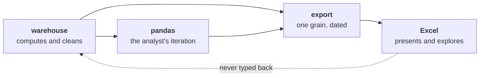
```mermaid
flowchart LR
    W["<b>warehouse</b><br/>computes and cleans"] --> P["<b>pandas</b><br/>the analyst's iteration"]
    W --> X["<b>export</b><br/>one grain, dated"]
    P --> X
    X --> E["<b>Excel</b><br/>presents and explores"]
    E -.->|"never typed back"| W
    classDef bad fill:#FCEBF0,stroke:#D63A6A,color:#1A0F5C
```

The answer is b. Removing rows in a sheet is a cleaning step with no record, and the next export brings them back. Excel owns the last mile: it presents, slices and looks up a table somebody upstream already made honest.

```notes
LIVE, 3 minutes. Draw this on the board and leave it up all day; it becomes the operating rule in
the afternoon. The dashed arrow is the one the second case is about.
```

---

## S5. Four places a sheet lies before anyone types
*The thinking for the day, drawn before Excel opens.*

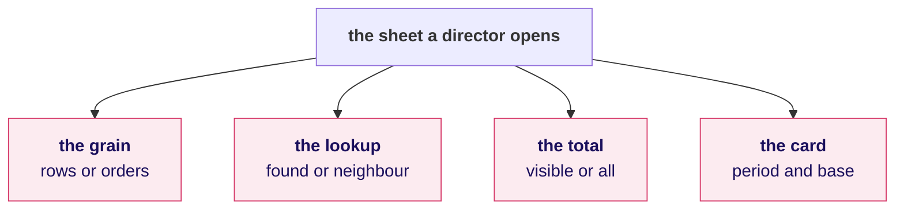
```mermaid
flowchart TB
    S["<b>the sheet a director opens</b>"] --> G["<b>the grain</b><br/>rows or orders"]
    S --> L["<b>the lookup</b><br/>found or neighbour"]
    S --> V["<b>the total</b><br/>visible or all"]
    S --> C["<b>the card</b><br/>period and base"]
    classDef bad fill:#FCEBF0,stroke:#D63A6A,color:#1A0F5C
    class G,L,V,C bad
```

Each is silent: the sheet shows a plausible number and no error. Round 1 takes the grain, round 2 the lookup and the total, round 3 the card.

```notes
LIVE, 4 minutes. This is the day's picture; it reappears at each chapter with its part lit, on the
cheat sheet's first panel and in notebook maps. Draw it with the room and ask what each could
cost Meera on Monday.
Transition: the grain first, because the other three sit on it.
```

---

## SECTION 2: Round 1, the pivot
*The tree by segment, built on the clean table, then on the raw export, where it nearly doubles.*

```notes
LIVE. Round one runs 50 minutes: question and picture (5), demonstration (15), trap (15), the room's
harder variant (10), Kavya's review (5). Notebook 1 sits beside it.
```

---

## S6. The question for round 1
*Can a director slice revenue by segment and quarter, and trust what they see?*

**The client asks.** "The revenue tree by segment for both quarters."

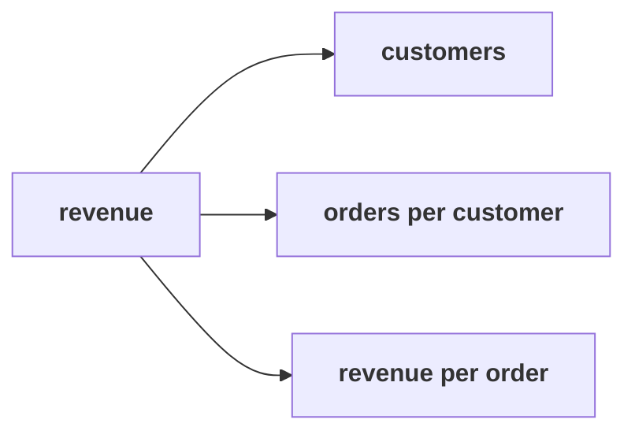
```mermaid
flowchart LR
    R["<b>revenue</b>"] --> C["<b>customers</b>"]
    R --> F["<b>orders per customer</b>"]
    R --> O["<b>revenue per order</b>"]
    classDef known fill:#EEEAFB,stroke:#5B3FD6,color:#1A0F5C
```

Week 1's tree, three leaves that multiply, now per segment and per quarter, in a pivot a director can slice.

```notes
LIVE, 2 minutes. The tree is Monday of Week 1 at warehouse scale. Ask: which leaf moved for
Retail-Plus last week in SQL? Orders per customer. The pivot has to show the same thing.
```

---

## S7. Two exports, two grains
*The customer table has a row per customer; the raw export has a row per payment.*

```cards
icon: table | eyebrow: The clean export | title: One row per customer | body: 300 customers, their segment, city, orders and revenue across both quarters.
icon: receipt | eyebrow: The raw export | title: One row per payment | body: 1,450 rows, each carrying its order's amount and one payment against it.
icon: scale | eyebrow: The warehouse | title: One row per order | body: 1,000 orders, Rs 19.84 crore across the two quarters. | tone: dark
```

**The rule.** Say the grain aloud before you pivot. A Sum adds one value per row, so the grain decides what it counts.

```notes
LIVE, 3 minutes. Write the three grains on the board beside the picture. Every trap this morning
is one of these grains read as another.
```

---

## S8. The clean table, pivoted by segment
*Insert, PivotTable: segment in Rows, revenue as Sum, customers as Count.*

| Segment | Customers | Orders | Revenue |
|---|---|---|---|
| Business | 39 | 188 | Rs 19,65,99,040 |
| Retail-Core | 131 | 392 | Rs 7,39,320 |
| Retail-Plus | 106 | 349 | Rs 9,77,410 |
| Student | 24 | 65 | Rs 62,490 |

```stats
value: 99.1% | label: Business | note: 39 corporate buyers
value: 0.9% | label: everyone else | note: 261 consumer customers
```

```notes
LIVE, 6 minutes. Build it live in Excel from the CSV: select the table, Insert, PivotTable, then drag
the fields. Ask the room to predict which segment carries most revenue before you drag revenue in.
Thirty-nine corporate buyers carry the grand total, which is why round 3 matters.
```

---

## S9. The tree for Retail-Plus
*Three leaves, two calculated columns, and they multiply back to the revenue.*

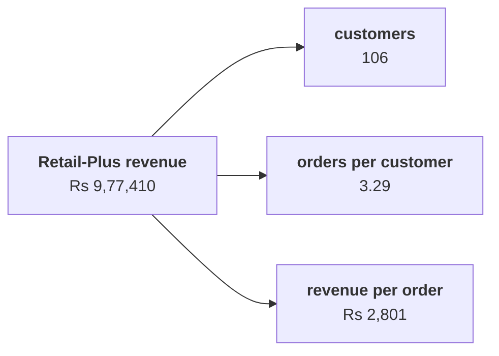
```mermaid
flowchart LR
    R["<b>Retail-Plus revenue</b><br/>Rs 9,77,410"] --> C["<b>customers</b><br/>106"]
    R --> F["<b>orders per customer</b><br/>3.29"]
    R --> O["<b>revenue per order</b><br/>Rs 2,801"]
```

Beside the pivot, `=orders/customers` and `=revenue/orders`. Retail-Core reads 2.99 and Rs 1,886, so the basket is where Retail-Plus pays more.

```notes
LIVE, 4 minutes. Multiply back aloud: 106 times 3.29 times 2,801 is about 9.77 lakh. That check is
the habit for every tree today.
```

---

## S10. Question: can the clean table split the quarters
*It carries a last order date, and no quarter.*

**Question.** The chief of staff asked for both quarters. How does the clean table give Q1 against Q2? a) split each customer's revenue on the last order date; b) halve each customer's revenue; c) it cannot; the split lives only at the order grain; d) use the orders column, which counts per quarter.

```notes
LIVE, 2 minutes. Letters in the chat. Option a is the tempting one; ask what happens to a customer
who bought all year and once in September.
```

---

## S11. Answer: the quarter lives at the order grain
*A last order date is a recency, and splitting on it would invent a Q2 boom.*

```stats
value: 300 | label: customers | note: one row each, both quarters summed
value: 0 | label: quarter columns | note: in the clean table
value: 1,450 | label: rows in the raw export | note: each with an order date
```

The answer is c. Most customers last bought in Q2, so splitting on it moves their whole half-year into Q2. The quarter split needs the raw export.

```notes
LIVE, 2 minutes. This is the departure from the easy path: the tree for both quarters has to come
from the raw export, which is where the trap waits.
```

---

## S12. The plausible wrong answer: Rs 39.41 crore
*The same pivot on the raw export: quarter in Columns, Sum of order_amount.*

| Segment | Q1, as the pivot shows | Q2, as the pivot shows | Change |
|---|---|---|---|
| Business | Rs 19,80,28,880 | Rs 19,34,72,200 | -2.3% |
| Retail-Core | Rs 4,33,760 | Rs 4,38,160 | +1.0% |
| Retail-Plus | Rs 9,38,160 | Rs 7,00,910 | -25.3% |
| Student | Rs 35,350 | Rs 48,070 | +36.0% |
| All segments | Rs 19,94,36,150 | Rs 19,46,59,340 | -2.4% |

**What breaks.** The deck would carry Rs 19.47 crore for Q2, nearly twice Finance's Rs 9.84 crore, and say Retail-Core grew, so the growth plan leaves Core alone.

```notes
LIVE, 6 minutes. Build it live and let it stand for a moment. Ask whether anyone would send it.
Somebody usually says the totals look big but the percentages look reasonable, which is the trap:
the percentages are wrong too.
```

---

## S13. Why it is wrong: 1,450 rows, 1,000 orders
*The export repeats an order's amount on every payment row, and a Sum adds each one.*

```stats
value: 1,450 | label: rows | note: one per payment
value: 1,000 | label: distinct orders | note: what the warehouse holds
value: 1.45 | label: rows per order | note: anything over 1.00 inflates a Sum
```

**The check.** Count rows against distinct order ids, then tie the grand total to Monday's Rs 19.84 crore. Either one catches it in a minute.

```notes
LIVE, 4 minutes. In Excel: COUNTA on the order_id column, then a distinct count with a helper
column. Instalments and gateway retries were Tuesday's fan-out; here they reach a pivot.
```

---

## S14. Question: does Remove Duplicates fix it
*Data, Remove Duplicates, every column ticked.*

**Question.** After Remove Duplicates on every column, what does the pivot's grand total read? a) Rs 19.84 crore, the warehouse; b) still about Rs 39.4 crore; c) about half the warehouse; d) nothing, the tool refuses repeated ids.

```notes
LIVE, 2 minutes. Letters first, then run it live. Most rooms say a.
```

---

## S15. Answer: 50 rows go, and the total barely moves
*Instalment rows differ in the amount paid, so they are not duplicates.*

| Version of the export | Rows | Grand total |
|---|---|---|
| As exported | 1,450 | Rs 39.41 crore |
| After Remove Duplicates | 1,400 | Rs 39.41 crore |
| The warehouse | 1,000 orders | Rs 19.84 crore |

The answer is b. Remove Duplicates removes rows identical in every column; the problem is the grain, and it needs a fix that names the grain.

```notes
LIVE, 3 minutes. The fifty exact copies are the double-paid orders; the four hundred instalment
orders still appear twice. A rule that removes duplicates is a cleaning step, which belongs upstream.
```

---

## S16. The fix: count each order once
*A helper column flags the first row of each order, and the tree sums only those.*

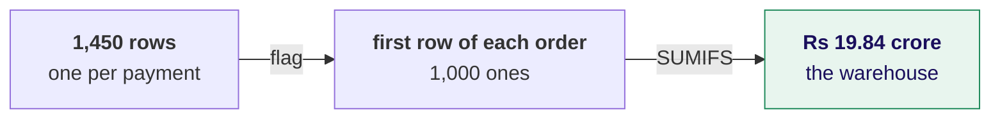
```mermaid
flowchart LR
    A["<b>1,450 rows</b><br/>one per payment"] -->|"flag"| B["<b>first row of each order</b><br/>1,000 ones"]
    B -->|"SUMIFS"| C["<b>Rs 19.84 crore</b><br/>the warehouse"]
    classDef good fill:#E8F5EE,stroke:#1F8A5B,color:#1A0F5C
    class C good
```

The flag is `=IF(COUNTIF($A$2:A2,A2)=1,1,0)`, filled down the export.

**What changed.** The grand total falls from Rs 39.41 crore to Rs 19.84 crore, the warehouse to the rupee, and Retail-Core turns from a 1.0 percent rise into a 1.8 percent fall.

```notes
LIVE, 5 minutes. Type the helper live. The deck pack's Tree tab does this with SUMIFS, which also
recalculates without a refresh; a PivotTable needs Refresh after its source changes.
```

---

## S17. The tree by segment and quarter
*Retail-Plus lost customers and orders per customer, and baskets grew.*

| Retail-Plus | Q1 | Q2 | Change |
|---|---|---|---|
| Customers | 91 | 76 | -16.5% |
| Orders per customer | 2.36 | 1.84 | -22.0% |
| Revenue per order | Rs 2,725 | Rs 2,953 | +8.4% |
| Revenue | Rs 5,85,770 | Rs 4,13,380 | -29.4% |

The company total: Rs 10.00 crore in Q1, Rs 9.84 crore in Q2, down 1.6 percent, matching Monday's warehouse numbers.

```notes
LIVE, 4 minutes. Multiply the Q2 column back: 76 times 1.84 times 2,953 is 4.13 lakh. This is
the tree the chief of staff gets.
```

---

## S18. Your turn: reconcile the clean table too
*The protect list comes from the clean table, so it must reconcile as well.*

```timeline
label: Step 1 | title: Sum it | body: The clean table's revenue and orders.
label: Step 2 | title: Tie it | body: Against the warehouse's 1,000 orders and Rs 19,84,00,000.
label: Step 3 | title: Find it | body: Any id in the raw export and not in the clean table.
label: Step 4 | title: Say it | body: What it means for the protect list, in one sentence. | tone: dark
```

**The harder variant.** Ten minutes, in Excel or in notebook 1's empty cell. Your sentence goes in the chat.

```notes
LIVE, 10 minutes. TRAINER: the day sheet has what they should find. Let them find it; take three
sentences aloud. Whoever finds the gap has just made round 2's lookup trap catchable.
```

---

## S19. Kavya's review of round 1
*Two exports, two grains, and a pivot that has not been reconciled has not been built.*

**Kavya's review.** Say the grain before you pivot, count rows against ids, and tie the grand total to Monday's number. A pivot that has not been reconciled has not been built.

**In the interview.** [F] Your pivot shows a different total from the warehouse; where do you look first?

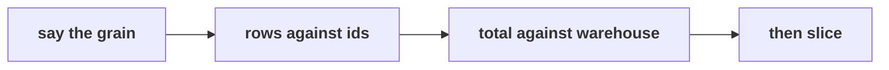
```mermaid
flowchart LR
    A["<b>say the grain</b>"] --> B["<b>rows against ids</b>"] --> C["<b>total against warehouse</b>"] --> D["<b>then slice</b>"]
```

```notes
LIVE, 5 minutes. One learner answers the interview question aloud in under a minute: the grain, the
filter and period, then what is missing. The full answer is in notebook 1 and the day sheet.
```

---

## SECTION 3: Round 2, the lookup
*The protect list, a lookup that must fail out loud, and a total that must follow the filter.*

```notes
LIVE. Round two runs 50 minutes: question and picture (5), demonstration (12), two traps (20), the
room's variant (8), Kavya's review (5). Notebook 2 sits beside it.
```

---

## S20. The question for round 2
*Find any member by id, and protect the fifty who matter most.*

**The client asks.** "The top-fifty protect list with a lookup so I can find any member by id."

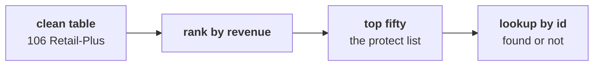
```mermaid
flowchart LR
    T["<b>clean table</b><br/>106 Retail-Plus"] --> R["<b>rank by revenue</b>"] --> L["<b>top fifty</b><br/>the protect list"]
    L --> K["<b>lookup by id</b><br/>found or not"]
```

```notes
LIVE, 3 minutes. This is Wednesday's list for the head of Retail-Plus, read now from the customer
table across both quarters instead of Q2 in SQL.
```

---

## S21. The protect list
*Filter to Retail-Plus, sort by revenue, keep fifty.*

```stats
value: 106 | label: Retail-Plus members | note: in the clean table
value: Rs 25,840 | label: rank 1 | note: C-0152
value: Rs 8,580 | label: rank 50 | note: the cut-off
value: Rs 7,14,890 | label: the fifty together | note: both quarters
```

The fifty-first member spent Rs 8,520, so no tie sits across the boundary and the list ships exactly fifty rows.

```notes
LIVE, 5 minutes. Build it live. Mention Wednesday's tie once: with a tie at fifty the rule decides
whether the list ships fifty or fifty-one, and here it does not arise.
```

---

## S22. A lookup has two exits
*Found returns the member's row; not found says so.*

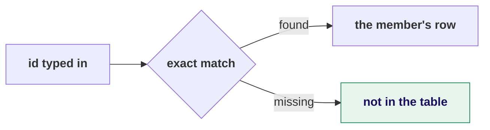
```mermaid
flowchart LR
    I["<b>id typed in</b>"] --> M{"<b>exact match</b>"}
    M -->|"found"| F["<b>the member's row</b>"]
    M -->|"missing"| N["<b>not in the table</b>"]
    classDef good fill:#E8F5EE,stroke:#1F8A5B,color:#1A0F5C
    class N good
```

In the room's Excel: `=XLOOKUP(id, ids, revenue, "not in the table")`. In a sheet that must also open elsewhere: `=IFERROR(INDEX(revenue, MATCH(id, ids, 0)), "not in the table")`.

```notes
LIVE, 4 minutes. XLOOKUP's match mode is exact by default and it takes an if_not_found argument
(Microsoft Support, verified 29 September 2026). LibreOffice 24.2 returns #NAME? for it, which is
why the deck pack computes with INDEX and MATCH.
```

---

## S23. Question: what does VLOOKUP say for C-0195
*C-0195 is a Retail-Plus member with no orders in these two quarters.*

**Question.** A hurried sheet uses `=VLOOKUP("C-0195", table, 5)` with the fourth argument left out. What does it return? a) #N/A; b) C-0195's revenue, zero; c) the revenue of the member just below C-0195; d) the top member's revenue.

```notes
LIVE, 2 minutes. Letters first. Most rooms say a.
```

---

## S24. Answer: a neighbour, on the list at rank 15
*Left out, the fourth argument means an approximate match.*

| Asked for | Row returned | Revenue | What the sheet says |
|---|---|---|---|
| C-0195 | C-0194 | Rs 16,740 | On the protect list at rank 15 |

The answer is c. Microsoft's page says `range_lookup` defaults to an approximate match (VLOOKUP, verified 29 September 2026), and on a table sorted by id that returns the largest id not above the one asked for.

```notes
LIVE, 4 minutes. Run it live. Nothing on the screen is red. That is the whole trap.
```

---

## S25. Why it is wrong, and the check that catches it
*A retention offer goes to someone who has not bought in six months.*

**What breaks.** The chief of staff tells a director C-0195 is one of Kalpa's best members, and nobody asks why the id was missing from the table.

**The check.** Test every lookup with an id you know is missing, and put the id returned beside the id asked for.

**The fix.** An exact match with a visible not-found path. The answer moves from "rank 15, Rs 16,740" to "not in the table", which is the answer that makes somebody check the export.

```notes
LIVE, 4 minutes. Now bring back what round 1's harder variant found. The head of Retail-Plus is about
to read an id aloud; the room knows something is missing only because it reconciled.
```

---

## S26. The plausible wrong total: Rs 7,14,890
*The list, filtered to Mumbai, with SUM at the foot.*

```stats
value: Rs 7,14,890 | label: SUM at the foot | note: all fifty rows
value: Rs 1,56,790 | label: what Mumbai's 11 spent | note: the rows on screen
value: 4.6 times | label: the overstatement | note: read as Mumbai's list
```

**What breaks.** The Mumbai store head is told the members on their list spent Rs 7.15 lakh, and a retention budget sized on that is four and a half times too big.

```notes
LIVE, 5 minutes. Filter live, then read the foot aloud. Excel's SUM keeps adding rows a filter hid.
```

---

## S27. The fix: SUBTOTAL(109) at the foot
*It adds only the rows a director can see.*

| Formula at the foot | Hidden by a filter | Hidden by hand |
|---|---|---|
| `SUM` | Added | Added |
| `SUBTOTAL(9, ...)` | Left out | Added |
| `SUBTOTAL(109, ...)` | Left out | Left out |

**The check.** `=SUBTOTAL(102, range)` counts the visible numbers; if it is smaller than the rows the total adds, the total is adding hidden rows. On LibreOffice 24.2.7.2, SUM over three rows with one hidden gave 60 and SUBTOTAL(109) gave 40.

```notes
LIVE, 4 minutes. The table's Excel columns are from Microsoft's SUBTOTAL page, verified 29 September
2026. The deck pack's foot uses 109, and its list verdict says when a filter is on.
```

---

## S28. Your turn: the id read out in the room
*The head of Retail-Plus names one member she knows well.*

```timeline
label: Step 1 | title: Exact | body: Look the id up with an exact match.
label: Step 2 | title: Approximate | body: Look it up again with the fourth argument left out.
label: Step 3 | title: Compare | body: The id returned against the id asked for.
label: Step 4 | title: Say it | body: What you would let the chief of staff read aloud. | tone: dark
```

**The harder variant.** Eight minutes, in the deck pack's Protect tab or notebook 2's empty cell.

```notes
LIVE, 8 minutes. TRAINER: read the id from the day sheet. Take the approximate answer aloud first,
then the exact one. The room catches it because it reconciled in round 1.
```

---

## S29. Kavya's review of round 2
*Ask the lookup for an id you know is missing, and count what the foot adds.*

**Kavya's review.** A lookup that cannot find an id says so. A lookup that answers with somebody else's row is worse than no lookup, because nobody in the room can tell.

**In the interview.** [S] A stakeholder wants to poke the numbers themselves; what do you give them and what do you never give them?

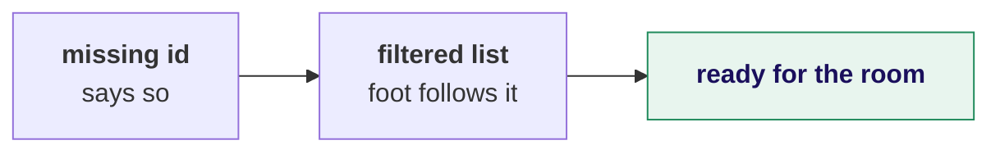
```mermaid
flowchart LR
    A["<b>missing id</b><br/>says so"] --> B["<b>filtered list</b><br/>foot follows it"] --> C["<b>ready for the room</b>"]
    classDef good fill:#E8F5EE,stroke:#1F8A5B,color:#1A0F5C
    class C good
```

```notes
LIVE, 5 minutes. One learner answers aloud: give a finished table with marked inputs, a lookup
that says not found, a total that follows the filter; never the source, a lookup that can answer
wrong, or a number without its definition.
BREAK, 10 minutes, after this slide.
```

---

## SECTION 4: Round 3, the front page
*One number, read correctly in two minutes by a director who has not seen the sheet.*

```notes
LIVE. Round three runs 50 minutes: question and picture (5), demonstration (12), two traps (18), the
room's variant (10), Kavya's review (5). Notebook 3 sits beside it.
```

---

## S30. The question for round 3
*One number on the front page, with its trend, that a director cannot misread.*

**The client asks.** "One number on the front page with its trend. If a director changes an assumption in the room, the sheet must recalculate in front of them."

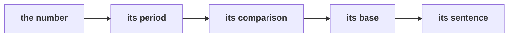
```mermaid
flowchart LR
    N["<b>the number</b>"] --> P["<b>its period</b>"] --> C["<b>its comparison</b>"] --> B["<b>its base</b>"] --> S["<b>its sentence</b>"]
    classDef known fill:#EEEAFB,stroke:#5B3FD6,color:#1A0F5C
```

```notes
LIVE, 3 minutes. Draw the card's five parts on the board. Everything in this round is one of them
missing.
```

---

## S31. The number: Q2 revenue against Q1
*The growth review asks what moved, so the number is the latest quarter against the one before.*

```stats
value: Rs 9.84 cr | label: Q2 revenue | note: July to September 2026
value: Rs 10.00 cr | label: Q1 revenue | note: April to June 2026
value: -1.6% | label: Q2 on Q1 | note: measured on Q1
```

The sentence beside it carries the finding: the fall sits in Retail-Plus, where orders per member fell from 2.36 to 1.84.

```notes
LIVE, 4 minutes. Ask why not Retail-Plus orders per member as the headline. It is the finding, and
it goes in the sentence; the front page answers the question the review is about.
```

---

## S32. Question: what does a director read here
*The fastest card is the clean table's grand total, in big type.*

```stats
value: Rs 19.84 cr | label: Revenue | note: the card as drafted
```

**Question.** A director remembers Rs 10.00 crore for Q1. What do they read in this card? a) two quarters of revenue; b) revenue nearly doubled this quarter; c) a number to check later; d) nothing, the number is correct.

```notes
LIVE, 2 minutes. Letters. Then ask who in the room has ever seen b happen in a real meeting.
```

---

## S33. Answer: a doubled quarter that never happened
*The card is two quarters added together, and nothing on it says so.*

```stats
value: Rs 19.84 cr | label: what the director reads | note: two quarters, read as one
value: Rs 9.84 cr | label: Q2, like with like | note: July to September
value: Rs 10.00 cr | label: Q1, what they remember | note: April to June
```

The answer is b. **The fix:** "Q2, July to September 2026: Rs 9.84 crore, down 1.6 percent on Q1, April to June 2026 (Rs 10.00 crore)."

```notes
LIVE, 4 minutes. The check is to read the card aloud and ask which months and against what. A card
that cannot answer is not ready.
```

---

## S34. The plausible wrong card: down 29.4 percent
*The second slot, drafted: "Retail-Plus revenue down 29.4 percent."*

```stats
value: -29.4% | label: Retail-Plus, as drafted | note: no base, no share
value: Rs 1.72 lakh | label: the fall in rupees | note: on a Rs 10.00 crore quarter
value: 0.4% | label: Retail-Plus's share of Q2 | note: the base the card left out
```

**What breaks.** Read without its base, 29.4 percent sounds like the business collapsing, and the room argues about a panic instead of about members who order less often.

```notes
LIVE, 5 minutes. The 29.4 percent is correct. It is 29.4 percent of Rs 5.86 lakh. The fix is the base
and the share beside it.
```

---

## S35. The base, and a slip that makes it worse
*A change is measured on the earlier period.*

| How the change is computed | Retail-Plus, Q1 to Q2 |
|---|---|
| On the earlier quarter, (Q2 - Q1) / Q1 | -29.4% |
| On the current quarter, (Q2 - Q1) / Q2 | -41.7% |

**The fix.** "Retail-Plus, Q2: Rs 4.13 lakh, down 29.4 percent on Q1 (Rs 5.86 lakh); 0.4 percent of company revenue."

```notes
LIVE, 4 minutes. The decision tool's Front page tab ships with the wrong base planted; the room
finds it there in the afternoon.
```

---

## S36. The trend, and what makes it lie
*The company line is Business's invoices; the consumer line is the story.*

| Month | All segments | All except Business |
|---|---|---|
| June | Rs 3.12 crore | Rs 3.32 lakh |
| July | Rs 4.51 crore | Rs 2.91 lakh |
| August | Rs 2.69 crore | Rs 2.76 lakh |
| September | Rs 2.64 crore | Rs 2.48 lakh |

July's company revenue is 45 percent above June's because corporate invoices landed in it. Take Business out and consumer revenue falls in each of the last three months.

```notes
LIVE, 4 minutes. Notebook 3 draws both lines. The trend beside the card is the consumer line,
labelled as such, since the question is about members.
```

---

## S37. The card, recomputed when a director asks
*The scope is a yellow input, and the number, comparison and base move together.*

| The director asks | The card says |
|---|---|
| All segments | Rs 9.84 crore, down 1.6% on Q1; 100.0% of revenue |
| Take Business out | Rs 8.15 lakh, down 17.3% on Q1; 0.8% of revenue |
| Show me Retail-Plus | Rs 4.13 lakh, down 29.4% on Q1; 0.4% of revenue |

Every line comes from the same orders, so two directors get two honest answers, each labelled with its scope.

```notes
LIVE, 4 minutes. Change the FrontPage tab's scope cell live in the deck pack and let the chart move.
This is the chief of staff's condition met.
```

---

## S38. Your turn: the director's three asks
*The deck pack's FrontPage and Protect tabs, changed as a director would change them.*

```timeline
label: Ask 1 | title: Top forty | body: Change the list size and read the new total.
label: Ask 2 | title: No Business | body: Change the card's scope and read the new change.
label: Ask 3 | title: Per row | body: Count each order once per row and read the release. | tone: dark
```

**The harder variant.** Ten minutes. Post the three sentences the sheet wrote.

```notes
LIVE, 10 minutes. Ask 3 reproduces round 1's trap inside the deck pack: the Tree says do not send and
the release blocks everything. Take answers on why the card is held too.
```

---

## S39. Kavya's review of round 3
*If the card cannot say which months, against what and out of how much, it goes back.*

**Kavya's review.** A number without its period is read against whatever the director remembers. A percentage without its base is read as whatever the director fears.

**In the interview.** [F] How do you present one number so it is not misread?

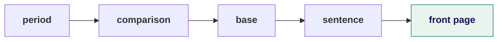
```mermaid
flowchart LR
    A["<b>period</b>"] --> B["<b>comparison</b>"] --> C["<b>base</b>"] --> D["<b>sentence</b>"] --> E["<b>front page</b>"]
    classDef good fill:#E8F5EE,stroke:#1F8A5B,color:#1A0F5C
    class E good
```

```notes
LIVE, 5 minutes. One learner answers aloud, with the card from S33 as the example.
```

---

## S40. The morning in one picture
*Four silent lies, each with its check and its fix.*

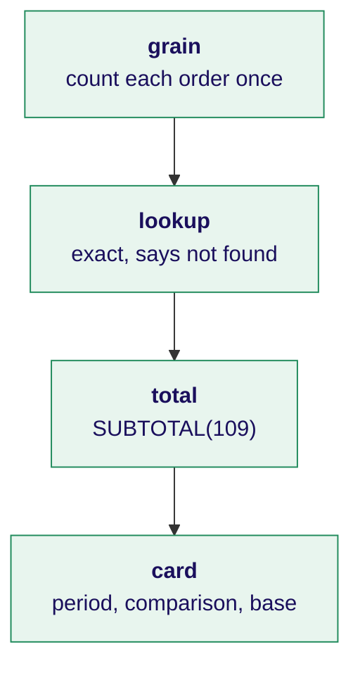
```mermaid
flowchart TB
    G["<b>grain</b><br/>count each order once"] --> L["<b>lookup</b><br/>exact, says not found"]
    L --> V["<b>total</b><br/>SUBTOTAL(109)"]
    V --> C["<b>card</b><br/>period, comparison, base"]
    classDef good fill:#E8F5EE,stroke:#1F8A5B,color:#1A0F5C
    class G,L,V,C good
```

After lunch the three deliverables run end to end on the escalated case, and a director asks to edit the source.

```notes
LIVE, 2 minutes. Point back at the morning's first picture: every red box is now green. Transition
to lunch.
```
