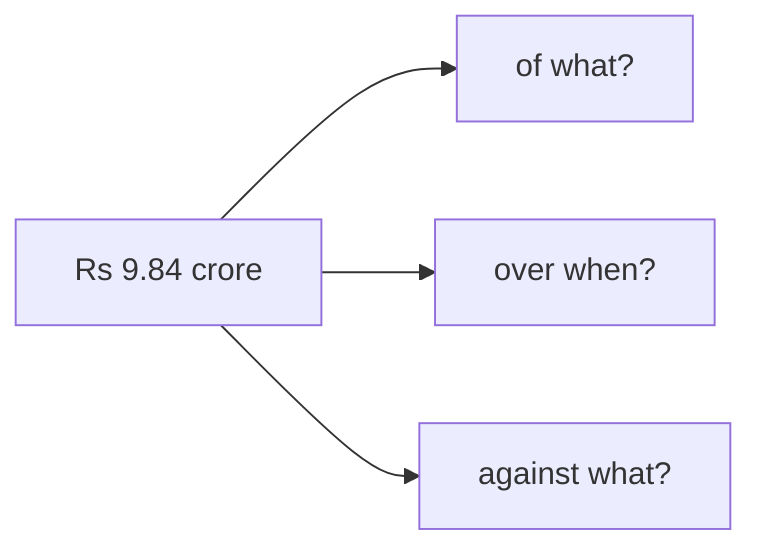
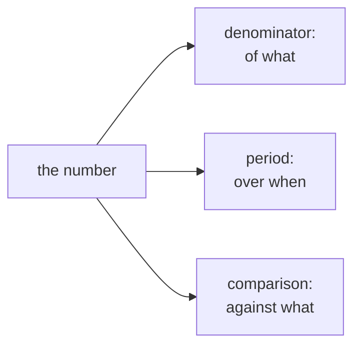
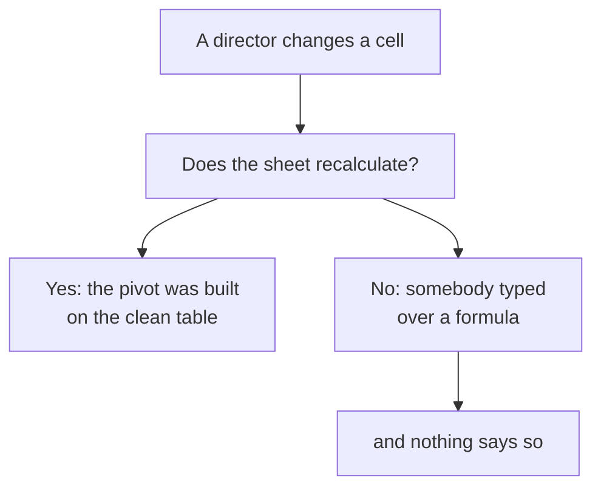
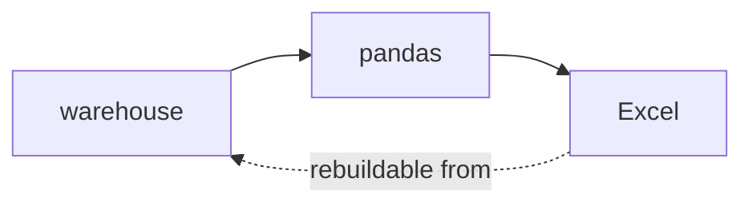
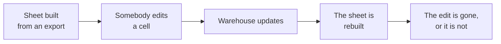
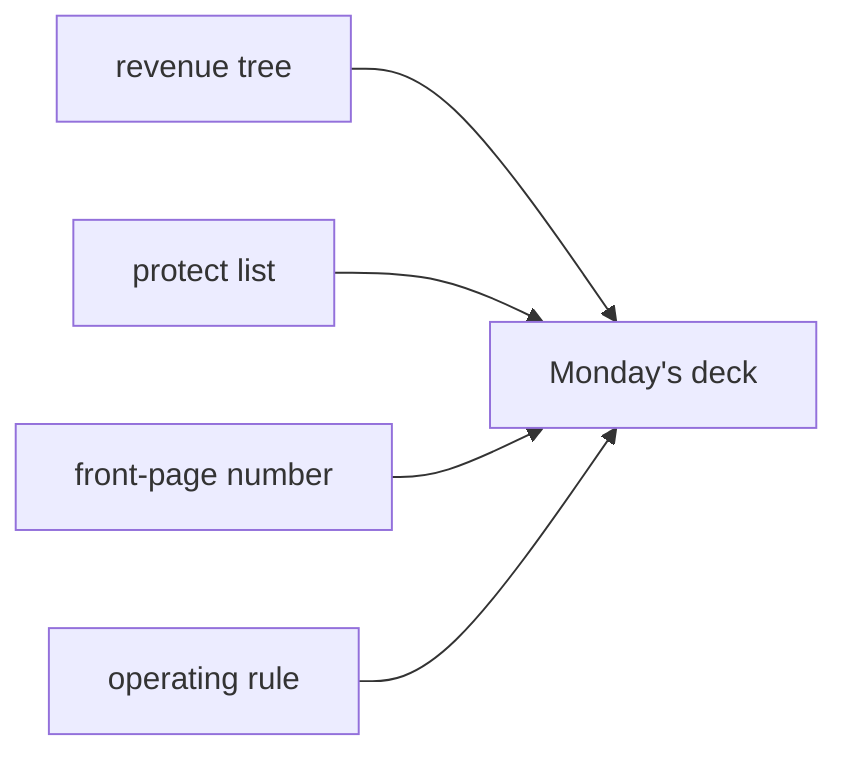

# Half two: one number on a front page, and the rule that holds

Week 2, Day 5. Slide source. One idea per slide.

Position bar, repeated at every section boundary:
`[one number] > [the director's hand] > [the operating rule] > [what ships]`

---

## SECTION D. One number, read correctly

---

## S1. The front page carries one figure
A director reads it in about two minutes, between two other meetings, and repeats it in a third.

Whatever they repeat is what the number means from then on.

---

## S2. A bare number cannot be read

> Revenue: Rs 9.84 crore

Of what. Over what period. Compared with what. Three questions, and the number answers none of
them.

---

## S3. The three things a number needs beside it

---

## S4. The same figure, readable
> **Rs 9.84 crore** collected in Q2 across 462 orders, against Rs 10.00 crore in Q1, a fall of
> 1.6 percent.

Same number. Now it can be repeated in a meeting you are not in without changing meaning.

---

## D1. The sentence beside it does the work the chart cannot
A trend line shows direction. It does not say whether the direction matters, and a director
reading a falling line will supply their own reason for it if you do not supply one.

One sentence, and it names the branch: frequency in Retail-Plus, not customer count.

---

## SECTION E. The director's hand on the keyboard

---

## S5. Something will get changed in the room
An assumption, a filter, a date range. That is the point of sending a sheet rather than a picture.

---

## S6. What has to be true for that to be honest

---

## S7. Two rules that keep it honest
| Rule | Why |
|---|---|
| Inputs live in their own cells, marked | So a director changes an input rather than a result |
| Results are formulas all the way down | So a change propagates rather than sitting in one cell |

A result cell holding a typed number is indistinguishable from one holding a formula, until
somebody changes an input and nothing moves.

---

## D2. The thing you say before they touch it
> "The blue cells are yours to change. Everything else recalculates. If a number you expected to
> move does not, tell me, because that is a bug rather than a surprise."

Thirty seconds, said once, and it converts a risk into a test the room runs for you.

---

## SECTION F. The operating rule

---

## S8. Three tools, three jobs, one page

| Lives in | Owns | Never |
|---|---|---|
| The warehouse | The numbers Finance acts on | Exploration |
| pandas | The analyst's iteration, the weekly table | The source of truth |
| Excel | Presentation, and a stakeholder poking at it | Cleaning, joining, computing the truth |

---

## S9. And the fourth line, which is the hard one
> Whatever is in Excel must be reproducible from the warehouse in one run.

If the sheet cannot be rebuilt, it has become a source of truth by accident, and nobody decided
that.

---

## S10. How the two drift apart

Either outcome is bad. Losing a correction silently, or keeping it silently.

---

## S11. So the export is dated and the sheet says so
One cell, top left of the first sheet: what this was built from, and when.

It costs nothing and it is the difference between a sheet somebody trusts and a sheet somebody
has to ask about.

---

## SECTION G. What ships

---

## S12. Four things for Monday's deck

| Piece | What it is |
|---|---|
| The revenue tree | A pivot on the clean table, sliceable by segment and quarter |
| The protect list | Top fifty per segment, with an XLOOKUP that fails visibly |
| The front-page number | One figure with denominator, period and comparison |
| The operating rule | Three lines plus the reproducibility line |

---

## S13. What this week equipped you to answer
> [S] SQL, pandas or Excel: how do you choose?
> [S] A stakeholder wants to poke the numbers themselves; what do you give them and what do you
> never give them?
> [F] Your pivot shows a different total from the warehouse; where do you look first?
> [F] How do you present one number so it is not misread?
> [D] Two directors change assumptions in the room and the sheet recalculates differently for
> each; what did you get right and what do you fix?

---

## S14. Tomorrow, and Monday
Tomorrow the fortnight goes under questioning on paper.

Monday, Build 1 opens in Kalpa Health. The method transfers. The domain does not.
