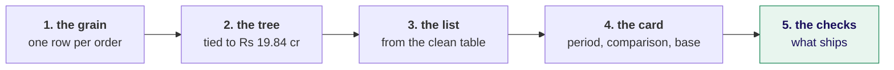
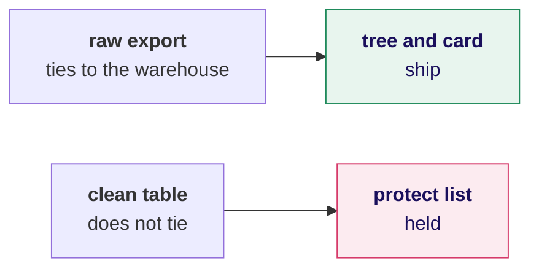
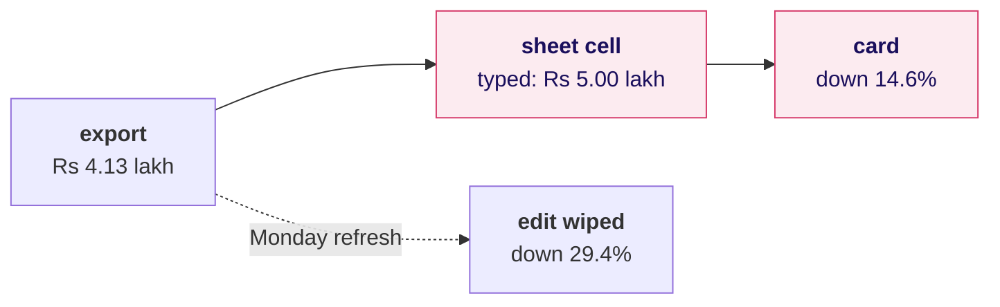
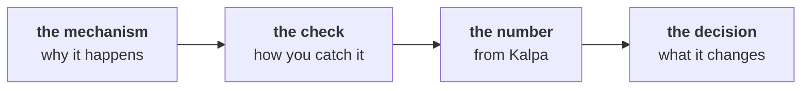
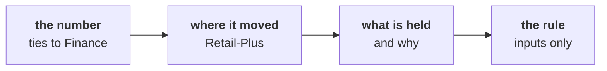

# The sheet a director cannot break

Week 2, Day 5. Half two.

Kicker: WEEK 2  ·  FRIDAY  ·  HALF TWO
Quote: Everything you built this week has to survive a room that only has Excel. Which parts belong in Excel, which must never be in Excel, and how do you keep the two from drifting apart?
Who: Kavya Nair, senior analyst, Kalpa Retail data team

```notes
LIVE, one minute. The afternoon has two cases. The escalated case is the three deliverables end to
end, alone; the second case is a director who wants to edit the source, in pairs. Then the interview
drill and the close.
```

---

## SECTION 1: The escalated case
*Monday's deck pack, end to end, from the two exports, alone, in 60 minutes.*

```notes
LIVE. The escalated case runs 60 minutes, unguided. The support TA answers environment problems
only. The solution, the deck pack workbook and the hands-on solution notebook, opens at the debrief.
```

---

## S1. The brief, in the chief of staff's words
*Three deliverables, one workbook, and a director with their hands on it.*

**The client asks.** "Build me the file I open on Monday: the tree by segment for both quarters, the protect list with the lookup, and the front-page number with its trend. I will change things in the room. Tell me what I can trust it for."

| Part | What you ship | Minutes |
|---|---|---|
| 1 | The tree by segment and quarter, each order once, tied to the warehouse | 15 |
| 2 | The protect list and a lookup that says when an id is missing | 12 |
| 3 | The front-page card with its trend and a scope a director can change | 12 |
| 4 | What ships on Monday and what is held, with the reason | 6 |
| 5 | The numbers proved a second way, in the hands-on notebook | 15 |

```notes
LIVE, 3 minutes. Read the brief aloud, point at the five parts and start the clock. The brief file
is exercises/unguided/C2_W02_D05_escalated_case_STUDENT.md, with eight items at its foot.
```

---

## S2. The order of work
*Grain first, because every other number sits on it.*


```mermaid
flowchart LR
    A["<b>1. the grain</b><br/>one row per order"] --> B["<b>2. the tree</b><br/>tied to Rs 19.84 cr"]
    B --> C["<b>3. the list</b><br/>from the clean table"]
    C --> D["<b>4. the card</b><br/>period, comparison, base"]
    D --> E["<b>5. the checks</b><br/>what ships"]
    classDef good fill:#E8F5EE,stroke:#1F8A5B,color:#1A0F5C
    class E good
```

A learner who starts on the card has built a number on a grain nobody checked.

```notes
SELF-STUDY, 1 minute. Leave it on screen during the case.
```

---

## S3. What done looks like
*A Checks tab that says, in a sentence, what may go into the deck.*

```cards
icon: circle-check | eyebrow: Check 1 | title: The tree reconciles | body: Its two quarters sum to Monday's Rs 19,84,00,000 to the rupee.
icon: circle-check | eyebrow: Check 2 | title: The list's source reconciles | body: The clean table's revenue and orders tie to the warehouse.
icon: circle-check | eyebrow: Check 3 | title: The lookup answers honestly | body: The row returned is the id asked for, or it says not found.
icon: circle-check | eyebrow: Check 4 | title: The card ties to the tree | body: Its quarters are the tree's quarters. | tone: dark
```

**Kavya's review.** A deliverable that fails its check is held with its reason, never shipped with a footnote.

```notes
SELF-STUDY, 1 minute. The deck pack in demos/ has exactly this tab. Its release sentence is the
answer to part 4.
```

---

## SECTION 2: The debrief
*The wrong numbers this room produced, in the order the day produced them.*

```notes
LIVE. The debrief runs 15 minutes. Collect the room's wrong numbers during the case and show the
ones that actually appeared; the table on S4 is the list most rooms produce.
```

---

## S4. The wrong numbers, and what each would have done
*Every one of them was plausible, and none raised an error.*

| The number | Where it came from | What it would have done |
|---|---|---|
| Rs 39.41 crore | Sum over payment rows | Doubled the deck's revenue |
| Rs 39.41 crore again | Remove Duplicates, then Sum | The same, with false confidence |
| A neighbour's row | Approximate lookup on a missing id | Protected someone who stopped buying |
| Rs 7,14,890 for Mumbai | SUM on a filtered list | A budget four and a half times too big |
| Rs 19.84 crore, bare | A card with no period | A doubled quarter read into the minutes |
| 41.7 percent | A change on the wrong base | A fall overstated by twelve points |

```notes
LIVE, 6 minutes. Walk down the table and, for each row, ask who produced it during the case. No
shaming; each is the plausible number a hurried sheet shows.
```

---

## S5. Question: which deliverable does the release hold
*The tree and the card reconcile. The list comes from a different export.*

**Question.** On Monday, which part of the deck pack does the Checks tab hold back? a) the tree, because it is built from the raw export; b) the protect list, until the customer table reconciles to the warehouse; c) the front page, because its trend is lumpy; d) nothing, since every number is a formula.

```notes
LIVE, 2 minutes. Letters. Those who ran round 1's harder variant should know.
```

---

## S6. Answer: the protect list, until its source reconciles
*A formula is only as good as the table it reads.*


```mermaid
flowchart LR
    R["<b>raw export</b><br/>ties to the warehouse"] --> T["<b>tree and card</b><br/>ship"]
    C["<b>clean table</b><br/>does not tie"] --> L["<b>protect list</b><br/>held"]
    classDef good fill:#E8F5EE,stroke:#1F8A5B,color:#1A0F5C
    classDef bad fill:#FCEBF0,stroke:#D63A6A,color:#1A0F5C
    class T good
    class L bad
```

The answer is b. The note to the data platform lead names the gap and asks for the export to be rerun; the list ships when its source reconciles.

```notes
LIVE, 4 minutes. TRAINER: the gap and the missing member are in the day sheet; say them aloud now,
since the room has found them. Option d is the trap of the afternoon: formulas recalculating is not
the same as the numbers being right.
BREAK, 10 minutes, after this slide.
```

---

## SECTION 3: The second case
*A director wants to type a number into the source. The pair defends the operating rule.*

```notes
LIVE. The second case runs 45 minutes in pairs: one plays the director, one defends the rule, then
they swap. The hands-on notebook ex2 plays the same scene in four steps.
```

---

## S7. What the director says
*In the room, with the sheet on the projector.*

> "Retail-Plus will be back at five lakh next quarter; I have spoken to the team. Type five lakh into Q2 so the card stops frightening people, and fix the source later." A director, Kalpa Retail

**The client asks.** Can the sheet show what the director expects, and still be the number Finance signs?

```notes
LIVE, 3 minutes. Read it in the director's voice. The request is reasonable in a meeting and
corrosive in a file. The pair's job is to say yes to the question and no to the edit.
```

---

## S8. What a typed-over cell does
*The card recalculates from the cell, and the next refresh wipes it without a trace.*


```mermaid
flowchart LR
    E["<b>export</b><br/>Rs 4.13 lakh"] --> S["<b>sheet cell</b><br/>typed: Rs 5.00 lakh"]
    S --> C["<b>card</b><br/>down 14.6%"]
    E -.->|"Monday refresh"| W["<b>edit wiped</b><br/>down 29.4%"]
    classDef bad fill:#FCEBF0,stroke:#D63A6A,color:#1A0F5C
    class S,C bad
```

For a week, the deck says Retail-Plus fell 14.6 percent while Finance's books say 29.4. Then the refresh restores the export and nobody can say why the two differed.

```notes
LIVE, 4 minutes. Notebook ex2, steps 1 to 3. The drift check that catches it is the sheet's Q2
total against the warehouse's Q2 total.
```

---

## S9. The operating rule
*The warehouse owns the number, pandas owns the iteration, Excel owns the last mile.*

```cards
icon: database | eyebrow: The warehouse | title: Owns the number | body: Anything Finance audits or that needs a join, a dedupe or a cleaning step.
icon: code | eyebrow: pandas | title: Owns the iteration | body: The analyst's question that changes daily, until Finance relies on it.
icon: table | eyebrow: Excel | title: Owns the last mile | body: Presents, slices and looks up an export, and takes what-ifs as labelled inputs. | tone: dark
```

**The rule.** Nobody types over the source. A director's assumption is an input beside it, and the sheet ties back to the warehouse every time it is refreshed.

```notes
LIVE, 5 minutes. This is Thursday's tool-choice note turned into a team rule. The decision tool's
Rule tab asks the four questions in the right order.
```

---

## S10. Question: where does the director's what-if go
*The question is legitimate; the edit is not.*

**Question.** Where does "Retail-Plus back at five lakh" belong in the sheet? a) over the Q2 cell, with a comment; b) in a yellow input cell feeding a separate, labelled scenario line on the card; c) in the export, before it is loaded; d) nowhere, since directors do not get what-ifs.

```notes
LIVE, 2 minutes. Letters, then each pair says why their letter survives the director's pushback.
```

---

## S11. Answer: a labelled input beside the source
*Two lines on one card: what the export says, and what the director assumes.*

| Line on the card | Retail-Plus, Q2 on Q1 | Where it comes from |
|---|---|---|
| Actual | -29.4% | The export, tied to the warehouse |
| The director's scenario | -14.6% | A yellow input of Rs 5,00,000 |

The answer is b. The director gets the number they want to discuss, the card keeps the number Finance signs, and both are labelled.

```notes
LIVE, 4 minutes. Option d is how a team ends up with directors typing over cells anyway. Option c
edits the source of truth, which is what the rule forbids.
```

---

## S12. The pair's defence, in three lines
*What one partner says to the director, then they swap.*

```timeline
label: Line 1 | title: Yes to the question | body: I will show five lakh as your scenario, beside the actual.
label: Line 2 | title: No to the edit | body: The actual comes from the export Finance ties to; typing over it breaks that tie.
label: Line 3 | title: The check | body: Every refresh ties the sheet back to the warehouse, so a drift shows the same day. | tone: dark
```

**In the interview.** [D] Two directors change assumptions in the room and the sheet recalculates differently for each; what did you get right and what do you fix?

```notes
LIVE, 20 minutes for the role play: ten each way. Walk the room; listen for anyone who says no to the
question as well as to the edit.
```

---

## SECTION 4: The interview drill
*Eleven questions, answered aloud, the way an analytics screen asks them.*

```notes
LIVE. The drill runs 30 minutes: pairs, one asks and one answers in under a minute, then swap. The
answers in one breath are in the day sheet and in full in the study notes.
```

---

## S13. The questions, with their tags
*The row's five, then six follow-ups a screen asks next.*

| Tag | Question |
|---|---|
| [S] | SQL, pandas or Excel: how do you choose? |
| [S] | A stakeholder wants to poke the numbers; what do you give them and never give them? |
| [F] | Your pivot shows a different total from the warehouse; where do you look first? |
| [F] | How do you present one number so it is not misread? |
| [D] | Two directors change assumptions and the sheet recalculates differently; what did you get right, what do you fix? |
| [F] | Your lookup returned a member for an id that does not exist; which argument was wrong? |
| [F] | You filter a list and its total does not move; what is the foot doing? |
| [S] | Why does Remove Duplicates not fix an export at the payment grain? |
| [F] | A director says revenue doubled; your card says Rs 19.84 crore; what is missing? |
| [D] | A segment fell 29 percent and is 0.4 percent of revenue; does it go on the front page, and how? |
| [D] | A director wants to type over the source in the room; what do you say, and what do you build? |

```notes
LIVE, 25 minutes. Pairs take them in order. Tags: [S] staple, [F] frequent in GCC and product
screens, [D] differentiator, the programme's own calibration.
```

---

## S14. The shape of a strong answer
*The mechanism, the check, the number from this week, and the decision it changes.*


```mermaid
flowchart LR
    M["<b>the mechanism</b><br/>why it happens"] --> K["<b>the check</b><br/>how you catch it"]
    K --> N["<b>the number</b><br/>from Kalpa"]
    N --> D["<b>the decision</b><br/>what it changes"]
```

"A Sum adds one value per row; I count rows against order ids; here 1,450 rows held 1,000 orders and the pivot read Rs 39.41 crore; counting each order once gave the warehouse's Rs 19.84 crore, so the deck carries the right quarter."

```notes
LIVE, 5 minutes. Read the example aloud and ask one pair to redo their weakest answer in this shape.
```

---

## SECTION 5: The close
*The sentence to the chief of staff, the day's crux lines, and Monday in Kalpa Health.*

```notes
LIVE. The close runs 20 minutes: the sentence (3), the crux lines (2), the Kahoot (12), Build 1 (3).
```

---

## S15. The sentence to the chief of staff
*What she can trust the file for, and what she cannot.*

> "The tree and the front page tie to Finance's Rs 9.84 crore for Q2, down 1.6 percent on Q1, and the fall sits in Retail-Plus, where orders per member fell from 2.36 to 1.84. The protect list is held until the customer export is rerun, because it does not tie to the warehouse. Change the yellow cells freely; never type over a number." The team, to Meera's chief of staff


```mermaid
flowchart LR
    A["<b>the number</b><br/>ties to Finance"] --> B["<b>where it moved</b><br/>Retail-Plus"] --> C["<b>what is held</b><br/>and why"] --> D["<b>the rule</b><br/>inputs only"]
```

```notes
LIVE, 3 minutes. Two learners read their own sentences; check each for the number, the period, the
comparison, what is held and why.
```

---

## S16. The crux lines
*The five lines the cheat sheet and the notes repeat word for word.*

1. A pivot is only as honest as the rows under it: say the grain, count rows against ids, tie the total to the warehouse.
2. A lookup that cannot find an id says so; an approximate match answers with a neighbour.
3. The foot of a filtered list adds only what the director can see: SUBTOTAL(109), never SUM.
4. One number reaches the front page with its period, its comparison and its base.
5. The warehouse owns the number, pandas owns the iteration, Excel owns the last mile, and nobody types over the source.

```notes
LIVE, 2 minutes. Read them once. They are on the cheat sheet's panels in this order.
```

---

## S17. Kahoot
*Eight items, ungraded, including Thursday's merge one level up.*

```stats
value: 8 | label: items | note: including the return question
value: 0 | label: marks | note: a performance indicator only
```

```notes
LIVE, 12 minutes. Run kahoot/C2_W02_D05_quiz_STUDENT.md. The return question is Thursday's: 1,000
customers merged to 1,120 rows.
```

---

## S18. Monday: the same method, a business you have not seen
*Build 1 opens in Kalpa Health, with the project introduction online.*

Dr Priya Menon, COO of Kalpa Health, brings Meera's question to a diagnostics business that grew 5 percent against a plan of 18.

```cards
icon: flask-conical | eyebrow: What stays | title: The method | body: The tree, the grain, the reconciliation, the card with its period and base.
icon: hospital | eyebrow: What changes | title: The domain | body: Labs, bookings, collections and clinics, in five sub-problems.
icon: circle-help | eyebrow: Left open | title: Monday's question | body: What is an order, a customer and a payment in a diagnostics business? | tone: dark
```

```notes
LIVE, 3 minutes. Leave the last card's question open. Saturday's recap paper comes first; the
pre-read for Monday ships tonight.
```
