# Can a director change it and still trust it?

Week 2, Day 5. Half two.

Kicker: WEEK 2  ·  FRIDAY  ·  HALF TWO
Quote: Everything you built this week has to survive a room that only has Excel. Which parts belong in Excel, which parts must never be in Excel, and how do you keep the two from drifting apart?
Who: Kavya Nair, senior analyst, Kalpa Retail data team

```notes
LIVE, one minute. The morning built the tree, the list, the card and the rule. The afternoon hands the
workbook to a director: chapter 6, then the escalated case alone, the debrief of the room's wrong
numbers, the director's edit in pairs, the interview drill, and the close.
```

---

## SECTION 6: Can a director break it?
*When a director takes the workbook in the room, what can they break, and which checks catch it before anyone reads a wrong number? The chief of staff's last condition rides on it.*

```notes
LIVE. Thirty minutes. Notebook C2_W02_D05_06_director_proof beside it; the reference workbook,
demos/C2_W02_D05_deck_pack_STUDENT.xlsx, open in Excel.
```

---

## S1. Answer it in six steps, from the room to the release
*Who needs the answer, and what must we find out on the way?*

**Who needs the answer.** The chief of staff, who hands the laptop across mid-meeting, and the head of Retail-Plus, who sizes each city's budget from the list; a total that keeps counting hidden rows sizes a budget on the whole list.

```timeline
label: 1 | title: What will they do? | body: Five things a director does to a sheet.
label: 2 | title: How to protect it? | body: Four ways, sized.
label: 3 | title: A filtered total? | body: What the foot says.
label: 4 | title: Visible rows only? | body: SUBTOTAL, and a second route.
label: 5 | title: An assumption? | body: Where a what-if goes.
label: 6 | title: What is released? | body: The Checks tab. | tone: dark
```

```notes
LIVE, 1 minute. The morning in one line: the tree ties to the warehouse's Rs 10.00 crore and Rs 9.84
crore, the list of fifty runs from Rs 25,840 to Rs 8,580 with a lookup that says when an id is missing,
the card carries its period, comparison and base, and the warehouse owns every join.
```

---

## S2. A director will filter, sort, type and ask
*What is at stake, who is in the room, and what does a silent change cost?*

```stats
value: 50 | label: members on the list | note: Rs 7,14,890 together
value: 6 | label: cities | note: each with its own budget
value: 0 | label: errors shown | note: when a filter changes what a total means
```

**The client asks.** "If a director changes an assumption in the room, the sheet must recalculate in front of them."

```notes
LIVE, 2 minutes. The head of Retail-Plus sizes each city's retention budget from the list. Nothing in
Excel turns red when a filter changes what a number at the foot of a list means.
```

---

## S3. Barclays bought 179 contracts hidden in a sheet
*Which real company paid for rows nobody could see?*

```stats
value: 179 | label: contracts | note: Barclays asked the court to exclude them
value: 2008 | label: the year | note: the Lehman purchase
```

> "Contracts that had been marked as 'hidden' in the spreadsheet when it was received by the law firm were added to the purchase offer during the reformatting process." Computerworld, 14 October 2008

```notes
LIVE, 1 minute. Computerworld, 14 October 2008, checked 30 September 2026. A law firm reformatting a
spreadsheet into a PDF for the court's website exposed hidden rows. Rows a person could not see still
counted.
```

---

## S4. Yellow inputs, formulas, and a Checks tab
*How could the team protect the workbook, and what does each way cost?*

| Option | Director actions it allows, of 5 | A wrong number is caught by |
|---|---|---|
| a) Protect every cell | 2: filter and sort, if protection allows | nothing: no what-if can be asked |
| b) Send a PDF | 0 | nothing: nothing recalculates |
| c) Yellow inputs, formulas, a Checks tab | 5 | a red check and a release that holds |
| d) A copy for each director | 5 | nothing: the copies drift apart |

**The call.** c, the only way that lets a director do all five and turns a wrong number red before it is read. What would switch it: a board pack nobody is meant to change goes as a PDF.

```notes
LIVE, 3 minutes. The five actions: filter, sort, type over a cell, change an assumption, paste in a new
export. Protection and the PDF fail the brief, since nothing recalculates.
```

---

## S5. Which change hides its effect without an error?
*Of the five things a director does, which change what a number means with nothing shown?*

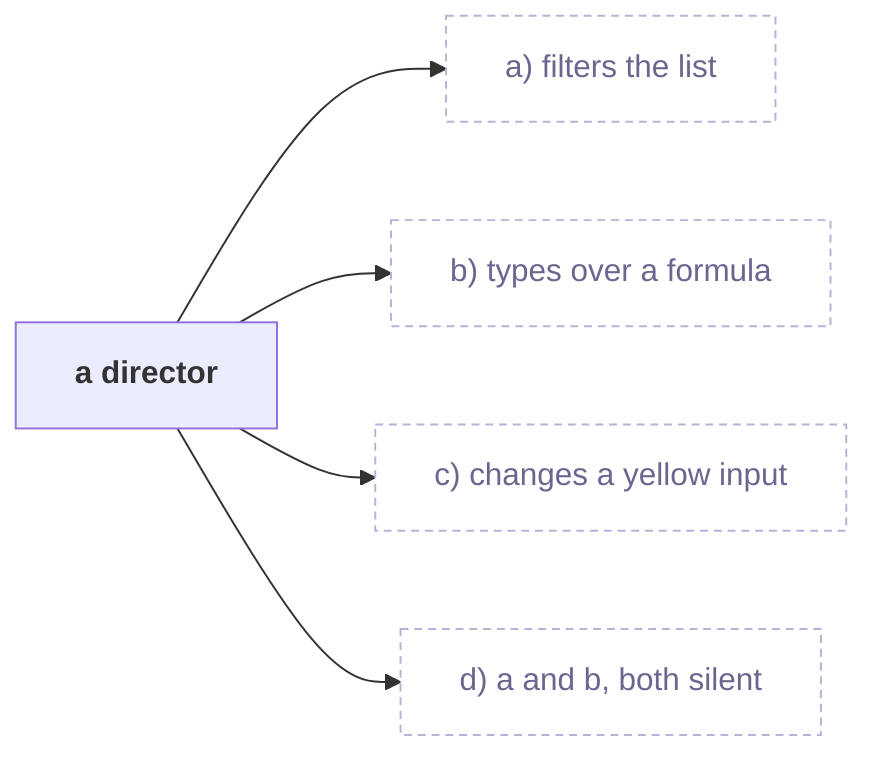
```mermaid
flowchart LR
    D["<b>a director</b>"] --> F["a) filters the list"]
    D --> T["b) types over a formula"]
    D --> Y["c) changes a yellow input"]
    D --> A["d) a and b, both silent"]
    classDef unknown fill:#FFFFFF,stroke:#B8B2D6,color:#6B6690,stroke-dasharray:4 3
    class F,T,Y,A unknown
```

**Question.** Which changes a number's meaning with no error, as a letter?

```notes
LIVE, 1 minute. Letters first.
```

---

## S6. Answer: filtering and typing over are both silent
*What does each of the five do to the sheet?*

| What a director does | What happens | Error shown? |
|---|---|---|
| Filters the list to a city | the rows on screen change; a SUM below them does not | none |
| Sorts one column on its own | values separate from their ids | none |
| Types over a formula | the cell stops following its source | none |
| Changes a yellow input | every formula reading it recalculates | honest |
| Pastes a new export | formulas read the new rows, if their ranges reach them | the drift check |

The answer is d. A yellow input is the honest way to change a number, because every formula that reads it recalculates in front of the room.

```notes
LIVE, 2 minutes. The next two steps take the filter; step 5 takes the input; the second case after the
break takes the typed-over cell.
```

---

## S7. What does the foot say, filtered to Mumbai?
*The list's foot is =SUM(E2:E51); a director filters the city column to Mumbai. What does the foot read?*

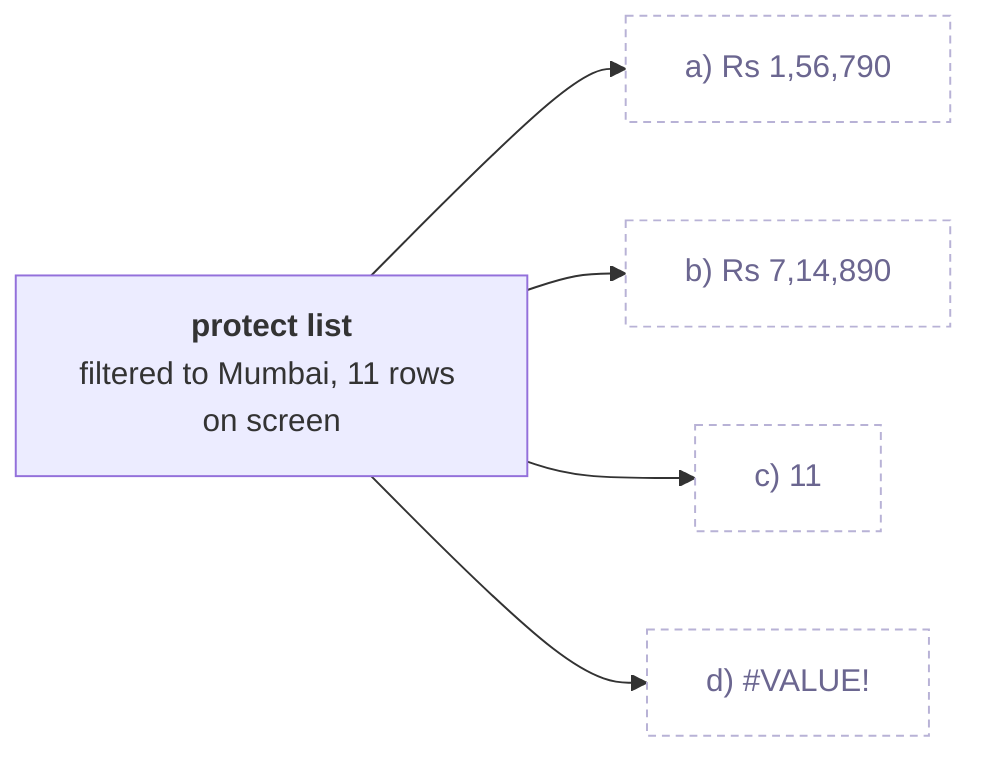
```mermaid
flowchart LR
    L["<b>protect list</b><br/>filtered to Mumbai, 11 rows on screen"] --> A["a) Rs 1,56,790"]
    L --> B["b) Rs 7,14,890"]
    L --> C["c) 11"]
    L --> D["d) #VALUE!"]
    classDef unknown fill:#FFFFFF,stroke:#B8B2D6,color:#6B6690,stroke-dasharray:4 3
    class A,B,C,D unknown
```

**Question.** What does the foot read, as a letter?

```notes
LIVE, 2 minutes. Filter it live in the reference workbook's Protect tab after switching its foot to SUM
(the tab ships with SUBTOTAL). Letters before you read the foot aloud.
```

---

## S8. Answer: Rs 7,14,890, the whole list
*What is the plausible wrong answer, and what budget would it size?*

```stats
value: Rs 7,14,890 | label: the foot, SUM | note: all fifty rows
value: Rs 1,56,790 | label: the eleven on screen | note: Mumbai's list
value: 4.6 times | label: the overstatement | note: read as Mumbai's
```

The answer is b. **What breaks:** the Mumbai store head is told the members on their list spent Rs 7.15 lakh, and a retention budget sized on it is 4.6 times too big. SUM adds every row in its range, hidden or not. **The check:** count the rows on screen beside the rows the total adds.

```notes
LIVE, 3 minutes. Read the foot aloud as if it were right, then ask how many members are on screen.
Delhi carries Rs 2,21,150 on 16 members; Mumbai is the second-largest city on the list.
```

---

## S9. The fix: SUBTOTAL(109) at the foot
*What do SUBTOTAL(109) and SUBTOTAL(103) say, filtered or hidden by hand?*

| The foot | Filtered to Mumbai | Delhi hidden by hand |
|---|---|---|
| `SUM` | Rs 7,14,890 | Rs 7,14,890 |
| `SUBTOTAL(9, ...)` | Rs 1,56,790 | Rs 7,14,890 |
| `SUBTOTAL(109, ...)` | Rs 1,56,790 | Rs 4,93,740 |

SUBTOTAL "ignores any rows that are not included in the result of a filter, no matter which function_num value you use", and 101 to 111 also ignore rows hidden by hand (Microsoft Support, SUBTOTAL, checked 30 September 2026). `=SUBTOTAL(103, A2:A51)` beside it counts 11 of 50.

```notes
LIVE, 2 minutes. On LibreOffice 24.2.7.2, SUM over three rows with one hidden by hand gave 60 and
SUBTOTAL(109) gave 40: the same rule. The label beside the foot says which rows it adds.
```

---

## S10. A second route: SUMIFS on the city
*Does a total that ignores the filter altogether agree with the foot?*

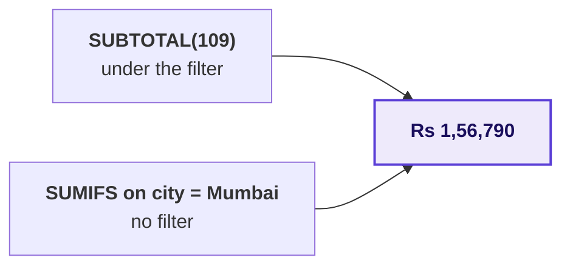
```mermaid
flowchart LR
    F["<b>SUBTOTAL(109)</b><br/>under the filter"] --> A["<b>Rs 1,56,790</b>"]
    S["<b>SUMIFS on city = Mumbai</b><br/>no filter"] --> A
    classDef known fill:#EEEAFB,stroke:#5B3FD6,color:#1A0F5C,stroke-width:2px
    class A known
```

`=SUMIFS(E2:E51, C2:C51, "Mumbai")` reads the whole list and picks Mumbai by its city, whatever the screen shows. It gives Rs 1,56,790, the same as the visible foot.

```notes
LIVE, 2 minutes. The second route does not depend on the filter, so it can disagree with the foot. Put
it on the Checks tab as the foot's partner.
```

---

## S11. Where does a director's assumption go?
*A director asks what a Rs 500 voucher for every member on the list would cost; where does the Rs 500 go?*

```text
=B1*SUBTOTAL(103, A2:A51)
```

**Question.** With the list filtered to Mumbai and the voucher at Rs 500 in yellow cell B1, the cost reads: a) Rs 25,000; b) Rs 5,500; c) Rs 500; d) Rs 7,14,890.

```notes
LIVE, 2 minutes. The voucher is an assumption, so it gets a yellow cell, and the cost is a formula that
reads it and the rows on screen.
```

---

## S12. Answer: Rs 5,500, and it moves in front of the room
*What happens when the director changes the input?*

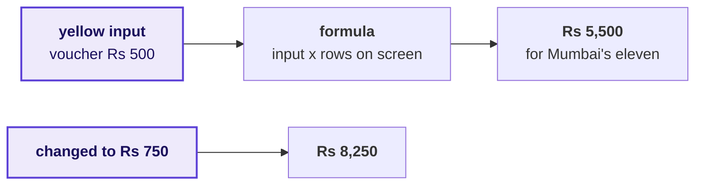
```mermaid
flowchart LR
    Y["<b>yellow input</b><br/>voucher Rs 500"] --> F["<b>formula</b><br/>input x rows on screen"]
    F --> C["<b>Rs 5,500</b><br/>for Mumbai's eleven"]
    Y2["<b>changed to Rs 750</b>"] --> C2["<b>Rs 8,250</b>"]
    classDef known fill:#EEEAFB,stroke:#5B3FD6,color:#1A0F5C,stroke-width:2px
    class Y,Y2 known
```

The answer is b: Rs 500 times the eleven on screen; the whole list would cost Rs 25,000. The director types Rs 750 and the cost becomes Rs 8,250 in front of the room, while the list's figures never change: the assumption sits beside them, never over them.

```notes
LIVE, 3 minutes. Change B1 live. This is the chief of staff's condition met: the sheet recalculates and
the source is untouched.
```

---

## S13. What does the Checks tab release?
*Five checks each compare the sheet with something outside it; what does the release hold when one fails?*

| Check | It compares | It catches |
|---|---|---|
| The tree ties | the tree's quarters against the warehouse | a pivot adding payment rows |
| The list's source ties | the customer table against the warehouse | a list on an export that is short |
| The lookup is honest | the answer for an id known to be missing | an approximate match |
| The foot follows the filter | SUBTOTAL(103) against the rows the foot adds | SUM under a filter |
| No typed-over formula | ISFORMULA outside the yellow inputs | a figure typed over a formula |

**Question.** Four checks pass and the list's source does not tie. The release: a) ships everything; b) holds the list, ships the rest; c) holds everything; d) cannot decide.

```notes
LIVE, 2 minutes. ISFORMULA "checks whether there is a reference to a cell that contains a formula, and
returns TRUE or FALSE" (Microsoft Support, checked 30 September 2026). Letters first.
```

---

## S14. Answer: hold what fails, ship the rest
*What does each failing check hold, and why is a typed-over figure different?*

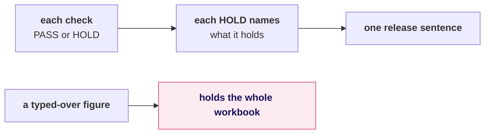
```mermaid
flowchart LR
    C["<b>each check</b><br/>PASS or HOLD"] --> H["<b>each HOLD names</b><br/>what it holds"]
    H --> R["<b>one release sentence</b>"]
    T["<b>a typed-over figure</b>"] --> W["<b>holds the whole workbook</b>"]
    classDef bad fill:#FCEBF0,stroke:#D63A6A,color:#1A0F5C
    class W bad
```

The answer is b: "Hold the protect list; ship the rest." A figure typed over a formula holds the whole workbook, since nobody can say which other numbers it moved. A formula recalculating is never the same as the number being right, so the release reads the checks and nothing else.

```notes
LIVE, 2 minutes. The notebook shows the release deciding on invented inputs; the real Checks tab runs
in the escalated case. The note that goes with a HOLD names what does not tie and asks for the export
to be rerun.
```

---

## S15. A sheet a director can change and cannot break
*What did chapter 6 answer, question by question?*

| Question | Answer |
|---|---|
| What will they do? | Filter, sort, type over, change inputs, paste exports |
| How to protect it? | c: yellow inputs, formulas, a Checks tab |
| A filtered total? | SUM still reads Rs 7,14,890 |
| Visible rows only? | SUBTOTAL(109) Rs 1,56,790; SUMIFS agrees |
| An assumption? | A yellow input: Rs 500 costs Rs 5,500 for Mumbai |
| What is released? | Hold what fails, ship the rest |

**Kavya's review.** "A director who filters, sorts or asks a what-if should see a number move, and never a number lie."

**In the interview.** [F] You filter a list and its total does not move; what is the foot doing?

```notes
LIVE, 2 minutes. One learner answers aloud: adding hidden rows, SUM; SUBTOTAL(109) adds what is on
screen, SUBTOTAL(103) counts it; Mumbai Rs 7,14,890 against Rs 1,56,790.
```

---

## SECTION 7: Can you ship it alone?
*Can you build the three deliverables and the Checks tab from the two exports, alone? The chief of staff opens it on Monday.*

```notes
LIVE. Fifty minutes, unguided. The support TA answers environment problems only. The brief is
exercises/unguided/C2_W02_D05_escalated_STUDENT.md; the notebook is
notebooks/C2_W02_D05_ex1_escalated_case_STUDENT.ipynb. Solutions open at the debrief.
```

---

## S16. Answer it in five parts, in the chief of staff's words
*What does the chief of staff want, and how long does each part take?*

**The client asks.** "Build me the file I open on Monday: the tree by segment for both quarters, the protect list with the lookup, and the front-page number with its trend. I will change things in the room. Tell me what I can trust it for."

| Part | The question it answers | Minutes |
|---|---|---|
| 1 | Does the tree for both quarters tie to the warehouse? | 12 |
| 2 | Does the list hold the right fifty, and does the lookup say when an id is missing? | 10 |
| 3 | Does the card carry its period, comparison and base, for any scope? | 10 |
| 4 | What ships on Monday, and what is held? | 5 |
| 5 | Do the numbers agree a second way? | 10 |

```notes
LIVE, 3 minutes. Read the brief aloud, point at the five parts and start the clock: 47 minutes of work.
```

---

## D17. What done looks like
*Which checks must the file pass before it goes to Monday?*

```cards
icon: circle-check | eyebrow: Check 1 | title: The tree ties | body: Its two quarters sum to the warehouse's Rs 10,00,00,000 and Rs 9,84,00,000.
icon: circle-check | eyebrow: Check 2 | title: The source ties | body: The customer table's orders and revenue tie to the warehouse.
icon: circle-check | eyebrow: Check 3 | title: The lookup is honest | body: It says when an id is missing.
icon: circle-check | eyebrow: Check 4 | title: The release says it | body: What ships, what is held, and why. | tone: dark
```

**Kavya's review.** A deliverable that fails its check is held with its reason, never shipped with a footnote.

```notes
SELF-STUDY, leave on screen during the case. The reference workbook in demos/ has exactly this tab.
```

---

## SECTION 8: Which numbers were wrong?
*Which wrong numbers did this room produce, in the order the day produced them? Every one was plausible.*

```notes
LIVE. Fifteen minutes. Collect the room's wrong numbers during the case and show the ones that actually
appeared; the table on S18 is the list most rooms produce.
```

---

## S18. Answer: seven plausible numbers, none raised an error
*Which wrong numbers appeared, and what would each have done?*

| The number | Where it came from | What it would have done |
|---|---|---|
| Rs 11,66,786 an order | a leaf averaged per customer | a tree that does not multiply back |
| Rs 39.41 crore | Sum over payment rows | doubled the deck's revenue |
| Rs 39,40,57,740 | Remove Duplicates, then Sum | the same, with false confidence |
| C-0194's row for C-0195 | an approximate lookup | an offer to someone who stopped buying |
| Rs 19.84 crore, bare | a card with no period | a doubled quarter in the minutes |
| 41.7 percent | a change on the wrong base | a fall overstated by twelve points |
| Rs 7,14,890 for Mumbai | SUM on a filtered list | a budget 4.6 times too big |

```notes
LIVE, 6 minutes. Walk down the table and, for each row, ask who produced it during the case. No
shaming: each is the number a hurried sheet shows.
```

---

## S19. Which part does the release hold?
*The tree and the card tie; the list comes from a different export. If that export does not tie, what does the Checks tab hold?*

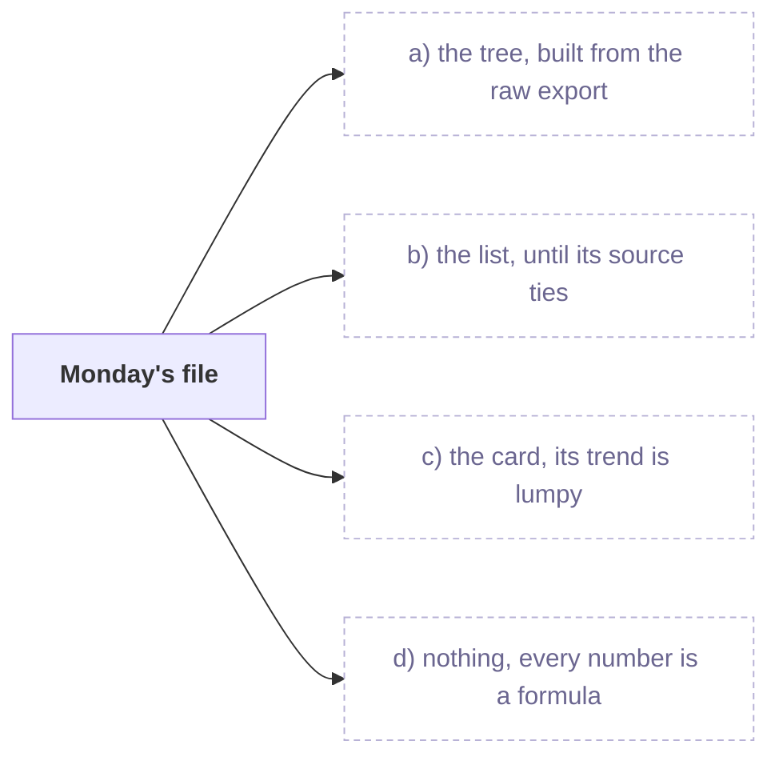
```mermaid
flowchart LR
    R["<b>Monday's file</b>"] --> A["a) the tree, built from the raw export"]
    R --> B["b) the list, until its source ties"]
    R --> C["c) the card, its trend is lumpy"]
    R --> D["d) nothing, every number is a formula"]
    classDef unknown fill:#FFFFFF,stroke:#B8B2D6,color:#6B6690,stroke-dasharray:4 3
    class A,B,C,D unknown
```

**Question.** Which part does the Checks tab hold, as a letter?

```notes
LIVE, 2 minutes. Letters. Those who did chapter 3's your-turn step should know.
```

---

## S20. Answer: the protect list, until its source ties
*What goes to the data platform lead, and what does the chief of staff hear?*

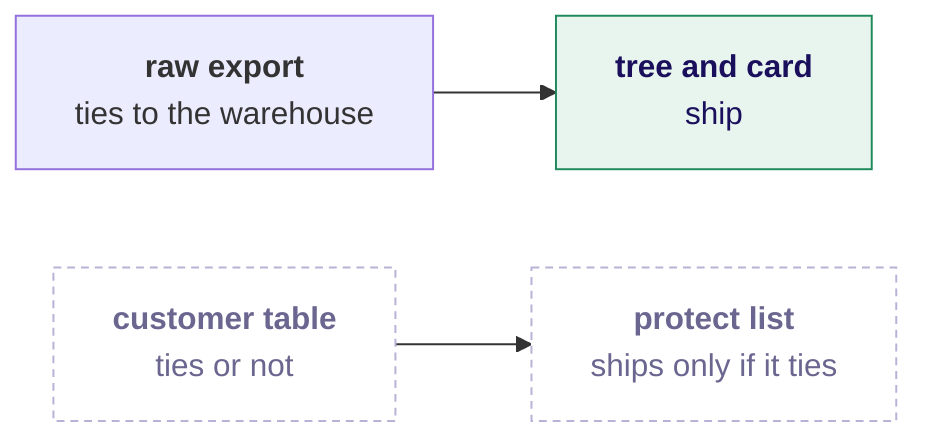
```mermaid
flowchart LR
    E["<b>raw export</b><br/>ties to the warehouse"] --> T["<b>tree and card</b><br/>ship"]
    C["<b>customer table</b><br/>ties or not"] --> L["<b>protect list</b><br/>ships only if it ties"]
    classDef good fill:#E8F5EE,stroke:#1F8A5B,color:#1A0F5C
    classDef unknown fill:#FFFFFF,stroke:#B8B2D6,color:#6B6690,stroke-dasharray:4 3
    class T good
    class C,L unknown
```

The answer is b. A list built on a table that does not tie waits, with a note to the data platform lead that names the gap and asks for the export to be rerun. Option d is the afternoon's trap: formulas recalculating is not the same as numbers being right.

```notes
LIVE, 7 minutes. TRAINER: the day sheet has what the room found and the consequence to say aloud now,
since the room has found it. BREAK, 10 minutes, after this slide.
```

---

## SECTION 9: Where does five lakh go?
*A director wants five lakh typed into the source; can the sheet show that number and still be the one Finance signs? Pairs defend the rule, then swap.*

```notes
LIVE. Forty minutes in pairs: one plays the director, one defends the rule, then they swap. The brief is
exercises/unguided/C2_W02_D05_director_edit_STUDENT.md; the notebook is
notebooks/C2_W02_D05_ex2_second_case_STUDENT.ipynb.
```

---

## S21. Answer it by saying yes to the question
*What does the director ask, in the room, with the sheet on the projector?*

> "Retail-Plus will be back at five lakh next quarter; I have spoken to the team. Type five lakh into Q2 so the card stops frightening people, and fix the source later." A director of Kalpa Retail

**The client asks.** Can the sheet show what the director expects, and still be the number Finance signs?

```notes
LIVE, 3 minutes. Read it in the director's voice. The request is reasonable in a meeting and corrosive in
a file. The pair's job: yes to the question, no to the edit.
```

---

## S22. A typed-over cell moves the card, leaving no trace
*What does the card show after the edit, and what happens on Monday's refresh?*

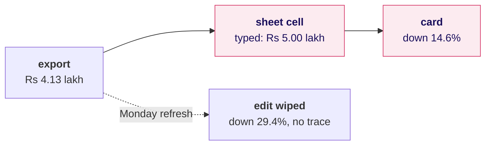
```mermaid
flowchart LR
    E["<b>export</b><br/>Rs 4.13 lakh"] --> S["<b>sheet cell</b><br/>typed: Rs 5.00 lakh"]
    S --> C["<b>card</b><br/>down 14.6%"]
    E -.->|"Monday refresh"| W["<b>edit wiped</b><br/>down 29.4%, no trace"]
    classDef bad fill:#FCEBF0,stroke:#D63A6A,color:#1A0F5C
    class S,C bad
```

For a week the deck says Retail-Plus fell 14.6 percent while Finance's books say 29.4. The sheet's Q2 total drifts Rs 86,620 from the warehouse's Rs 9,84,00,000; then the refresh restores the export, and nobody can say why the two differed.

```notes
LIVE, 4 minutes. Notebook ex2, steps 1 to 4. The drift check that catches it is the sheet's Q2 total
against the warehouse's; the typed-over check is ISFORMULA on the cell.
```

---

## S23. Where does "five lakh" belong in the sheet?
*The question is legitimate; the edit is not. Where does the director's number go?*

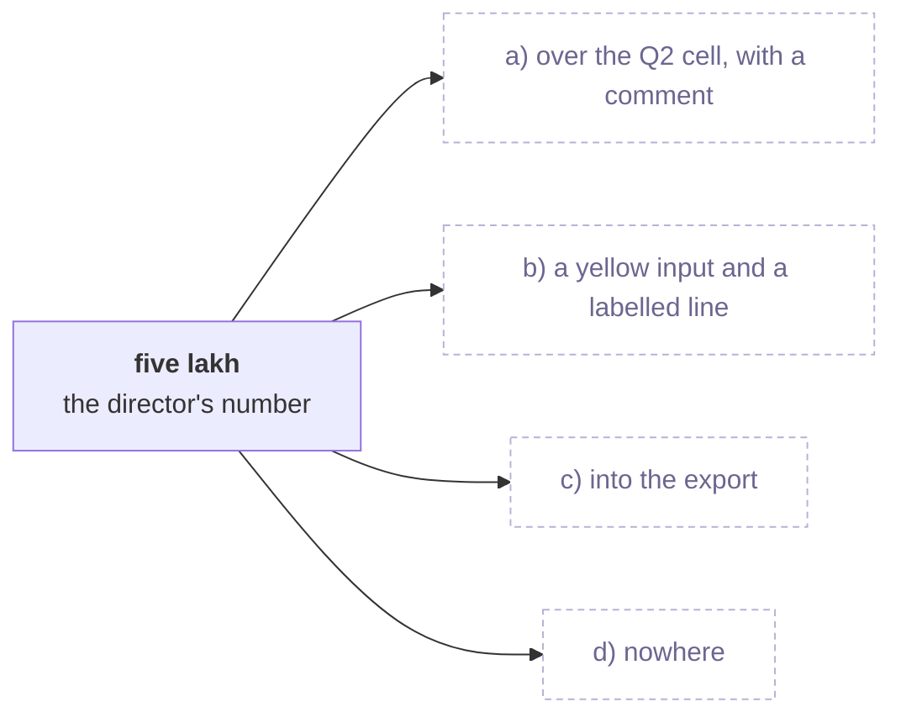
```mermaid
flowchart LR
    Q["<b>five lakh</b><br/>the director's number"] --> A["a) over the Q2 cell, with a comment"]
    Q --> B["b) a yellow input and a labelled line"]
    Q --> C["c) into the export"]
    Q --> D["d) nowhere"]
    classDef unknown fill:#FFFFFF,stroke:#B8B2D6,color:#6B6690,stroke-dasharray:4 3
    class A,B,C,D unknown
```

**Question.** Where does it belong, as a letter?

```notes
LIVE, 2 minutes. Letters, then each pair says why their letter survives the director's pushback.
```

---

## S24. Answer: a labelled input beside the source
*What does the card show, and what does each line come from?*

| Line on the card | Retail-Plus, Q2 on Q1 | Where it comes from |
|---|---|---|
| Actual | -29.4% | the export, tied to the warehouse |
| The director's scenario | -14.6% | a yellow input of Rs 5,00,000 |

The answer is b. The director gets the number to discuss, the card keeps the number Finance signs, and both carry their labels. Option d is how a team ends up with directors typing over cells anyway; option c edits the source of truth.

```notes
LIVE, 4 minutes. Then the role play: 10 minutes each way, walking the room. Listen for anyone who says
no to the question as well as to the edit.
```

---

## S25. Yes to the question, no to the edit, and a check
*What does one partner say to the director?*

```timeline
label: Line 1 | title: Yes to the question | body: I will show five lakh as your scenario, beside the actual.
label: Line 2 | title: No to the edit | body: The actual comes from the export Finance ties to; typing over it breaks that tie.
label: Line 3 | title: The check | body: Every refresh ties the sheet back to the warehouse, so a drift shows the same day. | tone: dark
```

**In the interview.** [D] A director wants to type over the source in the room; what do you say, and what do you build?

```notes
LIVE, 27 minutes across the role play and the notebook: 20 for the two rounds, 7 for the notebook's
five letters. Close with one pair's three lines aloud.
```

---

## SECTION 10: Can you say it aloud?
*Can you answer twelve screen questions aloud, each in under a minute?*

```notes
LIVE. Twenty minutes in pairs: one asks, one answers in under a minute, then swap.
```

---

## S26. Answer the row's five first, then seven follow-ups
*Which questions does a screen ask, and with which tags?*

| Tag | Question |
|---|---|
| [S] | SQL, pandas or Excel: how do you choose? |
| [S] | A stakeholder wants to poke the numbers; what do you give them and never give them? |
| [F] | Your pivot shows a different total from the warehouse; where do you look first? |
| [F] | How do you present one number so it is not misread? |
| [D] | Two directors change assumptions and the sheet recalculates differently; what did you get right, what do you fix? |
| [D] | A leaf of your tree does not multiply back; what happened? |
| [S] | Why does Remove Duplicates not fix a payment-grain export? |
| [D] | The export grows a hundredfold; which formula do you replace? |
| [F] | A lookup returned a member for a missing id; which argument? |
| [F] | A lookup does a join and collected falls 40 percent; why? |
| [F] | You filter and the total does not move; what is the foot? |
| [D] | A director wants to type over the source; what do you say? |

```notes
LIVE, 16 minutes. Tags: [S] staple, [F] frequent in GCC and product screens, [D] differentiator, the
programme's own calibration for 0 to 3 year candidates. The design question is the export growing a
hundredfold.
```

---

## S27. Mechanism, check, number, then the decision
*What goes into a one-minute answer?*

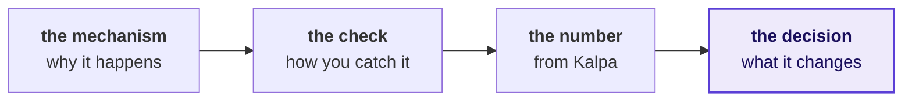
```mermaid
flowchart LR
    M["<b>the mechanism</b><br/>why it happens"] --> K["<b>the check</b><br/>how you catch it"]
    K --> N["<b>the number</b><br/>from Kalpa"]
    N --> D["<b>the decision</b><br/>what it changes"]
    classDef known fill:#EEEAFB,stroke:#5B3FD6,color:#1A0F5C,stroke-width:2px
    class D known
```

"A Sum adds one value per row; I count rows against order ids; here 1,450 rows held 1,000 orders and the pivot read Rs 39.41 crore; counting each order once gave the warehouse's Rs 19.84 crore, so the deck carries the right quarters."

```notes
LIVE, 4 minutes. Read the example aloud and ask one pair to redo their weakest answer in this shape.
```

---

## SECTION 11: What ships on Monday?
*What can the chief of staff trust on Monday? The sentence, the day's six lines, the Kahoot and tomorrow.*

```notes
LIVE. Fifteen minutes: the sentence (2), the six lines (2), the Kahoot (9), tomorrow (2).
```

---

## S28. Answer: what ties, what waits, and why
*What does the team send the chief of staff?*

> "The tree and the front page tie to Finance: Q2, July to September 2026, Rs 9.84 crore, down 1.6 percent on Q1's Rs 10.00 crore. Business invoices carry most of the rupees; Retail-Plus fell 29.4 percent because members ordered less often. The protect list ships when the Checks tab says its source ties to the warehouse, and the release note says what it found. Change the yellow cells freely; never type over a number." The team, to Meera's chief of staff

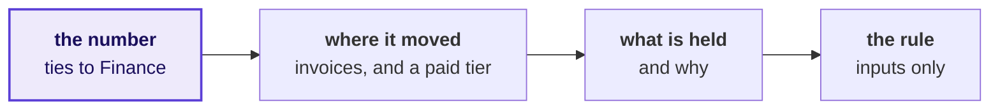
```mermaid
flowchart LR
    A["<b>the number</b><br/>ties to Finance"] --> B["<b>where it moved</b><br/>invoices, and a paid tier"]
    B --> C["<b>what is held</b><br/>and why"]
    C --> D["<b>the rule</b><br/>inputs only"]
    classDef known fill:#EEEAFB,stroke:#5B3FD6,color:#1A0F5C,stroke-width:2px
    class A known
```

```notes
LIVE, 2 minutes. Two learners read their own sentences, with what their own Checks tab released; check
each for the number, the period, the comparison, what is held and why. The day sheet has the release
this room's workbook should give.
```

---

## S29. The six lines the day comes down to
*Which six lines do the cheat sheet and the notes repeat word for word?*

1. Every leaf of the tree is a ratio of the pivot's sums, and the tree multiplies back to its revenue before it goes on a page.
2. Say the grain before you pivot: count rows against keys, count each order once, and tie the total to the warehouse.
3. A lookup that cannot find an id says so: an exact match with a not-found path, tested with an id you know is missing.
4. One number reaches the front page with its period, its comparison and its base, and every percentage carries its rupees.
5. The warehouse owns the number and every join, dedupe and rank; pandas owns the iteration; the workbook owns the last mile, and nobody types over the source.
6. A director gets yellow inputs, formulas everywhere else, SUBTOTAL at every foot, and a Checks tab whose release holds whatever does not tie.

```notes
LIVE, 2 minutes. Read them once. They are on the cheat sheet's panels in this order.
```

---

## S30. Kahoot: eight items, one from Thursday
*What does the room still get wrong, fast?*

```stats
value: 8 | label: items | note: including Thursday's return question
value: 0 | label: grades | note: a performance indicator only
```

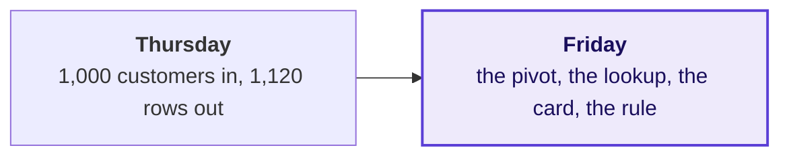
```mermaid
flowchart LR
    T["<b>Thursday</b><br/>1,000 customers in, 1,120 rows out"] --> F["<b>Friday</b><br/>the pivot, the lookup, the card, the rule"]
    classDef known fill:#EEEAFB,stroke:#5B3FD6,color:#1A0F5C,stroke-width:2px
    class F known
```

```notes
LIVE, 9 minutes. Run kahoot/C2_W02_D05_quiz_STUDENT.md. The return question is Thursday's merge one level
up.
```

---

## S31. Tomorrow the paper; Monday, a new business
*What comes next, and which question is left open?*

```cards
icon: pen-line | eyebrow: Saturday | title: The recap paper | body: Pen and paper, AI-free, two hours; bring a pen.
icon: flask-conical | eyebrow: Monday | title: Build 1, Kalpa Health | body: A US diagnostics and revenue-cycle business that grew 5 percent against a plan of 18.
icon: circle-help | eyebrow: Left open | title: Monday's question | body: What is an order, a customer and a payment there, and what does one row stand for? | tone: dark
```

```notes
LIVE, 2 minutes. Dr Priya Menon, COO of Kalpa Health, brings Meera's question to a diagnostics business
whose laboratories test US patients and bill US payers, run from Kalpa's GCC. Leave the last card's
question open. The pre-read for Monday ships tonight.
```
