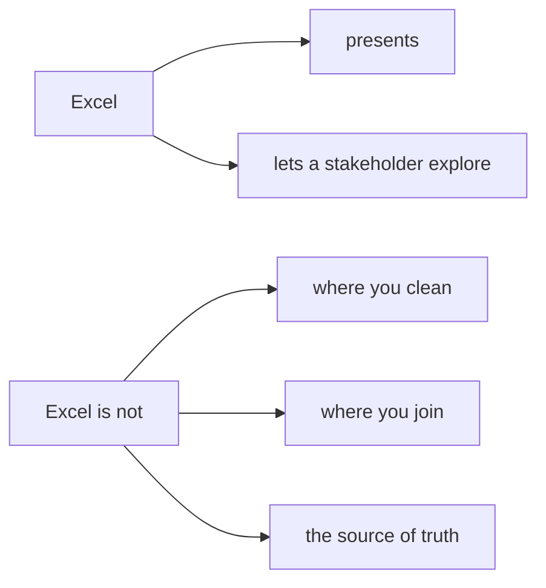
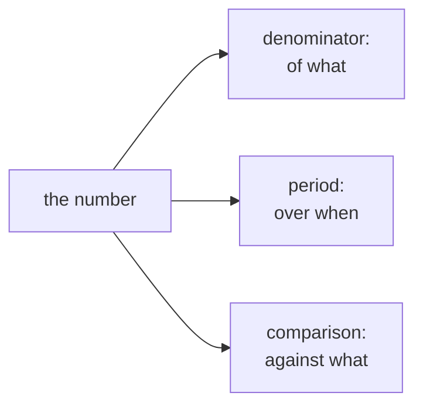
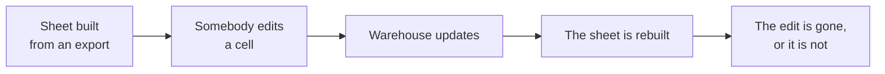

# Study notes: Friday, the last mile

## The situation you were in

> "Monday's growth review deck needs three things I can open on my laptop without a login: the
> revenue tree by segment for both quarters, the top-fifty protect list with a lookup so I can
> find any member by id, and one number on the front page with its trend. Nothing that needs
> Python. If a director changes an assumption in the room, the sheet must recalculate in front of
> them."

Meera's chief of staff. This is not a downgrade from the week's work. It is where the week's work
meets its audience, and the audience has a hand on the keyboard.

## What Excel is for



The reason is one sentence long: a sheet with a typed-over cell has no audit trail. Somebody
changes a number and the formula that used to sit there is gone, with no record that it existed.
Every other objection to spreadsheets is a consequence of that one.

## Grain, which is the whole of the first hour

Two exports arrived. Yesterday's customer table, and a raw export of orders joined to payments.
They look equally usable in a file browser.

| The file | One row is | A pivot over it |
|---|---|---|
| customer table | One customer | Correct |
| raw export | One order-payment pair | Roughly double |

A pivot built on the raw export gave a total near twice what the warehouse says. The pivot did
nothing wrong: it summed the column it was given across the rows it was given, and every check you
would run on the pivot passes.

The 450 orders carrying two payment rows appear twice in that file, and they are the large
invoices. Tuesday's fan-out did not go away. It moved into a file that makes it invisible.

## The ten-second check

```
rows / distinct keys
```

Anything above one and the file is not what its name suggests. On the clean export it comes out at
1.00. On the raw export it does not.

This is the cheapest habit of the week and it survives into any job. Run it before you pivot,
before you send, and before you believe.

When you hand somebody a CSV you are handing them every decision you made about grain. "One row
per order" and "one row per order-payment" look identical in a file browser and produce totals
that differ by a factor of two, so the grain goes in the filename or in the first sheet.

One more thing worth carrying: filtering a wrong pivot to a single segment makes the number
smaller and more plausible, which makes it harder to catch rather than easier.

## The lookup that fails quietly

The customer table is built from orders, so a member who placed none in the two quarters is absent
from it. That is correct, and it is exactly what a lookup has to survive.

| Written as | On a missing id |
|---|---|
| `=XLOOKUP(id, keys, values)` | `#N/A` |
| `=XLOOKUP(id, keys, values, "not in the table")` | Your words |
| `=XLOOKUP(id, keys, values, , 1)` | The **next larger** member |

The third is the dangerous one and it is the one people copy from a tutorial.

`#N/A` is ugly and truthful. A neighbouring member's row is tidy and wrong, and it carries a real
name, a real spend and a real segment. Nobody questions a row that looks complete, and that is the
whole failure.

## A portability fact worth knowing once

XLOOKUP needs Excel 2021 or LibreOffice 24.8 and later. Older readers return `#NAME?`.

`INDEX` with `MATCH` computes everywhere:

```
=IFERROR(INDEX(values, MATCH(id, keys, 0)), "not in the table")
```

"Nothing that needs Python" does not mean "opens identically everywhere", and a `#NAME?` in front
of a director is a bad way to find that out.

## One number, read correctly

A director reads the front page in about two minutes, between two meetings, and repeats it in a
third. Whatever they repeat is what the number means from then on.



> **Rs 9.84 crore** collected in Q2 across 462 orders, against Rs 10.00 crore in Q1, a fall of
> 1.6 percent driven by Retail-Plus frequency rather than by customer count.

Same figure as a bare "Revenue: Rs 9.84 crore", and now it survives being repeated by somebody who
was not in the room.

The sentence beside a chart does work the chart cannot. A trend line shows direction and says
nothing about cause, and a director reading a falling line will attach their own reason, usually
the most recent thing they heard.

## The director's hand on the keyboard

Something will get changed in the room. That is the point of sending a sheet rather than a picture.

| Rule | Why |
|---|---|
| Inputs live in their own marked cells | So a director changes an input rather than a result |
| Results are formulas all the way down | So a change propagates rather than sitting in one cell |

A result cell holding a typed number is indistinguishable from one holding a formula, until
somebody changes an input and nothing moves.

Thirty seconds, said once before they touch it, converts the risk into a test the room runs for
you: the blue cells are yours, everything else recalculates, and a number that does not move when
you expected it to is a bug rather than a surprise.

## The operating rule, which is what the senior analyst asked for

| Lives in | Owns | Never |
|---|---|---|
| The warehouse | The numbers Finance acts on | Exploration |
| pandas | The analyst's iteration, the weekly table | The source of truth |
| Excel | Presentation, and a stakeholder poking at it | Cleaning, joining, computing the truth |

And the fourth line, which is the one people forget:

> Whatever is in Excel must be rebuildable from the warehouse in one run.



Either outcome is bad. Losing a correction silently, or keeping it silently. The correction
belongs upstream, where it can be applied again next Monday.

## Check yourself without writing anything

1. Two CSVs in a folder. What do you run before pivoting either, and what number are you looking
   for?
2. Your pivot total is double the warehouse. What did the pivot do wrong?
3. A lookup returns a member for an id that does not exist. Which argument, and why is that worse
   than an error?
4. Name the three things a front-page number needs, and what happens when one is missing.
5. A director changes a cell and nothing moves. What does that tell you about the sheet?
6. What breaks the fourth line of the operating rule first, in a real team under a deadline?

Two and six are the ones to say out loud to somebody else.

## Reading

- Microsoft Support, "Create a PivotTable to analyze worksheet data":
  <https://support.microsoft.com/en-us/office/create-a-pivottable-to-analyze-worksheet-data-a9a84538-bfe9-40a9-a8e9-f99134456576> (verified 13 Sep 2026)
- Microsoft Support, "XLOOKUP function", including the if-not-found argument:
  <https://support.microsoft.com/en-au/office/xlookup-function-b7fd680e-6d10-43e6-84f9-88eae8bf5929> (verified 13 Sep 2026)
- Resagratia, "XLOOKUP Function and Pivot Tables":
  <https://www.youtube.com/watch?v=OAd_K9RCBHo> (verified 13 Sep 2026)

## What next week does to this one

Tomorrow the fortnight goes under questioning on paper, with no assistant.

Monday, Build 1 opens in Kalpa Health: a unit nobody in the room has seen, with its own
stakeholders and its own data. The method transfers. The domain does not.

Both of this week's notes, the one to Meera about the sample and the book and the one to Anand
about booked against collected, were about the same thing, and it was not SQL.
