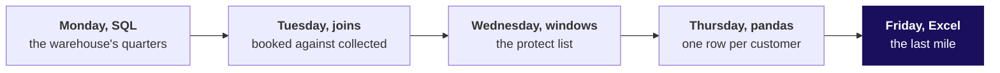
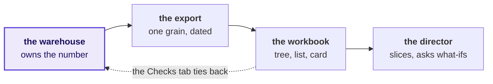

# What can a director open on Monday without a login, change in the room, and still trust?

**Week 2, Friday. Study notes, read after the session.** Reading time: about 35 minutes.

> "Monday's growth review deck needs three things I can open on my laptop without a login: the
> revenue tree by segment for both quarters, the top-fifty protect list with a lookup so I can find
> any member by id, and one number on the front page with its trend. Nothing that needs Python. If a
> director changes an assumption in the room, the sheet must recalculate in front of them."
>
> Meera's chief of staff, Kalpa Retail

Meera Raghavan, Kalpa Retail's CEO, runs Monday's growth review. Kavya Nair, the senior analyst who
reviews every line, added the harder question: "Everything you built this week has to survive a room
that only has Excel. Which parts belong in Excel, which parts must never be in Excel, and how do you
keep the two from drifting apart?"

---

## What can you do now that you could not this morning?

**Who needs the answer.** You do, before the take-home has you rebuild all three deliverables on a
rehearsal copy of the exports, where a half-learned skill shows up as a number you cannot explain.

**The questions on the way.** Can you count each order once and tie a pivot? Can you build a tree, a
lookup and a card a director reads right, and a workbook that checks itself?

1. You can say what one row of an export stands for, and tie a pivot to the warehouse.
2. You can build a revenue tree from a pivot's own sums, and multiply it back.
3. You can count each order once in an export where Remove Duplicates cannot.
4. You can build a lookup that says "not in the table", and test it with a missing id.
5. You can put one number on a front page with its period, comparison and base.
6. You can say what the warehouse, pandas and the workbook each own, and give a director a workbook
   whose checks turn red before a wrong number is read.

---

## Where does today sit in the week, and what does each of the chief of staff's numbers measure?

**Who needs the answer.** You do, since each deliverable rests on a query or a table from earlier in
the week, and a definition you cannot state is one the chief of staff cannot defend.

**The questions on the way.** What did the room work, and what did it only name? What did each day
build, and what does each deliverable measure?

The room worked six chapters on one Kalpa case in full, built the escalated case alone and argued
the second case in pairs, and only named sheet protection that still allows filtering, approximate
match on price bands, and a faster first-row flag for an export a hundred times larger.

```mermaid
flowchart LR
    M["<b>Monday, SQL</b><br/>the warehouse's quarters"] --> T["<b>Tuesday, joins</b><br/>booked against collected"]
    T --> W["<b>Wednesday, windows</b><br/>the protect list"]
    W --> H["<b>Thursday, pandas</b><br/>one row per customer"]
    H --> F["<b>Friday, Excel</b><br/>the last mile"]
    classDef today fill:#1A0F5C,stroke:#1A0F5C,color:#FFFFFF
    class F today
```

Monday's queries on the warehouse, the Postgres database of one row per order, put revenue at
Rs 10,00,00,000 in Q1 (April to June 2026, 538 orders) and Rs 9,84,00,000 in Q2 (July to September
2026, 462 orders). Revenue is booked order value in rupees, and the revenue tree splits it into
leaves that multiply back to it: customers, orders per customer and revenue per order. The segments
are Retail-Core (everyday shoppers), Retail-Plus (the paid membership tier), Business (corporate
buyers invoiced in large amounts) and Student. The tree gives each segment's revenue in both
quarters, the protect list names the fifty Retail-Plus members with the highest revenue for a
retention offer, and the front-page number is Q2 revenue against Q1 with six months as its trend.
Build 1 opens on Monday 19 October in Kalpa Health, where each claim needs its number, period and
base; which metric belongs on a front page at all is a later week's question.

---

## Which one drawing sorts the day, from the warehouse to the director?

**Who needs the answer.** The chief of staff does, since every number in Monday's file travels this
line, and one that goes wrong on the way reaches a director with no error beside it.

**The questions on the way.** Where can a number go wrong, and what ties the workbook back to the
warehouse?

```mermaid
flowchart LR
    W["<b>the warehouse</b><br/>owns the number"] --> E["<b>the export</b><br/>one grain, dated"]
    E --> X["<b>the workbook</b><br/>tree, list, card"]
    X --> D["<b>the director</b><br/>slices, asks what-ifs"]
    X -.->|"the Checks tab ties back"| W
    classDef known fill:#EEEAFB,stroke:#5B3FD6,color:#1A0F5C,stroke-width:2px
    class W known
```

A leaf can be averaged where it should be divided (chapter 1), the export can repeat rows (chapter
2), the workbook can answer for the wrong row or add rows nobody sees (chapters 3 and 6), and the
director can read a number against the wrong period (chapter 4). The dashed arrow is the Checks tab
tying every number back to the warehouse, and chapter 5 decides which step belongs in which box.

---

## Chapter 1. Which segment carries Kalpa's revenue, and which leaf of the tree separates the segments?

**Who needs the answer.** The chief of staff puts the tree on page two of the deck, where the
directors decide which segment the growth plan talks about, and a tree that does not multiply back
to its revenue loses them at the first check.

**The questions on the way.** Which way should a director get the tree: a PivotTable, a formula
grid, pasted numbers or a live dashboard? What does one row of the customer table stand for? Which
segment carries the revenue? Which leaf separates Retail-Plus from Retail-Core? What does a leaf
averaged customer by customer say? Can this table split Q1 from Q2, and does a second calculator
agree with the pivot?

Costco asks the same question of its paid tier: Executive members, 38.7 million of 81.0 million paid
members, made up "approximately 73.6% of worldwide net sales in 2025" (Costco Form 10-K, fiscal
2025, sec.gov, checked 30 September 2026).

### Which way should a director get the tree: a PivotTable, a formula grid, pasted numbers or a live dashboard?

| Option | What it costs on this table |
|---|---|
| a) A PivotTable | One pivot and 8 leaf formulas, slicing any column and recalculating on Refresh |
| b) A SUMIFS grid | Twelve formulas reading 3,600 cells and recalculating at once |
| c) Pasted values | No formulas, so no new question answered in the room |
| d) A live dashboard | A login for every director, which the brief rules out |

The call is a, with each leaf beside it as a ratio of its sums, because a director re-slices first.
A director who changes an assumption would move what it feeds into formulas, which recalculate at
once where a pivot waits for Refresh.

### What does one row of the customer table stand for?

One row is one customer who ordered between April and September, Thursday's export: 300 rows hold
300 distinct ids, so a pivot's Sum adds each customer once.

### Which segment carries the revenue?

Business does: 39 buyers with 188 orders bring in Rs 19,65,99,040, 99.1 percent of the half-year.

### Which leaf separates Retail-Plus from Retail-Core?

Revenue per order does, Rs 2,801 against Rs 1,886, 48.5 percent higher, while orders per customer
differ by 10 percent, 3.29 against 2.99.

### What does a leaf averaged customer by customer say?

It says Business sells at Rs 11,66,786 an order, 11.6 percent above revenue over orders,
Rs 10,45,740: the plausible wrong answer. A per-customer `=revenue/orders` column averaged in the
pivot gives each buyer one vote, and Business baskets run from Rs 3.34 lakh to Rs 66.98 lakh.
Multiplying the leaves back catches it, Rs 2.28 crore above what Business sold, and the fix divides
the pivot's sums, as a calculated field does: such fields "operate on the sum of the underlying
data" (Microsoft Support, Calculate values in a PivotTable, checked 30 September 2026).

### Can this table split Q1 from Q2, and does a second calculator agree with the pivot?

The table cannot split them, since last_order_date is a recency and a split on it puts Rs 17.88
crore in Q2. A running total per segment, read from the CSV with Python's csv module, matches all 12
cells of the pivot.

Business carries 99.1 percent of the revenue, and the basket separates the consumer tiers.

---

## Chapter 2. How much did revenue fall from Q1 to Q2, and in which segment and which leaf?

**Who needs the answer.** Meera decides from the tree for both quarters which branch the growth plan
funds, and a pivot that counts orders twice puts nearly twice Finance's revenue in front of the
directors.

**The questions on the way.** Which way should the team split revenue by quarter, and what does each
way cost? What does the pivot say for Q1 and Q2? Why does it read nearly double, and does Remove
Duplicates fix it? What does the tree say when each order counts once? Which segment and which leaf
fell? Does the warehouse reach the same quarters by its own route?

The raw export carries the order dates, in 1,450 rows that include order_amount and paid_amount.
Razorpay, the payment gateway, says its orders feature "Combines multiple payment attempts for a
single order" (Razorpay documentation, Orders, checked 30 September 2026).

### Which way should the team split revenue by quarter, and what does each way cost?

| Option | What it costs here |
|---|---|
| a) Split the customer table on last order date | Rs 8.04 crore of Q1 revenue moved into Q2 |
| b) A SUMIFS grid per segment and quarter | Eight formulas running 34,800 tests and slicing nothing else |
| c) A quarter column, then the pivot | One formula filled down 1,450 rows, after which any column slices it |
| d) The warehouse team's tree | An exact answer, with a day's wait for each new question |

The call is c: `=IF(MONTH(E2)<=6,"Q1","Q2")` puts 772 rows in Q1 and 678 in Q2. A deadline far
enough away for the warehouse team would switch it to d.

### What does the pivot say for Q1 and Q2?

It says Rs 19,94,36,150 for Q1 and Rs 19,46,59,340 for Q2, Rs 39,40,95,490 in all, with Retail-Core
up 1.0 percent: the plausible wrong answer, nearly twice Finance's Rs 9.84 crore for Q2, with
nothing on the sheet red.

### Why does it read nearly double, and does Remove Duplicates fix it?

One row is one payment, the order's amount repeated on each; the check is rows against order ids,
1,450 against 1,000. Four hundred instalment orders have two rows that differ in paid_amount and
fifty gateway double posts two identical rows, so Remove Duplicates drops only the fifty copies,
Rs 37,750, and 1,400 rows still total Rs 39,40,57,740.

### What does the tree say when each order counts once?

It says Q1 Rs 10,00,00,000 and Q2 Rs 9,84,00,000, down 1.6 percent, tied to the rupee. The first-row
flag, `=IF(COUNTIF($A$2:A2,A2)=1,1,0)`, compares each row with every row from the first down to its
own, takes Rs 19,56,95,490 out of the total and turns Retail-Core from up 1.0 percent to down 1.8.

### Which segment and which leaf fell?

| Segment | Q1 | Q2 | Change |
|---|---|---|---|
| Business | Rs 9,90,14,440 | Rs 9,75,84,600 | -1.4% |
| Retail-Core | Rs 3,73,070 | Rs 3,66,250 | -1.8% |
| Retail-Plus | Rs 5,85,770 | Rs 4,13,380 | -29.4% |
| Student | Rs 26,720 | Rs 35,770 | +33.9% |

Business carries Rs 14,29,840 of the Rs 16,00,000 fall, a few invoices landing in one quarter or the
next. Retail-Plus fell steepest: customers who ordered went from 91 to 76 and orders per customer
from 2.36 to 1.84, Week 1's frequency branch, while the basket rose from Rs 2,725 to Rs 2,953.

### Does the warehouse reach the same quarters by its own route?

It does: Monday's `SELECT quarter, count(*), sum(amount) FROM orders GROUP BY quarter`, which never
saw the export, gives Rs 10,00,00,000 on 538 orders and Rs 9,84,00,000 on 462.

Revenue fell Rs 16,00,000, 1.6 percent, mostly in Business rupees, and the steepest fall was
Retail-Plus, 29.4 percent, in orders per customer.

---

## Chapter 3. Which fifty Retail-Plus members go on the protect list, and when the chief of staff types an id, does the sheet answer for that member?

**Who needs the answer.** The head of Retail-Plus sends the fifty a retention offer, and the chief
of staff reads a member's line aloud when a director names one, so a lookup that answers with the
wrong row calls a lapsed member one of the best.

**The questions on the way.** Which lookup should answer "find this member"? Who makes the list, and
where does it stop? Does the list's source table tie to the warehouse? What does a lookup with its
fourth argument left out return for an id the table does not hold? What does an exact match with a
not-found path return, and what if the list is re-sorted? Does the warehouse's own count agree with
the lookup?

In 2003 TransAlta lost 24 million US dollars on New York transmission bids after "a cut-and-paste
error in an Excel spreadsheet" missed in "our final sorting and ranking of bids" (The Globe and
Mail, 4 June 2003, checked 30 September 2026).

### Which lookup should answer "find this member"?

| Option | What it does for an id with no row |
|---|---|
| a) `=VLOOKUP(id, A:F, 5)` | Another member's row, with nothing red |
| b) `=VLOOKUP(id, A:F, 5, FALSE)` | #N/A, which a director reads as a broken sheet |
| c) `=IFERROR(INDEX(E:E, MATCH(id, A:A, 0)), "not in the table")` | "not in the table", in any Excel |
| d) `=XLOOKUP(id, A:A, E:E, "not in the table")` | The same words, in Excel 2021, 2024 or Microsoft 365 |

The call is d on the room's Microsoft 365 and c wherever the file travels, since XLOOKUP "is not
available in Excel 2016 and Excel 2019" (Microsoft Support, XLOOKUP function, checked 30 September
2026). The Excel version on the chief of staff's laptop decides between them.

### Who makes the list, and where does it stop?

Fifty of the 106 Retail-Plus members make it, ranked with `=RANK.EQ(E2, E$2:E$107)`, from C-0152 at
Rs 25,840 down to a cut-off of Rs 8,580. The fifty-first spent Rs 8,520, so no tie crosses the line,
and the fifty together spent Rs 7,14,890.

### Does the list's source table tie to the warehouse?

That answer is yours. The list comes from the customer table, which has to tie on its own before the
list ships, and chapter 3's notebook leaves an empty cell for the comparison.

### What does a lookup with its fourth argument left out return for an id the table does not hold?

It returns C-0194's Rs 16,740, rank 15 on the list, with nothing red: the plausible wrong answer.
C-0195, a Retail-Plus member with no orders in the two quarters, has no row, and the fourth argument
left out means "TRUE or approximate match" (Microsoft Support, VLOOKUP function, checked 30
September 2026), the largest id not above the one asked for. The check tests with an id you know is
missing and prints the id returned beside the id asked for.

### What does an exact match with a not-found path return, and what if the list is re-sorted?

It returns "not in the table" for C-0195 and keeps Rs 25,840 for C-0152 and Rs 16,740 for C-0194, in
any order; the list sorted by revenue steps down in id 24 times in 49, and an approximate match
needs its first column sorted.

### Does the warehouse's own count agree with the lookup?

The warehouse's own orders, which never saw the customer table, agree: none for C-0195, and
Rs 25,840 for C-0152. With no login, the same check in Excel is a COUNTIF of the id in the raw
export's customer column. Approximate match is built for bands: Rs 2,700 against invented tiers at
Rs 0, Rs 1,000 and Rs 2,500 falls in the Rs 2,500 tier.

The fifty run from Rs 25,840 to Rs 8,580, and an exact match with a not-found path answers for the
member typed; the list ships once its source ties.

---

## Chapter 4. What must sit beside the front-page number so a director reads it right in two minutes?

**Who needs the answer.** Meera and the directors read the front page first and may read nothing
else, so a card without its period or its base sends the meeting after a boom or a crisis that never
happened.

**The questions on the way.** Which form should the card take? What does a director read in a card
that says "Revenue Rs 19.84 crore"? What does the card say with its period, comparison and base?
What does "Retail-Plus revenue down 29.4 percent" leave out? What does the trend beside the number
show, and what happens when a director changes the scope? Does the warehouse reach the same change
by its own route?

Avenue Supermarts, which runs DMart, headlined its quarter to 30 June 2025 as "Standalone Total
Revenue up by 16.2% at Rs.15,932 Crore", against Rs 13,712 crore a year earlier (Avenue Supermarts
press release, 11 July 2025, checked 30 September 2026).

### Which form should the card take?

| Option | What a director must bring to read it right |
|---|---|
| a) "Revenue Rs 19.84 crore" | The knowledge that it covers two quarters |
| b) "Q2 revenue Rs 9.84 crore" | Q1's figure, from memory |
| c) Q2 against Q1, both figures shown | Nothing |
| d) c, with a sentence and a six-month line | Nothing, and the next question answered too |

The call is d, about fifty words and one small line chart. A board that reviews every month against
its plan would switch the comparison to the plan.

### What does a director read in a card that says "Revenue Rs 19.84 crore"?

A director reads revenue up 98.4 percent, the two quarters added and set against Q1's Rs 10.00
crore, when revenue fell 1.6 percent. The check reads the card aloud and asks which months, and
against what; the fix puts the period and the comparison on the card.

### What does the card say with its period, comparison and base?

The card reads "All segments, Q2, July to September 2026: Rs 9.84 crore, down 1.6 percent on Q1,
April to June 2026 (Rs 10.00 crore); 100.0 percent of company revenue in Q2." Its sentence adds that
Business invoices carry Rs 14.30 lakh of the Rs 16.00 lakh fall and Retail-Plus fell 29.4 percent on
frequency.

### What does "Retail-Plus revenue down 29.4 percent" leave out?

It leaves out its base and its share: Rs 1.72 lakh on Rs 5.86 lakh, 0.4 percent of Q2 revenue, and
divided by Q2 by mistake the same change reads 41.7 percent. The check puts rupees and a share
beside every percentage, and the fix reads "Retail-Plus, Q2: Rs 4.13 lakh, down 29.4 percent on Q1
(Rs 5.86 lakh); 0.4 percent of company revenue". A share moves in points: the consumer share went
from 0.99 percent to 0.83, down 0.16 points, a 16 percent fall in the share.

### What does the trend beside the number show, and what happens when a director changes the scope?

Company revenue jumps in July to Rs 4.51 crore, 45 percent above June, on corporate invoices, while
the consumer line slides from Rs 3.32 lakh in June to Rs 2.48 lakh in September. Without Business,
revenue fell from Rs 9.86 lakh to Rs 8.15 lakh, down 17.3 percent, so each card prints its scope.

### Does the warehouse reach the same change by its own route?

The warehouse's orders, joined to its customers, give the same -1.6 percent for the company and
-29.4 percent for Retail-Plus.

Beside Rs 9.84 crore sit its period, Q2, its comparison, down 1.6 percent, and its base, Q1's
Rs 10.00 crore, with rupees beside every percentage.

---

## Chapter 5. Which of the week's steps belong in the workbook, which must never be done there, and how do the two stay in step?

**Who needs the answer.** Kavya signs the team's operating rule, and Anand Iyer, the finance
controller, has an analyst who audits every number Finance relies on; a join done in the wrong tool
reports paid money as unpaid.

**The questions on the way.** Where could the week's work live? What did each day of the week build,
and what does each step touch? What does booked against collected say when a lookup does the join?
Why is it wrong, and what does adding every payment say? Where does each of the week's steps belong?
How do the workbook and the warehouse stay in step?

The test case is Tuesday's booked against collected: the value of the orders against the money
received for them. Public Health England reported in October 2020 that "15,841 cases between 25
September and 2 October were not included in the reported daily COVID-19 cases" (GOV.UK, 4 October
2020, checked 30 September 2026), after a step of its pipeline ran through spreadsheet templates.

### Where could the week's work live?

| Option | What collected per order costs |
|---|---|
| a) Everything in the workbook | 1,450,000 tests a recalculation, rerun by hand |
| b) The split: the warehouse computes, pandas iterates, the workbook presents | One GROUP BY over 1,428 payment rows, rerun by anyone |
| c) pandas pastes values | One groupby, and nothing that recalculates in the room |
| d) A dashboard on the warehouse | One query a view, and a login for every director |

The call is b. Only a one-off question that nobody audits or reruns would switch it, since such a
question can live in a sheet.

### What did each day of the week build, and what does each step touch?

Monday's tree and Wednesday's top fifty read the orders table, Thursday merged tables in pandas at
one row per customer, and Friday reads the exports. Only Tuesday's booked against collected meets
several rows for one: 1,000 orders joined to 1,428 payment rows, 8 of which match no order.

### What does booked against collected say when a lookup does the join?

It says Rs 11,83,81,974 collected against Rs 19,84,00,000 booked, Rs 8.00 crore outstanding, 40.3
percent: the plausible wrong answer, from `=VLOOKUP(A2, RawExport!A:H, 7, FALSE)` beside each order.
Anand's team would chase Rs 8 crore from accounts that have paid.

### Why is it wrong, and what does adding every payment say?

A lookup stops at the first matching row, and 450 orders have two payment rows: 400 instalment
orders, whose second payment it never reads, and 50 gateway copies, one payment posted twice. The
check counts rows per order. The fix adds every payment once: drop the 50 copies, add the rows left
with `=SUMIFS(G:G, A:A, A2)`, and keep the join itself in the warehouse. Collected is
Rs 19,66,45,070, Rs 17,54,930 short of booked, 0.9 percent, exactly Tuesday's unpaid list of 30
orders, and Rs 7,82,63,096 of "outstanding" disappears, the second instalments of the 400 instalment
orders. The second route never adds a payment: booked less the orders with no payment in the
warehouse, found with an anti-join (NOT EXISTS), gives the same Rs 19,66,45,070.

### Where does each of the week's steps belong?

The warehouse owns the number and every join, dedupe and rank Finance relies on. pandas owns the
analyst's iteration until Finance relies on it. The workbook owns the last mile, presenting,
slicing, looking up and taking labelled what-ifs on an export that ties, and nobody types over the
source.

### How do the workbook and the warehouse stay in step?

A drift check on the workbook's Checks tab keeps them in step. A workbook with no login cannot query
the warehouse, so the data platform lead sends the warehouse's control totals, orders and booked
revenue per quarter, on a small tab beside each export, and the Checks tab compares the workbook's
totals with them, live. Today's export ships, the same export pulled a week early falls short in Q2
and is held, and a figure typed over in the workbook breaks the match as soon as it is typed.

Every join, dedupe and rank Finance relies on stays in the warehouse, and the workbook presents,
tied to the control totals by a live check.

---

## Chapter 6. When a director takes the workbook in the room, what can they break, and which checks catch it before anyone reads a wrong number?

**Who needs the answer.** The head of Retail-Plus sizes each city's retention budget from the list
in the room, and a total that counts rows a filter has hidden sizes it on the whole list.

**The questions on the way.** How could the team protect the workbook? What will a director do to
the workbook? What does the list's total say when a director filters it to one city? What do
SUBTOTAL(109) and SUBTOTAL(103) say? Where does a director's assumption go, so the sheet
recalculates honestly? Which checks does the Checks tab run, and what does its release hold?

In 2008 a law firm reformatting Barclays's purchase of Lehman Brothers contracts into a PDF exposed
hidden rows, and Barclays asked the court to exclude 179 contracts (Computerworld, 14 October 2008,
checked 30 September 2026).

### How could the team protect the workbook?

| Option | What a wrong number looks like |
|---|---|
| a) Protect every cell | Nothing goes wrong, and no what-if can be asked |
| b) Send a PDF | Nothing goes wrong, and nothing recalculates |
| c) Yellow inputs, formulas elsewhere, a Checks tab | A red check, and a release that holds |
| d) A copy for each director | Copies that disagree by the end of the meeting |

The call is c, the only way a director can filter, sort, type and ask what-ifs and still see a wrong
number turn red. A board pack nobody is meant to change would go as a PDF.

### What will a director do to the workbook?

A director will filter, sort, type over a cell, change an assumption and paste in a new export. A
filter under a SUM, a one-column sort and a typed-over formula change a number's meaning with no
error, while a yellow input recalculates in the open.

### What does the list's total say when a director filters it to one city?

It still says Rs 7,14,890, the whole list, while the eleven Mumbai members on screen spent
Rs 1,56,790: the plausible wrong answer from `=SUM(E2:E51)`, which would size a Mumbai budget 4.6
times too big. The check counts rows on screen against rows the total adds.

### What do SUBTOTAL(109) and SUBTOTAL(103) say?

`=SUBTOTAL(109, E2:E51)` reads Rs 1,56,790 and `=SUBTOTAL(103, A2:A51)` counts 11 of 50, since
SUBTOTAL "ignores any rows that are not included in the result of a filter" (Microsoft Support,
SUBTOTAL function, checked 30 September 2026).

| The foot | Rows a filter hides | Rows hidden by hand |
|---|---|---|
| `SUM` | Added | Added |
| `SUBTOTAL(9, ...)` | Left out | Added |
| `SUBTOTAL(109, ...)` | Left out | Left out |

The second route, `=SUMIFS(E2:E51, C2:C51, "Mumbai")`, reads the city and never the screen, so it
agrees at Rs 1,56,790 while only the filter is on. With Mumbai's smallest member, Rs 9,390, also
hidden by hand, SUBTOTAL(109) drops to Rs 1,47,400 and SUMIFS holds Rs 1,56,790, and the gap says
the screen shows less than the whole city.

### Where does a director's assumption go, so the sheet recalculates honestly?

It goes in a yellow input: a Rs 500 voucher in B1 and `=B1*SUBTOTAL(103, A2:A51)` cost Rs 5,500 for
Mumbai's eleven, and Rs 750 makes it Rs 8,250 in front of the room, with the list untouched.

### Which checks does the Checks tab run, and what does its release hold?

The tab runs five: the tree's quarters and the list's source against the warehouse, the lookup on a
known missing id, SUBTOTAL(103) against the rows the foot adds, and ISFORMULA outside the yellow
inputs. On invented records, a source Rs 1,200 short gives "Hold the protect list; ship the rest",
and a typed-over formula holds the whole workbook. Formulas recalculate whether or not their inputs
tie, so the release reads the checks.

A filter, a one-column sort or a typed-over formula changes a number with no error; SUBTOTAL at the
foot, Rs 1,56,790 for Mumbai's eleven, and five checks feeding one release catch them.

---

## Can you answer four questions on today's traps without writing anything?

**Who needs the answer.** You do, tonight, since each miss names the chapter to reread before the
take-home rebuilds all three deliverables on new data.

**The questions on the way.** Which of today's four traps can you still name from its symptom?

Pick a letter for each, then check the key.

1. An export holds 1,450 rows for 1,000 order ids, and its pivot reads nearly twice the warehouse.
   What comes first? a) Remove Duplicates with every column ticked, then a fresh pivot; b) a
   first-row flag, then a tie to the warehouse; c) the total divided by 1.45; d) Business filtered
   out.
2. `=VLOOKUP("C-0195", A2:F301, 5)` returns Rs 16,740 for a member with no row. What is at fault?
   a) the quotes around the id; b) the column number; c) the range, which ends at row 301; d) the
   fourth argument, left out.
3. Which Retail-Plus line can go on the front page? a) down 41.7 percent, measured against Q2's
   Rs 4.13 lakh; b) down 29.4 percent, the steepest fall of the four; c) Rs 4.13 lakh, down 29.4
   percent on Q1's Rs 5.86 lakh; d) a sharp fall in Q2 as members left the paid tier.
4. Filtered to eleven Mumbai members, the list's foot still reads Rs 7,14,890. What sits at the
   foot? a) SUM; b) SUBTOTAL(109); c) SUBTOTAL(103); d) SUMIFS on the city.

Key: 1b 2d 3c 4a. A miss sends you back to chapter 2, 3, 4 or 6. Item 1 is Tuesday's join fan-out,
met again inside an export.

---

## What will an interviewer ask, and what does a strong answer sound like?

**Who needs the answer.** An interviewer at a GCC or product company does, and an answer with no
number from your own file in it costs you the question.

**The questions on the way.** How would you answer the five anchors, and the five follow-ups on the
day's traps?

The tags are this programme's own calibration for 0 to 3 year Indian-market candidates: [S] a
staple, [F] frequent in GCC and product screens, [D] a differentiator. The first five are the day's
anchors, and a strong answer gives the mechanism, the check, Kalpa's number and the decision.

**[S] SQL, pandas or Excel: how do you choose?** By who must trust the number and who must rerun it.
Anything Finance relies on, with every join, dedupe or rank behind it, goes in SQL in the warehouse.
The analyst's iteration stays in pandas until Finance relies on it, which is why Thursday's customer
table could be built in pandas and moves upstream once Marketing depends on it every Monday. The
last mile goes in Excel, on an export that ties. A sheet doing Kalpa's join reported Rs 8.00 crore
outstanding where the warehouse leaves Rs 17,54,930.

**[S] A stakeholder wants to poke the numbers themselves; what do you give them, and what do you
never give them?** I give them yellow inputs, formulas elsewhere, an honest lookup, SUBTOTAL feet
and a Checks tab on a reconciled export, so Kalpa's Rs 500 voucher priced Mumbai at Rs 5,500 with
the list untouched. I never give them the source to edit, a lookup that can return somebody else's
row, or a number without its period and base.

**[F] Your pivot shows a different total from the warehouse; where do you look first?** At the
grain, rows against distinct keys: Kalpa's 1,450 rows held 1,000 orders, so the pivot read
Rs 39,40,95,490 against Rs 19,84,00,000. The period, the filters and missing keys come next.

**[F] How do you present one number so it is not misread?** With its period, comparison and base and
a sentence on what moved it: Q2, Rs 9.84 crore, down 1.6 percent on Q1's Rs 10.00 crore. Q1 is the
comparison because the warehouse holds two quarters; with a year of history I would use the same
quarter last year, as DMart does, since a retailer's quarters have seasons.

**[D] Two directors change assumptions in the room and the sheet recalculates differently for each;
what did you get right, and what do you fix?** Both answers are honest, since each assumption was an
input over one source, and the fix is a label, so down 1.6 percent for all segments and down 17.3
percent without Business each print their scope. I also rule out a pivot that waits for Refresh
beside formulas that recalculate at once, and an input one director changed that is still changed
when the next opens the file.

**[D] A leaf of your tree does not multiply back to its revenue; what happened?** It averaged
per-customer ratios, one vote per customer, so Business read Rs 11,66,786 an order against
Rs 10,45,740; I divide the pivot's sums. JPMorgan Chase's task force on its 2012 losses found a
related failure, where the bank divided by the wrong total: a risk spreadsheet "divided by their sum
instead of their average" (task force report, 16 January 2013, page 128, checked 30 September 2026).

**[D] The export grows a hundredfold; which formula do you replace, and with what?** The running
COUNTIF flag, which compares each row with every row from the first down to its own: 1,051,975
comparisons on 1,450 rows, about 10.5 billion on 145,000. I sort by order id and compare each row
with the one above, or ask the warehouse for an order-grain export.

**[F] Your lookup returned a member for an id that does not exist; which argument was wrong?** The
fourth, range_lookup, which left out means approximate match, so C-0195 came back as C-0194's
Rs 16,740. I use an exact match with a not-found path, tested on a present id, a missing id and a
re-sorted list, and on ids from another system also one stored as text, one with a trailing space
and one that appears twice.

**[F] A lookup does a join in a sheet and collected falls by 40 percent; what happened?** It took
each order's first payment row, and 450 orders had two, so collected read Rs 11,83,81,974 where
every payment added once gives Rs 19,66,45,070. The join belongs in the warehouse.

**[D] A director wants to type over the source in the room; what do you say, and what do you
build?** I say yes to the question and no to the edit: the figure goes in a yellow input feeding a
labelled scenario line, so Retail-Plus reads down 29.4 percent as Finance books it and down 14.6
percent on the director's Rs 5,00,000. The Checks tab's live comparison with the warehouse's control
totals, which travel on a small tab beside each export, would show a typed figure at once as a
Rs 86,620 gap.

---

## Which words did today use, and what does each mean?

**Who needs the answer.** You do, whenever the chief of staff or Finance uses one of these words,
since a word read loosely, such as a payment row taken for an order, changes the number you send.

**The questions on the way.** What does each word mean in plain terms, and which of today's numbers
shows it?

| Term | What it means | Where today used it |
|---|---|---|
| Grain | What one row stands for: a customer, an order or a payment | The raw export, one row per payment |
| Control total | The owner's total, which every sheet built from the data must match | The warehouse's Rs 10,00,00,000 for Q1 and Rs 9,84,00,000 for Q2 |
| First-row flag | A 1 on each order's first row, so a sum counts every order once | Rs 39.41 crore brought back to Rs 19.84 crore |
| Approximate match | The largest id not above the one asked for, returned with no warning | C-0195 answered with C-0194's row |
| SUBTOTAL(109) | A total of the rows on screen, leaving out filtered and hidden rows | Rs 1,56,790 for Mumbai |
| Drift check | The Checks tab's live comparison with the warehouse's control totals | An export pulled a week early, held |
| Yellow input | The one kind of cell a director may change, read by formulas | A Rs 500 voucher in B1, Rs 5,500 for Mumbai |
| Revenue tree | Revenue split into customers, orders per customer and order size | Retail-Plus: 106 customers, 3.29 orders each, Rs 2,801 an order |

---

## What should you read next, and in what order?

**Who needs the answer.** You do, over the weekend, since each item deepens a chapter the take-home
asks you to rebuild.

**The questions on the way.** Which reading deepens which chapter, and how long does each take?

| Order | What | Time | Why |
|---|---|---|---|
| 1 | Microsoft Support, Create a PivotTable, https://support.microsoft.com/en-us/office/create-a-pivottable-to-analyze-worksheet-data-a9a84538-bfe9-40a9-a8e9-f99134456576 (checked 1 October 2026) | 15 minutes | Chapter 1's pivot, built step by step |
| 2 | Costco's Form 10-K for fiscal 2025, https://www.sec.gov/Archives/edgar/data/909832/000090983225000101/cost-20250831.htm (checked 1 October 2026) | 10 minutes | Sales reported by member tier |
| 3 | Razorpay, About Orders, https://razorpay.com/docs/payments/orders/ (checked 1 October 2026) | 10 minutes | One order beside several payment attempts |
| 4 | Microsoft Support, VLOOKUP function, https://support.microsoft.com/en-us/office/vlookup-function-0bbc8083-26fe-4963-8ab8-93a18ad188a1 (checked 1 October 2026) | 10 minutes | The approximate-match default, in Microsoft's words |
| 5 | Microsoft Support, XLOOKUP function, https://support.microsoft.com/en-au/office/xlookup-function-b7fd680e-6d10-43e6-84f9-88eae8bf5929 (checked 1 October 2026) | 15 minutes | The not-found argument |
| 6 | The Globe and Mail on TransAlta, https://www.theglobeandmail.com/report-on-business/human-error-costs-transalta-24-million-on-contract-bids/article18285651/ (checked 1 October 2026) | 5 minutes | Misaligned rows that cost 24 million US dollars |
| 7 | Public Health England's statement, https://www.gov.uk/government/news/phe-statement-on-delayed-reporting-of-covid-19-cases (checked 1 October 2026) | 5 minutes | A spreadsheet step that lost 15,841 cases |
| 8 | Microsoft Support, SUBTOTAL function, https://support.microsoft.com/en-us/office/subtotal-function-7b027003-f060-4ade-9040-e478765b9939 (checked 1 October 2026) | 5 minutes | The hidden rows that 9 and 109 leave out |
| 9 | Computerworld on Barclays and Lehman, https://www.computerworld.com/article/1561181/excel-error-leaves-barclays-with-more-lehman-assets-than-it-bargained-for.html (checked 1 October 2026) | 5 minutes | Hidden rows that became 179 unwanted contracts |
| 10 | Chandoo on YouTube, Complete Excel Tutorial for Data Analysis in 4 Hours (with FREE Files), https://www.youtube.com/watch?v=7QNgqq154gE (checked 1 October 2026) | About 4 hours | Pivot and lookup parts that practise chapters 1 to 3 |

---

## Which six lines from today's chapters are worth keeping?

**Who needs the answer.** You do, each time a number leaves your hands, since each line is the check
that caught one of today's wrong numbers.

**The questions on the way.** Which check goes with each chapter's wrong number?

1. Every leaf of the tree is a ratio of the pivot's sums, and the tree multiplies back to its revenue before it goes on a page.
2. Say the grain before you pivot: count rows against keys, count each order once, and tie the total to the warehouse.
3. A lookup that cannot find an id says so: an exact match with a not-found path, tested with an id you know is missing.
4. One number reaches the front page with its period, its comparison and its base, and every percentage carries its rupees.
5. The warehouse owns the number and every join, dedupe and rank Finance relies on; pandas owns the iteration; the workbook owns the last mile, and nobody types over the source.
6. A director gets yellow inputs, formulas everywhere else, SUBTOTAL at every foot, and a Checks tab whose release holds whatever does not tie.

---

## So, what can a director open on Monday without a login, change in the room, and still trust?

**Who needs the answer.** The chief of staff does, before opening the deck, since a director who
changes an assumption in the room trusts whatever the sheet shows next.

**The questions on the way.** What does the sentence to the chief of staff say, and how far can a
director trust each part?

The sentence to the chief of staff: "The tree and the front page tie to Finance: Q2, July to
September 2026, Rs 9.84 crore, down 1.6 percent on Q1's Rs 10.00 crore. Business invoices carry most
of the rupees; Retail-Plus fell 29.4 percent because members ordered less often. The protect list
ships when the Checks tab says its source ties to the warehouse, and the release note says what it
found. Change the yellow cells freely; never type over a number."

A director can trust each part as far as its check reaches: the tree because it ties to the
warehouse, the lookup because it says "not in the table", the card because it carries its period,
comparison and base, and every total because SUBTOTAL follows the filter.
