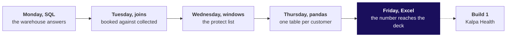
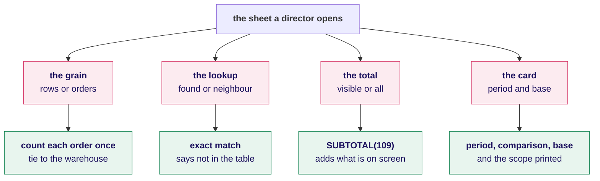

# The sheet that survives the room

**Week 2, Friday. Study notes, read after the session.** A sheet a director opens can lie in four
places without raising an error, each lie has a check that catches it inside a minute, and the
warehouse stays the owner of every number the sheet shows. Reading time: about 20 minutes.

---

## What you can now do

1. You can say an export's grain, count its rows against its ids and tie a pivot to the warehouse
   before a director slices it.
2. You can count each order once with a first-row flag, and say why Remove Duplicates cannot.
3. You can build a lookup that says "not in the table" for a missing id, and a foot that follows a
   filter.
4. You can put one number on a front page with its period, its comparison, its base and its scope.
5. You can say what the warehouse, pandas and Excel each own, and give a director a what-if without a
   typed-over cell.

---

## Where this sits

**What the session covered.** Worked in full: the four places a sheet lies; the tree as a pivot on
the clean table, then on the raw export, then tied to the warehouse; the protect list, its lookup and
a filtered foot; the front-page card; the three deliverables end to end; and the operating rule,
defended against a director. Mentioned only: a PivotTable's Refresh, and Wednesday's tie rule.

```mermaid
flowchart LR
    M["<b>Monday, SQL</b><br/>the warehouse answers"] --> T["<b>Tuesday, joins</b><br/>booked against collected"]
    T --> W["<b>Wednesday, windows</b><br/>the protect list"]
    W --> H["<b>Thursday, pandas</b><br/>one table per customer"]
    H --> F["<b>Friday, Excel</b><br/>the number reaches the deck"]
    F -.-> B["<b>Build 1</b><br/>Kalpa Health"]
    classDef today fill:#1A0F5C,stroke:#1A0F5C,color:#FFFFFF
    class F today
```

This map of the week is this programme's own construction, drawn from the Week 2 rows.

**The outcome tie.** Build 1 opens on Monday 19 October in Kalpa Health and asks for this same last
mile on data nobody has seen, so the number Dr Priya Menon reads will need a stated grain, a
reconciliation and a card built the way today's were.

**What was left out.** Macros, Power Query, dashboards beyond the one card and financial modelling
stayed out on purpose, and which number deserves the front page at all is Week 4's metric design.

---

## The picture to remember: the four silent lies

```mermaid
flowchart TB
    S["<b>the sheet a director opens</b>"]
    S --> G["<b>the grain</b><br/>rows or orders"]
    S --> L["<b>the lookup</b><br/>found or neighbour"]
    S --> V["<b>the total</b><br/>visible or all"]
    S --> C["<b>the card</b><br/>period and base"]
    G --> G2["<b>count each order once</b><br/>tie to the warehouse"]
    L --> L2["<b>exact match</b><br/>says not in the table"]
    V --> V2["<b>SUBTOTAL(109)</b><br/>adds what is on screen"]
    C --> C2["<b>period, comparison, base</b><br/>and the scope printed"]
    classDef bad fill:#FCEBF0,stroke:#D63A6A,color:#1A0F5C
    classDef good fill:#E8F5EE,stroke:#1F8A5B,color:#1A0F5C
    class G,L,V,C bad
    class G2,L2,V2,C2 good
```

Each red box prints a plausible number with no error, and the green box under it is the fix.
Retail-Plus runs through every section below, because each lie showed up first in its numbers, and
each section adds one line to the note the team sends the chief of staff.

---

## The ask, and why Excel presents and never cleans

> "Monday's growth review deck needs three things I can open on my laptop without a login: the
> revenue tree by segment for both quarters, the top-fifty protect list with a lookup so I can find
> any member by id, and one number on the front page with its trend. Nothing that needs Python. If a
> director changes an assumption in the room, the sheet must recalculate in front of them." Meera's
> chief of staff

Kavya Nair, the senior analyst, added the harder question: "Everything you built this week has to
survive a room that only has Excel. Which parts belong in Excel, which parts must never be in Excel,
and how do you keep the two from drifting apart?"

The last sentence of the ask set a rule for the whole workbook: a director changes only yellow input
cells, and every other cell is a formula. The room's first answer to Kavya was that removing the
double-paid rows must never happen in Excel, because a cleaning step in a sheet leaves no record and
the next export brings the rows back.

**CALLBACK.** Week 2, Thursday's tool-choice note sent the numbers Finance audits to SQL and the
analyst's iteration to pandas; today puts Excel at the end of that line.

---

## Round 1: the pivot, and the grain under it

A pivot adds one value per row, so the grain decides what it counts. The clean customer table has
one row per customer, 300 rows, with revenue summed from April to September; the raw export has one
row per payment, 1,450 rows for 1,000 orders, each repeating its order's order_amount; the
warehouse holds one row per order.

On the clean table, a PivotTable by segment shows 39 Business buyers carrying 99.1 percent of
revenue, and Retail-Plus multiplying back: 106 members times 3.29 orders times Rs 2,801 is about Rs
9.77 lakh. The clean table has no quarter column, so the quarters come from the raw export.

### The trap: the same pivot reads Rs 39.41 crore

Summing order_amount over every payment row, with the quarter from the order date:

| Segment | Q1, as the pivot shows | Q2, as the pivot shows | Change |
|---|---|---|---|
| Business | Rs 19,80,28,880 | Rs 19,34,72,200 | -2.3% |
| Retail-Core | Rs 4,33,760 | Rs 4,38,160 | +1.0% |
| Retail-Plus | Rs 9,38,160 | Rs 7,00,910 | -25.3% |
| Student | Rs 35,350 | Rs 48,070 | +36.0% |
| All segments | Rs 19,94,36,150 | Rs 19,46,59,340 | -2.4% |

That is Rs 39,40,95,490 across both quarters: the deck would carry Rs 19.47 crore for Q2, nearly
twice Finance's Rs 9.84 crore, and show Retail-Core growing, so the growth plan would leave Core
alone. The reasonable-looking percentages are what get the table sent.

The check is a count and a tie: 1,450 rows over 1,000 distinct order ids is 1.45 rows per order, and
the grand total sits far from the warehouse's Rs 19,84,00,000, the control total. Remove Duplicates
removes only the 50 identical copies the gateway posted, because each instalment order's two rows
differ in paid_amount, so 1,400 rows remain at Rs 39,40,57,740.

**CALLBACK.** Week 1, Wednesday's identity rule said a whole-record check keeps two rows of one order
that differ on one field, and Remove Duplicates is that check behind a button.

The fix names the grain: a first-row flag, `=IF(COUNTIF($A$2:A2,A2)=1,1,0)` filled down, and SUMIFS
over the rows flagged 1. The tree ties to the rupee, Rs 10,00,00,000 in Q1 and Rs 9,84,00,000 in Q2,
down 1.6 percent, and Retail-Core's rise becomes a 1.8 percent fall. Retail-Plus shows which leaf
moved:

| Retail-Plus | Q1 | Q2 | Change |
|---|---|---|---|
| Customers | 91 | 76 | -16.5% |
| Orders per customer | 2.36 | 1.84 | -22.0% |
| Revenue per order | Rs 2,725 | Rs 2,953 | +8.4% |
| Revenue | Rs 5,85,770 | Rs 4,13,380 | -29.4% |

The deck pack's Tree tab uses SUMIFS, which recalculates at once, where a PivotTable waits for a
Refresh after its source changes (Microsoft Support, Create a PivotTable, verified 29 September
2026). The harder variant tied the clean table to the warehouse too, since the protect list is built
from it, and looked for raw-export ids it lacks.

**CALLBACK.** Week 2, Tuesday's LEFT JOIN made the same 1,450 rows from 1,000 orders; today they
arrived already joined, in somebody else's export.

The note's first line:

> The tree counts each order once and ties to Finance: Rs 10.00 crore in Q1 and Rs 9.84 crore in Q2.

---

## Round 2: the protect list, a lookup with two exits, and a filtered foot

A lookup that answers for a missing id is worse than no lookup, because nobody in the room can tell.

The protect list is the fifty Retail-Plus members with the highest two-quarter revenue in the clean
table: of 106, rank 1 is C-0152 at Rs 25,840, rank 50 is Rs 8,580 and the fifty-first spent Rs
8,520, so no tie crosses the boundary, and the fifty total Rs 7,14,890.

**CALLBACK.** Week 2, Wednesday's tie rule decides a list's length only when a tie crosses the
boundary; here none does.

A lookup has two exits, the member's row or "not in the table". In the room's Excel,
`=XLOOKUP(id, ids, revenue, "not in the table")` matches exactly by default and shows its fourth
argument, if_not_found, for a missing id (Microsoft Support, XLOOKUP function, verified 29 September
2026). The workbooks use `=IFERROR(INDEX(revenue, MATCH(id, ids, 0)), "not in the table")`, since
LibreOffice 24.2.7.2 returns #NAME? for XLOOKUP.

### The trap: a neighbour at rank 15

C-0195 is a Retail-Plus member with no orders in the two quarters, so the clean table has no row for
it. `=VLOOKUP("C-0195", table, 5)`, with the fourth argument left out, returns Rs 16,740, which is
C-0194's revenue at rank 15, and nothing on the screen turns red.

**IN THE FIELD.** Microsoft's VLOOKUP page documents the default: with range_lookup left out,
VLOOKUP looks for an approximate match (Microsoft Support, VLOOKUP function, verified 29 September
2026), which on a table sorted by id returns the largest id not above the one asked for.

A director would hear that C-0195 is one of Kalpa's best members, and a retention offer would go to
someone who has not bought in six months. The check is to look up an id you know is missing and
print the id returned beside it; the fix, an exact match, turns "rank 15, Rs 16,740" into "not in
the table", which sends somebody to check the export.

**WATCH OUT.** An approximate match is caught only by someone who already knows the id is missing,
which is why every lookup is tested with a known-missing id before anyone else uses it.

### The second trap: a foot that ignores the filter

Filtered to Mumbai, 11 members worth Rs 1,56,790 stay on screen, while the SUM at the foot still reads
Rs 7,14,890, because SUM adds rows a filter has hidden. A Mumbai retention budget sized on that foot
would be 4.6 times too big.

| Formula at the foot | Rows hidden by a filter | Rows hidden by hand |
|---|---|---|
| `SUM` | Added | Added |
| `SUBTOTAL(9, range)` | Left out | Added |
| `SUBTOTAL(109, range)` | Left out | Left out |

The columns follow Microsoft Support's SUBTOTAL function page (verified 29 September 2026), and on
LibreOffice 24.2.7.2 on 29 September 2026, SUM over three rows with one hidden returned 60 while
SUBTOTAL(109) returned 40. The check, `=SUBTOTAL(102, range)`, counts the visible numbers, and the
fix is SUBTOTAL(109, range) at the foot.

The note's second line:

> A lookup names the member asked for or says the id is missing, and a list's foot adds only the
> members on screen.

---

## Round 3: one number on the front page

A number without its period is read against whatever the director remembers, and a percentage
without its base is read as whatever the director fears. The growth review asks what moved, so the
number is the latest quarter against the one before:

> Q2, July to September 2026: Rs 9.84 crore, down 1.6 percent on Q1, April to June 2026 (Rs 10.00
> crore).

The finding goes in the sentence beside it: the fall sits in Retail-Plus, where orders per member
fell from 2.36 to 1.84.

### The first trap: a card with no period

The fastest card is a grand total in big type, "Revenue Rs 19.84 crore", which is two quarters added
together. A director who remembers Q1 at Rs 10.00 crore reads a quarter that nearly doubled, and the
doubling goes into the minutes. The check is to read the card aloud and ask which months, and
against what.

**CALLBACK.** Week 1, Monday put a definition and a window beside every total; the card adds a
comparison and a base.

### The second trap: a percentage with no base

"Retail-Plus revenue down 29.4 percent" is correct and sounds like collapse. It is Rs 1.72 lakh on a
Rs 10.00 crore quarter, and Retail-Plus is 0.4 percent of Q2, so a room reading the bare percentage
argues about a panic instead of about members ordering less often. The fix prints the base and the
share:

> Retail-Plus, Q2: Rs 4.13 lakh, down 29.4 percent on Q1 (Rs 5.86 lakh); 0.4 percent of company
> revenue.

**WATCH OUT.** A change is measured on the earlier period, Q2 minus Q1 over Q1; divided by Q2, the
same fall reads 41.7 percent.

### The trend, and the scope a director changes

Company revenue runs Rs 4.08, 2.81 and 3.12 crore from April to June, then Rs 4.51, 2.69 and 2.64
crore from July to September, and July sits 45 percent above June because corporate invoices landed
in it. Without Business, revenue falls every month from June to September, at Rs 3.32, 2.91, 2.76
and 2.48 lakh, with Retail-Plus going from Rs 1.97 lakh to Rs 1.25 lakh, so the trend beside the card
is that consumer line, labelled.

The scope is a yellow input on the FrontPage tab, and the number, comparison and base move with it:

| The director asks | The card says |
|---|---|
| All segments | Rs 9.84 crore, down 1.6% on Q1; 100.0% of revenue |
| Take Business out | Rs 8.15 lakh, down 17.3% on Q1 (Rs 9.86 lakh); 0.8% of revenue |
| Show me Retail-Plus | Rs 4.13 lakh, down 29.4% on Q1 (Rs 5.86 lakh); 0.4% of revenue |

The note's third line:

> Q2 revenue is Rs 9.84 crore, down 1.6 percent on Q1, and the fall sits in Retail-Plus, where
> orders per member fell from 2.36 to 1.84.

---

## The escalated case: Monday's file, end to end

You built Monday's file alone in sixty minutes from the two exports: the grain, the tree tied to Rs
19.84 crore, the list, the card, then the checks, since a card built first sits on a grain nobody
checked. The deck pack's Checks tab asks four things: do the tree's quarters sum to Rs 19,84,00,000,
do the clean table's revenue and orders tie to the warehouse, does the lookup return the id asked for
or say it is missing, and are the card's quarters the tree's quarters.

The tree and the card tie and the clean table does not, so the release sends the tree and the front
page and holds the protect list until the customer table reconciles to the warehouse. "Every number
is a formula" was the tempting reason to hold nothing, and a formula recalculates faithfully on a
short table too.

The note's fourth line:

> The protect list is held until the customer export is rerun, because it does not tie to the
> warehouse.

---

## The second case: a director who wants to type five lakh

> "Retail-Plus will be back at five lakh next quarter; I have spoken to the team. Type five lakh into
> Q2 so the card stops frightening people, and fix the source later." A director, Kalpa Retail

Typed over the Q2 cell, Rs 5,00,000 makes Retail-Plus read down 14.6 percent where the export says
29.4, the deck and Finance's books disagree for a week, and Monday's refresh then wipes the edit
without a trace. The drift check, the sheet's Q2 total against the warehouse's at every refresh,
catches it the same day.

The operating rule settles it. The warehouse owns the number, anything Finance audits or that needs
a join, a dedupe or a cleaning step; pandas owns the analyst's iteration; Excel owns the last mile,
where it presents, slices and looks up an export and takes what-ifs as labelled inputs. A sheet keeps
no audit trail of a typed-over cell or a removed row, so the five lakh goes into a yellow input
feeding a labelled scenario line beside the actual:

| Line on the card | Retail-Plus, Q2 on Q1 | Where it comes from |
|---|---|---|
| Actual | -29.4% | The export, tied to the warehouse |
| The director's scenario | -14.6% | A yellow input of Rs 5,00,000 |

The pairs defended it in three lines: yes to the question, "I will show five lakh as your scenario,
beside the actual"; no to the edit, "the actual comes from the export Finance ties to"; and the
check, "every refresh ties the sheet back to the warehouse, so a drift shows the same day". A partner
who refused the question as well lost the room.

The note's last line:

> Change the yellow cells freely; never type over a number.

---

## The day in five lines

The cheat sheet repeats these word for word:

1. A pivot is only as honest as the rows under it: say the grain, count rows against ids, tie the total to the warehouse.
2. A lookup that cannot find an id says so; an approximate match answers with a neighbour.
3. The foot of a filtered list adds only what the director can see: SUBTOTAL(109), never SUM.
4. One number reaches the front page with its period, its comparison and its base.
5. The warehouse owns the number, pandas owns the iteration, Excel owns the last mile, and nobody types over the source.

---

## Try this yourself

No writing: pick a letter for each, note how sure you were, then check the key.

1. 1,450 payment rows hold 1,000 order ids, and the pivot reads Rs 39.41 crore. First: a) run Remove
   Duplicates on every column; b) divide the grand total by 1.45; c) flag each order's first row; d)
   filter Business out of the pivot.
2. `=VLOOKUP("C-0195", table, 5)` returns Rs 16,740 for a member with no orders. At fault: a) the id,
   typed inside quotes; b) the table, sorted by id; c) the column number, 5; d) the fourth, left out.
3. A list filtered to 11 Mumbai members still shows Rs 7,14,890 at its foot, which holds: a) SUM; b)
   SUBTOTAL(109); c) SUBTOTAL(102); d) a count of ids.
4. Retail-Plus went from Rs 5,85,770 to Rs 4,13,380. On the right base it fell: a) 41.7 percent; b)
   29.4 percent; c) 17.3 percent; d) 1.6 percent.
5. Two members tie at fifty and fifty-one, and the list keeps RANK up to 50. It ships: a) 49 names;
   b) 50 names; c) 51 names; d) 52 names.
6. A director wants Retail-Plus Q2 at five lakh. You: a) type it over the Q2 cell with a comment; b)
   add a yellow input and a scenario line; c) edit the export before it loads; d) decline the what-if
   in the room.

Key: 1c 2d 3a 4b 5c 6b. For 1, reread round 1; dividing by 1.45 gives Rs 27.18 crore, still wrong,
because the repeated rows are the large instalment invoices. For 2 and 3, reread round 2's traps, for
4 round 3's second trap, and for 6 the second case. Item 5 is Wednesday's tie rule: RANK gives a tie
one rank, so a tie across fiftieth place keeps both members.

---

## Where this gets tested

Each answer runs the mechanism, the check, the number from Kalpa and the decision it changes; one
missing the number or the check is weak. Tags, this programme's own calibration: [S] a staple asked
everywhere, [F] frequent in GCC and product screens, [D] a differentiator.

**[S] SQL, pandas or Excel: how do you choose?** I choose by who owns the number, how long it lives
and who reads it. Anything Finance audits, or that needs a join, a dedupe or a cleaning step, belongs
in the warehouse. The analyst's iteration belongs in pandas, and Excel owns the last mile. Kalpa's
Friday workbook tied its tree to the warehouse's Rs 19,84,00,000 and cleaned nothing. Rows deleted
in a sheet leave no record, and the next export brings them back.

**[S] A stakeholder wants to poke the numbers themselves; what do you give them and what do you never
give them?** A finished table, with yellow inputs for the assumptions and formulas everywhere else.
Its lookup says "not in the table" for a missing id, and its foot is SUBTOTAL(109), so it follows
their filter. I never give them the source to edit, a lookup that can answer with a neighbour, or a
number without its period and base. Kalpa's Checks tab held the protect list because its source did
not tie. What the file cannot yet be trusted for is part of the handover.

**[F] Your pivot shows a different total from the warehouse; where do you look first?** At the grain,
because a pivot adds one value per row. I count rows against distinct ids, then check the filter and
the period. Kalpa's raw export had 1,450 rows for 1,000 orders, so the pivot read Rs 39,40,95,490
against the warehouse's Rs 19,84,00,000. A first-row flag counted each order once and tied it to the
rupee. The fix changed a decision too, since Retail-Core went from a 1.0 percent rise to a 1.8
percent fall.

**[F] How do you present one number so it is not misread?** It carries its period, comparison, base
and scope, with a sentence saying what moved. Kalpa's card read: Q2, July to September
2026: Rs 9.84 crore, down 1.6 percent on Q1, April to June 2026 (Rs 10.00 crore). The sentence named
Retail-Plus, where orders per member fell from 2.36 to 1.84. I read every card aloud and ask which
months, against what and out of how much. The trend is the consumer line, since the company line
traces Business invoices.

**[D] Two directors change assumptions in the room and the sheet recalculates differently for each;
what did you get right and what do you fix?** The recalculation, because the assumptions were
yellow inputs over the same orders. All segments read Rs 9.84 crore, down 1.6 percent; with Business
out, Rs 8.15 lakh, down 17.3 percent. Both are honest answers to different questions. I fix whatever
lets them be confused, so each card prints its scope and share, 100.0 against 0.8 percent of
revenue. Afterwards I tie the sheet's Q2 total to the warehouse, which proves nobody typed over a
computed cell.

**[F] Your lookup returned a member for an id that does not exist; which argument was wrong?** The
fourth, range_lookup: left out, VLOOKUP defaults to an approximate match, as Microsoft documents. On
a table sorted by id, that returns the largest id not above the one asked for. At Kalpa, C-0195, a
member with no orders, came back as C-0194's Rs 16,740 at rank 15. The fix is an exact match that
says "not in the table", through XLOOKUP or INDEX and MATCH with a 0. I test every lookup with an id
I know is missing.

**[F] You filter a list and its total does not move; what is the foot doing?** The foot is a SUM,
which adds the rows a filter hid. Kalpa's list filtered to Mumbai showed 11 members worth Rs 1,56,790
while the foot read Rs 7,14,890, 4.6 times too much. SUBTOTAL(109) leaves out rows hidden by a filter
or by hand, where SUBTOTAL(9) still adds rows hidden by hand. SUBTOTAL(102) counts the visible
numbers, which shows what the foot should be adding. I filter every list once before it ships and
watch the foot move.

**[S] Why does Remove Duplicates not fix an export at the payment grain?** It deletes rows identical
in every column, and most extra payment rows differ in one field. Kalpa's 1,450 rows held 1,000
orders: 50 posted twice by the gateway and 400 paid in two instalments. Remove Duplicates took out
the 50 copies, and 1,400 rows still totalled Rs 39,40,57,740. The fix names the grain: count each order once and tie the total to Rs 19,84,00,000.
Deleting rows in a sheet is also cleaning with no audit trail.

**[F] A director says revenue doubled; your card says Rs 19.84 crore; what is missing?** The period,
and the comparison with it. Rs 19.84 crore is April to September, and a director who remembers Q1 at
Rs 10.00 crore reads a quarter that nearly doubled. The arithmetic is right and the card still
misleads, because it never names its months. The fix reads: Q2, July to September 2026: Rs 9.84
crore, down 1.6 percent on Q1, April to June 2026 (Rs 10.00 crore). I would correct it in the room, before the doubling
reaches the minutes.

**[D] A segment fell 29 percent and is 0.4 percent of revenue; does it go on the front page, and
how?** There is no clean answer, and I would commit to this: it goes on the front page as the
finding, with its base and share, while the headline stays company revenue. Retail-Plus fell 29.4
percent, Rs 1.72 lakh on a Rs 10.00 crore quarter, and it is 0.4 percent of Q2. It earns the space
because members are leaving, with orders per member down from 2.36 to 1.84. The line reads:
Retail-Plus, Q2: Rs 4.13 lakh, down 29.4 percent on Q1 (Rs 5.86 lakh); 0.4 percent of company
revenue. Divided by Q2 by mistake, it would read 41.7 percent.

**[D] A director wants to type over the source in the room; what do you say, and what do you
build?** Yes to the question, and no to the edit. Typed over Retail-Plus Q2, five lakh makes the card
read down 14.6 percent against Finance's 29.4, until Monday's refresh wipes it without a trace. I build a yellow input of Rs 5,00,000 feeding a labelled scenario line beside the actual. The
drift check, the sheet's Q2 total against the warehouse's at every refresh, catches any typed-over
cell. The warehouse owns the number, pandas owns the iteration, Excel owns the last mile, and nobody
types over the source.

---

## Glossary

| Term | Meaning |
|---|---|
| Grain | One row stands for one thing, such as a customer, an order or a payment. |
| PivotTable | It summarises a table by the fields you drag in, and changes when refreshed. |
| Control total | It is the owner's total, which every sheet built from the data must match. |
| First-row flag | A helper puts 1 on each order's first row, so a sum counts it once. |
| Exact match | The lookup returns the row whose id equals the one asked for, or nothing. |
| Approximate match | The lookup returns the nearest id not above the one asked for, silently. |
| if_not_found | XLOOKUP's fourth argument says what to show when the id is missing. |
| SUBTOTAL(109) | It adds only the visible rows, skipping rows hidden by filter or by hand. |
| Period | It names the months a number covers, such as Q2, July to September 2026. |
| Comparison | It names what the number is set against, usually the period before. |
| Base | It is the number a change is divided by, which is the earlier period. |
| Scope | It names which segments a number covers, and the card prints it. |
| Drift | The sheet's number no longer matches the warehouse's, usually because a cell was typed over. |
| Operating rule | It says which tool owns which number, and that nobody edits the source. |

---

## Go deeper

| Order | What | Time | Why this one |
|---|---|---|---|
| 1 | Microsoft Support, Create a PivotTable, https://support.microsoft.com/en-us/office/create-a-pivottable-to-analyze-worksheet-data-a9a84538-bfe9-40a9-a8e9-f99134456576 (verified 29 September 2026) | 15 minutes | It rebuilds round 1's pivot and says when to refresh it. |
| 2 | Microsoft Support, XLOOKUP function, https://support.microsoft.com/en-au/office/xlookup-function-b7fd680e-6d10-43e6-84f9-88eae8bf5929 (verified 29 September 2026) | 15 minutes | It names if_not_found and the match mode, which round 2 turned on. |
| 3 | Microsoft Support, VLOOKUP function, https://support.microsoft.com/en-us/office/vlookup-function-0bbc8083-26fe-4963-8ab8-93a18ad188a1 (verified 29 September 2026) | 10 minutes | It documents the default that handed C-0195 a neighbour's row. |
| 4 | Microsoft Support, SUBTOTAL function, https://support.microsoft.com/en-us/office/subtotal-function-7b027003-f060-4ade-9040-e478765b9939 (verified 29 September 2026) | 5 minutes | It says which hidden rows 9 and 109 each leave out. |
| 5 | Exponent, data analyst interview questions, https://www.tryexponent.com/blog/top-data-analyst-interview-questions (verified 13 Sep 2026) | 25 minutes | Its dashboard that disagrees with Finance is round 1 asked in an interview. |
| 6 | Chandoo on YouTube, Complete Excel Tutorial for Data Analysis in 4 Hours (with FREE Files), https://www.youtube.com/watch?v=7QNgqq154gE (verified 30 September 2026) | About 4 hours in all | Its pivot table part and its lookup part, which covers VLOOKUP, INDEX and MATCH, and XLOOKUP, teach the tools of rounds 1 and 2, so watch those two parts first. |

To practise, the deck pack in `demos/` is the reference build of the three deliverables, the
decision tool beside it hides one formula defect in each of five tabs, and the last-mile page
replays each trap in the browser.
