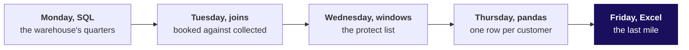
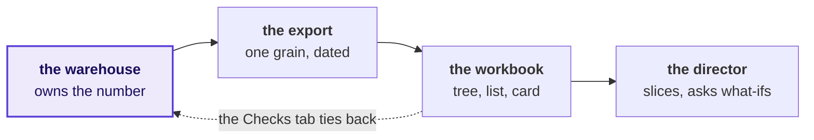

# What can a director open on Monday without a login, change in the room, and still trust?

**Week 2, Friday. Study notes, read after the session.** Reading time: about 25 minutes.

> "Monday's growth review deck needs three things I can open on my laptop without a login: the
> revenue tree by segment for both quarters, the top-fifty protect list with a lookup so I can find
> any member by id, and one number on the front page with its trend. Nothing that needs Python. If a
> director changes an assumption in the room, the sheet must recalculate in front of them."
>
> Meera's chief of staff, Kalpa Retail

Meera Raghavan, Kalpa Retail's CEO, runs Monday's growth review. Kavya Nair, the senior analyst who
reviews every line, added the harder question: "Everything you built this week has to survive a room
that only has Excel. Which parts belong in Excel, which parts must never be in Excel, and how do you
keep the two from drifting apart?"

---

## What can you do now that you could not this morning?

1. You can say what one row of an export stands for, and tie a pivot's total to the warehouse.
2. You can build a revenue tree whose leaves are ratios of the pivot's sums, and multiply it back.
3. You can count each order once in an export that repeats orders, which Remove Duplicates cannot do.
4. You can build a lookup that says "not in the table" for a missing id, and test it with one.
5. You can put one number on a front page with its period, its comparison and its base.
6. You can say what the warehouse, pandas and the workbook each own, and give a director a workbook
   whose checks turn red before a wrong number is read.

---

## Where does today sit in the week, and what does each of the chief of staff's numbers measure?

Six chapters on one Kalpa case were worked in full, and the afternoon added the escalated case, built
alone, and the second case, argued in pairs. Sheet protection that still allows filtering,
approximate match on price bands, and a running COUNTIF on a far larger export were only named.

```mermaid
flowchart LR
    M["<b>Monday, SQL</b><br/>the warehouse's quarters"] --> T["<b>Tuesday, joins</b><br/>booked against collected"]
    T --> W["<b>Wednesday, windows</b><br/>the protect list"]
    W --> H["<b>Thursday, pandas</b><br/>one row per customer"]
    H --> F["<b>Friday, Excel</b><br/>the last mile"]
    classDef today fill:#1A0F5C,stroke:#1A0F5C,color:#FFFFFF
    class F today
```

Monday's queries on the warehouse, the Postgres database of one row per order, put revenue at
Rs 10,00,00,000 in Q1 (April to June 2026, 538 orders) and Rs 9,84,00,000 in Q2 (July to September
2026, 462 orders). Tuesday joined orders to payments for Anand Iyer, the finance controller,
Wednesday ranked members with window functions, and Thursday built one row per customer in pandas.

Revenue is booked order value in rupees, and the revenue tree splits it into three leaves that
multiply back to it: customers, orders per customer and revenue per order. The segments are
Retail-Core (everyday shoppers), Retail-Plus (the paid membership tier), Business (corporate buyers
invoiced in large amounts) and Student. The chief of staff's tree gives each segment's revenue in
both quarters. The protect list names the fifty Retail-Plus members with the highest revenue from
April to September, whom the head of Retail-Plus sends a retention offer. The front-page number is
Q2 revenue against Q1, with six months as its trend.

Build 1 opens on Monday 19 October in Kalpa Health, where each group's claim needs its number, period
and base, tied to its source. Which metric belongs on a front page at all is a later week's question.

---

## Which one drawing sorts the day, from the warehouse to the director?

```mermaid
flowchart LR
    W["<b>the warehouse</b><br/>owns the number"] --> E["<b>the export</b><br/>one grain, dated"]
    E --> X["<b>the workbook</b><br/>tree, list, card"]
    X --> D["<b>the director</b><br/>slices, asks what-ifs"]
    X -.->|"the Checks tab ties back"| W
    classDef known fill:#EEEAFB,stroke:#5B3FD6,color:#1A0F5C,stroke-width:2px
    class W known
```

Every number in the chief of staff's file travels this line, and each box can print a wrong number
with no error. The export can repeat rows (chapters 1 and 2), the workbook can answer for the wrong
row or add rows nobody sees (chapters 3 and 6), and the director can read a number against the wrong
period (chapter 4). The dashed arrow is the day's discipline, every number tied back to the warehouse
before a director reads it, and chapter 5 decides which step belongs in which box.

---

## Chapter 1. Which segment carries Kalpa's revenue, and which leaf of the tree separates the segments?

**Who needs the answer.** The chief of staff puts the tree on page two of Monday's deck, where the
directors decide which segment the growth plan talks about, and a tree that does not multiply back
to its revenue loses them at the first check.

**The questions on the way.**

1. What does one row of the customer table stand for?
2. Which way should a director get the tree: a PivotTable, a formula grid, pasted numbers or a live dashboard?
3. Which segment carries the revenue?
4. Which leaf separates Retail-Plus from Retail-Core?
5. What does a leaf averaged customer by customer say?
6. Can this table split Q1 from Q2, and does a second calculator agree with the pivot?

The source is Thursday's customer table. Costco asks Kalpa's question of its own paid tier: Executive
members, 38.7 million of 81.0 million paid members, made up "approximately 73.6% of worldwide net
sales in 2025" (Costco Form 10-K, fiscal 2025, sec.gov, checked 30 September 2026).

### What does one row of the customer table stand for?

One customer who ordered in the two quarters: 300 rows and 300 distinct ids, with each customer's
orders and revenue summed, so a pivot's Sum adds each customer once.

### Which way should a director get the tree: a PivotTable, a formula grid, pasted numbers or a live dashboard?

| Option | What it costs on this table |
|---|---|
| a) A PivotTable | One pivot and 8 leaf formulas slice any column and recalculate on Refresh. |
| b) A SUMIFS grid | Its 12 formulas read 3,600 cells and recalculate at once. |
| c) Pasted values | Nothing on the sheet can answer a new question. |
| d) A live dashboard | It needs the login the brief rules out. |

The call is a, with each leaf beside the pivot as a ratio of its sums, because a director's first
move is to re-slice. An assumption to change would switch it to formulas, since a pivot recalculates
only on Refresh.

### Which segment carries the revenue?

Business: 39 buyers with 188 orders bring in Rs 19,65,99,040, 99.1 percent of the half-year, against
0.5 percent for Retail-Plus, 0.4 for Retail-Core and 0.03 for Student.

### Which leaf separates Retail-Plus from Retail-Core?

Revenue per order, 48.5 percent higher at Rs 2,801 against Rs 1,886, while orders per customer
differ by 10 percent, 3.29 against 2.99. A member's Rs 9,221 for the half-year beats a Retail-Core
shopper's Rs 5,644 on basket size.

### What does a leaf averaged customer by customer say?

Rs 11,66,786 an order for Business, the plausible wrong answer, 11.6 percent above revenue over
orders, Rs 10,45,740. A per-customer `=revenue/orders` column averaged in the pivot gives each buyer
one vote, while Business baskets run from Rs 3.34 lakh to Rs 66.98 lakh. The check is the
multiply-back, which comes out Rs 2.28 crore above what Business sold. The fix divides the pivot's
own sums, since formulas for calculated fields "operate on the sum of the underlying data"
(Microsoft Support, Calculate values in a PivotTable, checked 30 September 2026), and the tree ties
to the rupee.

### Can this table split Q1 from Q2, and does a second calculator agree with the pivot?

It cannot split them: last_order_date is a recency, and a split on it puts Rs 17.88 crore in Q2
against Monday's Rs 9.84 crore. A second calculator does agree: a running total per segment, read
from the CSV with Python's csv module, matches all 12 cells, as a COUNTIF and two SUMIFS per segment
would in Excel.

> **Kavya's review.** "Say what one row is before you pivot, and make every leaf a ratio of the
> pivot's own sums, then multiply the tree back before it goes on a page."

Business carries 99.1 percent of the revenue, and the basket separates the consumer tiers, Rs 2,801
an order against Rs 1,886. Both quarters need the export that carries order dates.

---

## Chapter 2. How much did revenue fall from Q1 to Q2, and in which segment and which leaf?

**Who needs the answer.** Meera decides from the tree for both quarters which branch the growth plan
funds, and a pivot that counts orders twice puts nearly twice Finance's revenue in front of the
directors.

**The questions on the way.**

1. Which quarter does each row of the export belong to?
2. What does the pivot say for Q1 and Q2?
3. Why does it read nearly double, and does Remove Duplicates fix it?
4. What does the tree say when each order counts once?
5. Which segment and which leaf fell?
6. Does the warehouse reach the same quarters by its own route?

The source is the raw export: 1,450 rows of order_id, customer_id, segment, channel, order_date,
order_amount, paid_amount and paid_date. Razorpay, the payment gateway, says its orders feature
"Combines multiple payment attempts for a single order" (Razorpay documentation, Orders, checked 30
September 2026).

### Which quarter does each row of the export belong to?

| Option | What it costs here |
|---|---|
| a) Split the customer table on last order date | It moves Rs 8.04 crore of Q1 revenue into Q2. |
| b) A SUMIFS grid per segment and quarter | Its 8 formulas run 34,800 tests and slice nothing else. |
| c) A quarter column, then the pivot | Its 1,450 formulas run once, and any column can slice it. |
| d) The warehouse team's tree | It is exact, and each new question waits a day. |

The call is c: `=IF(MONTH(E2)<=6,"Q1","Q2")` filled down puts 772 rows in Q1 and 678 in Q2. A
deadline far enough away for the warehouse team would switch it to d.

### What does the pivot say for Q1 and Q2?

Rs 19,94,36,150 for Q1 and Rs 19,46,59,340 for Q2, Rs 39,40,95,490 in all, with Retail-Core up 1.0
percent: the plausible wrong answer, nearly twice Finance's Rs 9.84 crore for Q2, with nothing red.

### Why does it read nearly double, and does Remove Duplicates fix it?

One row is one payment, the order's amount repeated on each, and the check is rows against order
ids, 1,450 against 1,000. Four hundred instalment orders have two rows that differ in paid_amount,
and fifty gateway double posts have two identical rows. Remove Duplicates removes only those fifty,
Rs 37,750 of small orders, and 1,400 rows still total Rs 39,40,57,740: the blind spot of Week 1
Wednesday's whole-record dedupe.

### What does the tree say when each order counts once?

Q1 Rs 10,00,00,000 and Q2 Rs 9,84,00,000, down 1.6 percent, tied to the rupee. The first-row flag,
`=IF(COUNTIF($A$2:A2,A2)=1,1,0)`, takes Rs 19,56,95,490 out of the total and turns Retail-Core from
up 1.0 percent to down 1.8, undoing the shape Tuesday's LEFT JOIN made in SQL.

### Which segment and which leaf fell?

| Segment | Q1 | Q2 | Change |
|---|---|---|---|
| Business | Rs 9,90,14,440 | Rs 9,75,84,600 | -1.4% |
| Retail-Core | Rs 3,73,070 | Rs 3,66,250 | -1.8% |
| Retail-Plus | Rs 5,85,770 | Rs 4,13,380 | -29.4% |
| Student | Rs 26,720 | Rs 35,770 | +33.9% |

Business carries Rs 14,29,840 of the Rs 16,00,000 fall, a few invoices landing in one quarter or the
next. Retail-Plus fell steepest: customers who ordered went from 91 to 76 and orders per customer
from 2.36 to 1.84, while the basket rose from Rs 2,725 to Rs 2,953, the frequency branch Week 1
Tuesday found.

### Does the warehouse reach the same quarters by its own route?

Yes. Monday's `SELECT quarter, count(*), sum(amount) FROM orders GROUP BY quarter`, which never saw
the export, gives Rs 10,00,00,000 on 538 orders and Rs 9,84,00,000 on 462.

> **Kavya's review.** "Say the grain before you pivot, count rows against ids, and tie the grand
> total to the warehouse; a pivot that has not been tied has not been built."

Revenue fell Rs 16,00,000, 1.6 percent. Business carries Rs 14.30 lakh of it, and Retail-Plus fell
steepest, 29.4 percent, because its members ordered less often.

---

## Chapter 3. Which fifty Retail-Plus members go on the protect list, and when the chief of staff types an id, does the sheet answer for that member?

**Who needs the answer.** The head of Retail-Plus sends the fifty a retention offer, and the chief of
staff reads a member's line aloud when a director names one, so a lookup that answers with the wrong
row calls a lapsed member one of the best.

**The questions on the way.**

1. Who makes the list, and where does it stop?
2. Does the list's source table tie to the warehouse?
3. Which lookup should answer "find this member"?
4. What does a lookup with its fourth argument left out return for an id the table does not hold?
5. What does an exact match with a not-found path return, and what if the list is re-sorted?
6. Does an independent count agree with the lookup?

In 2003 TransAlta lost 24 million US dollars on New York transmission bids after "a cut-and-paste
error in an Excel spreadsheet that we did not detect when we did our final sorting and ranking of
bids" (The Globe and Mail, 4 June 2003, checked 30 September 2026).

### Who makes the list, and where does it stop?

Fifty of the 106 Retail-Plus members, ranked with `=RANK.EQ(E2, E$2:E$107)`, from C-0152 at
Rs 25,840 to a cut-off of Rs 8,580. The fifty-first spent Rs 8,520, so no tie crosses the line, and
the fifty together spent Rs 7,14,890.

### Does the list's source table tie to the warehouse?

That answer is yours. The list comes from the customer table, which has to tie on its own before the
list ships, and chapter 3's notebook leaves an empty cell for the comparison.

### Which lookup should answer "find this member"?

| Option | What it does for an id with no row |
|---|---|
| a) `=VLOOKUP(id, A:F, 5)` | It returns another member's row. |
| b) `=VLOOKUP(id, A:F, 5, FALSE)` | It shows #N/A, which a director reads as a broken sheet. |
| c) `=IFERROR(INDEX(E:E, MATCH(id, A:A, 0)), "not in the table")` | It says "not in the table" in any Excel. |
| d) `=XLOOKUP(id, A:A, E:E, "not in the table")` | It says the same, in Excel 2021, 2024 or Microsoft 365. |

The call is d on the room's Microsoft 365 and c wherever the file travels, since XLOOKUP "is not
available in Excel 2016 and Excel 2019" (Microsoft Support, XLOOKUP function, checked 30 September
2026).

### What does a lookup with its fourth argument left out return for an id the table does not hold?

C-0194's Rs 16,740, rank 15, with nothing red: the plausible wrong answer. C-0195, a Retail-Plus
member with no orders in the two quarters, has no row, and the fourth argument left out means "TRUE
or approximate match" (Microsoft Support, VLOOKUP function, checked 30 September 2026), the largest
id not above the one asked for. The check is to test with an id you know is missing.

### What does an exact match with a not-found path return, and what if the list is re-sorted?

"Not in the table" for C-0195, Rs 25,840 for C-0152 and Rs 16,740 for C-0194, in any order, which
matters because the list sorted by revenue steps down in id 24 times in 49.

### Does an independent count agree with the lookup?

Yes: `=COUNTIF(A:A, "C-0195")` gives 0, and `=SUMIFS(E:E, A:A, "C-0152")` gives Rs 25,840.
Approximate match belongs to bands, where Rs 2,700 against invented tiers at Rs 0, Rs 1,000 and
Rs 2,500 falls in the Rs 2,500 tier.

> **Kavya's review.** "A lookup that answers with somebody else's row is worse than no lookup,
> because nobody in the room can tell."

The fifty run from Rs 25,840 to Rs 8,580, and the sheet answers for the member typed in only through
an exact match with a not-found path. The list ships once its source ties.

---

## Chapter 4. What must sit beside the front-page number so a director reads it right in two minutes?

**Who needs the answer.** Meera and the directors read the front page first and may read nothing
else, so a card without its period or its base sends the meeting after a boom or a crisis that
never happened.

**The questions on the way.**

1. What does a director read in a card that says "Revenue Rs 19.84 crore"?
2. Which form should the card take?
3. What does the card say with its period, comparison and base?
4. What does "Retail-Plus revenue down 29.4 percent" leave out?
5. What does the trend beside the number show, and what happens when a director changes the scope?
6. Does the warehouse reach the same change by its own route?

Avenue Supermarts, which runs DMart, headlined its quarter to 30 June 2025 as "Standalone Total
Revenue up by 16.2% at Rs.15,932 Crore", against Rs 13,712 crore a year earlier (Avenue Supermarts
press release, 11 July 2025, checked 30 September 2026).

### What does a director read in a card that says "Revenue Rs 19.84 crore"?

Revenue up 98.4 percent: the two quarters added, read against Q1's Rs 10.00 crore, while revenue
fell 1.6 percent. The check is to read the card aloud and ask which months, and against what.

### Which form should the card take?

| Option | What a director must bring to read it right |
|---|---|
| a) "Revenue Rs 19.84 crore" | The director must know it covers two quarters. |
| b) "Q2 revenue Rs 9.84 crore" | The director must remember Q1's figure. |
| c) Q2 against Q1, both figures shown | The director needs nothing else. |
| d) c, with a sentence and a six-month line | The director needs nothing, and the next question is answered. |

The call is d, about fifty words and one small line chart. A board that reviews every month against
its plan would switch the comparison to the plan.

### What does the card say with its period, comparison and base?

"All segments, Q2, July to September 2026: Rs 9.84 crore, down 1.6 percent on Q1, April to June 2026
(Rs 10.00 crore); 100.0 percent of company revenue in Q2." Its sentence adds that Business invoices
carry Rs 14.30 lakh of the Rs 16.00 lakh fall and Retail-Plus fell 29.4 percent on frequency.

### What does "Retail-Plus revenue down 29.4 percent" leave out?

Its base and its share: Rs 1.72 lakh on Rs 5.86 lakh, 0.4 percent of Q2 revenue. Divided by Q2 by
mistake, it reads 41.7 percent. The fix reads "Retail-Plus, Q2: Rs 4.13 lakh, down 29.4 percent on
Q1 (Rs 5.86 lakh); 0.4 percent of company revenue". A share moves in points: the consumer share went
from 0.99 percent to 0.83, down 0.16 points, a 16 percent fall in the share.

### What does the trend beside the number show, and what happens when a director changes the scope?

Company revenue jumps in July to Rs 4.51 crore, 45 percent above June, on corporate invoices, while
the consumer line slides from Rs 3.32 lakh in June to Rs 2.48 lakh in September. Without Business,
revenue fell from Rs 9.86 lakh to Rs 8.15 lakh, down 17.3 percent, so each card prints its scope.

### Does the warehouse reach the same change by its own route?

Yes. Its orders joined to its customers give -1.6 percent for the company and -29.4 percent for
Retail-Plus.

> **Kavya's review.** "If the card cannot say which months, against what and out of how much, it goes
> back."

Beside the number sit its period, comparison and base: Q2, Rs 9.84 crore, down 1.6 percent on Q1's
Rs 10.00 crore, with rupees beside every percentage.

---

## Chapter 5. Which of the week's steps belong in the workbook, which must never be done there, and how do the two stay in step?

**Who needs the answer.** Kavya signs the team's operating rule, and Anand Iyer's analyst audits
every number Finance relies on, so a join done in a sheet can report paid money as unpaid.

**The questions on the way.**

1. What did each day of the week build, and what does each step touch?
2. Where could the week's work live?
3. What does booked against collected say when a lookup does the join?
4. Why is it wrong, and what does adding every payment say?
5. Where does each of the week's steps belong?
6. How do the workbook and the warehouse stay in step?

Public Health England reported in October 2020 that "15,841 cases between 25 September and 2 October
were not included in the reported daily COVID-19 cases" (GOV.UK, 4 October 2020, checked 30 September
2026), after a step of its pipeline ran through spreadsheet templates.

### What did each day of the week build, and what does each step touch?

Monday's tree and Wednesday's top fifty read the orders table, Thursday merged in pandas, and Friday
reads the exports. Tuesday's booked against collected joins 1,000 orders to 1,428 payments, the one
step where one row meets several.

### Where could the week's work live?

| Option | What collected per order costs |
|---|---|
| a) Everything in the workbook | It runs 1,450,000 tests a recalculation, rerun by hand. |
| b) The split: the warehouse computes, pandas iterates, the workbook presents | It runs one GROUP BY over 1,428 payments that anyone can rerun. |
| c) pandas pastes values | It runs one groupby, and nothing recalculates in the room. |
| d) A dashboard on the warehouse | It runs a query a view, and every director needs a login. |

The call is b. A one-off question nobody audits or reruns could live in a sheet.

### What does booked against collected say when a lookup does the join?

Rs 11,83,81,974 collected against Rs 19,84,00,000 booked, Rs 8.00 crore outstanding, 40.3 percent:
the plausible wrong answer, from `=VLOOKUP(A2, RawExport!A:H, 7, FALSE)` beside each order. Anand's
team would chase Rs 8 crore from accounts that have paid.

### Why is it wrong, and what does adding every payment say?

A lookup stops at the first matching row, and 450 orders have two payment rows; the check counts rows
per order. Adding every payment, with `=SUMIFS(G:G, A:A, A2)` as a check and the join in the
warehouse, gives Rs 19,66,82,820, Rs 17,17,180 short, 0.9 percent, and the warehouse's own join
agrees to the rupee.

### Where does each of the week's steps belong?

The warehouse owns the number and every join, dedupe and rank Finance relies on, counting each order
once among them. pandas owns the analyst's iteration until Finance relies on it. The workbook owns
the last mile, presenting, slicing, looking up and taking labelled what-ifs on an export that ties,
and nobody types over the source.

### How do the workbook and the warehouse stay in step?

A drift check on every refresh ties the workbook's orders and revenue per quarter to the warehouse's:
today's export ships, and the same export pulled a week early falls short in Q2 and is held. Public
Health England's templates, in a format with "a maximum of 65,536 rows per worksheet" (Microsoft
Learn, checked 30 September 2026), dropped rows without an error.

> **Kavya's review.** "The warehouse owns the numbers, pandas owns your iteration, Excel owns the last
> mile, and the drift check keeps the last mile honest."

Joins, dedupes and ranks stay in the warehouse, where collected is Rs 17,17,180 short of booked; the
workbook presents, and a drift check keeps the two in step.

---

## Chapter 6. When a director takes the workbook in the room, what can they break, and which checks catch it before anyone reads a wrong number?

**Who needs the answer.** The head of Retail-Plus sizes each city's retention budget from the list in
the room, and a total that counts rows a filter has hidden sizes it on the whole list.

**The questions on the way.**

1. What will a director do to the workbook?
2. How could the team protect it?
3. What does the list's total say when a director filters it to one city?
4. What do SUBTOTAL(109) and SUBTOTAL(103) say?
5. Where does a director's assumption go, so the sheet recalculates honestly?
6. Which checks does the Checks tab run, and what does its release hold?

In 2008 a law firm reformatting Barclays's purchase of Lehman Brothers contracts into a PDF exposed
hidden rows, and Barclays asked the court to exclude 179 contracts (Computerworld, 14 October 2008,
checked 30 September 2026).

### What will a director do to the workbook?

Filter, sort, type over a cell, change an assumption and paste a new export. A filter under a SUM, a
one-column sort and a typed-over formula change a number's meaning with no error, while a yellow
input cell, the one kind a director is meant to change, recalculates in the open.

### How could the team protect it?

| Option | What a wrong number looks like |
|---|---|
| a) Protect every cell | Nothing goes wrong, and no what-if can be asked. |
| b) Send a PDF | Nothing goes wrong, and nothing recalculates. |
| c) Yellow inputs, formulas elsewhere, a Checks tab | A check turns red and the release holds. |
| d) A copy for each director | The copies disagree by the end of the meeting. |

The call is c, the only way a director can do all five things and still see a wrong number turn red.
A board pack nobody is meant to change would go as a PDF.

### What does the list's total say when a director filters it to one city?

Rs 7,14,890, the whole list, while the eleven Mumbai members on screen spent Rs 1,56,790: the
plausible wrong answer from `=SUM(E2:E51)`, which adds hidden rows and would size a Mumbai budget 4.6
times too big. The check counts rows on screen against rows the total adds, and the fix is Excel's
SUBTOTAL function.

### What do SUBTOTAL(109) and SUBTOTAL(103) say?

`=SUBTOTAL(109, E2:E51)` reads Rs 1,56,790 and `=SUBTOTAL(103, A2:A51)` counts 11 of 50, because
SUBTOTAL "ignores any rows that are not included in the result of a filter" (Microsoft Support,
SUBTOTAL function, checked 30 September 2026). The second route, `=SUMIFS(E2:E51, C2:C51,
"Mumbai")`, agrees.

| The foot | Rows a filter hides | Rows hidden by hand |
|---|---|---|
| `SUM` | It adds them. | It adds them. |
| `SUBTOTAL(9, ...)` | It leaves them out. | It adds them. |
| `SUBTOTAL(109, ...)` | It leaves them out. | It leaves them out. |

### Where does a director's assumption go, so the sheet recalculates honestly?

Into a yellow input. A Rs 500 voucher in B1 and `=B1*SUBTOTAL(103, A2:A51)` cost Rs 5,500 for
Mumbai's eleven, and Rs 750 makes it Rs 8,250 in front of the room, with the list untouched.

### Which checks does the Checks tab run, and what does its release hold?

Five: the tree's quarters and the list's source against the warehouse, the lookup on a known missing
id, SUBTOTAL(103) against the rows the foot adds, and ISFORMULA outside the yellow inputs. On
invented records, a source Rs 1,200 short gives "Hold the protect list; ship the rest", and a
typed-over formula holds the whole workbook.

> **Kavya's review.** "A director who filters, sorts or asks a what-if should see a number move, and
> never a number lie."

SUBTOTAL, yellow inputs and five checks catch every silent break, and filtered to Mumbai the foot
reads Rs 1,56,790 for eleven members.

---

## What does the escalated case ask, and which rule does it test?

Alone, you build the chief of staff's file from the two exports in five parts: does the tree tie,
does the list hold the right fifty with an honest lookup, does the card carry its period, comparison
and base, what ships and what is held, and do the numbers agree a second way. It tests the release:
each part ships on its own check, and a part whose check fails is held with its reason.

## What does the second case ask, and which rule does it test?

In pairs, a director asks: "Retail-Plus will be back at five lakh next quarter; I have spoken to the
team. Type five lakh into Q2 so the card stops frightening people, and fix the source later." It
tests chapter 5's rule under pressure: yes to the question, no to the edit.

---

## Where do today's checks decide something at work?

- When a dashboard disagrees with Finance's report, the first minute goes on rows against keys.
- When someone reads names off a ranked list in a meeting, its lookup has been tried on a missing id.
- When a stakeholder asks for "the spreadsheet", they get inputs and checks, and the joins stay
  upstream.

---

## Can you answer four questions on today's traps without writing anything?

Pick a letter for each, then check the key.

1. An export holds 1,450 rows for 1,000 order ids, and its pivot reads nearly twice the warehouse.
   What comes first? a) Remove Duplicates with every column ticked; b) a flag on each order's first
   row, then a tie to the warehouse; c) the total divided by the rows per order; d) Business
   filtered out of the pivot.
2. `=VLOOKUP("C-0195", A2:F301, 5)` returns Rs 16,740 for a member with no row. Which part is at
   fault? a) the quotes around the id; b) the column number, 5; c) the range, which stops at row
   301; d) the fourth argument, left out.
3. Which Retail-Plus line can go on the front page? a) Retail-Plus, Q2: down 41.7 percent, measured
   on Q2's Rs 4.13 lakh; b) Retail-Plus, Q2: down 29.4 percent, the steepest fall of any segment; c)
   Retail-Plus, Q2: Rs 4.13 lakh, down 29.4 percent on Q1's Rs 5.86 lakh; d) Retail-Plus revenue
   fell sharply in Q2 as members left the tier.
4. Filtered to eleven Mumbai members, the list's foot still reads Rs 7,14,890. Which formula sits at
   the foot? a) SUM over the fifty rows; b) SUBTOTAL(109) over the fifty rows; c) SUBTOTAL(103) over
   the fifty ids; d) SUMIFS on the city column.

Key: 1b 2d 3c 4a. A miss sends you back to chapter 2, 3, 4 or 6. Item 1 is Tuesday's join fan-out,
met again inside an export.

---

## What will an interviewer ask, and what does a strong answer sound like?

The tags are this programme's own calibration for 0 to 3 year Indian-market candidates: [S] a staple
asked everywhere, [F] frequent in GCC and product screens, [D] a differentiator. The first five are
the day's anchors, and a strong answer gives the mechanism, the check, Kalpa's number and the
decision.

**[S] SQL, pandas or Excel: how do you choose?** By who must trust the number and who must rerun it:
SQL in the warehouse for anything Finance audits or that joins, dedupes or ranks, pandas for the
analyst's iteration, and Excel for the room, on an export that ties. A sheet doing Kalpa's join
reported Rs 8.00 crore outstanding where the warehouse's join leaves Rs 17,17,180.

**[S] A stakeholder wants to poke the numbers themselves; what do you give them, and what do you
never give them?** Yellow inputs, formulas elsewhere, an honest lookup, SUBTOTAL feet and a Checks
tab, on a reconciled export. Never the source to edit, a lookup that can return somebody else's row,
or a number without its period and base. Kalpa's Rs 500 voucher cost Rs 5,500 for Mumbai with the
list untouched.

**[F] Your pivot shows a different total from the warehouse; where do you look first?** At the grain,
rows against distinct keys: Kalpa's export had 1,450 rows for 1,000 orders, so the pivot read
Rs 39,40,95,490 against Rs 19,84,00,000. Counting each order once tied both quarters and turned
Retail-Core from up 1.0 percent to down 1.8. Then the period, the filters and missing keys.

**[F] How do you present one number so it is not misread?** With its period, comparison and base,
and a sentence on what moved it: Q2, July to September 2026, Rs 9.84 crore, down 1.6 percent on Q1's
Rs 10.00 crore, with rupees beside every percentage, since Retail-Plus's 29.4 percent is Rs 1.72
lakh. A weak answer stops at a big number and an arrow.

**[D] Two directors change assumptions in the room and the sheet recalculates differently for each;
what did you get right, and what do you fix?** Right: the assumptions were inputs over one source, so
both answers are honest. To fix: each answer prints its assumption and scope, so down 1.6 percent
for all segments and down 17.3 percent without Business are never compared as one figure, and a
scenario never replaces the actual.

**[D] A leaf of your tree does not multiply back to its revenue; what happened?** It was averaged
over customers instead of divided over totals: Business read Rs 11,66,786 an order against
Rs 10,45,740, and the tree came back Rs 2.28 crore over. Divide the pivot's sums, and keep the
multiply-back as the check.

**[D] The export grows a hundredfold; which formula do you replace, and with what?** The running
COUNTIF flag, which costs 1,051,975 comparisons on 1,450 rows and about 10.5 billion on 145,000. Sort
by order id and compare each row with the one above, or ask the warehouse for an order-grain export.

**[F] Your lookup returned a member for an id that does not exist; which argument was wrong?** The
fourth, range_lookup, which defaults to approximate match: C-0195 came back as C-0194's Rs 16,740 at
rank 15. Use an exact match with a not-found path, and test with an id you know is missing.

**[F] A lookup does a join in a sheet and collected falls by 40 percent; what happened?** It took
each order's first payment, and 450 orders had two: collected read Rs 11,83,81,974 against
Rs 19,84,00,000 booked, where adding every payment gives Rs 19,66,82,820. The join belongs in the
warehouse.

**[F] You filter a list and its total does not move; what is the foot doing?** It is a SUM adding
hidden rows: filtered to Mumbai it read Rs 7,14,890 while the eleven on screen spent Rs 1,56,790.
SUBTOTAL(109) adds what is on screen, and SUBTOTAL(103) counts it.

---

## Which words did today use, and what does each mean?

| Term | What it means | Where today used it |
|---|---|---|
| Grain | It is what one row stands for: a customer, an order or a payment. | The raw export held one row per payment. |
| Revenue tree | It splits revenue into customers, orders per customer and order size. | Retail-Plus was 106 customers, 3.29 orders each, Rs 2,801 an order. |
| Control total | It is the owner's total, which every sheet built from the data must match. | The warehouse's quarters were the day's control totals. |
| First-row flag | It puts 1 on each order's first row, so a sum counts every order once. | It brought Rs 39.41 crore back to Rs 19.84 crore. |
| Approximate match | It returns the largest id not above the one asked for, with no warning. | It answered C-0195 with C-0194's row. |
| SUBTOTAL(109) | It adds only the rows on screen, leaving out filtered and hidden rows. | It read Rs 1,56,790 for Mumbai. |
| Yellow input | It is the one kind of cell a director may change; formulas read it. | A Rs 500 voucher in B1 cost Rs 5,500 for Mumbai. |
| Drift check | It ties the workbook's control totals to the warehouse on every refresh. | It held an export pulled a week early. |
| Base | It is the figure a change is divided by, the earlier period's. | Retail-Plus fell on a base of Rs 5.86 lakh. |
| Release | It is the Checks tab's sentence on what ships and what is held. | An invented short source held the protect list. |

---

## What should you read next, and in what order?

| Order | What | Time | Why |
|---|---|---|---|
| 1 | Microsoft Support, Create a PivotTable, https://support.microsoft.com/en-us/office/create-a-pivottable-to-analyze-worksheet-data-a9a84538-bfe9-40a9-a8e9-f99134456576 (checked 1 October 2026) | 15 minutes | It rebuilds chapter 1's pivot. |
| 2 | Microsoft Support, Calculate values in a PivotTable, https://support.microsoft.com/en-us/excel/calculate-values-in-a-pivottable (checked 1 October 2026) | 10 minutes | It explains why a calculated field divides sums. |
| 3 | Costco's Form 10-K for fiscal 2025, https://www.sec.gov/Archives/edgar/data/909832/000090983225000101/cost-20250831.htm (checked 1 October 2026) | 10 minutes | It reports sales by member tier. |
| 4 | JPMorgan Chase's task force report on the 2012 CIO losses, https://ypfsresourcelibrary.blob.core.windows.net/fcic/YPFS/JPMorgan%20Management%20Task%20Force%20Regarding%202012%20CIO%20Losses%201-16-13.pdf (checked 1 October 2026) | 5 minutes, page 128 | Its spreadsheet "divided by their sum instead of their average". |
| 5 | Razorpay, About Orders, https://razorpay.com/docs/payments/orders/ (checked 1 October 2026) | 10 minutes | It shows one order beside several payment attempts. |
| 6 | Microsoft Support, VLOOKUP function, https://support.microsoft.com/en-us/office/vlookup-function-0bbc8083-26fe-4963-8ab8-93a18ad188a1 (checked 1 October 2026) | 10 minutes | It documents the default that answered C-0195 with a neighbour. |
| 7 | Microsoft Support, XLOOKUP function, https://support.microsoft.com/en-au/office/xlookup-function-b7fd680e-6d10-43e6-84f9-88eae8bf5929 (checked 1 October 2026) | 15 minutes | It names the not-found argument and the versions without it. |
| 8 | The Globe and Mail on TransAlta, https://www.theglobeandmail.com/report-on-business/human-error-costs-transalta-24-million-on-contract-bids/article18285651/ (checked 1 October 2026) | 5 minutes | Misaligned rows in a ranked sheet cost 24 million US dollars. |
| 9 | Public Health England's statement, https://www.gov.uk/government/news/phe-statement-on-delayed-reporting-of-covid-19-cases (checked 1 October 2026) | 5 minutes | A spreadsheet step lost 15,841 cases. |
| 10 | Microsoft Support, SUBTOTAL function, https://support.microsoft.com/en-us/office/subtotal-function-7b027003-f060-4ade-9040-e478765b9939 (checked 1 October 2026) | 5 minutes | It says which hidden rows 9 and 109 leave out. |
| 11 | Computerworld on Barclays and Lehman, https://www.computerworld.com/article/1561181/excel-error-leaves-barclays-with-more-lehman-assets-than-it-bargained-for.html (checked 1 October 2026) | 5 minutes | Hidden rows became 179 unwanted contracts. |
| 12 | Exponent, data analyst interview questions, https://www.tryexponent.com/blog/top-data-analyst-interview-questions (checked 1 October 2026) | 25 minutes | Its dashboard that disagrees with Finance is chapter 2 in an interview. |
| 13 | Chandoo on YouTube, Complete Excel Tutorial for Data Analysis in 4 Hours (with FREE Files), https://www.youtube.com/watch?v=7QNgqq154gE (checked 1 October 2026) | About 4 hours | Its pivot and lookup parts practise chapters 1 to 3. |

---

## Which six lines from today's chapters are worth keeping?

One line per chapter, in chapter order.

1. Every leaf of the tree is a ratio of the pivot's sums, and the tree multiplies back to its revenue before it goes on a page.
2. Say the grain before you pivot: count rows against keys, count each order once, and tie the total to the warehouse.
3. A lookup that cannot find an id says so: an exact match with a not-found path, tested with an id you know is missing.
4. One number reaches the front page with its period, its comparison and its base, and every percentage carries its rupees.
5. The warehouse owns the number and every join, dedupe and rank; pandas owns the iteration; the workbook owns the last mile, and nobody types over the source.
6. A director gets yellow inputs, formulas everywhere else, SUBTOTAL at every foot, and a Checks tab whose release holds whatever does not tie.

---

## So, what can a director open on Monday without a login, change in the room, and still trust?

The sentence to the chief of staff: "The tree and the front page tie to Finance: Q2, July to September
2026, Rs 9.84 crore, down 1.6 percent on Q1's Rs 10.00 crore. Business invoices carry most of the
rupees; Retail-Plus fell 29.4 percent because members ordered less often. The protect list ships
when the Checks tab says its source ties to the warehouse, and the release note says what it found.
Change the yellow cells freely; never type over a number."

A director can trust each part as far as its check reaches: the tree because it ties to the
warehouse, the lookup because it says "not in the table", the card because it carries its period,
comparison and base, and every total because SUBTOTAL follows the filter.
