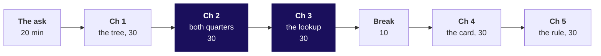
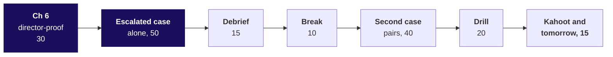

# Day sheet, Week 2 Friday: what can a director open on Monday without a login, change in the room, and still trust?

**TRAINER ONLY.** Nothing on this page reaches a learner.

Posts to <!-- sync:module:W02/D5 -->Module 1: Foundations of AI and Data<!-- /sync:module:W02/D5 -->, on <!-- sync:day-date:W02/D5 -->Fri 16 Oct 2026<!-- /sync:day-date:W02/D5 -->. No IITGN faculty block today.

Built from the approved Weeks 1 and 2 spine (`docs/detailing/W01_W02_spine.md`, Friday), raised to
the chapter standard and the question ladder of 30 September 2026, and the Friday row of
`docs/curriculum/W2_Data_manipulation.md`. Data: client zero v4, the two class exports and the
warehouse that `.devcontainer/load_warehouse.sh` loads. Kalpa Retail's business, its segments and its
revenue tree were told on Week 1 Monday in the retail dossier
(`content/W01/D1/study-notes/C2_W01_D01_domain_retail_STUDENT.md`); today links to it and never
retells it. The room holds Excel; every notebook is the second route to a number, run on the projector.

## Which questions does the day ask, in the order the trainer asks them?

The day's question, in the chief of staff's terms: **what can a director open on Monday without a
login, change in the room, and still trust?** Ask each question below before its answer is shown;
each chapter's map slide lists its six smaller questions, and its last slide answers them.

| Part | Its question | The smaller questions, in order |
|---|---|---|
| The ask | Which three things does the chief of staff need, and which one condition makes them hard? | What could make a sheet lie without an error? Which of the week's steps sit under each deliverable? |
| Chapter 1 | Which segment carries Kalpa's revenue, and which leaf of the tree separates the segments? | Which way should a director get the tree: a PivotTable, a formula grid, pasted numbers or a live dashboard? What does one row of the customer table stand for? Which segment carries the revenue? Which leaf separates Retail-Plus from Retail-Core? What does a leaf averaged customer by customer say? Can this table split Q1 from Q2, and does a second calculator agree with the pivot? |
| Chapter 2 | How much did revenue fall from Q1 to Q2, and in which segment and which leaf? | Which way should the team split revenue by quarter, and what does each way cost? What does the pivot say for Q1 and Q2? Why does it read nearly double, and does Remove Duplicates fix it? What does the tree say when each order counts once? Which segment and which leaf fell? Does the warehouse reach the same quarters by its own route? |
| Chapter 3 | Which fifty Retail-Plus members go on the protect list, and when the chief of staff types an id, does the sheet answer for that member? | Which lookup should answer "find this member"? Who makes the list, and where does it stop? Does the list's source table tie to the warehouse? What does a lookup with its fourth argument left out return for an id the table does not hold? What does an exact match with a not-found path return, and what if the list is re-sorted? Does the warehouse's own count agree with the lookup? |
| Chapter 4 | What must sit beside the front-page number so a director reads it right in two minutes? | Which form should the card take? What does a director read in a card that says "Revenue Rs 19.84 crore"? What does the card say with its period, comparison and base? What does "Retail-Plus revenue down 29.4 percent" leave out? What does the trend beside the number show, and what happens when a director changes the scope? Does the warehouse reach the same change by its own route? |
| Chapter 5 | Which of the week's steps belong in the workbook, which must never be done there, and how do the two stay in step? | Where could the week's work live? What did each day of the week build, and what does each step touch? What does booked against collected say when a lookup does the join? Why is it wrong, and what does adding every payment once say? Where does each of the week's steps belong? How do the workbook and the warehouse stay in step? |
| Chapter 6 | When a director takes the workbook in the room, what can they break, and which checks catch it before anyone reads a wrong number? | How could the team protect it? What will a director do to the workbook? What does the list's total say when a director filters it to one city? What do SUBTOTAL(109) and SUBTOTAL(103) say? Where does a director's assumption go, so the sheet recalculates honestly? Which checks does the Checks tab run, and what does its release hold? |
| The escalated case | Can you build Monday's file alone in fifty minutes and say, part by part, what the chief of staff can trust it for? | Does your tree for both quarters tie to the warehouse to the rupee? Does your protect list hold the right fifty, and does your lookup say when an id is missing? Does your card carry its period, comparison and base for any scope? What ships on Monday, and what, if anything, is held? Do your numbers agree when reached a second way? |
| The debrief | Which wrong numbers did this room produce, and which part does the release hold? | Which chapter's trap made each wrong number? Which part does the Checks tab hold, and what goes to the data platform lead? |
| The second case | A director wants five lakh typed into Q2: can the sheet show the director's number and still be the one Finance signs? | What does the card show once the figure sits in the cell? Which comparison catches it? Which cells does a formula check flag? What does Monday's refresh leave? Where does the assumption go? What do you say to the director, in three lines? |
| The drill | Can you answer twelve screen questions aloud, each in under a minute? | The row's five anchors, then seven follow-ups, the design question among them |
| The close | What can the chief of staff trust on Monday? | Which six lines is the day worth? What does Saturday ask, and what does Monday open on? |

**The day's answer, said at the afternoon deck's close (S28), read only after two learners have read
theirs.** "The tree and the front page tie to Finance: Q2, July to September 2026, Rs 9.84 crore, down
1.6 percent on Q1's Rs 10.00 crore. Business invoices carry most of the rupees; Retail-Plus fell 29.4
percent because members ordered less often. The protect list ships when the Checks tab says its
source ties to the warehouse, and the release note says what it found. Change the yellow cells
freely; never type over a number."

---

## What does the day start from, and where does it stop?

| | |
|---|---|
| **Start from** | Thursday's customer table, exported as a CSV, a second export at the payment grain, and Monday's warehouse totals, Rs 10.00 crore for Q1 and Rs 9.84 crore for Q2. Every Excel move lands on data the room built, so a wrong number is visible against one it already knows. |
| **Go as far as** | Every learner builds the tree with ratio leaves and ties it, counts each order once, builds the protect list with an exact lookup tested on a missing id, writes the card with period, comparison and base, says the operating rule in three lines, and ships a workbook with yellow inputs, SUBTOTAL feet and a Checks tab. Every chapter names its options, its best-fit call and a second route. |
| **Stop before** | Macros, Power Query, dashboards beyond the one card, financial modelling, the Data Model and distinct counts inside a PivotTable, and which metric belongs on a front page. Name each once if asked and park it. |
| **Comes later** | Saturday's recap paper tests the week. Build 1 on Monday asks for this last mile on unfamiliar data in Kalpa Health, a US diagnostics business. Week 4 designs the metric the front page carries, and its traps (metric design, basket confidence, cohorts, forecasting baselines) stay untaught today. |
| **Cut first** | Chapter 1's second route (S18) to one sentence, then chapter 4's trend slide (S57) to its scope line, then chapter 5's company slide (S62) to its numbers. Never the pivot on the raw export, the your-turn tie in chapter 3, the lookup on C-0195, or the SUBTOTAL foot. |

---

## How does the morning's 180 minutes run?

| Part | Slides (morning deck) | Beside it | What must land | If short of time |
|---|---|---|---|---|
| The ask, 20 | Cover, S1 to S4 | The board's first drawing | The day's question and its six chapter questions (S1); three deliverables and the one hard condition (S2); the silent lies a sheet can tell, drawn and left up all day (S3, S4) | S2 to its table |
| Chapter 1, 30 | SECTION 1, S5 to S19 | Notebook 1; `guided/C2_W02_D05_pivot_together_STUDENT.md` steps 1 to 3; Excel live | The map (S5); the stakes and Costco's paid tier (S6); the four options sized and the PivotTable call (S7); the grain before the pivot (S8, S9); Business at 99.1 percent (S11); the basket leaf (S13); the averaged leaf at Rs 11,66,786 and the multiply-back (S14 to S16); the table cannot split quarters (the predict on S16, the answer on S17); the close (S19) | S18 to one sentence |
| Chapter 2, 30 | SECTION 2, S20 to S34 | Notebook 2; the guided sheet steps 4 to 6; Excel live | The options and the quarter-column call (S23); the quarter column (S24, S25); the room builds the pivot on the raw export and reads its own total before S27 is shown; rows against ids (S28); Remove Duplicates leaves the total (S29, S30); the first-row flag ties to the rupee (S31); Retail-Plus down 29.4 percent on frequency (S32); the warehouse's own quarters (S33) | S22 to its quote |
| Chapter 3, 30 | SECTION 3, S35 to S47 | Notebook 3; the deck pack's Protect tab | The lookup options and the call (S38); the list and its cut-off (S39, S40); the your-turn tie (S41), five minutes, never cut, nothing confirmed or named; C-0195 returns C-0194's row (S42, S43); the exact match (S44); re-sorting (S45); the warehouse's own count as the second route (S46) | S37 to its quote |
| Break, 10 | After S47 | | | |
| Chapter 4, 30 | SECTION 4, S48 to S59 | Notebook 4; the deck pack's FrontPage tab | DMart's headline (S50); the card options and the call (S51); the bare Rs 19.84 crore read as up 98.4 percent (S52, S53); the card (S54); 29.4 percent without its base, and 41.7 on the wrong base (S55, S56); the scope changed live (S57); the warehouse's change (S58) | S57 to its scope line |
| Chapter 5, 30 | SECTION 5, S60 to S72 | Notebook 5 | Collected against booked as the test case (S61); Public Health England (S62); the split (S63); Tuesday's join as the heaviest step (S64, S65); the lookup's Rs 8.00 crore "outstanding" (S66, S67); every payment added once, the gap equal to Tuesday's unpaid list (S68); the rule in three lines (S69); booked less unpaid as the second route, and the drift check (S70); the morning's answers (S72) | S62 to its numbers |

Each chapter's set (`exercises/unguided/C2_W02_D05_ch{n}_*_STUDENT.md`) runs its items 1 and 2 live in
the chapter's last three minutes; the remaining items are the practice lab's stretch or tonight's
work. Each set carries two or three design items, and each solution file marks them.

## Which checkpoint question follows each chapter?

One learner each, under thirty seconds. After chapter 1: what does one row of each export stand for,
and how is a leaf computed? After chapter 2: which check caught the payment rows, and why did Remove
Duplicates not fix them? After chapter 3: which id do you test a lookup with first? After chapter 4:
read the card aloud; which part would a director ask about first? After chapter 5: say the operating
rule in three lines. After chapter 6: what goes in a yellow cell, and what never does?

---

## How does the afternoon's 180 minutes run?

| Part | Slides (afternoon deck) | Beside it | What must land | If short of time |
|---|---|---|---|---|
| Chapter 6, 30 | Cover, SECTION 6, S1 to S15 | Notebook 6; the deck pack's Protect and Checks tabs | The five things a director does (S2); Barclays and the hidden rows (S3); the protection options and the call (S4); the silent changes (S5, S6); SUM under the Mumbai filter, Rs 7,14,890 against Rs 1,56,790 (S7, S8); SUBTOTAL(109) and (103) (S9); SUMIFS on the city, which a row hidden by hand splits from the foot, Rs 1,56,790 against Rs 1,47,400 (S10); the voucher as a yellow input, Rs 5,500 (S11, S12); the Checks tab and its release (S13, S14) | S10 to one sentence |
| Escalated case, 50 | SECTION 7, S16, D17 | `unguided/C2_W02_D05_escalated_STUDENT.md`; notebook ex1 | Alone, no hints: ten letters in five parts and two sentences to the chief of staff; the release holds the list on the learner's own TODO 7 | Nothing; start on time |
| Debrief, 15 | SECTION 8, S18 to S20 | The room's own wrong numbers, collected during the case | The seven plausible numbers (S18); the release holds the protect list (S19, S20); now say what the room found, from the plant table below | S18 to the numbers the room actually produced |
| Break, 10 | After S20 | | | |
| Second case, 40 | SECTION 9, S21 to S25 | `unguided/C2_W02_D05_director_STUDENT.md`; notebook ex2 | The director's ask (S21); the typed cell moves the card to down 14.6 percent and leaves no trace (S22); the labelled input (S23, S24); the three lines (S25), timed as the notebook 15, the role play 15 and the lines 10 | Part 2's role play to one round each way |
| Interview drill, 20 | SECTION 10, S26, S27 | The answers below | Twelve questions in pairs, under a minute each, in the shape on S27, the design question among them | The last two follow-ups |
| Kahoot and tomorrow, 15 | SECTION 11, S28 to S31 | `kahoot/C2_W02_D05_quiz_STUDENT.md` | Two learners read their sentence before S28; the six lines (S29); the Kahoot (S30); Saturday and Monday, with Monday's question left open (S31) | S28 read by the trainer alone |

**Which letters are keys?** The escalated case `cbdadacbba`, the second case `acbda`. The chapter
sets: chapter 1 `cdabac`, chapter 2 `acbabd`, chapter 3 `dbcbac`, chapter 4 `cbbcda`, chapter 5
`badbac`, chapter 6 `cdbbad`. The practice lab `acabcabcbccababadb`. The Kahoot, inline in its file:
b, d, a, c, c, a, d, b. Reasons for every letter are in `exercises/solutions/`.

---

## Which options, call and second route does each chapter take?

| Chapter | Options | Best-fit call, and what would change it | Second route |
|---|---|---|---|
| 1. Which segment carries it? | A PivotTable, a SUMIFS grid, pasted values, a live dashboard | The PivotTable with each leaf a ratio of its sums beside it, since a director re-slices: 12 formulas for the grid, 84 once a city split is asked; a director who changes an assumption moves the numbers it feeds into formulas | The CSV read as text with a running total per segment: all 12 cells match |
| 2. Where did Q2 fall? | Split the customer table on the last order date, a SUMIFS grid, a quarter column then the pivot, ask the warehouse | The quarter column and the pivot, with each order counted once; the split on the last date moves Rs 8.04 crore of Q1 into Q2; a deadline far enough away makes the warehouse's export the call | The warehouse's own orders table: both quarters and both order counts to the rupee |
| 3. Find any member by id? | VLOOKUP as typed, VLOOKUP with FALSE, IFERROR around INDEX and MATCH, XLOOKUP with its fourth argument | XLOOKUP on the room's Microsoft 365, INDEX and MATCH wherever the file must open; the Excel version on the oldest laptop decides | The warehouse's own orders for the id: none for C-0195 meets "not in the table", Rs 25,840 for C-0152 meets the lookup; on the sheet, a COUNTIF beside the lookup |
| 4. Read right in two minutes? | The total, the quarter, the quarter against the last, that card with its sentence and trend | The full card, about fifty words and one line chart; a board that reviews monthly against plan changes the comparison to the plan | The warehouse's orders joined to customers: -1.6 percent and -29.4 percent |
| 5. What must Excel never do? | Everything in the workbook, the split, pandas pasting values, a dashboard | The split: the warehouse owns the number, pandas the iteration, the workbook the last mile; a one-off question nobody reruns may stay in a sheet | Booked less the warehouse's orders with no payment: Rs 19,84,00,000 less Rs 17,54,930 is the same Rs 19,66,45,070, with no payment added |
| 6. Can a director break it? | Protect every cell, a PDF, yellow inputs with a Checks tab, a copy per director | Yellow inputs, formulas elsewhere, SUBTOTAL feet and a Checks tab; readers who change nothing get a PDF | SUMIFS on the city, which never reads the screen: Rs 1,56,790 for Mumbai, and still Rs 1,56,790 when a row hidden by hand drops the foot to Rs 1,47,400 |

---

## Which trap prints which wrong number, and what catches it?

| Chapter | The plausible wrong answer, exactly | The decision it would mislead | The check that catches it | The fix and what it changes |
|---|---|---|---|---|
| 1 | A per-customer `=revenue/orders` column averaged in the pivot: Business at Rs 11,66,786 an order | A tree on page two that rebuilds Business at Rs 21,93,55,841, Rs 2.28 crore more than it sold | Multiply the leaves back against the segment's revenue | Revenue over orders, a ratio of the pivot's sums: Rs 10,45,740, and the tree multiplies back to Rs 19,65,99,040 |
| 2 | The pivot on the payment rows: Q1 Rs 19,94,36,150, Q2 Rs 19,46,59,340, Rs 39,40,95,490 in all, Retail-Core up 1.0 percent | Nearly twice Finance's revenue on the deck, and Retail-Core left out of the plan as healthy | Rows against order ids, 1,450 against 1,000, then the total against the warehouse | Remove Duplicates leaves Rs 39,40,57,740; the first-row flag gives Rs 10,00,00,000 and Rs 9,84,00,000, and Retail-Core down 1.8 percent |
| 3 | `=VLOOKUP("C-0195", A2:F301, 5)` returns C-0194's Rs 16,740, rank 15 | A retention offer to a member who placed no order in the two quarters | Test with an id known to be missing, and print the id returned beside the id asked | An exact match with a not-found path: "not in the table" for C-0195 |
| 4 | The bare card "Revenue Rs 19.84 crore", read against Q1 as up 98.4 percent; "Retail-Plus down 29.4 percent" with no base, or 41.7 percent on Q2's base | A boom in the minutes; a meeting spent on a Rs 1.72 lakh fall | Read the card aloud: which months, against what, out of how much? Divide the change by the earlier period | "Q2, July to September 2026: Rs 9.84 crore, down 1.6 percent on Q1 (Rs 10.00 crore)"; Retail-Plus with Rs 4.13 lakh, Rs 5.86 lakh and 0.4 percent beside it |
| 5 | A lookup per order fetching paid_amount: Rs 11,83,81,974 collected, Rs 8.00 crore "outstanding", 40.3 percent | Anand's collections team chases Rs 8 crore from accounts that paid | Count the rows each order has; any order with two rows needs its payments added | Every payment added once, the 50 gateway copies dropped, or Tuesday's join, which counts each instalment once: Rs 19,66,45,070, Rs 17,54,930 short, 0.9 percent, exactly Tuesday's 30 unpaid orders; Rs 7,82,63,096 of "outstanding" disappears |
| 6 | `=SUM(E2:E51)` under a Mumbai filter still reads Rs 7,14,890 | A Mumbai retention budget 4.6 times too big | Rows on screen against rows the foot adds | `=SUBTOTAL(109, E2:E51)` with `=SUBTOTAL(103, A2:A51)` beside it: Rs 1,56,790 for 11 of 50 |
| Second case | Rs 5,00,000 typed over Retail-Plus's Q2: the card reads down 14.6 percent | The room discusses a fall Finance's books do not show, and Monday's refresh erases the figure and its reason | The drift check on the Checks tab, Q2 against the warehouse's control total: Rs 86,620; ISFORMULA flags the typed cell | A yellow input and a labelled scenario line beside the actual, down 29.4 percent |

A syntax or runtime error met on the way gets two minutes and the last line of its trace. The usual
ones today: a `NameError` from an unrun setup cell, fixed by Restart and Run All; a notebook that
cannot reach the warehouse, fixed by `bash .devcontainer/load_warehouse.sh`; and `#NAME?` on XLOOKUP
in an older Excel or LibreOffice, which is chapter 3's version fact rather than an error to debug.

---

## Which real company does each chapter name, and on what fact?

Every fact below was checked on 30 September 2026; the links and their dates are in the provenance.

| Chapter | Company | The fact used |
|---|---|---|
| 1 | Costco | Form 10-K, fiscal 2025: 81.0 million paid members, 38.7 million Executive, "approximately 73.6% of worldwide net sales in 2025"; depth: JPMorgan Chase's 2012 task force report on a spreadsheet that "divided by their sum instead of their average" |
| 2 | Razorpay | Orders "Combines multiple payment attempts for a single order"; partial payments each have "a unique payment_id, but will be tied to the same order_id" |
| 3 | TransAlta | 24 million US dollars lost in 2003 on New York transmission bids after "a cut-and-paste error in an Excel spreadsheet" missed in "sorting and ranking of bids" (The Globe and Mail, 4 June 2003) |
| 4 | Avenue Supermarts (DMart) | "Standalone Total Revenue up by 16.2% at Rs.15,932 Crore", against Rs 13,712 crore a year earlier (release of 11 July 2025) |
| 5 | Public Health England | 15,841 cases left out of reported daily figures between 25 September and 2 October 2020; old XLS templates of about 65,000 rows (BBC); Excel 2003's limit of 65,536 rows (Microsoft Learn) |
| 6 | Barclays and Lehman Brothers | Hidden rows in a contracts spreadsheet were added to the purchase offer in reformatting; Barclays asked to exclude 179 contracts (Computerworld, 14 October 2008) |

---

## What is planted, and what do you do if nobody finds it?

The discovery is the lesson, and naming a plant spends it. No learner file names these, no slide
states them before the room computes them, and the chapter 3 your-turn cell ships empty.

| Planted (client zero v4) | Where it is | What the room should do | If nobody finds it |
|---|---|---|---|
| The raw export at the payment grain: 450 orders on two rows, 400 paid in instalments (186 Business, 174 Retail-Plus, 40 Retail-Core, which is why most of the excess is Business rupees) and 50 gateway retries posted twice (30 Student and 20 Retail-Core, Rs 37,750 together) | `data/C2_W02_D05_raw_export_STUDENT.csv`, 1,450 rows for 1,000 orders | Chapter 2: build the pivot, read Rs 39.41 crore, count rows against ids, try Remove Duplicates, then flag the first row per order | Ask for `=COUNTA` on the order ids and a count of distinct ids. Do not say "instalments" first |
| One member absent from the customer table: **C-0170**, Retail-Plus, 6 orders, all in Q2, Rs 21,740, who would rank **5th** on the protect list | The table sums to Rs 19,83,78,260 and 994 orders against the warehouse's Rs 19,84,00,000 and 1,000: Rs 21,740 and 6 orders short | Chapter 3's your-turn tie (S41, notebook 3's empty cell): sum the table, set it beside the raw export counted once, and list the export ids missing from the table | Ask for the two totals side by side, then "whose orders are they?" |
| The approximate lookup on that member | `=VLOOKUP("C-0170", ...)` returns **C-0169**: Retail-Plus, Hyderabad, Rs 8,580, **rank 50 of 50** | Not taught in the morning, where the lookup trap runs on C-0195; it is the consequence said aloud in the debrief | Say it at S20 regardless, once the room has found the gap |

**What do you say aloud at S20, once the room has found it?** "The protect list as exported is
missing a top-five member, C-0170, Rs 21,740, all of it in Q2. An approximate lookup on C-0170 would
have told the chief of staff that member sits at the bottom of the list, at Rs 8,580, because it
returns C-0169. That is why the Checks tab holds the list, and why the note to the data platform lead
names the gap: Rs 21,740 and 6 orders." The notebooks and the deck pack's Checks tab compute the gap
and never print the id; the escalated solution's release holds the list on the learner's own check.

**What does the take-home's file plant?** `data/C2_W02_D05_takehome_*` (seed 20261016, written by
`demos/C2_W02_D05_build_takehome_data_TRAINER.py`): **C-0172** is absent from the fresh customer table
(Retail-Plus, 6 orders, Rs 14,740, rank 20 if present), so the table sums to Rs 19,83,85,260 and 994
orders; the raw export has the same payment grain, with Retail-Core up 3.6 percent on the payment rows
and up 1.7 percent counted once. The fresh table runs to 311 rows against Friday's 300, so a workbook
whose ranges stop at Friday's last row leaves 11 customers (C-0327 to C-0340) out of every formula;
the self-check's line of 311 customers catches it. Only this sheet names these.

**What does the stretch find?** Ranked on Q2 alone, the fifty-first Retail-Plus member ties the
fiftieth at Rs 3,350 (C-0185 and C-0242), and C-0170 sits on the Q2 list and in no row of the
customer table: a learner who asks why each Q2-only member is missing from today's list finds the
plant on their own.

If a learner asks whether the data is rigged, answer with the question back: "What would you check?"

---

## Which numbers must the trainer know by heart?

| Measure | Value |
|---|---|
| Warehouse | Q1 Rs 10,00,00,000 on 538 orders; Q2 Rs 9,84,00,000 on 462; down 1.6 percent, Rs 16,00,000; 1,428 payment rows, 8 of them matching no order; 30 orders unpaid, Rs 17,54,930 |
| Customer table | 300 rows, 300 ids; cities Chennai 62, Delhi 60, Bengaluru 51, Pune 46, Mumbai 43, Hyderabad 38 |
| Chapter 1 tree | Business 39 customers, 188 orders, Rs 19,65,99,040, 99.1 percent, 4.82 orders each, Rs 10,45,740 an order; Retail-Core 131, 392, Rs 7,39,320, 2.99, Rs 1,886; Retail-Plus 106, 349, Rs 9,77,410, 3.29, Rs 2,801; Student 24, 65, Rs 62,490, 2.71, Rs 961 |
| Averaged leaf | Business Rs 11,66,786 (+11.6 percent), rebuilt Rs 21,93,55,841, Rs 2.28 crore over; Retail-Core Rs 1,884 against Rs 1,886; Retail-Plus Rs 2,810 against Rs 2,801; Business baskets Rs 3.34 lakh to Rs 66.98 lakh |
| Split on the last order date | Q2 Rs 17.88 crore, Q1 Rs 1.96 crore |
| Raw export | 1,450 rows (772 in Q1, 678 in Q2), 1,000 orders; 550 on one row, 450 on two; payment-row pivot Rs 19,94,36,150 and Rs 19,46,59,340, Rs 39,40,95,490; after Remove Duplicates 1,400 rows, Rs 39,40,57,740 |
| Option a in chapter 2 | 170 customers bought in both quarters; their Q1 revenue, Rs 8.04 crore, would land in Q2 |
| COUNTIF flag cost | 1,051,975 comparisons on 1,450 rows; about 10.5 billion on 145,000 |
| Per segment and quarter, once per order | Business Q1 36 customers, 97 orders, Rs 9,90,14,440; Q2 35, 91, Rs 9,75,84,600 (falls Rs 14,29,840, 1.4 percent). Retail-Core Q1 102, 199, Rs 3,73,070; Q2 96, 193, Rs 3,66,250 (-1.8 percent). Retail-Plus Q1 91, 215, Rs 5,85,770; Q2 76, 140, Rs 4,13,380 (-29.4 percent; customers -16.5, orders per customer 2.36 to 1.84, -22.0; basket Rs 2,725 to Rs 2,953, +8.4). Student Q1 15, 27, Rs 26,720; Q2 20, 38, Rs 35,770 |
| Protect list | 50 of 106 members, Rs 7,14,890; rank 1 C-0152 Rs 25,840; cut-off Rs 8,580; the 51st Rs 8,520; sorted by revenue, 24 of 49 steps in id go down |
| Lookups | C-0195 (Delhi, no orders) returns C-0194, Rs 16,740, rank 15, under an approximate match; exact: "not in the table"; C-0152 Rs 25,840 |
| Card | All segments: Rs 9.84 crore, down 1.6 percent, read bare as up 98.4 percent; Retail-Plus Rs 4.13 lakh on Rs 5.86 lakh, down 29.4 (41.7 on Q2's base), fall Rs 1.72 lakh, 0.4 percent of Q2; all except Business Rs 9.86 lakh to Rs 8.15 lakh, down 17.3, 0.8 percent |
| Monthly line | Company Apr Rs 4.08 crore, May 2.81, Jun 3.12, Jul 4.51 (45 percent above June), Aug 2.69, Sep 2.64; consumer Jun Rs 3.32 lakh, Jul 2.91, Aug 2.76, Sep 2.48 |
| Points against percent | Consumer share 0.99 percent in Q1, 0.83 in Q2: down 0.16 points, a 16 percent fall in the share |
| Collected | Lookup Rs 11,83,81,974, Rs 8.00 crore "outstanding", 40.3 percent; every payment once Rs 19,66,45,070, Rs 17,54,930 short, 0.9 percent, the unpaid list to the rupee; Rs 7,82,63,096 disappears, the 400 second instalments |
| Director-proof | Mumbai 11 of 50, Rs 1,56,790 against SUM's Rs 7,14,890 (4.6 times); one Mumbai row, Rs 9,390, hidden by hand: SUBTOTAL(109) Rs 1,47,400, SUMIFS still Rs 1,56,790; voucher Rs 500: Mumbai Rs 5,500, list Rs 25,000; Rs 750: Rs 8,250 and Rs 37,500; LibreOffice: SUM 60 and SUBTOTAL(109) 40 on three rows, one hidden |
| Checks tab, on invented inputs | A source Rs 1,200 short of its control total: "Hold the protect list; ship the rest"; a typed-over formula holds the whole workbook |
| Second case | Typed Rs 5,00,000: down 14.6 percent; drift Rs 86,620; refresh restores Rs 4,13,380 |

---

## How is each interview question answered in one breath?

| Tag | Question | The answer in one breath |
|---|---|---|
| [S] | SQL, pandas or Excel: how do you choose? | By who must trust the number and who reruns it: anything Finance relies on, and every join, dedupe or rank behind it, is SQL in the warehouse; pandas is the analyst's iteration until Finance relies on it; Excel is the room's last mile on an export that ties. |
| [S] | A stakeholder wants to poke the numbers; what do you give them and never give them? | A workbook on a reconciled export with yellow inputs, a lookup that says not found, a foot that follows the filter and a Checks tab; never the source to edit, a lookup that can answer with somebody else's row, or a number without its period and base. |
| [F] | Your pivot shows a different total from the warehouse; where do you look first? | The grain: rows against distinct keys, since a payment export repeats its order's amount; here 1,450 rows held 1,000 orders and the pivot read Rs 39.41 crore against Rs 19.84 crore; then the period, the filters, and keys missing on either side. |
| [F] | How do you present one number so it is not misread? | With its period, its comparison and its base, and one sentence on what moved it: Q2, July to September 2026, Rs 9.84 crore, down 1.6 percent on Q1's Rs 10.00 crore; Q1 is the comparison because the warehouse holds two quarters, and with a year of history it would be the same quarter last year, as DMart reports. |
| [D] | Two directors change assumptions and the sheet recalculates differently; what did you get right, what do you fix? | Right: assumptions are inputs and every number recomputes from one source. Fix: each answer prints its assumption and scope, so down 1.6 percent and down 17.3 percent are never compared as one figure; then rule out a pivot not yet refreshed beside formulas that recalculate at once, and an input the first director left changed. |
| [D] | A leaf of your tree does not multiply back; what happened? | It was averaged over customers instead of divided over totals; Business read Rs 11,66,786 against Rs 10,45,740 and rebuilt Rs 2.28 crore over; recompute it as a ratio of sums and keep the multiply-back as the check. |
| [S] | Why does Remove Duplicates not fix a payment-grain export? | It removes only rows identical in every column; instalments differ in the amount paid, so 1,400 rows remain and the total stays near Rs 39.41 crore; count each order once by its key. |
| [D] | The export grows a hundredfold; which formula do you replace? | The running COUNTIF flag, which grows with the square of the rows, about 10.5 billion comparisons on 145,000 rows; sort by id and compare with the row above, or ask the warehouse for an order-grain export. |
| [F] | A lookup returned a member for a missing id; which argument? | The match type: VLOOKUP's fourth argument left out is approximate and returns the largest id below; use XLOOKUP's fourth argument or IFERROR around INDEX and MATCH, and test with a missing id. |
| [F] | A lookup does a join and collected falls 40 percent; why? | A lookup returns the first payment of each order; 450 orders had two rows, so collected read Rs 11.84 crore against Rs 19.84 crore booked; add every payment once, and do the join in the warehouse. |
| [F] | You filter and the total does not move; what is the foot? | SUM, which adds hidden rows; SUBTOTAL(109) adds what is on screen, Rs 1,56,790 for Mumbai's eleven against Rs 7,14,890. |
| [D] | A director wants to type over the source; what do you say? | Answer the question as a labelled scenario in a yellow input beside the actual, refuse the edit, and keep the drift check on the Checks tab comparing the sheet with the warehouse's control totals as it recalculates. |

The full answers, a design question per chapter among them, are in
`study-notes/C2_W02_D05_notes_STUDENT.md` and in each notebook's interview section.

---

## How does the practice lab run, and what is cut first?

The TA runs `exercises/practice/C2_W02_D05_lab_STUDENT.md` as the core, about 60 minutes: problem 1
(15), problem 2 (12), problem 3 (15) and problem 4 (20). The chapter sets' remaining items are the
stretch, chapters 4 to 6 first. The TA note, `trainer/C2_W02_D05_lab_note_TRAINER.md`, carries where
learners stall and the one hint per problem. For a shorter lab, cut problem 2 to Q11 and problem 4 to
Q15 and Q17.

---

## Which file serves which moment?

| Moment | File |
|---|---|
| Teaching | `slides/C2_W02_D05_half1_STUDENT.pptx` (morning, the ask and chapters 1 to 5) and `slides/C2_W02_D05_half2_STUDENT.pptx` (afternoon, chapter 6 onward), speaker notes on every slide, with Excel open on `data/` |
| The second way to every number | `notebooks/C2_W02_D05_01_segment_tree` to `_06_director_proof`, one per chapter, each starting from the one before |
| Chapters 1 and 2, mirrored in Excel | `exercises/guided/C2_W02_D05_pivot_together_STUDENT.md` |
| The reference workbook | `demos/C2_W02_D05_deck_pack_STUDENT.xlsx`: Tree, Protect, FrontPage and Checks as live formulas, the escalated case's Excel solution |
| The projector's moving picture | `demos/C2_W02_D05_last_mile_STUDENT.html`, the guided walk through the six chapters and its experiment cards |
| Early finishers | `demos/C2_W02_D05_decision_tool_STUDENT.xlsx`, one formula defect per tab |
| The afternoon cases | `notebooks/C2_W02_D05_ex1_escalated_case_STUDENT.ipynb` and `_ex2_second_case_STUDENT.ipynb`, solutions in `exercises/solutions/` |
| The board | `whiteboards/C2_W02_D05_board_STUDENT.md`, the drawings in the order they go up |
| Close | `kahoot/C2_W02_D05_quiz_STUDENT.md`, keys inline |
| Tonight | `takehome/`, `preread/` for Build 1 Monday, `extras/` for the stretch and the recovery |

**What if the Codespace will not start, or Excel is missing?** Pair the learner for the morning and
fix it at the break. Every notebook opens read-only on GitHub with every output showing, and every
step of the guided sheet runs in LibreOffice Calc except XLOOKUP, which is chapter 3's point.
