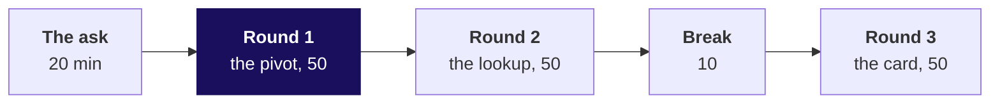
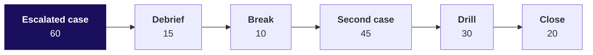

# Day sheet: Week 2, Friday. The number reaches the leadership deck

**TRAINER ONLY.** Nothing on this page reaches a learner.

Posts to <!-- sync:module:W02/D5 -->Module 1: Foundations of AI and Data<!-- /sync:module:W02/D5 -->, on <!-- sync:day-date:W02/D5 -->Fri 16 Oct 2026<!-- /sync:day-date:W02/D5 -->. No IITGN faculty block today.

| | |
|---|---|
| **Start from** | Thursday's customer table, exported as a CSV, and Monday's warehouse totals. Every Excel move lands on data the room built, so the pivot's numbers are already known and a wrong one is visible. |
| **Go as far as** | Every learner ships the three deliverables with a Checks tab, has watched a pivot double-count once and a lookup return a neighbour once, and can say the operating rule in three lines. |
| **Stop before** | Macros, Power Query, dashboards beyond the one card, financial modelling, the Data Model and distinct counts inside a PivotTable. Name each once if asked and park it. |
| **Comes later** | Build 1 on Monday asks for exactly this last mile on unfamiliar data in Kalpa Health. Week 4's metric design decides what goes on the front page. Saturday's recap paper comes first. |
| **Cut first** | The card's styling and the monthly trend chart (say the rule, skip the chart). Never cut the pivot double-count, the lookup trap or the operating rule. |

The tool the room holds is Excel. Notebooks run on the projector as the second way to a number; the
trainer demonstrates in Excel from the CSVs in `data/`. The day sheet's numbers were computed from the
exports on 29 September 2026 and every workbook number is proved by `xlsx_recalc.py`.

---

## Morning, 180 minutes

| Part | Slides (half one) | Beside it | What must land | If short of time |
|---|---|---|---|---|
| The ask, 20 | S1 to S5 | The board | The brief split into three deliverables; the answer b on S3 (Excel never cleans); the four silent lies drawn on the board and left up all day | S1's stats to one sentence |
| Round 1, 50 | S6 to S19 | Notebook 1; the guided file; Excel live | The room builds the clean pivot; the raw pivot shows Rs 39.41 crore and Retail-Core up 1.0 percent; Remove Duplicates leaves 1,400 rows; the first-row flag ties to Rs 19,84,00,000; the harder variant on S18 finds the gap | S9 to one sentence; never S12 to S16 |
| Round 2, 50 | S20 to S29 | Notebook 2; the deck pack's Protect tab | The protect list with its cut-off; C-0195 returns C-0194's row; the id read out in the room, on S28; the Mumbai foot at Rs 7,14,890 against Rs 1,56,790 | S21 to the stats alone |
| Break, 10 | After S29 | | | |
| Round 3, 50 | S30 to S40 | Notebook 3; the deck pack's FrontPage tab | The bare Rs 19.84 crore read as a doubled quarter; 29.4 percent with no base; the wrong base at 41.7 percent; the scope changed live | S36's trend table to a sentence |

**A round, minute by minute.** The question and its picture (5); the demonstration in Excel on
Kalpa's data (12 to 15); the trap and its wrong number, which the room produces on its own screens
before it is named (15 to 20); the harder variant, the round's unguided set of seven items (10); and
Kavya's review with one interview answer aloud (5).

---

## Afternoon, 180 minutes

| Part | Slides (half two) | Beside it | What must land | If short of time |
|---|---|---|---|---|
| Escalated case, 60 | S1 to S3 | `unguided/C2_W02_D05_escalated_STUDENT.md`; notebook ex1 | Alone, no hints: the tree tied to the warehouse, the list with an honest lookup and foot, the card with a scope, a Checks tab, and a release that holds the list | Part 5, the notebook, moves to tonight |
| Debrief, 15 | S4 to S6 | The deck pack's Checks tab | The room's own wrong numbers; the answer b on S5: the list is held until its source ties; name the gap and the member now (see the plant table) | S4 to the three wrong numbers the room actually produced |
| Break, 10 | After S6 | | | |
| Second case, 45 | S7 to S12 | `unguided/C2_W02_D05_director_STUDENT.md`; notebook ex2 | Yes to the question, no to the edit; the drift check; the what-if as a labelled input | The notebook to steps 1 and 4 |
| Interview drill, 30 | S13 and S14 | The answers below | Eleven questions in pairs, each answer under a minute, in the shape on S14 | Take the five row anchors only |
| Close, 20 | S15 to S18 | The Kahoot pack | Two learners' sentences checked; the crux lines once; Kahoot; Monday's question left open | S16 read, not discussed |

---

## The traps, with their exact wrong numbers

| Round | The plausible wrong number | The decision it would have misled | The check that catches it | The fix and what changed |
|---|---|---|---|---|
| 1 | Pivot on the raw export: Q1 Rs 19,94,36,150, Q2 Rs 19,46,59,340, Rs 39,40,95,490 in all; Retail-Core Rs 4,33,760 to Rs 4,38,160, up 1.0 percent | The deck carries Rs 19.47 crore for Q2 and calls Core healthy, so the growth plan leaves it alone | 1,450 rows against 1,000 order ids; the grand total against the warehouse's Rs 19,84,00,000 | Count each order once with the first-row flag: Rs 10,00,00,000 and Rs 9,84,00,000; Core falls 1.8 percent, Rs 3,73,070 to Rs 3,66,250 |
| 1 | After Remove Duplicates: 1,400 rows, Rs 39,40,57,740 | The analyst believes the export is clean and ships the double count | The total still does not tie; rows still outnumber orders | The same flag; Remove Duplicates removes only the 50 identical gateway copies |
| 2 | `VLOOKUP("C-0195", table, 5)`: C-0194's row, Rs 16,740, rank 15 | A retention offer to a member who has not bought in six months | The id returned against the id asked for; test with a known-missing id | `IFERROR(INDEX(..., MATCH(id, ids, 0)), "not in the table")`, or XLOOKUP with its fourth argument; the answer becomes "not in the table" |
| 2 | Protect list filtered to Mumbai, SUM at the foot: Rs 7,14,890 | Mumbai's retention budget sized 4.6 times too big | `SUBTOTAL(102, ...)` shows 11 visible against the 50 the foot adds | `SUBTOTAL(109, ...)`: Rs 1,56,790 for the 11 on screen |
| 3 | The card "Revenue Rs 19.84 crore" | A director reads a doubled quarter against Q1's Rs 10.00 crore | Read the card aloud: which months, against what | "Q2, July to September 2026: Rs 9.84 crore, down 1.6 percent on Q1, April to June 2026 (Rs 10.00 crore)" |
| 3 | "Retail-Plus revenue down 29.4 percent", and 41.7 percent on the wrong base | The room argues about a collapse in a segment worth 0.4 percent of the quarter | The rupee base, Rs 1.72 lakh, and the share, 0.4 percent; the change divided by Q1 | "Retail-Plus, Q2: Rs 4.13 lakh, down 29.4 percent on Q1 (Rs 5.86 lakh); 0.4 percent of company revenue" |

The decision tool's five tabs carry one planted formula defect each, the same traps in a form a
learner can fix: the Pivot difference compares the pivot with itself; the Lookup uses an approximate
match; the Visible total foot is SUM; the Front page change divides by the current period; the Rule
tests the room before Finance. It releases the rule only when all five are fixed.

---

## What is planted, and what the room should find

The discovery is the lesson, and naming a plant spends it. Nothing in any learner file names these.

| Planted | Where it is | What the room should do | If nobody finds it |
|---|---|---|---|
| The raw export at the payment grain: 400 instalment orders with two rows each (the largest invoices, so 186 of 188 Business orders) and 50 gateway retries posted twice (small Student and Retail-Core orders) | `data/C2_W02_D05_raw_export_STUDENT.csv`, 1,450 rows | Build the pivot, see Rs 39.41 crore, count rows against ids, try Remove Duplicates, then flag the first row per order | Ask for `=COUNTA` on the order ids and a distinct count. Do not say "instalments" first. |
| One member absent from the clean customer table: **C-0170**, Retail-Plus, 6 orders, Rs 21,740, who would rank **5th** on the protect list | The clean table sums to Rs 19,83,78,260 and 994 orders against the warehouse's Rs 19,84,00,000 and 1,000: Rs 21,740 and 6 orders short | On S18, reconcile the clean table and anti-join the raw export's ids against it | Ask for the two totals side by side, then "whose orders are they?" |
| The lookup trap on that member | An approximate match on **C-0170** returns **C-0169**: Retail-Plus, Hyderabad, Rs 8,580, **rank 50 of 50** | On S28, the head of Retail-Plus reads out C-0170 as "one of my best members"; the room runs both lookups and catches the neighbour because it reconciled | Read the approximate answer aloud as if it were right, then ask what C-0170 spent according to the raw export (Rs 21,740) |

The consequence to say aloud in the debrief: the protect list as exported is missing a top-five member,
and an approximate lookup would have told the chief of staff that member sits at the bottom of the list
on Rs 8,580. That is why the Checks tab holds the list.

**The take-home's own plants** (`data/C2_W02_D05_takehome_*`, seed 20261016): C-0172 is absent from the
clean table (Retail-Plus, 6 orders, Rs 14,740, would rank 20th); the raw export has the same payment
grain, with a different mix: Retail-Core reads up 3.6 percent in the hurried pivot and up 1.7 percent
counted once. Only this sheet names them.

---

## The day's numbers

| What | The number |
|---|---|
| Warehouse, Q1 and Q2 | Rs 10,00,00,000 and Rs 9,84,00,000, down 1.6 percent |
| Clean table | 300 customers, 994 orders, Rs 19,83,78,260 |
| Raw export | 1,450 rows, 1,000 orders; 550 orders on one row, 450 on two |
| Retail-Plus tree, Q1 to Q2 | Customers 91 to 76; orders per customer 2.36 to 1.84; revenue per order Rs 2,725 to Rs 2,953; revenue Rs 5,85,770 to Rs 4,13,380 |
| Protect list | 50 of 106 members, Rs 7,14,890; rank 1 C-0152 Rs 25,840; cut-off Rs 8,580; the 51st Rs 8,520 |
| Mumbai on the list | 11 members, Rs 1,56,790 |
| Consumer revenue by month, June to September | Rs 3.32 lakh, Rs 2.91 lakh, Rs 2.76 lakh, Rs 2.48 lakh |
| Scopes on the card | All segments down 1.6 percent; all except Business down 17.3 percent (Rs 9.86 lakh to Rs 8.15 lakh); Retail-Plus down 29.4 percent |
| The director's what-if | Rs 5,00,000 typed into Retail-Plus Q2 reads down 14.6 percent |

---

## Checkpoints, one learner each, under thirty seconds

After round 1: what is the grain of each export, and which check caught the double count? After round
2: which id do you test a lookup with first? After round 3: read the card aloud; which part would a
director ask about first? After the second case: what goes in the yellow cell, and what never does?

---

## The interview answers, in one breath

| Tag | Question | The answer in one breath |
|---|---|---|
| [S] | SQL, pandas or Excel: how do you choose? | By who must trust the number: what Finance audits is SQL in the warehouse, the analyst's daily iteration is pandas, and the room's last mile is Excel on an export nobody types over. |
| [S] | A stakeholder wants to poke the numbers; what do you give and never give? | A reconciled table with marked inputs, a lookup that says not found and a foot that follows the filter; never the source, a lookup that can answer wrong, or a number without its definition. |
| [F] | Your pivot differs from the warehouse; where do you look first? | The grain: rows against distinct keys; then the period and filters; then keys missing on either side. Here 1,450 rows for 1,000 orders took Rs 19.84 crore to Rs 39.41 crore. |
| [F] | How do you present one number so it is not misread? | With its period, its comparison and its base, and one sentence on what it means: Q2 Rs 9.84 crore, down 1.6 percent on Q1's Rs 10.00 crore, the fall in Retail-Plus frequency. |
| [D] | Two directors change assumptions and get different answers; what was right, what do you fix? | Right: assumptions are inputs and everything recomputes from one source. Fix: the card prints its scope, so down 1.6 and down 17.3 percent are never compared as one number. |
| [F] | A lookup returned a member for a missing id; which argument? | The match type: VLOOKUP's fourth argument left out means approximate; use an exact match with a not-found path and test with a missing id. |
| [F] | You filter and the total does not move; what is the foot? | SUM, which adds hidden rows; SUBTOTAL(109) adds what is on screen, Rs 1,56,790 for Mumbai against Rs 7,14,890. |
| [S] | Why does Remove Duplicates not fix a payment-grain export? | It removes identical rows only; instalment rows differ in the amount paid, so 1,400 rows remain and the total still doubles; count each order once by its key. |
| [F] | A director says revenue doubled; the card says Rs 19.84 crore; what is missing? | The period: it is two quarters; the card needs its months and its comparison. |
| [D] | A segment fell 29 percent and is 0.4 percent of revenue; front page? | Only with its base and share, and in the sentence rather than the headline, because the question is member frequency: Rs 1.72 lakh on a Rs 10 crore quarter. |
| [D] | A director wants to type over the source; what do you say and build? | Yes to the question as a labelled scenario beside the actual, no to the edit, and a drift check tying the sheet to the warehouse on every refresh. |

---

## The practice lab

The TA runs `exercises/practice/C2_W02_D05_lab_STUDENT.md` with `trainer/C2_W02_D05_lab_note_TRAINER.md`,
which says where learners stall on each problem and the one hint to give.

## Which file serves which moment

| Moment | File |
|---|---|
| Morning on the projector | `slides/C2_W02_D05_half1_STUDENT.pptx`, with Excel open on `data/` |
| Rounds 1 to 3, the second way | `notebooks/C2_W02_D05_01_pivot`, `02_lookup`, `03_front_page` |
| Round 1, mirrored | `exercises/guided/C2_W02_D05_pivot_together_STUDENT.md` |
| The director's changes, live | `demos/C2_W02_D05_deck_pack_STUDENT.xlsx` (yellow cells on Tree, Protect and FrontPage) |
| Early finishers | `demos/C2_W02_D05_decision_tool_STUDENT.xlsx` and `demos/C2_W02_D05_last_mile_STUDENT.html` |
| Afternoon on the projector | `slides/C2_W02_D05_half2_STUDENT.pptx` |
| Close | `kahoot/C2_W02_D05_quiz_STUDENT.md` |
| Tonight | `takehome/`, `preread/`, `study-notes/`, `cheatsheets/` |
| Rebuilding anything | The TRAINER scripts in `demos/`, each run from the repository root |
