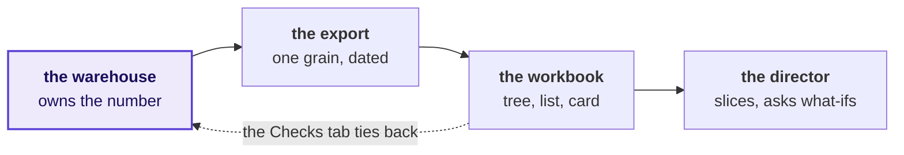
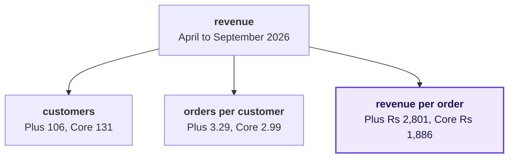
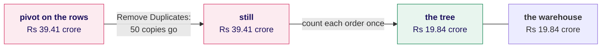
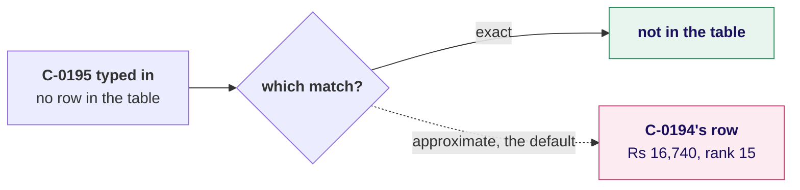
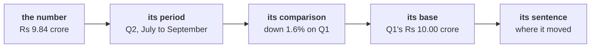
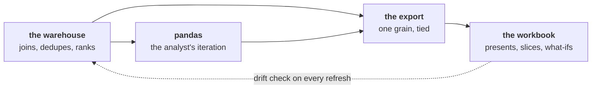
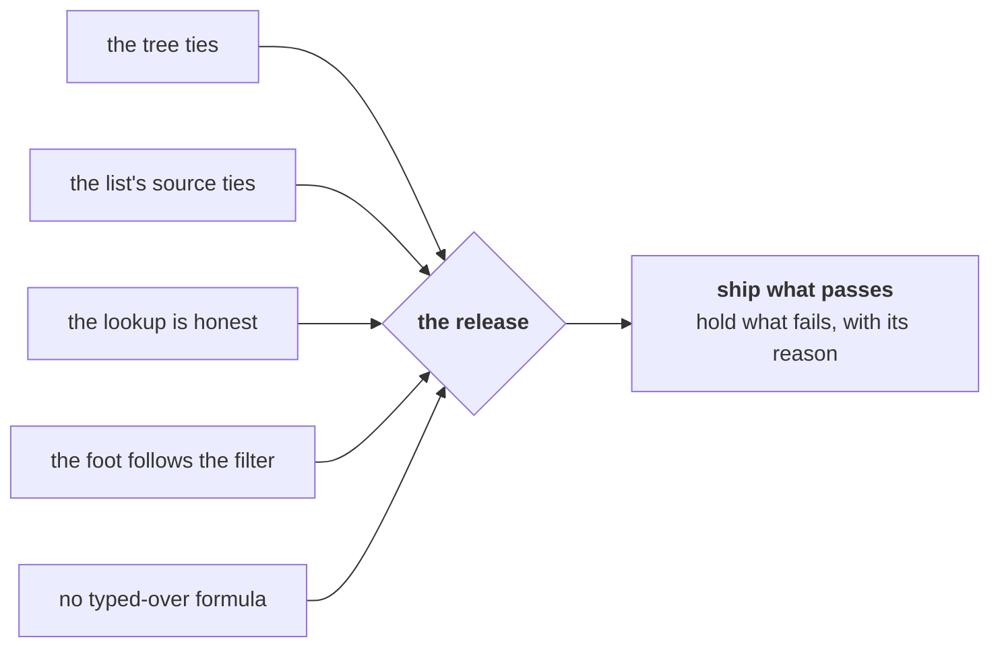
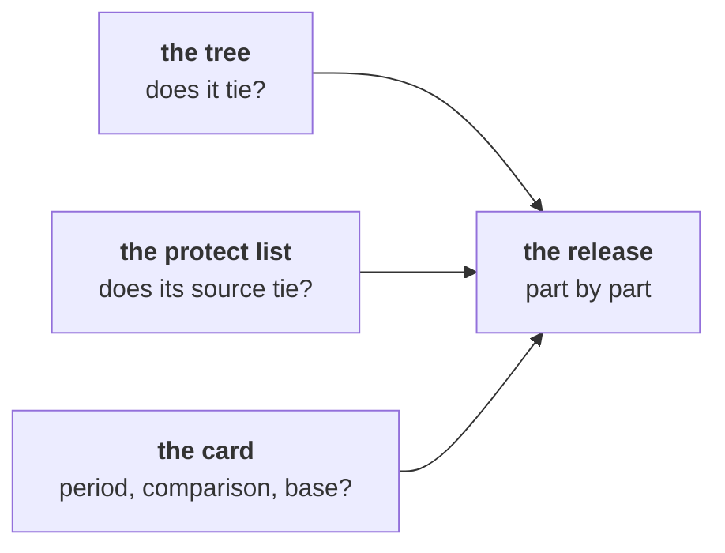
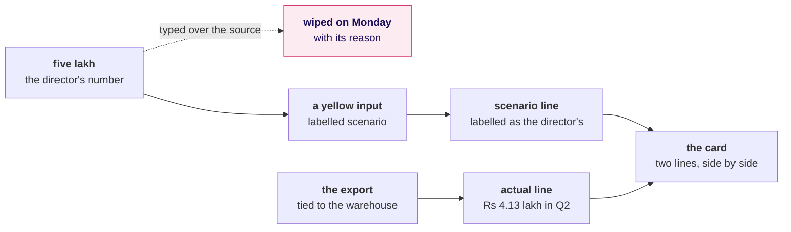

# Which drawings go up on the board, in order, to answer the chief of staff's question?

Meera's chief of staff wants three things for Monday's growth review that open without a login: the
revenue tree by segment for both quarters, the top-fifty protect list with a lookup, and one
front-page number with its trend, on a sheet that recalculates when a director changes an
assumption. The day's question is what a director can open, change in the room, and still trust.
Each drawing below goes up when its chapter starts and stays up until the day ends.

---

## Where can a number go wrong between the warehouse and a director?

Draw the four boxes during the ask, with a question under each of the last three: what one row of
the export stands for, which rows a total adds, and which months the director is reading. Add the
dashed arrow last, and point at the export first, since saying what one row stands for takes a
minute and rules out a whole family of wrong numbers.

---

## Which leaf separates Retail-Plus from Retail-Core, and does the tree multiply back?

Draw the tree with empty leaves and fill each one as the pivot gives it. Point at revenue per order,
48.5 percent higher for the paid tier, then write the averaged leaf under the tree, Business at
Rs 11,66,786 an order against Rs 10,45,740, and the multiply-back that catches it.

---

## Why does the pivot read nearly double, and what brings it back to the warehouse?

Write 1,450 rows against 1,000 order ids above the first box before drawing anything else, since
that count is the check. Point at the middle box, where Remove Duplicates barely moves the total,
and add the Retail-Plus row beside the tree: orders per customer from 2.36 to 1.84, and revenue down
29.4 percent.

---

## What does a lookup return for an id with no row?

Draw the id and the diamond first, and ask the room which exit the default takes before drawing
either. Point at the dashed exit, where a neighbour answers and nothing turns red, and write the
list's edge beside it: rank 50 at Rs 8,580, the fifty-first at Rs 8,520.

---

## What must sit beside the front-page number?

Write "Revenue Rs 19.84 crore" alone first and ask what a director reads in it, then build the chain
left to right. Point at the base: Retail-Plus's 29.4 percent is Rs 1.72 lakh on Rs 5.86 lakh, and
divided by Q2 it reads 41.7.

---

## Which tool owns which step, and what keeps the workbook in step?

Draw the warehouse first and write Tuesday's join under it, 1,000 orders to 1,428 payments. Point at
the dashed arrow: a lookup doing that join in the sheet said Rs 8.00 crore outstanding, and every
payment added leaves Rs 17,17,180 short.

---

## Which foot follows the filter, and what does the release hold?

Before the checks, write the Mumbai foot twice, SUM at Rs 7,14,890 and SUBTOTAL(109) at Rs 1,56,790
with 11 of 50 beside it. Then draw the five checks feeding one release, and point at the last box,
since the release reads the checks and nothing else.

---

## Which parts of Monday's file ship, and which wait?

Draw this during the escalated case's debrief, and let the room write ship or hold beside each part
from its own Checks tab.

---

## Where does the director's five lakh go?

Draw the dashed path first, the edit the director asked for, and ask the pairs what Monday's refresh
does to it. Then draw the yellow input and the two labelled lines, yes to the question and no to the
edit.

---

## What is on the board when the day ends?

The day's picture stays on the left, with each box's question answered in the room's words. Beside
it sit the tree with its leaves filled, the bridge from Rs 39.41 crore to Rs 19.84 crore, the
lookup's two exits with C-0195's exit ringed, the card's five parts, the three owners with the drift
check, the five checks feeding one release, each part of Monday's file marked ship or hold, and the
five lakh as a labelled line beside the actual. Photograph it before the room clears and revise from
it before Saturday's paper.
