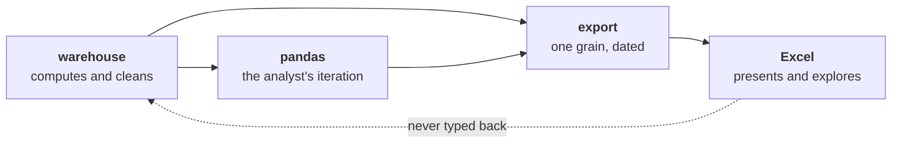
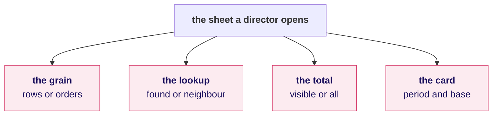
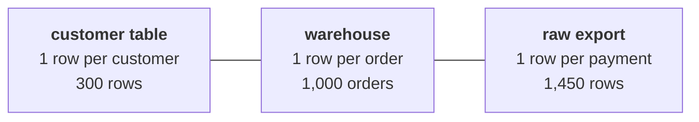
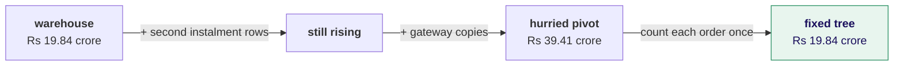
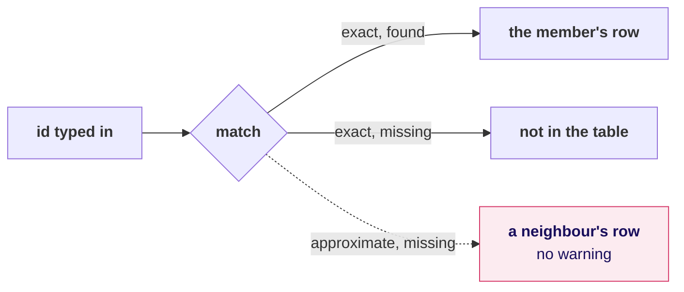
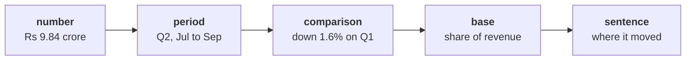
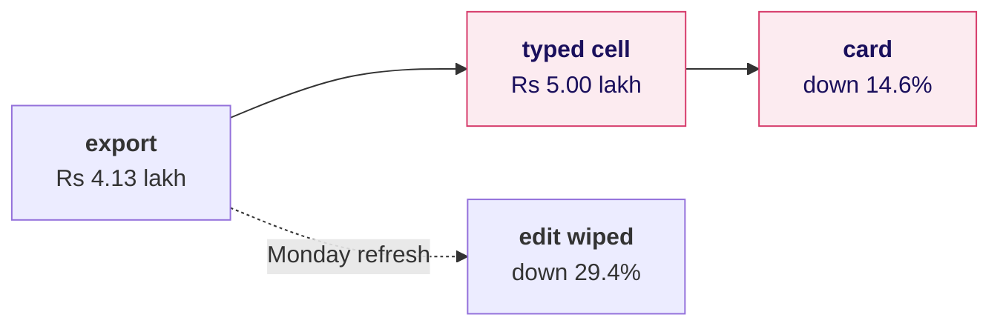

# The board, Week 2 Friday

The drawings in the order they go up. Each is small enough to draw in a minute and stays up until
the end of the day, so by the close the board holds the whole last mile.

---

## 1. Where Excel sits, drawn during the ask

The first drawing, and the one the afternoon's operating rule is read from.

## 2. Four places a sheet lies, drawn during the ask

Draw the four boxes in rose. Each turns green as its round fixes it.

## 3. Three grains, round 1

Write under it: a Sum adds one value per row, so the grain decides what it counts.

## 4. From the warehouse to the hurried pivot, round 1

Write the flag beside it: `=IF(COUNTIF($A$2:A2,A2)=1,1,0)`.

## 5. A lookup has two exits, round 2

## 6. The foot of a filtered list, round 2

| At the foot | Rows a filter hid | Rows hidden by hand | Mumbai, filtered |
|---|---|---|---|
| `SUM` | added | added | Rs 7,14,890 |
| `SUBTOTAL(109)` | left out | left out | Rs 1,56,790 |

## 7. The card, round 3

## 8. What a typed-over cell does, the second case

---

## On the board when the day ends

Drawing 2 with all four boxes green, drawing 1 with the dashed arrow crossed out, and the operating
rule in three lines beside them:

1. The warehouse owns the number.
2. pandas owns the iteration.
3. Excel owns the last mile, and nobody types over the source.
