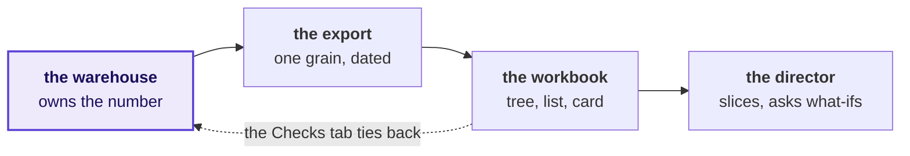
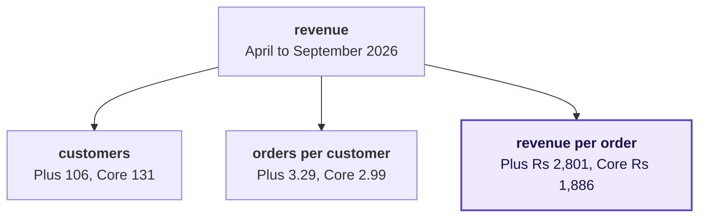
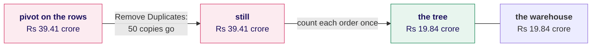
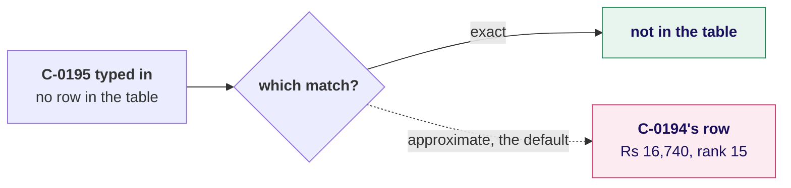
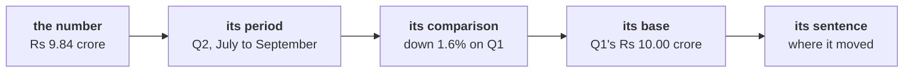
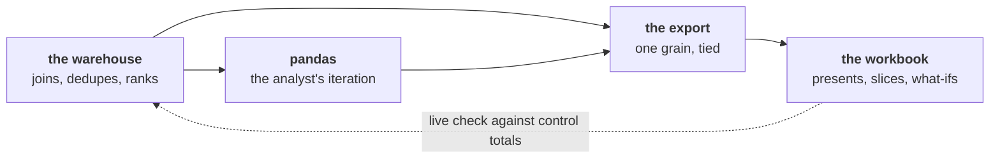
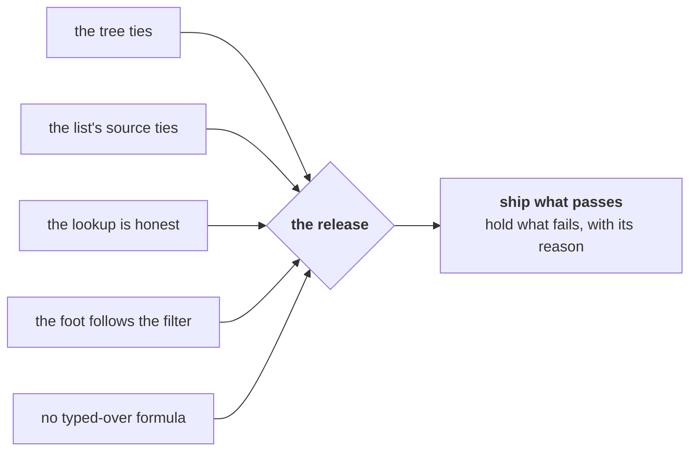
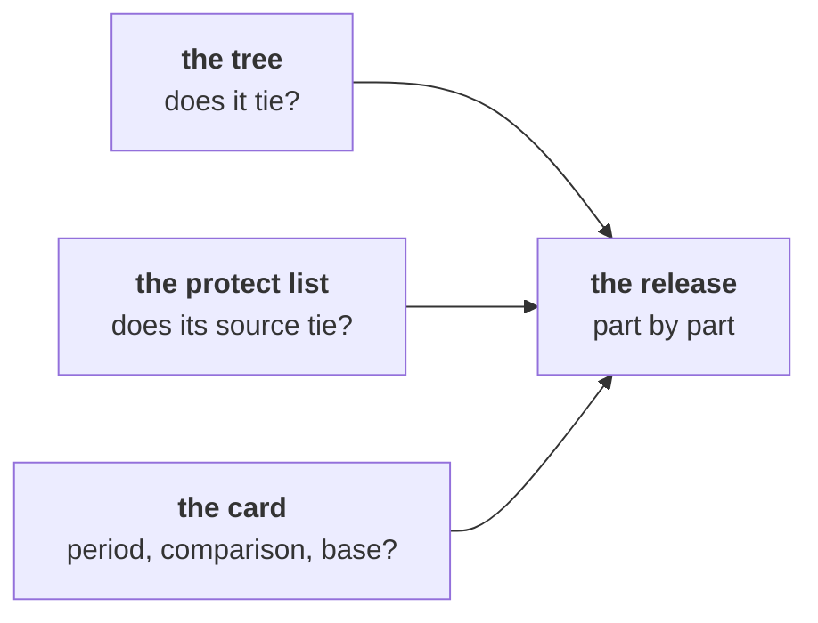
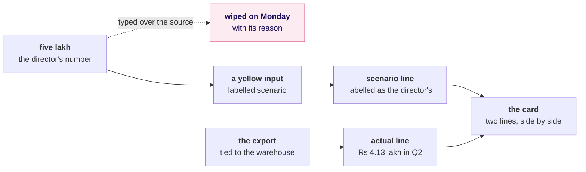

# Which drawings go up on the board, in order, to answer the chief of staff's question?

Week 2, Friday, Kalpa Retail. Meera's chief of staff wants three things for Monday's growth review
that open without a login: the revenue tree by segment for both quarters, the top-fifty protect list
with a lookup, and one front-page number with its trend, on a sheet that recalculates when a director
changes an assumption. The day asks what a director can open, change in the room, and still trust.
Nine drawings go up, one during the ask, one in each of the six chapters and one in each afternoon
case, and each stays up until the day ends.

---

## Where can a number go wrong between the warehouse and a director?

Drawing 1 goes up during the ask and is the day's picture, the same one the notes and the cheat sheet
open on. Every box after the warehouse can print a wrong number with no error, so each carries its
question: what one row of the export stands for, which rows a total in the workbook adds, and which
months the director is reading. The dashed arrow is the Checks tab tying every number back to the
warehouse. The export's question comes first, since saying what one row stands for takes a minute
and rules a whole family of wrong numbers in or out.

---

## Which leaf separates Retail-Plus from Retail-Core, and does the tree multiply back?

Drawing 2 goes up in chapter 1, its leaves filled one by one as the pivot gives them. Read across the
two tiers, the paid tier orders 10 percent more often and spends 48.5 percent more an order, so the
basket is the leaf that separates them. Under the tree sits the averaged leaf, Business at
Rs 11,66,786 an order against revenue over orders, Rs 10,45,740, and the multiply-back that catches
it, which lands Rs 2.28 crore above what Business sold.

---

## Why does the pivot read nearly double, and what brings it back to the warehouse?

Drawing 3 goes up in chapter 2, under the count that is its check: 1,450 rows against 1,000 order
ids. Read left to right, the pivot on the rows says Rs 39.41 crore, Remove Duplicates takes out only
the 50 identical gateway copies and barely moves it, and counting each order once brings the tree to
the warehouse's Rs 19.84 crore. The Retail-Plus row beside the tree shows where Q2 fell: orders per
customer from 2.36 to 1.84, and revenue down 29.4 percent.

---

## What does a lookup return for an id with no row?

Drawing 4 goes up in chapter 3, and its two exits answer the question. The solid exit is the exact
match, which says "not in the table". The dashed exit is the approximate match that VLOOKUP takes
when its fourth argument is left out, where a neighbour answers and nothing turns red. Beside it sits
the list's edge, rank 50 at Rs 8,580 and the fifty-first at Rs 8,520, so no tie crosses the line.

---

## What must sit beside the front-page number?

Drawing 5 goes up in chapter 4, after "Revenue Rs 19.84 crore" on its own has been read as up 98.4
percent. Read left to right, the chain gives the number its period, its comparison, its base and its
sentence. The base is the link a percentage loses most often: Retail-Plus's 29.4 percent is Rs 1.72
lakh on Rs 5.86 lakh, and divided by Q2 by mistake it reads 41.7.

---

## Which tool owns which step, and what keeps the workbook in step?

Drawing 6 goes up in chapter 5, with Tuesday's join written under the warehouse: 1,000 orders to
1,428 payment rows, 8 of which match no order. A lookup doing that join in the sheet said Rs 8.00
crore outstanding, and every payment added once leaves Rs 17,54,930 short, exactly the unpaid orders,
so the join stays in the warehouse. The dashed arrow is the drift check: the Checks tab compares the
workbook's totals, live, with the warehouse's control totals, which travel on a small tab beside each
export.

---

## Which foot follows the filter, and what does the release hold?

Drawing 7 goes up in chapter 6, under the Mumbai foot written twice: SUM at Rs 7,14,890, and
SUBTOTAL(109) at Rs 1,56,790 with 11 of 50 beside it. SUMIFS on the city, the second route, holds
Rs 1,56,790 when a row is also hidden by hand, where SUBTOTAL(109) drops to Rs 1,47,400. The five
checks feed one release, which reads the checks and nothing else.

---

## Which parts of Monday's file ship, and which wait?

Drawing 8 goes up in the escalated case's debrief. Each part of Monday's file is marked ship or hold
from the room's own Checks tab, and a part is held only when a check behind it fails.

---

## Where does the director's five lakh go?

Drawing 9 goes up in the second case. The dashed path is the edit the director asked for: typed over
the source, the five lakh is wiped by Monday's refresh, and its reason goes with it. The solid paths
keep it, as a yellow input feeding a scenario line labelled as the director's, beside the actual line
of Rs 4.13 lakh in Q2, and the card shows both.

---

## What is on the board when the day ends?

The day's picture stays on the left, with each box's question answered in the room's words. Beside
it sit the tree with its leaves filled, the bridge from Rs 39.41 crore to Rs 19.84 crore, the
lookup's two exits with C-0195's exit ringed, the card's five parts, the three owners with the live
drift check, the five checks feeding one release, each part of Monday's file marked ship or hold, and
the five lakh as a labelled line beside the actual. A photograph of it is a revision sheet for
Saturday's paper.
