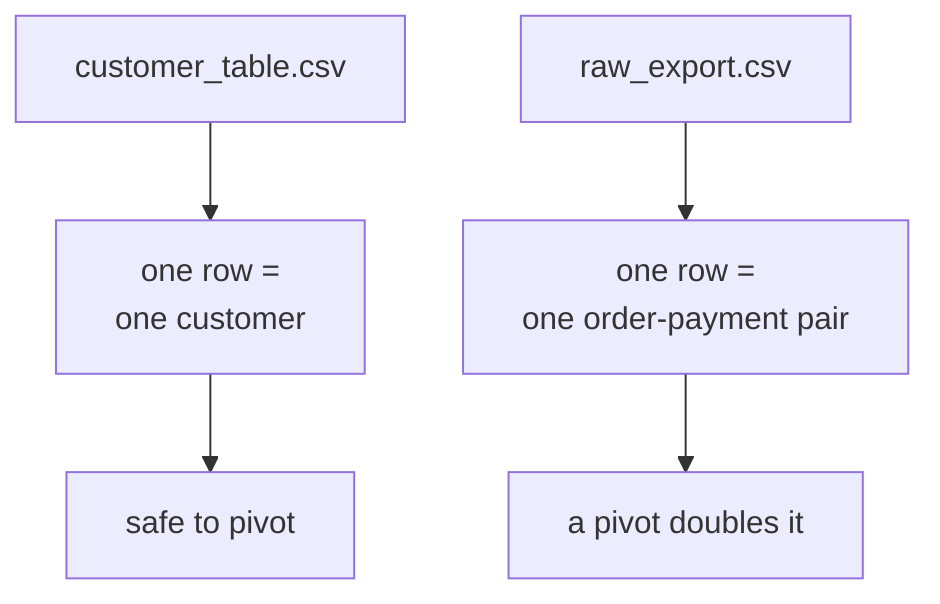
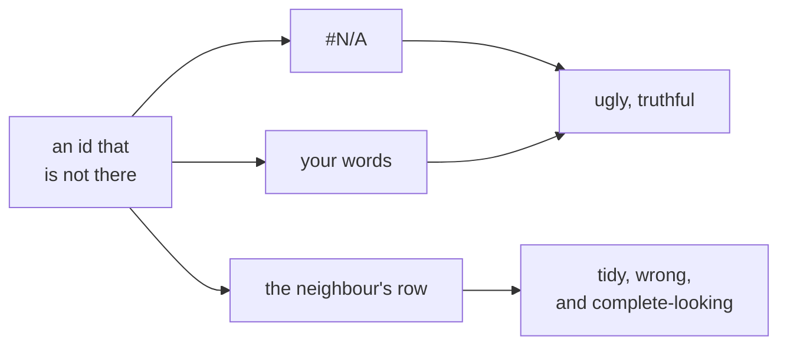

# The board work: grain, and the three lines that end the week

## Drawing one: what one row means

Before either export is opened, draw two file icons side by side and write under each what one row
of it means.



Then ask what in a file browser would tell you the difference. Nothing does. That is the point,
and it is why the grain goes in the filename or in the first sheet.

## Drawing two: the ten-second check

```
rows / distinct keys
```

Write it large. Anything above one and the file is not what its name suggests. Run it on both
exports live and let the room see 1.00 and 4.83.

This is the cheapest habit in the week and it survives into every job any of them takes.

## The failure to let happen

Build the pivot on the raw export in front of the room, thirty seconds of clicking, and read the
total out. It is roughly double what the warehouse says.

Ask what the pivot did wrong. Wait. The answer is that it did nothing wrong, and a room that gets
there on its own has learned the actual lesson rather than a rule about spreadsheets.

## Drawing three: where a lookup goes wrong



Spend a minute on the third branch. It returns a real name, a real spend and a real segment.
Nobody questions a row that looks complete, and that is the whole failure.

## The three lines that end the week

Write these and leave them up for the close.

```
Warehouse: the numbers Finance acts on.
pandas:    the analyst's own iteration.
Excel:     presentation, and a stakeholder poking at it.
```

Then add the fourth, and say it is the one people forget:

```
Whatever is in Excel must be rebuildable from the warehouse in one run.
```

Ask what happens the first time somebody corrects a cell by hand. Either the correction is lost on
the next rebuild, or it is kept and the sheet has quietly become a source of truth. Both are bad,
and nobody chose either.

## The last thing on the board

The bridge into Monday. Build 1 opens in Kalpa Health, a unit nobody in the room has seen.

```
The method transfers. The domain does not.
```
