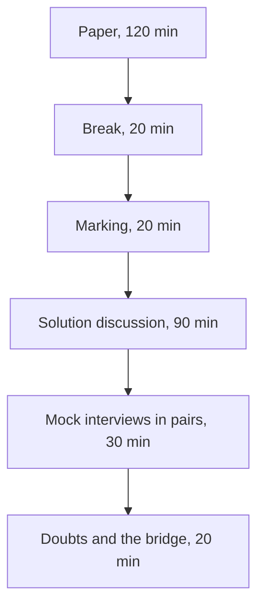

# Week 2 Saturday: the discussion guide

**TRAINER ONLY.** Led by the Academic TA. The paper the room sits is the Word file in `paper/`; the
key in `answer-key/` carries every item's key, tag, level, day, interview anchor, why the key holds,
why each wrong option fails, and the answers to the stretch page.

SQL carries more interview weight than any other analyst skill, so this is the heaviest paper of
the first month. The afternoon turns what the paper found into answers each learner can say aloud.

---

## The shape of the day



| Block | Duration | What happens |
|---|---|---|
| The paper | 120 min | Pen and paper, AI-free, no notes: 55 objective items in six parts, then the untimed stretch page for anyone who finishes early. |
| Break | 20 min | Papers stay face down on the desks. |
| Marking | 20 min | Papers swapped and marked against the key, read out by the Academic TA, and the ticks entered by seat in the item-analysis workbook. |
| The solution discussion | 90 min | The most-missed items first (35 min), then the ten anchors answered aloud as interview answers with random call-outs (50 min), and the step-one ratings set against the work (5 min). |
| The mock-interview round | 30 min | In pairs: each learner asks the other two anchors and one stretch follow-up, then they swap. |
| Doubts and the bridge | 20 min | Open doubts, then Monday: Build 1 opens in Kalpa Health. |

Three hundred minutes in all, with no new content anywhere in them.

---

## The paper, 120 minutes

Hand out the Word paper face down and start the time together. Step one on the first page comes
before any item: each learner rates the six parts from 1 to 4 on the answer sheet, as they are
today. Laptops closed and phones away for the whole sitting. Announce the time left at 60 minutes and at 15 minutes. Anyone who finishes
early turns to the stretch page, which is untimed and uncounted; its four follow-ups come back in
the mock-interview round, so a learner who writes them now has rehearsed, and the six one-line
recalls after them are the week's rules, moved off the timed paper.

## Marking, 20 minutes

1. Papers swap along the row, so nobody checks their own paper.
2. Read the key part by part from the key file: letters in runs of five, words and numbers one at a
   time, and each ordering item's sequence slowly, twice.
3. The marker ticks or crosses each item on the answer sheet, writes the count of ticks as Items
   right, and hands the paper back.
4. The key's rule settles the edge cases: every correct letter and no other on a more-than-one item,
   the number on an applied maths item, and the whole sequence on an ordering item. There is no
   partial credit, because the programme has set no rule for it.
5. The Academic TA enters each paper by seat in
   `answer-key/C2_W02_SAT_item_analysis_TRAINER.xlsx`, never by name: the ticks in the Marks
   sheet, 1 for a tick, 0 for a cross and a blank for an item left empty, and the six step-one
   ratings from the answer sheet in the Ratings sheet. Its Discussion sheet gives the most-missed
   order the discussion takes, and any item it flags goes to the tracker's owner with the room's
   rate, because the fault may sit in the item rather than in the room.

Say once, at the start, that the marker decides nothing: reading somebody else's answer against the
key is the exercise. The paper carries no marks and ranks nobody; the misses are counted by topic
only so that Monday's session knows what to revisit.

---

## The solution discussion, 90 minutes

### Most-missed first, 35 minutes

Take the order from the workbook's Discussion sheet: the five most-missed items, from the top. The
candidate list below says what each likely miss tests and the repair to listen for; an item outside
it that the sheet ranks higher takes its place. If the entry is not finished when the discussion
opens, read the list instead, ask for hands, and write the counts on the board. For each item, ask
"a cross on item 20?", call one person who crossed it to say what they wrote and why it looked
right, then ask the room for the repair before reading it. The key file's "Why each answer holds"
section has the reason behind every wrong option.

| Item | What it tests | The trap most papers fall into | The repair, said aloud |
|---|---|---|---|
| 20 and 27 | The join that multiplied money | Checking the rows, which all look fine | Compare the row count before and after the join first: fifty retried payments of Rs 2,000 turn Rs 20 lakh collected into a sum of Rs 21 lakh. |
| 53 | A date filter on a LEFT join | Reading the WHERE as if it sat in ON, or counting O-1 once | The WHERE runs after the join and drops O-2 and the unpaid O-3, and O-1's two instalments repeat it: 2 rows and Rs 2,400. The date belongs in ON, and the payments go to one row per order before the join. |
| 31 | A window that changes between runs | Blaming the cache or the database | Under a ROWS frame, ties in the window's ORDER BY leave the row order undefined, so the running total at the tied rows can differ between runs; Postgres's default RANGE frame gives tied rows one shared total instead. Either way, name a tiebreaker. |
| 22 | What a full outer join adds | Ticking the orders with two payments | Only rows with no partner on the other side are new: orders with no payment and payments with no order. |
| 32 | When GROUP BY runs out | Ticking each segment's total for the quarter | A rank within a segment, the previous month beside this one, and a running total with every row kept all need a window; a total per segment does not. |
| 36 to 38 | Ties in a top-N | Assuming a top-N always returns N rows | DENSE_RANK three or less returns five members in set 2, RANK fifty or less ships 51 rows on a tie at fifty, and only ROW_NUMBER returns exactly N, by breaking the tie arbitrarily unless a tiebreaker is named. |
| 49 | Where a fix belongs | Correcting the total in the pivot | The fix belongs in the merge: de-duplicate the exposure table on a stated rule and validate the keys, so the pivot is right without anyone typing over it. |
| 54 | The reach that lost its unreached | Counting the three customers with no segment as a group of their own | groupby drops a missing key by default, so the code reports 2 reached and 2 bought where 5 were reached: group from the full list or pass dropna=False, and check that the groups add back to the rows. |
| 16 | Logical order | Writing the clauses in the order they are typed | FROM, WHERE, GROUP BY, HAVING, SELECT, ORDER BY, which is why an alias works in ORDER BY and fails in WHERE. |
| 2 and 50 | NULL and integers | Writing 0 for LAG's first month, or 2 for the mean frequency | LAG has no previous row to read, so it returns NULL; 1,000 orders over 400 customers is 2.5, and Postgres returns 2 only when it divides two integers. |
| 52 | The average that skipped members | Picking 750, as if AVG counted a member with no Q2 order as zero | The CASE with no ELSE leaves NULL for the two members who bought nothing in Q2, and AVG divides by the values it can see, so the query reports Rs 1,500 flat where the honest figure is Rs 750. Write the zero with COALESCE, and put count(*) beside count(q2_spend). |

When a learner connects set 1's numbers to Tuesday's warehouse, discuss what the room found on
Tuesday and nothing more: the data's other contents stay unnamed.

### The anchors aloud, 50 minutes

Ask each anchor as an interviewer would: name the person, then the question, then wait. Give sixty
seconds. Ask the room for the one sentence that would make the answer stronger, and read the answer
below only if nobody gets there. Five minutes an anchor, with the bridge anchor last. The items under
each anchor descend from it.

#### 1. [S] WHERE against HAVING, one sentence each.

*Items 5 and 14, and Stretch 5.*

WHERE decides whether to keep one row, judged on that row alone, before any grouping exists. HAVING
decides whether to keep a whole group, judged on the group, after the grouping has happened. Listen
for the answer that says only "rows against aggregates": true, and it predicts nothing new, because
the timing is the answer.

#### 2. [S] INNER against LEFT join: what does each drop or keep?

*Items 6, 17, 22 and 53, and Stretch 8.*

An inner join keeps only the rows that find a partner, so an order with no payment disappears. A
left join keeps every row of the left table and fills the missing side with NULLs, so the unpaid
order stays, which is how Anand's unpaid orders are found: left join, then keep the rows where the
payment's key is NULL. Both can multiply rows, because each keeps every matching pair. The follow-up
to ask: what happens to that left join when a WHERE on the payments table is added? (Stretch 2.)

#### 3. [S] RANK, DENSE_RANK and ROW_NUMBER on a tie.

*Items 8, 28, 29 and 34 to 38.*

On a tie, RANK gives the tied rows the same rank and skips the next ones (1, 2, 2, 4), DENSE_RANK
gives the same rank without a gap (1, 2, 2, 3), and ROW_NUMBER gives every row its own number and
breaks the tie arbitrarily. The strong answer adds the business consequence: a top-50 report by RANK
can ship 51 names, and one by ROW_NUMBER can hand two analysts two different lists from the same data
unless a tiebreaker is named.

#### 4. [S] groupby in the split-apply-combine sentence.

*Items 10, 40, 50 and 54.*

groupby splits the rows by a key, applies a computation to each group, and combines the results into
one row per group: 1,000 orders belonging to 400 customers become a 400-row table, with a mean
frequency of 2.5 orders per customer. The follow-up to ask: the same ratio in SQL printed 2; why?
(Stretch 1.)

#### 5. [F] Your LEFT join grew the row count and revenue doubled; name the cause and the check.

*Items 7, 18 to 21 and 23 to 27.*

The cause is a key that repeats on the right side: some orders have more than one payment row, so
each of those orders appears once per payment and its amount is counted again. Neither table has to
hold a duplicate row for this to happen. The check is the row count before and after the join, then
a count of payment rows per order. Push until somebody says the duplication happened in the join,
then ask what that means for every row-level check: all of them pass.

#### 6. [F] Top-3 per segment: GROUP BY or a window, and why?

*Items 30 and 32, and Stretch 9.*

A window. GROUP BY collapses each segment to one row, so the members inside it are gone; a window
function ranks each member within its segment and keeps every row, and the top three are the rows
with rank three or less, with the tie rule chosen on purpose.

#### 7. [F] Which merge argument raises on duplicate keys, and which error?

*Items 3, 41, 44 and 47.*

validate, set to the relationship the merge must have, such as 'one_to_one' or 'many_to_one'. When
the keys break it, pandas raises MergeError: "Merge keys are not unique in right dataset; not a
one-to-one merge", before any number is produced. The error arrives at the merge, instead of a wrong
total arriving at the leadership deck.

#### 8. [F] A pivot's total disagrees with the warehouse; where do you look first?

*Items 11 and 46 to 49.*

Upstream of the pivot, at the merge that built its table: compare the row counts and look for
repeated keys. In set 3, 60 customers appear twice in the exposure table, so the merged table holds
1,060 rows and the pivot sums their revenue twice. The pivot did nothing wrong with the file it was
handed; the fix is in the merge. The follow-up to ask: what if the pivot is below the warehouse
instead? (Stretch 4, the pivot that averages.)

#### 9. [D] Same question, three tools: how do you choose, and defend one choice?

*Items 13, 42, 43 and 51.*

The number travels in one direction: the warehouse computes the source of truth, pandas carries the
analyst's iteration, and Excel presents it and lets a director explore. A KPI Finance will check
belongs in the warehouse, because it runs the same way every Monday and anyone can audit the query.
Defend one choice with a reason about who depends on the number, never with a preference for a tool.

#### 10. [D] Kalpa Health asks 'where does our growth come from'; say what stays the same in your method and what changes.

*No paper item; this anchor opens the bridge.*

What stays the same are habits: count before you total, name the denominator, say what one row
means, reconcile against the owner's books, and ask who owns the number. What changes is the entity
model, the vocabulary and the stakeholders. The failure to listen for is somebody reaching for
Retail's revenue tree in a diagnostics business without first asking what a sale is there.

### Running random call-outs without losing the room

| Do | Do not |
|---|---|
| Name the person, then the question, then wait | Ask the room and take the first hand |
| Give sixty seconds, and let the silence run | Rescue somebody at fifteen seconds |
| Take a wrong answer, write it on the board, and ask the room to repair it | Correct it yourself |
| Come back to the same person later with an easier one | Leave somebody who struggled sitting with it |

Call on somebody whose paper you have not read, so the call is genuinely cold, and when an answer is
wrong, take the next answer from somebody else before correcting it, so the room does the work.

### Ratings against the work, 5 minutes

Close the discussion on the workbook's Ratings sheet. Its table for the room sets each part's mean
step-one rating beside the part's right rate, and counts the seats that rated a part 3 or 4 and got
under half of it right. Read out the parts where confidence ran ahead of the work, by part and never
by seat, and say what that costs at work: a part rated high and answered badly is where a number
would have shipped wrong from somebody sure it was right. Those parts open Monday's revision.

---

## The mock-interview round, 30 minutes

Pair learners who sat apart during the paper. Each pair plays two rounds of twelve minutes, then the
room takes six minutes together.

| Part | Duration | What happens |
|---|---|---|
| Round one | 12 min | The interviewer picks two anchors from the ten and one follow-up from the stretch page, and asks them in that order. The candidate answers aloud with no paper. |
| Round two | 12 min | They swap seats. The new interviewer may not repeat an anchor the pair has already used. |
| Back to the room | 6 min | Two pairs say which question was hardest to answer aloud, and the Academic TA asks one of those questions to a third person, cold. |

The interviewer holds the key's "In the interview" lines and the stretch answers, and listens for
three things: the answer starts with the business consequence, it names a check with a number, and
it stops when the question is answered. After each question the interviewer gives one sentence of
feedback, and nothing else. The Academic TA walks the room and sits in on pairs that have gone quiet.

---

## Doubts and the bridge, 20 minutes

Take open doubts first, for about twelve minutes. Then close on Monday: Build 1 opens in Kalpa Health
with the Programme Head's online introduction, an unfamiliar unit, unfamiliar data, unfamiliar
stakeholders, and a group of four in place of a room. Anchor 10 is the question the whole build week
asks. End on the sentence, and put it on the board:

```
The method transfers. The domain does not.
```

---

## After the session

Collect the marked papers. The workbook's Tags sheet gives the room's rate per tag and per part,
and its Seats sheet each seat's rate per tag; with the key file's list of items by tag, level, day
and part, the tags show which kind of thinking slipped, and the days point at where each gap came
from. That count by topic is what is kept, and it goes to Monday's session so it knows what to
revisit.

Any item where more than half the papers gave the same wrong answer points at the teaching and
belongs in a follow-up issue for the build team. The paper carries no marks, ranks nobody, and is
never read out by name.
