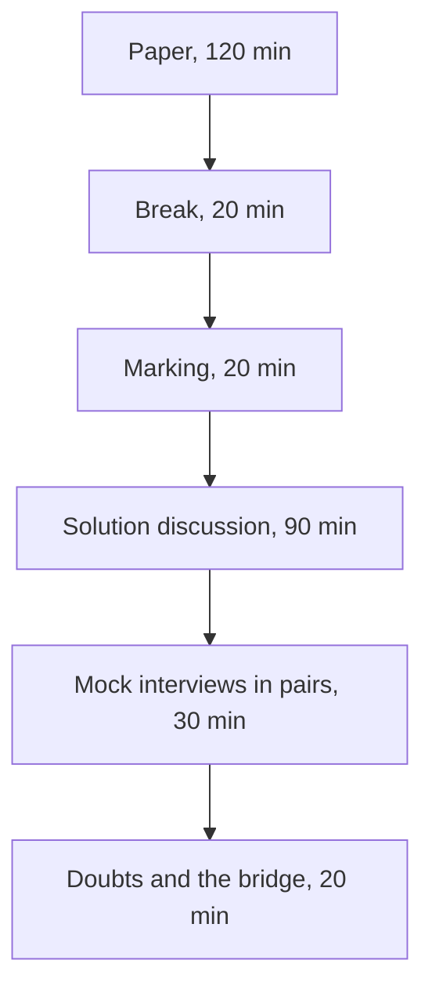

# Week 2 Saturday: the discussion guide

**TRAINER ONLY.** Led by the Academic TA. The paper the room sits is the Word file in `paper/`; the
key in `answer-key/` carries every item's key, tag, level, day, interview anchor, why the key holds,
why each wrong option fails, the bank items folded into each item, and the answers to the stretch
page.

Most of this paper reads SQL and pandas on Kalpa's own tables, the week's warehouse, payments feed,
customer table and exports. It is also the first paper whose items leave Kalpa: six items come from
public cases, and Part 6 imagines the tables an AI team keeps. The afternoon turns what the paper
found into answers each learner can say aloud.

---

## The shape of the day



| Block | Duration | What happens |
|---|---|---|
| The paper | 120 min | The room sits 33 items in six parts with pen and paper, no notes and no assistant, paced at 113 minutes, and anyone who finishes early turns to the untimed stretch page. |
| Break | 20 min | Papers stay face down on the desks. |
| Marking | 20 min | Learners swap papers and mark them against the key the Academic TA reads out, and the TA enters the ticks by seat in the item-analysis workbook. |
| The solution discussion | 90 min | The most-missed items come first (35 min), then the ten anchors are answered aloud as interview answers with random call-outs (50 min), and the step-one ratings are set against the work last (5 min). |
| The mock-interview round | 30 min | In pairs: each learner asks the other two anchors and one stretch follow-up, then they swap. |
| Doubts and the bridge | 20 min | Open doubts come first, then the bridge to Monday, when Build 1 opens in Kalpa Health. |

The day runs 300 minutes and teaches nothing new.

---

## The paper, 120 minutes

Hand out the Word paper face down and start the time together. Step one on the first page comes
before any item: each learner rates the six parts from 1 to 4 on the answer sheet, as they are
today. Laptops closed and phones away for the whole sitting. Announce the time left at 60 minutes
and at 15 minutes. Say once, before the start, that six items name real organisations in public
cases: every fact in them is on the page with its source, and Part 6's company and its tables are
invented, so nobody needs to know the organisations to answer. Anyone who finishes early turns to
the stretch page, which is untimed and uncounted; its four follow-ups come back in the
mock-interview round, so a learner who writes them now has rehearsed.

## Marking, 20 minutes

1. Papers swap along the row, so nobody checks their own paper.
2. Read the key part by part from the key file: letters in runs of five, the word-bank and match
   letters one at a time, numbers one at a time, and each ordering item's sequence slowly, twice.
3. The marker ticks or crosses each item on the answer sheet, writes each part's ticks in the box
   beside that part's rating and their total as Items right, out of 33, and hands the paper back,
   so each learner reads their rating against their score part by part.
4. The key's rule settles the edge cases: every correct letter and no other on the more-than-one
   item (Q11), the letter on a word-bank or match item (Q2, Q3 and Q21 to Q24), the answer on the
   four worked items, Q1, Q25, Q26 and Q27, with the working left to the discussion, and the whole
   sequence on the ordering item, Q8, whose sequence has five letters because one of its six steps
   is left out. There is no partial credit, because the programme has set no rule for it.
5. The Academic TA enters each paper by seat in
   `answer-key/C2_W02_SAT_item_analysis_TRAINER.xlsx`, never by name: the ticks in the Marks
   sheet, 1 for a tick, 0 for a cross and a blank for an item left empty, and the six step-one
   ratings from the answer sheet in the Ratings sheet. Its Discussion sheet gives the most-missed
   order the discussion takes, and any item it flags goes to the tracker's owner with the room's
   rate, because the fault may sit in the item rather than in the room.

Say once, at the start, that the marker decides nothing: reading somebody else's answer against the
key is the exercise. The paper carries no marks and ranks nobody; the misses are counted by topic
only so that Monday's session knows what to revisit.

---

## The solution discussion, 90 minutes

### Most-missed first, 35 minutes

Take the order from the workbook's Discussion sheet: the five most-missed items, from the top. The
candidate list below gives, for each likely miss, the wrong answer most papers will hold, the
question to put to the room before anyone reads the key, and the repair to listen for; an item
outside it that the sheet ranks higher takes its place. If the entry is not finished when the
discussion opens, read the list instead, ask for hands, and write the counts on the board. For each
item, ask "a cross on item 12?", call one person who crossed it to say what they wrote and why it
looked right, then put the question below to the room before reading the repair. The key file's
"Why each answer holds" section has the reason behind every wrong option.

| Item | What most papers get wrong | Ask the room | The repair, said aloud |
|---|---|---|---|
| Q12, the head's tie rule | Most mark (a), DENSE_RANK with 52, taking "I want them ranked the same" as the whole rule. | "Under DENSE_RANK, which member reaches rank 50, and what did that member spend?" | There are two ties: the one at place 48 compresses the dense numbers, so C-0259, on Rs 3,200, reaches dense rank 50 though it spent less than the fiftieth. RANK keeps the 51 members who spent at least Rs 3,350, the count each learner ran for the head on Wednesday, and ROW_NUMBER drops C-0242, who spent as much as the fiftieth. |
| Q15, LAG across a missing month | Most mark (a), 2 calls and none untrue, believing LAG steps back one calendar month. | "For C-0185's September row, which row does LAG(spend, 1) read?" | LAG reads the previous row, July for C-0185, so all four members are flagged. C-0185 and C-0216 placed no order in August, so two of the four calls tell a member something untrue; a calendar check keeps the two genuine falls. |
| Q28, a fan-out inside an evaluation | Most mark (a), 0.6, the accuracy on five tickets, which ships the model. | "How many rows does the merge return, and which tickets are on two of them?" | Seven: T3 and T5 carry two labels each and the model got both wrong, so the mean is 3 of 7, 0.43, and a model right on 3 of 5 is held back. Count rows before and after, or merge with validate='many_to_one'. |
| Q29, the latest run on the business's own tiebreak | Most mark (b) or (d), either of which promotes bot-b on 0.86. | "Runs are numbered in the order they start. Which of bot-b's two 9 September runs started later?" | Run 11, at 0.74, so bot-b's latest is below bot-a's 0.78 and bot-a stays. Ascending run_id picks run 10, and RANK returns both runs of 9 September; ROW_NUMBER by finished_on descending, then run_id descending, keeps the one the rule names. |
| Q32, peers in a running total | Most mark (b), call 3, reading one step per row. | "Calls 2 and 3 share a day. Which rows does the frame include for call 2?" | With ORDER BY day alone, calls 2 and 3 are peers and both read the day's close, 1200, so call 2 is routed although the total stood at 700 after it. Add call_id to the window's ORDER BY and each call gets its own step. |
| Q18, the exposure drop_duplicates keeps | Most mark (a), the 3 August send, reading first as earliest. | "Which date sits on C-0001's first row in Exhibit 4B?" | The step keeps the first row as the file lists it, and the tool sent 11 August first, so C-0001's order of 6 August goes uncredited to the sale. Sort by exposed_date from the earliest, then keep each customer's first row. |
| Q30, a HAVING that follows a WHERE | Most mark (a), bot-a and bot-b beside their low counts, which is the list the lead asked for. | "After WHERE runs, how many of bot-b's rows are left for HAVING to count?" | One: WHERE kept only the low ratings, so HAVING counts them and bot-b fails, and a model the lead asked for goes unretrained. The lead's question needs every reply counted in HAVING and the low ones counted with count(*) FILTER. |
| Q31, NOT IN against a list that holds a NULL | Most mark (a), 2, the answer NOT EXISTS gives, so the budget stays. | "Write out c1 NOT IN ('c2', 'c4', NULL) as three comparisons. What is the last one?" | c1 <> NULL is unknown, so the whole condition is unknown and every row drops: 0, and the product lead cuts the budget of an assistant that resolved half its conversations. Write the anti-join as NOT EXISTS or a LEFT JOIN with IS NULL. |
| Q8, the report's steps and the one that spoils it | Most keep step d, or sum the payment rows before the retries are dropped. | "Of the 216 orders with two payment rows, how many are gateway retries?" | Only 28; the other 188 are two instalments of one invoice, so step d throws away real cash. Drop each retry's second row by order and instalment, sum to one figure per order, join, check, then send: e, f, b, c, a. |
| Q9, a date filter on a LEFT JOIN | Most mark (d), 4 rows, reading the WHERE as if it sat in ON, or (c), keeping O-3 on its NULL date. | "O-3 has no payment. What is its paid_date after the join, and what does BETWEEN do with it?" | The WHERE runs after the join and drops O-2 and O-3, and O-1's two instalments repeat it: 2 rows, Rs 2,400. The date belongs in ON, with payments at one row per order first. |
| Q16, the quarter's path against its plan | Most mark (a), furthest ahead in the week of 20 July, or (b), reading each fortnight's bookings as the position. | "Subtract plan to date from booked to date at each reading. Where is the gap largest, and what is it in the week of 14 September?" | Read from the table, the lead is -0.25, 1.95, 2.17, 1.57, 0.73, 0.79 and 0.00 crore: furthest ahead in the week of 3 August, about Rs 0.8 crore ahead in the week of 14 September, and level at the close, because six of the seven full weeks from 10 August booked below the plan's Rs 75,69,230 a week. |
| Q17, the merge's rows and the guard that stops them | Most mark (b), 340 rows, since a left merge keeps the customer table's rows. | "How many rows does each of the six repeated customers bring out of the merge?" | Two each, so 346 rows, and the pivot reads Rs 45,800 over the book. validate='one_to_one' raises a MergeError before any number moves; drop_duplicates() finds nothing to drop, because the two sends differ in exposed_date. |
| Q1, integer division in a ratio | Most write that orders per member halved, from 2 to 1. | "Multiply 1 by the 76 members. Does it give the 140 orders?" | Two integer counts divide as integers, so the query prints 2 and 1; the true 2.36 and 1.84 are a fall of about 22 percent. Cast one side to numeric and multiply back before the number leaves. |
| Q6, a denominator that shrank | Most mark (a), 40 percent, dividing the gap by the calculated figure. | "Too high compared with what?" | The CASE with no ELSE leaves the two short viewers out of count, so 30 seconds over 3 people reads 10.0 against the defined 6.0 over all 5; the overstatement is measured on 6.0, about 67 percent, inside the 60 to 80 percent TechCrunch reported in 2016. |
| Q11, the count that sees a truncation | Most tick (a), rows loaded against the sheet. | "When was the sheet's row count taken, before the cut or after it?" | After it, so the sheet and the load agree at 65,535. Only the rows in the lab's own CSV, 70,900, and a stop at the format's limit of 65,535 data rows see Lab B's 5,365 missing rows. |
| Q26, a formula against its written definition | Most write 70 million dollars, inside the limit, trusting the sheet. | "Work row 2 by the documentation's definition, then by column D's formula. Why do they differ?" | Column D divides by the sum, twice the average, so every change comes out at half size: 0.130 against 0.261. A value at risk that moves with the changes should read 140 million, 20 million over the 120 million limit. |

When a learner connects Parts 2 to 4 to the week's warehouse, discuss what the room found in class
(the gateway retries, the unpaid orders, the tie at fiftieth, the members who fell, the re-sent
exposures) and nothing beyond it; the paper names those because the room has already found them.
When a learner asks about the real companies, keep to what each item's source reports and do not
add to it.

### The anchors aloud, 50 minutes

Ask each anchor as an interviewer would: name the person, then the question, then wait. Give sixty
seconds. Ask the room for the one sentence that would make the answer stronger, and read the answer
below only if nobody gets there. Five minutes an anchor, with the bridge anchor last. The items under
each anchor descend from it.

#### 1. [S] WHERE against HAVING, one sentence each.

*Item 30.*

WHERE decides whether to keep one row, judged on that row alone, before any grouping exists. HAVING
decides whether to keep a whole group, judged on the group, after the grouping has happened. Listen
for the answer that says only "rows against aggregates": it is true, and it cannot predict Q30,
which turns on when each clause runs. In Q30 HAVING runs after WHERE, so it counts only the low
ratings WHERE kept, and bot-b, with three replies in all, fails a test meant for its total and goes
unretrained.

#### 2. [S] INNER against LEFT join: what does each drop or keep?

*Items 4, 7, 9 and 31.*

An inner join keeps only the rows that find a partner, so an order with no payment disappears. A
left join keeps every row of the left table and fills the missing side with NULLs, so the unpaid
order stays, which is how Anand's unpaid orders are found: left join, then keep the rows where the
payment's key is NULL. Both can multiply rows, because each keeps every matching pair. The follow-ups
to ask: what does avg return over a left join when some members have no order? (Q4.) And what
happens to that left join when a WHERE on the payments table is added? (Q9.)

#### 3. [S] RANK, DENSE_RANK and ROW_NUMBER on a tie.

*Items 12, 29 and 32.*

On a tie, RANK gives the tied rows the same rank and skips the places they use (1, 2, 2, 4),
DENSE_RANK gives the same rank without a gap (1, 2, 2, 3), and ROW_NUMBER gives every row its own
number, breaking a tie by whatever else its ORDER BY names, or arbitrarily when nothing else is
named. The strong answer adds the business consequence: the Retail-Plus list ships 51 under RANK,
52 under DENSE_RANK and 50 under ROW_NUMBER; a ROW_NUMBER whose tiebreaker runs the wrong way
promotes a model on a run the business says is not its latest (Q29); and rows that tie on a
window's ORDER BY share one running total (Q32).

#### 4. [S] groupby in the split-apply-combine sentence.

*Items 14 and 19.*

groupby splits the rows by a key, applies a computation to each group, and combines the results into
one row per group. pivot_table is the same sentence with two keys, and its default apply step is the
mean, which is why M1's two June orders print as 2000.0 in Q19. A window is the other half of the
sentence: it computes over a group and keeps every row, which is how each member's share sits beside
the member in Q14. The follow-up to ask: which rows never reach a group at all? (A row whose key is
missing, which is the dropna default.)

#### 5. [F] Your LEFT join grew the row count and revenue doubled; name the cause and the check.

*Items 7, 8, 17, 20 and 28.*

The cause is a key that repeats on the right side: an order paid in two instalments, or a payment the
gateway posted twice, appears once per payment row, and its amount is counted again. Neither table
has to hold a duplicate row for this to happen. The check is the row count before and after the
join, then a count of payment rows per order, and the fix aggregates the many side to the join's
grain first. Push until somebody says the duplication happened in the join, then ask what it does to
an evaluation metric (Q28): the model's two misses count twice, and a model that should ship is held
back.

#### 6. [F] Top-3 per segment: GROUP BY or a window, and why?

*Items 13 and 14.*

A window answers it. GROUP BY collapses each segment to one row, so the members inside it are gone;
a window function ranks each member within its segment and keeps every row, and the top three are
the rows ranked three or better, filtered outside the window, with the tie rule chosen on purpose.

#### 7. [F] Which merge argument raises on duplicate keys, and which error?

*Items 17, 20 and 28.*

The argument is validate, set to the relationship the merge must have, such as 'one_to_one' or
'many_to_one'. When the keys break it, pandas raises MergeError, "Merge keys are not unique in right
dataset; not a one-to-one merge", before any number is produced. The follow-up to ask: what catches a key that
changed on its way in and so matches nothing? (indicator=True and a count of the matches, Q20.)

#### 8. [F] A pivot's total disagrees with the warehouse; where do you look first?

*Items 17, 18, 22, 23 and 25.*

Look upstream of the pivot, at the table it sums: compare the row count with the count of keys, then
the total with the warehouse's control total. In Set 2 six customers sit on two rows each, so the pivot
reads Rs 45,800 over the book; on Friday the raw export repeated every instalment order. A range
that stops short (Q25) fails the same check from the other side, and a feed kept in the order it
arrived (Q18) passes the count and fails the business's rule.

#### 9. [D] Same question, three tools: how do you choose, and defend one choice?

*Items 5, 20 and 26.*

The week's rule gives each tool its job: the warehouse owns the number and every join, dedupe and
rank Finance relies on, pandas owns the analyst's iteration, and the workbook owns the last mile,
where a director explores what the warehouse computed. A number Finance audits
belongs in the warehouse, because it runs the same way every Monday and anyone can audit the query,
and a chart that is none of the Monday figures, such as orders per member week by week, is
exploration and belongs in a notebook that reads the warehouse (Q5). Defend one choice with a reason
about who depends on the number, never with a preference for a tool, and name the second way that
would catch a wrong formula (Q26) or a key Excel changed on its way in (Q20).

#### 10. [D] Kalpa Health asks 'where does our growth come from'; say what stays the same in your method and what changes.

*No paper item; Parts 5 and 6 rehearse it, and this anchor opens the bridge.*

What stays the same are habits: count before you total, name the denominator, say what one row
means, reconcile against the owner's books, and ask who owns the number. The paper has already
carried them outside Kalpa, to a video metric, a public-health dashboard, a gene list, an economics
paper's spreadsheet, a bank's risk model, a driver's commission and an AI team's tables. What changes
is the entity model, the vocabulary and the stakeholders. The failure to listen for is somebody
reaching for Retail's revenue tree in a diagnostics business without first asking what a sale is
there.

### Running random call-outs without losing the room

| Do | Do not |
|---|---|
| Name the person, then the question, then wait | Ask the room and take the first hand |
| Give sixty seconds, and let the silence run | Rescue somebody at fifteen seconds |
| Take a wrong answer, write it on the board, and ask the room to repair it | Correct it yourself |
| Come back to the same person later with an easier one | Leave somebody who struggled sitting with it |

Call on somebody whose paper you have not read, so the call is genuinely cold, and when an answer is
wrong, take the next answer from somebody else before correcting it, so the room does the work.

### Ratings against the work, 5 minutes

Close the discussion on the workbook's Ratings sheet. Its table for the room sets each part's mean
step-one rating beside the part's right rate, and counts the seats that rated a part 3 or 4 and got
under half of it right. Read out the parts where confidence ran ahead of the work, by part and never
by seat, and say what that costs at work: a part rated high and answered badly is where a number
would have shipped wrong from somebody sure it was right. Those parts open Monday's revision.

---

## The mock-interview round, 30 minutes

Pair learners who sat apart during the paper. Each pair plays two rounds of twelve minutes, then the
room takes six minutes together.

| Part | Duration | What happens |
|---|---|---|
| Round one | 12 min | The interviewer picks two anchors from the ten and one follow-up from the stretch page, and asks them in that order. The candidate answers aloud with no paper. |
| Round two | 12 min | They swap seats. The new interviewer may not repeat an anchor the pair has already used. |
| Back to the room | 6 min | Two pairs say which question was hardest to answer aloud, and the Academic TA asks one of those questions to a third person, cold. |

The interviewer holds the key's "In the interview" lines and the stretch answers, and listens for
three things: the answer starts with the business consequence, it names a check with a number, and
it stops when the question is answered. After each question the interviewer gives one sentence of
feedback, and nothing else. The Academic TA walks the room and sits in on pairs that have gone quiet.

---

## Doubts and the bridge, 20 minutes

Take open doubts first, for about twelve minutes. Then close on Monday: Build 1 opens in Kalpa Health
with the Programme Head's online introduction, and each learner works in a group of four on a unit,
data and stakeholders none of them has seen. Anchor 10 is the question the whole build week asks.
End on the sentence, and put it on the board:

```
Build 1 brings the method to Kalpa Health, and its domain is learned there from the start.
```

---

## After the session

Collect the marked papers. The workbook's Tags sheet gives the room's rate per tag and per part,
and its Seats sheet each seat's rate per tag; with the key file's list of items by tag, level, day
and part, the tags show which kind of thinking slipped, and the days point at where each gap came
from. That count by topic is what is kept, and it goes to Monday's session so it knows what to
revisit.

Any item where more than half the papers gave the same wrong answer points at the teaching and
belongs in a follow-up issue for the build team. The paper carries no marks, ranks nobody, and is
never read out by name.
