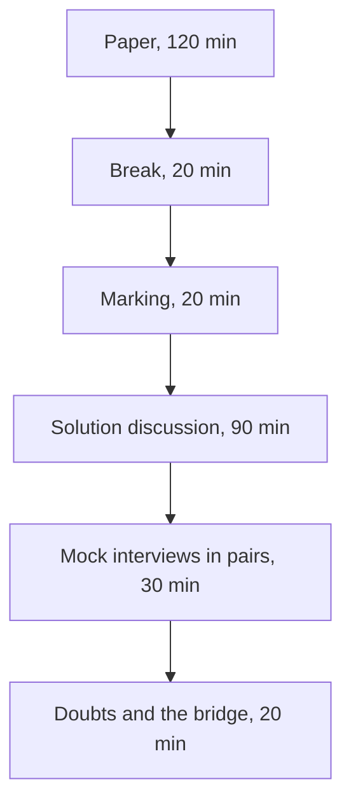

# Week 2 Saturday: the discussion guide

**TRAINER ONLY.** Led by the Academic TA. The paper the room sits is the Word file in `paper/`; the
key in `answer-key/` carries every item's key, tag, level, day, interview anchor, why the key holds,
why each wrong option fails, the bank items folded into each item, and the answers to the stretch
page.

SQL carries more interview weight than any other analyst skill, so this is the heaviest paper of
the first month. It is also the first paper whose items leave Kalpa: six items come from public
cases, and Part 6 imagines the tables an AI team keeps. The afternoon turns what the paper found into
answers each learner can say aloud.

---

## The shape of the day



| Block | Duration | What happens |
|---|---|---|
| The paper | 120 min | Pen and paper, AI-free, no notes: 35 items in six parts, paced at 117 minutes, then the untimed stretch page for anyone who finishes early. |
| Break | 20 min | Papers stay face down on the desks. |
| Marking | 20 min | Papers swapped and marked against the key, read out by the Academic TA, and the ticks entered by seat in the item-analysis workbook. |
| The solution discussion | 90 min | The most-missed items first (35 min), then the ten anchors answered aloud as interview answers with random call-outs (50 min), and the step-one ratings set against the work (5 min). |
| The mock-interview round | 30 min | In pairs: each learner asks the other two anchors and one stretch follow-up, then they swap. |
| Doubts and the bridge | 20 min | Open doubts, then Monday: Build 1 opens in Kalpa Health. |

Three hundred minutes in all, with no new content anywhere in them.

---

## The paper, 120 minutes

Hand out the Word paper face down and start the time together. Step one on the first page comes
before any item: each learner rates the six parts from 1 to 4 on the answer sheet, as they are
today. Laptops closed and phones away for the whole sitting. Announce the time left at 60 minutes
and at 15 minutes. Say once, before the start, that six items name real organisations in public
cases: every fact in them is on the page with its source, and Part 6's company and its tables are
invented, so nobody needs to know the organisations to answer. Anyone who finishes early turns to the stretch page,
which is untimed and uncounted; its four follow-ups come back in the mock-interview round, so a
learner who writes them now has rehearsed.

## Marking, 20 minutes

1. Papers swap along the row, so nobody checks their own paper.
2. Read the key part by part from the key file: letters in runs of five, the word-bank and match
   letters one at a time, numbers one at a time, and each ordering item's sequence slowly, twice.
3. The marker ticks or crosses each item on the answer sheet, writes each part's ticks in the box
   beside that part's rating and their total as Items right, out of 35, and hands the paper back,
   so each learner reads their rating against their score part by part.
4. The key's rule settles the edge cases: every correct letter and no other on a more-than-one item
   (Q11 and Q19), the letter on a word-bank or match item (Q3, Q4 and Q23 to Q26), the number on
   Q17 and the numbers on the three worked items, Q1, Q27 and Q29, with the working left to the
   discussion, and the whole sequence on an ordering item (Q2, and Q8, whose sequence has five
   letters because one step is left out). There is no partial credit, because the programme has set
   no rule for it.
5. The Academic TA enters each paper by seat in
   `answer-key/C2_W02_SAT_item_analysis_TRAINER.xlsx`, never by name: the ticks in the Marks
   sheet, 1 for a tick, 0 for a cross and a blank for an item left empty, and the six step-one
   ratings from the answer sheet in the Ratings sheet. Its Discussion sheet gives the most-missed
   order the discussion takes, and any item it flags goes to the tracker's owner with the room's
   rate, because the fault may sit in the item rather than in the room.

Say once, at the start, that the marker decides nothing: reading somebody else's answer against the
key is the exercise. The paper carries no marks and ranks nobody; the misses are counted by topic
only so that Monday's session knows what to revisit.

---

## The solution discussion, 90 minutes

### Most-missed first, 35 minutes

Take the order from the workbook's Discussion sheet: the five most-missed items, from the top. The
candidate list below says what each likely miss tests, the wrong answer most papers will hold, the
question to put to the room before anyone reads the key, and the repair to listen for; an item
outside it that the sheet ranks higher takes its place. If the entry is not finished when the
discussion opens, read the list instead, ask for hands, and write the counts on the board. For each
item, ask "a cross on item 12?", call one person who crossed it to say what they wrote and why it
looked right, then put the question below to the room before reading the repair. The key file's
"Why each answer holds" section has the reason behind every wrong option.

| Item | What it tests | The answer most papers will hold | Ask the room | The repair, said aloud |
|---|---|---|---|---|
| 12 | Counting what each tie rule ships | 51, 51 and 50, reading DENSE_RANK as RANK without the gap | "Read the dense ranks down Exhibit 3A. Where do they fail to climb?" | There are two ties: the one at 48 compresses the dense numbers, so C-0259 reaches 50 and DENSE_RANK ships 52. RANK ships 51 and ROW_NUMBER 50. |
| 15 | LAG across a missing month | 2 calls, both true, believing LAG steps back a calendar month | "For C-0185's September row, which row does LAG(spend, 1) read?" | LAG reads the previous row, July for C-0185, so all four members are flagged. C-0185 and C-0216 placed no order in August, so two of the four calls tell a member something untrue; a calendar check keeps the two genuine falls. |
| 10 | What leaves when one channel's bridge fails | Holding store's collected, the largest gap, or every channel's | "Work out each channel's gap. Which one does its unpaid list fail to explain?" | App and store close to the rupee, and web's gap runs Rs 21,750 past its list. Booked goes for every channel, collected goes for app and store, and web's waits, with the Rs 21,750 named with an owner and a time. |
| 8 | The order of a reconciliation, and the step that spoils it | Keeping step d, or summing before the repeats are dropped | "Of the 216 orders with two payment rows, how many are the gateway's repeats?" | Only 28; the other 188 are two instalments of one invoice, so step d throws away real cash. Drop the repeats by order and instalment, sum to one figure per order, join, check, then send: e, f, b, c, a. |
| 9 | A date filter on a LEFT join | 3 rows or 4, reading the WHERE as if it sat in ON | "O-3 has no payment. What is its paid_date after the join, and what does BETWEEN do with it?" | The WHERE runs after the join and drops O-2 and O-3, and O-1's two instalments repeat it: 2 rows, Rs 2,400. The date belongs in ON, with payments at one row per order first. |
| 16 | Reading a plan line | Well ahead of plan at the close | "At the last point, how far apart are the bar and the line?" | Both read Rs 9.84 crore at the close. The lead peaked at Rs 2.17 crore in early August and was given back, because six of the seven weeks from 10 August booked below the plan's Rs 75.69 lakh a week; the line carries the close and the trend. |
| 20 | Which step keeps each customer's first exposure | Keeping each customer's first row as the file lists it | "Which date sits on C-0001's first row in Exhibit 4B?" | The file is newest first, so that row is the 11 August send. Sort by exposed_date from the earliest, then keep each customer's first row: 130 rows, and the merge returns 340 with spend on the book. |
| 32 | A HAVING that follows a WHERE | bot-a 3 and bot-b 1, the lead's answer | "After WHERE runs, how many of bot-b's rows are left for HAVING to count?" | One: WHERE kept only the low ratings, so HAVING counts them and bot-b fails. The lead's question needs every reply counted in HAVING and the low ones counted with count(*) FILTER. |
| 33 | NOT IN against a list that holds a NULL | 2, the answer NOT EXISTS gives | "Write out c1 NOT IN ('c2', 'c4', NULL) as three comparisons. What is the last one?" | c1 <> NULL is unknown, so the whole condition is unknown and every row drops: 0. The review would call a working assistant useless. Write the anti-join as NOT EXISTS or a LEFT JOIN with IS NULL. |
| 1 | Integer division in a ratio | Halved, from 2 to 1 | "Multiply 1 by the 76 members. Does it give the 140 orders?" | Two integer counts divide as integers, so the query prints 2 and 1; the true 2.36 and 1.84 are a fall of about 22 percent. Cast one side to numeric and multiply back before the number leaves. |
| 6 | A denominator that shrank, and the base of a percentage | 40 percent, dividing the gap by the calculated figure | "Too high compared with what?" | The CASE with no ELSE leaves the two short viewers out of count, so 30 seconds over 3 people reads 10.0 against the defined 6.0 over all 5; the overstatement is measured on 6.0, about 67 percent, inside the 60 to 80 percent TechCrunch reported in 2016. |
| 31 | The latest row per key, repeatably | ROW_NUMBER on the date alone | "bot-b finished two runs on 9 September. Which one does your query keep tomorrow morning?" | ROW_NUMBER with the date alone picks one of the pair, so the board can show 0.86 one morning and 0.79 the next; ordering by finished_on descending, then run_id descending makes it repeatable. A GROUP BY with two max() calls invents a run. |
| 34 | Peers in a running total | 400, 700, 1200 and 1400, one step per row | "Calls 2 and 3 share a day. Which rows does the frame include for call 2?" | With ORDER BY day alone, calls 2 and 3 are peers and both read the day's close, 1200. Add call_id to the window's ORDER BY and each call gets its own step. |
| 11 | Which count sees a truncation | Ticking a, rows loaded against the sheet | "When was the sheet's row count taken, before the cut or after it?" | After it, so the sheet and the load agree at 65,535. Only the lab's own count of records, 70,900, and a stop at the format's limit of 65,535 data rows see Lab B's 5,365 missing records. |

When a learner connects Parts 2 to 4 to the week's warehouse, discuss what the room found in class
(the repeats, the unpaid orders, the tie at fiftieth, the members who fell) and nothing beyond it;
the paper names those because the room has already found them. When a learner asks about the real
companies, keep to what each item's source reports and do not add to it.

### The anchors aloud, 50 minutes

Ask each anchor as an interviewer would: name the person, then the question, then wait. Give sixty
seconds. Ask the room for the one sentence that would make the answer stronger, and read the answer
below only if nobody gets there. Five minutes an anchor, with the bridge anchor last. The items under
each anchor descend from it.

#### 1. [S] WHERE against HAVING, one sentence each.

*Items 2 and 32.*

WHERE decides whether to keep one row, judged on that row alone, before any grouping exists. HAVING
decides whether to keep a whole group, judged on the group, after the grouping has happened. Listen
for the answer that says only "rows against aggregates": true, and it predicts nothing new, because
the timing is the answer. Q32 is the proof: HAVING runs after WHERE, so it counts only the low
ratings WHERE kept, and bot-b, with three replies in all, fails a test meant for its total.

#### 2. [S] INNER against LEFT join: what does each drop or keep?

*Items 7, 9 and 33.*

An inner join keeps only the rows that find a partner, so an order with no payment disappears. A
left join keeps every row of the left table and fills the missing side with NULLs, so the unpaid
order stays, which is how Anand's unpaid orders are found: left join, then keep the rows where the
payment's key is NULL. Both can multiply rows, because each keeps every matching pair. The follow-up
to ask: what happens to that left join when a WHERE on the payments table is added? (Q9.)

#### 3. [S] RANK, DENSE_RANK and ROW_NUMBER on a tie.

*Items 12, 13, 31 and 34.*

On a tie, RANK gives the tied rows the same rank and skips the next ones (1, 2, 2, 4), DENSE_RANK
gives the same rank without a gap (1, 2, 2, 3), and ROW_NUMBER gives every row its own number and
breaks the tie arbitrarily. The strong answer adds the business consequence: the Retail-Plus list
ships 51 under RANK, 52 under DENSE_RANK and 50 under ROW_NUMBER, and a ROW_NUMBER with no
tiebreaker can hand two mornings two different leaderboards (Q31).

#### 4. [S] groupby in the split-apply-combine sentence.

*Items 21 and 30.*

groupby splits the rows by a key, applies a computation to each group, and combines the results into
one row per group. pivot_table is the same sentence with two keys, and its default apply step is the
mean, which is why M1's two June orders print as 2000.0 in Q21. The follow-up to ask: which rows
never reach a group at all? (A row whose key is missing, which is the dropna default.)

#### 5. [F] Your LEFT join grew the row count and revenue doubled; name the cause and the check.

*Items 7, 8 and 30.*

The cause is a key that repeats on the right side: an order paid in two instalments, or a payment the
gateway posted twice, appears once per payment row, and its amount is counted again. Neither table
has to hold a duplicate row for this to happen. The check is the row count before and after the
join, then a count of payment rows per order, and the fix aggregates the many side to the join's
grain first. Push until somebody says the duplication happened in the join, then ask what it does to
an evaluation metric (Q30): the model's two misses count twice.

#### 6. [F] Top-3 per segment: GROUP BY or a window, and why?

*Item 14.*

A window. GROUP BY collapses each segment to one row, so the members inside it are gone; a window
function ranks each member within its segment and keeps every row, and the top three are the rows
with rank three or less, filtered outside the window, with the tie rule chosen on purpose.

#### 7. [F] Which merge argument raises on duplicate keys, and which error?

*Items 17, 19, 20 and 22.*

validate, set to the relationship the merge must have, such as 'one_to_one' or 'many_to_one'. When
the keys break it, pandas raises MergeError: "Merge keys are not unique in right dataset; not a
one-to-one merge", before any number is produced. The follow-up to ask: what catches a key that
changed on its way in and so matches nothing? (indicator=True and a count of the matches, Q22.)

#### 8. [F] A pivot's total disagrees with the warehouse; where do you look first?

*Items 18, 24, 25 and 27.*

Upstream of the pivot, at the table it sums: compare the row count with the count of keys, then the
total with the warehouse's control total. In Set 3 six customers sit on two rows each, so the pivot
reads Rs 45,800 over the book; on Friday the raw export repeated every instalment order. A range
that stops short (Q27) fails the same check from the other side.

#### 9. [D] Same question, three tools: how do you choose, and defend one choice?

*Items 5, 26 and 28.*

The number travels in one direction: the warehouse computes the source of truth, pandas carries the
analyst's iteration, and Excel presents it and lets a director explore. A number Finance audits
belongs in the warehouse, because it runs the same way every Monday and anyone can audit the query,
and a first look at a question belongs in a notebook that reads the warehouse, since it reports
nothing (Q5). Defend one choice with a reason about who depends on the number, never with a
preference for a tool, and name the second way that would catch a wrong formula (Q28).

#### 10. [D] Kalpa Health asks 'where does our growth come from'; say what stays the same in your method and what changes.

*No paper item; Parts 5 and 6 rehearse it, and this anchor opens the bridge.*

What stays the same are habits: count before you total, name the denominator, say what one row
means, reconcile against the owner's books, and ask who owns the number. The paper has already
carried them outside Kalpa, to a video metric, a public-health dashboard, a gene list, an economics
paper's spreadsheet, a bank's risk model, a ride's fare and an AI team's tables. What changes is the entity model, the vocabulary and the
stakeholders. The failure to listen for is somebody reaching for Retail's revenue tree in a
diagnostics business without first asking what a sale is there.

### Running random call-outs without losing the room

| Do | Do not |
|---|---|
| Name the person, then the question, then wait | Ask the room and take the first hand |
| Give sixty seconds, and let the silence run | Rescue somebody at fifteen seconds |
| Take a wrong answer, write it on the board, and ask the room to repair it | Correct it yourself |
| Come back to the same person later with an easier one | Leave somebody who struggled sitting with it |

Call on somebody whose paper you have not read, so the call is genuinely cold, and when an answer is
wrong, take the next answer from somebody else before correcting it, so the room does the work.

### Ratings against the work, 5 minutes

Close the discussion on the workbook's Ratings sheet. Its table for the room sets each part's mean
step-one rating beside the part's right rate, and counts the seats that rated a part 3 or 4 and got
under half of it right. Read out the parts where confidence ran ahead of the work, by part and never
by seat, and say what that costs at work: a part rated high and answered badly is where a number
would have shipped wrong from somebody sure it was right. Those parts open Monday's revision.

---

## The mock-interview round, 30 minutes

Pair learners who sat apart during the paper. Each pair plays two rounds of twelve minutes, then the
room takes six minutes together.

| Part | Duration | What happens |
|---|---|---|
| Round one | 12 min | The interviewer picks two anchors from the ten and one follow-up from the stretch page, and asks them in that order. The candidate answers aloud with no paper. |
| Round two | 12 min | They swap seats. The new interviewer may not repeat an anchor the pair has already used. |
| Back to the room | 6 min | Two pairs say which question was hardest to answer aloud, and the Academic TA asks one of those questions to a third person, cold. |

The interviewer holds the key's "In the interview" lines and the stretch answers, and listens for
three things: the answer starts with the business consequence, it names a check with a number, and
it stops when the question is answered. After each question the interviewer gives one sentence of
feedback, and nothing else. The Academic TA walks the room and sits in on pairs that have gone quiet.

---

## Doubts and the bridge, 20 minutes

Take open doubts first, for about twelve minutes. Then close on Monday: Build 1 opens in Kalpa Health
with the Programme Head's online introduction, an unfamiliar unit, unfamiliar data, unfamiliar
stakeholders, and a group of four in place of a room. Anchor 10 is the question the whole build week
asks. End on the sentence, and put it on the board:

```
The method transfers. The domain does not.
```

---

## After the session

Collect the marked papers. The workbook's Tags sheet gives the room's rate per tag and per part,
and its Seats sheet each seat's rate per tag; with the key file's list of items by tag, level, day
and part, the tags show which kind of thinking slipped, and the days point at where each gap came
from. That count by topic is what is kept, and it goes to Monday's session so it knows what to
revisit.

Any item where more than half the papers gave the same wrong answer points at the teaching and
belongs in a follow-up issue for the build team. The paper carries no marks, ranks nobody, and is
never read out by name.
