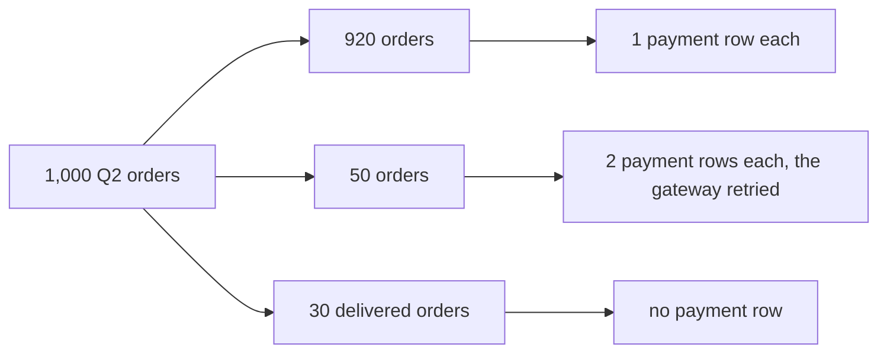
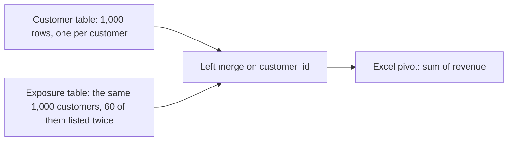

# Week 2 recap paper

Saturday 17 October 2026 · 120 minutes · 55 items in 6 parts · pen and paper, no assistant, no notes

Name: ____________________    Marked by: ____________________    Items right: ____ of 55

## How this paper works

- 120 minutes in one sitting. Each part gives its minutes as a guide, not a limit.
- Every item names its format beside its number: circle one letter, circle every correct letter, write T or F, write the word or number, show the working, or write the letters in order.
- Every item also names its level, easy, medium or hard, so you can plan your time. A hard item is several steps on an exhibit, never an obscure fact.
- A wrong answer costs nothing, so answer every item on the line under it.
- Pen and this paper only: no laptop, no phone, no notes and no assistant.
- Afterwards the papers are swapped and marked against the key, and the discussion takes the items the room missed most. The paper is ungraded and ranks nobody; the room's scores by topic set Monday's revision.

## The paper at a glance

| Part | What it shows | Items | Minutes | Easy | Medium | Hard |
|---|---|---|---|---|---|---|
| 1. The week's rules, cold | whether the week's definitions and rules are there without a notebook open | Q1 to Q11 (11) | 11 | 4 | 6 | 1 |
| 2. Asking the warehouse | whether you can write a grouped query in the order the database runs it | Q12 to Q16 (5) | 13 | 2 | 3 | 0 |
| 3. Joins that keep their rows | whether you read the row count before and after a join and catch a join that inflates a sum | Q17 to Q27 (11) | 27 | 1 | 8 | 2 |
| 4. Windows: rank, lag and running totals | whether you can rank within a segment, compare a month with the one before it and keep a running total | Q28 to Q39 (12) | 31 | 1 | 5 | 6 |
| 5. pandas and the last mile to Excel | whether you can merge, group and reshape without losing or doubling rows, and choose the tool for each job | Q40 to Q51 (12) | 29.5 | 0 | 11 | 1 |
| 6. Read the code, read the data | whether you catch a wrong number in a query or a few lines of pandas before it reaches a decision | Q52 to Q55 (4) | 8.5 | 0 | 1 | 3 |
| Total | | 55 | 120 | 8 | 34 | 13 |

---

## Part 1. The week's rules, cold (Q1 to Q11)

*What it shows: whether the week's definitions and rules are there without a notebook open. 11 items, about 11 minutes.*

Anand ends the week asking what he always asks: "Do your numbers match my books, and can my analyst audit how you got them?" Each item below is one of the rules your answer rests on.

#### Q1 · Medium · write the word or number

Orders with no payment are found with a LEFT JOIN to payments and a filter where the payment key IS ____.

Answer: ____________________

#### Q2 · Medium · write the word or number

On the first month of each customer, LAG(spend) returns ____.

Answer: ____________________

#### Q3 · Medium · write the word or number

In pandas, merge(..., validate='one_to_one') raises a ____ when a key repeats.

Answer: ____________________

#### Q4 · Easy · write T or F

In the logical order of a query, SELECT is evaluated before WHERE.

Answer: ____________________

#### Q5 · Medium · write T or F

WHERE COUNT(*) > 5 is valid SQL for filtering groups.

Answer: ____________________

#### Q6 · Easy · write T or F

An INNER JOIN between orders and payments silently drops the orders that were never paid.

Answer: ____________________

#### Q7 · Medium · write T or F

A join can inflate a SUM while every individual row still looks plausible.

Answer: ____________________

#### Q8 · Hard · write T or F

RANK and DENSE_RANK give different results only when there are ties.

Answer: ____________________

#### Q9 · Medium · write T or F

A window function can be used directly inside a WHERE clause.

Answer: ____________________

#### Q10 · Easy · write T or F

groupby followed by agg returns one row for each group.

Answer: ____________________

#### Q11 · Easy · write T or F

A pivot table built on an export that still contains duplicate rows reports the correct total.

Answer: ____________________

---

## Part 2. Asking the warehouse (Q12 to Q16)

*What it shows: whether you can write a grouped query in the order the database runs it. 5 items, about 13 minutes.*

The data platform lead grants read access to the warehouse with one warning: "Query it; do not export it." These items ask how a query filters, groups and orders what it reads.

#### Q12 · Easy · circle one letter

Which clause runs first in the logical order of a query?

a) SELECT
b) FROM
c) WHERE
d) ORDER BY

#### Q13 · Medium · circle one letter

Why should Finance's Monday number be computed in the warehouse and not in a notebook?

a) The warehouse hides the raw data from Finance, which keeps the number from being disputed.
b) A notebook cannot hold a full quarter of orders, so its totals are always approximate.
c) SQL is faster than Python on every task, so the number arrives sooner each Monday.
d) The query runs unchanged each week against the source, and every line can be audited.

#### Q14 · Medium · circle every correct letter

Which statements about WHERE and HAVING are correct? Mark every correct option.

a) WHERE filters rows before grouping.
b) HAVING filters groups after aggregation.
c) HAVING can compare COUNT(*) with a number.
d) WHERE can compare COUNT(*) with a number.

#### Q15 · Easy · show the working, then the answer

A table has 4 segments and 2 quarters, and every combination has orders. How many rows does GROUP BY segment, quarter return?

Working:

Answer: ____________________

#### Q16 · Medium · write the letters in order

Put the clauses in their logical execution order.

a) SELECT
b) WHERE
c) FROM
d) ORDER BY
e) GROUP BY
f) HAVING

Order: ____________________

---

## Part 3. Joins that keep their rows (Q17 to Q27)

*What it shows: whether you read the row count before and after a join and catch a join that inflates a sum. 11 items, about 27 minutes.*

Anand asks: "Show me, order by order, what we actually collected against what we booked in Q2. If there is a gap, I want to know which orders and which channel."

#### Q17 · Easy · circle one letter

Which join returns only the orders that have at least one payment?

a) LEFT JOIN
b) FULL OUTER JOIN
c) INNER JOIN
d) CROSS JOIN

#### Q18 · Medium · circle one letter

After a LEFT JOIN from orders to payments, the row count rose from 1,000 to 1,050. What is the likeliest cause?

a) The payments table is empty.
b) Some orders have no payment.
c) The join kept the unpaid orders as extra rows.
d) Some orders have more than one payment row.

#### Q19 · Medium · circle one letter

Which query lists the orders that were paid twice?

a) SELECT order_id FROM payments GROUP BY order_id HAVING COUNT(*) > 1
b) SELECT DISTINCT order_id FROM payments ORDER BY order_id
c) SELECT order_id FROM payments ORDER BY order_id
d) SELECT order_id FROM payments WHERE COUNT(order_id) > 1 GROUP BY order_id

#### Q20 · Hard · circle one letter

Collected revenue doubled after a join and every row looks fine. What is the first check?

a) Rerun the query at a quieter hour, in case the warehouse returned a partial result.
b) Round the amounts to whole rupees, because decimals accumulate across many rows.
c) Switch to an INNER JOIN, because a LEFT JOIN is what creates the extra rows.
d) Compare the row count before and after the join, and count payments per order.

#### Q21 · Medium · circle every correct letter

A LEFT JOIN from 1,000 orders to payments returns 1,050 rows. Which checks belong in the validation? Mark every correct option.

a) the row count before and after the join
b) payments per order, with GROUP BY and HAVING COUNT(*) > 1
c) booked revenue before and after the join
d) the number of channels before and after the join

#### Q22 · Hard · circle every correct letter

Which rows can appear in a FULL OUTER JOIN of orders and payments and never in an INNER JOIN? Mark every correct option.

a) orders with no payment
b) payments with no order
c) orders with exactly one payment
d) orders with two payments

### Set 1

**Situation.** The warehouse holds 1,000 Q2 orders. 920 orders have one payment row. 50 orders have two payment rows, because the gateway retried and recorded the same payment a second time. 30 delivered orders have no payment row.

**Exhibit 3A.** The orders and their payment rows, as the situation describes them.



#### Q23 · Medium · write the word or number

A LEFT JOIN from orders to payments returns ____ rows.

Answer: ____________________

#### Q24 · Medium · write the word or number

An INNER JOIN returns ____ rows.

Answer: ____________________

#### Q25 · Medium · circle one letter

Anand asks for the unpaid orders. Which pattern finds them?

a) LEFT JOIN, then WHERE payments.order_id IS NULL
b) INNER JOIN, then WHERE payments.amount_paid IS NULL
c) GROUP BY order_id HAVING COUNT(*) > 1
d) RIGHT JOIN, then WHERE orders.order_id IS NULL

#### Q26 · Medium · write T or F

True or false: SUM(amount_paid) over the payments table overstates what was collected, because each retried payment is counted twice.

Answer: ____________________

#### Q27 · Medium · show the working, then the answer

Every Q2 order was paid in full once, which makes Rs 20 lakh collected. Fifty payments of Rs 2,000 each were then recorded a second time by the gateway. What does a plain SUM of the payments table report?

Working:

Answer: ____________________

---

## Part 4. Windows: rank, lag and running totals (Q28 to Q39)

*What it shows: whether you can rank within a segment, compare a month with the one before it and keep a running total. 12 items, about 31 minutes.*

Marketing wants to protect the best members before they drift: "Give us the top fifty customers by Q2 revenue in each segment, and flag anyone whose monthly spend has fallen for two months running." Meera wants to see revenue accumulate week by week against the plan line.

#### Q28 · Easy · circle one letter

Revenue values are 900, 850, 850 and 700. What does RANK() return in descending order?

a) 1, 2, 3, 4
b) 1, 2, 2, 3
c) 1, 2, 2, 4
d) 1, 1, 2, 3

#### Q29 · Medium · circle one letter

For the same four values, what does DENSE_RANK() return?

a) 1, 2, 3, 4
b) 1, 2, 2, 3
c) 1, 2, 2, 4
d) 1, 1, 2, 3

#### Q30 · Medium · circle one letter

Marketing wants the top three customers in each segment. Which approach answers it?

a) GROUP BY segment with LIMIT 3, because the limit is applied to each group in turn.
b) A window function ranked within PARTITION BY segment, filtered in an outer query.
c) ORDER BY revenue DESC with LIMIT 3, run once, since it returns the top of each segment.
d) HAVING COUNT(*) <= 3, because HAVING keeps only the three largest rows in a group.

#### Q31 · Hard · circle one letter

A running total changes between two runs of the same query. What is the likeliest cause?

a) The ORDER BY inside the window has ties, so the row order is ambiguous.
b) The partition is too large, so the database samples the rows it adds.
c) The database cached an old result and served it for one of the runs.
d) SUM is approximate for large partitions, so its result drifts slightly.

#### Q32 · Hard · circle every correct letter

Which questions need a window function, because GROUP BY alone cannot answer them? Mark every correct option.

a) each customer's rank within a segment
b) each segment's total revenue for the quarter
c) each month's spend beside the same customer's previous month
d) a running total by date with every row kept

#### Q33 · Hard · circle every correct letter

The head of Retail-Plus wants ties ranked the same and wants to know how many members made the top fifty. Which statements are true? Mark every correct option.

a) ROW_NUMBER breaks ties arbitrarily, so it does not meet the ask.
b) RANK gives members who tie the same rank.
c) With RANK, a tie at position fifty can ship fifty-one rows.
d) ROW_NUMBER always ships more than fifty rows.

### Set 2

**Situation.** Q2 revenue in Rs thousand for six Retail-Plus members: A 900, B 850, C 850, D 700, E 700, F 650. Ranks run from the highest revenue down.

**Exhibit 4A.** The six members, highest revenue first.

| Member | Q2 revenue, Rs thousand |
|---|---|
| A | 900 |
| B | 850 |
| C | 850 |
| D | 700 |
| E | 700 |
| F | 650 |

#### Q34 · Medium · write the word or number

Under RANK(), member D gets rank ____.

Answer: ____________________

#### Q35 · Medium · write the word or number

Under DENSE_RANK(), member F gets rank ____.

Answer: ____________________

#### Q36 · Hard · circle one letter

With DENSE_RANK(), how many members does WHERE dense_rnk <= 3 return?

a) 3
b) 4
c) 5
d) 6

#### Q37 · Hard · circle one letter

Marketing wants exactly four members. Which function returns exactly four rows, and at what cost?

a) RANK, at no cost, because every rank above four is simply filtered out by the WHERE.
b) DENSE_RANK, at no cost, because it never leaves a gap in the ranks.
c) ROW_NUMBER, and the D-E tie is broken arbitrarily unless a tiebreaker is named.
d) LAG, at the cost of losing the first row of every partition.

#### Q38 · Hard · show the working, then the answer

Two members tie exactly at position fifty and nobody else ties. How many rows does WHERE rnk <= 50 return under RANK(), and how many under ROW_NUMBER()?

Working:

Answer: ____________________

#### Q39 · Medium · show the working, then the answer

A member's monthly spend is Rs 5,000, then Rs 4,200, then Rs 3,900. Using LAG, give the two month-on-month changes and say whether the 'fell two months running' flag fires.

Working:

Answer: ____________________

---

## Part 5. pandas and the last mile to Excel (Q40 to Q51)

*What it shows: whether you can merge, group and reshape without losing or doubling rows, and choose the tool for each job. 12 items, about 29.5 minutes.*

Marketing's analysts live in Python and Meera's office runs on Excel. Kavya Nair puts it to the team: "Tell me honestly which tool you would pick for which job."

#### Q40 · Medium · circle one letter

Which sentence describes groupby correctly?

a) It sorts the rows by key, and then returns the first row of every key as the group's result.
b) It joins two tables on a key, and then keeps one row for every match.
c) It splits rows by key, applies a computation to each group and combines the results.
d) It removes duplicate keys, and then counts how many rows were removed.

#### Q41 · Medium · circle one letter

A merge of 1,000 customers with the campaign exposure table returns 1,120 rows. What happened?

a) 120 customers had no exposure record, so pandas added an empty row for each of them.
b) Some customer keys repeat in the exposure table, so those customers were multiplied.
c) pandas appended its index as extra rows, which happens whenever how='left' is used.
d) The key columns had different names, so pandas fell back to matching on row position.

#### Q42 · Medium · circle one letter

XLOOKUP returned a member's details for an id that does not exist. Which setting was wrong?

a) The return array was one row shorter than the lookup array it pairs with.
b) The lookup array was sorted in ascending order before the formula ran.
c) The sheet was protected, so the formula returned the last cached result.
d) The match mode asked for a nearest match when it should have been exact.

#### Q43 · Medium · circle one letter

Which of these jobs belongs in Excel?

a) Letting a director slice a clean customer table and watch one number recalculate.
b) Joining payments to orders to find the orders that were never paid.
c) Computing the source-of-truth revenue figure that Finance will check its own books against.
d) De-duplicating the orders export before anyone computes revenue from it.

#### Q44 · Medium · circle every correct letter

Which statements about pandas merge are true? Mark every correct option.

a) It is the pandas form of a SQL join on a key.
b) validate= can make a fan-out fail loudly.
c) It always keeps the row count of the left table.
d) Checking the row count before and after is still worth doing.

#### Q45 · Medium · circle every correct letter

A front-page number is misread unless it carries which of these? Mark every correct option.

a) its denominator
b) its period
c) its comparison
d) its exact figure

### Set 3

**Situation.** Marketing's customer table has 1,000 rows. The campaign exposure table lists the same 1,000 customers, and 60 of them appear twice. An analyst merges the two on customer_id with how='left' and sends the result to Excel, where a pivot sums revenue.

**Exhibit 5A.** The analyst's path from two tables to the pivot.



#### Q46 · Medium · write the word or number

The merged table holds ____ rows.

Answer: ____________________

#### Q47 · Medium · circle one letter

What would validate='one_to_one' have done?

a) Removed the repeated keys silently and kept the first of each.
b) Nothing, because validate applies only to inner merges.
c) Sorted both tables by key so that the rows lined up.
d) Raised a MergeError before any number was produced.

#### Q48 · Medium · write T or F

True or false: The pivot's revenue total will be higher than the warehouse figure.

Answer: ____________________

#### Q49 · Hard · circle one letter

Where does the fix belong?

a) In the pivot: type the warehouse total over the pivot's own total before the file is shared.
b) In the merge: de-duplicate the exposure table on a stated rule and validate the keys.
c) In the chart: plot revenue per customer, which is unaffected by the repeated rows.
d) Nowhere: a gap of this size is rounding, and the pivot can be shared as it stands.

#### Q50 · Medium · show the working, then the answer

1,000 orders belong to 400 customers. How many rows does the one-row-per-customer table hold, and what is the mean frequency?

Working:

Answer: ____________________

#### Q51 · Medium · write the letters in order

Put the week's tools in the order a number travels to the leadership deck.

a) Excel presents it and lets a director explore.
b) The warehouse computes the source of truth.
c) pandas carries the analyst's iteration.

Order: ____________________

---

## Part 6. Read the code, read the data (Q52 to Q55)

*What it shows: whether you catch a wrong number in a query or a few lines of pandas before it reaches a decision. 4 items, about 8.5 minutes.*

Kavya Nair reads the code behind a number before it leaves the team: "Show me the evidence." Read each item the way the database or pandas would before you answer.

**Exhibit 6A.** The analyst's query, with four members' orders written into it.

```sql
WITH orders (customer_id, quarter, amount) AS (VALUES
    ('C1', 'Q1', 2000), ('C1', 'Q2', 1200), ('C1', 'Q2', 600),
    ('C2', 'Q1', 1600), ('C2', 'Q2', 1200),
    ('C3', 'Q1', 1400), ('C4', 'Q1', 1000)),
member AS (
    SELECT customer_id,
           sum(CASE WHEN quarter = 'Q1' THEN amount END) AS q1_spend,
           sum(CASE WHEN quarter = 'Q2' THEN amount END) AS q2_spend
    FROM orders GROUP BY customer_id)
SELECT round(avg(q1_spend)) AS avg_q1, round(avg(q2_spend)) AS avg_q2 FROM member;
```

#### Q52 · Hard · circle one letter

The head of Retail-Plus asks whether spend per member fell from Q1 to Q2, and the analyst answers with the query above. What does the query return, and how will she read it?

a) 1,500 and 750, which reads as spend per member halved
b) 1,500 and 1,000, which reads as spend per member down by a third
c) 1,500 and 1,500, which reads as flat spend per member
d) 1,500 and NULL, which reads as no Q2 figure at all

**Exhibit 6B.** The analyst's query, with three Q2 orders and their payment rows written into it.

```sql
WITH orders (order_id, amount) AS (VALUES
    ('O-1', 1200), ('O-2', 800), ('O-3', 500)),
payments (order_id, paid_date, paid) AS (VALUES
    ('O-1', DATE '2026-07-04', 600), ('O-1', DATE '2026-08-04', 600),
    ('O-2', DATE '2026-10-01', 800))
SELECT count(*) AS rows_out, sum(o.amount) AS booked
FROM orders o
LEFT JOIN payments p ON p.order_id = o.order_id
WHERE p.paid_date BETWEEN DATE '2026-07-01' AND DATE '2026-09-30';
```

#### Q53 · Hard · circle one letter

Anand wants every Q2 order beside what was collected on it within the quarter. Before the report goes to him, the analyst runs the query above to count its rows and their booked value. What does it return?

a) 1 row, booked Rs 1,200
b) 2 rows, booked Rs 2,400
c) 3 rows, booked Rs 2,900
d) 4 rows, booked Rs 3,700

**Exhibit 6C.** The analyst's code, with four buyers and the five customers the sale reached written into it.

```python
import pandas as pd
buyers = pd.DataFrame({
    "customer_id": ["C1", "C2", "C3", "C4"],
    "segment": ["Retail-Plus", "Retail-Core", "Retail-Plus", "Retail-Core"],
    "orders": [3, 1, 2, 5]})
reached = pd.DataFrame({"customer_id": ["C1", "C2", "C5", "C6", "C7"]})
t = buyers.merge(reached, on="customer_id", how="right", validate="one_to_one")
by_seg = t.groupby("segment").agg(reached=("customer_id", "count"),
                                  bought=("orders", "count"))
print(len(t), by_seg["reached"].sum(), by_seg["bought"].sum())
```

#### Q54 · Hard · circle one letter

The marketing lead asks how many customers the monsoon sale reached and how many of them bought, and the analyst runs the code above. What does it print?

a) 2 2 2
b) 4 4 4
c) 5 5 2
d) 5 2 2

#### Q55 · Medium · circle one letter

A query fails with: column "segment" must appear in the GROUP BY clause or be used in an aggregate function. What fixes it?

a) Add segment to GROUP BY, or wrap it in an aggregate.
b) Move the WHERE filter into a HAVING clause after GROUP BY.
c) Add LIMIT 1 so that only one segment returns.
d) Add ORDER BY segment at the end of the query.

---

## Stretch: untimed, and not marked

For anyone who finishes early. Nothing here is counted. Stretch 1 to 4 are the kind an interviewer asks after your first answer, so write the answer you would say. Stretch 5 to 10 are one-line recalls of the week's rules, answered on the line.

### Stretch 1

COUNT(*) / COUNT(DISTINCT customer_id) over 1,000 orders and 400 customers puts 2 orders per customer in the Monday report. What went wrong, what is the right number, and how do you write it?

### Stretch 2

Orders LEFT JOIN payments with WHERE payments.amount_paid > 0 loses the 30 unpaid orders out of 1,000. Why, where does the condition belong, and what else do you check before Finance sees the total?

### Stretch 3

A top-fifty list built with RANK returns 51 names on a tie at fifty. The segment head says ties rank the same; Finance says the list is fifty. What do you ship, and what do you say?

### Stretch 4

A pandas pivot_table of revenue by segment sits far below the warehouse, and an Excel lookup shows details for an id that is in no table. Name the setting behind each, and the fix.

### Stretch 5

WHERE filters rows before they are grouped, and ____ filters the groups after they are formed.

Answer: ____________________

### Stretch 6

Without ORDER BY, LIMIT 5 returns five rows in an order the database does not ____.

Answer: ____________________

### Stretch 7

A named query step introduced by the keyword WITH is called a ____.

Answer: ____________________

### Stretch 8

A LEFT JOIN keeps every row from the ____ table, whether it finds a match or not.

Answer: ____________________

### Stretch 9

The clause that restarts a window calculation for each segment is ____ BY.

Answer: ____________________

### Stretch 10

pivot_table makes a table wider, and ____ makes it longer.

Answer: ____________________
